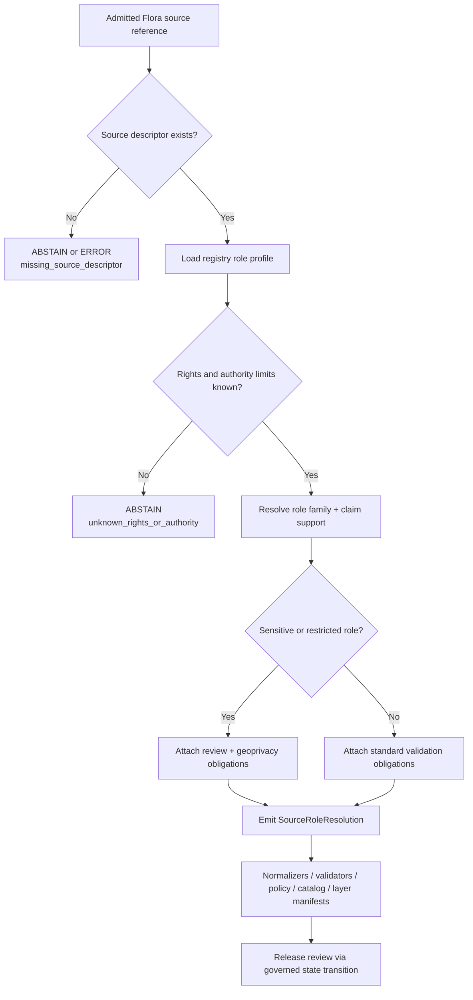

<!-- [KFM_META_BLOCK_V2]
doc_id: kfm://doc/NEEDS-VERIFICATION/packages-domains-flora-source-role-resolver-readme
title: Flora Source Role Resolver Package README
type: standard
version: v1
status: draft
owners: OWNER_TBD
created: 2026-06-14
updated: 2026-06-14
policy_label: public
related: [docs/domains/flora/README.md, docs/domains/flora/SOURCE_REGISTRY.md, docs/domains/flora/PUBLICATION_AND_POLICY.md, docs/domains/flora/PIPELINES_AND_LIFECYCLE.md, data/registry/flora/sources.yaml, data/registry/flora/source_roles.yaml, data/registry/flora/rights_profiles.yaml, data/registry/flora/sensitivity_policies.yaml, schemas/contracts/v1/domains/flora/, policy/domains/flora/, packages/domains/flora/normalizers/, packages/domains/flora/geoprivacy_transformer/, packages/domains/flora/layer_manifests/]
tags: [kfm, flora, packages, source-roles, evidence, provenance, policy, lifecycle]
notes: ["README-like package document; implementation depth remains NEEDS VERIFICATION until mounted repo files, package manifests, tests, and CI are inspected.", "This package classifies and resolves source-role context for downstream validation; it must not become the canonical source registry, schema home, policy home, release home, receipt home, proof home, or lifecycle-data store."]
[/KFM_META_BLOCK_V2] -->

# Flora Source Role Resolver

Resolve Flora source-role context before downstream normalization, validation, policy, geoprivacy, catalog, layer-manifest, Evidence Drawer, or Focus Mode behavior treats a record as evidence.

<p>
  
  
  
  
  
</p>

> [!IMPORTANT]
> **Status:** PROPOSED implementation package README  
> **Path:** `packages/domains/flora/source_role_resolver/README.md`  
> **Owning responsibility root:** `packages/`  
> **Domain lane:** `flora`  
> **Repo implementation depth:** NEEDS VERIFICATION — package code, tests, schemas, workflows, and runtime behavior were not inspected in this file-generation pass.

## Quick links

- [Scope](#scope)
- [Repo fit](#repo-fit)
- [Accepted inputs](#accepted-inputs)
- [Exclusions](#exclusions)
- [Resolver responsibilities](#resolver-responsibilities)
- [Role vocabulary](#role-vocabulary)
- [Resolution flow](#resolution-flow)
- [Outputs](#outputs)
- [Validation and quality gates](#validation-and-quality-gates)
- [Failure behavior](#failure-behavior)
- [Maintenance checklist](#maintenance-checklist)

---

## Scope

`source_role_resolver/` is the Flora domain package for deterministic source-role resolution helpers.

It receives an admitted Flora source reference, descriptor excerpt, payload envelope, or registry-backed source context and returns a bounded role decision that downstream systems can inspect.

It helps answer questions such as:

- Is this record an observation, specimen, herbarium record, survey record, regulatory status, conservation assessment, monitoring record, administrative boundary, model output, derived map, citizen-science contribution, historic interpretation, or generated summary?
- What can this source support without overclaiming?
- Which source roles require corroboration, steward review, sensitivity handling, rights checks, or public-geometry redaction before release?
- Is the source role strong enough for a proposed claim, map layer, Evidence Drawer payload, or Focus Mode answer?

This package does **not** decide publication by itself. It gives validators, policies, catalog builders, geoprivacy transforms, and release gates a consistent, reviewable source-role input.

```text
RAW -> WORK / QUARANTINE -> PROCESSED -> CATALOG / TRIPLET -> PUBLISHED
```

The resolver operates before consequential downstream use. It must preserve source identity and uncertainty rather than flattening source roles into generic “data.”

---

## Repo fit

```text
packages/domains/flora/source_role_resolver/
```

This path is appropriate for shared Flora implementation helpers used by pipelines, validators, test harnesses, governed API adapters, Evidence Drawer builders, Focus Mode guards, and layer-manifest builders.

| Relationship | Expected location | Resolver responsibility |
| --- | --- | --- |
| Source registry | `data/registry/flora/` or repo-standard source registry home | Read source descriptors and role profiles; do not own canonical registry records. |
| Semantic contracts | `contracts/` | Reference source-role meanings; do not redefine object semantics locally. |
| Machine-readable schemas | `schemas/contracts/v1/...` | Validate resolver inputs/outputs against canonical schemas; do not store canonical schemas here. |
| Policy and sensitivity | `policy/`, `policy/sensitivity/`, `data/registry/flora/sensitivity_policies.yaml` | Provide role context to policy; do not decide allow/deny alone. |
| Normalization | `packages/domains/flora/normalizers/` | Supply source-role context before records are normalized into candidate objects. |
| Geoprivacy | `packages/domains/flora/geoprivacy_transformer/` | Flag roles and source families that require redaction, generalization, withholding, or review. |
| Layer manifests | `packages/domains/flora/layer_manifests/` | Supply public-eligibility context and source-role trust badges for layer descriptors. |
| Receipts and proofs | `data/receipts/`, `data/proofs/` | Emit receipt/proof-ready decision payloads for the owning pipeline to persist. |
| Release and rollback | `release/` | Support release review and rollback lineage; never promote directly. |

> [!WARNING]
> Do not place canonical source descriptors, role registries, JSON Schemas, policy rules, lifecycle data, receipts, proofs, release manifests, rollback cards, or public artifacts inside this package. Their homes remain under their owning responsibility roots.

---

## Accepted inputs

The resolver should accept inputs only when source identity can be traced.

| Input family | Accepted shape | Required handling |
| --- | --- | --- |
| Source descriptor reference | `source_id`, version, descriptor digest, source role hints, rights, cadence, authority limits. | Resolve against registry; emit descriptor and registry references. |
| Source payload envelope | Source-native record envelope from a governed pipeline step. | Preserve source-native ID, batch ID, and input digest; never infer role solely from field names when descriptor context is missing. |
| Registry role profile | Role taxonomy, authority limits, corroboration rules, review requirements. | Use as role evidence, not as publication permission. |
| Claim context | Proposed use such as occurrence claim, taxon identity claim, range claim, status claim, layer manifest, Focus Mode answer. | Check whether source role can support the claim type. |
| Rights context | License, terms, redistribution status, access class, rights-holder notes. | Preserve unresolved rights as `NEEDS_VERIFICATION`; do not silently allow. |
| Sensitivity context | rare/protected/cultural/steward flags, controlled-access status, public geometry restrictions. | Surface review and geoprivacy obligations. |
| Run context | run ID, actor/service ID, resolver version, spec hash, timestamp. | Emit deterministic run metadata and input/output digests. |

Missing source descriptor, source role, rights, or evidence context should produce `ABSTAIN`, `DENY`, or `ERROR` according to the failure behavior below.

---

## Exclusions

This package must not become a parallel authority root.

| Do not put here | Correct home | Why |
| --- | --- | --- |
| Canonical source descriptors or source-role registries | `data/registry/flora/` or repo-standard source registry home | Registry authority must remain inspectable and separate from package code. |
| Object semantics | `contracts/` | Contract docs define meaning. |
| JSON Schemas | `schemas/contracts/v1/...` | Schema authority must not fork inside package docs. |
| Policy rules | `policy/` | Allow/deny/restrict/abstain rules require policy review and tests. |
| Test fixtures as canonical examples | `fixtures/` or repo-standard fixture home | Fixtures must remain visible to tests and validators. |
| Lifecycle data | `data/raw/`, `data/work/`, `data/quarantine/`, `data/processed/`, `data/catalog/`, `data/published/` | Package code cannot own lifecycle state. |
| Receipts and proofs | `data/receipts/`, `data/proofs/` | Trust-bearing evidence must remain audit-addressable. |
| Release manifests and rollback cards | `release/` | Publication remains a governed state transition. |
| Public API route ownership | `apps/` or repo-standard governed API surface | Resolver helpers may support API behavior but do not own deployable surfaces. |
| Generated summaries or AI answers | governed AI runtime / receipt surfaces | AI output is downstream and evidence-subordinate. |

---

## Resolver responsibilities

The resolver should be deterministic, inspectable, and conservative.

| Responsibility | Required behavior |
| --- | --- |
| Resolve source role | Map source descriptor + payload + claim context to one or more explicit source roles. |
| Preserve source limits | Carry authority limits, scope, cadence, rights, sensitivity, and review obligations forward. |
| Distinguish evidence types | Keep observations, specimens, surveys, regulatory records, models, derived maps, administrative records, and generated summaries distinct. |
| Block unsupported claim upgrades | Prevent weak/context/model/generated sources from being treated as primary observation truth. |
| Emit obligations | Return requirements such as corroboration, rights verification, steward review, geoprivacy transform, catalog closure, or citation resolution. |
| Support finite outcomes | Return `ANSWER`, `ABSTAIN`, `DENY`, or `ERROR`-style outcomes where used by the surrounding KFM runtime. |
| Preserve auditability | Include source refs, decision reason codes, input/output digest hints, and resolver version. |

---

## Role vocabulary

> [!NOTE]
> This table is a package-level working vocabulary. Canonical role names and enum values must be verified against KFM contracts, schemas, and source registries before implementation.

| Role family | Typical Flora use | Public-claim posture |
| --- | --- | --- |
| `primary_observation` | Field observation, specimen-backed occurrence, monitored plot, herbarium record. | Strong candidate only when evidence, rights, sensitivity, time, geometry, and review support the claim. |
| `corroborating_observation` | Secondary occurrence source, repeat survey, confirming checklist. | Supports confidence and conflict resolution; usually not sole authority for sensitive publication. |
| `administrative` | Agency boundary, county/jurisdiction, stewardship area, management unit. | Context only unless the claim is administrative. |
| `regulatory_status` | endangered/threatened/protected/invasive/legal status source. | Authoritative for status scope only; not occurrence truth. |
| `taxonomic_authority` | accepted name, synonym, rank, concept source. | Supports identity resolution; not occurrence truth. |
| `monitoring_reference` | monitoring program metadata, protocol, station/plot definition. | Supports method/protocol context and validity checks. |
| `scientific_interpretation` | research publication, expert assessment, model interpretation. | Interpretive support; citation required; not raw observation by default. |
| `derived_model` | range model, habitat suitability, vegetation index, predicted occurrence. | Must be labeled as model-derived; cannot be presented as observed truth. |
| `historic_interpretation` | historical flora record, archive note, legacy map/text interpretation. | Requires time and uncertainty labels; usually needs corroboration. |
| `generated_summary` | AI or generated narrative, extracted summary, derived explanation. | Never root truth; cite source evidence or abstain. |
| `restricted` | controlled-access source, sensitive rare-plant locality, protected steward record. | Deny or stage public access unless policy/review explicitly permits safe release. |

---

## Resolution flow



The resolver does not publish. It provides inspectable context for the next governed step.

---

## Outputs

A resolver output should be small, deterministic, and easy to validate.

```json
{
  "source_id": "SOURCE_ID_TBD",
  "source_descriptor_ref": "kfm://source/NEEDS-VERIFICATION",
  "resolver_version": "0.1.0-PROPOSED",
  "resolution_status": "PROPOSED",
  "outcome": "ANSWER",
  "role_family": "primary_observation",
  "role_confidence": "high",
  "claim_support": [
    "occurrence_observation_candidate"
  ],
  "authority_limits": [
    "not_title_truth",
    "not_taxonomic_authority"
  ],
  "obligations": [
    "validate_schema",
    "resolve_evidence_bundle",
    "check_rights",
    "check_sensitivity",
    "apply_geoprivacy_if_sensitive"
  ],
  "reason_codes": [
    "source_role_resolved"
  ],
  "input_digest": "sha256:NEEDS_VERIFICATION",
  "output_digest": "sha256:NEEDS_VERIFICATION"
}
```

> [!IMPORTANT]
> The example above is illustrative and `PROPOSED`. Field names, enum values, schema location, and digest rules must be verified against the repo’s canonical contracts and schemas before implementation.

---

## Validation and quality gates

| Gate | Check | Failure posture |
| --- | --- | --- |
| Descriptor resolution | `source_id` resolves to a descriptor or registry entry. | `ABSTAIN` for runtime; `DENY` promotion. |
| Role support | Role family can support the requested claim type. | `ABSTAIN` or `DENY` claim use. |
| Authority limits | Source-specific limits are carried forward. | `DENY` if limits are missing for consequential publication. |
| Rights state | Rights/license/access status is explicit. | `ABSTAIN` unknown rights; `DENY` prohibited release. |
| Sensitivity state | Sensitive or controlled-access source roles attach review/geoprivacy obligations. | `DENY` exact public disclosure; require transform receipt. |
| Evidence linkage | Resolution output includes source refs and evidence refs where required. | `ABSTAIN` insufficient evidence; `DENY` publication. |
| Determinism | Same input context produces same role result and digest. | `ERROR`; quarantine run output. |
| Anti-collapse | Generated/model/derived/context sources cannot be upgraded into observed truth. | `DENY` with `knowledge_character_mismatch`. |
| Fixture coverage | Valid, invalid, ambiguous, restricted, and conflict cases are tested with no live network. | `ERROR` in CI; do not promote. |

---

## Failure behavior

| Condition | Recommended outcome | Reason code examples |
| --- | --- | --- |
| Missing source descriptor | `ABSTAIN` or `ERROR` | `missing_source_descriptor`, `missing_source_id` |
| Unknown source role | `ABSTAIN` | `unknown_source_role`, `source_role_required` |
| Role cannot support claim | `DENY` | `source_role_claim_mismatch`, `knowledge_character_mismatch` |
| Model output presented as observation | `DENY` | `model_as_observation`, `derived_output_not_primary_evidence` |
| Generated summary used as evidence | `DENY` | `generated_text_not_evidence`, `ai_missing_evidence_bundle_or_citations` |
| Unknown rights | `ABSTAIN` runtime; `DENY` publication | `unknown_rights`, `missing_rights` |
| Sensitive/restricted source without review | `DENY` | `review_required`, `controlled_access_publication_denied` |
| Exact public geometry tied to restricted source | `DENY` | `precise_sensitive_location_denied`, `geoprivacy_required` |
| Conflicting roles across registry and payload | `QUARANTINE` or `ERROR` | `conflicting_source_role`, `registry_payload_conflict` |

---

## Implementation notes

Recommended package boundaries:

```text
source_role_resolver/
├── README.md
├── __init__.py                    # PROPOSED / language stack NEEDS VERIFICATION
├── resolver.py                    # PROPOSED deterministic resolver entry point
├── role_profiles.py               # PROPOSED role vocabulary adapter, not canonical registry
├── claim_support.py               # PROPOSED role × claim support matrix helpers
├── outcomes.py                    # PROPOSED finite outcomes / reason code helpers
└── tests/                         # PROPOSED only if package-local tests match repo convention
```

Language stack, package manager, and exact module layout remain **NEEDS VERIFICATION**. If the mounted repo uses TypeScript, Rust, Go, or a different Python layout, preserve the package responsibility but adapt filenames to the repo convention.

---

## Maintenance checklist

- [ ] Confirm this package path against current mounted repo structure.
- [ ] Confirm package language and module layout.
- [ ] Confirm canonical source-role enum names in contracts/schemas.
- [ ] Confirm source registry home and source descriptor fields.
- [ ] Confirm rights and sensitivity policy hooks.
- [ ] Add no-live-network fixtures for valid, missing, ambiguous, restricted, generated, and model-derived source cases.
- [ ] Add tests proving model/generated/context sources cannot become observed truth.
- [ ] Add tests proving sensitive/restricted roles attach geoprivacy and review obligations.
- [ ] Ensure outputs carry source refs, reason codes, and digest-ready metadata.
- [ ] Ensure no public path bypasses policy, EvidenceBundle resolution, review, release, correction, or rollback.

---

## Open verification items

| Item | Status | Evidence needed |
| --- | --- | --- |
| Canonical source-role vocabulary | NEEDS VERIFICATION | Mounted contracts, schemas, source registry, or ADR. |
| Exact schema home for resolver output | NEEDS VERIFICATION | ADR-0001 application and current repo scan. |
| Package language and test runner | UNKNOWN | Mounted `package.json`, `pyproject.toml`, workspaces, tests, and CI workflows. |
| Registry file names and fields | NEEDS VERIFICATION | `data/registry/flora/` or current source registry evidence. |
| Rights/sensitivity hooks | NEEDS VERIFICATION | Policy files, sensitivity registry, and deny/abstain fixtures. |
| Runtime/API use | UNKNOWN | Governed API routes, DTOs, logs, fixtures, or emitted envelopes. |

---

## Rollback

Rollback this package or its behavior if it:

- creates a parallel source registry;
- defines canonical source-role semantics outside contracts/registries;
- weakens cite-or-abstain behavior;
- lets generated/model/derived sources be
