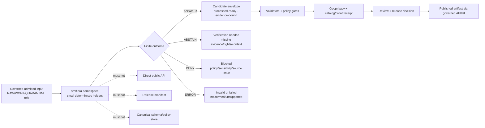

<!-- [KFM_META_BLOCK_V2]
doc_id: kfm://doc/NEEDS-VERIFICATION/packages-domains-flora-src-flora-readme
title: Flora Source Namespace README
type: standard
version: v1
status: draft
owners: OWNER_TBD
created: 2026-06-14
updated: 2026-06-14
policy_label: public
related: [packages/domains/flora/README.md, packages/domains/flora/normalizers/README.md, packages/domains/flora/geoprivacy_transformer/README.md, packages/domains/flora/source_role_resolver/README.md, packages/domains/flora/layer_manifests/README.md, docs/domains/flora/README.md, docs/domains/flora/DATA_MODEL.md, docs/domains/flora/PUBLICATION_AND_POLICY.md, schemas/contracts/v1/domains/flora/, policy/domains/flora/, tests/domains/flora/]
tags: [kfm, flora, packages, src-layout, python, namespace, evidence, policy]
notes: ["README-like source-namespace document; implementation depth remains NEEDS VERIFICATION until package manifests, module files, tests, and CI are inspected in a mounted repo.", "This namespace must not become a schema, policy, source-registry, lifecycle-data, release, receipt, proof, or publication authority.", "Placement follows the Directory Rules responsibility-root pattern for shared implementation packages; exact Python packaging conventions remain NEEDS VERIFICATION."]
[/KFM_META_BLOCK_V2] -->

# Flora Source Namespace

Source namespace for Flora implementation helpers that turn governed inputs into evidence-bound, policy-ready, public-safe candidates without becoming the truth source.

<p>
  
  
  
  
  
  
</p>

> [!IMPORTANT]
> **Status:** PROPOSED source-namespace README  
> **Path:** `packages/domains/flora/src/flora/README.md`  
> **Owning responsibility root:** `packages/`  
> **Domain lane:** `flora`  
> **Repo implementation depth:** NEEDS VERIFICATION — Python module files, packaging metadata, tests, CI, and runtime behavior were not inspected in this file-generation pass.

## Quick links

- [Scope](#scope)
- [Repo fit](#repo-fit)
- [Accepted inputs](#accepted-inputs)
- [Exclusions](#exclusions)
- [Namespace responsibilities](#namespace-responsibilities)
- [Proposed module map](#proposed-module-map)
- [Trust-boundary flow](#trust-boundary-flow)
- [Outcome contract](#outcome-contract)
- [Development notes](#development-notes)
- [Verification checklist](#verification-checklist)

---

## Scope

`src/flora/` is the proposed Python source namespace for reusable Flora domain helpers.

It should provide deterministic, no-network library code that can be reused by Flora pipelines, validators, tests, governed API adapters, map-layer builders, and review tooling. It should keep Flora-specific source roles, taxon identity, occurrence/specimen/survey distinctions, temporal context, spatial precision, rights, sensitivity, evidence references, and release blockers visible to downstream gates.

This namespace is an implementation carrier. It is not the source of truth.

```text
RAW -> WORK / QUARANTINE -> PROCESSED -> CATALOG / TRIPLET -> PUBLISHED
```

The namespace may help transform admitted inputs into governed candidates. It must not admit live sources by hidden side effect, persist lifecycle data as a private store, decide policy, publish artifacts, expose exact sensitive locations, or override EvidenceBundle, PolicyDecision, ReviewDecision, ReleaseManifest, receipt, proof, rollback, or correction surfaces.

---

## Repo fit

```text
packages/domains/flora/src/flora/
```

This path is appropriate for source code that belongs to the Flora package namespace under the `packages/` responsibility root.

| Relationship | Expected owner | Namespace responsibility |
| --- | --- | --- |
| Package wrapper | `packages/domains/flora/` | Owns package-level README, manifests, build metadata, and package-level composition when verified. |
| Python namespace | `packages/domains/flora/src/flora/` | Owns importable Flora helper modules if the repo uses Python `src/` layout. |
| Source admission | `connectors/`, `pipelines/`, `pipeline_specs/`, `data/raw/flora/`, `data/work/flora/`, `data/quarantine/flora/` | Consume admitted payloads or governed references only; do not fetch live sources here. |
| Normalization helpers | `packages/domains/flora/normalizers/` and/or `src/flora/normalizers/` after repo convention is verified | Normalize source payloads without publishing them. |
| Source-role resolution | `packages/domains/flora/source_role_resolver/` and/or `src/flora/source_role_resolver/` after repo convention is verified | Preserve source roles and source authority limits. |
| Geoprivacy helpers | `packages/domains/flora/geoprivacy_transformer/` and/or `src/flora/geoprivacy/` after repo convention is verified | Support redaction/generalization without becoming policy law. |
| Layer manifests | `packages/domains/flora/layer_manifests/` and/or `src/flora/layer_manifests/` after repo convention is verified | Build public-safe layer-manifest payloads from released or release-candidate inputs only. |
| Schemas | `schemas/contracts/v1/domains/flora/` | Canonical machine shape; do not copy schemas into this namespace. |
| Contracts | `contracts/domains/flora/` | Canonical meaning; do not redefine object semantics here. |
| Policy | `policy/domains/flora/` | Allow/deny/restrict/abstain law; this namespace only prepares inputs for policy. |
| Fixtures and tests | `fixtures/domains/flora/`, `tests/domains/flora/`, or repo-confirmed equivalents | Deterministic no-network verification for package behavior. |
| Receipts and proofs | `data/receipts/`, `data/proofs/` | Pipeline-owned persistence; namespace functions may return receipt-ready payloads but must not create a parallel home. |
| Release and rollback | `release/` | Promotion, rollback, correction, and withdrawal authority; namespace code cannot publish. |

> [!WARNING]
> Do not use this namespace as a hidden authority root for schemas, policy rules, source registries, lifecycle data, evidence bundles, receipts, proofs, release manifests, rollback cards, or public artifacts.

---

## Accepted inputs

Functions in this namespace should accept explicit, inspectable inputs. Hidden global state and live network calls should be avoided unless a future ADR and test harness approve them.

| Input family | Accepted examples | Required handling |
| --- | --- | --- |
| Admitted source payloads | Source-native rows, JSON, CSV rows, GeoJSON features, or controlled work envelopes | Preserve source-native IDs, raw field names when needed, input digest, batch ID, and source reference. |
| Source context | `source_id`, source role, source descriptor reference, rights profile, cadence, authority limits | Preserve context as supplied; do not infer authority from field names alone. |
| Evidence context | EvidenceRef list, EvidenceBundle reference, citation requirement, proof/receipt references | Keep evidence closure visible; return `ABSTAIN` when evidence support is missing. |
| Taxon context | Accepted/provisional taxon IDs, synonym/crosswalk version, rank system, authority | Preserve uncertainty and crosswalk version; do not flatten taxon identity into occurrence truth. |
| Temporal context | observed time, valid time, source update time, retrieval time, run time, release time | Preserve time semantics and precision; do not collapse event time into release time. |
| Spatial context | internal geometry ref, CRS, precision bucket, uncertainty, locality text, exposure class | Keep exact/internal and public-safe geometry separate. |
| Rights and sensitivity context | rare/protected flags, license hints, steward flags, access restrictions, review obligations | Treat as policy inputs, not release approval. |
| Run context | run ID, actor/service ID, package version, spec hash, timestamp, input/output digests | Emit deterministic, audit-ready metadata. |

---

## Exclusions

| Do not put here | Correct home or owner |
| --- | --- |
| Live source clients, API polling, scraping, credentials, service tokens | `connectors/`, `pipelines/`, `pipeline_specs/`, `configs/`, secret manager or deployment environment. |
| RAW, WORK, QUARANTINE, PROCESSED, CATALOG, TRIPLET, PUBLISHED data | `data/<phase>/flora/` or repo-confirmed lifecycle stores. |
| Canonical JSON Schemas | `schemas/contracts/v1/domains/flora/`. |
| Semantic contracts | `contracts/domains/flora/`. |
| Source registry and rights registry | `data/registry/flora/` or `data/registry/sources/flora/`. |
| Policy rules and access decisions | `policy/domains/flora/`. |
| Repo-wide validators and CI orchestration | `tools/validators/`, `.github/workflows/`, `tests/`, or repo-confirmed equivalents. |
| EvidenceBundle, proof, receipt, and run-persistence stores | `data/proofs/`, `data/receipts/`, `runtime/`, or pipeline-owned stores. |
| Release manifests, rollback cards, correction notices | `release/`. |
| Public API routes, UI panels, MapLibre shell, Evidence Drawer components | `apps/`, `packages/ui/`, `packages/maplibre/`, or repo-confirmed app/component roots. |

---

## Namespace responsibilities

This namespace should be small, typed, deterministic, and easy to test.

| Responsibility | Expected behavior | Failure posture |
| --- | --- | --- |
| Normalize | Convert admitted Flora payloads into schema-ready candidate envelopes. | `ABSTAIN` or `ERROR` instead of guessing. |
| Resolve source role | Preserve source-role meaning and source authority limits. | `ABSTAIN` when source role cannot be resolved. |
| Preserve evidence | Carry EvidenceRef and citation requirements forward. | `ABSTAIN` when evidence closure is required but missing. |
| Preserve time semantics | Keep observed, valid, source, retrieval, run, release, and correction time distinct where material. | `ABSTAIN` or mark stale/unknown rather than flattening time. |
| Preserve spatial safety | Keep internal geometry and public-safe geometry separate. | `DENY` or `ABSTAIN` public exposure when sensitivity/precision is unclear. |
| Prepare policy inputs | Return policy-ready fields and reason codes. | Do not decide policy locally. |
| Prepare layer-manifest inputs | Return public-eligibility and render-context hints for released or release-candidate artifacts. | Do not emit public map layers directly. |
| Emit receipt-ready metadata | Return run/spec/input/output digest metadata for pipeline receipt writers. | Do not persist receipts in this namespace. |

---

## Proposed module map

> [!NOTE]
> The module map below is PROPOSED. Reconcile it with the actual package manifest, existing sibling package directories, import style, and tests before implementation.

```text
packages/domains/flora/src/flora/
├── README.md
├── __init__.py                     # PROPOSED: thin package exports only
├── py.typed                        # PROPOSED: typed package marker if Python typing is used
├── outcomes.py                     # PROPOSED: ANSWER / ABSTAIN / DENY / ERROR envelopes
├── identifiers.py                  # PROPOSED: deterministic candidate ID helpers
├── evidence.py                     # PROPOSED: EvidenceRef/EvidenceBundle reference helpers, not evidence storage
├── temporal.py                     # PROPOSED: time semantics and precision helpers
├── spatial.py                      # PROPOSED: geometry metadata, precision buckets, exposure classes
├── taxon.py                        # PROPOSED: taxon identity and crosswalk helpers
├── normalizers/                    # PROPOSED: importable normalizer modules, if not kept as sibling package
├── source_role_resolver/           # PROPOSED: source role helpers, if not kept as sibling package
├── geoprivacy/                     # PROPOSED: safe wrappers around geoprivacy transform helpers
└── layer_manifests/                # PROPOSED: manifest-building helpers, not public release authority
```

### Export rule

Keep `__init__.py` intentionally boring. It should expose stable, reviewed package surfaces only. Do not export experimental modules, hidden source clients, mutable registries, or anything that implies publication authority.

Illustrative only:

```python
# PROPOSED example only — synchronize with actual package code before use.
from flora.outcomes import FloraOutcome, FloraOutcomeStatus

__all__ = [
    "FloraOutcome",
    "FloraOutcomeStatus",
]
```

---

## Trust-boundary flow



---

## Outcome contract

All public functions should prefer explicit finite outcomes over exceptions for expected governance failures. Exceptions are still appropriate for programming errors, but domain uncertainty should be represented in reviewable results.

| Outcome | Use when | Downstream expectation |
| --- | --- | --- |
| `ANSWER` | The helper produced a valid candidate or transformation result for the requested internal profile. | Continue to schema validation, policy, geoprivacy, catalog/proof, review, and release gates. |
| `ABSTAIN` | Required evidence, source role, rights, sensitivity, temporal, geometry, or authority context is missing or inconclusive. | Hold in work/quarantine or route to verification. |
| `DENY` | The input or requested operation is known unsafe, disallowed, rights-blocked, sensitivity-blocked, or profile-incompatible. | Do not promote. Preserve denial reason and receipt where required. |
| `ERROR` | The input is malformed, unsupported, fails structural validation, or the helper fails unexpectedly. | Stop processing; preserve diagnostics safely. |

Reason codes should be stable, searchable, and suitable for receipts and tests, for example:

```text
flora.normalized.answer
flora.evidence.abstain_missing_evidence_ref
flora.source_role.abstain_unknown_role
flora.geoprivacy.deny_sensitive_exact_public_geometry
flora.input.error_malformed_payload
```

---

## Development notes

### Design rules

- Keep functions deterministic and side-effect-light.
- Prefer typed, explicit data structures over loose dictionaries at public boundaries.
- Require source context as a parameter; do not infer source authority from the payload alone.
- Preserve raw/source-native identifiers and field names where needed for audit and correction.
- Keep exact/internal geometry separate from public-safe geometry.
- Keep source role, evidence character, taxon identity, occurrence evidence, modeled surfaces, range maps, and public layer manifests distinct.
- Return finite outcomes instead of publishing, persisting, or silently dropping records.
- Avoid network calls in namespace helpers; live source behavior belongs in connectors or pipelines.
- Avoid global mutable registries unless they are loaded from governed registry artifacts and tested with fixtures.

### Proposed local checks

> [!CAUTION]
> Commands are PROPOSED until the mounted repo confirms package manager, test runner, and paths.

```bash
# PROPOSED: run package-level tests once the repo test convention is confirmed.
python -m pytest tests/domains/flora packages/domains/flora -q
```

```bash
# PROPOSED: run type checks only if the repo uses mypy/pyright or an equivalent gate.
python -m mypy packages/domains/flora/src/flora
```

```bash
# PROPOSED: run schema/policy validators through the repo's confirmed validator entry point.
python tools/validators/validate_flora_package.py --package packages/domains/flora
```

---

## Definition of done

- [ ] Target path confirmed against Directory Rules and current repo tree.
- [ ] Package manifest confirms whether `src/flora/` is the active import namespace.
- [ ] `__init__.py` exports only stable, reviewed surfaces.
- [ ] No module performs hidden live source fetches.
- [ ] No module stores lifecycle data, schemas, policy, source registries, receipts, proofs, releases, or rollback records locally.
- [ ] Helpers return finite outcomes with stable reason codes.
- [ ] EvidenceRef, source role, rights, sensitivity, temporal, and spatial safety context are preserved.
- [ ] Exact/internal geometry cannot be emitted as public-safe geometry without explicit geoprivacy and policy gates.
- [ ] No-network fixtures cover `ANSWER`, `ABSTAIN`, `DENY`, and `ERROR` cases.
- [ ] Tests cover malformed input, missing source role, missing evidence, sensitive geometry, ambiguous taxon identity, stale time context, and release-blocked records.
- [ ] Documentation links from package README and adjacent Flora helper READMEs are updated.

---

## Verification checklist

- [ ] Confirm whether this repo uses Python `src/` layout for domain packages.
- [ ] Confirm actual package manager and test runner.
- [ ] Confirm whether sibling package directories should be mirrored under `src/flora/` or imported through adapters.
- [ ] Confirm canonical schema paths under `schemas/contracts/v1/domains/flora/`.
- [ ] Confirm semantic contract paths under `contracts/domains/flora/`.
- [ ] Confirm policy paths under `policy/domains/flora/`.
- [ ] Confirm source registry paths under `data/registry/flora/` or `data/registry/sources/flora/`.
- [ ] Confirm test and fixture homes.
- [ ] Confirm package-level ownership and CODEOWNERS coverage.
- [ ] Confirm CI gates for schema validation, tests, policy checks, no-network discipline, and public-safety checks.

---

## Rollback

Rollback is required if this namespace begins to act as a hidden authority root, bypasses policy/release gates, leaks exact sensitive geometry, silently fetches live sources, publishes candidate objects as truth, or creates divergent schema/policy/source-registry definitions.

Rollback target: `ROLLBACK_TARGET_TBD_AFTER_REPO_INSPECTION`

Minimum rollback action:

1. Revert the package code or README change that created the authority drift.
2. Restore previous imports or compatibility shims if downstream package users depend on them.
3. File or update `docs/registers/DRIFT_REGISTER.md` when placement or authority conflict caused the rollback.
4. Preserve any emitted receipts/proofs/correction notes required by the affected pipeline.
5. Add a regression fixture so the same bypass cannot reappear silently.

---

## Maintainer notes

- This README describes the intended namespace boundary, not verified runtime behavior.
- Keep the namespace boring: small helpers, explicit inputs, finite outcome
