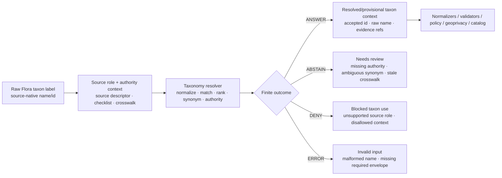

<!-- [KFM_META_BLOCK_V2]
doc_id: kfm://doc/NEEDS-VERIFICATION/packages-domains-flora-taxonomy-readme
title: Flora Taxonomy Package README
type: standard
version: v1
status: draft
owners: OWNER_TBD
created: 2026-06-14
updated: 2026-06-14
policy_label: public
related: [docs/domains/flora/README.md, docs/domains/flora/DATA_MODEL.md, docs/domains/flora/SOURCE_REGISTRY.md, docs/domains/flora/VALIDATION.md, data/registry/flora/taxonomy.yaml, data/registry/flora/taxon_authorities.yaml, data/registry/flora/source_roles.yaml, schemas/contracts/v1/domains/flora/, policy/domains/flora/, packages/domains/flora/normalizers/, packages/domains/flora/source_role_resolver/, packages/domains/flora/geoprivacy_transformer/, packages/domains/flora/layer_manifests/]
tags: [kfm, flora, packages, taxonomy, taxon, crosswalks, evidence, uncertainty]
notes: ["README-like package document; implementation depth remains NEEDS VERIFICATION until mounted repo files, package manifests, tests, and CI are inspected.", "This package provides taxonomic identity and reconciliation helpers; it must not become the canonical taxon authority registry, schema home, policy home, release home, receipt home, proof home, or lifecycle-data store."]
[/KFM_META_BLOCK_V2] -->

# Flora Taxonomy

Resolve Flora taxonomic identity, naming, synonymy, authority crosswalks, and uncertainty before any occurrence, specimen, range, layer, Evidence Drawer, or Focus Mode output treats a plant name as a supported claim.

<p>
  
  
  
  
  
</p>

> [!IMPORTANT]
> **Status:** PROPOSED implementation package README  
> **Path:** `packages/domains/flora/taxonomy/README.md`  
> **Owning responsibility root:** `packages/`  
> **Domain lane:** `flora`  
> **Repo implementation depth:** NEEDS VERIFICATION — package code, tests, schemas, workflows, taxon authority registries, and runtime behavior were not inspected in this file-generation pass.

## Quick links

- [Scope](#scope)
- [Repo fit](#repo-fit)
- [Accepted inputs](#accepted-inputs)
- [Exclusions](#exclusions)
- [Taxonomy responsibilities](#taxonomy-responsibilities)
- [Reconciliation flow](#reconciliation-flow)
- [Authority and confidence model](#authority-and-confidence-model)
- [Output expectations](#output-expectations)
- [Validation and quality gates](#validation-and-quality-gates)
- [Failure behavior](#failure-behavior)
- [Maintenance checklist](#maintenance-checklist)
- [Verification checklist](#verification-checklist)
- [Rollback](#rollback)

---

## Scope

`taxonomy/` is the Flora domain package for deterministic plant taxon identity helpers.

It supports tasks such as:

- preserving source-native taxon names and identifiers;
- reconciling raw scientific names, common names, synonyms, historic names, and accepted names;
- recording authority, rank, crosswalk version, and uncertainty;
- distinguishing accepted identity from occurrence evidence, specimen evidence, range maps, vegetation communities, model outputs, and generated explanations;
- returning finite, reviewable outcomes when names are ambiguous, unsupported, stale, contradicted, or unresolved.

This package helps KFM avoid a common botanical data failure: treating a name string as if it were a resolved, evidence-backed plant taxon.

```text
RAW -> WORK / QUARANTINE -> PROCESSED -> CATALOG / TRIPLET -> PUBLISHED
```

Taxonomy helpers may operate in WORK, QUARANTINE, or PROCESSED-building stages. They must not publish, overwrite source evidence, collapse taxonomic uncertainty, or hide authority conflicts.

---

## Repo fit

```text
packages/domains/flora/taxonomy/
```

This path is appropriate for reusable Flora package code that resolves taxonomic identity for pipelines, validators, normalizers, Evidence Drawer builders, Focus Mode guards, layer-manifest builders, and review tooling.

| Relationship | Expected location | Taxonomy package responsibility |
| --- | --- | --- |
| Taxon authority registry | `data/registry/flora/` or repo-confirmed authority registry home | Read pinned authority/crosswalk references; do not own canonical registry data. |
| Source roles and source limits | `data/registry/flora/source_roles.yaml` or repo-confirmed source registry | Preserve which source can support naming, occurrence, status, range, or model claims. |
| Semantic contracts | `contracts/domains/flora/` or shared contract home | Reference taxon/crosswalk meaning; do not redefine semantics locally. |
| Machine-readable schemas | `schemas/contracts/v1/domains/flora/` or shared schema home | Validate inputs/outputs against canonical schemas; do not store canonical schemas here. |
| Normalizers | `packages/domains/flora/normalizers/` | Provide resolved/provisional taxon context to candidate normalization. |
| Source-role resolver | `packages/domains/flora/source_role_resolver/` | Consume role decisions so weak sources are not upgraded into authority. |
| Geoprivacy transformer | `packages/domains/flora/geoprivacy_transformer/` | Preserve rare/protected taxon signals that may require redaction, withholding, or steward review. |
| Layer manifests | `packages/domains/flora/layer_manifests/` | Provide public-safe taxon labels and evidence/authority state for map layer descriptors. |
| Tests and fixtures | `tests/domains/flora/`, `fixtures/domains/flora/`, or repo-confirmed equivalents | Use no-network fixtures for accepted names, synonyms, ambiguous matches, and authority conflicts. |
| Receipts and proofs | `data/receipts/`, `data/proofs/` | Emit receipt/proof-ready payloads for owning pipelines; do not persist trust objects locally. |
| Release and rollback | `release/` | Support release review and rollback lineage; never promote directly. |

> [!WARNING]
> Do not place canonical taxon authority files, source registries, JSON Schemas, policy rules, lifecycle data, receipts, proofs, release manifests, rollback cards, or public artifacts inside this package. Their homes remain under their owning responsibility roots.

---

## Accepted inputs

Taxonomy helpers should accept explicit, inspectable values passed by governed callers.

| Input family | Accepted shape | Required handling |
| --- | --- | --- |
| Raw taxon label | Source-provided scientific name, common name, hybrid notation, variety/subspecies text, or historic name. | Preserve the raw label and source-native field name. |
| Source taxon identifier | Provider taxon ID, herbarium taxon code, NatureServe-like concept ID, GBIF-like key, or local checklist ID. | Preserve source-native identifier and authority namespace; do not assume cross-authority equivalence. |
| Authority context | Pinned authority file, checklist version, source descriptor, taxonomic backbone, or curated crosswalk reference. | Require version/digest where available; mark unpinned authority as `NEEDS_VERIFICATION`. |
| Source-role decision | Whether the source can support naming, occurrence, status, range, model, or interpretation claims. | Prevent unsupported source-role upgrades. |
| Temporal context | Valid time of name usage, source update time, retrieval time, run time, release time, correction time. | Keep temporal meanings separate where material. |
| Evidence context | EvidenceRefs, EvidenceBundle references, source descriptor references, citation obligations. | Preserve evidence closure requirements; abstain when support is missing. |
| Sensitivity context | Rare/protected/steward-reviewed taxon flags, review obligations, public-label limits. | Treat as policy inputs, not as release approval. |
| Run context | run ID, actor/service ID, package version, spec hash, input digest, timestamp. | Emit deterministic run metadata and output digest. |

Missing authority, crosswalk, source role, rights/sensitivity, or evidence context should return a finite failure outcome instead of silently producing an accepted taxon.

---

## Exclusions

This package is an implementation helper, not a truth authority.

| Do not put here | Correct home or owner | Why |
| --- | --- | --- |
| Canonical plant taxonomy registry or checklist data | `data/registry/flora/` or repo-confirmed registry home | Registry data must remain inspectable and versioned outside package code. |
| Source descriptors and source roles | `data/registry/flora/` or `data/registry/sources/flora/` | Source authority and rights are governance data, not package internals. |
| Object-family contracts | `contracts/` | Contracts define meaning. |
| JSON Schemas | `schemas/contracts/v1/...` | Schemas define machine-checkable shape. |
| Policy rules and release permissions | `policy/` and `release/` | Taxon resolution does not decide publication. |
| RAW, WORK, QUARANTINE, PROCESSED, CATALOG, TRIPLET, or PUBLISHED data | `data/<phase>/flora/` | Package code cannot own lifecycle state. |
| Receipts, proofs, EvidenceBundles, catalog matrices | `data/receipts/`, `data/proofs/`, `data/catalog/` | Trust-bearing objects must remain audit-addressable. |
| Public API routes, MapLibre styles, UI components | `apps/`, `packages/ui/`, `packages/maplibre/`, or repo-confirmed app/component homes | Taxonomy helpers may support public payloads but must not own public surfaces. |
| Generated summaries or AI answers | governed AI runtime / response envelope surfaces | AI is downstream and evidence-subordinate. |

---

## Taxonomy responsibilities

| Responsibility | Required behavior |
| --- | --- |
| Preserve raw names | Carry source-native name strings forward even when a preferred/accepted name is resolved. |
| Resolve accepted/provisional identity | Return accepted, synonym, unresolved, ambiguous, conflict, or rejected status with reason codes. |
| Preserve authority | Include authority namespace, version, digest, source role, and crosswalk reference. |
| Model uncertainty | Make confidence, ambiguity, rank uncertainty, homonym risk, and stale authority visible. |
| Keep object families distinct | Do not treat a resolved taxon as occurrence evidence, specimen evidence, conservation status, range, habitat, or model output. |
| Avoid source-role upgrades | Do not let a weak or contextual source become taxonomic authority without corroboration/review. |
| Emit review obligations | Flag taxon conflicts, rare/protected indicators, missing authority, or human review requirements. |
| Support rollback | Preserve enough input/output digests and crosswalk versions to reverse or supersede taxon decisions. |

---

## Reconciliation flow



The output is taxon context, not public truth by itself. Downstream gates still decide validation, policy, geoprivacy, catalog closure, release, and public API exposure.

---

## Authority and confidence model

Taxonomic resolution should be explicit about the kind of match and the confidence burden.

| Resolution state | Meaning | Required next step |
| --- | --- | --- |
| `accepted` | Raw/source name maps cleanly to a pinned accepted taxon identity. | Preserve raw name, authority, version, evidence, and digest. |
| `synonym` | Raw/source name maps to an accepted identity through a pinned synonym relation. | Preserve synonym relationship, authority, and temporal validity if known. |
| `provisional` | A likely identity exists but support is incomplete or authority confidence is limited. | Allow controlled downstream review; do not publish as authoritative without review. |
| `ambiguous` | Multiple plausible taxa or name concepts match. | Return `ABSTAIN` and require steward or rule-backed disambiguation. |
| `unresolved` | No acceptable authority-backed match exists. | Quarantine or route to verification; do not fabricate a taxon. |
| `conflicted` | Authorities disagree materially or a crosswalk conflict is detected. | Preserve conflict details, block silent promotion, and require review/ADR if structural. |
| `rejected` | Source-provided name is invalid for the requested claim path. | Return `DENY` with reason codes and evidence/context. |

### Reason-code examples

> [!NOTE]
> Reason-code names below are PROPOSED until synchronized with canonical schemas and validator vocabulary.

| Reason code | Typical trigger |
| --- | --- |
| `flora.taxonomy.accepted_match` | Authority-backed accepted identity found. |
| `flora.taxonomy.synonym_match` | Synonym maps to accepted identity. |
| `flora.taxonomy.ambiguous_name` | Multiple plausible matches. |
| `flora.taxonomy.unresolved_name` | No authority-backed match. |
| `flora.taxonomy.authority_unpinned` | Authority or crosswalk lacks version/digest. |
| `flora.taxonomy.rank_conflict` | Source rank differs materially from accepted rank. |
| `flora.taxonomy.homonym_risk` | Name requires disambiguation because multiple concepts may share wording. |
| `flora.taxonomy.stale_crosswalk` | Crosswalk is older than allowed freshness policy. |
| `flora.taxonomy.source_role_insufficient` | Source role cannot support requested taxonomic claim. |
| `flora.taxonomy.review_required` | Human/steward review required before promotion. |

---

## Output expectations

The canonical schema belongs outside this package. Semantically, successful taxonomy resolution should produce an envelope with these sections.

| Section | Required purpose |
| --- | --- |
| `resolution` | Outcome, resolver version, spec hash, reason codes, confidence class, review obligations. |
| `source_context` | Source ID, source role, source record ID, authority limits, descriptor and registry refs. |
| `raw_name` | Source-native name, common-name text, name field, verbatim label, source taxon ID. |
| `resolved_taxon` | Accepted/provisional taxon ID, scientific name, rank, authority namespace, authority version/digest. |
| `crosswalk` | Crosswalk ID, relation type, synonym or accepted-name mapping, temporal validity if available. |
| `uncertainty` | Ambiguity, homonym risk, rank conflict, stale state, confidence class, review need. |
| `sensitivity` | Rare/protected/steward-review signals passed downstream for policy/geoprivacy. |
| `evidence` | EvidenceRefs, citation obligations, source descriptor refs, EvidenceBundle requirements. |
| `digests` | Input digest, authority digest, crosswalk digest, output digest. |
| `next_gates` | Required normalization, validation, policy, geoprivacy, catalog, review, and release gates. |

### Illustrative resolution envelope

> [!NOTE]
> This example is illustrative. Field names must be synchronized with canonical Flora schemas before implementation.

```yaml
resolution:
  outcome: ANSWER
  state: synonym
  resolver_version: 0.1.0-PROPOSED
  spec_hash: sha256:SPEC_HASH_TBD
  reason_codes:
    - flora.taxonomy.synonym_match
source_context:
  source_id: flora.source.SOURCE_ID_TBD
  source_role: observation_context
  source_record_id: SOURCE_RECORD_ID_TBD
raw_name:
  verbatim_taxon_label: "RAW_NAME_TBD"
  source_taxon_id: SOURCE_TAXON_ID_TBD
resolved_taxon:
  taxon_id: kfm://flora/taxon/TAXON_ID_TBD
  scientific_name: "ACCEPTED_NAME_TBD"
  rank: species
  authority_namespace: AUTHORITY_NAMESPACE_TBD
  authority_version: AUTHORITY_VERSION_TBD
crosswalk:
  crosswalk_id: kfm://flora/taxon-crosswalk/CROSSWALK_ID_TBD
  relation: synonym_of
  digest: sha256:CROSSWALK_DIGEST_TBD
uncertainty:
  confidence_class: reviewable
  review_required: false
sensitivity:
  rare_or_protected_hint: NEEDS_VERIFICATION
  downstream_policy_required: true
evidence:
  evidence_refs:
    - kfm://evidence/NEEDS-VERIFICATION
next_gates:
  - flora.normalization
  - flora.taxonomy_validation
  - flora.rights_sensitivity_policy
  - flora.geoprivacy_if_sensitive
  - flora.catalog_closure
```

---

## Validation and quality gates

Taxonomy helpers should be covered by no-network fixtures and deterministic tests.

| Gate | Test pressure | Failure behavior |
| --- | --- | --- |
| Authority pinned | Authority/crosswalk has version, digest, and source reference. | `ABSTAIN` or `ERROR` if missing, depending on caller contract. |
| Raw-name preservation | Raw/source-native label remains available after resolution. | `ERROR` if dropped. |
| Synonym mapping | Known synonym fixture resolves to expected accepted identity. | `ERROR` if deterministic fixture fails. |
| Ambiguity detection | Ambiguous fixture returns `ABSTAIN`, not a fabricated accepted taxon. | `ABSTAIN`. |
| Source-role guard | Context-only/model/generated source cannot be promoted to taxonomic authority. | `DENY` for unsupported claim path. |
| Stale authority handling | Stale crosswalk triggers reason code and review obligation. | `ABSTAIN` unless policy allows controlled review. |
| Rare/protected flag propagation | Sensitive taxon hints flow to policy/geoprivacy inputs. | `DENY` or `ABSTAIN` if the flag is lost. |
| Digest stability | Same input + same authority version produces the same output digest. | `ERROR` if unstable. |
| No public leak | Exact sensitive location is never inferred or emitted by taxonomy helpers. | `DENY` / `ERROR` depending on exposure path. |

### Minimum fixture set

- [ ] accepted-name match fixture;
- [ ] synonym-to-accepted-name fixture;
- [ ] common-name ambiguity fixture;
- [ ] homonym/conflict fixture;
- [ ] stale authority fixture;
- [ ] unresolved-name fixture;
- [ ] rare/protected taxon hint fixture;
- [ ] source-role-insufficient fixture;
- [ ] deterministic digest fixture;
- [ ] rollback/supersession fixture for a changed crosswalk.

---

## Failure behavior

Every resolver call should return a finite outcome envelope.

| Outcome | Meaning | Required handling |
| --- | --- | --- |
| `ANSWER` | Resolution succeeded with enough authority context for the requested internal use. | Still not public by itself; downstream validation/policy/release gates apply. |
| `ABSTAIN` | Required authority, evidence, source role, review, or freshness support is missing or inconclusive. | Route to verification, quarantine, or steward review. |
| `DENY` | The requested taxonomic claim path is disallowed, unsupported, sensitive without policy support, or source-role-incompatible. | Do not emit accepted public taxon context for the request. |
| `ERROR` | Input is malformed, authority file is unreadable, schema fails, or deterministic resolution logic fails. | Stop processing and preserve diagnostics for internal review. |

> [!CAUTION]
> A resolved taxon is not an observation. A specimen label is not a range map. A vegetation model is not specimen evidence. A generated sum
