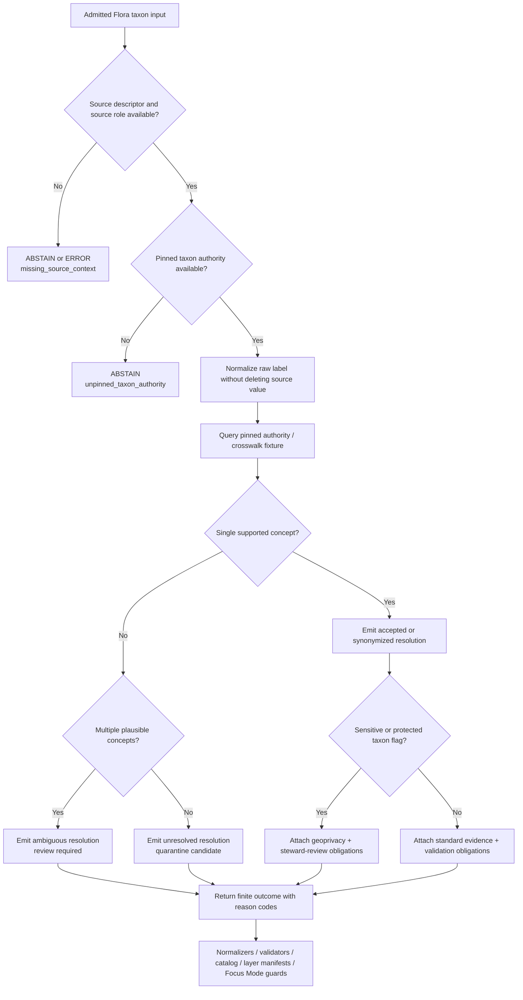

<!-- [KFM_META_BLOCK_V2]
doc_id: kfm://doc/NEEDS-VERIFICATION/packages-domains-flora-taxonomy-resolver-readme
title: Flora Taxonomy Resolver Package README
type: standard
version: v1
status: draft
owners: OWNER_TBD
created: 2026-06-14
updated: 2026-06-14
policy_label: public
related: [docs/domains/flora/README.md, docs/domains/flora/DATA_MODEL.md, docs/domains/flora/SOURCE_REGISTRY.md, docs/domains/flora/PUBLICATION_AND_POLICY.md, docs/domains/flora/PIPELINES_AND_LIFECYCLE.md, data/registry/flora/taxon_authorities.yaml, data/registry/flora/source_roles.yaml, data/registry/flora/sensitivity_policies.yaml, schemas/contracts/v1/domains/flora/, policy/domains/flora/, packages/domains/flora/taxonomy/, packages/domains/flora/normalizers/, packages/domains/flora/source_role_resolver/, packages/domains/flora/geoprivacy_transformer/, packages/domains/flora/layer_manifests/]
tags: [kfm, flora, packages, taxonomy-resolver, taxon, reconciliation, evidence, uncertainty]
notes: ["README-like package document; implementation depth remains NEEDS VERIFICATION until mounted repo files, package manifests, tests, taxon registries, CI, and runtime behavior are inspected.", "This package resolves plant taxon identity for downstream normalization and validation; it must not become the canonical taxon authority registry, schema home, policy home, release home, receipt home, proof home, or lifecycle-data store."]
[/KFM_META_BLOCK_V2] -->

# Flora Taxonomy Resolver

Resolve raw Flora taxon names, identifiers, synonyms, ranks, and authority crosswalks into bounded taxon decisions without turning a name match into unsupported botanical truth.

<p>
  
  
  
  
  
  
</p>

> [!IMPORTANT]
> **Status:** PROPOSED implementation package README  
> **Path:** `packages/domains/flora/taxonomy_resolver/README.md`  
> **Owning responsibility root:** `packages/`  
> **Domain lane:** `flora`  
> **Repo implementation depth:** NEEDS VERIFICATION — package code, package metadata, tests, schemas, registry files, CI workflows, and runtime behavior were not inspected in this file-generation pass.

## Quick links

- [Scope](#scope)
- [Repo fit](#repo-fit)
- [Accepted inputs](#accepted-inputs)
- [Exclusions](#exclusions)
- [Resolver responsibilities](#resolver-responsibilities)
- [Resolution flow](#resolution-flow)
- [Output contract sketch](#output-contract-sketch)
- [Confidence and finite outcomes](#confidence-and-finite-outcomes)
- [Validation and quality gates](#validation-and-quality-gates)
- [Failure behavior](#failure-behavior)
- [Maintenance checklist](#maintenance-checklist)
- [Verification checklist](#verification-checklist)
- [Rollback](#rollback)

---

## Scope

`taxonomy_resolver/` is the Flora domain package for deterministic taxon-resolution helpers.

It receives source-native Flora naming evidence and returns a bounded taxon-resolution decision for downstream normalizers, validators, EvidenceBundle builders, geoprivacy transforms, layer manifests, Evidence Drawer payloads, Focus Mode guards, and steward-review tools.

It helps KFM answer questions such as:

- What raw name or identifier did the source provide?
- Which taxonomic authority or crosswalk was used?
- Is the result accepted, synonymized, unresolved, ambiguous, deprecated, contradicted, or review-required?
- What taxon concept, rank, and validity interval can be cited?
- What evidence, source role, rights, sensitivity, or steward review is still required before the result can support a public claim?

This package must preserve the distinction between:

- a raw source label;
- a taxon concept or accepted name;
- a synonym or historic name;
- an occurrence or specimen;
- a legal/status assertion;
- a range or modeled surface;
- a public-safe layer label;
- an AI-generated explanation.

```text
RAW -> WORK / QUARANTINE -> PROCESSED -> CATALOG / TRIPLET -> PUBLISHED
```

The resolver may support WORK, QUARANTINE, and PROCESSED-building stages. It must not publish, promote, overwrite source evidence, collapse taxonomic uncertainty, or hide authority conflicts.

---

## Repo fit

```text
packages/domains/flora/taxonomy_resolver/
```

This path is appropriate for reusable Flora package code because taxon resolution is shared implementation behavior used by multiple pipelines and deployables. It belongs under `packages/`, with `flora` as a domain segment inside the responsibility root.

| Relationship | Expected location | Taxonomy resolver responsibility |
| --- | --- | --- |
| Taxon authority registry | `data/registry/flora/taxon_authorities.yaml` or repo-confirmed registry home | Read pinned authority metadata and crosswalk references; do not own registry data. |
| Source role registry | `data/registry/flora/source_roles.yaml` or repo-confirmed source registry home | Respect whether a source can support taxonomy, occurrence, status, model, or public label claims. |
| Semantic contracts | `contracts/domains/flora/` or repo-confirmed shared contract home | Reference taxon and crosswalk meanings; do not redefine object semantics locally. |
| Machine schemas | `schemas/contracts/v1/domains/flora/` or repo-confirmed schema home | Validate resolver inputs/outputs; do not store canonical schemas here. |
| Taxonomy helpers | `packages/domains/flora/taxonomy/` | Reuse lower-level identity and crosswalk helpers when present. |
| Normalizers | `packages/domains/flora/normalizers/` | Provide resolved/provisional taxon context for normalized candidate objects. |
| Source-role resolver | `packages/domains/flora/source_role_resolver/` | Consume source-role decisions so source limits are not upgraded into taxon truth. |
| Geoprivacy transformer | `packages/domains/flora/geoprivacy_transformer/` | Pass rare/protected/steward flags that may require redaction, withholding, or review. |
| Layer manifests | `packages/domains/flora/layer_manifests/` | Provide public-safe taxon labels and taxon-support metadata, not release permission. |
| Tests and fixtures | `tests/domains/flora/`, `fixtures/domains/flora/`, or repo-confirmed equivalents | Exercise accepted, synonym, ambiguous, stale, and deny cases with no-network fixtures. |
| Receipts and proofs | `data/receipts/`, `data/proofs/` | Emit receipt/proof-ready resolution summaries for owning pipelines to persist. |
| Release and rollback | `release/` | Support review, correction, supersession, and rollback; never promote directly. |

> [!WARNING]
> Do not place canonical taxon authority files, source registries, JSON Schemas, policy rules, lifecycle data, receipts, proofs, release manifests, rollback cards, or public artifacts inside this package. Those files belong to their owning responsibility roots.

---

## Accepted inputs

The resolver should accept explicit, inspectable inputs from governed callers.

| Input family | Accepted shape | Required handling |
| --- | --- | --- |
| Raw taxon label | Scientific name, common name, hybrid notation, rank text, cultivar text, historic spelling, author string, or source-native label. | Preserve exactly as supplied; normalize into separate fields without deleting the raw label. |
| Source taxon identifier | Provider key, checklist ID, herbarium concept ID, collection code, local taxon number, or authority-specific ID. | Preserve namespace and source ID; do not assume cross-authority equivalence. |
| Taxon authority context | Authority name, authority version, crosswalk digest, source descriptor reference, retrieval time, valid interval. | Require version/digest where available; mark unpinned authority as `NEEDS_VERIFICATION`. |
| Source-role decision | Whether the source can support naming, occurrence, status, range, model, or public display claims. | Prevent unsupported source-role upgrades. |
| Evidence context | EvidenceRefs, EvidenceBundle references, citation obligations, source descriptor refs, run receipt refs. | Preserve evidence closure requirements; return finite outcomes when support is missing. |
| Temporal context | Observed/source time, valid time, retrieval time, resolver run time, release time, correction time. | Keep time meanings separate where material. |
| Sensitivity context | Rare/protected/steward-reviewed taxon flags, controlled-access notes, public-label restrictions. | Treat as policy inputs, not publication approval. |
| Run context | run ID, actor/service ID, resolver version, spec hash, input digest, timestamp. | Emit deterministic, audit-ready metadata and reason codes. |

Missing authority, source role, evidence context, or rights/sensitivity context should produce a bounded failure outcome rather than silently producing an accepted taxon.

---

## Exclusions

This package is an implementation helper, not a taxonomic or publication authority.

| Do not put here | Correct home or owner | Why |
| --- | --- | --- |
| Canonical taxon authority registry or checklist data | `data/registry/flora/` or repo-confirmed registry home | Registry data must remain inspectable, versioned, and separate from package code. |
| Source descriptors and source roles | `data/registry/flora/` or `data/registry/sources/flora/` | Source authority and rights are governance data, not package internals. |
| Object-family contracts | `contracts/` | Contracts define meaning. |
| JSON Schemas | `schemas/contracts/v1/...` | Schemas define machine-checkable shape. |
| Policy rules and release decisions | `policy/` and `release/` | Taxon resolution does not decide publication. |
| RAW, WORK, QUARANTINE, PROCESSED, CATALOG, TRIPLET, or PUBLISHED data | `data/<phase>/flora/` | Package code cannot own lifecycle state. |
| Receipts, proofs, EvidenceBundles, catalog matrices | `data/receipts/`, `data/proofs/`, `data/catalog/` | Trust-bearing objects must remain audit-addressable. |
| API routes, UI components, MapLibre styles, public layer artifacts | `apps/`, `ui/`, `web/`, or repo-confirmed equivalents | Resolver code may support these surfaces; it does not own them. |
| AI explanations | Governed AI runtime and receipt surfaces | Generated language remains evidence-subordinate. |

---

## Resolver responsibilities

The taxonomy resolver should be conservative, deterministic, and reviewable.

| Responsibility | Required behavior |
| --- | --- |
| Preserve raw names | Never discard source-native taxon labels, authorship text, source field names, or provider IDs. |
| Resolve against pinned authority | Use a declared authority/crosswalk version or return `ABSTAIN` / `NEEDS_VERIFICATION`. |
| Represent uncertainty | Distinguish accepted, synonym, ambiguous, unresolved, deprecated, stale, contradicted, and review-required outcomes. |
| Keep role boundaries | Do not let a weak source role become a taxonomic authority, legal status source, or occurrence proof. |
| Preserve temporal meaning | Keep authority version, valid interval, observed/source/retrieval/run/release/correction times separate where material. |
| Carry sensitivity signals | Preserve rare/protected/steward-reviewed flags for geoprivacy and policy gates. |
| Emit finite outcomes | Return answer/abstain/deny/error-compatible results with reason codes. |
| Support auditability | Include source refs, evidence refs, authority refs, input/output digests, resolver version, and spec hash where available. |

---

## Resolution flow



The resolver does not publish. It creates inspectable taxon-resolution context for the next governed step.

---

## Output contract sketch

> [!NOTE]
> This is an illustrative output shape, not a canonical schema. Confirm the actual schema home and field names before implementation.

```json
{
  "resolution_id": "kfm://flora/taxon-resolution/sha256:NEEDS_VERIFICATION",
  "outcome": "ANSWER",
  "status": "accepted",
  "reason_codes": ["single_supported_taxon_concept"],
  "input": {
    "raw_taxon_label": "Asclepias syriaca",
    "source_id": "SOURCE_ID_TBD",
    "source_record_id": "SOURCE_RECORD_ID_TBD"
  },
  "authority": {
    "authority_id": "TAXON_AUTHORITY_TBD",
    "authority_version": "NEEDS_VERIFICATION",
    "authority_digest": "sha256:NEEDS_VERIFICATION"
  },
  "resolved_taxon": {
    "accepted_taxon_id": "TAXON_ID_TBD",
    "accepted_scientific_name": "Asclepias syriaca",
    "rank": "species",
    "name_status": "accepted"
  },
  "confidence": {
    "level": "high",
    "basis": ["exact_authority_match"]
  },
  "obligations": [
    "validate_schema",
    "resolve_evidence_bundle",
    "check_rights",
    "check_sensitivity",
    "preserve_raw_name"
  ],
  "evidence_refs": ["kfm://evidence/NEEDS-VERIFICATION"],
  "policy_inputs": {
    "rare_or_protected_flag": "NEEDS_VERIFICATION",
    "public_label_ok": "NEEDS_VERIFICATION"
  },
  "run_context": {
    "resolver_version": "0.1.0-PROPOSED",
    "spec_hash": "sha256:NEEDS_VERIFICATION",
    "input_digest": "sha256:NEEDS_VERIFICATION"
  }
}
```

---

## Confidence and finite outcomes

The resolver should use confidence and outcome labels to keep uncertainty visible.

| Case | Preferred outcome | Required downstream behavior |
| --- | --- | --- |
| Exact match to pinned authority and source role can support taxon identity | `ANSWER` with `accepted` or `synonymized` status | Continue to validation; still require rights, sensitivity, evidence, and release checks. |
| Multiple plausible taxa or competing authorities | `ABSTAIN` or `ANSWER` with `ambiguous` only for internal review | Quarantine or steward review; do not publish as a resolved public taxon. |
| Raw label cannot be matched | `ABSTAIN` with `unresolved_taxon` | Preserve raw label; route to review or quarantine. |
| Authority is missing, unpinned, stale, or digest-unverified | `ABSTAIN` with `authority_unverified` | Block public use until authority is verified. |
| Source role cannot support taxon identity for the proposed claim | `DENY` or `ABSTAIN` with `source_role_unsupported` | Prevent claim upgrade; require stronger evidence. |
| Restricted or sensitive taxon is requested for exact public output | `DENY` with `sensitive_taxon_public_exact_blocked` | Route to geoprivacy transform and steward/release review. |
| Malformed payload or impossible state | `ERROR` with `malformed_taxon_input` | Fix caller or fixture; do not silently coerce. |

---

## Validation and quality gates

Resolver changes should not be considered ready until they pass no-network validation.

| Gate | What to prove |
| --- | --- |
| Schema conformance | Input and output shapes match canonical schemas or documented fixture contracts. |
| Authority pinning | Every successful resolution cites a pinned authority/crosswalk version or digest. |
| Raw preservation | Source-native labels and identifiers remain available after normalization. |
| Ambiguity handling | Ambiguous and unresolved names produce reviewable finite outcomes, not silent accepted names. |
| Source-role safety | Weak or incompatible source roles cannot support stronger taxon claims. |
| Sensitivity propagation | Rare/protected/steward flags travel into downstream policy/geoprivacy obligations. |
| Evidence closure | Public-claim candidates include EvidenceRefs or abstain. |
| Determinism | Same pinned input + authority + spec hash produces the same resolution ID and output digest. |
| No-network CI | Tests run against committed fixtures, not live source endpoints. |
| Rollback readiness | Corrections and authority-version changes can mark prior resolutions stale without deleting history. |

### Suggested no-network fixture set

```text
fixtures/domains/flora/taxonomy_resolver/
├── valid/
│   ├── accepted_exact_match.json
│   ├── synonym_to_accepted.json
│   ├── source_taxon_id_match.json
│   └── historic_name_with_valid_interval.json
├── invalid/
│   ├── missing_raw_taxon_label.json
│   ├── missing_source_id.json
│   ├── unpinned_authority.json
│   └── malformed_rank.json
├── ambiguous/
│   ├── same_name_multiple_concepts.json
│   └── conflicting_authorities.json
└── policy/
    ├── sensitive_taxon_public_exact_denied.json
    └── weak_source_role_cannot_support_taxon_truth.json
```

---

## Failure behavior

Fail closed when the resolver cannot support the requested use.

| Failure | Outcome | Reason code |
| --- | --- | --- |
| Missing source descriptor | `ABSTAIN` or `ERROR` | `missing_source_descriptor` |
| Missing taxon authority | `ABSTAIN` | `missing_taxon_authority` |
| Authority not pinned or digest mismatch | `ABSTAIN` or `ERROR` | `authority_not_pinned` / `authority_digest_mismatch` |
| Multiple plausible concepts | `ABSTAIN` | `ambiguous_taxon_concept` |
| Source role cannot support proposed claim | `DENY` or `ABSTAIN` | `source_role_unsupported` |
| Sensitive taxon requested for exact public output | `DENY` | `sensitive_exact_location_blocked` |
| Rights or publication state missing for outward use | `DENY` or `ABSTAIN` | `rights_or_release_state_missing` |
| Resolver exception or malformed payload | `ERROR` | `malformed_taxon_resolution_input` |

---

## Maintenance checklist

- [ ] Keep raw taxon labels and source-native identifiers visible in every resolution output.
- [ ] Update fixture digests when authority or crosswalk fixtures change.
- [ ] Add new reason codes before relying on them in policy or release gates.
- [ ] Keep resolver outputs compatible with normalizers, geoprivacy transforms, layer manifests, Evidence Drawer payloads, and Focus Mode guards.
- [ ] Verify taxonomy changes do not silently reclassify released artifacts without correction/supersession handling.
- [ ] Maintain no-network tests for accepted, synonym, ambiguous, unresolved, sensitive, and unsupported-source-role cases.
- [ ] Keep package docs synchronized with `docs/domains/flora/DATA_MODEL.md`, source registry docs, schema docs, and policy docs after repo inspection.

---

## Verification checklist

- [ ] Confirm `pa
