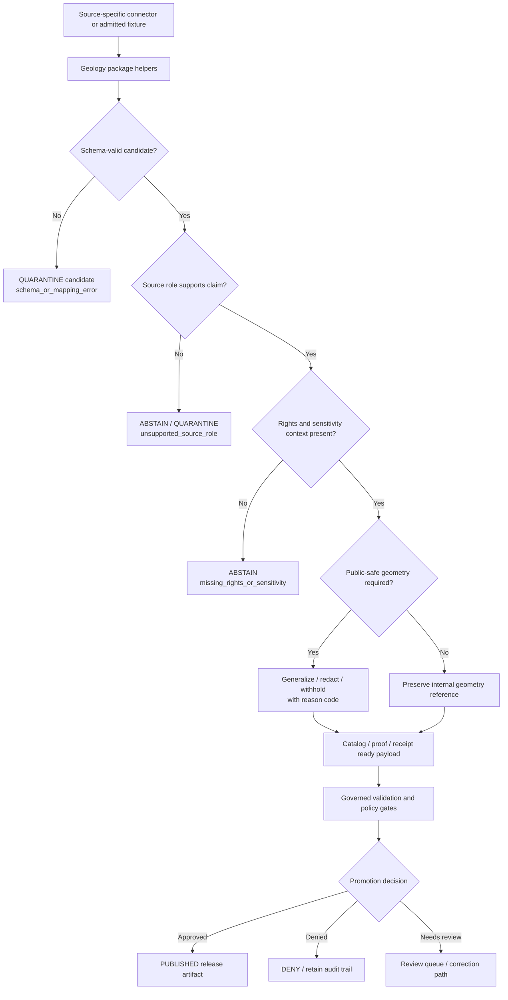

<!-- [KFM_META_BLOCK_V2]
doc_id: kfm://doc/NEEDS-VERIFICATION/packages-domains-geology-readme
title: Geology Domain Package README
type: standard
version: v1
status: draft
owners: OWNER_TBD
created: 2026-06-14
updated: 2026-06-14
policy_label: public
related: [docs/domains/geology/README.md, docs/architecture/geology/TRUST_PATH.md, docs/architecture/geology/DATA_LIFECYCLE.md, docs/adr/ADR-geology-schema-home.md, docs/adr/ADR-geology-source-role-model.md, docs/adr/ADR-geology-public-safe-geometry.md, schemas/contracts/v1/geology/, contracts/domains/geology/, policy/geology/, data/registry/geology/, tests/geology/]
tags: [kfm, geology, natural-resources, packages, source-roles, evidence, policy, public-safe-geometry]
notes: ["README-like package entrypoint for the Geology and Natural Resources domain package.", "Target path is user-requested and Directory Rules-compatible as a package/domain segment, but actual repo package layout remains NEEDS VERIFICATION until a mounted repo confirms package metadata, imports, tests, and CI.", "This package may contain shared implementation helpers only; it must not become a schema, contract, policy, source-registry, lifecycle-data, release, receipt, proof, or public-publication authority."]
[/KFM_META_BLOCK_V2] -->

# Geology Domain Package

Shared implementation package for KFM geology and non-biological natural-resource helpers that preserve evidence, source roles, temporal scope, public-safe geometry, and release boundaries.

<p>
  
  
  
  
  
  
</p>

> [!IMPORTANT]
> **Status:** PROPOSED package README  
> **Path:** `packages/domains/geology/README.md`  
> **Owning responsibility root:** `packages/`  
> **Domain lane:** `geology`  
> **Repo implementation depth:** NEEDS VERIFICATION — package metadata, package manager, imports, tests, schemas, policies, registries, CI workflows, API routes, UI bindings, generated receipts, proof objects, and runtime behavior were not inspected in this file-generation pass.

## Quick links

- [Scope](#scope)
- [Repo fit](#repo-fit)
- [Accepted inputs](#accepted-inputs)
- [Exclusions](#exclusions)
- [Package responsibilities](#package-responsibilities)
- [Source-role anti-collapse rules](#source-role-anti-collapse-rules)
- [Trust-boundary flow](#trust-boundary-flow)
- [Proposed directory map](#proposed-directory-map)
- [Finite outcomes](#finite-outcomes)
- [Validation and quality gates](#validation-and-quality-gates)
- [Development rules](#development-rules)
- [Definition of done](#definition-of-done)
- [Verification checklist](#verification-checklist)
- [Rollback](#rollback)

---

## Scope

`packages/domains/geology/` is the shared implementation package lane for geology and non-biological natural-resource helpers.

This package may contain reusable code that helps KFM ingest, normalize, classify, validate, prepare, explain, and hand off geology/resource candidates to governed downstream systems. It does **not** own truth, source authority, policy, lifecycle state, public publication, release approval, or AI answers.

The package may support these geology/resource knowledge families:

- bedrock geology;
- surficial geology;
- stratigraphic units and correlations;
- lithology and geologic age;
- structures, contacts, faults, folds, and map boundaries;
- geomorphology where geology-bearing;
- borehole, well-log, core, measured-section, geophysical, and geochemical references;
- mineral occurrences and resource-deposit references;
- resource estimates and classification support;
- extraction-site and reclamation context;
- public-safe generalized geology/resource layer preparation;
- EvidenceBundle-aware DTO preparation;
- MapLibre / Evidence Drawer / Focus Mode support payloads after policy and release controls.

```text
RAW -> WORK / QUARANTINE -> PROCESSED -> CATALOG / TRIPLET -> PUBLISHED
```

The package may help create WORK, QUARANTINE, PROCESSED, catalog-ready, proof-ready, receipt-ready, or layer-manifest-ready payloads. It must not publish, promote, bypass review, or turn generated summaries, model outputs, map tiles, graph edges, or public layer labels into sovereign truth.

---

## Repo fit

```text
packages/domains/geology/
```

This path is appropriate for shared implementation helpers because `packages/` owns reusable library code and `geology` is a domain segment inside that responsibility root.

| Relationship | Expected home | Boundary rule |
| --- | --- | --- |
| Shared package helpers | `packages/domains/geology/` | Owns reusable implementation code only. |
| Domain documentation | `docs/domains/geology/` | Explains domain purpose, file map, stewardship, and lane boundaries. |
| Architecture docs | `docs/architecture/geology/` | Explains trust path, object model, lifecycle, and integration design. |
| ADRs | `docs/adr/ADR-geology-*.md` | Records schema-home, source-role, public-safe-geometry, and doc-lineage decisions. |
| Semantic contracts | `contracts/domains/geology/` or repo-confirmed contract home | Defines object meaning; package code references, not redefines. |
| Machine schemas | `schemas/contracts/v1/geology/` or repo-confirmed schema home | Defines machine-checkable shape; package code validates against it. |
| Source registries | `data/registry/geology/` or repo-confirmed source-registry home | Owns source identity, rights, role, cadence, caveats, sensitivity, and activation state. |
| Policy | `policy/geology/` or repo-confirmed policy home | Decides allow / deny / restrict / abstain and public-safe geometry rules. |
| Lifecycle data | `data/raw/geology/`, `data/work/geology/`, `data/quarantine/geology/`, `data/processed/geology/`, `data/catalog/.../geology/`, `data/published/geology/` | Stores evidence-bearing and released data by lifecycle phase. |
| Receipts and proofs | `data/receipts/geology/`, `data/proofs/geology/`, or repo-confirmed trust-object homes | Stores process memory and release-significant proof artifacts. |
| Release decisions and rollback | `release/` | Owns release manifests, promotion decisions, correction notices, and rollback targets. |
| Pipelines and source activation | `pipelines/geology/`, `pipeline_specs/geology/`, `connectors/` | Owns executable flows, declarative pipeline config, and source-specific fetch/admission code. |
| Tests and fixtures | `tests/geology/`, `fixtures/domains/geology/`, or repo-confirmed equivalents | Proves package behavior with deterministic no-network fixtures. |

> [!WARNING]
> This package must not become a shortcut around `schemas/`, `contracts/`, `policy/`, `data/registry/`, lifecycle directories, `data/receipts/`, `data/proofs/`, or `release/`. If a helper starts owning one of those responsibilities, split the file into the correct root and record the move.

---

## Accepted inputs

Package functions should accept explicit, inspectable values from governed callers. Inputs should be deterministic and should carry source, evidence, temporal, spatial, and run context instead of relying on ambient global state.

| Input family | Accepted examples | Required handling |
| --- | --- | --- |
| Source descriptors | `source_id`, source role, rights profile, caveat text, authority limit, activation state | Treat source role as a hard boundary; do not infer stronger authority from a convenient field. |
| Geology candidate records | Geologic unit rows, boundary features, borehole references, well-log metadata, mineral occurrence references, resource estimates, extraction/reclamation context | Preserve raw/source fields and normalized fields separately. |
| Evidence context | EvidenceRef, EvidenceBundle reference, citation requirement, input digest, source descriptor ref | Preserve evidence closure requirements and return bounded outcomes when evidence is missing. |
| Spatial context | Internal geometry reference, CRS, scale, resolution, uncertainty, source map scale, generalized geometry, redaction class | Keep exact/internal and public-safe geometry separate. |
| Temporal context | Observed time, map publication date, source update time, valid interval, retrieval time, run time, release time | Do not collapse these into one timestamp. |
| Resource context | classification scheme, reserve/resource status, confidence, reporting basis, production/permit/lease relation | Do not treat administrative or production records as physical geology truth. |
| Policy context | sensitivity tier, public-safe geometry profile, release class, review burden, deny/abstain reason codes | Treat as policy inputs, not publication approval. |
| Run context | run ID, package version, actor/service ID, spec hash, input/output digests, timestamp | Emit receipt-ready metadata for the owning pipeline to persist. |

Missing source role, evidence context, public-safe geometry context, or rights/sensitivity context should produce a finite failure outcome rather than a silent best-effort public output.

---

## Exclusions

| Do not put here | Correct home or owner | Why |
| --- | --- | --- |
| Live source fetchers, scrapers, credentials, or source-specific admission code | `connectors/`, `pipelines/geology/`, `pipeline_specs/geology/`, `configs/`, secret-management infrastructure | Source activation is governed and source-specific, not package-local convenience code. |
| RAW, WORK, QUARANTINE, PROCESSED, CATALOG, TRIPLET, PUBLISHED data | `data/<phase>/geology/` | Lifecycle state must remain auditable outside package source. |
| Source descriptors, source-role registries, rights/cadence/sensitivity registers | `data/registry/geology/` or repo-confirmed source-registry home | Source authority and rights are governance data. |
| Semantic contracts | `contracts/domains/geology/` or repo-confirmed contract home | Contracts define meaning. |
| JSON Schemas | `schemas/contracts/v1/geology/` or repo-confirmed schema home | Schemas define machine shape. |
| Policy rules, release policies, public-safe geometry law | `policy/geology/` | Policy owns allow/deny/restrict/abstain decisions. |
| Proofs, receipts, EvidenceBundle stores, catalog matrices | `data/proofs/`, `data/receipts/`, `data/catalog/` | Trust objects must remain independently addressable. |
| Release manifests, promotion decisions, correction notices, rollback cards | `release/` | Publication is a governed state transition, not a package side effect. |
| Public API routes, UI components, MapLibre styles, Focus Mode answer surfaces | `apps/`, `ui/`, `web/`, or repo-confirmed equivalents | Package code may prepare DTOs but does not own public interfaces. |
| AI prompts or generated geology explanations as truth | Governed AI runtime and AIReceipt surfaces | Generated language is interpretive and evidence-subordinate. |

---

## Package responsibilities

The package should be conservative, deterministic, evidence-aware, and easy to test.

| Responsibility | Expected behavior |
| --- | --- |
| Normalize source payloads | Convert source-native geology/resource fields into typed candidate objects without deleting raw values or caveats. |
| Preserve source roles | Keep observations, interpretations, regulatory/administrative rows, production records, models, and public visualizations distinct. |
| Maintain deterministic identity | Build or support stable IDs from source ID, object family, spatial/temporal scope, version, and digest-bearing inputs. |
| Represent uncertainty | Preserve map scale, geometry uncertainty, stratigraphic uncertainty, resource confidence, and classification caveats. |
| Keep temporal semantics separate | Retain source publication date, observation date, retrieval time, run time, valid interval, release time, and supersession time where material. |
| Prepare public-safe geometry | Support generalized/redacted/withheld output candidates only when policy context and reason codes are present. |
| Prepare catalog-ready payloads | Build STAC/DCAT/PROV-ready or layer-manifest-ready fragments for owning catalog/release systems. |
| Prepare receipt/proof-ready metadata | Return input digests, output digests, spec hash, run ID, reason codes, source refs, and evidence refs for the owning pipeline to persist. |
| Fail closed | Return `ABSTAIN`, `DENY`, or `ERROR` when evidence, source role, policy, rights, sensitivity, or schema support is insufficient. |

---

## Source-role anti-collapse rules

The most important geology package rule is to keep source character visible.

| Source character | Can support | Must not be treated as |
| --- | --- | --- |
| Geologic map interpretation | Interpreted unit/contact/structure claims within stated scale/date/caveat | Direct observation at unlimited precision. |
| Borehole / well-log / core reference | Evidence of a logged or sampled subsurface record | Public-safe exact location or complete subsurface truth without review. |
| Geophysical / geochemical measurement | Measurement evidence under method, instrument, and processing caveats | Resource reserve proof by itself. |
| Mineral occurrence record | Occurrence/reference evidence with source caveats | Active extraction site, reserve estimate, or public claim of economic value. |
| Resource estimate | A classified estimate under a named scheme and date | Physical geology fact independent of its classification and reporting basis. |
| Permit / lease / regulatory row | Administrative or legal context | Physical geology or resource existence proof. |
| Production record | Reported extraction/production evidence | Geologic unit boundary, reserve, ownership, or title truth. |
| Modeled potential surface | Derived interpretation or analytical hypothesis | Known deposit, reserve, or observed occurrence. |
| Public map layer | Released visualization artifact | Canonical truth, release decision, evidence bundle, or policy authority. |
| AI summary | Interpretive downstream language | Evidence, policy, review, release, or source authority. |

> [!CAUTION]
> Resource and extraction-related claims are high-burden. A package helper may classify, normalize, or flag them for review; it must not promote them to public fact without evidence closure, source-role fit, policy approval, review state, and release state.

---

## Trust-boundary flow



This package sits inside the implementation layer. It prepares governed candidates and metadata; it does not own promotion, publication, public API delivery, UI rendering, or AI answer authority.

---

## Proposed directory map

> [!NOTE]
> The tree below is PROPOSED. Confirm package metadata, language layout, imports, tests, and sibling package conventions before treating it as implemented.

```text
packages/domains/geology/
├── README.md
├── pyproject.toml                  # NEEDS VERIFICATION: if package-local Python metadata is used
├── package.json                    # NEEDS VERIFICATION: if package-local JS/TS metadata is used
├── src/                            # PROPOSED: source layout, if repo convention supports it
│   └── geology/
│       ├── __init__.py
│       ├── identity.py             # deterministic identity helpers
│       ├── normalizers.py          # source-native -> candidate mapping helpers
│       ├── source_roles.py         # source-role enforcement helpers
│       ├── public_safe_geometry.py # redaction/generalization helper interfaces
│       ├── resources.py            # resource-classification support helpers
│       ├── catalog_payloads.py     # catalog/layer-manifest payload prep
│       └── outcomes.py             # finite outcome and reason-code helpers
├── normalizers/                    # PROPOSED: split package if repo prefers module folders
├── source_role_resolver/           # PROPOSED: source-role helper package
├── geometry_safety/                # PROPOSED: public-safe geometry helpers
├── layer_manifests/                # PROPOSED: layer-manifest helper package
├── resource_classification/        # PROPOSED: resource estimate/classification helpers
└── docs/                           # NEEDS VERIFICATION: only package-local developer notes, not domain authority docs
```

If the mounted repository uses a different package layout, preserve the responsibility boundaries above and update this README instead of forcing this exact tree.

---

## Finite outcomes

Package helpers should return finite, inspectable outcomes rather than free-form success/failure strings.

| Outcome | Meaning | Typical reason codes |
| --- | --- | --- |
| `ANSWER` | Candidate/helper output is complete enough for the next governed step. | `schema_valid`, `source_role_supported`, `public_safe_geometry_ready` |
| `ABSTAIN` | The helper cannot produce a safe supported output. | `missing_evidence`, `missing_source_role`, `unpinned_authority`, `missing_rights_context`, `time_scope_unsupported` |
| `DENY` | The requested output should not proceed under current policy/source/sensitivity conditions. | `exact_sensitive_geometry`, `unsupported_resource_claim`, `rights_blocked`, `policy_denied` |
| `ERROR` | The helper failed due to invalid input, parse failure, missing dependency, or internal error. | `schema_error`, `parse_error`, `mapping_error`, `dependency_error` |
| `NEEDS_REVIEW` | Steward review is required before proceeding. | `resource_estimate_high_burden`, `borehole_location_sensitive`, `source_caveat_conflict`, `classification_scheme_unverified` |

---

## Validation and quality gates

Before package outputs are used by a pipeline, API, UI, Focus Mode, map layer, catalog object, proof object, or release candidate, validate at least:

- [ ] source descriptor reference is present;
- [ ] source role supports the requested claim class;
- [ ] object-family schema validation passes;
- [ ] raw/source fields are preserved when normalized fields are produced;
- [ ] geometry includes CRS, scale/resolution, uncertainty, and public-safe exposure class;
- [ ] exact/internal geometry is never used directly in a public layer payload;
- [ ] temporal semantics are not collapsed into a single generic timestamp;
- [ ] resource classification uses a named scheme and review state;
- [ ] rights and sensitivity context are present;
- [ ] EvidenceRef / EvidenceBundle requirements are preserved;
- [ ] receipt/proof-ready metadata includes input digest, output digest, spec hash, run ID, and reason codes;
- [ ] no package helper writes directly to `data/published/`, `data/proofs/`, `data/receipts/`, or `release/`;
- [ ] no public API, UI, or AI answer reads package output as sovereign truth without governed validation and release state.

---

## Development rules

1. Keep helpers side-effect-light and deterministic.
2. Prefer typed inputs and outputs over loosely shaped dictionaries when repo conventions permit.
3. Preserve raw source values alongside normalized values.
4. Return structured reason codes with every abstain, deny, review, or error outcome.
5. Do not fetch live external sources from package helpers unless a connector/pipeline explicitly owns that behavior.
6. Do not hard-code source authority, rights, cadence, sensitivity, policy, release, or schema values in package code.
7. Do not import app/UI/runtime modules into this package; dependencies should point inward to contracts, schemas, and helper utilities only after verification.
8. Keep tests no-network and fixture-driven by default.
9. Treat resource, borehole, well-log, extraction, and exact-location outputs as sensitive until policy proves otherwise.
10. Make rollback and correction possible by preserving input and output digests.

---

## Definition of done

This package README is ready to move from draft toward active when:

- [ ] the mounted repo confirms `packages/domains/geology/` as the desired package home;
- [ ] package language and metadata files are confirmed;
- [ ] sibling package layout is confirmed;
- [ ] schema-home ADR is accepted or linked;
- [ ] source-role ADR is accepted or linked;
- [ ] public-safe-geometry ADR is accepted or linked;
- [ ] source registry paths are confirmed;
- [ ] policy paths and test fixtures are confirmed;
- [ ] no-network package tests cover pass, abstain, deny, review, and error outcomes;
- [ ] at least one offline fixture proves a complete candidate handoff without live source activation;
- [ ] release, receipt, proof, catalog, and rollback homes are not duplicated inside the package.

---

## Verification checklist

- [ ] Confirm target path exists in the mounted repo or create it in a PR that cites Directory Rules.
- [ ] Confirm package owner and CODEOWNERS entry.
- [ ] Confirm package manager and local manifest convention.
- [ ] Confirm imports and namespace layout.
- [ ] Confirm adjacent geology docs and ADR paths.
- [ ] Confirm canonical schema and contract homes.
- [ ] Confirm geology source registry and source-role registry paths.
- [ ] Confirm public-safe geometry policy and redaction receipt schema.
- [ ] Confirm tests/fixtures homes and no-network fixture strategy.
- [ ] Confirm no generated data, source descriptors, policy rules, release manifests, receipts, proofs, or public artifacts are placed under this package.
- [ ] Confirm rollback target and correction path for any release-significant outputs that depend on package behavior.

---

## Rollback

Rollback is required if this package weakens source integrity, creates schema/contract/policy/source-registry authority inside `packages/`, bypasses public-safe geometry review, emits public layers without release state, or lets generated text/map output become authoritative.

Rollback target: `ROLLBACK_TARGET_TBD_AFTER_REPO_INSPECTION`

Safe rollback sequence:

1. Revert the package README or helper change.
2. Remove or quarantine affected release candidates.
3. Re-run schema, source-role, public-safe geometry, catalog-closure, and no-network fixture tests.
4. If any public artifact was released from affected outputs, issue a correction notice and rollback to the prior ReleaseManifest.
5. Record the rollback in the geology evolution log and, if placement drift was involved, in `docs/registers/DRIFT_REGISTER.md`.

---

<details>
<summary>Evidence boundary and open questions</summary>

## Evidence boundary

This README is a repo-useful draft based on KFM Directory Rules and the Geology & Natural Resources architecture plan. It does not prove that the target repository currently contains this package, helper modules, schema files, tests, policies, release workflows, dashboards, or runtime behavior.

## Open questions

- NEEDS VERIFICATION: Is `packages/domains/geology/` the final package home, or does the mounted repo prefer `packages/geology/` or another package naming convention?
- NEEDS VERIFICATION: Which schema home is accepted for geology object shapes?
- NEEDS VERIFICATION: Which geology source descriptors are active, draft, restricted, or quarantined?
- NEEDS VERIFICATION: Which borehole, well-log, extraction, resource, and exact-location fields may be public, generalized, delayed, restricted, or denied?
- NEEDS VERIFICATION: Which resource classification schemes are allowed for public or semi-public claims?
- UNKNOWN: Current CI workflow names, package test commands, branch protections, release workflow, and emitted proof/receipt object conventions.

</details>
