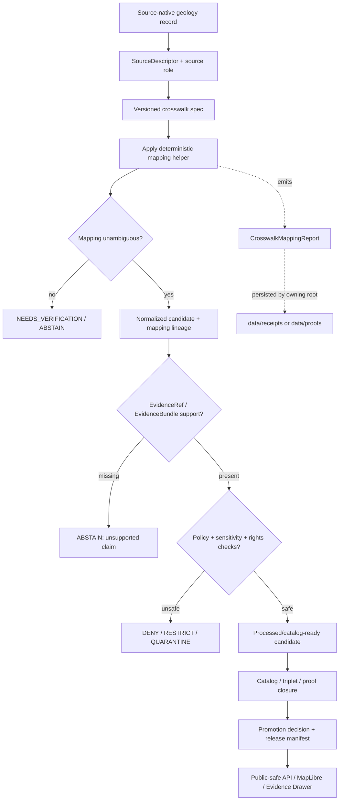

<!-- [KFM_META_BLOCK_V2]
doc_id: kfm://doc/NEEDS-VERIFICATION/packages-domains-geology-crosswalk-readme
title: Geology Crosswalk Package README
type: standard
version: v1
status: draft
owners: OWNER_TBD
created: 2026-06-14
updated: 2026-06-14
policy_label: public
related: [packages/domains/geology/README.md, packages/domains/geology/src/README.md, packages/domains/geology/identity/README.md, packages/domains/geology/evidence/README.md, packages/domains/geology/geometry/README.md, packages/domains/geology/layer_manifest/README.md, docs/domains/geology/README.md, docs/architecture/geology/TRUST_PATH.md, docs/architecture/geology/DATA_LIFECYCLE.md, docs/adr/ADR-geology-schema-home.md, docs/adr/ADR-geology-source-role-model.md, schemas/contracts/v1/geology/, contracts/domains/geology/, policy/geology/, data/registry/geology/, data/catalog/domain/geology/, data/receipts/geology/, data/proofs/geology/, release/, tests/geology/, fixtures/domains/geology/]
tags: [kfm, geology, crosswalk, natural-resources, source-roles, normalization, evidence, packages]
notes: ["README-like package submodule entrypoint for geology crosswalk helpers.", "Target path is user-requested and Directory Rules-compatible as a package/domain segment, but package metadata, imports, tests, schemas, policies, registries, CI workflows, releases, and runtime behavior remain NEEDS VERIFICATION.", "This directory may contain reusable implementation helpers for applying and checking geology crosswalk mappings; it must not become the canonical source registry, schema authority, policy authority, lifecycle-data store, proof/receipt store, or release authority."]
[/KFM_META_BLOCK_V2] -->

# Geology Crosswalk Package

Reusable crosswalk helpers for geology and natural-resource data, keeping source-native terms, canonical KFM terms, evidence support, temporal scope, scale limits, and public-release boundaries separate and inspectable.

<p>
  
  
  
  
  
  
</p>

> [!IMPORTANT]
> **Status:** PROPOSED package README  
> **Path:** `packages/domains/geology/crosswalk/README.md`  
> **Owning responsibility root:** `packages/`  
> **Domain lane:** `geology`  
> **Repo implementation depth:** NEEDS VERIFICATION — package metadata, package manager, imports, tests, schemas, policies, source registries, crosswalk tables, generated receipts, proof objects, release manifests, API routes, UI bindings, CI workflows, and runtime behavior were not inspected in this file-generation pass.

## Quick links

- [Scope](#scope)
- [Repo fit](#repo-fit)
- [Accepted inputs](#accepted-inputs)
- [Exclusions](#exclusions)
- [Crosswalk responsibilities](#crosswalk-responsibilities)
- [Crosswalk families](#crosswalk-families)
- [Anti-collapse rules](#anti-collapse-rules)
- [Trust-boundary flow](#trust-boundary-flow)
- [Finite outcomes](#finite-outcomes)
- [Validation and quality gates](#validation-and-quality-gates)
- [Development rules](#development-rules)
- [Definition of done](#definition-of-done)
- [Verification checklist](#verification-checklist)
- [Rollback](#rollback)

---

## Scope

`packages/domains/geology/crosswalk/` is the shared implementation submodule for applying, validating, and explaining crosswalk mappings in the KFM geology and natural-resources lane.

This package may contain helper code that maps source-native fields, source vocabulary, map-unit labels, resource-classification terms, stratigraphic references, lithology terms, borehole/well-log field names, and layer/source identifiers into KFM-compatible internal representations.

It supports, but does not replace, the KFM trust path:

```text
RAW -> WORK / QUARANTINE -> PROCESSED -> CATALOG / TRIPLET -> PUBLISHED
```

Crosswalk helpers may help produce normalized candidates, validation reports, catalog-ready mappings, Evidence Drawer support, and Focus Mode evidence context. They must not silently upgrade a source-native value into canonical truth, treat a mapping as evidence closure, or publish a claim without policy, review, release, and rollback support.

> [!WARNING]
> A crosswalk match is not proof. It is a mapping assertion that requires source role, evidence support, scale/temporal fitness, policy posture, review state, and release context before it can support a public geology claim.

---

## Repo fit

```text
packages/domains/geology/crosswalk/
```

This path is for reusable implementation code. It is not the authority root for source descriptors, source-rights registries, authoritative crosswalk registries, schemas, policies, lifecycle data, receipts, proofs, catalog records, release decisions, or published artifacts.

| Relationship | Expected home | Boundary rule |
| --- | --- | --- |
| Crosswalk helper code | `packages/domains/geology/crosswalk/` | Applies and explains mappings; does not own mapping authority by itself. |
| Geology package entrypoint | `packages/domains/geology/README.md` | Explains the broader package lane and shared implementation boundaries. |
| Importable source code | `packages/domains/geology/src/` or repo-confirmed package layout | Contains source modules if the repo uses a `src/` layout. |
| Normalization helpers | `packages/domains/geology/src/` or repo-confirmed normalizer package | May call crosswalk helpers during source-to-canonical transformation. |
| Identity helpers | `packages/domains/geology/identity/` | Computes deterministic IDs for source records, normalized objects, mappings, and runs. |
| Evidence helpers | `packages/domains/geology/evidence/` | Checks EvidenceRef/EvidenceBundle support for mapping-backed claims. |
| Geometry helpers | `packages/domains/geology/geometry/` | Handles exact/internal and public-safe geometry context; geometry mapping is not evidence closure. |
| Layer manifest helpers | `packages/domains/geology/layer_manifest/` | Carries mapping lineage into public-safe layer metadata after validation and release. |
| Semantic contracts | `contracts/domains/geology/` or repo-confirmed contract home | Defines object meaning and mapping semantics. |
| Machine schemas | `schemas/contracts/v1/geology/` or accepted ADR alternative | Defines crosswalk spec, mapping report, and candidate object shapes. |
| Source and crosswalk registries | `data/registry/geology/`, `data/registry/sources/geology/`, or repo-confirmed registry home | Owns source identity, source role, rights, sensitivity, cadence, caveats, and authoritative mapping-table metadata. |
| Lifecycle data | `data/<phase>/geology/` | Stores source-native, work, quarantined, processed, catalog, triplet, and published records by lifecycle phase. |
| Catalog and triplet outputs | `data/catalog/domain/geology/`, `data/catalog/stac/`, `data/catalog/dcat/`, `data/catalog/prov/`, `data/triplets/geology/`, or repo-confirmed homes | Stores catalog closure and graph/triplet projections. |
| Receipts and proofs | `data/receipts/geology/`, `data/proofs/geology/`, or repo-confirmed trust-object homes | Stores crosswalk validation receipts, proof packs, and run evidence. |
| Policy and sensitivity | `policy/geology/` or repo-confirmed policy home | Decides allow, deny, restrict, abstain, obligations, and public exposure. |
| Release and rollback | `release/` | Owns ReleaseManifest, PromotionDecision, CorrectionNotice, and rollback target records. |
| Tests and fixtures | `tests/geology/`, `fixtures/domains/geology/`, or repo-confirmed equivalents | Proves deterministic mapping behavior with no-network fixtures. |

> [!CAUTION]
> Do not store the authoritative source registry, source-rights register, canonical schema, policy bundle, receipt log, proof pack, catalog record, or release decision inside this package. This package may consume those objects and emit receipt-ready reports; it must not become their authority home.

---

## Accepted inputs

Crosswalk functions should receive explicit mapping context from governed callers. They should never infer missing source authority, rights status, scale fitness, or release readiness from a convenient field name.

| Input family | Accepted examples | Required handling |
| --- | --- | --- |
| Source record context | `source_id`, source record key, source version, retrieval digest, source layer/table name | Preserve source-native identity and emit mapping lineage. |
| Source role context | observation, interpretation, model, regulatory/administrative, derived layer, public-safe artifact, historical map, resource estimate | Ensure source role can support the requested normalized object or claim class. |
| Crosswalk spec | mapping ID, mapping version, mapping table digest, method/profile, maintainer, valid interval | Treat mapping rules as versioned and reviewable. |
| Source terms | map-unit code, unit label, lithology term, stratigraphic unit name, resource class, borehole field, contact type, scale label | Preserve source-native values beside canonicalized outputs. |
| Canonical targets | KFM object family, controlled term, relation type, unit class, lithology class, stratigraphic interval, resource classification | Return confidence and reason codes; do not silently force a target. |
| Temporal context | source publication date, observed date, valid interval, retrieval time, mapping version time, release time | Do not collapse source time, event time, mapping time, run time, and release time. |
| Spatial and scale context | source scale, CRS, geometry role, spatial uncertainty, county/state extent, generalized/public-safe geometry ref | Crosswalks must respect scale and public-safe geometry limits. |
| Evidence context | EvidenceRef, EvidenceBundle ref, citation key, evidence item digest | Mapping does not replace evidence closure. |
| Policy/review context | sensitivity tier, rights profile, review burden, release class, deny/restrict reason code | Defer allow/deny authority to `policy/`; consume decisions explicitly. |
| Run context | run ID, spec hash, actor/service, code ref, input/output digest, timestamp | Return receipt-ready metadata for pipelines and validators. |

Missing source role, mapping version, evidence context, scale context, or rights/sensitivity posture should produce `NEEDS_VERIFICATION`, `ABSTAIN`, `DENY`, or `ERROR` instead of a silent mapping.

---

## Exclusions

| Do not put here | Correct home or owner | Why |
| --- | --- | --- |
| Source-native files or downloaded layers | `data/raw/geology/` | RAW inputs must remain lifecycle-auditable. |
| Work, quarantine, processed, catalog, triplet, or published records | `data/<phase>/geology/` and `data/catalog/` / `data/triplets/` | Lifecycle state belongs under data roots. |
| Source descriptors, source-rights records, source cadence records | `data/registry/geology/` or repo-confirmed source registry | Source authority and activation are registry concerns. |
| Authoritative mapping registries or steward-approved crosswalk tables | `data/registry/geology/` or repo-confirmed registry/crosswalk home | Mapping authority must be inspectable and versioned outside package code. |
| JSON Schemas for crosswalk specs/reports | `schemas/contracts/v1/geology/` or accepted ADR alternative | Machine shape belongs in schema authority. |
| Semantic definitions of mapping objects | `contracts/domains/geology/` or accepted ADR alternative | Meaning belongs in contract docs, not helper comments. |
| Policy rules or public exposure decisions | `policy/geology/` | Policy owns allow/deny/restrict/abstain logic. |
| Receipts, proofs, catalog matrices, validation artifacts | `data/receipts/geology/`, `data/proofs/geology/`, `data/catalog/`, or repo-confirmed homes | Trust-bearing process memory and proof must remain auditable. |
| Release manifests, promotion decisions, correction notices, rollback cards | `release/` | Promotion is a governed state transition. |
| Live source fetchers, credentials, endpoint activation | `connectors/`, `pipelines/`, `pipeline_specs/`, `configs/`, `infra/` | Source acquisition and admission are separate responsibilities. |
| Public API routes, UI components, MapLibre styles, Focus Mode prompts | `apps/`, `packages/ui/`, `packages/maplibre/`, governed runtime homes | Public surfaces consume released, governed payloads; they do not live here. |

---

## Crosswalk responsibilities

This package should make mapping behavior deterministic, evidence-aware, and reversible.

| Responsibility | Expected behavior | Failure mode to avoid |
| --- | --- | --- |
| Preserve source-native terms | Keep original labels/codes and normalized outputs side by side. | Reviewer cannot reconstruct what the source actually said. |
| Apply versioned mappings | Require mapping ID, mapping version, and mapping-table digest where available. | Mapping behavior changes between runs without lineage. |
| Respect source role | Treat observations, interpretations, regulatory records, models, and derived layers differently. | Permit/lease/administrative records become physical geology proof. |
| Respect scale and time | Carry map scale, source date, valid interval, and mapping validity into outputs. | County and statewide maps are merged as if they had equal support. |
| Expose ambiguity | Return candidate targets, confidence, reason codes, and unresolved cases. | Ambiguous terms are forced into false certainty. |
| Preserve evidence hooks | Carry EvidenceRef/EvidenceBundle references into mapping reports. | Crosswalk output becomes an unsupported claim. |
| Keep public-safe boundaries | Do not transform exact/internal sensitive context into public layer claims without policy/release support. | Sensitive location or resource information leaks through a mapping. |
| Emit receipt-ready metadata | Return run ID, spec hash, input/output digests, mapping profile, and warnings. | Mapping cannot be audited, reproduced, or rolled back. |

---

## Crosswalk families

| Crosswalk family | Maps from | Maps to | Notes |
| --- | --- | --- | --- |
| Source field crosswalk | Source-specific table/layer field names | KFM normalized field names | Keep source fields available for audit. |
| Map-unit crosswalk | Source map-unit symbols, codes, labels | KFM geologic unit candidates | Requires scale/date/source-map context. |
| Stratigraphic crosswalk | Formation/member/group names, aliases, time intervals | KFM stratigraphic unit candidates | Preserve uncertainty and synonym lineage. |
| Lithology crosswalk | Source lithology text, abbreviations, mixed terms | KFM lithology classes or composites | Avoid over-normalizing mixed lithologies. |
| Structure/contact crosswalk | Fault/contact/fold symbols and source categories | KFM geologic structure/contact types | Carry geometry role and interpretation status. |
| Borehole/well-log crosswalk | Source log fields, depth intervals, sample/core references | KFM borehole/reference objects | Respect private well and exact-location restrictions. |
| Resource classification crosswalk | Occurrence/deposit/reserve/resource terminology | KFM resource classification support objects | High-burden; never treat production or permit records as reserves. |
| Administrative relation crosswalk | Permit, lease, operator, reclamation, production fields | Relation edges to geology/resource objects | Relation only; not physical geology proof by itself. |
| Layer/source crosswalk | Source layer IDs, service names, tileset/source-layer names | KFM layer manifest/source references | Layer IDs are delivery surfaces, not truth. |
| Cross-lane relation crosswalk | Soil, hydrology, hazards, ownership, infrastructure references | Governed relation edges | Must not collapse another lane into geology. |

---

## Anti-collapse rules

1. **Source term is not canonical term.** Preserve source-native text even when a canonical target is assigned.
2. **Crosswalk match is not evidence closure.** A mapping result still needs EvidenceRef/EvidenceBundle support.
3. **Regulatory/administrative record is not physical geology.** Permits, leases, operators, and production records can support relation edges or administrative facts, not physical geology claims by themselves.
4. **Modeled potential is not known occurrence/deposit/reserve.** Model outputs require explicit derived/model role and cannot be promoted as observed resource truth.
5. **Map scale matters.** A statewide layer, county map, borehole log, measured section, and field observation do not carry the same support weight.
6. **Public-safe geometry is not exact geometry.** Crosswalked public features must preserve internal/exact vs public/generalized identity and lineage.
7. **Synonym is not supersession.** Stratigraphic aliases and unit-name changes require time and authority context.
8. **Cross-lane relation is not ownership.** Soil, hydrology, hazards, land ownership, and infrastructure may relate to geology, but they do not become geology objects.

---

## Trust-boundary flow



---

## Finite outcomes

Crosswalk helpers should return bounded outcomes rather than guessing.

| Outcome | Use when | Required payload |
| --- | --- | --- |
| `PASS` | Mapping is deterministic, versioned, evidence-aware, and ready for downstream validation. | Mapping target, confidence, mapping ID/version, input/output digests, evidence refs, warnings if any. |
| `NEEDS_VERIFICATION` | Mapping may be plausible but needs steward review, source scale check, synonym review, or rights/sensitivity confirmation. | Reason codes, candidate targets, review prompt, source pointers. |
| `ABSTAIN` | Evidence support, mapping spec, source role, or required context is missing. | Missing fields and safe next step. |
| `RESTRICT` | Mapping can be retained internally but should not be public without staged access/generalization. | Restriction reason, sensitivity tier, public-safe transform requirement. |
| `DENY` | Mapping would collapse source role, publish sensitive/exact data, or assert unsupported geology/resource truth. | Deny reason and remediation path. |
| `ERROR` | Mapping cannot run due to malformed input, schema mismatch, missing dependency, or digest mismatch. | Error code, invalid field path, run context. |

---

## Validation and quality gates

A crosswalk change is not ready just because a test passes locally. It should be reviewable across source role, evidence, policy, catalog, and release boundaries.

| Gate | Check | Expected failure behavior |
| --- | --- | --- |
| Schema gate | Crosswalk specs and mapping reports match the repo-approved schema. | `ERROR` and block promotion. |
| Source-role gate | Source role can support the target object or claim family. | `DENY`, `RESTRICT`, or `NEEDS_VERIFICATION`. |
| Evidence gate | Mapping-backed claims carry resolvable evidence references. | `ABSTAIN` or block public output. |
| Scale/time gate | Source scale, valid interval, and publication/retrieval time are carried forward. | `NEEDS_VERIFICATION` or quarantine. |
| Sensitivity gate | Exact/private/sensitive resource, borehole, sample, or location detail is not public by default. | `DENY`, `RESTRICT`, or require public-safe transform. |
| Catalog closure gate | STAC/DCAT/PROV/release/source/evidence references close without digest mismatch. | Block promotion; emit proof/validation failure. |
| Regression gate | Known ambiguous terms and prior corrections remain stable or intentionally superseded. | Block merge until steward review. |
| Receipt/proof gate | Mapping run emits receipt-ready metadata with spec hash and digests. | Mark incomplete and block release-significant use. |

---

## Development rules

- Keep crosswalk helpers pure where practical: explicit inputs, deterministic outputs, no hidden network calls.
- Preserve source-native values; never overwrite them with canonical terms.
- Require a mapping profile/version for every non-trivial mapping.
- Return reason codes for ambiguous, denied, restricted, or abstained mappings.
- Keep source-role checks visible and testable.
- Do not embed source credentials, source URLs as operational secrets, or live fetch behavior here.
- Do not import public UI, API route, release, or policy engines as hidde
