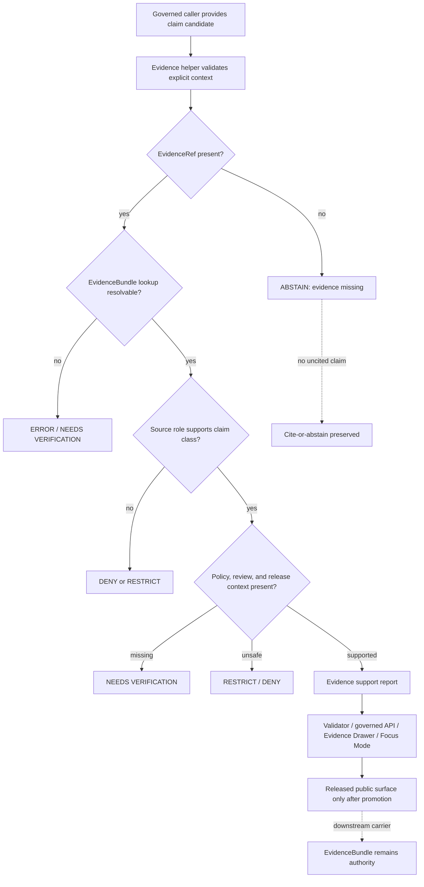

<!-- [KFM_META_BLOCK_V2]
doc_id: kfm://doc/NEEDS-VERIFICATION/packages-domains-geology-evidence-readme
title: Geology Evidence Package README
type: standard
version: v1
status: draft
owners: OWNER_TBD
created: 2026-06-14
updated: 2026-06-14
policy_label: public
related: [packages/domains/geology/README.md, packages/domains/geology/src/README.md, packages/domains/geology/identity/README.md, packages/domains/geology/geometry/README.md, packages/domains/geology/layer_manifest/README.md, docs/domains/geology/README.md, docs/architecture/geology/TRUST_PATH.md, docs/architecture/geology/DATA_LIFECYCLE.md, schemas/contracts/v1/geology/, contracts/domains/geology/, policy/geology/, data/registry/geology/, data/receipts/geology/, data/proofs/geology/, release/, tests/geology/, fixtures/domains/geology/]
tags: [kfm, geology, evidence, evidencebundle, evidenceref, provenance, receipts, proofs, packages]
notes: ["README-like package submodule entrypoint for geology evidence helpers.", "Target path is user-requested and Directory Rules-compatible as a package/domain segment, but package metadata, imports, tests, CI, schemas, policies, release manifests, and emitted proof/receipt objects remain NEEDS VERIFICATION.", "This directory may contain shared implementation helpers for EvidenceRef validation, evidence lookup shaping, source-role support checks, citation closure checks, and evidence payload preparation; it must not become the canonical source registry, schema, policy, receipt, proof, lifecycle-data, or release authority."]
[/KFM_META_BLOCK_V2] -->

# Geology Evidence Package

Shared evidence helpers for KFM geology and natural-resource claims, keeping EvidenceBundle support, source roles, policy posture, review state, and release lineage visible before any claim becomes public-facing.

<p>
  
  
  
  
  
  
</p>

> [!IMPORTANT]
> **Status:** PROPOSED package README  
> **Path:** `packages/domains/geology/evidence/README.md`  
> **Owning responsibility root:** `packages/`  
> **Domain lane:** `geology`  
> **Repo implementation depth:** NEEDS VERIFICATION — package metadata, package manager, imports, tests, schemas, policies, source registries, generated receipts, proof objects, release manifests, catalog closure, API routes, UI bindings, and runtime behavior were not inspected in this file-generation pass.

## Quick links

- [Scope](#scope)
- [Repo fit](#repo-fit)
- [Accepted inputs](#accepted-inputs)
- [Exclusions](#exclusions)
- [Evidence responsibilities](#evidence-responsibilities)
- [Evidence object boundaries](#evidence-object-boundaries)
- [Trust-boundary flow](#trust-boundary-flow)
- [Citation closure rules](#citation-closure-rules)
- [Finite outcomes](#finite-outcomes)
- [Validation and quality gates](#validation-and-quality-gates)
- [Development rules](#development-rules)
- [Definition of done](#definition-of-done)
- [Verification checklist](#verification-checklist)
- [Rollback](#rollback)

---

## Scope

`packages/domains/geology/evidence/` is the shared implementation submodule for evidence-related helper code in the KFM geology and natural-resources lane.

It may contain reusable functions for:

- checking that geology claims carry resolvable `EvidenceRef` values;
- shaping EvidenceBundle lookup requests for governed callers;
- evaluating source-role support for geology claim classes;
- preparing citation-closure summaries for validators, APIs, Evidence Drawer payloads, and Focus Mode envelopes;
- distinguishing source observations, interpretations, regulatory records, models, derived layers, and public-safe display features;
- producing receipt-ready validation metadata without storing receipts here.

This package supports the KFM trust path:

```text
RAW -> WORK / QUARANTINE -> PROCESSED -> CATALOG / TRIPLET -> PUBLISHED
```

Evidence helpers can support lifecycle transitions and review, but they do **not** admit sources, own canonical evidence, make policy decisions, publish releases, or turn a map layer into truth. EvidenceBundle support outranks generated language, layer paint, public geometry, graph edges, and Focus Mode answers.

> [!WARNING]
> A geology claim that lacks resolvable evidence support must return `ABSTAIN`, `DENY`, `RESTRICT`, or `ERROR` instead of being rendered as an authoritative public claim.

---

## Repo fit

```text
packages/domains/geology/evidence/
```

This path is for reusable implementation code. It is not the authority root for contracts, schemas, source registries, lifecycle data, policy, receipts, proofs, release decisions, or published artifacts.

| Relationship | Expected home | Boundary rule |
| --- | --- | --- |
| Evidence helper code | `packages/domains/geology/evidence/` | Computes and checks evidence support; does not own evidence records. |
| Geology package entrypoint | `packages/domains/geology/README.md` | Explains the package lane and implementation boundaries. |
| Importable source code | `packages/domains/geology/src/` or repo-confirmed package layout | Contains package modules if the repo uses a `src/` layout. |
| Identity helpers | `packages/domains/geology/identity/` | May compute stable IDs and digests consumed by evidence checks. |
| Geometry helpers | `packages/domains/geology/geometry/` | May prepare geometry context; geometry alone is not evidence closure. |
| Layer manifest helpers | `packages/domains/geology/layer_manifest/` | May carry `evidence_lookup_ref` into public layer metadata after release checks. |
| Semantic contracts | `contracts/domains/geology/` or repo-confirmed contract home | Defines object meaning and support semantics. |
| Machine schemas | `schemas/contracts/v1/geology/` or accepted ADR alternative | Defines machine-checkable EvidenceRef, EvidenceBundle, payload, and report shapes. |
| Source registry | `data/registry/geology/` or repo-confirmed registry home | Owns source identity, source role, rights, sensitivity, cadence, caveats, and activation state. |
| Lifecycle evidence records | `data/<phase>/geology/` | Stores raw/work/quarantine/processed/catalog/triplet/published records by phase. |
| Receipts and proofs | `data/receipts/geology/`, `data/proofs/geology/`, or repo-confirmed trust-object homes | Stores process memory, proof packs, validation outputs, and evidence closure artifacts. |
| Policy and sensitivity | `policy/geology/` or repo-confirmed policy home | Decides allow, deny, restrict, abstain, obligations, and public exposure. |
| Release and rollback | `release/` | Owns ReleaseManifest, PromotionDecision, CorrectionNotice, and rollback target records. |
| Tests and fixtures | `tests/geology/`, `fixtures/domains/geology/`, or repo-confirmed equivalents | Proves helper behavior with deterministic no-network cases. |

> [!CAUTION]
> Do not place actual EvidenceBundle records, proof packs, receipts, release manifests, source descriptors, policy bundles, or lifecycle data in this package. This package may prepare or validate references to those objects; it must not become their storage authority.

---

## Accepted inputs

Evidence helpers should receive explicit, already-admitted context from governed callers. Missing context should be treated as a finite outcome, not guessed.

| Input family | Accepted examples | Required handling |
| --- | --- | --- |
| Claim context | claim ID, subject, predicate, object, claim class, domain lane, confidence | Keep claim identity separate from physical-feature identity. |
| Evidence references | `EvidenceRef`, evidence bundle ID, evidence item digest, citation key, source item pointer | Require resolvability before authoritative use. |
| Source context | `source_id`, source role, rights profile, caveats, scale, update cadence, steward status | Confirm the source role can support the requested claim type. |
| Temporal context | valid time, observed time, source publication date, retrieval time, release time | Do not collapse source time, event time, run time, and release time. |
| Spatial context | geometry role, source scale, CRS, spatial uncertainty, public-safe geometry ref | Do not treat public-safe geometry as canonical proof. |
| Policy context | policy label, sensitivity tier, obligations, deny/restrict reasons | Defer allow/deny authority to `policy/`; consume decisions explicitly. |
| Review and release context | review state, release candidate ID, `release_id`, rollback ref, correction ref | Keep review and release lineage visible in outputs. |
| Run context | run ID, spec hash, input digest, code version, actor/service, timestamp | Return receipt-ready metadata; do not persist receipts here. |

---

## Exclusions

| Do not put here | Correct home or owner | Why |
| --- | --- | --- |
| Source-native files or source captures | `data/raw/geology/` | RAW evidence must remain lifecycle-auditable. |
| Work, quarantine, processed, catalog, triplet, or published records | `data/<phase>/geology/` | Lifecycle state belongs under `data/`. |
| Source descriptors or source-rights registries | `data/registry/geology/` or repo-confirmed source registry | Source authority, rights, and cadence are registry concerns. |
| EvidenceBundle records as persisted artifacts | `data/<phase>/geology/`, `data/proofs/geology/`, or repo-confirmed evidence/proof home | Evidence storage must remain auditable and separate from helper code. |
| Validation receipts, run receipts, AI receipts, or redaction receipts | `data/receipts/geology/` or repo-confirmed receipt home | Process memory is a trust object, not package source code. |
| Proof packs and catalog closure artifacts | `data/proofs/geology/` and `data/catalog/` or repo-confirmed homes | Proof and catalog closure have separate authority. |
| Release decisions and rollback records | `release/` | Promotion is a governed state transition. |
| Policy rules | `policy/geology/` | Policy owns allow/deny/restrict/abstain logic. |
| JSON Schemas | `schemas/contracts/v1/geology/` or accepted ADR alternative | Machine shape belongs in schema authority. |
| Contract prose | `contracts/domains/geology/` or accepted ADR alternative | Semantic meaning belongs in contracts/docs. |
| Live source fetchers | `connectors/` or `pipelines/` depending responsibility | Fetch/admission logic is not an evidence-helper package concern. |
| Public API route handlers or UI components | `apps/`, `packages/ui/`, `packages/maplibre/`, or repo-confirmed homes | Public surfaces consume governed evidence payloads; they do not live here. |

---

## Evidence responsibilities

This package should make geology evidence support explicit and testable.

### It may do

- Normalize evidence reference shapes for downstream validators.
- Check whether each public claim has at least one resolvable evidence path.
- Flag unsupported claim/source-role combinations.
- Summarize source-role support without rewriting source meaning.
- Prepare Evidence Drawer payload fragments that still require governed API, policy, and release checks.
- Prepare Focus Mode evidence context that prevents uncited freeform geology answers.
- Return finite outcomes when evidence, source role, rights, review, release, or sensitivity context is missing.

### It must not do

- Decide that a source is rights-cleared.
- Decide that a claim is safe for public release.
- Store canonical EvidenceBundle records.
- Store or sign proofs/receipts.
- Promote or publish anything.
- Treat tiles, MapLibre layers, graph edges, public-safe geometry, summaries, or model output as sovereign truth.

---

## Evidence object boundaries

| Object or payload | Helper relationship | Owning authority |
| --- | --- | --- |
| `EvidenceRef` | Validate shape, required fields, and resolvability hints. | Schema/contract + evidence storage roots. |
| `EvidenceBundle` | Prepare lookup keys and closure checks; never silently fabricate bundle content. | Evidence/proof/lifecycle authority roots. |
| `GeologyEvidenceSupportReport` | PROPOSED helper output summarizing support, gaps, and finite outcome. | Package output consumed by validators/tests; schema home needs verification. |
| `GeologySourceRoleSupport` | PROPOSED helper output evaluating whether source role can support claim class. | Source registry + policy + contracts. |
| `EvidenceDrawerPayload` | Prepare evidence-related fields only; API/UI owns final payload delivery. | Governed API/UI contracts and released artifacts. |
| `FocusRuntimeEnvelope` | Provide evidence references and citation status; AI remains interpretive. | Governed AI/runtime contracts and policy. |
| `RunReceipt` / `AIReceipt` / `RedactionReceipt` | Return receipt-ready metadata only. | Receipt root. |
| `ReleaseManifest` | Check `release_id` and evidence refs are present when provided. | `release/`. |

---

## Trust-boundary flow



---

## Citation closure rules

1. **EvidenceRef before claim.** A claim candidate must carry evidence references before it can be shaped for public delivery.
2. **EvidenceBundle before authority.** A claim should not be rendered as authoritative unless the EvidenceRef resolves to evidence support.
3. **Source role before interpretation.** A regulatory record, map interpretation, observation, model result, or public layer cannot support all claim types equally.
4. **Release context before public display.** A valid EvidenceBundle does not by itself prove that rights, sensitivity, review, and release conditions are satisfied.
5. **Correction lineage stays visible.** If a release has a correction notice or supersession link, evidence payloads must carry that lineage forward.
6. **Public-safe geometry is not proof.** Generalized geometry helps delivery; it does not prove the underlying geologic assertion.
7. **AI answers are downstream.** Focus Mode may summarize resolved evidence; it cannot create evidence, policy, review, or release state.

---

## Finite outcomes

Evidence helpers should return explicit outcomes rather than ambiguous booleans.

| Outcome | Use when | Expected caller behavior |
| --- | --- | --- |
| `PASS` | Evidence references resolve, source role is compatible, and required context is present. | Continue to policy, validation, catalog, or release gates. |
| `WARN` | Support exists but has caveats, uncertainty, stale indicators, or lower confidence. | Surface caveats and require reviewer visibility. |
| `ABSTAIN` | Evidence support is insufficient or missing for a consequential claim. | Do not answer or publish the claim as authoritative. |
| `RESTRICT` | Evidence exists but rights, sensitivity, exact geometry, or review posture prevents normal public exposure. | Route to restricted/steward-only workflow or generalized public-safe output. |
| `DENY` | Source role, policy posture, rights, sensitivity, or support class blocks the claim. | Block promotion/public rendering. |
| `ERROR` | Input is malformed, unresolved, contradictory, or impossible to validate deterministically. | Fail closed and emit validation details for repair. |

---

## Validation and quality gates

Before this package is treated as active, maintainers should add no-network tests covering:

- [ ] missing EvidenceRef returns `ABSTAIN` or `ERROR`;
- [ ] unresolved EvidenceRef returns `ERROR` or `NEEDS VERIFICATION`;
- [ ] public feature without evidence lookup is blocked;
- [ ] source-role mismatch is denied or restricted;
- [ ] regulatory/administrative source role cannot prove physical geology by itself;
- [ ] modeled potential is not promoted as known deposit/reserve;
- [ ] exact sensitive geometry requires restricted treatment and redaction lineage;
- [ ] corrected or superseded evidence carries correction lineage;
- [ ] AI/Focus payload cannot produce `ANSWER` without evidence references;
- [ ] public layer payload carries `evidence_lookup_ref`, `release_id`, and policy/review context where required.

Recommended validation command is intentionally placeholdered until the package manager and test runner are verified:

```bash
# NEEDS VERIFICATION: replace with repo-confirmed test command.
pytest tests/geology -k evidence
```

---

## Development rules

- Keep helpers deterministic and side-effect-light.
- Accept source, policy, review, and release context as explicit inputs.
- Return structured reports with reason codes, not prose-only decisions.
- Preserve source-role distinctions; do not flatten observations, interpretations, regulatory records, models, and public layer carriers.
- Treat missing support as `ABSTAIN`, `DENY`, `RESTRICT`, or `ERROR`, not as a reason to guess.
- Keep storage out of this package unless the repo has a confirmed package-local cache convention.
- Do not perform live network source activation from this package.
- Do not embed secret tokens, local paths, source credentials, or steward-only restricted geometry.

---

## Definition of done

This README is ready to treat as active only after these checks are complete:

- [ ] Confirm `packages/domains/geology/evidence/` exists in the live repo or create it in the same PR.
- [ ] Confirm the geology package layout and import path.
- [ ] Confirm package manager and test runner.
- [ ] Confirm schema homes for EvidenceRef/EvidenceBundle-related geology payloads.
- [ ] Confirm source registry path and source-role vocabulary.
- [ ] Confirm policy homes for geology evidence, sensitivity, and public-safe exposure.
- [ ] Add deterministic fixtures for PASS, WARN, ABSTAIN, RESTRICT, DENY, and ERROR outcomes.
- [ ] Add tests proving claims cannot become public without evidence support and release context.
- [ ] Link this README from `packages/domains/geology/README.md`.
- [ ] Add rollback/correction examples for superseded or corrected geology evidence.

---

## Verification checklist

- [ ] Directory placement reviewed against Directory Rules.
- [ ] Adjacent geology READMEs link to this package.
- [ ] No schemas, policies, source descriptors, receipts, proofs, release decisions, or lifecycle data are stored here.
- [ ] Evidence helper outputs map to repo-confirmed schemas or are labeled PROPOSED.
- [ ] Claim classes and source roles are crosswalked to contracts and source registry entries.
- [ ] Public API/UI payloads remain governed and released-artifact-backed.
- [ ] Focus Mode cannot answer geology questions without evidence and citation validation.
- [ ] Sensitive geometry and resource-location evidence fail closed.
- [ ] Corrections and supersessions are visible in evidence payloads.
- [ ] Rollback target exists for any public-facing integration.

---

## Rollback

Rollback is required if this package starts acting as a storage authority, release authority, policy authority, source registry, schema authority, or public claim authority.

Rollback target: `ROLLBACK_TARGET_TBD_AFTER_REPO_INSPECTION`

Rollback actions:

1. Revert package code or README changes that moved trust-bearing authority into `packages/`.
2. Move misplaced records to the correct responsibility root.
3. Add or update a drift-register entry if authority boundaries were confused.
4. Re-run evidence, policy, source-role, and public-safe exposure tests.
5. If any public surface used unsupported geology evidence, withdraw the affected layer/API response and issue a correction notice through the release/correction workflow.

---

<details>
<summary>Maintainer notes</summary>

### Evidence boundary

This README is a repo-ready draft for a user-requested path. It is doctrine-aligned but does not prove the live package exists, that imports work, that test commands are correct, or that schemas/policies are already implemented.

### Suggested neighboring links

- `packages/domains/geology/README.md`
- `packages/domains/geology/src/README.md`
- `packages/domains/geology/identity/README.md`
- `packages/domains/geology/geometry/README.md`
- `packages/domains/geology/layer_manifest/README.md`
- `docs/domains/geology/README.md`
- `docs/architecture/geology/TRUST_PATH.md`
- `schemas/contracts/v1/geology/`
- `policy/geology/`
- `data/registry/geology/`
- `data/receipts/geology/`
- `data/proofs/geology/`
- `release/`

### Open verification items

- NEEDS VER
