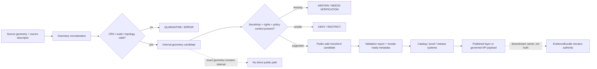

<!-- [KFM_META_BLOCK_V2]
doc_id: kfm://doc/NEEDS-VERIFICATION/packages-domains-geology-geometry-readme
title: Geology Geometry Package README
type: standard
version: v1
status: draft
owners: OWNER_TBD
created: 2026-06-14
updated: 2026-06-14
policy_label: public
related: [packages/domains/geology/README.md, packages/domains/geology/identity/README.md, packages/domains/geology/layer_manifest/README.md, docs/domains/geology/README.md, docs/architecture/geology/TRUST_PATH.md, docs/architecture/geology/DATA_LIFECYCLE.md, docs/adr/ADR-geology-public-safe-geometry.md, schemas/contracts/v1/geology/, contracts/domains/geology/, policy/geology/, data/registry/geology/, tests/geology/]
tags: [kfm, geology, geometry, public-safe-geometry, redaction, spatial-uncertainty, evidence, packages]
notes: ["README-like package submodule entrypoint for geology geometry helpers.", "Target path is user-requested and Directory Rules-compatible as a package/domain segment, but actual repo package metadata, imports, test runner, and CI remain NEEDS VERIFICATION.", "This directory may contain shared implementation helpers for geometry normalization, uncertainty handling, CRS checks, geometry role separation, and public-safe transform preparation; it must not become a schema, policy, registry, release, receipt, proof, or lifecycle-data authority."]
[/KFM_META_BLOCK_V2] -->

# Geology Geometry Package

Shared geometry helpers for KFM geology and natural-resource objects, with exact/internal geometry kept separate from public-safe geometry and evidence-bearing claims.

<p>
  
  
  
  
  
  
</p>

> [!IMPORTANT]
> **Status:** PROPOSED package README  
> **Path:** `packages/domains/geology/geometry/README.md`  
> **Owning responsibility root:** `packages/`  
> **Domain lane:** `geology`  
> **Repo implementation depth:** NEEDS VERIFICATION — package metadata, package manager, imports, tests, schemas, policies, source registries, public-safe geometry policy, generated receipts, proof objects, release manifests, API routes, UI bindings, and runtime behavior were not inspected in this file-generation pass.

## Quick links

- [Scope](#scope)
- [Repo fit](#repo-fit)
- [Accepted inputs](#accepted-inputs)
- [Exclusions](#exclusions)
- [Geometry responsibilities](#geometry-responsibilities)
- [Geometry role model](#geometry-role-model)
- [Trust-boundary flow](#trust-boundary-flow)
- [Public-safe transform rules](#public-safe-transform-rules)
- [Finite outcomes](#finite-outcomes)
- [Validation and quality gates](#validation-and-quality-gates)
- [Development rules](#development-rules)
- [Definition of done](#definition-of-done)
- [Verification checklist](#verification-checklist)
- [Rollback](#rollback)

---

## Scope

`packages/domains/geology/geometry/` is the shared implementation submodule for geology geometry helpers.

It may contain reusable functions for geometry normalization, CRS checks, geometry-role tagging, spatial uncertainty handling, topology sanity checks, redaction-prep metadata, geometry digest preparation, and public-safe layer handoff support.

It must preserve the KFM lifecycle boundary:

```text
RAW -> WORK / QUARANTINE -> PROCESSED -> CATALOG / TRIPLET -> PUBLISHED
```

This package can help prepare geometry-bearing candidates for validators, policy checks, catalog closure, layer manifests, Evidence Drawer payloads, and release review. It must not publish geometry, decide release, own canonical source geometry, or treat public display geometry as proof of the underlying geology claim.

### Geology objects in scope

Geometry helpers may support these geology/natural-resource families when called by governed pipelines or validators:

- geologic-unit polygons;
- surficial or bedrock map-unit boundaries;
- contacts, faults, folds, fractures, and structural traces;
- measured-section, core, borehole, well-log, geophysics, and geochemistry reference locations;
- mineral occurrence or resource-deposit geometry references;
- extraction, production, and reclamation context geometry when treated as relation surfaces rather than physical resource proof;
- generalized public-safe layer features;
- EvidenceBundle-aware spatial payloads for governed API/UI surfaces.

> [!WARNING]
> Exact borehole, sample, resource, geochemistry, private-well, or sensitive natural-resource coordinates must be treated as restricted unless policy and review explicitly allow a public geometry role.

---

## Repo fit

```text
packages/domains/geology/geometry/
```

This path is for shared package code. It does not own docs, contracts, schemas, policy, data lifecycle records, source registries, release decisions, receipts, proofs, or public artifacts.

| Relationship | Expected home | Boundary rule |
| --- | --- | --- |
| Shared geometry helpers | `packages/domains/geology/geometry/` | Reusable implementation code only. |
| Geology package entrypoint | `packages/domains/geology/README.md` | Describes the package lane and package-level boundaries. |
| Identity helpers | `packages/domains/geology/identity/` | Own deterministic identity support; may consume geometry digests but does not own geometry semantics. |
| Layer manifest helpers | `packages/domains/geology/layer_manifest/` | Prepares layer-manifest payloads from released or release-candidate geometry context. |
| Domain docs | `docs/domains/geology/` | Explains domain scope, stewardship, and lane boundaries. |
| Geometry contracts | `contracts/domains/geology/` or accepted ADR alternative | Defines meaning of geometry-bearing objects. |
| Machine schemas | `schemas/contracts/v1/geology/` or accepted ADR alternative | Defines fields and validation shape. |
| Source descriptors | `data/registry/geology/` or repo-confirmed registry home | Owns source identity, role, rights, sensitivity, cadence, and activation state. |
| Policy and sensitivity rules | `policy/geology/` or repo-confirmed policy home | Decides public/restricted/deny/abstain treatment. |
| Lifecycle geometry data | `data/<phase>/geology/` | Stores raw, work, quarantine, processed, catalog, triplet, published, receipt, proof, registry, and rollback records by phase. |
| Release and rollback | `release/` | Owns release decisions, manifests, correction notices, and rollback targets. |
| Tests and fixtures | `tests/geology/`, `fixtures/domains/geology/`, or repo-confirmed equivalents | Proves geometry helper behavior with deterministic no-network fixtures. |

> [!CAUTION]
> If a file in this directory starts to define a schema, policy, source registry, release decision, proof pack, receipt, or lifecycle artifact, move it to the correct authority root instead of expanding this package's authority.

---

## Accepted inputs

Geometry functions should accept explicit, already-admitted input from governed callers. Inputs should be small, deterministic, and inspectable.

| Input family | Accepted examples | Required handling |
| --- | --- | --- |
| Geometry values | GeoJSON-like geometry, WKB/WKT, coordinate arrays, bounding boxes, feature centroids, source geometry refs | Validate geometry role, CRS, precision, topology expectations, and source context before output. |
| CRS and scale context | EPSG code, source CRS, target CRS, source map scale, map resolution, positional uncertainty | Do not transform or simplify silently; every change must be explicit and receipt-ready. |
| Source context | `source_id`, source role, source map date, source scale, rights profile, caveats | Preserve source authority limits; never promote a display feature to source evidence. |
| Object context | object family, schema family, object ID, candidate ID, geometry role, geometry version | Keep geometry tied to a specific geology object family and version. |
| Sensitivity context | sensitivity tier, restricted-location flag, public-safe profile, deny/restrict/abstain reason codes | Return finite outcomes when public-safe conditions are missing. |
| Evidence context | EvidenceRef, EvidenceBundle reference, citation requirement, source item digest | Preserve evidence closure requirements; geometry alone is not evidence closure. |
| Transform context | redaction/generalization method, simplification tolerance, rounding profile, H3/grid cell, bounding region, method version | Emit transform metadata suitable for a RedactionReceipt or run receipt owned elsewhere. |
| Run context | run ID, spec hash, code version, input digest, actor/service, execution timestamp | Return receipt-ready metadata; do not persist receipts here. |

Missing CRS, geometry role, source context, sensitivity context, or public-safe profile should return `ABSTAIN`, `DENY`, `RESTRICT`, or `ERROR` rather than a guessed public geometry.

---

## Exclusions

| Do not put here | Correct home or owner | Why |
| --- | --- | --- |
| RAW source captures or source-native geodatabases | `data/raw/geology/` | RAW evidence must remain lifecycle-auditable. |
| WORK, QUARANTINE, PROCESSED, CATALOG, TRIPLET, or PUBLISHED geometry artifacts | `data/<phase>/geology/` | Lifecycle state belongs under `data/`, not package code. |
| JSON Schemas for geometry-bearing objects | `schemas/contracts/v1/geology/` or accepted ADR alternative | Machine shape belongs in schema authority. |
| Contract definitions of geometry meaning | `contracts/domains/geology/` or accepted ADR alternative | Object meaning belongs in semantic contracts. |
| Public-safe geometry policy rules | `policy/geology/` | Policy owns allow/deny/restrict/abstain decisions. |
| Redaction receipts, run receipts, proof packs, catalog matrices | `data/receipts/`, `data/proofs/`, `data/catalog/`, or repo-confirmed homes | Trust objects are generated/persisted by owning systems. |
| Release manifests, rollback cards, correction notices | `release/` | Release authority stays outside implementation helpers. |
| Live source fetchers, endpoint clients, credentials, scraping, or admission logic | `connectors/`, `pipelines/`, `pipeline_specs/`, `configs/`, `infra/` | Source activation is governed separately. |
| MapLibre styles, public UI components, API routes, or AI prompts | `apps/`, `ui/`, `web/`, `packages/maplibre/`, governed runtime | Rendering and generated answers are downstream carriers. |
| Mineral/resource legal, lease, parcel, ownership, or permit authority | appropriate source registry, people/land/administrative lanes, or governed relation edges | Administrative records do not prove physical geology. |

---

## Geometry responsibilities

This package should make geology geometry handling reproducible, explicit, and policy-aware.

| Responsibility | Expected behavior | Failure mode to avoid |
| --- | --- | --- |
| Validate geometry role | Require explicit role such as `internal_exact`, `source_boundary`, `derived_generalized`, `public_safe`, `centroid`, `bbox`, or `grid_cell` | A public layer accidentally uses exact/internal geometry. |
| Validate CRS | Require declared CRS and explicit target CRS for transforms | Coordinates are reprojected or interpreted incorrectly. |
| Preserve scale and uncertainty | Carry map scale, positional uncertainty, simplification tolerance, and source resolution | Visual precision is mistaken for evidentiary precision. |
| Separate source and display geometry | Keep source-native, normalized, internal, and public-safe geometries distinct | A simplified display boundary replaces canonical source evidence. |
| Prepare redaction metadata | Return transform method, parameters, input/output digests, and reason codes | Redaction cannot be audited or rolled back. |
| Support topology checks | Detect invalid rings, self-intersections, unclosed lines, impossible extents, or invalid geometry types where applicable | Invalid geometry reaches catalog/release layers. |
| Support relation edges | Represent adjacency, containment, intersection, and proximity as relation outputs, not ownership of adjacent lane truth | Geology overwrites hydrology, soil, hazards, or land/title claims. |
| Return finite outcomes | Use bounded success/failure outcomes with reasons | Helper silently produces unsafe geometry. |

---

## Geometry role model

Geometry role names are PROPOSED until confirmed against accepted schemas and policy.

| Role | Meaning | Public posture |
| --- | --- | --- |
| `source_native` | Geometry exactly as delivered by a source or source export | Restricted until source rights, sensitivity, and transform policy are checked. |
| `internal_exact` | Internal normalized geometry retained for evidence and analysis | Not public by default. |
| `interpreted_boundary` | Geologic contact/unit boundary interpreted from a map or model | Public only when source role, scale, rights, and release support it. |
| `derived_generalized` | Simplified or generalized geometry derived from internal/source geometry | Candidate for public use only with transform metadata and policy support. |
| `public_safe` | Geometry approved for public delivery under a release/policy profile | Public only after validation, proof, review, and release decision. |
| `masked_or_suppressed` | Geometry intentionally hidden, blurred, gridded, or withheld | Public output must explain suppression without exposing sensitive detail. |
| `centroid_or_bbox` | Reduced geometry used for overview, indexing, or broad discovery | Public only when centroid/bbox does not leak sensitive locations. |
| `grid_cell` | H3, county, watershed, township, quad, or other generalized cell | Public only when cell size and aggregation threshold are policy-approved. |

> [!IMPORTANT]
> A geometry role is not a release decision. It is an input to validation and policy. Public delivery still requires evidence support, review state, release state, and rollback target.

---

## Trust-boundary flow



The geometry helper can prepare candidates and metadata. It does not approve publication.

---

## Public-safe transform rules

These rules are package-level defaults. Final policy belongs in `policy/` and accepted schemas/contracts.

1. **Never generalize silently.** Every simplification, rounding, snapping, masking, grid aggregation, suppression, or CRS transform must have a named method and parameters.
2. **Never publish exact sensitive geometry by default.** Boreholes, samples, private wells, geochemistry, sensitive resource occurrences, and exact subsurface reference points should start restricted.
3. **Never treat a public-safe geometry as canonical source evidence.** Public geometry is a derivative carrier and needs lineage.
4. **Preserve input and output digests.** Transform metadata should be sufficient to recreate, validate, or challenge the public-safe geometry.
5. **Carry source scale and uncertainty.** A display-ready vector must not imply more precision than the source supports.
6. **Keep adjacent lane truth separate.** Geologic geometry may relate to soil, hydrology, hazards, infrastructure, land ownership, or archaeology, but it must not become their authority.
7. **Fail closed when context is missing.** Unknown source rights, unknown sensitivity, missing CRS, missing geometry role, missing public-safe profile, or missing evidence reference should block public output.

### PROPOSED transform metadata shape

```yaml
geometry_transform_summary:
  status: PROPOSED
  input_geometry_ref: kfm://geometry/NEEDS-VERIFICATION
  output_geometry_ref: kfm://geometry/NEEDS-VERIFICATION
  input_digest: sha256:NEEDS_VERIFICATION
  output_digest: sha256:NEEDS_VERIFICATION
  source_crs: EPSG:NEEDS_VERIFICATION
  target_crs: EPSG:NEEDS_VERIFICATION
  source_scale: NEEDS_VERIFICATION
  method: generalize_or_suppress_NEEDS_VERIFICATION
  method_version: v1
  parameters:
    tolerance: NEEDS_VERIFICATION
    grid: NEEDS_VERIFICATION
    min_aggregation_count: NEEDS_VERIFICATION
  reason_codes:
    - NEEDS_VERIFICATION_PUBLIC_SAFE_GEOMETRY
  policy_decision_ref: kfm://policy-decision/NEEDS-VERIFICATION
  redaction_receipt_ref: kfm://receipt/NEEDS-VERIFICATION
```

---

## Finite outcomes

Geometry helpers should return bounded outcomes rather than ambiguous booleans.

| Outcome | Use when | Public path |
| --- | --- | --- |
| `ANSWER` | Geometry was normalized or transformed with required evidence, CRS, role, and policy context. | Allowed only as candidate output; release still happens elsewhere. |
| `ABSTAIN` | Required support is missing, such as CRS, role, evidence context, source rights, or sensitivity profile. | No public output. |
| `DENY` | Policy or sensitivity context indicates the requested geometry must not be produced or exposed. | No public output. |
| `RESTRICT` | Geometry may be used internally or under staged access but not public by default. | Governed internal/staged access only. |
| `NEEDS_REVIEW` | The geometry is plausible but requires steward review, such as source-scale ambiguity or topology correction. | No automatic release. |
| `ERROR` | Geometry is invalid, inconsistent, impossible, or unsafe to process. | Block and emit diagnostic details without leaking sensitive geometry. |

---

## Validation and quality gates

| Gate | Required check | Evidence expected |
| --- | --- | --- |
| Geometry type gate | Geometry type matches object family and schema expectation. | Validation report. |
| CRS gate | CRS is declared, supported, and transform target is explicit. | CRS check output and transform metadata. |
| Topology gate | Geometry is valid for intended use or explicitly repaired with receipt-ready metadata. | Topology report and repair note. |
| Scale/uncertainty gate | Source scale, positional uncertainty, and display precision are visible. | Candidate metadata fields. |
| Sensitivity gate | Sensitive exact locations are restricted or transformed according to policy. | Policy decision ref and redaction metadata. |
| Evidence gate | Geometry-bearing claim can resolve to EvidenceBundle support. | EvidenceRef / EvidenceBundle link. |
| Catalog closure gate | Public layer candidate has catalog/proof/release handoff fields. | Catalog/proof/release refs or `NEEDS VERIFICATION`. |
| Regression gate | Valid and invalid fixtures cover exact/public separation, CRS errors, topology failures, and sensitivity denial. | Tests under repo-confirmed test home. |

Suggested no-network fixture set:

- valid surficial geology polygon with CRS and source scale;
- invalid self-intersecting polygon that must fail;
- borehole point that must remain restricted;
- mineral occurrence point that must be generalized or denied;
- interpreted boundary line with uncertainty and source role;
- public-safe generalized polygon with transform metadata;
- missing CRS fixture that returns `ABSTAIN` or `ERROR`;
- rights-unknown fixture that blocks public output.

---

## Development rules

- Keep helpers pure or side-effect-light where practical.
- Do not read or write lifecycle data directly unless a repo-approved package convention says otherwise.
- Do not call live source endpoints from this package.
- Do not persist receipts, proofs, release manifests, or catalog records from this package.
- Do not infer CRS, source role, rights, sensitivity, or release state from filename alone.
- Keep exact/internal and public-safe geometry fields separate in function signatures and outputs.
- Return structured reason codes for every `ABSTAIN`, `DENY`, `RESTRICT`, `NEEDS_REVIEW`, or `ERROR`.
- Add regression fixtures for every geometry bug, leakage risk, transform change, or collision case.
- Treat package examples as illustrative unless backed by fixtures and schemas.

---

## Definition of done

- [ ] Target path exists in the mounted repo or is created with package-level README coverage.
- [ ] Package metadata and import path are confirmed.
- [ ] Adjacent package READMEs link to this README.
- [ ] Geometry roles are aligned with accepted contracts/schemas or clearly marked `PROPOSED`.
- [ ] CRS, topology, scale, uncertainty, sensitivity, evidence, and policy gates have tests.
- [ ] Exact/internal and public-safe geometry handling is covered by valid and invalid fixtures.
- [ ] No helper publishes, releases, stores trust objects, activates sources, or bypasses policy.
- [ ] Public-safe transform metadata is receipt-re
