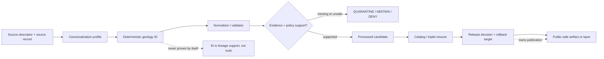

<!-- [KFM_META_BLOCK_V2]
doc_id: kfm://doc/NEEDS-VERIFICATION/packages-domains-geology-identity-readme
title: Geology Identity Package README
type: standard
version: v1
status: draft
owners: OWNER_TBD
created: 2026-06-14
updated: 2026-06-14
policy_label: public
related: [packages/domains/geology/README.md, packages/domains/geology/src/README.md, docs/domains/geology/README.md, docs/architecture/geology/TRUST_PATH.md, docs/architecture/geology/DATA_LIFECYCLE.md, docs/adr/ADR-geology-schema-home.md, docs/adr/ADR-geology-identity.md, schemas/contracts/v1/geology/, contracts/domains/geology/, policy/geology/, data/registry/geology/, tests/geology/, fixtures/domains/geology/]
tags: [kfm, geology, identity, deterministic-id, hashing, packages, evidence, provenance, rollback]
notes: ["README-like package document for geology identity helpers.", "Target path is user-requested and Directory Rules-compatible as a package/domain segment, but package metadata, imports, tests, and CI remain NEEDS VERIFICATION until checked in the live repo.", "This package may compute deterministic identifiers and hashes only; it must not become the canonical schema, contract, source registry, lifecycle data, proof, receipt, release, or policy authority."]
[/KFM_META_BLOCK_V2] -->

# Geology Identity Package

Deterministic identity helpers for geology and non-biological natural-resource objects, evidence-bound claims, public-safe features, and release-aware lineage.

<p>
  
  
  
  
  
  
</p>

> [!IMPORTANT]
> **Status:** PROPOSED package README  
> **Path:** `packages/domains/geology/identity/README.md`  
> **Owning responsibility root:** `packages/`  
> **Domain lane:** `geology`  
> **Repo implementation depth:** NEEDS VERIFICATION — package metadata, package manager, imports, tests, schemas, policies, registries, CI workflows, generated receipts, proof objects, release manifests, and runtime behavior were not inspected in this file-generation pass.

## Quick links

- [Scope](#scope)
- [Repo fit](#repo-fit)
- [Accepted inputs](#accepted-inputs)
- [Exclusions](#exclusions)
- [Identity responsibilities](#identity-responsibilities)
- [Canonicalization rules](#canonicalization-rules)
- [Identifier families](#identifier-families)
- [Trust-boundary flow](#trust-boundary-flow)
- [Collision and supersession handling](#collision-and-supersession-handling)
- [Finite outcomes](#finite-outcomes)
- [Validation and quality gates](#validation-and-quality-gates)
- [Development rules](#development-rules)
- [Definition of done](#definition-of-done)
- [Verification checklist](#verification-checklist)
- [Rollback](#rollback)

---

## Scope

`packages/domains/geology/identity/` is the shared implementation package area for deterministic geology identity helpers.

The helpers in this package may compute stable identifiers, canonical digests, input fingerprints, object-key candidates, and lineage-aware hash material for geology and natural-resource objects. They support reproducible processing, review, catalog closure, rollback, correction, and public-safe layer delivery.

```text
RAW -> WORK / QUARANTINE -> PROCESSED -> CATALOG / TRIPLET -> PUBLISHED
```

Identity helpers may support lifecycle transitions, but they do **not** approve promotion, publish data, define policy, define schema authority, or replace EvidenceBundle support. A stable ID is only a locator and lineage tool. It is not proof that a claim is true, public-safe, current, rights-cleared, or reviewed.

This package may support identity for:

- geologic units and geologic-unit assertions;
- lithology, age, stratigraphic, and correlation assertions;
- contacts, faults, folds, structures, and map-boundary features;
- borehole, well-log, core, measured-section, geophysical, and geochemical references;
- mineral occurrences, deposits, resource estimates, extraction sites, and reclamation sites;
- geology relation edges across hydrology, soil, hazards, infrastructure, archaeology, and other lanes;
- public-safe geology features and layer descriptors;
- EvidenceBundle references, run receipts, redaction receipts, catalog matrices, release manifests, and correction notices when the owning roots provide those objects.

---

## Repo fit

```text
packages/domains/geology/identity/
```

This path is appropriate for reusable implementation helpers because `packages/` owns shared library code and `geology` is a domain segment inside that responsibility root.

| Relationship | Expected home | Boundary rule |
| --- | --- | --- |
| Identity helper code | `packages/domains/geology/identity/` | Computes deterministic keys and digests; does not own source truth or release state. |
| Geology package entrypoint | `packages/domains/geology/README.md` | Explains the broader geology package lane. |
| Importable source code | `packages/domains/geology/src/` or repo-confirmed package layout | Contains source modules if the repo uses a `src/` package layout. |
| Semantic contracts | `contracts/domains/geology/` or repo-confirmed contract home | Defines object meaning and identity semantics. |
| Machine schemas | `schemas/contracts/v1/geology/` or accepted ADR alternative | Defines ID fields, digest fields, and object shapes. |
| Source registry | `data/registry/geology/` or repo-confirmed registry home | Owns source IDs, rights, roles, caveats, cadence, and activation state. |
| Lifecycle data | `data/<phase>/geology/` | Stores source-native, work, quarantined, processed, catalog, triplet, and published records. |
| Receipts and proofs | `data/receipts/geology/`, `data/proofs/geology/`, or repo-confirmed trust-object homes | Stores process memory, validation support, and proof artifacts. |
| Release and rollback | `release/` | Owns promotion decisions, ReleaseManifest objects, correction notices, and rollback targets. |
| Policy | `policy/geology/` or repo-confirmed policy home | Decides public exposure, sensitivity, admissibility, and deny/restrict/abstain outcomes. |
| Tests and fixtures | `tests/geology/`, `fixtures/domains/geology/`, or repo-confirmed equivalents | Proves stable identity behavior and collision handling. |

> [!WARNING]
> Do not use this package as a hidden source registry, schema registry, release ledger, or policy engine. If an identifier helper needs source-role, policy, schema, or release context, receive that context as explicit input from the owning root.

---

## Accepted inputs

Identity functions should receive explicit, canonicalizable inputs and return deterministic outputs with enough explanation for validation and rollback.

| Input family | Accepted examples | Required handling |
| --- | --- | --- |
| Source identity | `source_id`, `source_record_id`, source role, source version, retrieval digest | Preserve source identity; never infer source authority from ID shape alone. |
| Object kind | `GeologicUnit`, `GeologicContact`, `BoreholeReference`, `MineralOccurrence`, `ResourceEstimate`, `PublicGeologyFeature` | Include object kind or schema family in hash material to prevent cross-object collisions. |
| Spatial identity material | source geometry reference, CRS, map scale, generalized geometry ref, internal geometry digest | Keep internal/exact and public/generalized geometry identities separate. |
| Temporal identity material | valid time, source publication date, observed date, retrieval time, release time | Do not collapse source time, event time, run time, and release time into one timestamp. |
| Evidence material | EvidenceRef, EvidenceBundle ID, evidence item digests, citation keys | Use evidence references as support material; do not treat an ID as evidence closure. |
| Method material | normalization version, algorithm version, spec hash, mapping table version | Include versioned method material when method changes can change identity. |
| Claim material | subject, predicate, object, claim text digest, confidence, source role | Separate assertion identity from physical-feature identity. |
| Public-safe transform material | redaction method, geometry role, redaction receipt ref, policy decision ref | Public feature IDs must reflect public-safe geometry role and transform lineage. |

Missing source ID, object kind, schema family, canonicalization profile, or material required by the target ID family should produce a finite failure outcome, not a guessed ID.

---

## Exclusions

| Do not put here | Correct home or owner | Why |
| --- | --- | --- |
| JSON Schemas for ID fields | `schemas/contracts/v1/geology/` or accepted ADR alternative | Machine shape belongs in the schema authority root. |
| Semantic definitions of identity-bearing objects | `contracts/domains/geology/` or accepted ADR alternative | Meaning belongs in contract docs, not helper code comments. |
| Source descriptors or source ID registries | `data/registry/geology/` or repo-confirmed registry home | Source identity, rights, and authority are governed inputs. |
| RAW, WORK, QUARANTINE, PROCESSED, CATALOG, TRIPLET, or PUBLISHED data | `data/<phase>/geology/` | Identity helpers must not own lifecycle state. |
| Proof packs, run receipts, redaction receipts, catalog matrices | `data/proofs/`, `data/receipts/`, `data/catalog/`, or repo-confirmed homes | Trust objects are persisted by owning lifecycle/release systems. |
| Policy decisions or Rego rules | `policy/geology/` | Identity code may expose policy-relevant facts but must not decide policy. |
| Release manifests or rollback cards | `release/` | Release authority remains separate from deterministic ID generation. |
| Live source fetchers, API clients, credentials, or endpoint activation | `connectors/`, `pipelines/`, `pipeline_specs/`, `configs/`, `infra/` | Identity helpers must not activate sources. |
| MapLibre styles, public routes, UI components, or AI prompt templates | `apps/`, `ui/`, `web/`, `packages/maplibre/`, governed AI runtime | Identity is not a public presentation or generated-answer surface. |

---

## Identity responsibilities

This package should make identity boring, reproducible, and inspectable.

| Responsibility | Expected behavior | Failure mode to avoid |
| --- | --- | --- |
| Canonicalize hash material | Sort keys, normalize whitespace, normalize numeric precision only under explicit profile, preserve null/missing distinctions | Same feature hashes differently on each run. |
| Separate identity families | Include object kind, domain, schema version, and identity profile in every digest namespace | A borehole, unit, layer, and claim collide because they share a source ID. |
| Preserve evidence lineage | Include evidence refs/digests where the identity is evidence-bound | ID looks stable but cannot be traced to evidence. |
| Preserve temporal scope | Include valid-time or source-date fields where identity depends on time | Historical and current objects collapse. |
| Preserve public-safe geometry lineage | Distinguish internal geometry IDs from generalized public-feature IDs | Public generalized layer is mistaken for exact internal geometry. |
| Support corrections | Make corrected IDs traceable to superseded IDs through explicit metadata, not mutation | Old release is overwritten without lineage. |
| Emit explanation | Return identity profile, input fields used, fields omitted, digest algorithm, and reason codes | Maintainers cannot reproduce or review an ID. |

---

## Canonicalization rules

Identity output should be deterministic across operating systems, Python/Node versions, JSON serializers, and runtime environments.

Recommended canonicalization profile, pending repo verification:

```yaml
profile: geology_identity_v1
status: PROPOSED
algorithm: sha256
encoding: utf-8
serialization: canonical-json
rules:
  object_kind: required
  domain: geology
  schema_version: required
  source_id: required_when_source_derived
  source_record_id: required_when_available
  sort_object_keys: true
  preserve_null_vs_missing: true
  trim_outer_string_whitespace: true
  collapse_internal_string_whitespace: false
  unicode_normalization: NFC
  numeric_precision: explicit_per_field
  crs_required_for_geometry_hashes: true
  geometry_hash_source: normalized_wkb_or_repo_approved_equivalent
  include_profile_name_in_hash_material: true
```

> [!CAUTION]
> Numeric precision, geometry simplification, coordinate rounding, and CRS transformations are not harmless formatting choices. They can change identity and public exposure. Any such transform must be explicit, versioned, and receipt-ready.

---

## Identifier families

| ID family | Purpose | Minimum material | Notes |
| --- | --- | --- | --- |
| `source_record_identity` | Stable key for a source-native row or feature reference | source ID, source version, source record key, retrieval digest where applicable | Does not prove the source is authoritative or public-safe. |
| `geology_object_identity` | Stable key for normalized geology objects | domain, object kind, schema version, source identity, canonical object fields | Used before public release; may remain internal. |
| `assertion_identity` | Stable key for evidence-bound claims | subject, predicate, object, source role, evidence refs, valid time | Assertions are not the same as physical objects. |
| `geometry_identity` | Stable key for exact/internal geometry | geometry role, CRS, geometry digest, source scale, method version | Restricted by default when sensitive. |
| `public_feature_identity` | Stable key for public-safe geometry/features | public geometry digest, redaction/generalization profile, policy decision ref, release ref | Must not imply exact location. |
| `layer_identity` | Stable key for layer manifest or released layer candidate | layer type, artifact digest, release/candidate ref, catalog refs, policy ref | Layer IDs are downstream carriers, not truth. |
| `run_identity` | Stable key for deterministic package runs | spec hash, input digests, code ref, parameters, actor/service | Persist as receipt material outside this package. |
| `correction_identity` | Stable key for correction/supersession notices | affected IDs, correction type, replacement refs, review ref, effective date | Supports rollback and public lineage. |

---

## Trust-boundary flow



The ID helps KFM find, compare, deduplicate, supersede, and roll back objects. It does not move an object through the lifecycle by itself.

---

## Collision and supersession handling

| Condition | Outcome | Required response |
| --- | --- | --- |
| Same canonical material, same profile, same ID | `ANSWER` | Treat as deterministic match; preserve both source refs if applicable. |
| Same source record but changed canonical material | `NEEDS_REVIEW` | Compare source version, retrieval digest, and field changes; emit receipt-ready diff. |
| Different objects produce same ID | `ERROR` | Block promotion; open collision incident; add regression fixture. |
| Same public feature but different internal geometry | `NEEDS_REVIEW` | Confirm redaction/generalization profile and source version before treating as unchanged. |
| Schema or canonicalization profile changes | `ABSTAIN` until migration plan exists | Require migration/supersession note and test fixtures. |
| Corrected object replaces prior object | `ANSWER` with supersession metadata | Keep old ID queryable; link replacement and CorrectionNotice. |
| Rights/sensitivity policy changes affect public ID | `DENY` or `RESTRICT` until reviewed | Do not silently keep public layer visible. |

---

## Finite outcomes

Identity helpers should return typed outcomes instead of raising ambiguous exceptions for expected governance conditions.

| Outcome | Use when |
| --- | --- |
| `ANSWER` | ID was computed deterministically from complete supported inputs. |
| `ABSTAIN` | Required material is missing or unsupported, but not necessarily unsafe. |
| `DENY` | Inputs would create an unsafe, rights-uncleared, or policy-invalid public identity. |
| `RESTRICT` | ID may be computed for steward/internal use but must not support public output. |
| `NEEDS_REVIEW` | Collision, source change, schema/profile migration, or sensitivity issue requires steward review. |
| `ERROR` | Canonicalization or digest computation failed unexpectedly. |

Every non-`ANSWER` outcome should carry machine-readable reason codes and enough context for a receipt, test assertion, or review ticket.

---

## Validation and quality gates

Minimum gates before this helper is treated as active:

- [ ] Canonicalization profile documented and versioned.
- [ ] Identity fields aligned with accepted geology contracts and schemas.
- [ ] Collision fixtures exist for object-kind, source, geometry, temporal, and profile boundaries.
- [ ] Public-safe geometry IDs differ from internal exact geometry IDs.
- [ ] Missing source ID, schema version, object kind, CRS, or evidence context produces finite outcomes.
- [ ] Correction and supersession fixtures preserve old IDs and link replacements.
- [ ] No helper writes to `data/`, `release/`, `schemas/`, `contracts/`, `policy/`, or registries as a side effect.
- [ ] Tests run without live network access.
- [ ] Package outputs include digest algorithm, profile name, version, and material summary.
- [ ] README links are verified against the mounted repo.

---

## Development rules

1. Keep identity functions pure where practical.
2. Pass source, evidence, policy, schema, and release context explicitly.
3. Never derive public-safe identity from exact sensitive geometry without a redaction/generalization profile.
4. Never treat source-native IDs as globally unique unless the source descriptor says so.
5. Never collapse administrative IDs, physical geology IDs, evidence IDs, and public layer IDs into one namespace.
6. Return finite outcomes for governance failures.
7. Keep hash input material inspectable in tests without exposing sensitive raw coordinates in public fixtures.
8. Add fixtures for every new identity profile before using it in a release path.

---

## Definition of done

This README is ready to support implementation when:

- [ ] `OWNER_TBD` is replaced with a responsible maintainer or team.
- [ ] `ADR-geology-identity.md` exists or this README links to the accepted identity decision.
- [ ] The package manager and import path are confirmed.
- [ ] Identity profiles are represented in schemas/contracts or an accepted ADR.
- [ ] Tests prove deterministic output across repeated runs.
- [ ] Collision and supersession behavior is fixture-backed.
- [ ] Public-safe geometry identity is tested separately from internal geometry identity.
- [ ] Release/correction/rollback dependencies are referenced without being package-owned.

---

## Verification checklist

- [ ] Confirm this path exists in the live repo or create it in the same PR.
- [ ] Confirm adjacent package README links.
- [ ] Confirm schema home for geology ID fields.
- [ ] Confirm contract home for geology object semantics.
- [ ] Confirm source registry path and source ID conventions.
- [ ] Confirm policy profile for exact/internal vs public-safe geology geometry.
- [ ] Confirm receipt/proof/release object homes.
- [ ] Confirm CI runs identity fixtures without live network access.
- [ ] Confirm no public path bypasses EvidenceBundle, policy, review, release, and rollback checks.

---

## Rollback

Rollback is required if an identity helper creates unstable IDs, hides collisions, collapses public-safe and internal geometry, rewrites prior IDs without supersession lineage, duplicates schema/contract/policy authority, or causes public artifacts to appear supported without EvidenceBundle and release closure.

Rollback target: `ROLLBACK_TARGET_TBD_AFTER_FIRST_PR`

Rollback steps:

1. Disable consuming pipeline step or package export.
2. Preserve emitted IDs and receipts for audit.
3. Revert to the prior identity profile or prior release manifest.
4. Emit or update a correction notice for any public artifact affected.
5. Add a regression fixture for the failure mode.
6. Re-run catalog/release closure before restoring public use.

---

## Evidence boundary

> [!NOTE]
> This README is doctrine-grounded and implementation-oriented, but current repository behavior remains **NEEDS VERIFICATION** where package files, imports, tests, CI, schemas, policy bundles, release manifests, generated receipts, and runtime logs were not inspected in this pass.

