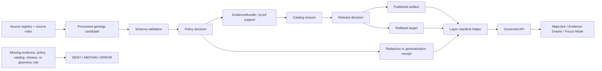

<!-- [KFM_META_BLOCK_V2]
doc_id: kfm://doc/NEEDS-VERIFICATION/packages-domains-geology-layer-manifest-readme
title: Geology Layer Manifest Package README
type: standard
version: v1
status: draft
owners: OWNER_TBD
created: 2026-06-14
updated: 2026-06-14
policy_label: public
related: [packages/domains/geology/README.md, packages/domains/geology/src/README.md, docs/domains/geology/README.md, docs/architecture/geology/TRUST_PATH.md, docs/architecture/geology/DATA_LIFECYCLE.md, docs/adr/ADR-geology-public-safe-geometry.md, docs/adr/ADR-geology-schema-home.md, schemas/contracts/v1/geology/, policy/geology/, data/registry/geology/, data/catalog/domain/geology/, data/published/layers/geology/, data/proofs/geology/, data/receipts/geology/, release/]
tags: [kfm, geology, natural-resources, layer-manifest, maplibre, public-safe-geometry, evidence, release]
notes: ["README-like package document for geology layer-manifest helpers.", "Target path is user-requested and Directory Rules-compatible as a package/domain segment, but actual repo layout, package metadata, imports, tests, schemas, policies, and CI remain NEEDS VERIFICATION until a mounted repository confirms them.", "This package may build layer-manifest payloads only; it must not become a release-manifest, source-registry, catalog, proof, receipt, policy, schema, or publication authority."]
[/KFM_META_BLOCK_V2] -->

# Geology Layer Manifest Helpers

Build public-safe geology layer-manifest payloads for governed KFM map, API, Evidence Drawer, and Focus Mode surfaces without turning map layers into truth stores.

<p>
  
  
  
  
  
  
  
</p>

> [!IMPORTANT]
> **Status:** PROPOSED package README  
> **Path:** `packages/domains/geology/layer_manifest/README.md`  
> **Owning responsibility root:** `packages/`  
> **Domain lane:** `geology`  
> **Repo implementation depth:** NEEDS VERIFICATION — package metadata, import layout, schema names, policy names, tests, workflows, release manifests, proof objects, catalog records, tile artifacts, API routes, UI components, and runtime behavior were not inspected in this file-generation pass.

## Quick links

- [Scope](#scope)
- [Repo fit](#repo-fit)
- [Accepted inputs](#accepted-inputs)
- [Exclusions](#exclusions)
- [What a layer manifest is](#what-a-layer-manifest-is)
- [Manifest boundary rules](#manifest-boundary-rules)
- [Trust flow](#trust-flow)
- [Proposed directory map](#proposed-directory-map)
- [Manifest shape](#manifest-shape)
- [Finite outcomes](#finite-outcomes)
- [Validation gates](#validation-gates)
- [Development rules](#development-rules)
- [Definition of done](#definition-of-done)
- [Verification checklist](#verification-checklist)
- [Rollback](#rollback)

---

## Scope

`packages/domains/geology/layer_manifest/` is a shared implementation helper area for assembling **geology layer-manifest payloads** after upstream source, evidence, policy, catalog, proof, and release checks have supplied the required inputs.

This package helps describe **how a released or release-candidate geology layer may be rendered and inspected**. It does not decide whether the layer should exist, whether it can be public, whether source rights are sufficient, whether evidence is complete, or whether a release is approved.

Layer-manifest helpers may support:

- bedrock geology layer descriptors;
- surficial geology layer descriptors;
- geology boundary and contact layers;
- fault, fold, structure, and lineament layers;
- borehole or well-reference layers only when public-safe exposure is approved;
- mineral occurrence and resource-context layers only with correct source-role and resource-classification limits;
- map-unit legend and style hints;
- MapLibre source/layer descriptors backed by released artifacts;
- Evidence Drawer lookup payloads;
- Focus Mode context payloads that remain evidence-subordinate;
- stale-state, supersession, correction, and rollback references.

```text
RAW -> WORK / QUARANTINE -> PROCESSED -> CATALOG / TRIPLET -> PUBLISHED
```

Layer manifests are downstream carriers. They must point back to release, catalog, evidence, policy, proof, and rollback support rather than replacing any of those object families.

---

## Repo fit

```text
packages/domains/geology/layer_manifest/
```

This path is appropriate for reusable implementation helpers because `packages/` owns shared library code and `geology` is a domain segment inside that responsibility root.

| Relationship | Expected home | Boundary rule |
| --- | --- | --- |
| Layer-manifest helper code | `packages/domains/geology/layer_manifest/` | Builds or validates layer-manifest payloads; does not own release decisions. |
| Geology package entrypoint | `packages/domains/geology/README.md` | Explains the broader package lane. |
| Importable source code | `packages/domains/geology/src/` or repo-confirmed package layout | Contains source modules if the repo uses a `src/` package layout. |
| Domain documentation | `docs/domains/geology/` | Explains geology lane stewardship and boundaries. |
| Architecture documentation | `docs/architecture/geology/` | Explains trust path, lifecycle, object model, and integration design. |
| Semantic contracts | `contracts/domains/geology/` or repo-confirmed contract home | Defines object meaning; manifests reference contract identifiers. |
| Machine schemas | `schemas/contracts/v1/geology/` or repo-confirmed schema home | Defines manifest and supporting object shape. |
| Source registries | `data/registry/geology/` or repo-confirmed registry home | Owns source identity, roles, rights, caveats, cadence, sensitivity, and activation state. |
| Catalog records | `data/catalog/{stac,dcat,prov,domain}/geology/` or repo-confirmed catalog home | Owns catalog closure and discoverability metadata. |
| Published layer artifacts | `data/published/layers/geology/` or repo-confirmed published-artifact home | Owns released GeoParquet, PMTiles, COG, MVT, or other map artifacts. |
| Receipts and proofs | `data/receipts/geology/`, `data/proofs/geology/`, or repo-confirmed trust-object homes | Owns process memory and release-significant support. |
| Policy | `policy/geology/` or repo-confirmed policy home | Decides public-safe geometry, sensitivity, admissibility, deny/restrict/abstain outcomes. |
| Release and rollback | `release/` | Owns release manifests, promotion decisions, correction notices, and rollback targets. |
| UI / API / Focus Mode | `apps/`, `ui/`, `web/`, `runtime/`, or repo-confirmed homes | Consumes governed layer manifests; must not read internal stores directly. |

> [!WARNING]
> A **layer manifest** is not a **ReleaseManifest**. This package may help describe a map layer, but release decisions and rollback records belong under `release/` or the repo-confirmed release authority.

---

## Accepted inputs

Layer-manifest builders should accept explicit, already-governed inputs. They should not fetch live data, infer hidden policy approval, or silently downgrade missing evidence.

| Input family | Accepted examples | Required handling |
| --- | --- | --- |
| Released artifact reference | artifact URI/path, digest, media type, tile matrix, bounds, min/max zoom, CRS, byte-range support | Verify digest/reference fields are present; do not treat an artifact path as evidence. |
| Release context | `release_id`, release state, promotion decision reference, rollback target, supersession reference | Require release linkage before a public layer is marked publishable. |
| Evidence context | `evidence_lookup_ref`, EvidenceBundle reference, CitationValidationReport reference, proof reference | Keep evidence discoverable from UI/API; missing evidence support yields `ABSTAIN` or `DENY`. |
| Policy context | PolicyDecision reference, sensitivity tier, public-safe geometry decision, redaction receipt | Do not emit public exact geometry without explicit policy support. |
| Geometry role | `exact_internal`, `generalized_public`, `withheld`, `centroid_public`, `source_scale_boundary`, `restricted` | Geometry role must be explicit and must match the artifact and policy decision. |
| Source context | source IDs, source roles, source caveats, source scale/date, rights profile | Keep source role and caveats visible; do not overclaim source authority. |
| Catalog closure | STAC, DCAT, PROV, domain catalog refs, catalog matrix/digest | Public layers require catalog closure before release. |
| Rendering hints | layer purpose, style token, legend token, attribution, interaction affordances | Rendering hints are presentation metadata, not proof. |
| Temporal context | source date, valid interval, artifact build time, release time, supersession time | Keep these timestamps distinct. |
| User-facing safety labels | scale warning, generalized-location warning, rights caveat, stale-state badge | Badges must reflect actual metadata; do not decorate uncertainty away. |

Missing release linkage, evidence lookup, catalog closure, policy decision, geometry role, or rollback target should produce a finite failure outcome instead of a public-looking manifest.

---

## Exclusions

| Do not put here | Correct home or owner | Why |
| --- | --- | --- |
| RAW, WORK, QUARANTINE, PROCESSED, CATALOG, TRIPLET, or PUBLISHED data | `data/<phase>/geology/` or repo-confirmed lifecycle stores | Data lifecycle state must remain auditable outside package helpers. |
| Release manifests, promotion decisions, correction notices, rollback cards | `release/` | Release authority is separate from map-layer description. |
| EvidenceBundle stores, proof packs, catalog matrices, run receipts, redaction receipts | `data/proofs/`, `data/receipts/`, `data/catalog/`, or repo-confirmed trust-object homes | Trust objects are not package-local side effects. |
| Source descriptors, rights registries, sensitivity registries | `data/registry/geology/`, `policy/sensitivity/`, or repo-confirmed registry homes | Source authority and sensitivity are governed inputs, not package-owned constants. |
| Policy rules | `policy/geology/` | The package prepares policy inputs and consumes decisions; it does not define policy law. |
| JSON Schemas | `schemas/contracts/v1/geology/` or accepted ADR alternative | Machine shape belongs in the schema authority root. |
| Semantic contracts | `contracts/domains/geology/` or accepted ADR alternative | Meaning belongs in contract docs, not in helper README prose. |
| Live source fetchers, ArcGIS clients, scrapers, credentials, endpoint activation code | `connectors/`, `pipelines/`, `pipeline_specs/`, `configs/`, `infra/` | Source activation is separately governed and reviewable. |
| MapLibre UI components, style sheets, public routes, API endpoints | `apps/`, `ui/`, `web/`, `packages/maplibre/`, or repo-confirmed interface homes | This package may emit descriptors; public surfaces consume them through governed interfaces. |
| AI prompt templates or direct model output | governed AI runtime and AIReceipt surfaces | AI remains evidence-subordinate and cannot authorize a layer. |

---

## What a layer manifest is

A geology layer manifest is a compact, inspectable descriptor for a map-ready geology layer. It tells downstream clients:

1. what released artifact to load;
2. which geometry role the artifact carries;
3. which release, evidence, catalog, policy, source, and rollback objects support it;
4. what warnings or caveats the user must see;
5. which interactions are allowed;
6. which outcomes are allowed when support is missing, stale, superseded, or denied.

It is **not**:

- the source dataset;
- the canonical geology object;
- an EvidenceBundle;
- a policy decision;
- a proof pack;
- a release manifest;
- a MapLibre style authority;
- a generated AI explanation;
- a public publication by itself.

---

## Manifest boundary rules

### Required support before a public manifest

A public geology layer manifest should not be emitted unless the builder receives all of the following support:

- `release_id` or release-candidate reference;
- artifact digest and media type;
- `geometry_role` and exposure class;
- public-safe geometry decision or redaction/generalization receipt when sensitive geometry is involved;
- evidence lookup reference;
- source role and source caveat references;
- catalog closure references;
- policy decision reference;
- rollback or withdrawal target;
- stale/supersession state if applicable.

### High-risk geology cases

The builder should fail closed or require restricted output when handling:

- private water well / WWC5 borehole locations;
- well logs, cores, measured sections, and LAS intervals with access restrictions;
- geochemistry sample localities;
- mineral occurrence locations where exact public exposure could invite harm or misinterpretation;
- resource estimates, reserves, or potential-deposit model outputs;
- extraction sites, permits, leases, and production records that may be administrative rather than physical geology truth;
- layers whose source map scale cannot support the requested visual claim.

### Anti-collapse rules

| Collapse risk | Required behavior |
| --- | --- |
| Tile layer becomes geology truth | Manifest must carry `evidence_lookup_ref`, `release_id`, `policy_decision_ref`, and warnings. |
| Style implies certainty | Legend and style hints must not erase uncertainty, scale, or source-role limits. |
| Public generalized geometry treated as exact | Manifest must state `geometry_role` and redaction/generalization reason. |
| Permit/lease layer treated as physical geology | Source role must limit the claim to administrative context unless evidence supports physical geology. |
| Model output treated as observed deposit | Manifest must label derived/model status and prevent reserve/deposit overclaiming. |
| Old release remains silently visible | Manifest must carry stale/supersession state and rollback/correction links. |

---

## Trust flow



> [!IMPORTANT]
> Public clients should consume layer manifests through governed APIs and released artifacts. They should not read RAW, WORK, QUARANTINE, unpublished candidates, internal canonical stores, direct source systems, or direct AI runtime output as the normal path.

---

## Proposed directory map

> [!NOTE]
> The tree below is PROPOSED. Confirm the actual package language, import path, manifest schema names, test runner, and local conventions before implementation.

```text
packages/domains/geology/layer_manifest/
├── README.md                         # This boundary document
├── __init__.py                       # PROPOSED if this is a Python package segment
├── builders.py                       # PROPOSED: construct manifests from governed inputs
├── models.py                         # PROPOSED: typed manifest DTOs, if not generated from schemas
├── validators.py                     # PROPOSED: local structural checks around canonical schemas
├── outcomes.py                       # PROPOSED: finite outcomes and reason codes
├── warnings.py                       # PROPOSED: scale/sensitivity/rights/stale warning helpers
├── geometry_roles.py                 # PROPOSED: geometry exposure and role helpers
├── catalog_refs.py                   # PROPOSED: STAC/DCAT/PROV/domain catalog reference helpers
├── evidence_refs.py                  # PROPOSED: EvidenceBundle lookup reference helpers
├── release_refs.py                   # PROPOSED: release, supersession, correction, rollback helpers
└── examples/
    ├── README.md                     # PROPOSED: illustrative examples only
    ├── bedrock_public.example.json   # PROPOSED: no-network public-safe example
    └── borehole_withheld.example.json# PROPOSED: restricted/withheld example
```

If the mounted repo uses `src/geology/layer_manifest/` instead, keep this README as the package-level boundary or migrate it with a clear compatibility note. Do not create parallel implementation homes without an ADR or migration note.

---

## Manifest shape

The actual schema belongs in `schemas/contracts/v1/geology/` or the repo-confirmed schema home. The example below is illustrative and should be synchronized with canonical schemas before use.

```json
{
  "manifest_id": "urn:kfm:geology-layer-manifest:sha256:EXAMPLE",
  "domain": "geology",
  "layer_id": "geology.bedrock.public.example",
  "layer_purpose": "public_context_map",
  "release_id": "release:geology:EXAMPLE",
  "artifact": {
    "kind": "pmtiles",
    "href": "data/published/layers/geology/EXAMPLE.pmtiles",
    "sha256": "EXAMPLE_SHA256",
    "media_type": "application/vnd.pmtiles",
    "bounds": [-102.1, 36.9, -94.6, 40.1],
    "minzoom": 0,
    "maxzoom": 12
  },
  "geometry": {
    "geometry_role": "source_scale_boundary",
    "public_exposure": "public_generalized",
    "scale_warning": "Do not interpret this layer beyond the source map scale.",
    "redaction_receipt_ref": null
  },
  "evidence": {
    "evidence_lookup_ref": "kfm://evidence/geology/EXAMPLE",
    "proof_ref": "kfm://proof/geology/EXAMPLE",
    "catalog_matrix_ref": "kfm://catalog-matrix/geology/EXAMPLE"
  },
  "policy": {
    "policy_decision_ref": "kfm://policy-decision/geology/EXAMPLE",
    "sensitivity_tier": "T1_PUBLIC_WITH_CAVEAT",
    "decision": "ALLOW_WITH_WARNINGS"
  },
  "sources": [
    {
      "source_id": "SOURCE_ID_TBD",
      "source_role": "authoritative_geologic_map",
      "caveat_ref": "kfm://source-caveat/NEEDS-VERIFICATION"
    }
  ],
  "ui": {
    "legend_ref": "kfm://legend/geology/EXAMPLE",
    "attribution": "SOURCE_ATTRIBUTION_TBD",
    "evidence_drawer_enabled": true,
    "focus_mode_enabled": true,
    "warnings": [
      "source-scale-limited",
      "evidence-required-for-claims"
    ]
  },
  "release_controls": {
    "rollback_target_ref": "kfm://rollback/geology/EXAMPLE",
    "correction_notice_ref": null,
    "superseded_by": null
  }
}
```

### Minimum required fields

| Field | Why it matters |
| --- | --- |
| `manifest_id` | Stable identity for the layer manifest itself. |
| `layer_id` | Stable layer identity tied to domain, purpose, release, geometry role, and exposure class. |
| `release_id` | Prevents unpublished artifacts from looking public. |
| `artifact.href` + `artifact.sha256` | Binds display to a digestable artifact. |
| `geometry.geometry_role` | Prevents exact/internal, generalized/public, withheld, and restricted geometry collapse. |
| `evidence.evidence_lookup_ref` | Lets users inspect the support behind layer claims. |
| `policy.policy_decision_ref` | Keeps public exposure tied to a policy decision. |
| `sources[].source_id` + `sources[].source_role` | Preserves source authority limits and caveats. |
| `release_controls.rollback_target_ref` | Ensures withdrawal/correction remains possible. |

---

## Finite outcomes

Layer-manifest builders should return finite outcomes rather than raising ambiguous failures or emitting partial public descriptors.

| Outcome | Meaning | Typical trigger |
| --- | --- | --- |
| `ALLOW` | Manifest is structurally complete and support is sufficient for the requested exposure. | Released public artifact with evidence, catalog, policy, source, and rollback refs. |
| `ALLOW_WITH_WARNINGS` | Manifest may be consumed publicly, but warnings must be visible. | Source-scale caveat, generalized geometry, uncertainty, or limited temporal support. |
| `RESTRICT` | Manifest can be produced only for controlled-access surfaces. | Exact borehole/sample/resource locality; restricted rights; sensitive resource geometry. |
| `WITHHOLD_GEOMETRY` | Non-spatial or generalized shell may be shown, but exact geometry cannot be public. | Sensitive or rights-restricted locality. |
| `DENY` | Manifest must not be emitted for the requested use. | Missing policy approval, public exact sensitive geometry, unsupported resource claim. |
| `ABSTAIN` | Support is insufficient to make a layer-readiness claim. | Missing evidence, source role, catalog closure, or release state. |
| `ERROR` | Tooling/input failure prevented evaluation. | Invalid JSON, schema mismatch, digest mismatch, missing required reference. |

---

## Validation gates

A layer manifest is not ready for public consumption until these checks pass in the owning validation system.

- [ ] Manifest validates against the canonical schema.
- [ ] `layer_id` is deterministic and changes when release, role, geometry class, or artifact digest changes.
- [ ] Artifact digest is present and matches the referenced artifact.
- [ ] `release_id` points to a valid release or release-candidate state appropriate to the caller.
- [ ] `geometry_role` is explicit and matches public-safe policy.
- [ ] Redaction/generalization receipt exists when geometry has been transformed, generalized, withheld, or downgraded.
- [ ] Evidence lookup resolves to an EvidenceBundle or reviewed evidence support object.
- [ ] Source IDs and source roles resolve to source registry entries.
- [ ] Catalog closure references exist for STAC/DCAT/PROV/domain catalog records where required.
- [ ] Policy decision is present and compatible with the requested public/restricted exposure.
- [ ] UI warnings reflect source scale, uncertainty, generalized geometry, rights caveats, stale state, and supersession state.
- [ ] Rollback target is present.
- [ ] No direct public path reads RAW, WORK, QUARANTINE, internal exact geometry, unpublished candidates, or direct model runtime output.

---

## Development rules

### Do

- Keep helper functions pure where practical.
- Accept explicit evidence, policy, source, catalog, release, and geometry context.
- Return typed manifest DTOs and finite outcomes.
- Preserve reason codes for every warning, restriction, denial, and abstention.
- Keep rendering hints separate from evidence claims.
- Keep exact/internal and public-safe geometry roles separate.
- Emit digest-ready, receipt-ready metadata for pipeline-owned persistence.
- Write no-network tests with synthetic fixtures.

### Do not

- Fetch live geology sources from layer-manifest builders.
- Decide source authority from a filename, layer name, or map style.
- Treat a PMTiles, MVT, GeoParquet, COG, or style JSON artifact as evidence by itself.
- Treat a MapLibre popup as a claim authority.
- Treat administrative geology/resource records as physical geology truth.
- Publish exact sensitive geometry by default.
- Store proofs, receipts, release decisions, or source registries as hidden package side effects.
- Let AI explanations populate manifest fields that require evidence, policy, or release support.

---

## Definition of done

A first useful implementation slice is done when:

- [ ] This README is linked from `packages/domains/geology/README.md` or equivalent package index.
- [ ] The actual package layout is verified and this path is adjusted if needed.
- [ ] Canonical layer-manifest schema path is confirmed.
- [ ] A public-safe bedrock or surficial geology fixture produces `ALLOW_WITH_WARNINGS`.
- [ ] A sensitive borehole or sample-locality fixture produces `WITHHOLD_GEOMETRY`, `RESTRICT`, or `DENY` as policy requires.
- [ ] Missing evidence, missing policy, missing release, and digest mismatch fixtures produce finite failures.
- [ ] Tests prove no manifest is public-ready without `release_id`, `evidence_lookup_ref`, `policy_decision_ref`, `geometry_role`, catalog closure, artifact digest, and rollback target.
- [ ] Public UI/API consumers are documented as governed-interface consumers only.
- [ ] Rollback/correction behavior is docume
