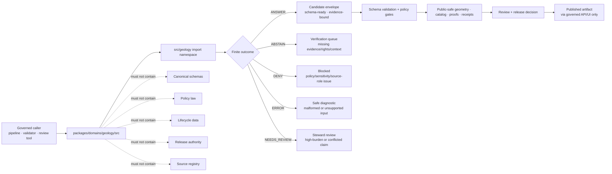

<!-- [KFM_META_BLOCK_V2]
doc_id: kfm://doc/NEEDS-VERIFICATION/packages-domains-geology-src-readme
title: Geology Package Source Layout README
type: standard
version: v1
status: draft
owners: OWNER_TBD
created: 2026-06-14
updated: 2026-06-14
policy_label: public
related: [packages/domains/geology/README.md, packages/domains/geology/src/geology/README.md, docs/domains/geology/README.md, docs/architecture/geology/TRUST_PATH.md, docs/architecture/geology/DATA_LIFECYCLE.md, docs/adr/ADR-geology-schema-home.md, docs/adr/ADR-geology-source-role-model.md, docs/adr/ADR-geology-public-safe-geometry.md, schemas/contracts/v1/geology/, contracts/domains/geology/, policy/geology/, data/registry/geology/, tests/geology/]
tags: [kfm, geology, natural-resources, packages, src-layout, source-code, evidence, source-roles, public-safe-geometry]
notes: ["README-like source-layout document for the Geology and Natural Resources package.", "Repo implementation depth remains NEEDS VERIFICATION until a mounted repo confirms package metadata, source files, imports, tests, CI, and runtime behavior.", "This directory may carry package source code only; it must not become a schema, contract, policy, source-registry, lifecycle-data, release, receipt, proof, catalog, or publication authority."]
[/KFM_META_BLOCK_V2] -->

# Geology Package Source Layout

Source-layout boundary for Geology and Natural Resources package code that supports governed normalization, source-role handling, public-safe geometry, resource classification, and catalog-ready payload helpers without becoming a truth or publication authority.

<p>
  
  
  
  
  
  
</p>

> [!IMPORTANT]
> **Status:** PROPOSED package source-layout README  
> **Path:** `packages/domains/geology/src/README.md`  
> **Owning responsibility root:** `packages/`  
> **Domain lane:** `geology`  
> **Repo implementation depth:** NEEDS VERIFICATION — package metadata, import namespace, source files, tests, fixtures, CI gates, schema homes, policy tooling, source registries, release objects, and runtime behavior were not inspected in this file-generation pass.

## Quick links

- [Scope](#scope)
- [Repo fit](#repo-fit)
- [Accepted inputs](#accepted-inputs)
- [Exclusions](#exclusions)
- [Directory map](#directory-map)
- [Import boundary](#import-boundary)
- [Trust-boundary flow](#trust-boundary-flow)
- [Source-role anti-collapse rules](#source-role-anti-collapse-rules)
- [Development rules](#development-rules)
- [Proposed local checks](#proposed-local-checks)
- [Definition of done](#definition-of-done)
- [Verification checklist](#verification-checklist)
- [Rollback](#rollback)

---

## Scope

`packages/domains/geology/src/` is the source-layout container for importable Geology and Natural Resources package code.

It should contain source modules only. Its job is to keep the code-bearing portion of the package separate from package docs, package metadata, fixtures, tests, lifecycle data, source registries, schemas, contracts, policies, receipts, proofs, catalog records, release manifests, correction notices, rollback cards, public artifacts, and AI/runtime outputs.

This source layout may support helpers for:

- geology candidate normalization;
- source-role resolution and claim-scope checks;
- deterministic geology/resource identity helpers;
- geologic unit, boundary, structure, stratigraphy, lithology, and age helper objects;
- borehole, well-log, core, measured-section, geophysics, and geochemistry reference helpers;
- mineral occurrence, resource estimate, extraction, and reclamation context helpers;
- exact/internal versus public-safe geometry transform preparation;
- EvidenceRef / EvidenceBundle handoff metadata;
- catalog-ready, layer-manifest-ready, receipt-ready, and proof-ready payload preparation;
- finite `ANSWER`, `ABSTAIN`, `DENY`, `ERROR`, and `NEEDS_REVIEW` outcome envelopes for the next governed step.

It must not become the place where KFM decides truth, source authority, rights, sensitivity, policy, review, release, rollback, or publication.

```text
RAW -> WORK / QUARANTINE -> PROCESSED -> CATALOG / TRIPLET -> PUBLISHED
```

Code under this source layout may operate on admitted payloads or governed references from a pipeline. It must not create a direct public path from RAW, WORK, QUARANTINE, unpublished candidates, internal/exact coordinates, direct source captures, direct model output, or internal canonical stores.

---

## Repo fit

```text
packages/domains/geology/src/
└── geology/
```

This path belongs under `packages/` because it is package source code for a shared Geology implementation library. The `geology` segment belongs under the package responsibility root because KFM domains live as lanes inside responsibility roots, not as root-level folders.

| Relationship | Expected home | Boundary rule |
| --- | --- | --- |
| Package source layout | `packages/domains/geology/src/` | Owns source-layout orientation only. |
| Import namespace | `packages/domains/geology/src/geology/` | Owns importable Geology helpers when the repo uses Python `src/` layout. |
| Package-level docs and metadata | `packages/domains/geology/` | Owns package README, package manifest, build metadata, and top-level package coordination after verification. |
| Domain documentation | `docs/domains/geology/` | Explains the domain boundary, stewardship, file map, and lane-level doctrine. |
| Architecture docs | `docs/architecture/geology/` | Explains object model, trust path, lifecycle, and integration boundaries. |
| ADRs | `docs/adr/ADR-geology-*.md` | Records schema-home, source-role, public-safe-geometry, and lineage/supersession decisions. |
| Schemas | `schemas/contracts/v1/geology/` or repo-confirmed schema home | Canonical machine-checkable shape; do not copy schemas into `src/`. |
| Contracts | `contracts/domains/geology/` or repo-confirmed contract home | Canonical object meaning; source code adapts to contracts rather than redefining them. |
| Policy | `policy/geology/` or repo-confirmed policy home | Allow/deny/restrict/abstain logic and public-safe geometry rules; source code prepares inputs, not policy law. |
| Source registry | `data/registry/geology/` or repo-confirmed source-registry home | Source identity, role, rights, cadence, steward, caveats, sensitivity, and activation state live outside package source. |
| Lifecycle data | `data/raw/geology/`, `data/work/geology/`, `data/quarantine/geology/`, `data/processed/geology/`, `data/catalog/.../geology/`, `data/published/geology/` | Data state is auditable outside package code. |
| Fixtures and tests | `fixtures/domains/geology/`, `tests/geology/`, or repo-confirmed equivalents | Source code should be tested with deterministic no-network fixtures. |
| Receipts and proofs | `data/receipts/geology/`, `data/proofs/geology/`, or repo-confirmed trust-object homes | Source code may emit receipt/proof-ready metadata but must not persist trust objects by hidden side effect. |
| Release and rollback | `release/` | Release manifests, promotion decisions, correction notices, and rollback cards live outside source code. |
| Public API/UI/Focus Mode | `apps/`, `ui/`, `web/`, `runtime/`, or repo-confirmed equivalents | Source code may prepare DTOs but cannot own public delivery or AI answer authority. |

> [!WARNING]
> `src/` is not a compatibility root, authority root, lifecycle root, source registry, policy root, schema root, release root, proof root, receipt root, catalog root, or public artifact root. Keep it boring: importable code only.

---

## Accepted inputs

Code under this source layout should accept explicit, inspectable values passed by governed callers.

| Input family | Accepted examples | Required handling |
| --- | --- | --- |
| Governed candidate payloads | Already-admitted map-unit rows, contacts, faults, borehole references, well-log metadata, mineral occurrence references, resource estimate candidates | Preserve source IDs, source-native values, input digests, batch/run context, and reason codes. |
| Source context | `source_id`, source descriptor reference, source role, authority limit, caveat text, rights profile, activation state | Do not infer stronger authority from convenient fields or map styling. |
| Evidence context | EvidenceRef, EvidenceBundle reference, citation requirement, proof/receipt references | Keep evidence closure visible; return finite outcomes when evidence support is missing. |
| Geology object context | unit identifier, map unit code, lithology, stratigraphic rank, age interval, contact/structure class, confidence | Preserve scale, date, source caveats, and interpreted versus observed status. |
| Subsurface context | borehole/well-log/core/section identifier, depth interval, datum, log type, sample context, location exposure class | Keep exact/internal geometry and public-safe exposure separate. |
| Resource context | commodity, occurrence/deposit relation, classification scheme, estimate basis, confidence, reporting date, extraction/reclamation context | Do not treat administrative, lease, permit, or production rows as physical geology proof. |
| Spatial context | internal geometry reference, CRS, map scale, resolution, uncertainty, generalized geometry, redaction class | Never produce public geometry without public-safe classification and reason codes. |
| Temporal context | observed time, source publication date, source update time, retrieval time, valid interval, run time, release time | Keep time meanings separate where material. |
| Rights and sensitivity context | license/terms hints, caveats, sensitive resource flags, private well flags, controlled-access conditions | Treat as policy inputs, not as release approval. |
| Run context | run ID, actor/service ID, package version, spec hash, timestamp, input/output digests | Preserve deterministic, audit-ready metadata. |

Missing source role, evidence context, rights/sensitivity context, or public-safe geometry context should produce a finite failure outcome rather than silent best-effort public output.

---

## Exclusions

| Do not put in `src/` | Correct home or owner |
| --- | --- |
| RAW, WORK, QUARANTINE, PROCESSED, CATALOG, TRIPLET, PUBLISHED data | `data/<phase>/geology/` or repo-confirmed lifecycle stores. |
| Source descriptors, rights registries, sensitivity registries, source-role registries, resource-classification registries | `data/registry/geology/` or repo-confirmed registry homes. |
| Canonical JSON Schemas | `schemas/contracts/v1/geology/` or accepted ADR alternative. |
| Semantic contracts | `contracts/domains/geology/` or accepted ADR alternative. |
| OPA/Rego policy, source activation policy, public-safe geometry law, release policy | `policy/geology/` or accepted ADR alternative. |
| Live source fetchers, ArcGIS clients, scrapers, credentials, tokens, endpoint activation code | `connectors/`, `pipelines/`, `pipeline_specs/`, `configs/`, `infra/`, or deployment secret systems. |
| Repo-wide validators, generators, builders, CI entry points | `tools/validators/`, `tools/`, `.github/workflows/`, or repo-confirmed equivalents. |
| Tests and golden/invalid fixtures | `tests/geology/`, `fixtures/domains/geology/`, or repo-confirmed equivalents. |
| EvidenceBundle stores, receipts, proofs, catalog matrices, release manifests, correction notices, rollback cards | `data/proofs/`, `data/receipts/`, `data/catalog/`, `release/`, or pipeline-owned stores. |
| Public API routes, UI panels, MapLibre styles, Evidence Drawer fixtures, Focus Mode answer templates | `apps/`, `ui/`, `web/`, `runtime/`, or repo-confirmed public-interface homes. |
| AI prompts or generated geology explanations as truth | Governed AI runtime and AIReceipt surfaces; AI remains evidence-subordinate. |

---

## Directory map

> [!NOTE]
> The tree below is PROPOSED. Confirm package manifest, language layout, local imports, sibling package directories, and tests before implementation.

```text
packages/domains/geology/src/
├── README.md                    # This source-layout boundary document
└── geology/
    ├── README.md                # PROPOSED: import namespace README
    ├── __init__.py              # PROPOSED: stable reviewed exports only
    ├── py.typed                 # PROPOSED: typed package marker if Python typing is used
    ├── outcomes.py              # PROPOSED: finite outcome envelopes and reason codes
    ├── identifiers.py           # PROPOSED: deterministic ID helpers
    ├── evidence.py              # PROPOSED: EvidenceRef helpers, not evidence storage
    ├── temporal.py              # PROPOSED: time semantics helpers
    ├── spatial.py               # PROPOSED: geometry metadata and exposure helpers
    ├── source_roles.py          # PROPOSED: source-role claim-scope checks
    ├── units.py                 # PROPOSED: geologic unit / stratigraphy helpers
    ├── structures.py            # PROPOSED: contacts, faults, folds, lineaments helpers
    ├── subsurface.py            # PROPOSED: borehole, log, core, section helpers
    ├── resources.py             # PROPOSED: occurrence/deposit/estimate helpers
    ├── normalizers/             # PROPOSED: source-normalization modules when repo convention allows
    ├── public_safe_geometry/    # PROPOSED: redaction/generalization helper interfaces
    ├── resource_classification/ # PROPOSED: classification scheme adapters
    └── layer_manifests/         # PROPOSED: layer-manifest payload builders
```

If the mounted repository uses a different package layout, preserve the responsibility boundaries above and update this README rather than forcing this exact tree.

---

## Import boundary

### Allowed imports

Source modules may import:

- package-local helper modules;
- stable shared KFM package helpers after verification;
- schema-generated types or contract adapters from canonical homes;
- standard library modules;
- carefully reviewed geospatial dependencies when package metadata and CI support are confirmed.

### Avoid imports that create hidden authority

Source modules must avoid importing or embedding:

- live source clients as a side effect;
- credentials or environment-specific configuration;
- policy rule bodies copied from `policy/`;
- schema definitions copied from `schemas/`;
- source descriptor or source-role registries copied from `data/registry/`;
- release manifest builders that publish directly;
- UI/API/runtime code that bypasses governed interfaces;
- test fixtures or sample data as production defaults.

### Export rule

Keep package exports narrow and stable. `src/geology/__init__.py` should expose reviewed public interfaces only.

Illustrative only:

```python
# PROPOSED example only — synchronize with actual package code before use.
from geology.outcomes import GeologyOutcome, GeologyOutcomeStatus

__all__ = [
    "GeologyOutcome",
    "GeologyOutcomeStatus",
]
```

---

## Trust-boundary flow



---

## Source-role anti-collapse rules

The main geology source-code rule is to keep source character and claim scope visible.

| Source character | Can support | Must not be treated as |
| --- | --- | --- |
| Geologic map interpretation | Interpreted unit/contact/structure claims within stated scale/date/caveat | Direct observation at unlimited precision. |
| Borehole / well-log / core reference | Evidence of a logged or sampled subsurface record | Public-safe exact location or complete subsurface truth without review. |
| Geophysical / geochemical measurement | Measurement evidence under method, instrument, processing, and detection-limit caveats | Resource reserve proof by itself. |
| Mineral occurrence record | Occurrence/reference evidence with source caveats | Active extraction site, reserve estimate, or public claim of economic value. |
| Resource estimate | A classified estimate under a named scheme and date | Physical geology fact independent of classification and reporting basis. |
| Permit / lease / regulatory row | Administrative or legal context | Physical geology, resource existence proof, title truth, or ownership truth. |
| Production record | Reported extraction/production evidence | Geologic unit boundary, reserve, ownership, or title truth. |
| Modeled potential surface | Derived interpretation or analytical hypothesis | Known deposit, reserve, or observed occurrence. |
| Public map layer | Released visualization artifact | Canonical truth, release decision, evidence bundle, or policy authority. |
| AI summary | Interpretive downstream language | Evidence, policy, review, release, or source authority. |

> [!CAUTION]
> Resource, borehole, well-log, private-well, sample-locality, extraction, and exact-location outputs are sensitive until policy, evidence, source role, rights, review, and release state prove otherwise.

---

## Development rules

1. Keep code deterministic, typed where possible, and easy to fixture-test.
2. Prefer explicit finite outcomes over silent `None`, hidden drops, or unreviewable exceptions for expected governance failures.
3. Preserve source-native IDs, source roles, evidence references, time precision, geometry precision, rights context, sensitivity context, and run/spec digests.
4. Return `ABSTAIN` when evidence, source role, rights, sensitivity, temporal, spatial, or review context is incomplete.
5. Return `DENY` when a requested operation is known unsafe, disallowed, rights-blocked, sensitivity-blocked, or profile-incompatible.
6. Return `ERROR` for malformed or unsupported inputs and keep diagnostics public-safe.
7. Return `NEEDS_REVIEW` for high-burden or conflicted geology/resource claims such as reserve/resource estimates, sensitive borehole locations, or source-caveat conflicts.
8. Never write lifecycle data, source registries, policy files, schemas, contracts, receipts, proofs, catalogs, releases, rollback cards, or public artifacts from this directory by hidden side effect.
9. Never leak exact sensitive geology/resource geometry through logs, exceptions, doctests, fixture snapshots, generated summaries, or public-safe layer builders.
10. Keep modeled surfaces, generalized display layers, regulatory records, production records, and AI explanations distinct from evidence-backed geology/resource claims.
11. Update this README whenever the package layout, import boundary, or authority split changes materially.

---

## Proposed local checks

> [!CAUTION]
> Commands are PROPOSED until the mounted repo confirms package manager, test runner, Python environment, type checker, and validator entry points.

```bash
# PROPOSED: package and domain tests, adjusted to repo convention.
python -m pytest tests/geology packages/domains/geology -q
```

```bash
# PROPOSED: type check only if repo uses mypy, pyright, or an equivalent gate.
python -m mypy packages/domains/geology/src
```

```bash
# PROPOSED: validate package boundaries through a repo-confirmed validator.
python tools/validators/validate_geology_package.py --package packages/domains/geology
```

---

## Definition of done

- [ ] Target path confirmed against Directory Rules and mounted repo evidence.
- [ ] Package manifest confirms the active source layout.
- [ ] `src/geology/` import namespace is present or intentionally deferred.
- [ ] `__init__.py` exports only stable, reviewed surfaces.
- [ ] Package source contains no hidden source fetchers, credentials, live network calls, or publication side effects.
- [ ] Package source does not contain canonical schemas, contracts, policy law, source registries, lifecycle data, releases, receipts, proofs, catalogs, rollback cards, or public artifacts.
- [ ] No-network fixtures cover `ANSWER`, `ABSTAIN`, `DENY`, `ERROR`, and `NEEDS_REVIEW` cases.
- [ ] Tests cover missing evidence, unknown source role, rights-blocked records, sensitive geometry, ambiguous resource classification, stale temporal context, malformed input, source-caveat conflict, and release-blocked candidates.
- [ ] Documentation links from package README and helper READMEs are updated.
- [ ] Any decision to mirror helper directories inside and outside `src/geology/` has a compatibility note and regression tests.

---

## Verification checklist

- [ ] Confirm whether the repo uses Python `src/` layout for domain packages.
- [ ] Confirm package manager, lockfile, test runner, type checker, and CI gates.
- [ ] Confirm whether `packages/domains/geology/src/` exists in the mounted repo or should be created in the same PR as package metadata.
- [ ] Confirm actual import path and package name.
- [ ] Confirm canonical schema path under `schemas/contracts/v1/geology/` or accepted ADR alternative.
- [ ] Confirm semantic contract path under `contracts/domains/geology/` or accepted ADR alternative.
- [ ] Confirm policy path under `policy/geology/` or accepted ADR alternative.
- [ ] Confirm source registry home and source-role vocabulary.
- [ ] Confirm source-specific connector/pipeline boundaries.
- [ ] Confirm fixture and test homes.
- [ ] Confirm CODEOWNERS or equivalent review ownership.
- [ ] Confirm no direct public client can import this package to bypass governed API/release surfaces.
- [ ] Confirm rollback target and correction path for any release-significant outputs that depend on package behavior.

---

## Rollback

Rollback is required if this directory becomes a hidden authority root, bypasses policy or release gates, leaks exact sensitive geometry, silently fetches live sources, stores lifecycle data, publishes candidates as truth, or creates divergent schema/contract/policy/source-registry definitions.

Rollback target: `ROLLBACK_TARGET_TBD_AFTER_REPO_INSPECTION`

Minimum rollback action:

1. Revert the code or README change that created the authority drift.
2. Restore prior import paths or compatibility shims when downstream callers require them.
3. Move misplaced schemas, contracts, policy, source registries, lifecycle data, receipts, proofs, catalogs, releases, rollback cards, or fixtures back to their owning roots.
4. Quarantine or withdraw affected release candidates if package behavior influenced them.
5. File or update `docs/registers/DRIFT_REGISTER.md` when placement or authority conflict caused the rollback.
6. Add a regression test or validator rule preventing the same bypass from returning.

---

## Maintainer notes

- This README documents the source-layout boundary, not verified runtime behavior.
- Treat package source as a helper layer, not the Geology truth system.
- Keep code small, deterministic, no-network by default, and evidence/policy/release subordinate.
- When context is incomplete, prefer `ABSTAIN` over confidence.
- Public-facing geology/resource claims still require EvidenceBundle support, policy clearance, review state, release state, and correction/rollback path outside this directory.

<details>
<summary>Evidence boundary and open questions</summary>

## Evidence boundary

This README is a repo-useful draft based on KFM Directory Rules and the Geology & Natural Resources architecture plan. It does not prove that the target repository currently contains this source layout, import namespace, helper modules, schema files, tests, polic
