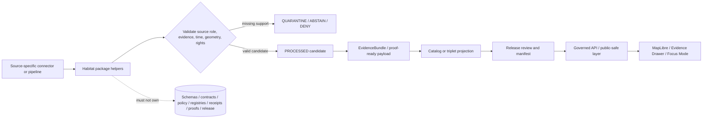

<!-- [KFM_META_BLOCK_V2]
doc_id: kfm://doc/NEEDS-VERIFICATION/packages-domains-habitat-readme
title: Habitat Domain Package README
type: standard
version: v1
status: draft
owners: OWNER_TBD
created: 2026-06-14
updated: 2026-06-14
policy_label: public
related: [docs/domains/habitat/README.md, docs/architecture/habitat/HABITAT_CONTROL_PLANE_INDEX.md, docs/architecture/habitat/HABITAT_ARCHITECTURE.md, docs/architecture/habitat/SOURCE_ROLE_TAXONOMY.md, docs/architecture/habitat/GEOPRIVACY_AND_SENSITIVITY.md, docs/architecture/habitat/RUNTIME_EVIDENCE_MODEL.md, docs/architecture/habitat/PUBLICATION_RULES.md, schemas/contracts/v1/domains/habitat/, contracts/domains/habitat/, policy/habitat/, data/registry/habitat/, tests/domains/habitat/, fixtures/domains/habitat/]
tags: [kfm, habitat, packages, ecology, source-roles, evidence, geoprivacy, public-safe-layers]
notes: ["README-like package entrypoint for the Habitat domain package.", "Target path is user-requested and Directory Rules-compatible as a package/domain segment, but actual repo package layout remains NEEDS VERIFICATION until mounted repo evidence confirms package metadata, imports, tests, and CI.", "This package may contain shared implementation helpers only; it must not become a schema, contract, policy, source-registry, lifecycle-data, release, receipt, proof, or public-publication authority."]
[/KFM_META_BLOCK_V2] -->

# Habitat Domain Package

Shared implementation package for KFM habitat helpers that preserve source roles, evidence closure, sensitivity controls, temporal context, public-safe geometry, and release boundaries.

<p>
  
  
  
  
  
  
</p>

> [!IMPORTANT]
> **Status:** PROPOSED package README  
> **Path:** `packages/domains/habitat/README.md`  
> **Owning responsibility root:** `packages/`  
> **Domain lane:** `habitat`  
> **Repo implementation depth:** NEEDS VERIFICATION — package metadata, package manager, imports, tests, schemas, policies, registries, CI workflows, API routes, UI bindings, generated receipts, proof objects, and runtime behavior were not inspected in this file-generation pass.

## Quick links

- [Scope](#scope)
- [Repo fit](#repo-fit)
- [Accepted inputs](#accepted-inputs)
- [Exclusions](#exclusions)
- [Package responsibilities](#package-responsibilities)
- [Source-role anti-collapse rules](#source-role-anti-collapse-rules)
- [Trust-boundary flow](#trust-boundary-flow)
- [Proposed directory map](#proposed-directory-map)
- [Finite outcomes](#finite-outcomes)
- [Validation and quality gates](#validation-and-quality-gates)
- [Development rules](#development-rules)
- [Definition of done](#definition-of-done)
- [Verification checklist](#verification-checklist)
- [Rollback](#rollback)

---

## Scope

`packages/domains/habitat/` is the shared implementation package lane for habitat helpers.

This package may contain reusable code that helps KFM normalize, classify, validate, compare, transform, and package habitat-related candidate records for governed downstream systems. It does **not** own truth, source authority, policy, lifecycle state, public publication, release approval, steward review, or AI answers.

The package may support these habitat knowledge families:

- regulatory critical habitat and official designation references;
- Kansas state listed-species review context;
- modeled habitat, range, suitability, and ecological-system context;
- occurrence/specimen context when admissible;
- vegetation, land-cover, disturbance, hydrology, soil, elevation, and climate context layers;
- habitat communities, ecological systems, and vegetation associations;
- connectivity, corridor, barrier, and fragmentation context;
- stewardship, restoration, management, and ownership context where rights allow;
- temporal habitat state, change, correction, and supersession lineage;
- public-safe generalized habitat layer preparation;
- EvidenceBundle-aware DTO preparation;
- MapLibre, Evidence Drawer, Focus Mode, and governed API support payloads after policy and release controls.

```text
RAW -> WORK / QUARANTINE -> PROCESSED -> CATALOG / TRIPLET -> PUBLISHED
```

The package may help create WORK, QUARANTINE, PROCESSED, catalog-ready, proof-ready, receipt-ready, or layer-manifest-ready payloads. It must not publish, promote, bypass review, or turn generated summaries, model outputs, map tiles, graph edges, public layer labels, or source convenience fields into sovereign truth.

---

## Repo fit

```text
packages/domains/habitat/
```

This path is appropriate for shared implementation helpers because `packages/` owns reusable library code and `habitat` is a domain segment inside that responsibility root.

| Relationship | Expected home | Boundary rule |
| --- | --- | --- |
| Shared package helpers | `packages/domains/habitat/` | Owns reusable implementation code only. |
| Domain documentation | `docs/domains/habitat/` | Explains domain purpose, stewardship, file map, and lane boundaries. |
| Architecture docs | `docs/architecture/habitat/` | Explains trust path, control plane, object model, lifecycle, and integration design. |
| ADRs | `docs/adr/ADR-habitat-*.md` | Records schema-home, source-role, public-safe-geometry, and doc-lineage decisions. |
| Semantic contracts | `contracts/domains/habitat/` or repo-confirmed contract home | Defines object meaning; package code references, not redefines. |
| Machine schemas | `schemas/contracts/v1/domains/habitat/` or repo-confirmed schema home | Defines machine-checkable shape; package code validates against it. |
| Source registries | `data/registry/habitat/` or repo-confirmed source-registry home | Owns source identity, rights, role, cadence, caveats, sensitivity, and activation state. |
| Policy | `policy/habitat/` or repo-confirmed policy home | Decides allow / deny / restrict / abstain and public-safe geometry rules. |
| Lifecycle data | `data/raw/habitat/`, `data/work/habitat/`, `data/quarantine/habitat/`, `data/processed/habitat/`, `data/catalog/.../habitat/`, `data/published/layers/habitat/` | Stores evidence-bearing and released data by lifecycle phase. |
| Receipts and proofs | `data/receipts/habitat/`, `data/proofs/habitat/`, or repo-confirmed trust-object homes | Stores process memory and release-significant proof artifacts. |
| Release decisions and rollback | `release/` | Owns release manifests, promotion decisions, correction notices, supersession records, and rollback targets. |
| Pipelines and source activation | `pipelines/domains/habitat/`, `pipeline_specs/habitat/`, `connectors/` | Owns executable flows, declarative pipeline config, and source-specific fetch/admission code. |
| Tests and fixtures | `tests/domains/habitat/`, `fixtures/domains/habitat/`, or repo-confirmed equivalents | Proves package behavior with deterministic no-network fixtures. |

> [!WARNING]
> This package must not become a shortcut around `schemas/`, `contracts/`, `policy/`, `data/registry/`, lifecycle directories, `data/receipts/`, `data/proofs/`, or `release/`. If a helper starts owning one of those responsibilities, split the file into the correct root and record the move.

---

## Accepted inputs

Package functions should accept explicit, inspectable values from governed callers. Inputs should carry source, evidence, temporal, spatial, rights, sensitivity, and run context instead of relying on ambient global state.

| Input family | Accepted examples | Required handling |
| --- | --- | --- |
| Source descriptors | `source_id`, source role, rights profile, caveat text, authority limit, activation state | Treat source role as a hard boundary; do not infer stronger authority from a convenient field. |
| Habitat candidate records | Critical-habitat features, modeled habitat classes, ecological-system rows, land-cover classes, connectivity segments, restoration polygons, occurrence-context links | Preserve source-native fields and normalized fields separately. |
| Evidence context | EvidenceRef, EvidenceBundle reference, citation requirement, input digest, source descriptor ref | Preserve evidence closure requirements and return bounded outcomes when evidence is missing. |
| Spatial context | Internal geometry reference, CRS, source scale, resolution, support, coordinate uncertainty, generalized geometry, redaction class | Keep exact/internal and public-safe geometry separate. |
| Temporal context | Observed time, effective date, publication date, source snapshot time, retrieval time, run time, release time | Do not collapse these into one timestamp. |
| Ecological context | classification system, model version, confidence class, covariate references, support scale, limitation notes | Do not treat models, range maps, or context layers as regulatory designations. |
| Policy context | sensitivity tier, public-safe geometry profile, source-role permissions, review burden, deny/abstain reason codes | Treat as policy inputs, not publication approval. |
| Run context | run ID, package version, actor/service ID, spec hash, input/output digests, timestamp | Emit receipt-ready metadata for the owning pipeline to persist. |

Missing source role, evidence context, public-safe geometry context, rights/sensitivity context, or review context should produce a finite failure outcome rather than a silent best-effort public output.

---

## Exclusions

| Do not put here | Correct home or owner | Why |
| --- | --- | --- |
| Live source fetchers, scrapers, credentials, or source-specific admission code | `connectors/`, `pipelines/domains/habitat/`, `pipeline_specs/habitat/`, `configs/`, secret-management infrastructure | Source activation is governed and source-specific, not package-local convenience code. |
| RAW, WORK, QUARANTINE, PROCESSED, CATALOG, TRIPLET, or PUBLISHED data | `data/<phase>/habitat/` | Lifecycle state must remain inspectable and phase-labeled. |
| Source descriptors, source roles, rights tables, activation registers | `data/registry/habitat/` or repo-confirmed source-registry home | Source authority is governance data. |
| JSON Schemas | `schemas/contracts/v1/domains/habitat/` or repo-confirmed schema home | Schemas define machine shape; package code may import generated types but must not become schema authority. |
| Object-family contracts | `contracts/domains/habitat/` or repo-confirmed contract home | Contracts define meaning. |
| Policy rules, release gates, sensitivity rules | `policy/habitat/`, `policy/sensitivity/`, `release/` | Policy and release decisions must remain separate from implementation helpers. |
| EvidenceBundles, proofs, receipts, catalogs, release manifests | `data/proofs/`, `data/receipts/`, `data/catalog/`, `release/` | Trust-bearing objects need auditable authority homes. |
| MapLibre styles, UI components, public API routes | `apps/`, `packages/ui/`, `packages/maplibre/`, or repo-confirmed equivalents | Habitat helpers may produce DTOs; they do not own public surfaces. |
| AI answers or model prompts | Governed AI runtime and receipt surfaces | AI is interpretive and evidence-subordinate. |

---

## Package responsibilities

| Responsibility | Expected behavior |
| --- | --- |
| Normalize habitat records | Convert source-native habitat candidates into schema-ready objects without deleting raw/source fields. |
| Resolve source-role limits | Preserve whether a source supports regulatory designation, modeled context, occurrence evidence, landscape context, community classification, or stewardship context. |
| Prepare public-safe geometry metadata | Attach redaction/generalization requirements; do not expose exact sensitive occurrence geometry. |
| Preserve time semantics | Keep effective date, observed time, source snapshot, retrieval time, run time, release time, and correction time distinct. |
| Support evidence closure | Require EvidenceRef/EvidenceBundle context for consequential claims and return `ABSTAIN` when support is insufficient. |
| Emit receipt-ready metadata | Return input/output digests, spec hash, policy inputs, transformation summaries, and reason codes for pipeline-owned receipts. |
| Support layer manifests | Prepare public-safe layer metadata, but never approve release. |
| Support review and rollback | Preserve stable IDs, compatibility notes, prior release refs, correction hints, and supersession context. |

---

## Source-role anti-collapse rules

These rules protect habitat semantics from becoming one vague “habitat layer.”

| Source role | Must not be collapsed into | Required posture |
| --- | --- | --- |
| Regulatory critical habitat | Modeled habitat, range maps, occurrence points, stewardship areas | Use only source-role-appropriate official designation evidence. |
| Kansas state review context | Federal critical habitat, permit conclusion, exact rare-species point layer | Treat as due-diligence/review context with sensitivity controls. |
| Modeled habitat / range | Regulatory designation or observed occurrence | Label as modeled, versioned, bounded by method and support scale. |
| Occurrence/specimen evidence | Habitat boundary or absence/presence proof | Preserve uncertainty, license, basis of record, event date, and geoprivacy state. |
| Landscape/disturbance context | Species-specific habitat truth | Keep as context unless promoted through evidence and policy. |
| Habitat community / ecological system | Single-species habitat | Preserve classification system, crosswalk basis, and support scale. |
| Connectivity/corridor model | Direct occurrence or legal boundary | Preserve method, assumptions, and confidence. |
| Stewardship/restoration/ownership context | Habitat truth or land-title truth | Preserve rights, review state, and activity/effective dates. |

> [!CAUTION]
> A public map label that says “habitat” must be backed by the exact source-role claim it represents. If the backing claim is modeled, regulatory, occurrence-derived, contextual, or stewardship-based, the label and Evidence Drawer payload must say so.

---

## Trust-boundary flow



The package sits inside the implementation layer. It can prepare candidates for evidence, catalog, proof, release, API, and UI systems, but those systems remain the authorities for their own object families.

---

## Proposed directory map

This directory map is PROPOSED until mounted repo evidence confirms actual package structure.

```text
packages/domains/habitat/
├── README.md
├── src/                         # NEEDS VERIFICATION: repo-native package layout
│   └── habitat/                 # Habitat package namespace, if Python-style layout is accepted
├── normalizers/                 # PROPOSED: source-native -> normalized habitat candidates
├── source_role_resolver/        # PROPOSED: regulatory/model/occurrence/context/stewardship boundaries
├── geometry/                    # PROPOSED: public-safe geometry helper interfaces
├── evidence/                    # PROPOSED: EvidenceRef/EvidenceBundle-aware DTO helpers
├── layer_manifest/              # PROPOSED: public-safe layer manifest helper code
├── crosswalk/                   # PROPOSED: ecological-system / land-cover / habitat-class crosswalk helpers
└── tests/                       # NEEDS VERIFICATION: prefer repo-confirmed `tests/domains/habitat/`
```

If repository convention places source under another layout, preserve this README’s boundaries and update the map through a small reversible PR.

---

## Finite outcomes

Habitat helpers should return bounded outcomes instead of ambiguous booleans.

| Outcome | Meaning | Typical next step |
| --- | --- | --- |
| `VALID` | Candidate is structurally valid for the next governed stage. | Continue to validator, catalog, proof, or review flow. |
| `QUARANTINE` | Candidate may be useful but lacks rights, source role, geometry, evidence, or sensitivity support. | Hold in quarantine with reason codes. |
| `ABSTAIN` | The helper cannot support the requested claim. | Do not answer or promote; request more evidence. |
| `DENY` | Policy or safety context blocks the requested operation. | Preserve denial reason without leaking sensitive details. |
| `ERROR` | Tooling or input failure occurred. | Emit diagnostic metadata safe for logs. |
| `NEEDS_REVIEW` | Steward or policy review is required before further use. | Route to review record and block public release. |

---

## Validation and quality gates

Minimum quality gates before this package supports any release-significant habitat output:

- [ ] No helper writes to RAW, WORK, QUARANTINE, PROCESSED, CATALOG, TRIPLET, PUBLISHED, proof, receipt, registry, or release homes directly unless an owning pipeline explicitly delegates a safe write path.
- [ ] Source-role tests prove regulatory critical habitat is not satisfied from modeled habitat, range maps, occurrence points, or context layers.
- [ ] Sensitive occurrence examples cannot produce an exact public point.
- [ ] Missing license, missing source descriptor, missing evidence context, or missing public-safe geometry profile produces `QUARANTINE`, `ABSTAIN`, `DENY`, or `NEEDS_REVIEW`.
- [ ] Temporal fields remain distinct in normalized output.
- [ ] Output includes deterministic IDs or deterministic ID inputs where practical.
- [ ] Output can carry EvidenceRef / EvidenceBundle references without inventing evidence.
- [ ] Fixture tests are deterministic and no-network by default.
- [ ] Rollback and correction metadata survive transformation.

---

## Development rules

1. Keep source-native and normalized fields separate.
2. Treat source role as a hard claim boundary.
3. Keep exact/internal geometry separate from public-safe geometry.
4. Preserve rights, sensitivity, review, and release state as data inputs, not assumptions.
5. Return finite outcomes with reason codes.
6. Avoid global mutable state and hidden source configuration.
7. Avoid live network calls in shared helper code unless the repo explicitly accepts that boundary.
8. Do not embed source credentials, endpoint secrets, or private rare-species details.
9. Do not create schemas, policy files, source registries, proofs, receipts, release manifests, or lifecycle data in this package.
10. Prefer small, deterministic, fixture-tested helpers over broad all-in-one habitat engines.

---

## Definition of done

This README is ready to graduate from draft only when these items are confirmed in the live repo:

- [ ] `packages/domains/habitat/` exists in the target repository.
- [ ] Adjacent package READMEs and root package conventions have been inspected.
- [ ] Package manager and import layout are confirmed.
- [ ] Habitat schemas, contracts, source registries, policy gates, fixtures, and tests have confirmed homes.
- [ ] CI or local test commands are documented with repo-native commands.
- [ ] Source-role anti-collapse fixtures exist.
- [ ] Sensitive geometry fixtures prove fail-closed behavior.
- [ ] EvidenceBundle and DecisionEnvelope payload examples are aligned with current contracts.
- [ ] Release, correction, supersession, and rollback surfaces are linked to their owning roots.

---

## Verification checklist

- [ ] Confirm target path and package layout against mounted repo evidence.
- [ ] Confirm `packages/` is the active shared-library root in the current repo.
- [ ] Confirm `docs/architecture/habitat/` control-plane docs exist or are planned in the same PR series.
- [ ] Confirm schema-home ADR and avoid `contracts/` / `schemas/` parallel authority.
- [ ] Confirm source registry locations and source-role vocabulary.
- [ ] Confirm policy-home paths and deny/abstain reason codes.
- [ ] Confirm no public route reads package internals, RAW, WORK, QUARANTINE, unpublished candidates, or canonical/internal stores directly.
- [ ] Confirm tests cover regulatory/model/occurrence/context/stewardship anti-collapse rules.
- [ ] Confirm rollback target and correction lineage behavior.

---

## Rollback

Rollback is required if this package begins owning authority that belongs in another root, weakens source-role separation, leaks sensitive geometry, hides rights gaps, bypasses governed APIs, or supports unsupported public habitat claims.

Rollback target: `ROLLBACK_TARGET_TBD_AFTER_REPO_INSPECTION`

Recommended rollback actions:

1. Revert package changes that introduced the boundary breach.
2. Move misplaced authority files back to their owning roots with `git mv`.
3. Add or update a drift-register entry if the repo structure caused the breach.
4. Re-run no-network fixtures and source-role anti-collapse tests.
5. Preserve old releases, receipts, proofs, and correction records; never delete audit history to “clean up” a mistake.
