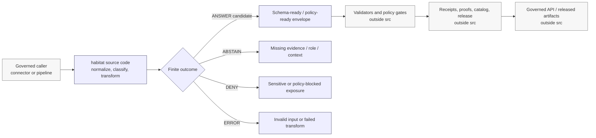

<!-- [KFM_META_BLOCK_V2]
doc_id: kfm://doc/NEEDS-VERIFICATION/packages-domains-habitat-src-readme
title: Habitat Package Source Root README
type: standard
version: v1
status: draft
owners: OWNER_TBD
created: 2026-06-14
updated: 2026-06-14
policy_label: public
related: [packages/domains/habitat/README.md, packages/domains/habitat/src/habitat/README.md, docs/domains/habitat/README.md, docs/architecture/habitat/HABITAT_CONTROL_PLANE_INDEX.md, docs/architecture/habitat/SOURCE_ROLE_TAXONOMY.md, docs/architecture/habitat/RUNTIME_EVIDENCE_MODEL.md, schemas/contracts/v1/domains/habitat/, contracts/domains/habitat/, policy/habitat/, data/registry/habitat/, tests/domains/habitat/, fixtures/domains/habitat/]
tags: [kfm, habitat, packages, src-layout, python, source-roles, evidence, geoprivacy]
notes: ["README-like source-root guide for the Habitat package src layout.", "Target path is user-requested and Directory Rules-compatible as a package/domain segment, but actual package manager, import metadata, test runner, and CI wiring remain NEEDS VERIFICATION until checked in the mounted repo.", "This directory owns source-code layout only; it must not become schema, contract, policy, source-registry, lifecycle-data, receipt, proof, release, or publication authority."]
[/KFM_META_BLOCK_V2] -->

# Habitat Package Source Root

Source-layout guide for the Habitat domain package: keep importable code deterministic, evidence-aware, policy-subordinate, and separated from KFM authority roots.

<p>
  
  
  
  
  
  
</p>

> [!IMPORTANT]
> **Status:** PROPOSED source-root README  
> **Path:** `packages/domains/habitat/src/README.md`  
> **Owning responsibility root:** `packages/`  
> **Package source namespace:** `packages/domains/habitat/src/habitat/`  
> **Repo implementation depth:** NEEDS VERIFICATION — package metadata, import style, build backend, test runner, CI workflows, published package name, runtime behavior, and generated receipts/proofs/manifests were not inspected in this file-generation pass.

## Quick links

- [Scope](#scope)
- [Repo fit](#repo-fit)
- [Accepted inputs](#accepted-inputs)
- [Exclusions](#exclusions)
- [Source-root boundary](#source-root-boundary)
- [Proposed directory map](#proposed-directory-map)
- [Import contract](#import-contract)
- [Trust-boundary flow](#trust-boundary-flow)
- [Development rules](#development-rules)
- [Validation and tests](#validation-and-tests)
- [Maintenance checklist](#maintenance-checklist)
- [Rollback](#rollback)

---

## Scope

`packages/domains/habitat/src/` is the implementation source-root for the Habitat package.

Its job is to organize importable code under a stable namespace, usually `habitat/`, while keeping KFM authority-bearing objects in their own responsibility roots. Code here may help normalize, classify, crosswalk, validate, transform, and prepare Habitat candidate records for governed pipelines, APIs, Evidence Drawer payloads, Focus Mode payloads, and public-safe layer-manifest candidates.

Code here must remain subordinate to the KFM trust path:

```text
RAW -> WORK / QUARANTINE -> PROCESSED -> CATALOG / TRIPLET -> PUBLISHED
```

This directory may contain source code that prepares or checks objects used along that path. It must not itself become the lifecycle store, release authority, policy authority, source registry, proof store, or public publication mechanism.

---

## Repo fit

```text
packages/domains/habitat/src/
```

This path is appropriate for source code inside the Habitat package because `packages/` owns shared library code and `habitat` is a domain segment inside that responsibility root.

| Relationship | Home | Boundary |
| --- | --- | --- |
| Package entry README | `packages/domains/habitat/README.md` | Explains the whole Habitat package lane. |
| Source root | `packages/domains/habitat/src/` | Organizes importable package code only. |
| Importable namespace | `packages/domains/habitat/src/habitat/` | Contains Habitat package modules. |
| Tests | `tests/domains/habitat/` or repo-confirmed test home | Proves behavior; source code does not self-certify. |
| Fixtures | `fixtures/domains/habitat/` or repo-confirmed fixture home | Holds golden/invalid sample records. |
| Schemas | `schemas/contracts/v1/domains/habitat/` or repo-confirmed schema home | Defines machine shape; package code validates against it. |
| Contracts | `contracts/domains/habitat/` or repo-confirmed contract home | Defines semantic meaning; package code references it. |
| Policy | `policy/habitat/` or repo-confirmed policy home | Decides allow / deny / restrict / abstain; package code prepares inputs. |
| Source registry | `data/registry/habitat/` or repo-confirmed source-registry home | Owns source identity, role, rights, cadence, caveats, and activation state. |
| Lifecycle data | `data/<phase>/habitat/` | Stores RAW, WORK, QUARANTINE, PROCESSED, CATALOG, TRIPLET, and PUBLISHED data. |
| Receipts/proofs | `data/receipts/habitat/`, `data/proofs/habitat/` or repo-confirmed homes | Stores process memory and proof artifacts. |
| Release and rollback | `release/` | Owns release decisions, correction notices, supersession, rollback, withdrawal, and current aliases. |

> [!WARNING]
> Do not use `src/` to hide authority-bearing files. If a file defines object meaning, machine shape, policy behavior, source activation, lifecycle data, receipts, proofs, or release decisions, move it to the correct KFM responsibility root.

---

## Accepted inputs

Source code in this directory should accept explicit, inspectable inputs from governed callers.

| Input family | Accepted examples | Required posture |
| --- | --- | --- |
| Source context | `source_id`, source-role code, descriptor reference, rights profile, cadence, source snapshot ID | Preserve source-role limits; do not upgrade source authority locally. |
| Candidate payloads | Source-native rows, normalized envelopes, GeoJSON features, raster metadata, ecological-system rows, critical-habitat records | Preserve source-native identifiers, normalized fields, input digest, and batch/run context. |
| Evidence context | EvidenceRef list, EvidenceBundle reference, citation requirements, proof/receipt refs | Return bounded outcomes when evidence support is missing. |
| Habitat semantics | critical habitat designation, modeled habitat class, range context, ecological system, vegetation association, corridor class, occurrence context | Keep regulatory, modeled, occurrence-derived, context, and stewardship meanings distinct. |
| Spatial context | CRS, scale, resolution, support geometry, precision, uncertainty, exposure class, public-safe geometry ref | Keep exact/internal and public-safe geometry separate. |
| Temporal context | observed date, effective/valid date, source update date, retrieval time, run time, release time, correction time | Do not collapse these into one timestamp. |
| Sensitivity context | protected species, rare-species flags, geoprivacy profile, license state, steward restrictions, public-safe profile | Treat as policy inputs, not publication approval. |
| Run context | run ID, actor/service ID, package version, spec hash, input/output digest | Emit deterministic receipt-ready metadata for pipeline-owned persistence. |

Missing source role, evidence support, temporal context, spatial support, rights/sensitivity posture, or public-safe geometry profile should produce `ABSTAIN`, `DENY`, or `ERROR` instead of silent best-effort publication.

---

## Exclusions

| Do not put here | Correct home or owner |
| --- | --- |
| RAW, WORK, QUARANTINE, PROCESSED, CATALOG, TRIPLET, or PUBLISHED data | `data/<phase>/habitat/` or repo-confirmed lifecycle homes. |
| Source registries, source descriptors, rights records, activation records | `data/registry/habitat/` or `data/registry/sources/habitat/`. |
| Semantic contracts | `contracts/domains/habitat/` or repo-confirmed contract home. |
| Canonical JSON Schemas | `schemas/contracts/v1/domains/habitat/` or repo-confirmed schema home. |
| Policy rules and release gates | `policy/habitat/`, `policy/domains/habitat/`, `policy/sensitivity/`, or repo-confirmed policy home. |
| Live source connectors, scraping, polling, credentials, tokens | `connectors/`, `pipelines/domains/habitat/`, `pipeline_specs/habitat/`, deployment config, or secret manager. |
| Repo-wide validators or CI orchestration | `tools/validators/`, `.github/workflows/`, `tests/`, or repo-confirmed equivalents. |
| EvidenceBundle store, receipt store, proof store, catalog store | `data/proofs/`, `data/receipts/`, `data/catalog/`, runtime/pipeline stores, or repo-confirmed homes. |
| Release manifests, rollback cards, correction notices, current aliases | `release/`. |
| Public API routes, UI panels, MapLibre shell, Evidence Drawer components | `apps/`, `packages/ui/`, `packages/maplibre/`, or repo-confirmed app/component roots. |
| AI prompts, AI answers, model-runtime outputs | Governed AI runtime and receipt surfaces, never direct public source-root code. |

---

## Source-root boundary

This directory is a layout boundary, not a governance boundary.

Code here may:

- parse or normalize admitted Habitat payloads;
- classify habitat source roles without changing their authority;
- prepare schema-ready envelopes;
- prepare policy-input structures;
- compute deterministic IDs and digests;
- carry evidence references and citation requirements;
- produce public-safe geometry candidates when given policy-approved profiles;
- emit receipt-ready metadata for the pipeline to persist;
- return finite outcomes when support is missing.

Code here must not:

- fetch live sources directly unless the owning connector/pipeline explicitly calls it through a governed adapter;
- persist lifecycle data;
- decide publication;
- bypass policy;
- mint release manifests;
- hide exact sensitive occurrence geometry inside public DTOs;
- treat modeled habitat as regulatory critical habitat;
- treat occurrence points as habitat boundaries;
- collapse source roles or temporal semantics;
- return direct AI claims as authoritative Habitat truth.

---

## Proposed directory map

> [!NOTE]
> This directory map is PROPOSED. Confirm actual package metadata, import conventions, and sibling package layout before implementation.

```text
packages/domains/habitat/src/
├── README.md
└── habitat/
    ├── README.md
    ├── __init__.py                  # PROPOSED: stable public exports only
    ├── py.typed                     # PROPOSED: typed package marker if Python typing is used
    ├── outcomes.py                  # PROPOSED: finite Habitat outcomes
    ├── identifiers.py               # PROPOSED: deterministic ID helpers
    ├── source_roles.py              # PROPOSED: source-role preservation helpers
    ├── evidence.py                  # PROPOSED: EvidenceRef/EvidenceBundle reference helpers
    ├── temporal.py                  # PROPOSED: observed/effective/source/retrieval/run/release/correction time helpers
    ├── spatial.py                   # PROPOSED: geometry support, precision, exposure, public-safe metadata helpers
    ├── habitat_classes.py           # PROPOSED: habitat/ecological-system/classification helpers
    ├── normalizers/                 # PROPOSED: source-specific normalizer modules when warranted
    ├── geometry/                    # PROPOSED: geometry helper subpackage when warranted
    ├── evidence/                    # PROPOSED: evidence helper subpackage when warranted
    └── layer_manifest/              # PROPOSED: layer-manifest helper subpackage, not release authority
```

If the repo uses a different source layout, keep this README as a boundary statement and update the tree after verification.

---

## Import contract

The importable package should expose a small, stable, reviewed surface. Experimental helpers should remain internal until they have tests, fixtures, and compatibility notes.

Illustrative only:

```python
# PROPOSED example only — synchronize with actual package code before use.
from habitat.outcomes import HabitatOutcome, HabitatOutcomeStatus

__all__ = [
    "HabitatOutcome",
    "HabitatOutcomeStatus",
]
```

| Import surface | Rule |
| --- | --- |
| Public exports | Stable, typed, documented, fixture-tested, and reviewable. |
| Internal modules | May change, but must not bypass source-role, policy, evidence, or release boundaries. |
| Experimental helpers | Keep unexported and clearly marked until tests and owner review exist. |
| Source-specific helpers | Prefer explicit module names and source descriptor references. |
| Network behavior | Out of scope for source-root helpers unless routed through governed connectors/pipelines. |

---

## Trust-boundary flow



The source root can shape candidate outputs, but external validators, policy gates, review records, receipts, proofs, catalogs, and release decisions decide what becomes public.

---

## Development rules

1. **Prefer deterministic pure functions.** Given the same input envelope, context, and spec hash, helpers should produce the same output or the same finite failure.
2. **Keep authority external.** Read schemas, contracts, policy, registries, and release state as inputs or references; do not redefine them in source code.
3. **Carry source-role semantics.** Critical habitat, modeled habitat, range context, occurrence context, landscape context, and stewardship context must remain distinguishable.
4. **Carry evidence.** EvidenceRef, citation requirement, source descriptor reference, and bundle reference must survive normalization unless the output is explicitly non-claim metadata.
5. **Keep exact/internal geometry separate.** Public-safe geometry is a separate product with transform reason, support, and redaction/generalization context.
6. **Preserve time.** Observed, valid/effective, source, retrieval, run, release, correction, and supersession time are not interchangeable.
7. **Fail closed.** Missing rights, source role, evidence, sensitivity, precision, or release context should result in a finite non-public outcome.
8. **Avoid side effects.** Persistence belongs to pipelines, data roots, receipt/proof stores, or release tooling, not importable helpers.
9. **Do not create parallel homes.** If a file belongs in `schemas/`, `contracts/`, `policy/`, `data/`, `tests/`, `fixtures/`, `release/`, or `tools/`, move it there.
10. **Treat AI as downstream.** Generated summaries may consume released/evidence-bound outputs; they do not create Habitat truth.

---

## Validation and tests

Tests should live outside this source root unless the repo has an established colocated-test convention.

| Gate | Expected evidence | Source-root expectation |
| --- | --- | --- |
| Import check | Package imports without side effects. | No network calls or data writes during import. |
| Type check | Static typing or repo-native equivalent. | Public exports have stable types. |
| Fixture tests | Valid and invalid no-network Habitat fixtures. | Helpers return deterministic outputs. |
| Source-role tests | Critical habitat, modeled habitat, occurrence, range, community, and context examples. | No source-role collapse. |
| Evidence tests | Missing evidence, missing source descriptor, unresolved EvidenceRef. | `ABSTAIN` or finite failure, not unsupported claim. |
| Geoprivacy tests | Sensitive exact point, generalized geometry, withheld geometry, visualization-only jitter. | No exact sensitive public output by default. |
| Temporal tests | observed/effective/retrieval/run/release/correction dates. | Time semantics preserved. |
| Release-boundary tests | Release context missing, superseded release, rollback target. | No publication behavior in source code. |

Suggested command placeholders:

```bash
# NEEDS VERIFICATION: adapt to repo package manager and test runner.
python -m pytest tests/domains/habitat
```

```bash
# NEEDS VERIFICATION: adapt to repo type-checker if configured.
python -m mypy packages/domains/habitat/src/habitat
```

---

## Maintenance checklist

- [ ] Confirm package manager and source layout in the mounted repo.
- [ ] Confirm `packages/domains/habitat/src/` is referenced by package metadata.
- [ ] Confirm `packages/domains/habitat/src/habitat/README.md` remains synchronized with this source-root README.
- [ ] Confirm public exports are stable, typed, and documented.
- [ ] Confirm no schemas, contracts, policy rules, source registries, lifecycle data, receipts, proofs, or release files are stored under `src/`.
- [ ] Confirm helpers do not fetch live sources or access credentials directly.
- [ ] Confirm no public output can expose exact sensitive occurrence geometry by default.
- [ ] Confirm critical habitat, modeled habitat, occurrences, range/context, communities, and stewardship signals remain separate.
- [ ] Confirm all source-code changes have fixture-backed tests.
- [ ] Confirm rollback/correction/supersession context is carried as data, not decided locally.

---

## Rollback

Rollback this README or any source-root change if it causes `src/` to become an authority root, introduces hidden live source access, weakens source-role separation, weakens evidence closure, hides sensitive geometry, bypasses policy/release gates, or breaks import/test behavior.

Rollback target: restore the last reviewed package README set and move misplaced authority-bearing files to their Directory Rules responsibility roots.

---

## Verification backlog

| Item | Status | Needed evidence |
| --- | --- | --- |
| Package manager and build backend | NEEDS VERIFICATION | Mounted repo package files and CI workflows. |
| Import namespace | NEEDS VERIFICATION | Actual `pyproject.toml`, workspace config, or package manifest. |
| Test runner | NEEDS VERIFICATION | Existing test commands and workflow jobs. |
| Public exports | NEEDS VERIFICATION | Actual `__init__.py` and module inventory. |
| Schema home | NEEDS VERIFICATION / possible CONFLICTED | Accepted ADR and current repo structure. |
| Policy engine | NEEDS VERIFICATION | Repo policy tooling, OPA/Conftest pins, or local equivalent. |
| Release and proof object homes | NEEDS VERIFICATION | Current `data/`, `release/`, proof, receipt, and manifest conventions. |


