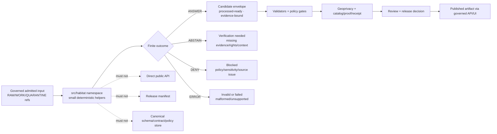

<!-- [KFM_META_BLOCK_V2]
doc_id: kfm://doc/NEEDS-VERIFICATION/packages-domains-habitat-src-habitat-readme
title: Habitat Source Namespace README
type: standard
version: v1
status: draft
owners: OWNER_TBD
created: 2026-06-14
updated: 2026-06-14
policy_label: public
related: [packages/domains/habitat/README.md, docs/domains/habitat/README.md, docs/architecture/habitat/HABITAT_ARCHITECTURE.md, docs/architecture/habitat/SOURCE_ROLE_TAXONOMY.md, docs/architecture/habitat/GEOPRIVACY_AND_SENSITIVITY.md, docs/architecture/habitat/RUNTIME_EVIDENCE_MODEL.md, docs/architecture/habitat/PUBLICATION_RULES.md, schemas/contracts/v1/domains/habitat/, contracts/domains/habitat/, policy/habitat/, data/registry/habitat/, fixtures/domains/habitat/, tests/domains/habitat/]
tags: [kfm, habitat, packages, src-layout, python, namespace, evidence, policy, geoprivacy, source-roles]
notes: ["README-like source-namespace document; implementation depth remains NEEDS VERIFICATION until package manifests, module files, tests, and CI are inspected in a mounted repo.", "This namespace must not become a schema, contract, policy, source-registry, lifecycle-data, release, receipt, proof, catalog, or publication authority.", "Placement follows Directory Rules responsibility-root discipline for shared implementation packages; exact Python packaging conventions remain NEEDS VERIFICATION."]
[/KFM_META_BLOCK_V2] -->

# Habitat Source Namespace

Source namespace for Habitat implementation helpers that transform governed inputs into evidence-bound, policy-ready, public-safe habitat candidates without becoming the truth source.

<p>
  
  
  
  
  
  
</p>

> [!IMPORTANT]
> **Status:** PROPOSED source-namespace README  
> **Path:** `packages/domains/habitat/src/habitat/README.md`  
> **Owning responsibility root:** `packages/`  
> **Domain lane:** `habitat`  
> **Repo implementation depth:** NEEDS VERIFICATION — Python module files, package metadata, package manager, imports, tests, CI workflows, generated receipts, proof objects, API/UI bindings, and runtime behavior were not inspected in this file-generation pass.

## Quick links

- [Scope](#scope)
- [Repo fit](#repo-fit)
- [Accepted inputs](#accepted-inputs)
- [Exclusions](#exclusions)
- [Namespace responsibilities](#namespace-responsibilities)
- [Source-role anti-collapse rules](#source-role-anti-collapse-rules)
- [Proposed module map](#proposed-module-map)
- [Trust-boundary flow](#trust-boundary-flow)
- [Outcome contract](#outcome-contract)
- [Development notes](#development-notes)
- [Definition of done](#definition-of-done)
- [Verification checklist](#verification-checklist)
- [Rollback](#rollback)

---

## Scope

`src/habitat/` is the proposed Python source namespace for reusable Habitat domain helpers.

It should provide deterministic, no-network library code that can be reused by Habitat pipelines, validators, tests, governed API adapters, map-layer builders, Evidence Drawer payload builders, Focus Mode support code, and review tooling. It should keep Habitat source roles, regulatory/model/context distinctions, occurrence sensitivity, temporal context, spatial support, rights, evidence references, public-safe geometry, and release blockers visible to downstream gates.

This namespace is an implementation carrier. It is not the source of truth.

```text
RAW -> WORK / QUARANTINE -> PROCESSED -> CATALOG / TRIPLET -> PUBLISHED
```

The namespace may help transform admitted inputs into governed candidates. It must not fetch live sources by hidden side effect, persist lifecycle data as a private store, decide policy, publish artifacts, expose exact sensitive locations, or override EvidenceBundle, PolicyDecision, ReviewDecision, ReleaseManifest, receipt, proof, rollback, or correction surfaces.

---

## Repo fit

```text
packages/domains/habitat/src/habitat/
```

This path is appropriate for source code that belongs to the Habitat package namespace under the `packages/` responsibility root.

| Relationship | Expected owner | Namespace responsibility |
| --- | --- | --- |
| Package wrapper | `packages/domains/habitat/` | Owns package-level README, manifests, build metadata, and package composition after repo conventions are verified. |
| Python namespace | `packages/domains/habitat/src/habitat/` | Owns importable Habitat helper modules if the repo uses Python `src/` layout. |
| Source admission | `connectors/`, `pipelines/domains/habitat/`, `pipeline_specs/habitat/`, `data/raw/habitat/`, `data/work/habitat/`, `data/quarantine/habitat/` | Consume admitted payloads or governed references only; do not fetch live sources here. |
| Normalization helpers | `packages/domains/habitat/normalizers/` and/or `src/habitat/normalizers/` after repo convention is verified | Normalize source payloads without publishing them. |
| Source-role resolution | `packages/domains/habitat/source_role_resolver/` and/or `src/habitat/source_role_resolver/` after repo convention is verified | Preserve regulatory, model, occurrence, context, community, connectivity, and stewardship boundaries. |
| Public-safe geometry helpers | `packages/domains/habitat/geometry/` and/or `src/habitat/geometry/` after repo convention is verified | Support geometry metadata, precision buckets, redaction classes, and public-safe transformation hints without becoming policy law. |
| Evidence helpers | `packages/domains/habitat/evidence/` and/or `src/habitat/evidence/` after repo convention is verified | Carry EvidenceRef/EvidenceBundle references and citation requirements; do not store evidence bundles here. |
| Layer manifest helpers | `packages/domains/habitat/layer_manifest/` and/or `src/habitat/layer_manifest/` after repo convention is verified | Build public-safe layer-manifest payloads from released or release-candidate inputs only. |
| Schemas | `schemas/contracts/v1/domains/habitat/` or repo-confirmed schema home | Canonical machine shape; do not copy schemas into this namespace. |
| Contracts | `contracts/domains/habitat/` or repo-confirmed contract home | Canonical meaning; do not redefine object semantics here. |
| Policy | `policy/habitat/`, `policy/domains/habitat/`, or repo-confirmed policy home | Allow/deny/restrict/abstain law; this namespace only prepares inputs for policy. |
| Fixtures and tests | `fixtures/domains/habitat/`, `tests/domains/habitat/`, or repo-confirmed equivalents | Deterministic no-network verification for namespace behavior. |
| Receipts and proofs | `data/receipts/`, `data/proofs/`, or repo-confirmed trust-object homes | Pipeline-owned persistence; namespace functions may return receipt-ready payloads but must not create a parallel home. |
| Release and rollback | `release/` | Promotion, rollback, correction, supersession, and withdrawal authority; namespace code cannot publish. |

> [!WARNING]
> Do not use this namespace as a hidden authority root for schemas, contracts, policy rules, source registries, lifecycle data, catalog records, evidence bundles, receipts, proofs, release manifests, rollback cards, or public artifacts.

---

## Accepted inputs

Functions in this namespace should accept explicit, inspectable inputs. Hidden global state and live network calls should be avoided unless a future ADR and test harness approve them.

| Input family | Accepted examples | Required handling |
| --- | --- | --- |
| Admitted source payloads | Source-native rows, JSON, CSV rows, GeoJSON features, raster/vector metadata, or controlled work envelopes | Preserve source-native IDs, raw field names when needed, input digest, batch ID, and source reference. |
| Source context | `source_id`, source role, source descriptor reference, rights profile, cadence, authority limits, activation state | Preserve context as supplied; do not infer authority from field names alone. |
| Evidence context | EvidenceRef list, EvidenceBundle reference, citation requirement, proof/receipt references | Keep evidence closure visible; return `ABSTAIN` when evidence support is missing. |
| Habitat context | habitat class, ecological system, vegetation association, land-cover class, modeled suitability class, corridor class, critical-habitat designation ID | Preserve classification system, version, confidence, and role; do not flatten distinct habitat meanings into one bucket. |
| Occurrence context | occurrence ref, specimen/event ref, license state, geoprivacy profile, precision, uncertainty, basis of record | Treat exact occurrence locations as sensitive by default when publication state is unclear. |
| Temporal context | observed time, valid/effective date, source update time, retrieval time, run time, release time, correction time | Preserve time semantics and precision; do not collapse event time into release time. |
| Spatial context | internal geometry ref, CRS, scale, resolution, support, precision bucket, uncertainty, locality text, exposure class, public-safe geometry ref | Keep exact/internal and public-safe geometry separate. |
| Rights and sensitivity context | rare/protected flags, license hints, steward flags, access restrictions, review obligations, sensitive-location class | Treat as policy inputs, not release approval. |
| Run context | run ID, actor/service ID, package version, spec hash, timestamp, input/output digests | Emit deterministic, audit-ready metadata for pipeline-owned receipts. |

Missing source role, evidence context, rights/sensitivity context, spatial support, public-safe geometry profile, or review context should produce a finite failure outcome rather than a silent best-effort public output.

---

## Exclusions

| Do not put here | Correct home or owner |
| --- | --- |
| Live source clients, API polling, scraping, credentials, service tokens | `connectors/`, `pipelines/domains/habitat/`, `pipeline_specs/habitat/`, `configs/`, secret manager, or deployment environment. |
| RAW, WORK, QUARANTINE, PROCESSED, CATALOG, TRIPLET, PUBLISHED data | `data/<phase>/habitat/` or repo-confirmed lifecycle stores. |
| Canonical JSON Schemas | `schemas/contracts/v1/domains/habitat/` or repo-confirmed schema home. |
| Semantic contracts | `contracts/domains/habitat/` or repo-confirmed contract home. |
| Source registry, rights registry, source-role register | `data/registry/habitat/` or `data/registry/sources/habitat/`. |
| Policy rules, release gates, public exposure decisions | `policy/habitat/`, `policy/domains/habitat/`, `policy/sensitivity/`, `release/`. |
| Repo-wide validators and CI orchestration | `tools/validators/`, `.github/workflows/`, `tests/`, or repo-confirmed equivalents. |
| EvidenceBundle, proof, receipt, catalog, and run-persistence stores | `data/proofs/`, `data/receipts/`, `data/catalog/`, `runtime/`, or pipeline-owned stores. |
| Release manifests, rollback cards, correction notices, current aliases | `release/`. |
| Public API routes, UI panels, MapLibre shell, Evidence Drawer components | `apps/`, `packages/ui/`, `packages/maplibre/`, or repo-confirmed app/component roots. |
| AI answers, model prompts, or direct model runtime outputs | Governed AI runtime and receipt surfaces. |

---

## Namespace responsibilities

This namespace should be small, typed, deterministic, and easy to test.

| Responsibility | Expected behavior | Failure posture |
| --- | --- | --- |
| Normalize | Convert admitted Habitat payloads into schema-ready candidate envelopes. | `ABSTAIN` or `ERROR` instead of guessing. |
| Resolve source role | Preserve source-role meaning and source authority limits. | `ABSTAIN` when source role cannot be resolved. |
| Preserve evidence | Carry EvidenceRef, citation requirements, source refs, and bundle refs forward. | `ABSTAIN` when evidence closure is required but missing. |
| Preserve habitat semantics | Keep regulatory, modeled, occurrence-derived, ecological-system, connectivity, stewardship, and landscape-context claims distinct. | `ABSTAIN` rather than collapsing meanings. |
| Preserve time semantics | Keep observed, valid/effective, source, retrieval, run, release, and correction time distinct where material. | `ABSTAIN` or mark stale/unknown rather than flattening time. |
| Preserve spatial safety | Keep internal geometry and public-safe geometry separate; carry scale/resolution/support. | `DENY` or `ABSTAIN` public exposure when sensitivity/precision is unclear. |
| Prepare policy inputs | Return policy-ready fields, sensitivity profile, source-role posture, and reason codes. | Do not decide policy locally. |
| Prepare layer-manifest inputs | Return public-eligibility and render-context hints for released or release-candidate artifacts. | Do not emit public map layers directly. |
| Emit receipt-ready metadata | Return run/spec/input/output digest metadata for pipeline receipt writers. | Do not persist receipts in this namespace. |

---

## Source-role anti-collapse rules

These rules protect Habitat from becoming one vague “habitat layer.”

| Source role | Must not be collapsed into | Required posture |
| --- | --- | --- |
| Regulatory critical habitat | Modeled habitat, range maps, occurrence points, stewardship areas | Use only source-role-appropriate official designation evidence. |
| Kansas state review context | Federal critical habitat, permit conclusion, exact rare-species layer | Treat as due-diligence/review context with sensitivity controls. |
| Modeled habitat / range / suitability | Regulatory designation or observed occurrence | Label as modeled, versioned, bounded by method, support scale, and confidence. |
| Occurrence/specimen evidence | Habitat boundary or absence/presence proof | Preserve uncertainty, license, basis of record, event date, and geoprivacy state. |
| Landscape, disturbance, climate, soil, hydrology, or vegetation context | Species-specific habitat truth | Keep as context unless promoted through evidence, model, review, and policy. |
| Habitat community / ecological system | Single-species habitat | Preserve classification system, crosswalk basis, scale, and uncertainty. |
| Connectivity/corridor model | Direct occurrence, legal boundary, or protected area | Preserve method, assumptions, confidence, and intended use. |
| Stewardship/restoration/ownership context | Habitat truth or land-title truth | Preserve rights, review state, activity/effective dates, and source limits. |

> [!CAUTION]
> A public map label that says “habitat” must be backed by the exact source-role claim it represents. If the backing claim is modeled, regulatory, occurrence-derived, contextual, or stewardship-based, the label and Evidence Drawer payload must say so.

---

## Proposed module map

> [!NOTE]
> The module map below is PROPOSED. Reconcile it with the actual package manifest, existing sibling package directories, import style, and tests before implementation.

```text
packages/domains/habitat/src/habitat/
├── README.md
├── __init__.py                     # PROPOSED: thin package exports only
├── py.typed                        # PROPOSED: typed package marker if Python typing is used
├── outcomes.py                     # PROPOSED: ANSWER / ABSTAIN / DENY / ERROR envelopes
├── identifiers.py                  # PROPOSED: deterministic habitat candidate ID helpers
├── evidence.py                     # PROPOSED: EvidenceRef/EvidenceBundle reference helpers, not evidence storage
├── temporal.py                     # PROPOSED: observed/effective/source/run/release/correction time helpers
├── spatial.py                      # PROPOSED: geometry metadata, support, precision buckets, exposure classes
├── source_roles.py                 # PROPOSED: source-role and authority-limit helpers
├── habitat_classes.py              # PROPOSED: habitat-class, ecological-system, vegetation/crosswalk helpers
├── normalizers/                    # PROPOSED: importable normalizer modules, if not kept as sibling package
├── geometry/                       # PROPOSED: safe wrappers around geometry/public-safe transformation helpers
├── evidence/                       # PROPOSED: evidence helper subpackage if complexity justifies it
└── layer_manifest/                 # PROPOSED: manifest-building helpers, not public release authority
```

### Export rule

Keep `__init__.py` intentionally boring. It should expose stable, reviewed package surfaces only. Do not export experimental modules, hidden source clients, mutable registries, or anything that implies publication authority.

Illustrative only:

```python
# PROPOSED example only — synchronize with actual package code before use.
from habitat.outcomes import HabitatOutcome, HabitatOutcomeStatus

__all__ = [
    "HabitatOutcome",
    "HabitatOutcomeStatus",
]
```

---

## Trust-boundary flow



---

## Outcome contract

All public functions should prefer explicit finite outcomes over exceptions for expected governance failures. Exceptions are still appropriate for programming errors, but domain uncertainty should be represented in reviewable results.

| Outcome | Use when | Downstream expectation |
| --- | --- | --- |
| `ANSWER` | The helper produced a valid candidate or transformation result for the requested internal profile. | Continue to schema validation, policy, geoprivacy, catalog/proof, review, and release gates. |
| `ABSTAIN` | Required evidence, source role, rights, sensitivity, temporal, geometry, review, or authority context is missing or inconclusive. | Hold in WORK/QUARANTINE or route to verification. |
| `DENY` | The input or requested operation is known unsafe, disallowed, rights-blocked, sensitivity-blocked, or profile-incompatible. | Do not promote. Preserve denial reason and receipt where required. |
| `ERROR` | The input is malformed, unsupported, fails structural validation, or the helper fails unexpectedly. | Stop processing; preserve diagnostics safely without leaking sensitive geometry. |

Reason codes should be stable, searchable, and suitable for receipts and tests, for example:

```text
habitat.normalized.answer
habitat.evidence.abstain_missing_evidence_ref
habitat.source_role.abstain_unknown_role
habitat.geometry.deny_sensitive_exact_public_geometry
habitat.input.error_malformed_payload
```

---

## Development notes

### Design rules

- Keep functions deterministic and side-effect-light.
- Prefer typed, explicit data structures over loose dictionaries at public boundaries.
- Require source context as a parameter; do not infer source authority from the payload alone.
- Preserve raw/source-native identifiers and field names where needed for audit and correction.
- Preserve classification system, version, scale, method, and uncertainty for habitat classes.
- Keep exact/internal geometry separate from public-safe geometry.
- Treat rare-species occurrence context as sensitive unless a policy/release gate proves otherwise.
- Return receipt-ready metadata; let pipelines persist receipts.
- Return policy-ready inputs; let policy decide access/publication.
- Keep generated text, summaries, labels, and model outputs downstream of evidence and review.

### No-network default

Namespace unit tests should run without network access. Live source access belongs in governed connectors/pipelines with source descriptors, rights checks, cadence controls, and quarantine behavior.

### Import stability

Stable imports should be added only after tests and adjacent package conventions are verified. Experimental helpers should remain internal until they have schema/contract alignment, fixtures, and review.

---

## Definition of done

- [ ] Package manifest or repo-native build metadata confirms this namespace is importable.
- [ ] `__init__.py` exposes only reviewed stable symbols.
- [ ] All public helpers return finite outcomes for expected governance failures.
- [ ] Source-role distinctions are tested with no-network fixtures.
- [ ] Sensitive exact occurrence geometry cannot appear in public-safe outputs.
- [ ] EvidenceRef/EvidenceBundle requirements are carried through candidate envelopes.
- [ ] Time semantics remain distinct in tests.
- [ ] Receipt-ready metadata includes run/spec/input/output digest fields where applicable.
- [ ] Schema/contract/policy/registry/release/proof/receipt homes are referenced, not duplicated.
- [ ] Rollback/correction and supersession fields are preserved where relevant.

---

## Verification checklist

- [ ] Confirm `packages/domains/habitat/src/habitat/` exists in the mounted repo or is created in the
