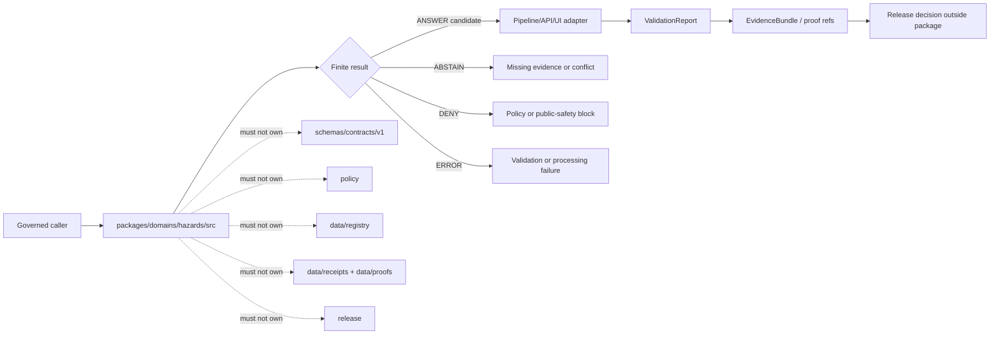

<!-- [KFM_META_BLOCK_V2]
doc_id: kfm://doc/NEEDS-VERIFICATION/packages-domains-hazards-src-readme
title: Hazards Package Source README
type: standard
version: v1
status: draft
owners: OWNER_TBD
created: 2026-06-14
updated: 2026-06-14
policy_label: public
related: [packages/domains/hazards/README.md, packages/domains/hazards/src/hazards/README.md, docs/domains/hazards/README.md, docs/domains/hazards/ARCHITECTURE.md, docs/domains/hazards/SOURCE_ROLES.md, schemas/contracts/v1/domains/hazards/, contracts/domains/hazards/, policy/hazards/, data/registry/hazards/, data/receipts/hazards/, data/proofs/hazards/, release/]
tags: [kfm, hazards, packages, src, implementation, evidence, source-roles, finite-outcomes]
notes: ["README-like source-directory guide for the Hazards package.", "Target path is user-requested and Directory Rules-compatible as code under packages/, but actual package metadata, import layout, build tools, tests, and CI remain NEEDS VERIFICATION until the live repo is inspected.", "This directory may contain package source code only; it must not own schemas, contracts, policy, source registries, lifecycle data, proofs, receipts, release decisions, API routes, UI surfaces, emergency instructions, or AI truth claims."]
[/KFM_META_BLOCK_V2] -->

# Hazards Package Source

Source-code directory for the KFM Hazards package: deterministic helpers that preserve evidence, source roles, temporal meaning, public-safety boundaries, public-safe geometry, finite outcomes, and rollback/correction lineage.

<p>
  
  
  
  
  
  
  
</p>

> [!IMPORTANT]
> **Status:** PROPOSED source-directory README  
> **Path:** `packages/domains/hazards/src/README.md`  
> **Owning responsibility root:** `packages/`  
> **Package lane:** `packages/domains/hazards/`  
> **Import/package layout:** NEEDS VERIFICATION  
> **Repo implementation depth:** UNKNOWN for package metadata, package manager, import style, tests, CI workflows, API bindings, UI bindings, policy engine, emitted receipts, proof packs, release manifests, branch protections, and runtime behavior.

## Quick links

- [Scope](#scope)
- [Repo fit](#repo-fit)
- [Accepted inputs](#accepted-inputs)
- [Exclusions](#exclusions)
- [Expected package layout](#expected-package-layout)
- [Trust-boundary flow](#trust-boundary-flow)
- [Source-role anti-collapse rules](#source-role-anti-collapse-rules)
- [Finite outcomes](#finite-outcomes)
- [Development rules](#development-rules)
- [Validation checklist](#validation-checklist)
- [Rollback](#rollback)

---

## Scope

`packages/domains/hazards/src/` is the proposed source-code root for the Hazards package.

This directory is for implementation helpers that are safe to reuse across governed hazards pipelines, validators, API adapters, MapLibre layer-preparation code, Evidence Drawer mappers, and Focus Mode support code. The source code should be small, deterministic, fixture-testable, and evidence-subordinate.

The directory may support helpers for:

- source-role preservation and anti-collapse checks;
- hazard candidate normalization;
- deterministic identity and digest preparation;
- time-basis and freshness classification;
- public-safe geometry metadata and transform-result handling;
- EvidenceRef / EvidenceBundle reference helpers;
- finite outcome envelopes such as `ANSWER`, `ABSTAIN`, `DENY`, and `ERROR`;
- receipt-ready and proof-ready metadata fragments;
- released-layer and Evidence Drawer payload fragments after policy and release state are supplied by governing roots.

This directory must not issue emergency instructions, approve releases, publish public layers, fetch live source data, own policy, or turn model output, map output, summaries, alerts, advisories, detections, regulations, declarations, or derived analyses into sovereign truth.

```text
RAW -> WORK / QUARANTINE -> PROCESSED -> CATALOG / TRIPLET -> PUBLISHED
```

Package code may help prepare candidate objects inside that lifecycle. It does not own the lifecycle state itself.

---

## Repo fit

```text
packages/domains/hazards/src/
```

`packages/` is the responsibility root for reusable code. `domains/hazards/` is the domain segment. `src/` is the source-code envelope for the package implementation.

| Relationship | Expected home | Boundary rule |
| --- | --- | --- |
| Package source code | `packages/domains/hazards/src/` | Reusable hazards implementation helpers only. |
| Importable module | `packages/domains/hazards/src/hazards/` | Package namespace, subject to repo package convention verification. |
| Package entry README | `packages/domains/hazards/README.md` | Explains the domain package as a whole. |
| Domain docs | `docs/domains/hazards/` | Explains doctrine, source roles, stewardship, public-safety limits, and publication posture. |
| Semantic contracts | `contracts/domains/hazards/` or repo-confirmed contract home | Defines meaning; source code references, not redefines. |
| Machine schemas | `schemas/contracts/v1/domains/hazards/` or repo-confirmed schema home | Defines shape; source code validates against it. |
| Source registry | `data/registry/hazards/` | Owns source identity, rights, roles, cadence, sensitivity, and activation state. |
| Policy | `policy/hazards/` | Owns allow/deny/restrict/abstain behavior. |
| Lifecycle data | `data/raw/`, `data/work/`, `data/quarantine/`, `data/processed/`, `data/catalog/`, `data/published/` | Stores evidence-bearing and released artifacts by phase. |
| Receipts and proofs | `data/receipts/hazards/`, `data/proofs/hazards/` | Stores process memory and proof objects. |
| Release decisions | `release/` | Owns release manifests, promotion decisions, corrections, rollback targets, and supersession. |
| API and UI runtime | `apps/`, `ui/`, `web/`, or repo-confirmed equivalents | May call package helpers; must not be replaced by package internals. |
| Tests and fixtures | `tests/domains/hazards/`, `fixtures/domains/hazards/`, or repo-confirmed equivalents | Proves behavior with deterministic fixtures. |

> [!WARNING]
> A source-code directory is not a trust-object home. Keep schemas, contracts, source registries, policy rules, lifecycle data, receipts, proofs, and release decisions in their owning roots.

---

## Accepted inputs

Functions in this source tree should accept explicit values from governed callers. They should not fetch missing facts from live services, hidden globals, local operator memory, UI state, or generated language.

| Input family | Accepted examples | Required handling |
| --- | --- | --- |
| Hazard candidates | Historical event rows, operational warnings, advisories, watches, declarations, regulatory areas, observations, detections, models, exposure summaries, resilience-analysis candidates | Preserve source-native values and normalized values separately. |
| Source context | `source_id`, source descriptor ref, source role, rights profile, sensitivity label, cadence, caveat, citation template | Treat source role as a boundary, not a display hint. |
| Evidence context | EvidenceRef, EvidenceBundle ref, input digest, citation obligation, release state | Return finite negative outcomes when evidence is missing or unresolved. |
| Time context | event time, observed time, valid window, issue time, expiry time, declaration time, effective time, retrieval time, product time, model-run time, review time, release time, correction time | Preserve distinct time semantics. |
| Spatial context | internal geometry ref, CRS, source scale, resolution, spatial uncertainty, public-safe geometry candidate, redaction/generalization profile | Keep exact/internal geometry separate from public-safe geometry. |
| Public-safety context | contextual-only flag, no-emergency-advice flag, official-source handoff ref, operational-warning disclaimer | Required for warning/advisory/watch support payloads. |
| Policy context | policy decision ref, sensitivity tier, obligations, deny/abstain reason codes, transform requirements | Use as input; do not approve release inside package code. |
| Run context | run ID, actor/service ID, package version, spec hash, input/output digest, processing timestamp | Return receipt-ready metadata for owning pipelines to persist. |

---

## Exclusions

| Do not put here | Correct home or owner | Reason |
| --- | --- | --- |
| Live source connectors, API clients, scrapers, tokens, credentials, or source polling logic | `connectors/`, `pipelines/`, `pipeline_specs/`, `configs/`, secret infrastructure | Source activation must be governed and audited. |
| RAW, WORK, QUARANTINE, PROCESSED, CATALOG, TRIPLET, or PUBLISHED artifacts | `data/<phase>/hazards/` | Lifecycle state must remain inspectable outside source code. |
| Source descriptors, source-rights matrices, or source-role registries | `data/registry/hazards/` | Source authority is governance data. |
| Semantic contracts | `contracts/domains/hazards/` | Contracts own meaning. |
| JSON Schemas | `schemas/contracts/v1/domains/hazards/` | Schemas own machine shape. |
| Policy rules or release criteria | `policy/hazards/`, `release/` | Policy and release decisions are separate authority roots. |
| Run receipts, AI receipts, proof packs, catalog records, EvidenceBundle stores | `data/receipts/`, `data/proofs/`, `data/catalog/` | Trust artifacts must remain separately auditable. |
| API route handlers or public UI components | `apps/`, `ui/`, `web/`, or repo-confirmed equivalents | Source code may prepare helper fragments, not own public runtime. |
| Emergency guidance text, evacuation instructions, shelter guidance, safety advice, legal advice, or medical advice | Official authorities and public-safety systems | KFM hazards is contextual evidence, not an emergency alerting or life-safety system. |
| AI prompts treated as truth | Governed AI runtime with EvidenceBundle and AIReceipt controls | AI is interpretive and evidence-subordinate. |

---

## Expected package layout

Names below are PROPOSED until package conventions are verified in the live repo.

```text
packages/domains/hazards/src/
├── README.md
└── hazards/
    ├── README.md
    ├── roles.py                 # PROPOSED: source-role enums and anti-collapse helpers
    ├── normalize.py             # PROPOSED: source-native -> normalized candidate transforms
    ├── identity.py              # PROPOSED: deterministic ID and digest helpers
    ├── time.py                  # PROPOSED: time-basis and freshness helpers
    ├── geometry.py              # PROPOSED: public-safe geometry metadata helpers
    ├── evidence.py              # PROPOSED: EvidenceRef / EvidenceBundle ref helpers
    ├── outcomes.py              # PROPOSED: finite result envelope helpers
    ├── layers.py                # PROPOSED: released-layer manifest fragments
    ├── drawer.py                # PROPOSED: Evidence Drawer payload fragments
    └── testing.py               # PROPOSED: fixture helpers for no-network tests
```

> [!NOTE]
> File extensions, module names, package metadata, and import paths must follow the mounted repo’s actual language and packaging conventions. The Python-shaped names above are illustrative until verified.

---

## Trust-boundary flow



The package can compute and return structured helper results. It cannot promote, publish, or override policy/review/release state.

---

## Source-role anti-collapse rules

Hazards data is especially easy to overstate because multiple source types use similar words for very different kinds of knowledge. Package code must preserve the source role from input to output.

| Source character | Can support | Must not be treated as |
| --- | --- | --- |
| `historical_event_record` | Historical event evidence within source limits | Current warning or emergency instruction. |
| `operational_warning` | Contextual warning record with issue/expiry/retrieval/freshness labels | KFM-owned alert or life-safety guidance. |
| `operational_advisory` | Contextual advisory record | Event confirmation or emergency instruction. |
| `operational_watch` | Contextual watch record | Observed event or confirmed impact. |
| `administrative_declaration` | Administrative/legal declaration context | Physical observation, footprint, or damage measurement. |
| `regulatory_context` | Effective-date/versioned regulatory context | Observed event or current impact. |
| `scientific_observation` | Measurement with method and uncertainty | Regulation, warning, or forecast authority. |
| `remote_sensing_detection` | Detection product with product time and limitations | Field-confirmed event. |
| `modeled_derivative` | Model output with inputs, method, and run time | Observation or official forecast. |
| `resilience_analysis` | Derived planning context | Emergency advice or source truth. |
| `unknown_unclassified` | Quarantine target | Public layer, public answer, or authoritative claim. |

---

## Finite outcomes

Helpers should return explicit outcomes and reason codes rather than silent fallbacks.

| Outcome | Use when | Package obligation |
| --- | --- | --- |
| `ANSWER` | Required evidence, source role, time basis, policy context, and public-safety constraints are satisfied for the helper’s narrow task | Return payload plus evidence refs, obligations, and digest metadata. |
| `ABSTAIN` | Evidence is missing, source role is unresolved, source conflict exists, freshness is unknown, or required context is absent | Return reason codes and missing requirements. |
| `DENY` | Policy, sensitivity, rights, public-safety, exact-geometry, or emergency-boundary constraints block the output | Return safe reason codes without leaking restricted payloads. |
| `ERROR` | The helper cannot parse, validate, normalize, or compute the requested result due to malformed input or internal failure | Return diagnostic refs suitable for logs and tests, not sensitive payloads. |

---

## Development rules

- Keep helpers deterministic and side-effect-light.
- Make every helper fixture-testable without network access.
- Accept explicit source/evidence/policy/time/spatial context; do not invent missing values.
- Preserve source-native fields until owning lifecycle systems decide what is retained, transformed, redacted, or published.
- Keep exact/internal geometry out of public payload fragments unless the policy context explicitly permits the specific use.
- Preserve operational-warning `issued_at`, `expires_at`, `retrieved_at`, and freshness state.
- Do not label stale or expired warnings as current.
- Do not provide emergency instructions, evacuation guidance, shelter advice, legal advice, medical advice, or life-safety conclusions.
- Return finite outcomes with reason codes for missing evidence, policy blocks, source-role conflict, stale state, geometry restriction, and validation errors.
- Add or update tests with every behavioral change.
- Keep release, promotion, proof closure, and rollback decisions outside this package.

---

## Validation checklist

Before this directory is treated as active implementation, verify:

- [ ] `packages/domains/hazards/` is the confirmed package home in the mounted repo.
- [ ] `src/` layout matches the repo’s package manager and import convention.
- [ ] `packages/domains/hazards/src/hazards/` exists or is created with package metadata.
- [ ] Adjacent package READMEs link to this source-directory README.
- [ ] Contracts referenced by package code exist in the repo-confirmed contract home.
- [ ] Schemas referenced by package code exist in `schemas/contracts/v1/...` or the repo-confirmed schema home.
- [ ] Source descriptors and source-role registries exist outside package source code.
- [ ] Policy tests prove public-safety denial, source-role quarantine, evidence abstention, and restricted-geometry denial.
- [ ] Unit tests use no-network fixtures.
- [ ] API/UI adapters consume package helpers only through governed boundaries.
- [ ] Evidence Drawer payloads include source role, time basis, spatial basis, EvidenceBundle refs, rights, freshness, review state, corrections, and operational-warning disclaimer where applicable.
- [ ] Release, correction, and rollback records remain outside this package.

---

## Rollback

Rollback is required if this source directory starts owning trust objects, weakening source-role boundaries, leaking restricted geometry, bypassing policy, implying emergency authority, or publishing unsupported claims.

Rollback actions:

1. Revert the package-source change.
2. Preserve generated receipts, failing fixtures, and validation output as review evidence in the appropriate receipt/proof/test artifact homes.
3. Move misplaced schemas, policies, source descriptors, lifecycle data, receipts, proofs, or release decisions to their proper responsibility roots.
4. Add a drift-register entry if the source directory created or exposed a boundary conflict.
5. Update dependent README links, package exports, and tests.
6. Re-run package and policy tests before restoring any public adapter dependency.

Rollback target: `ROLLBACK_TARGET_TBD_AFTER_REPO_INSPECTION`

---

## Maintainer notes

- This README is intentionally strict because hazards material can cause public misunderstanding, operational risk, and sensitivity leakage.
- Package code can support released evidence-backed inspection, but it must never present KFM as the source of life-safety instructions.
- Missing evidence means `ABSTAIN`; policy block means `DENY`; processing failure means `ERROR`; only narrow, supported, policy-safe helper outputs should return `ANSWER`.

