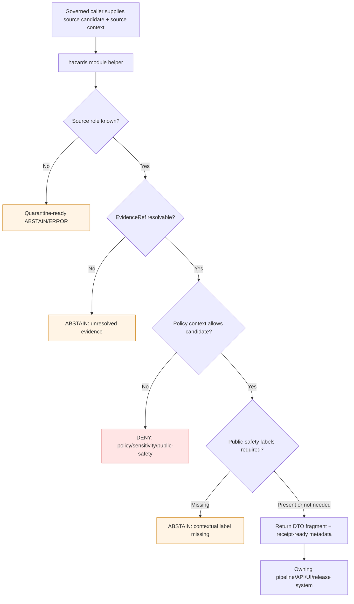

<!-- [KFM_META_BLOCK_V2]
doc_id: kfm://doc/NEEDS-VERIFICATION/packages-domains-hazards-src-hazards-readme
title: Hazards Python Module README
type: standard
version: v1
status: draft
owners: OWNER_TBD
created: 2026-06-14
updated: 2026-06-14
policy_label: public
related: [packages/domains/hazards/README.md, packages/domains/hazards/src/README.md, docs/domains/hazards/README.md, docs/domains/hazards/ROLLBACK_AND_CORRECTION.md, schemas/contracts/v1/domains/hazards/, contracts/domains/hazards/, policy/hazards/, data/registry/hazards/, data/receipts/hazards/, data/proofs/hazards/, release/candidates/hazards/, tests/domains/hazards/, fixtures/domains/hazards/]
tags: [kfm, hazards, python-module, package-src, source-roles, evidence, finite-outcomes, public-safety]
notes: ["README-like module entrypoint for the importable hazards implementation namespace.", "Target path is user-requested and Directory Rules-compatible as package-internal source code, but actual repo package manager, import conventions, build metadata, tests, and CI remain NEEDS VERIFICATION.", "This module may prepare evidence-aware hazard payloads and finite outcomes; it must not fetch live sources, publish releases, decide policy, or act as an emergency-alert authority."]
[/KFM_META_BLOCK_V2] -->

# Hazards Python Module

Importable hazards-domain helper namespace for source-role-preserving normalization, validation support, evidence-aware DTO preparation, finite outcomes, public-safety boundaries, and release-safe package utilities.

<p>
  
  
  
  
  
  
  
</p>

> [!IMPORTANT]
> **Status:** PROPOSED module README  
> **Path:** `packages/domains/hazards/src/hazards/README.md`  
> **Owning responsibility root:** `packages/`  
> **Package source root:** `packages/domains/hazards/src/`  
> **Import namespace:** `hazards` — NEEDS VERIFICATION against repo package metadata  
> **Repo implementation depth:** NEEDS VERIFICATION — package metadata, imports, tests, schemas, policies, registries, CI workflows, runtime behavior, emitted receipts, proof objects, release manifests, and public API/UI bindings were not inspected in this file-generation pass.

## Quick links

- [Scope](#scope)
- [Repo fit](#repo-fit)
- [Accepted inputs](#accepted-inputs)
- [Exclusions](#exclusions)
- [Module responsibilities](#module-responsibilities)
- [Submodule map](#submodule-map)
- [Source-role anti-collapse rules](#source-role-anti-collapse-rules)
- [Public-safety boundary](#public-safety-boundary)
- [Finite outcomes](#finite-outcomes)
- [Trust-boundary flow](#trust-boundary-flow)
- [Testing expectations](#testing-expectations)
- [Definition of done](#definition-of-done)
- [Verification checklist](#verification-checklist)
- [Rollback](#rollback)

---

## Scope

`packages/domains/hazards/src/hazards/` is the proposed importable source namespace for shared hazards-domain helper code.

This module may contain deterministic, no-network library functions that help KFM transform hazard candidate records into evidence-aware, policy-ready, schema-checkable, catalog-ready, drawer-ready, and release-safe payloads. It is a helper namespace, not a source of truth.

The module may support these hazard knowledge families:

- historical hazard event records;
- operational warnings, advisories, and watches as contextual-only records;
- administrative declarations and incident-period records;
- regulatory hazard areas with effective dates and versioned authority limits;
- scientific observations and measured event evidence;
- remote-sensing detections and product-time signals;
- modeled derivatives and resilience-analysis candidates;
- local context where rights, stewardship, source role, and sensitivity controls allow use;
- public-safe layer payload preparation for governed APIs, Evidence Drawer, MapLibre, and Focus Mode.

```text
RAW -> WORK / QUARANTINE -> PROCESSED -> CATALOG / TRIPLET -> PUBLISHED
```

The module may help prepare outputs for those lifecycle phases, but it must not own lifecycle storage, promotion, publication, emergency guidance, policy approval, release decisions, or canonical evidence.

---

## Repo fit

```text
packages/domains/hazards/src/hazards/
```

This path is package-internal source code under the `packages/` responsibility root. The domain segment is `hazards`; the import namespace is proposed as `hazards` until package metadata confirms it.

| Relationship | Expected home | Boundary rule |
| --- | --- | --- |
| Importable hazards helpers | `packages/domains/hazards/src/hazards/` | Owns reusable module code only. |
| Package-level documentation | `packages/domains/hazards/README.md` | Explains the whole package lane. |
| Source-root documentation | `packages/domains/hazards/src/README.md` | Explains package source layout and import boundaries. |
| Domain doctrine | `docs/domains/hazards/` | Explains domain semantics, source roles, time semantics, public-safety posture, and promotion rules. |
| Semantic contracts | `contracts/domains/hazards/` or repo-confirmed contract home | Defines object meaning; module code references, not redefines. |
| Machine schemas | `schemas/contracts/v1/domains/hazards/` or repo-confirmed schema home | Defines machine shape; module code validates against or adapts to it. |
| Policy | `policy/hazards/` or repo-confirmed policy home | Decides allow / deny / restrict / abstain. |
| Source registry | `data/registry/hazards/` | Owns source identity, rights, cadence, role, sensitivity, and activation state. |
| Lifecycle data | `data/raw`, `data/work`, `data/quarantine`, `data/processed`, `data/catalog`, `data/triplets`, `data/published` | Stores evidence-bearing data outside package code. |
| Receipts and proofs | `data/receipts/hazards/`, `data/proofs/hazards/` | Stores process memory and proof closure. |
| Release and rollback | `release/` | Owns release decisions, promotion outcomes, correction notices, and rollback targets. |
| Tests and fixtures | `tests/domains/hazards/`, `fixtures/domains/hazards/` | Proves module behavior with no-network deterministic cases. |

> [!WARNING]
> The module must not become a parallel authority for schemas, contracts, policy, source descriptors, lifecycle data, proof packs, receipt stores, or release decisions. If a file begins owning one of those responsibilities, move it to the correct root with an ADR or drift-register note.

---

## Accepted inputs

Module functions should accept explicit values and typed objects from governed callers. They should not reach into environment state, live endpoints, local files, package globals, or public UI context to fill missing evidence.

| Input family | Accepted examples | Required handling |
| --- | --- | --- |
| Hazard candidates | Source-native event rows, warning records, declaration records, regulatory areas, observation rows, detection products, model outputs, resilience-analysis candidates | Preserve source-native and normalized fields separately. |
| Source context | `source_id`, source role, source descriptor ref, rights profile, cadence, caveat text, citation template | Treat source role as a hard boundary. |
| Evidence context | EvidenceRef, EvidenceBundle ref, citation requirement, source hash, input digest | Return finite negative outcomes when evidence is missing or unresolved. |
| Time context | event time, issue time, expiry time, declaration time, effective date, retrieval time, product time, model-run time, review time, release time, correction time | Keep time meanings distinct. |
| Spatial context | internal geometry ref, public geometry candidate, CRS, scale, resolution, uncertainty, redaction/generalization profile | Keep exact/internal geometry separate from public-safe geometry. |
| Freshness context | retrieved_at, stale-after policy, source cadence, expiry requirements, processing latency | Mark stale/expired/unknown states explicitly. |
| Public-safety context | contextual-only flag, not-for-life-safety flag, official-source handoff link, no-emergency-advice reason | Required for operational-warning-family payloads. |
| Policy context | sensitivity tier, role permissions, public-safe-geometry profile, review requirement, deny/abstain reason codes | Use only as inputs to policy-aware preparation; do not approve release. |
| Run context | run ID, actor/service ID, package version, spec hash, input/output digest, timestamp | Return receipt-ready metadata for owning pipelines to persist. |

---

## Exclusions

| Do not put here | Correct home or owner | Reason |
| --- | --- | --- |
| Live source fetchers, credentials, scrapers, or API clients | `connectors/`, `pipelines/domains/hazards/`, `pipeline_specs/hazards/`, `configs/`, secret infrastructure | Source activation is governed, audited, and source-specific. |
| RAW/WORK/QUARANTINE/PROCESSED/CATALOG/TRIPLET/PUBLISHED files | `data/<phase>/hazards/` | Lifecycle state belongs outside code. |
| Source descriptors and rights/cadence/sensitivity registries | `data/registry/hazards/` | Source authority is governance data. |
| Semantic contracts | `contracts/domains/hazards/` | Contracts own meaning. |
| JSON Schemas | `schemas/contracts/v1/domains/hazards/` | Schemas own machine shape. |
| Policy rules | `policy/hazards/` | Policy owns allow/deny/restrict/abstain behavior. |
| Receipts, proof packs, catalog records, EvidenceBundle stores | `data/receipts/`, `data/proofs/`, `data/catalog/` | Trust artifacts must remain independently inspectable. |
| Release manifests and rollback/correction decisions | `release/` | Publication is a governed state transition. |
| Public API routes or UI components | `apps/`, `ui/`, `web/`, or repo-confirmed equivalents | Module code may prepare DTO fragments, not own public runtime surfaces. |
| Emergency instructions or alerting authority | Official emergency-management and alerting sources | KFM hazards is contextual evidence, not an emergency alert system. |
| AI prompts or generated explanations as truth | Governed AI runtime with AIReceipt and EvidenceBundle controls | Generated language is downstream and evidence-subordinate. |

---

## Module responsibilities

The module should be boring, deterministic, strict, and testable.

| Responsibility | Expected behavior |
| --- | --- |
| Candidate normalization | Convert source-native hazard records into typed internal candidates without deleting raw values, caveats, uncertainty, or provenance links. |
| Role preservation | Keep event, warning, advisory, watch, declaration, regulatory, observation, detection, model, resilience, local-context, and unknown roles separate. |
| Evidence-aware DTO support | Prepare DTO fragments that carry EvidenceRef, EvidenceBundle ref, citation requirements, source role, review state, and correction/supersession links. |
| Temporal hygiene | Preserve event, observed, valid, issue, expiry, declaration, effective, retrieval, product, model-run, review, release, correction, and supersession time separately where material. |
| Geometry hygiene | Keep internal geometry refs and public-safe geometry candidates separate; carry redaction/generalization reason codes. |
| Freshness labeling | Mark fresh, stale, expired, unknown, or not-applicable states instead of silently treating operational records as current. |
| Public-safety guardrails | Require contextual-only and not-for-life-safety controls for operational warning/advisory/watch payloads. |
| Deterministic identity support | Support stable IDs from source ID, object family, hazard type, spatial/temporal scope, version, and digest-bearing fields. |
| Receipt/proof metadata | Return run IDs, spec hash, input/output digests, evidence refs, and reason codes for owning systems to persist. |
| Finite outcomes | Prefer explicit `ANSWER`, `ABSTAIN`, `DENY`, or `ERROR` results over silent fallback. |

---

## Submodule map

Names below are PROPOSED until repo package conventions are verified.

| Proposed submodule | Purpose | Must not own |
| --- | --- | --- |
| `hazards.roles` | Source-role enums, labels, anti-collapse helpers, drawer label support | Source registry truth or policy decisions. |
| `hazards.normalize` | Source-native to normalized candidate transforms | Live fetching, source activation, or raw storage. |
| `hazards.identity` | Deterministic ID helpers and digest inputs | Release IDs or promotion decisions. |
| `hazards.time` | Time-basis normalization and freshness helpers | Global time policy or operational-currentness claims. |
| `hazards.geometry` | Public-safe geometry candidate helpers and geometry metadata | Exact sensitive geometry publication. |
| `hazards.evidence` | EvidenceRef/EvidenceBundle reference helpers and DTO fragments | EvidenceBundle storage or proof closure. |
| `hazards.drawer` | Evidence Drawer payload fragment preparation | UI rendering or public route behavior. |
| `hazards.layers` | Released-layer manifest fragment helpers | PMTiles/TileJSON publication authority. |
| `hazards.outcomes` | Finite outcome structs and reason-code helpers | Policy engine or release approvals. |
| `hazards.testing` | Shared fixture helpers for no-network tests | Production runtime shortcuts. |

---

## Source-role anti-collapse rules

The module must preserve knowledge character. A field named `event`, `warning`, `area`, `alert`, `risk`, or `impact` is not enough to determine source authority.

| Source character | Can support | Must not be treated as |
| --- | --- | --- |
| `historical_event_record` | Historical event evidence within stated source limits | Current warning, official instruction, or live-safety status. |
| `operational_warning` | Contextual warning record with issue, expiry, retrieval, and freshness labels | KFM-owned alert, life-safety instruction, or historical event record. |
| `operational_advisory` | Contextual advisory with valid window and official-source attribution | Emergency instruction or event confirmation. |
| `operational_watch` | Contextual watch with valid window and official-source attribution | Observed event or emergency instruction. |
| `administrative_declaration` | Administrative/legal declaration context | Physical observation, hazard footprint, or damage measurement. |
| `regulatory_context` | Effective-date/versioned regulatory area context | Observed event or current impact. |
| `scientific_observation` | Measurement or observation under method/uncertainty caveats | Regulation, warning, or forecast authority. |
| `remote_sensing_detection` | Product-time detection with processing limitations | Field-confirmed event or official warning. |
| `modeled_derivative` | Model output with inputs, method, run time, and limitations | Observation, regulation, or official forecast. |
| `resilience_analysis` | Derived planning/context candidate | Emergency guidance or source truth. |
| `local_context` | Local source context when rights/stewardship allow | Statewide authority or public-safe release by default. |
| `unknown_unclassified` | Quarantine target only | Public output or evidence-bearing claim. |

---

## Public-safety boundary

KFM hazards may support inspection of released evidence-backed hazard context. It must not become an emergency alert system.

| Case | Module behavior |
| --- | --- |
| User-facing payload explains a released historical hazard record | Include source role, time basis, EvidenceRef/EvidenceBundle ref, review state, and correction links. |
| Operational warning lacks issue, expiry, retrieval, source, or freshness state | Return `ABSTAIN` or quarantine-ready error details. |
| Operational warning is stale or expired | Mark stale/expired; do not summarize as current. |
| User asks if they are safe now | Return emergency-boundary negative outcome for public API/UI layer to handle. |
| User asks for evacuation, shelter, medical, legal, or safety instructions | Return `DENY` with no generated instructions. |
| Source role is unknown | Return quarantine-ready result; no public payload. |
| Public layer requests restricted exact geometry | Return `DENY` or public-safe candidate only when policy context and transform receipt metadata exist. |

> [!CAUTION]
> Package code may prepare contextual evidence payloads. It must not issue emergency instructions, infer safety status, or present KFM as an official alerting authority.

---

## Finite outcomes

Module helpers should return bounded outcomes that caller layers can inspect and persist.

| Outcome | Meaning | Typical reason codes |
| --- | --- | --- |
| `ANSWER` | Payload can be prepared within evidence, policy-context, source-role, and release-state bounds. | `released_evidence_supported`, `public_safe_geometry_ready`, `contextual_warning_labeled` |
| `ABSTAIN` | The module cannot support the requested output because evidence or source context is insufficient. | `missing_evidence_ref`, `unresolved_evidence_bundle`, `unknown_time_basis`, `stale_context_requires_review` |
| `DENY` | The requested output violates policy, public-safety, sensitivity, rights, or release constraints. | `emergency_instruction_request`, `restricted_exact_geometry`, `source_role_not_public`, `raw_bypass_attempt` |
| `ERROR` | Processing failed due to invalid input, schema mismatch, unsupported transform, or internal exception. | `schema_error`, `unsupported_role`, `invalid_geometry`, `digest_mismatch`, `unexpected_exception` |

Illustrative shape:

```python
result = HazardOutcome(
    outcome="ABSTAIN",
    reason_code="unresolved_evidence_bundle",
    message="EvidenceRef did not resolve to an EvidenceBundle.",
    evidence_ref="kfm://evidence/NEEDS-VERIFICATION",
)
```

The exact class/function names are PROPOSED until package code and tests exist.

---

## Trust-boundary flow



---

## Testing expectations

Tests should be deterministic, no-network, and small enough to run in ordinary CI.

| Test family | Required cases |
| --- | --- |
| Role classification | One good fixture for each known source role and one `unknown_unclassified` fixture. |
| Anti-collapse | Declaration is not observation; regulatory area is not event; warning is not KFM alert; model output is not observation. |
| Evidence closure | Valid EvidenceRef passes; unresolved EvidenceRef returns `ABSTAIN` or `ERROR`. |
| Freshness | Expired operational context cannot render as current. |
| Public safety | Evacuation/shelter/safety-instruction requests return `DENY`. |
| Geometry | Exact restricted geometry is denied; generalized geometry requires transform metadata. |
| Time semantics | Distinct time fields stay distinct in normalized output. |
| Deterministic identity | Same normalized digest inputs produce same ID; changed source/time/geometry/version changes ID. |
| Receipt metadata | Output includes run ID/spec hash/input digest/output digest/reason code where expected. |
| Drawer fragments | Required label fields are present: what-this-is, what-this-is-not, source role, time basis, spatial basis, evidence, rights, review, correction. |

---

## Definition of done

- [ ] Package metadata confirms `src/` layout and `hazards` import namespace.
- [ ] Every public helper has typed inputs and finite outcomes.
- [ ] No helper fetches live source URLs, reads RAW/WORK/QUARANTINE directly, or writes release/proof/receipt files.
- [ ] Source-role anti-collapse fixtures pass.
- [ ] EvidenceRef/EvidenceBundle failure cases return `ABSTAIN`, `DENY`, or `ERROR` with reason codes.
- [ ] Operational-warning-family helpers require contextual-only and not-for-life-safety labels.
- [ ] Public-safe geometry helpers require policy context and transform metadata.
- [ ] Tests use deterministic no-network fixtures.
- [ ] Adjacent docs link this module README where useful.
- [ ] A rollback/correction path exists for any helper that affects released payloads.

---

## Verification checklist

- [ ] Confirm the mounted repo contains or should contain `packages/domains/hazards/src/hazards/`.
- [ ] Confirm package manager and build metadata (`pyproject.toml`, workspace config, or repo-native equivalent).
- [ ] Confirm import namespace and whether `hazards` conflicts with any existing package.
- [ ] Confirm adjacent READMEs and package docs reference this file.
- [ ] Confirm authoritative schema home and contract home for hazards objects.
- [ ] Confirm policy engine and hazards policy-pack location.
- [ ] Confirm source registry homes and source-role vocabulary.
- [ ] Confirm tests and fixtures homes.
- [ ] Confirm public API/UI layers consume governed DTOs only.
- [ ] Confirm no public path bypasses governed APIs, released artifacts, EvidenceBundle resolution, review state, or policy state.
- [ ] Confirm rollback target and correction-notice behavior for released hazard payload changes.

---

## Rollback

Rollback is required if this module introduces or normalizes any of the following:

- live-source fetches or raw source proxying inside package helpers;
- public UI/API access to RAW, WORK, QUARANTINE, canonical/internal stores, or direct model runtime output;
- emergency instructions, life-safety advice, or KFM-as-alert-authority language;
- source-role collapse across warnings, declarations, observations, regulations, detections, models, and historical events;
- exact restricted geometry publication without policy approval, review, and transform receipt metadata;
- unresolved EvidenceRef treated as an answerable claim;
- receipt/proof/release objects written inside package source code;
- schema/contract/policy authority duplicated inside the module.

Rollback target: `ROLLBACK_TARGET_TBD_AFTER_REPO_INSPECTION`

Rollback action should remove or revert the offending helper, preserve evidence and test fixtures, add or update a correction/rollback note in the owning release path when public payloads were affected, and record any placement drift in the repo’s drift register.

---

<details>
<summary>Maintainer notes</summary>

- This README intentionally treats package code as implementation support, not authority.
- The module should prefer pure functions, typed data structures, deterministic digests, and explicit reason codes.
- Examples are illustrative until code exists.
- Keep public-safety language visible in every README that touches hazards operational context.
- Keep operational warning/advisory/watch outputs contextual-only and not-for-life-safety.

</details>
