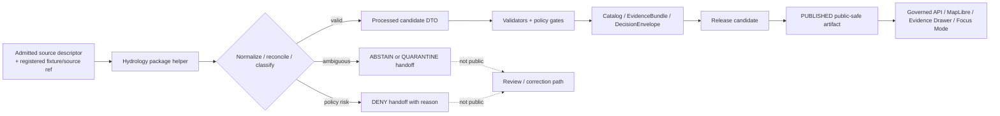

<!-- [KFM_META_BLOCK_V2]
doc_id: kfm://doc/NEEDS-VERIFICATION/packages-domains-hydrology-readme
title: Hydrology Domain Package README
type: standard
version: v1
status: draft
owners: OWNER_TBD
created: 2026-06-14
updated: 2026-06-14
policy_label: public
related: [docs/domains/hydrology/README.md, docs/architecture/hydrology/TRUST_PATH.md, docs/architecture/hydrology/DATA_LIFECYCLE.md, docs/runbooks/hydrology/, docs/adr/ADR-hydrology-schema-home.md, docs/adr/ADR-hydrology-source-role-model.md, schemas/contracts/v1/hydrology/, contracts/domains/hydrology/, policy/hydrology/, data/registry/hydrology/, tests/hydrology/]
tags: [kfm, hydrology, water, packages, evidence, source-roles, public-safe-layers, proof-lane]
notes: ["README-like package entrypoint for the Hydrology domain package.", "Target path is user-requested and Directory Rules-compatible as a package/domain segment, but actual repo package layout remains NEEDS VERIFICATION until a mounted repo confirms package metadata, imports, tests, and CI.", "This package may contain shared implementation helpers only; it must not become a schema, contract, policy, source-registry, lifecycle-data, release, receipt, proof, or publication authority."]
[/KFM_META_BLOCK_V2] -->

# Hydrology Domain Package

Shared implementation package for KFM hydrology helpers that preserve source roles, watershed identity, observation semantics, temporal scope, evidence closure, and public-safe release boundaries.

<p>
  
  
  
  
  
  
</p>

> [!IMPORTANT]
> **Status:** PROPOSED package README  
> **Path:** `packages/domains/hydrology/README.md`  
> **Owning responsibility root:** `packages/`  
> **Domain lane:** `hydrology`  
> **Repo implementation depth:** NEEDS VERIFICATION — package metadata, package manager, imports, tests, schemas, policies, registries, CI workflows, API routes, UI bindings, generated receipts, proof objects, and runtime behavior were not inspected in this file-generation pass.

## Quick links

- [Scope](#scope)
- [Repo fit](#repo-fit)
- [Accepted inputs](#accepted-inputs)
- [Exclusions](#exclusions)
- [Package responsibilities](#package-responsibilities)
- [Source-role anti-collapse rules](#source-role-anti-collapse-rules)
- [Hydrology lane map](#hydrology-lane-map)
- [Trust-boundary flow](#trust-boundary-flow)
- [Proposed directory map](#proposed-directory-map)
- [Finite outcomes](#finite-outcomes)
- [Validation and quality gates](#validation-and-quality-gates)
- [Development rules](#development-rules)
- [Definition of done](#definition-of-done)
- [Verification checklist](#verification-checklist)
- [Rollback](#rollback)

---

## Scope

`packages/domains/hydrology/` is the shared implementation package lane for hydrology helpers.

This package may contain reusable code that helps KFM ingest, normalize, classify, validate, prepare, explain, and hand off hydrology candidates to governed downstream systems. It does **not** own truth, source authority, policy, lifecycle state, public publication, release approval, or AI answers.

The package may support these hydrology knowledge families:

- watershed boundaries and hydrologic-unit hierarchy, especially HUC12 proof-slice fixtures;
- NHDPlus HR / hydrography identity and network crosswalk support;
- USGS Water Data / NWIS time-series observation normalization;
- streamflow, stage, site metadata, units, qualifiers, provisional status, no-data reasons, and freshness indicators;
- terrain-derived hydrology helpers where source DEM and algorithm manifests are explicit;
- FEMA NFHL and other regulatory **flood context** handling, without treating regulatory layers as observed flood evidence;
- observed or historical flood-event evidence as a separate lane from regulatory flood context;
- water-quality, groundwater, hydro-structure, wetland, riparian, water-use, and hydroclimate support adapters when their source roles remain separate;
- public-safe layer-manifest preparation;
- EvidenceBundle-aware DTO preparation;
- MapLibre / Evidence Drawer / Focus Mode support payloads after policy and release controls.

```text
RAW -> WORK / QUARANTINE -> PROCESSED -> CATALOG / TRIPLET -> PUBLISHED
```

> [!WARNING]
> Hydrology helpers must not turn live feeds, simulations, raw source records, regulatory context, terrain derivatives, or map layers into public truth. Public surfaces consume governed APIs, released artifacts, catalog records, tile services, EvidenceBundle resolution, policy decisions, and review state.

## Repo fit

| Concern | This package owns | It must not own |
|---|---|---|
| Responsibility root | Shared reusable hydrology implementation helpers under `packages/` | Repo-wide validators, source connectors, schemas, policy, lifecycle data, proof objects, release decisions |
| Domain segment | `domains/hydrology/` | Root-level `hydrology/` folder |
| Trust role | Transform, normalize, reconcile, classify, and prepare package-level DTOs | Source authority, release authority, public claim authority |
| Public surface | Support governed API/UI payloads only after release controls | Direct public access to RAW, WORK, QUARANTINE, canonical stores, live model output, or private graph state |
| Change posture | Small, reversible helpers with tests and fixtures | Hidden migrations, implicit source activation, unreviewed publication |

Related homes that this README references but does not create as authority:

- `docs/domains/hydrology/` — human-facing hydrology doctrine and usage notes.
- `docs/architecture/hydrology/` — architecture, diagrams, and trust-path decisions.
- `docs/runbooks/hydrology/` — source refresh, promotion, rollback, and correction procedures.
- `schemas/contracts/v1/hydrology/` — machine-checkable object shapes, subject to ADR verification.
- `contracts/domains/hydrology/` — semantic contracts if the repo uses this convention.
- `policy/hydrology/` — allow / deny / restrict / abstain rules.
- `data/registry/hydrology/` or `data/registry/sources/hydrology/` — source descriptors, rights, cadence, and sensitivity metadata.
- `data/processed/hydrology/` — validated processed outputs.
- `data/catalog/.../hydrology/` — STAC/DCAT/PROV/catalog records.
- `data/receipts/hydrology/` and `data/proofs/hydrology/` — process memory and proof objects.
- `data/published/.../hydrology/` — released public-safe artifacts.
- `release/candidates/hydrology/` — release decisions, manifests, correction, and rollback records.
- `tests/domains/hydrology/` and `fixtures/domains/hydrology/` — proof that helpers behave correctly.

## Accepted inputs

Code in this package may accept **already-admitted** or **fixture-scoped** hydrology inputs such as:

- source descriptor references, not raw unregistered source assumptions;
- WBD/HUC fixture records with explicit source identity and version metadata;
- NHDPlus HR records and crosswalk rows with relationship classification;
- USGS Water observation fixtures including site metadata, parameter codes, units, qualifiers, timestamps, approval/provisional state, no-data reasons, and freshness metadata;
- FEMA NFHL or regulatory flood-context fixtures labeled as regulatory context, not observed flood;
- terrain-derived hydrology fixtures with source DEM identity, CRS, vertical datum, nodata, method, and algorithm manifest reference;
- policy decisions, sensitivity decisions, validation reports, and release-state references provided by the proper authority roots;
- illustrative local test fixtures that are clearly marked as synthetic or no-network.

Accepted inputs should be boring, explicit, and reviewable. If an input cannot point to source role, temporal scope, evidence support, and policy state, this package should return a finite failure outcome rather than guessing.

## Exclusions

This package must not contain or create:

| Excluded item | Correct home / handling |
|---|---|
| Raw source dumps or live fetch deposits | `data/raw/hydrology/` after source admission |
| Ambiguous, rejected, or rights-uncertain records | `data/quarantine/hydrology/` |
| Processed outputs | `data/processed/hydrology/` |
| Published layer artifacts | `data/published/.../hydrology/` |
| Source descriptors and source-rights records | `data/registry/hydrology/` or `data/registry/sources/hydrology/` |
| Schema files | `schemas/contracts/v1/hydrology/` unless an ADR says otherwise |
| Semantic contract Markdown | `contracts/domains/hydrology/` if used by repo convention |
| Policy rules | `policy/hydrology/` |
| Repo-wide validators | `tools/validators/hydrology/` |
| Pipeline execution logic | `pipelines/hydrology/` |
| Declarative pipeline specs | `pipeline_specs/hydrology/` |
| Receipts and proof objects | `data/receipts/hydrology/` and `data/proofs/hydrology/` |
| Release decisions, manifests, rollback, correction | `release/candidates/hydrology/` or release-root convention verified by ADR |
| Emergency alerts or operational warnings | Out of KFM scope unless separately governed; this package may only provide contextual evidence-supporting data |
| Simulation outputs treated as observations | Keep in a separate simulation/scenario lane with model card, uncertainty, calibration, and release review |

## Package responsibilities

The package should be kept small enough that every helper can be tested without network access.

| Responsibility | Expected behavior | Failure posture |
|---|---|---|
| Normalize | Convert admitted records into stable internal DTOs without erasing source role, units, qualifiers, time zone, or approval status | `ERROR` for malformed data; `ABSTAIN` for missing evidence support |
| Reconcile identity | Match HUC, site, reach, crosswalk, or geometry identity only when evidence is sufficient | `ABSTAIN` for ambiguous split/merge/retired/unknown mappings |
| Preserve temporal scope | Keep observation time, valid time, source update time, publication time, and release time distinct | `DENY` public-ready claims with missing critical time semantics |
| Separate source roles | Keep regulatory context, observation, derivative, simulation, and interpretation separate | `DENY` role collapse, especially NFHL-as-observed-flood misuse |
| Prepare public-safe layer inputs | Produce candidate layer descriptors only after geometry, sensitivity, and release references are present | `DENY` exact or sensitive geometry when policy state is absent |
| Support Evidence Drawer | Attach EvidenceRef / EvidenceBundle references for consequential claims | `ABSTAIN` when evidence closure is incomplete |
| Support rollback | Preserve reversible transforms, deterministic identities, and enough metadata for correction lineage | `ERROR` when transform receipts cannot be generated by owning systems |

## Source-role anti-collapse rules

Hydrology is especially vulnerable to false equivalence because many water-related datasets look map-ready. This package must keep the following distinctions visible:

| Do not collapse | Why it matters | Required outcome |
|---|---|---|
| WBD/HUC watershed boundary ≠ stream network observation | Boundaries are spatial units; observations come from measurements or events | Keep boundary identity and observation payloads separate |
| NHDPlus HR Permanent Identifier ≠ legacy COMID certainty | Crosswalks may split, merge, retire, or become ambiguous | `ABSTAIN` unless relationship is evidence-backed |
| USGS Water provisional value ≠ reviewed/final value | Approval state affects claim strength | Preserve approval/provisional qualifiers |
| NFHL flood zone ≠ observed inundation | NFHL is regulatory flood-hazard context | Use `flood_context`; `DENY` observed-flood wording |
| Terrain-derived flow path ≠ canonical hydrography | DEM derivatives depend on algorithm and source terrain | Require method and source manifests |
| Simulation output ≠ observation | Models need calibration, uncertainty, and model cards | Mark `EXPERIMENTAL` until validated and reviewed |
| Water quality sample ≠ streamflow observation | Parameters, QA/QC, media, and methods differ | Keep lane-specific schemas and source roles |
| Groundwater well observation ≠ surface-water gage observation | Datum, aquifer, screened interval, and context differ | Keep separate object families |

## Hydrology lane map

| Lane | Package support | Governance requirement |
|---|---|---|
| WBD / HUC12 | Identity helpers, geometry fingerprint helpers, fixture normalization | Source descriptor, version metadata, reviewer diff |
| NHDPlus HR crosswalk | Relationship classification and ambiguity handling | Evidence-backed Permanent Identifier / COMID bridge |
| USGS Water observations | Time-series observation normalization | Qualifiers, units, no-data reasons, provisional/approval state |
| Terrain-derived hydrology | Method-aware derivative metadata helpers | DEM, CRS, vertical datum, algorithm manifest, rebuild path |
| FEMA NFHL flood context | Regulatory context classification | Never public as observed flood evidence |
| Observed flood event evidence | Event evidence DTO preparation | Event date, evidence type, confidence, correction lineage |
| Water quality | Parameter/sample metadata support | QA/QC, method, source role, station, date |
| Groundwater | Observation-context helpers | Aquifer, datum, well/source role, screened interval where applicable |
| Hydro-structures | Context and sensitivity-aware DTO preparation | Ownership/regulatory review and public-safety review |
| Simulation / scenario | Deferred adapter surface | Model card, calibration, uncertainty, tests, `EXPERIMENTAL` label |

## Trust-boundary flow



The package sits inside the implementation portion of the trust path. It does not bypass catalog, proof, policy, review, release, correction, or rollback controls.

## Proposed directory map

> [!NOTE]
> This tree is a package-local orientation map. It is **PROPOSED** until the mounted repository confirms package conventions.

```text
packages/domains/hydrology/
├── README.md
├── pyproject.toml                  # NEEDS VERIFICATION if this package is Python-packaged here
├── package.json                    # NEEDS VERIFICATION if this package is JS/TS-packaged here
├── src/
│   └── hydrology/
│       ├── README.md
│       ├── __init__.py             # PROPOSED if Python package convention is used
│       ├── identity/               # HUC/site/reach/crosswalk identity helpers
│       ├── normalizers/            # USGS/WBD/NHD/NFHL/terrain candidate normalizers
│       ├── source_roles/           # source-role classification helpers
│       ├── observations/           # time-series observation DTO helpers
│       ├── flood_context/          # regulatory vs observed flood separation helpers
│       ├── terrain_derivatives/    # method/source manifest helpers
│       ├── layer_manifest/         # public-safe layer descriptor assembly helpers
│       └── evidence/               # EvidenceRef/EvidenceBundle handoff helpers
├── tests/                          # package-local tests only if repo convention allows
└── examples/                       # synthetic/no-network examples only
```

If package-local tests conflict with repo convention, keep tests in `tests/domains/hydrology/` and fixtures in `fixtures/domains/hydrology/`.

## Finite outcomes

Helpers should return finite outcomes instead of silently filling gaps.

| Outcome | Use when | Example |
|---|---|---|
| `ANSWER` | Record can be normalized or classified with adequate evidence | HUC12 fixture has valid geometry fingerprint and source version |
| `ABSTAIN` | Evidence is insufficient or identity is ambiguous | COMID maps to multiple Permanent Identifiers without disambiguation |
| `DENY` | Output would violate policy, source role, sensitivity, release, or public-safety boundary | NFHL row is requested as observed flood extent |
| `ERROR` | Tooling, input, schema, or runtime failure prevents safe evaluation | Required timestamp field cannot be parsed |

## Validation and quality gates

Before this package is treated as more than a draft helper lane:

- [ ] Confirm package manager and import convention in a mounted repo.
- [ ] Confirm whether tests belong locally or under `tests/domains/hydrology/`.
- [ ] Confirm schema-home ADR and canonical schema paths.
- [ ] Confirm source descriptor home and source-role vocabulary.
- [ ] Add no-network fixtures for WBD/HUC12, NHDPlus HR crosswalk, USGS 00060/00065 observations, NFHL flood context, and terrain derivative metadata.
- [ ] Test `ABSTAIN` for ambiguous identity mappings.
- [ ] Test `DENY` for flood-role misuse and public trust-path bypass.
- [ ] Test `ERROR` for malformed units, timestamps, CRS, or missing required fields.
- [ ] Confirm helpers preserve source role, units, qualifiers, timestamps, approval state, and evidence references.
- [ ] Confirm public payload helpers require release/evidence/policy references.
- [ ] Confirm rollback/correction metadata is retained or handed off to owning systems.

## Development rules

1. Keep helpers deterministic where practical.
2. Prefer pure transforms over hidden side effects.
3. Do not fetch live sources from package helpers unless a connector contract explicitly delegates that behavior.
4. Do not write lifecycle data from this package; return structured outputs for owning pipeline/data roots.
5. Preserve source values alongside normalized values when doing so is allowed and useful for audit.
6. Never erase qualifiers, provisional state, no-data reasons, uncertainty, or date scope.
7. Keep regulatory, observational, derivative, and simulation records separated.
8. Require explicit policy/release references before preparing public-safe outputs.
9. Use fixture-first tests before live source probes.
10. Keep AI-facing text downstream of EvidenceBundle and policy state.

## Definition of done

A change in this package is not done until:

- [ ] The path placement is confirmed against Directory Rules or marked with a verification item.
- [ ] The helper has no-network tests.
- [ ] The helper exposes finite outcomes for unsafe or ambiguous conditions.
- [ ] Source-role boundaries are preserved in output DTOs.
- [ ] EvidenceRef / EvidenceBundle handoff expectations are documented or tested.
- [ ] Public-safe layer output requires policy and release references.
- [ ] Ambiguous identity returns `ABSTAIN` rather than best-effort certainty.
- [ ] Flood-context misuse returns `DENY` rather than relabeling.
- [ ] Rollback/correction implications are documented.
- [ ] Adjacent docs, schemas, policies, fixtures, and tests are linked or listed as NEEDS VERIFICATION.

## Verification checklist

- [ ] Confirm `packages/domains/hydrology/` exists in the target repo.
- [ ] Confirm this README is linked from `packages/domains/README.md` if that index exists.
- [ ] Confirm package metadata convention: Python, TypeScript, mixed, or docs-only placeholder.
- [ ] Confirm owners and CODEOWNERS coverage.
- [ ] Confirm `schemas/contracts/v1/hydrology/` or ADR-approved schema home.
- [ ] Confirm `policy/hydrology/` or ADR-approved policy home.
- [ ] Confirm source descriptors for WBD/HUC12, NHDPlus HR, USGS Water Data, FEMA NFHL, and terrain DEM.
- [ ] Confirm fixtures and tests for the core hydrology proof slice.
- [ ] Confirm no public path reads RAW, WORK, QUARANTINE, internal graph, or canonical stores directly.
- [ ] Confirm release, correction, and rollback references before any public layer manifest is consumed.

## Rollback

Rollback is required if a change in this package:

- weakens source-role separation;
- lets regulatory flood context masquerade as observed flood evidence;
- silently resolves ambiguous identity mappings;
- hides provisional, no-data, qualifier, unit, timestamp, CRS, or datum information;
- writes lifecycle data, receipts, proofs, release manifests, schemas, or policy into the package root;
- enables public UI/API output without EvidenceBundle, policy, review, and release references;
- creates or relies on a root-level `hydrology/` domain folder;
- introduces network behavior without connector/source-descriptor controls.

Rollback target: restore the last reviewed README/package state, quarantine unsafe generated outputs, retain failed run receipts where available, and file a correction or drift entry under the appropriate docs/registers home.

## Evidence basis

| Source | Status | Supports | Limits |
|---|---|---|---|
| Directory Rules | CONFIRMED doctrine | Responsibility-root placement, domain-as-segment rule, lifecycle separation, ADR needs for authority changes | Does not prove this package exists in the live repo |
| KFM Hydrology Extended Pro PDF-Only Reference Report | LINEAGE / PROPOSED plan | Hydrology proof-lane scope, HUC12, NHDPlus HR crosswalk, USGS Water observations, NFHL flood-context separation, policy gates, no-repo boundary | Does not prove current implementation files, tests, workflows, routes, or runtime behavior |
| Current file-generation pass | CONFIRMED artifact generation | Created this README in the sandbox path requested by the user | Does not inspect or mutate the live repository |

## Open questions

- Which package language convention is canonical for domain packages: Python, TypeScript, or mixed?
- Should hydrology helpers live under `packages/domains/hydrology/` or a repo-specific package name such as `packages/hydrology/`? Current path follows the user request and Directory Rules domain-segment pattern.
- Where does the mounted repo currently place package-local tests?
- Has ADR-0001 or a later ADR settled hydrology schema-home details?
- Which source-role enum values are already canonical for hydrology?
- Which hydrology source descriptors already exist, if any?
- Which release manifest and Evidence Drawer payload shapes are already implemented?

