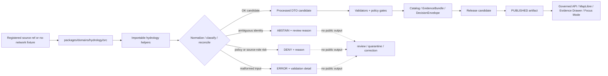

<!-- [KFM_META_BLOCK_V2]
doc_id: kfm://doc/NEEDS-VERIFICATION/packages-domains-hydrology-src-readme
title: Hydrology Package Source README
type: standard
version: v1
status: draft
owners: OWNER_TBD
created: 2026-06-14
updated: 2026-06-14
policy_label: public
related: [packages/domains/hydrology/README.md, packages/domains/hydrology/src/hydrology/README.md, docs/domains/hydrology/README.md, docs/domains/hydrology/ARCHITECTURE.md, schemas/contracts/v1/hydrology/, contracts/domains/hydrology/, policy/hydrology/, data/registry/hydrology/, data/receipts/hydrology/, data/proofs/hydrology/, release/]
tags: [kfm, hydrology, packages, src, implementation, evidence, huc12, nhdplus, usgs-water, layer-manifest]
notes: ["README-like source-directory guide for the Hydrology package.", "Target path is user-requested and Directory Rules-compatible as source code under packages/, but actual package metadata, import layout, build tools, tests, and CI remain NEEDS VERIFICATION until the live repo is inspected.", "This directory may contain package source code only; it must not own schemas, contracts, policy, source registries, lifecycle data, proofs, receipts, release decisions, API routes, UI surfaces, or AI truth claims."]
[/KFM_META_BLOCK_V2] -->

# Hydrology Package Source

Source-code envelope for the KFM Hydrology package: deterministic helpers that support admitted hydrology records without becoming the source of truth, release authority, policy authority, or public data path.

<p>
  
  
  
  
  
  
  
</p>

> [!IMPORTANT]
> **Status:** PROPOSED source-directory README  
> **Path:** `packages/domains/hydrology/src/README.md`  
> **Owning responsibility root:** `packages/`  
> **Package lane:** `packages/domains/hydrology/`  
> **Import/package layout:** NEEDS VERIFICATION  
> **Repo implementation depth:** UNKNOWN for package metadata, package manager, import style, tests, CI workflows, API bindings, UI bindings, policy engine, emitted receipts, proof packs, release manifests, branch protections, and runtime behavior.

## Quick links

- [Scope](#scope)
- [Repo fit](#repo-fit)
- [Accepted inputs](#accepted-inputs)
- [Exclusions](#exclusions)
- [Expected package layout](#expected-package-layout)
- [Trust-boundary flow](#trust-boundary-flow)
- [Hydrology anti-collapse rules](#hydrology-anti-collapse-rules)
- [Finite outcomes](#finite-outcomes)
- [Development rules](#development-rules)
- [Validation checklist](#validation-checklist)
- [Rollback](#rollback)

---

## Scope

`packages/domains/hydrology/src/` is the proposed source-code root for the Hydrology package.

This directory is for importable, deterministic implementation helpers used by governed hydrology pipelines, validators, API adapters, MapLibre layer-preparation code, Evidence Drawer mappers, and Focus Mode support code. It should stay small, fixture-testable, no-network by default, and evidence-subordinate.

This source tree may support helpers for:

- HUC/HUC12 identity checks and stable fingerprint metadata;
- NHDPlus HR / Permanent Identifier / COMID crosswalk support;
- USGS Water observation normalization, including parameter, unit, timestamp, qualifier, provisional, no-data, and approval-state preservation;
- flood-source role separation, especially regulatory context versus observed flood evidence;
- terrain-derivative metadata preparation when DEM source, CRS, vertical datum, method, and algorithm-manifest refs are explicit;
- EvidenceRef / EvidenceBundle reference preparation for downstream proof systems;
- candidate layer-manifest fields for released hydrology artifacts;
- finite outcomes such as `OK`, `ABSTAIN`, `DENY`, and `ERROR`.

This directory must not fetch live source data, store lifecycle artifacts, own source descriptors, approve releases, publish tiles, answer public claims, or treat generated summaries, maps, graph projections, or model output as sovereign truth.

```text
RAW -> WORK / QUARANTINE -> PROCESSED -> CATALOG / TRIPLET -> PUBLISHED
```

Package code may prepare candidate objects inside that lifecycle. It does not own the lifecycle state itself.

---

## Repo fit

```text
packages/domains/hydrology/src/
```

`packages/` is the responsibility root for shared reusable code. `domains/hydrology/` is the domain segment. `src/` is the package source-code envelope.

| Relationship | Expected home | Boundary rule |
| --- | --- | --- |
| Package source code | `packages/domains/hydrology/src/` | Reusable hydrology implementation helpers only. |
| Importable module | `packages/domains/hydrology/src/hydrology/` | Package namespace, subject to repo package convention verification. |
| Package entry README | `packages/domains/hydrology/README.md` | Explains the hydrology package as a whole. |
| Domain docs | `docs/domains/hydrology/` | Explains doctrine, source roles, stewardship, public-safety limits, and publication posture. |
| Semantic contracts | `contracts/domains/hydrology/` or repo-confirmed contract home | Defines meaning; source code references, not redefines. |
| Machine schemas | `schemas/contracts/v1/hydrology/` or repo-confirmed schema home | Defines shape; source code validates against it. |
| Source registry | `data/registry/hydrology/` or `data/registry/sources/hydrology/` | Owns source identity, rights, role, cadence, sensitivity, and activation state. |
| Policy | `policy/hydrology/` or repo-confirmed policy lane | Owns allow/deny/restrict/abstain behavior. |
| Lifecycle data | `data/raw/`, `data/work/`, `data/quarantine/`, `data/processed/`, `data/catalog/`, `data/published/` | Stores evidence-bearing and released artifacts by phase. |
| Receipts and proofs | `data/receipts/hydrology/`, `data/proofs/hydrology/` | Stores process memory and proof objects. |
| Release decisions | `release/` | Owns release manifests, promotion decisions, corrections, rollback targets, and supersession. |
| API and UI runtime | `apps/`, `ui/`, `web/`, or repo-confirmed equivalents | May call package helpers; must not be replaced by package internals. |
| Tests and fixtures | `tests/domains/hydrology/`, `fixtures/domains/hydrology/`, or repo-confirmed equivalents | Proves behavior with deterministic fixtures. |

> [!WARNING]
> A source-code directory is not a trust-object home. Keep schemas, contracts, source registries, policy rules, lifecycle data, receipts, proofs, and release decisions in their owning roots.

---

## Accepted inputs

Functions in this source tree should accept explicit values from governed callers. They should not fetch missing facts from live services, hidden globals, local operator memory, UI state, or generated language.

| Input family | Accepted examples | Required handling |
| --- | --- | --- |
| Hydrologic unit context | HUC, HUC12, WBD source version, geometry fingerprint, source scale, spatial reference | Preserve source version and geometry fingerprint; abstain on malformed or unsupported identity. |
| Hydrography identity | NHDPlus HR identifiers, Permanent Identifier, COMID, reachcode, relationship class, split/merge metadata | Never silently force ambiguous one-to-one mappings. |
| Water observations | USGS Water records, site IDs, parameter codes such as streamflow/stage, units, timestamps, qualifiers, no-data, provisional/approved state | Preserve source-native and normalized fields separately. |
| Flood context | NFHL or other regulatory-context records, observed event evidence, confidence, source type, review state | Keep regulatory context separate from observed flood evidence. |
| Terrain derivatives | DEM source ref, CRS, vertical datum, nodata policy, algorithm manifest, flow direction/accumulation candidate metadata | Label as derivative output with method, caveats, and uncertainty. |
| Source context | `source_id`, source descriptor ref, source role, rights profile, sensitivity label, cadence, citation template | Treat source role as a boundary, not a display hint. |
| Evidence context | EvidenceRef, EvidenceBundle ref, input digest, citation obligation, release state | Return finite negative outcomes when evidence is missing or unresolved. |
| Policy context | policy decision ref, sensitivity tier, obligations, deny/abstain reason codes, transform requirements | Use as input; do not approve release inside package code. |
| Run context | run ID, actor/service ID, package version, spec hash, input/output digest, processing timestamp | Return receipt-ready metadata for owning pipelines to persist. |

---

## Exclusions

| Do not put here | Correct home or owner | Reason |
| --- | --- | --- |
| Live source connectors, API clients, scrapers, tokens, credentials, or source polling logic | `connectors/`, `pipelines/`, `pipeline_specs/`, `configs/`, secret infrastructure | Source activation must be governed and audited. |
| RAW, WORK, QUARANTINE, PROCESSED, CATALOG, TRIPLET, or PUBLISHED artifacts | `data/<phase>/hydrology/` | Lifecycle state must remain inspectable outside source code. |
| Source descriptors, rights matrices, or source-role registries | `data/registry/hydrology/` or verified registry home | Source authority is governance data. |
| Semantic contracts | `contracts/domains/hydrology/` | Contracts own meaning. |
| JSON Schemas | `schemas/contracts/v1/hydrology/` | Schemas own machine shape. |
| Policy rules or release criteria | `policy/hydrology/`, `release/` | Policy and release decisions are separate authority roots. |
| Run receipts, AI receipts, proof packs, catalog records, EvidenceBundle stores | `data/receipts/`, `data/proofs/`, `data/catalog/` | Trust artifacts must remain separately auditable. |
| API route handlers or public UI components | `apps/`, `ui/`, `web/`, or verified runtime roots | Package internals must not become the public path. |
| Hydrologic emergency alerts or real-time instructions | Out of scope unless separately governed by official-source handoff policy | KFM is an evidence system, not an emergency alert system. |

---

## Expected package layout

> [!NOTE]
> The tree below is PROPOSED. Confirm package metadata, language conventions, and test layout before committing code beyond README files.

```text
packages/domains/hydrology/src/
├── README.md                    # This file: source-code boundary and trust rules
└── hydrology/
    ├── README.md                # Importable namespace guide
    ├── __init__.py              # PROPOSED: namespace export boundary
    ├── outcomes.py              # PROPOSED: finite outcomes and reason codes
    ├── identity.py              # PROPOSED: HUC/site/reach/crosswalk identity helpers
    ├── source_roles.py          # PROPOSED: observation vs regulatory vs derivative guards
    ├── normalizers.py           # PROPOSED: source-specific normalization adapters
    ├── units.py                 # PROPOSED: parameter and unit annotation helpers
    ├── temporal.py              # PROPOSED: observed/valid/issued/released time helpers
    ├── geometry.py              # PROPOSED: fingerprint and public-safe geometry metadata
    ├── evidence.py              # PROPOSED: EvidenceRef/EvidenceBundle preparation helpers
    ├── layer_manifest.py        # PROPOSED: released layer payload helper functions
    └── py.typed                 # PROPOSED: include only if typed Python package convention is confirmed
```

Preferred import posture, subject to package verification:

```python
from hydrology.outcomes import Outcome
from hydrology.identity import resolve_huc12_identity
from hydrology.source_roles import classify_hydrology_source_role
```

---

## Trust-boundary flow



---

## Hydrology anti-collapse rules

Hydrology source code must preserve differences between source families and knowledge characters. Convenience helpers must never flatten them into generic “water facts.”

| Boundary | Preserve as | Never collapse into |
| --- | --- | --- |
| WBD / HUC12 | Hydrologic unit and watershed-boundary context | Stream observation, flood event, or regulatory finding |
| NHDPlus HR / COMID / Permanent Identifier | Hydrography identity and network relationship context | Guaranteed permanent one-to-one identity without crosswalk evidence |
| USGS Water observation | Measured/reported observation with parameter, unit, qualifier, time, and approval state | Generic water value stripped of provenance and caveats |
| FEMA NFHL / floodplain context | Regulatory flood-hazard context | Observed flood event or current emergency condition |
| Observed flood evidence | Event evidence with source, confidence, geometry/provenance, and review state | Regulatory context, simulation, or unreviewed public claim |
| Terrain derivative | Algorithmic derivative with DEM, method, CRS, vertical datum, and caveats | Canonical hydrography or observation |
| Simulation / scenario | Model output with assumptions, calibration, and uncertainty | Observed fact, regulatory fact, or release-ready claim |
| EvidenceBundle reference | Evidence closure object resolved by KFM proof systems | Citation-looking string that proves itself |
| Layer manifest candidate | Public-delivery metadata candidate | Publication authority or canonical truth |

---

## Finite outcomes

Hydrology helpers should return explicit outcomes that calling pipelines, validators, APIs, or tests can inspect.

| Outcome | Use when | Public posture |
| --- | --- | --- |
| `OK` | Candidate output has sufficient local structure for the next governed gate | Not public until catalog/proof/release gates pass. |
| `ABSTAIN` | Evidence, identity, temporal scope, source-role support, or crosswalk support is insufficient | Do not publish; send to review or quarantine path. |
| `DENY` | Policy, sensitivity, role collapse, release, or public-safety constraint blocks use | Do not publish; record reason and rollback/correction target if relevant. |
| `ERROR` | Malformed input, unsupported unit, invalid geometry, schema mismatch, or code failure | Do not publish; fix input, code, fixture, or validator. |

---

## Development rules

1. Prefer pure functions with explicit inputs and outputs.
2. Preserve source-native fields before deriving convenience fields.
3. Keep source role, time semantics, units, qualifiers, uncertainty, and limitations visible.
4. Make ambiguous HUC/site/reach/crosswalk identity resolution impossible to ignore.
5. Return finite outcomes instead of silent fallbacks.
6. Do not make network calls from `src/` helpers.
7. Do not import UI, API route, connector, policy engine, source watcher, release writer, or receipt store code into this namespace unless an ADR-backed package boundary allows it.
8. Do not create parallel schema, policy, source registry, proof, receipt, release, or lifecycle homes inside `src/`.
9. Add or update tests with every behavior-changing helper.
10. Keep rollback and correction needs visible in return metadata when transforms affect downstream release candidates.

---

## Validation checklist

- [ ] Confirm `packages/domains/hydrology/src/` exists in the mounted repo or create it in the same PR as package metadata.
- [ ] Confirm package manager and import convention (`pyproject.toml`, workspace config, or equivalent).
- [ ] Confirm whether this source tree is Python-only, TypeScript-only, or mixed-language.
- [ ] Confirm owners and CODEOWNERS path coverage.
- [ ] Confirm schema home for hydrology contracts.
- [ ] Confirm source registry home for hydrology descriptors.
- [ ] Confirm validators and tests that exercise this namespace.
- [ ] Confirm no helper performs live source fetch, public publication, release decision, or policy enforcement outside the proper roots.
- [ ] Confirm ambiguous NHDPlus/COMID/Permanent Identifier mappings return `ABSTAIN` or equivalent review-required outcome.
- [ ] Confirm NFHL/regulatory context cannot be labeled as observed flood evidence.
- [ ] Confirm USGS Water helpers preserve qualifier, unit, timestamp, and provisional/no-data/approval state.
- [ ] Confirm all public-facing payload candidates carry EvidenceBundle / DecisionEnvelope / release-state references as required.
- [ ] Confirm rollback/correction metadata can be produced by downstream receipt/proof/release systems.

---

## Rollback

Rollback is required if this source tree:

- creates a parallel authority home for schemas, contracts, policy, registries, receipts, proofs, releases, or lifecycle data;
- permits public output without EvidenceBundle, policy decision, review state, and release state;
- collapses watershed boundary, hydrography identity, observation, regulatory context, terrain derivative, simulation, or interpretation into one generic hydrology claim;
- silently resolves ambiguous HUC/site/reach/crosswalk identities;
- strips qualifiers, units, timestamps, no-data flags, provisional state, or approval state from observations;
- bypasses governed APIs, released artifacts, catalog records, or the Evidence Drawer trust path.

Rollback target: revert the package-source PR, keep any generated audit notes as review evidence, and file the affected behavior in `docs/registers/DRIFT_REGISTER.md` or `docs/registers/VERIFICATION_BACKLOG.md` if the mounted repo uses those registers.

---

## Evidence boundary

| Source | Status | Supports | Limits |
| --- | --- | --- | --- |
| Directory Rules | CONFIRMED doctrine | `packages/` as shared library root; domain as segment; lifecycle and authority separation | Does not prove this source tree exists or is wired into tests/CI. |
| KFM Hydrology Extended Pro PDF-Only Reference Report | LINEAGE / PROPOSED plan | Hydrology proof-lane objects, HUC12, NHDPlus HR, USGS Water observations, EvidenceBundle, layer manifest, policy gate, rollback concepts | States repo implementation depth was unknown in that run; not current implementation proof. |
| Current file-generation pass | CONFIRMED request | User-requested target path and README creation | Does not inspect mounted repo, package metadata, imports, tests, CI, or runtime. |

