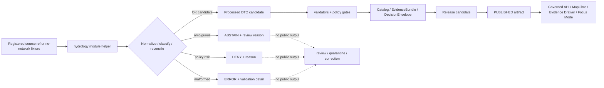

<!-- [KFM_META_BLOCK_V2]
doc_id: kfm://doc/NEEDS-VERIFICATION/packages-domains-hydrology-src-hydrology-readme
title: Hydrology Python Module README
type: standard
version: v1
status: draft
owners: OWNER_TBD
created: 2026-06-14
updated: 2026-06-14
policy_label: public
related: [packages/domains/hydrology/README.md, packages/domains/hydrology/src/README.md, docs/domains/hydrology/README.md, docs/architecture/hydrology/TRUST_PATH.md, docs/runbooks/hydrology/, schemas/contracts/v1/hydrology/, contracts/domains/hydrology/, policy/hydrology/, data/registry/hydrology/, tests/domains/hydrology/, fixtures/domains/hydrology/]
tags: [kfm, hydrology, package-module, python, source-roles, evidence-bundle, huc12, nhdplus, usgs-water]
notes: ["README-like source-module entrypoint for the hydrology package implementation namespace.", "Target path is user-requested and Directory Rules-compatible as code under the packages responsibility root, but package metadata, import path, test runner, CI wiring, and live module behavior remain NEEDS VERIFICATION until a mounted repo confirms them.", "This module may contain implementation helpers only; schemas, policy, source registries, lifecycle data, receipts, proofs, release decisions, and published artifacts remain in their own authority roots."]
[/KFM_META_BLOCK_V2] -->

# Hydrology Module

Implementation namespace for hydrology helpers that normalize, reconcile, classify, and prepare water-domain records without becoming the source of truth.

<p>
  
  
  
  
  
  
</p>

> [!IMPORTANT]
> **Status:** PROPOSED module README  
> **Path:** `packages/domains/hydrology/src/hydrology/README.md`  
> **Owning responsibility root:** `packages/`  
> **Package lane:** `packages/domains/hydrology/`  
> **Import namespace:** `hydrology` — NEEDS VERIFICATION against package metadata  
> **Repo implementation depth:** NEEDS VERIFICATION — package manager, imports, tests, CI, schemas, policies, generated receipts, proof objects, API routes, UI bindings, and runtime behavior were not inspected in this file-generation pass.

## Quick links

- [Scope](#scope)
- [Repo fit](#repo-fit)
- [Accepted inputs](#accepted-inputs)
- [Exclusions](#exclusions)
- [Module responsibilities](#module-responsibilities)
- [Hydrology source-role boundaries](#hydrology-source-role-boundaries)
- [Proposed module map](#proposed-module-map)
- [Trust-boundary flow](#trust-boundary-flow)
- [Finite outcomes](#finite-outcomes)
- [Testing posture](#testing-posture)
- [Development rules](#development-rules)
- [Verification checklist](#verification-checklist)
- [Rollback](#rollback)

---

## Scope

`packages/domains/hydrology/src/hydrology/` is the proposed importable implementation namespace for the Hydrology domain package.

This namespace may hold small, testable helper modules for hydrology-specific normalization, identity resolution, unit handling, source-role preservation, temporal semantics, geometry fingerprints, public-safe layer payload preparation, and EvidenceBundle-aware DTO preparation.

It must remain downstream of source admission and upstream of governed validation, catalog closure, proof construction, release decisions, and public UI/API delivery.

```text
RAW -> WORK / QUARANTINE -> PROCESSED -> CATALOG / TRIPLET -> PUBLISHED
```

> [!WARNING]
> This module must not fetch live sources directly, publish map layers, decide release state, store canonical records, create authoritative schemas, make policy decisions, or answer public claims. It prepares candidates and returns explicit outcomes for the proper KFM authorities to validate, review, publish, correct, or roll back.

## Repo fit

| Concern | This module owns | It must not own |
|---|---|---|
| Responsibility root | Importable package implementation under `packages/` | Source connectors, pipelines, validators, schemas, policy, data lifecycle, releases |
| Domain segment | Hydrology implementation helpers | Root-level `hydrology/` authority |
| Trust role | Deterministic transformation and classification helpers | Evidence authority, source authority, review authority, public truth |
| Public posture | Prepare public-safe payload candidates only after caller supplies release/evidence context | Direct public access to raw or internal records |
| Runtime posture | No-network, fixture-friendly pure helpers by default | Hidden live calls, credentials, side effects, or auto-publish behavior |

Related homes:

- `packages/domains/hydrology/README.md` — package-level orientation.
- `packages/domains/hydrology/src/README.md` — source-tree-level orientation.
- `schemas/contracts/v1/hydrology/` — machine-checkable shapes, subject to ADR verification.
- `contracts/domains/hydrology/` — semantic contract docs if this repo keeps semantic contracts there.
- `policy/hydrology/` — allow / deny / restrict / abstain rules.
- `data/registry/hydrology/` or `data/registry/sources/hydrology/` — source descriptors, rights, cadence, sensitivity, and steward metadata.
- `pipelines/hydrology/` — executable pipeline orchestration.
- `tools/validators/hydrology/` — repo-wide validation commands.
- `tests/domains/hydrology/` and `fixtures/domains/hydrology/` — test coverage and fixtures.
- `data/receipts/hydrology/`, `data/proofs/hydrology/`, and `release/candidates/hydrology/` — process memory, proof, and release decision objects.

## Accepted inputs

Code in this namespace may accept caller-provided, already-admitted, fixture-scoped, or test-scoped structures such as:

- source descriptor references, not unregistered source assumptions;
- WBD/HUC records with source version, spatial reference, and geometry fingerprint context;
- NHDPlus HR identifiers, legacy COMIDs, Permanent Identifier values, and crosswalk rows with relationship metadata;
- USGS Water observation records with site, parameter, unit, timestamp, qualifier, approval/provisional state, and no-data context;
- FEMA NFHL or other regulatory-context records that remain labeled as regulatory context;
- terrain-derived helper inputs only when source DEM, CRS, vertical datum, nodata, method, and algorithm manifest references are explicit;
- EvidenceRef, EvidenceBundle reference, DecisionEnvelope reference, release reference, or catalog reference values supplied by upstream authorities;
- synthetic fixtures clearly marked as no-network test data.

When required evidence, source role, temporal scope, geometry support, or policy context is missing, helpers should return a finite outcome instead of guessing.

## Exclusions

| Excluded item | Correct home / handling |
|---|---|
| Live source fetching | `connectors/` or `pipelines/` after source admission rules are verified |
| Pipeline orchestration | `pipelines/hydrology/` |
| Declarative pipeline specs | `pipeline_specs/hydrology/` |
| Machine schemas | `schemas/contracts/v1/hydrology/` unless an ADR changes schema home |
| Semantic contracts | `contracts/domains/hydrology/` if used by repo convention |
| Policy rules | `policy/hydrology/` |
| Source descriptors | `data/registry/hydrology/` or `data/registry/sources/hydrology/` |
| Raw/work/quarantine/processed data | `data/<phase>/hydrology/` |
| Catalog/provenance records | `data/catalog/.../hydrology/` and `data/catalog/prov/` if repo convention confirms |
| Receipts and proof objects | `data/receipts/hydrology/` and `data/proofs/hydrology/` |
| Published artifacts | `data/published/.../hydrology/` |
| Release decisions, rollback, correction | `release/candidates/hydrology/` or verified release-root convention |
| Emergency alerts | Out of scope for this module; KFM may provide contextual evidence only through governed surfaces |

## Module responsibilities

| Helper family | Responsibility | Required failure behavior |
|---|---|---|
| `identity` | HUC, site, reach, and crosswalk identity helpers | `ABSTAIN` on ambiguous split/merge/retired mapping |
| `normalizers` | Convert admitted hydrology payloads into stable DTOs | `ERROR` for malformed source shape; preserve source role and qualifiers |
| `units` | Normalize and annotate units without erasing source values | `ABSTAIN` when unit mapping is unsupported |
| `time` | Preserve observed, valid, source-updated, processed, and released time separately | `DENY` public-ready output if critical time semantics are missing |
| `geometry` | Compute public-safe fingerprints and geometry metadata | `DENY` exact/sensitive geometry if release policy is absent |
| `source_roles` | Keep observation, regulatory context, derivative, simulation, and interpretation separate | `DENY` role collapse |
| `evidence` | Prepare evidence-aware references and limitations | `ABSTAIN` when EvidenceRef cannot resolve through the caller-supplied context |
| `layer_manifest` | Prepare candidate layer-manifest fields for released artifacts | `DENY` when release, digest, EvidenceBundle, or policy fields are absent |

## Hydrology source-role boundaries

Hydrology helpers must keep these distinctions visible in code, tests, fixtures, and docs:

| Source / object family | Must mean | Must not mean |
|---|---|---|
| WBD / HUC12 | Watershed boundary and hydrologic unit context | Stream measurement, observation, or flood event |
| NHDPlus HR / COMID / Permanent Identifier | Hydrography identity and network relationship context | Guaranteed one-to-one permanence without crosswalk evidence |
| USGS Water observation | Measured or reported observation with parameter, unit, qualifier, time, and approval state | Generic “water fact” stripped of provenance |
| FEMA NFHL / regulatory context | Regulatory flood-hazard context | Observed inundation or current emergency condition |
| Terrain-derived output | Algorithmic derivative from source terrain and method | Canonical hydrography or observation |
| Simulation / scenario | Model output with assumptions, calibration, and uncertainty | Observed fact or released public claim |
| EvidenceBundle reference | Evidence closure object resolved by KFM proof systems | A citation-looking string that proves itself |
| Layer manifest candidate | Public delivery metadata candidate | Publication authority |

## Proposed module map

> [!NOTE]
> Names below are implementation suggestions for this namespace. Keep, rename, or split them only after package metadata and adjacent repo conventions are verified.

```text
packages/domains/hydrology/src/hydrology/
├── README.md
├── __init__.py                         # PROPOSED: namespace export boundary
├── types.py                            # PROPOSED: internal value objects / protocols
├── outcomes.py                         # PROPOSED: DENY / ABSTAIN / ERROR / OK result helpers
├── source_roles.py                     # PROPOSED: observation vs regulatory vs derivative guards
├── identity.py                         # PROPOSED: HUC/site/reach/crosswalk identity helpers
├── normalizers.py                      # PROPOSED: source-specific normalization adapters
├── units.py                            # PROPOSED: unit and parameter mapping helpers
├── temporal.py                         # PROPOSED: time semantics helpers
├── geometry.py                         # PROPOSED: geometry fingerprint / public-safe metadata helpers
├── evidence.py                         # PROPOSED: EvidenceRef/EvidenceBundle preparation helpers
├── layer_manifest.py                   # PROPOSED: released layer payload helper functions
└── py.typed                            # PROPOSED: include only if typed Python package convention is confirmed
```

Preferred import posture, subject to package verification:

```python
from hydrology.outcomes import Outcome
from hydrology.source_roles import classify_hydrology_source_role
from hydrology.identity import resolve_huc12_identity
```

## Trust-boundary flow



## Finite outcomes

Hydrology helpers should return or raise explicit outcomes that the caller can validate and log.

| Outcome | Use when | Public posture |
|---|---|---|
| `OK` | Candidate output has sufficient local structure for the next governed gate | Not public until catalog/proof/release gates pass |
| `ABSTAIN` | Evidence, identity, temporal scope, or source-role support is insufficient | Do not publish; send to review/quarantine path |
| `DENY` | Policy, sensitivity, role collapse, release, or public-safety constraint blocks use | Do not publish; record reason and rollback/correction target if relevant |
| `ERROR` | Malformed input, unsupported unit, invalid geometry, or code failure | Do not publish; fix input/code/test |

## Testing posture

Tests for this namespace should be no-network by default and should prove that helpers do not weaken the hydrology trust path.

Minimum expected coverage:

- [ ] HUC/HUC12 identity helpers reject malformed IDs.
- [ ] NHDPlus crosswalk helpers abstain on ambiguous split/merge cases.
- [ ] USGS Water normalization preserves parameter code, units, qualifiers, timestamps, and approval/provisional state.
- [ ] NFHL/regulatory context cannot be labeled as observed flood evidence.
- [ ] Terrain-derived helpers require source DEM and method metadata.
- [ ] Layer-manifest helpers require release, digest, EvidenceBundle, freshness, and trust-badge fields.
- [ ] Evidence helper does not treat unresolved EvidenceRef as proof.
- [ ] Public-safe geometry helpers fail closed when sensitivity or release state is missing.

## Development rules

1. Prefer pure functions with explicit inputs and outputs.
2. Preserve source fields before deriving convenience fields.
3. Keep source role, time semantics, units, qualifiers, uncertainty, and limitations visible.
4. Make ambiguous identity resolution impossible to ignore.
5. Return finite outcomes instead of silent fallbacks.
6. Do not make network calls from module helpers.
7. Do not import UI, API route, connector, policy engine, or release writer code into this namespace unless an ADR-backed package boundary allows it.
8. Do not create parallel schema, policy, source registry, proof, receipt, release, or lifecycle homes inside `src/hydrology/`.
9. Add or update tests with every behavior-changing helper.
10. Keep rollback and correction needs visible in return metadata when transforms affect downstream release candidates.

## Verification checklist

- [ ] Confirm `packages/domains/hydrology/src/hydrology/` exists in the mounted repo or create it in the same PR as package metadata.
- [ ] Confirm package manager and import convention (`pyproject.toml`, workspace config, or equivalent).
- [ ] Confirm whether this namespace is Python-only, TypeScript-only, or mixed-language.
- [ ] Confirm owners and CODEOWNERS path coverage.
- [ ] Confirm schema home for hydrology contracts.
- [ ] Confirm source registry home for hydrology descriptors.
- [ ] Confirm validators and tests that exercise this namespace.
- [ ] Confirm no helper performs live source fetch, public publication, release decision, or policy enforcement outside the proper roots.
- [ ] Confirm all public-facing payload candidates carry EvidenceBundle / DecisionEnvelope / release-state references as required.
- [ ] Confirm rollback/correction metadata can be produced by downstream receipt/proof/release systems.

## Rollback

Rollback is required if this namespace:

- creates a parallel authority home for schemas, contracts, policy, registries, receipts, proofs, releases, or lifecycle data;
- permits public output without EvidenceBundle, policy decision, review state, and release state;
- collapses regulatory context, observation, terrain derivative, simulation, or interpretation into one generic water claim;
- silently resolves ambiguous HUC/site/reach/crosswalk identities;
- strips qualifiers, units, timestamps, or provisional state from observations;
- bypasses governed APIs, released artifacts, catalog records, or the Evidence Drawer trust path.

Rollback target: revert the package-module PR, keep any generated audit notes as review evidence, and file the affected behavior in `docs/registers/DRIFT_REGISTER.md` or `docs/registers/VERIFICATION_BACKLOG.md` if the mounted repo uses those registers.

---

## Evidence boundary

| Source | Status | Supports | Limits |
|---|---|---|---|
| Directory Rules | CONFIRMED doctrine | `packages/` as shared library root; domain as segment; lifecycle and authority separation | Does not prove this module exists or is wired into tests/CI |
| KFM Hydrology Extended Pro PDF-Only Reference Report | LINEAGE / PROPOSED plan | Hydrology proof-lane objects, WBD/HUC12, NHDPlus HR, USGS Water Data, EvidenceBundle, layer manifest, policy gate, rollback concepts | States repo implementation depth was unknown in that run; not current implementation proof |
| Current file-generation pass | CONFIRMED request | User-requested target path and README creation | Does not inspect mounted repo, package metadata, imports, tests, CI, or runtime |


