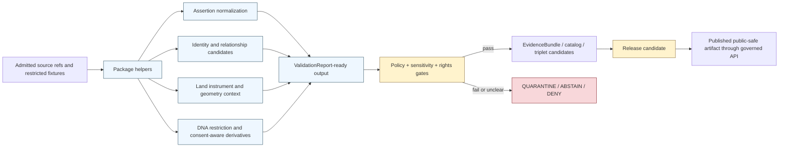
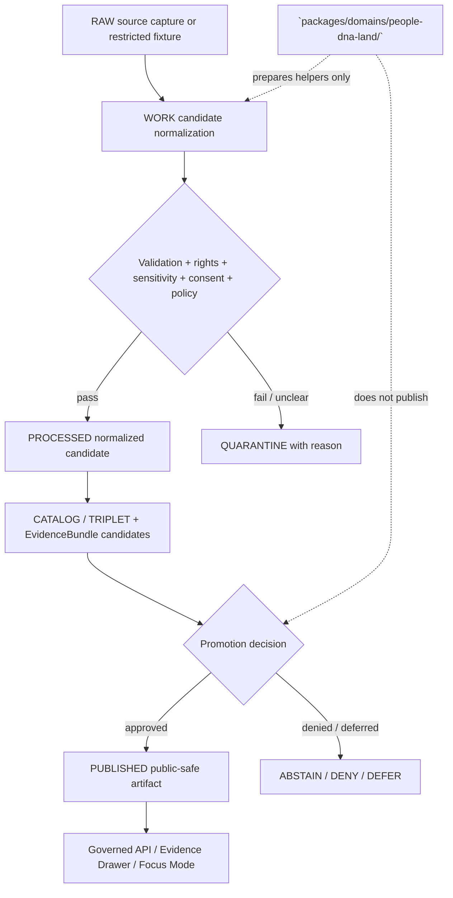

<!-- [KFM_META_BLOCK_V2]
doc_id: kfm://doc/NEEDS-VERIFICATION/packages-domains-people-dna-land-readme
title: People / DNA / Land Domain Package README
type: standard
version: v1
status: draft
owners: OWNER_TBD
created: 2026-06-14
updated: 2026-06-14
policy_label: restricted-review
related: [docs/domains/people-dna-land/README.md, docs/domains/people/README.md, docs/domains/genealogy/README.md, docs/domains/land_ownership/README.md, docs/runbooks/people_dna_land_promotion_runbook.md, docs/runbooks/people_dna_land_quarantine_review_runbook.md, schemas/contracts/v1/domains/people-dna-land/, contracts/domains/people-dna-land/, policy/domains/people-dna-land/, data/registry/people_dna_land/, fixtures/domains/people-dna-land/, tests/domains/people-dna-land/]
tags: [kfm, people, genealogy, dna, land-ownership, packages, privacy, consent, evidence, source-roles, restricted]
notes: ["README-like package entrypoint for the People / DNA / Land domain package.", "Target path is user-requested and Directory Rules-compatible as a package/domain segment, but actual repo package layout remains NEEDS VERIFICATION until a mounted repo confirms package metadata, imports, tests, CI, policies, and steward review workflows.", "This package may contain shared implementation helpers only; it must not become a schema, contract, policy, source-registry, lifecycle-data, release, receipt, proof, title, DNA, living-person, or publication authority."]
[/KFM_META_BLOCK_V2] -->

# People / DNA / Land Domain Package

Shared implementation package for KFM helpers that keep person assertions, genealogy evidence, DNA-derived evidence, land records, title-sensitive claims, consent, privacy, source role, temporal scope, and release state separate.

<p>
  
  
  
  
  
  
  
</p>

> [!IMPORTANT]
> **Status:** PROPOSED package README  
> **Path:** `packages/domains/people-dna-land/README.md`  
> **Owning responsibility root:** `packages/`  
> **Domain lane:** `people-dna-land`  
> **Default posture:** DENY or restrict living-person, DNA, genomic, DNA-derived relationship, residential, culturally sensitive, title-sensitive, and rights-uncertain outputs unless evidence, consent, policy, review, and release state explicitly allow otherwise.  
> **Repo implementation depth:** NEEDS VERIFICATION — package metadata, package manager, imports, tests, schemas, policies, registries, CI workflows, API routes, UI bindings, emitted receipts, proof objects, consent/revocation enforcement, review records, and runtime behavior were not inspected in this file-generation pass.

## Quick links

- [Scope](#scope)
- [Repo fit](#repo-fit)
- [Accepted inputs](#accepted-inputs)
- [Exclusions](#exclusions)
- [Package responsibilities](#package-responsibilities)
- [Sensitive assertion rules](#sensitive-assertion-rules)
- [Source-role anti-collapse rules](#source-role-anti-collapse-rules)
- [People / DNA / Land lane map](#people--dna--land-lane-map)
- [Trust-boundary flow](#trust-boundary-flow)
- [Proposed directory map](#proposed-directory-map)
- [Finite outcomes](#finite-outcomes)
- [Validation and quality gates](#validation-and-quality-gates)
- [Development rules](#development-rules)
- [Definition of done](#definition-of-done)
- [Verification checklist](#verification-checklist)
- [Rollback](#rollback)

---

## Scope

`packages/domains/people-dna-land/` is the shared implementation package lane for helpers that support People, Genealogy, DNA, and Land Ownership processing inside KFM.

This package may contain reusable code that helps KFM normalize, classify, validate, compare, transform, redact, explain, and package sensitive assertion candidates for governed downstream systems. It does **not** own truth, identity authority, consent authority, source authority, policy, lifecycle state, public publication, release approval, steward review, title determination, legal advice, DNA interpretation, or AI answers.

The package may support these knowledge families:

- person assertions and person-canonical candidates, kept separate;
- name assertions, life events, residence events, migration events, family groups, and genealogy relationships;
- genealogy-source imports, including redacted or synthetic GEDCOM-style fixtures when rights and living-person flags are explicit;
- DNA match evidence, DNA segment references, relationship hypotheses, consent state, revocation state, vendor-origin caveats, and restricted/public derivative separation;
- land instruments, legal descriptions, grantor/grantee indexing, deed/mortgage/probate/tax/assessor context, chain-of-title candidates, chain gaps, and title-sensitive uncertainty;
- parcel, PLSS, subdivision, metes-and-bounds, plat, survey, and derived geometry references with explicit warnings that geometry is not title proof by itself;
- source-role classification for administrative, archival, family, vendor, court, tax, assessor, title, survey, tribal/cultural, cemetery, census, and user-supplied sources;
- rights, consent, privacy, review, restriction, and publication-surface preparation;
- EvidenceBundle-aware DTO preparation for Evidence Drawer, Focus Mode, governed API, and review-console payloads after policy and release controls.

```text
RAW -> WORK / QUARANTINE -> PROCESSED -> CATALOG / TRIPLET -> PUBLISHED
```

> [!WARNING]
> This package must not publish living-person, DNA/genomic, DNA-derived relationship, title-sensitive, residential, culturally sensitive, tribal/sovereignty-sensitive, private-landowner-sensitive, or rights-uncertain claims. It may prepare candidate objects and failure outcomes for governed review; publication requires evidence closure, policy approval, review state, release manifest, correction path, and rollback target.

## Repo fit

```text
packages/domains/people-dna-land/
```

This path is appropriate for shared implementation helpers because `packages/` owns reusable library code and `people-dna-land` is a domain segment inside that responsibility root.

| Relationship | Expected home | Boundary rule |
| --- | --- | --- |
| Shared package helpers | `packages/domains/people-dna-land/` | Owns reusable implementation code only. |
| Domain documentation | `docs/domains/people-dna-land/`, `docs/domains/people/`, `docs/domains/genealogy/`, `docs/domains/land_ownership/` | Explains domain purpose, stewardship, privacy posture, source roles, consent, evidence, and publication limits. |
| Runbooks | `docs/runbooks/people_dna_land_*.md` | Owns promotion, quarantine review, consent/revocation, and rollback procedures. |
| ADRs | `docs/adr/ADR-people-dna-land-*.md` | Records schema-home, consent/revocation, source-role, public-safe geometry, and living-person policy decisions. |
| Semantic contracts | `contracts/domains/people-dna-land/` or repo-confirmed contract home | Defines object meaning; package code references, not redefines. |
| Machine schemas | `schemas/contracts/v1/domains/people-dna-land/` or repo-confirmed schema home | Defines machine-checkable shape; package code validates against it. |
| Source / rights / sensitivity registries | `data/registry/people_dna_land/` or repo-confirmed registry home | Owns source identity, rights, consent requirements, sensitivity defaults, dataset versions, and publication surfaces. |
| Policy | `policy/domains/people-dna-land/`, `policy/sensitivity/`, `policy/rights/`, `policy/access/` | Decides allow / deny / restrict / abstain, living-person, DNA, consent, revocation, public-safe geometry, title-sensitive, and publication rules. |
| Lifecycle data | `data/raw/people-dna-land/`, `data/work/people-dna-land/`, `data/quarantine/people-dna-land/`, `data/processed/people-dna-land/`, `data/catalog/.../people-dna-land/`, `data/published/.../people-dna-land/` | Stores evidence-bearing and released artifacts by lifecycle phase. |
| Receipts and proofs | `data/receipts/people-dna-land/`, `data/proofs/people-dna-land/`, or repo-confirmed trust-object homes | Stores process memory and release-significant proof artifacts. |
| Release decisions and rollback | `release/` | Owns release manifests, promotion decisions, correction notices, withdrawal notices, supersession records, signatures, and rollback targets. |
| Pipelines and source activation | `pipelines/domains/people-dna-land/`, `pipeline_specs/people-dna-land/`, `connectors/` | Owns executable flows, declarative pipeline config, and source-specific fetch/admission code. |
| Tests and fixtures | `tests/domains/people-dna-land/`, `fixtures/domains/people-dna-land/`, or repo-confirmed equivalents | Proves behavior with deterministic no-network synthetic/redacted fixtures. |

> [!CAUTION]
> This package must not become a parallel home for schemas, contracts, policies, source descriptors, consent records, lifecycle data, EvidenceBundles, receipts, proofs, release decisions, rollback cards, or correction notices. If a helper starts owning those responsibilities, split it into the correct root and record the migration.

## Accepted inputs

Package functions should accept explicit, inspectable values from governed callers. Inputs should carry source, evidence, temporal, spatial, rights, sensitivity, consent, review, release, and run context instead of relying on ambient global state.

| Input family | Accepted examples | Required handling |
| --- | --- | --- |
| Source descriptors | `source_id`, source role, rights profile, caveat text, authority limit, activation state, cadence, steward, citation template | Treat source role as a hard boundary; do not infer legal/title/identity authority from convenient source fields. |
| Person assertion candidates | names, aliases, birth/death/marriage/residence events, migration events, census/court/cemetery/archival references | Preserve assertion form; do not silently merge into canonical person truth. |
| Genealogy relationship candidates | parent/child, spouse, sibling, household, family-group, ancestor/descendant hypotheses | Preserve confidence, evidence support, conflict state, and hypothesis label. |
| DNA-derived evidence | match evidence refs, segment refs, vendor-origin caveats, derived relationship hypothesis, consent state, revocation state | Restrict by default; never log raw kit/vendor IDs or segment values in package output. |
| Land record candidates | deeds, mortgages, probate records, tax/assessor context, legal descriptions, chain links, chain gaps, instrument dates | Preserve instrument role and time basis; do not convert assessor or parcel context into title truth. |
| Geometry context | parcel refs, PLSS, subdivision, metes/bounds, survey/plat refs, public-safe geometry profile | Keep legal description, parcel geometry, title boundary, and display geometry distinct. |
| Evidence context | EvidenceRef, EvidenceBundle reference, citation requirement, input digest, source descriptor ref | Preserve evidence closure requirements and return bounded outcomes when evidence is missing. |
| Sensitivity / access context | living-person risk, DNA/genomic derivation, consent, revocation, cultural/steward review, landowner/privacy class, public exposure class | Required before any public-safe derivative is emitted. |
| Temporal context | source time, observed time, valid time, retrieval time, event time, instrument date, recording date, review time, release time, correction time | Do not collapse these into one timestamp. |
| Run context | run ID, package version, actor/service ID, spec hash, input/output digests, timestamp | Emit receipt-ready metadata for the owning pipeline to persist. |

Missing source role, consent, evidence context, living-person status, DNA restriction state, rights state, title-sensitive context, geometry-role context, or release state should produce a finite failure outcome rather than a silent best-effort public output.

## Exclusions

| Do not put here | Correct home or owner | Why |
| --- | --- | --- |
| Real GEDCOM, DNA kit, DNA vendor, title, parcel, living-person, residential, or private-landowner data | `data/<phase>/people-dna-land/`, usually `raw/`, `work/`, or `quarantine/` with restricted access | Lifecycle and access controls must be auditable outside package source. |
| Live source fetchers, scrapers, credentials, vendor adapters, API keys, or source admission logic | `connectors/`, `pipelines/domains/people-dna-land/`, `pipeline_specs/people-dna-land/`, `configs/`, secret-management infrastructure | Source activation is governed and source-specific. |
| Consent records or revocation authority | `data/registry/people_dna_land/`, `policy/access/`, review-console records, or repo-confirmed consent authority | Consent and revocation are governance state, not library defaults. |
| Source descriptors, rights/cadence/sensitivity registers | `data/registry/people_dna_land/` or repo-confirmed registry home | Source authority and rights are governance data. |
| Semantic contracts | `contracts/domains/people-dna-land/` or repo-confirmed contract home | Contracts define meaning. |
| JSON Schemas | `schemas/contracts/v1/domains/people-dna-land/` or repo-confirmed schema home | Schemas define machine shape. |
| Policy rules | `policy/domains/people-dna-land/`, `policy/sensitivity/`, `policy/rights/`, `policy/access/` | Policy owns allow/deny/restrict/abstain decisions. |
| Proofs, receipts, EvidenceBundle stores, catalog matrices | `data/proofs/`, `data/receipts/`, `data/catalog/` | Trust objects must remain independently addressable. |
| Release manifests, promotion decisions, correction notices, rollback cards | `release/` | Publication is a governed state transition, not a package side effect. |
| Public API routes, UI components, MapLibre styles, Focus Mode answer surfaces | `apps/`, `ui/`, `web/`, or repo-confirmed equivalents | Package code may prepare DTOs but does not own public interfaces. |
| Legal title determinations, legal advice, medical/health interpretations, or forensic DNA conclusions | External authorized professionals and steward-approved policy surfaces, not package code | KFM can carry evidence-bound historical/contextual assertions; it is not a legal, medical, or forensic authority. |
| AI prompts or generated relationship/title explanations as truth | Governed AI runtime and AIReceipt surfaces | Generated language is interpretive and evidence-subordinate. |

## Package responsibilities

The package should be conservative, deterministic, evidence-aware, privacy-aware, and easy to test.

| Responsibility | Expected behavior |
| --- | --- |
| Normalize assertions | Convert source-native person, genealogy, DNA, and land fields into typed candidates without deleting raw values, caveats, source role, or uncertainty. |
| Preserve assertion-first modeling | Keep person assertions separate from canonical person records; keep relationship hypotheses separate from confirmed relationships. |
| Preserve source roles | Keep archival, family, census, court, cemetery, tax, assessor, title, survey, vendor, user-upload, tribal/cultural, and model-derived material distinct. |
| Resolve identity cautiously | Generate deterministic candidate IDs from source ID, object role, temporal scope, and normalized digest; do not collapse identities across weak evidence. |
| Apply privacy-preserving transforms | Produce redacted/public-safe DTOs only when policy inputs authorize the transformation and the transform receipt can be emitted by the pipeline. |
| Respect consent and revocation | Treat consent and revocation as explicit governance state; never infer consent from availability. |
| Keep title-sensitive facts bounded | Treat assessor/tax records as administrative context; treat parcel geometry as spatial context; treat title assertions as evidence-bound instrument/chain claims only. |
| Preserve temporal semantics | Keep event, source, valid, retrieval, recording, review, release, correction, and revocation times distinct. |
| Prepare Evidence Drawer payload fragments | Emit evidence-aware fragments for governed API/UI callers, not final public answers. |
| Emit finite outcomes | Return `ANSWER`, `ABSTAIN`, `DENY`, or `ERROR` with reason codes rather than unbounded exceptions or silent fallback. |

## Sensitive assertion rules

These rules are package-level guardrails. Actual allow/deny/restrict/abstain decisions belong to policy and release authorities.

| Assertion class | Default package posture | Required before public-safe output |
| --- | --- | --- |
| Living-person assertions | DENY or RESTRICT | Living-person policy, access authorization, review state, release state, redaction/public exposure class. |
| DNA/genomic or DNA-derived relationship assertions | DENY or RESTRICT | Consent, revocation check, DNA policy, source/vendor caveats, evidence support, review state, restricted/public derivative split. |
| Raw DNA kit/vendor/segment data | DENY | Do not expose publicly; do not log raw sensitive IDs or segment values. |
| Relationship hypotheses | ABSTAIN or RESTRICT unless evidence support is sufficient | EvidenceBundle, confidence class, contradiction state, review burden, release decision. |
| Land ownership/title claims | ABSTAIN unless instrument and chain evidence support the claim | Source role, chain-of-title support, legal-description notes, uncertainty/gap state, review and release state. |
| Assessor/tax/parcel context | CONTEXT only | Explicit warning that administrative/geometry context is not title truth. |
| Residential/private-landowner-sensitive joins | DENY or RESTRICT | Rights, privacy, steward review, public-safe geometry, and release-state controls. |
| Culturally sensitive / sovereignty-related assertions | DENY or RESTRICT | Steward/tribal/cultural review and access policy. |

## Source-role anti-collapse rules

People / DNA / Land has high anti-collapse risk because several sources look authoritative while supporting different kinds of claims.

| Source family | May support | Must not be silently treated as |
| --- | --- | --- |
| Census / vital / court / archival records | Evidence for person assertions, events, households, residence, names, dates, places | Final identity truth or unrestricted public release. |
| Family trees / user uploads | Candidate assertions, clues, lineage hypotheses | Independent proof without source evidence and review. |
| DNA vendor exports or match evidence | Restricted evidence for DNA-derived hypotheses where consent/policy allow | Public identity, public relationship truth, or raw segment publication. |
| Cemetery / obituary / memorial records | Historical event/context evidence | Living-person status proof without additional checks. |
| Assessor / tax rolls | Administrative context, parcel/tax-account context, temporal public-record observation | Title truth or legal ownership boundary proof. |
| Deeds / mortgages / probate / land instruments | Instrument evidence and chain candidates | Complete title chain without gap analysis and review. |
| Parcel geometry / PLSS / plats / surveys | Spatial context, legal-description helper, display/reference geometry | Title boundary proof by itself. |
| Model-derived identity / relationship / geocoding | Candidate derivative requiring evidence and policy checks | Sovereign truth or publishable claim. |

## People / DNA / Land lane map



## Trust-boundary flow



## Proposed directory map

> [!NOTE]
> This map is PROPOSED until the live repo package layout, package manager, test runner, and imports are verified.

```text
packages/domains/people-dna-land/
├── README.md
├── pyproject.toml                 # PROPOSED if this is a Python package; NEEDS VERIFICATION
├── package.json                   # PROPOSED only if JS/TS helpers are needed; NEEDS VERIFICATION
├── src/
│   └── people_dna_land/
│       ├── __init__.py
│       ├── assertions.py
│       ├── identity.py
│       ├── relationships.py
│       ├── consent.py
│       ├── dna_restrictions.py
│       ├── land_instruments.py
│       ├── legal_descriptions.py
│       ├── geometry_context.py
│       ├── redaction.py
│       ├── evidence_payloads.py
│       └── outcomes.py
├── fixtures/
│   └── README.md                  # Synthetic/redacted package-local fixtures only, if repo convention allows
└── tests/
    └── README.md                  # Package-local tests only, if repo convention allows
```

If repo convention centralizes all tests and fixtures under root `tests/` and `fixtures/`, keep only package code here and place test material in the canonical roots.

## Finite outcomes

All public-significant helper functions should return bounded outcomes through typed result objects.

| Outcome | Meaning in this package | Typical reason codes |
| --- | --- | --- |
| `ANSWER` | Helper produced a candidate or public-safe derivative allowed by provided policy/release context. | `evidence_closed`, `policy_pass`, `release_state_present`, `public_safe_derivative` |
| `ABSTAIN` | Helper cannot make or prepare the requested assertion because evidence is insufficient or ambiguous. | `missing_evidence`, `identity_conflict`, `chain_gap`, `relationship_hypothesis_unresolved`, `stale_source` |
| `DENY` | Helper must not produce requested output under provided rights, privacy, consent, DNA, living-person, title-sensitive, cultural, or release state. | `living_person_restricted`, `dna_restricted`, `consent_missing`, `revoked`, `rights_unknown`, `title_claim_unsupported`, `restricted_geometry`, `release_missing` |
| `ERROR` | Helper or caller input failed validation or execution. | `schema_invalid`, `missing_required_context`, `unsupported_source_role`, `digest_mismatch`, `unexpected_exception` |

## Validation and quality gates

| Gate | Required check | Expected proof |
| --- | --- | --- |
| Source role | Every candidate records source family, role, authority limit, and caveat. | Source-role fixture tests. |
| Evidence closure | Public-significant candidates point to EvidenceRef / EvidenceBundle context. | Evidence fixture tests and validation reports. |
| Living-person restriction | Living-person risk blocks or restricts public outputs. | DENY / RESTRICT tests. |
| DNA restriction | DNA/genomic and DNA-derived outputs require consent and restricted/public split. | DNA consent, no-log, and revocation tests. |
| Land/title caution | Assessor/tax/parcel context cannot become title truth. | Assessor-as-title denial tests. |
| Chain gap handling | Title/ownership claims surface missing instruments or chain gaps. | Chain-of-title gap tests. |
| Geometry boundary | Legal description, parcel geometry, and public display geometry remain distinct. | Geometry-role boundary tests. |
| Rights and consent | Unknown rights, no assertion, missing consent, or revoked consent blocks promotion-sensitive outputs. | Policy result fixtures. |
| Logging safety | No raw DNA kit/vendor IDs, raw segment values, living-person private data, or restricted identifiers appear in logs. | Log-scrub tests. |
| Release readiness | Candidate publication needs validation, policy, review, EvidenceBundle, ReleaseManifest, correction path, and rollback target. | Release-candidate fixture tests. |

## Development rules

- Keep helpers deterministic and side-effect-light.
- Prefer pure functions that accept explicit context objects.
- Do not fetch live sources from package helpers.
- Do not read or write lifecycle directories directly unless the package contract explicitly authorizes a narrowly scoped helper and tests prove the boundary.
- Do not log raw sensitive identifiers, DNA segment values, kit IDs, vendor IDs, private addresses, unredacted living-person assertions, or title-sensitive restricted data.
- Preserve source-native values alongside normalized values when the caller provides them.
- Preserve uncertainty and conflict instead of overwriting it.
- Return finite outcomes with reason codes instead of guessing.
- Keep examples synthetic or redacted.
- Treat generated summaries as candidate explanations, never proof.

## Definition of done

A change in this package is not done until it can answer these questions:

- [ ] Does every public-significant output preserve EvidenceRef / EvidenceBundle closure requirements?
- [ ] Does the helper keep person assertions separate from canonical person records?
- [ ] Does the helper deny or restrict living-person and DNA-derived outputs by default?
- [ ] Does the helper respect consent and revocation context?
- [ ] Does the helper prevent assessor/tax/parcel context from becoming title truth?
- [ ] Does the helper preserve legal-description, parcel geometry, display geometry, and title-boundary distinctions?
- [ ] Does the helper emit reason-coded `ANSWER`, `ABSTAIN`, `DENY`, or `ERROR` outcomes?
- [ ] Do fixtures include at least one synthetic historical assertion, one living-person denial, one DNA-derived denial, one revocation path, one chain-gap case, and one assessor-as-title denial?
- [ ] Are schemas, contracts, policies, registries, fixtures, tests, receipts, proofs, releases, and lifecycle data kept out of package authority unless repo convention explicitly permits a package-local test helper?
- [ ] Is rollback or removal safe if the helper is wrong?

## Verification checklist

- [ ] Confirm `packages/domains/people-dna-land/` exists in the mounted repo or create it in a PR that cites Directory Rules.
- [ ] Confirm whether the repo standard uses `people-dna-land`, `people_dna_land`, or split `people/`, `genealogy/`, and `land_ownership/` package names.
- [ ] Confirm package manager and language conventions.
- [ ] Confirm adjacent package READMEs and root `packages/README.md` linking convention.
- [ ] Confirm schema home: `schemas/contracts/v1/domains/people-dna-land/` versus another accepted ADR path.
- [ ] Confirm contracts home and semantic object names.
- [ ] Confirm source registry home for people, genealogy, DNA, land records, rights, consent, and sensitivity defaults.
- [ ] Confirm policy engine and outcome vocabulary for living-person, DNA, consent, revocation, title-sensitive, and public-safe geometry rules.
- [ ] Confirm review roles for privacy, steward, cultural/tribal, legal/title-sensitive, and release decisions.
- [ ] Confirm UI/API restricted-field no-leak behavior.
- [ ] Confirm no public path bypasses governed APIs, released artifacts, EvidenceBundle resolution, policy decisions, and release state.
- [ ] Confirm rollback target and correction path for every release-facing helper.

## Rollback

Rollback is required when a package change weakens source-role separation, logs restricted data, exposes living-person or DNA-derived assertions, treats assessor/tax/parcel context as title truth, collapses legal-description and geometry roles, bypasses policy/review/release gates, or emits unsupported public-facing claims.

Rollback target: `ROLLBACK_TARGET_TBD_AFTER_REPO_INSPECTION`

Recommended rollback actions:

1. Revert the package change with `git revert` or equivalent PR workflow.
2. Mark affected outputs as withdrawn or superseded if any release-facing artifact used the helper.
3. Open or update a correction notice when public/semi-public output was affected.
4. Add a regression fixture for the failed assertion class.
5. Update the verification backlog or drift register if the failure came from placement, schema-home, or authority-boundary ambiguity.

---

<details>
<summary>Maintainer notes: evidence boundary and open questions</summary>

### Evidence boundary

This README is doctrine-grounded and path-specific, but it is not implementation proof. The live repo package metadata, imports, tests, CI, policy bundles, source registries, review records, release manifests, and emitted proof objects remain NEEDS VERIFICATION in this file-generation pass.

### Open questions

- Should implementation use `people-dna-land` as the package folder and `people_dna_land` as the import namespace?
- Should People, Genealogy/DNA, and Land Ownership remain one package or split into subpackages with a shared sensitive-assertion kernel?
- What policy engine and result-envelope library own finite outcomes in the live repo?
- What constitutes adequate living-person determination for public output?
- What consent model and revocation cleanup semantics are accepted?
- Which source families are admissible only as restricted evidence?
- Which land record sources may support chain-of-title candidates, and which are administrative context only?
- Which reviewers must approve title-sensitive, DNA-derived, cultural, or living-person releases?

</details>
