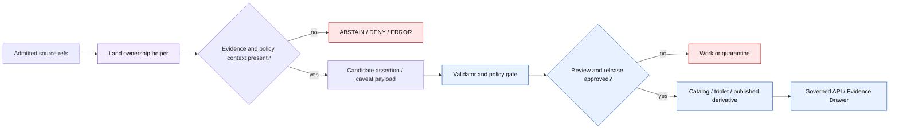

<!-- [KFM_META_BLOCK_V2]
doc_id: kfm://doc/NEEDS-VERIFICATION/packages-domains-people-dna-land-land-ownership-readme
title: People / DNA / Land — Land Ownership Package README
type: standard
version: v1
status: draft
owners: OWNER_TBD
created: 2026-06-14
updated: 2026-06-14
policy_label: restricted-review
related: [packages/domains/people-dna-land/README.md, packages/domains/people-dna-land/src/README.md, packages/domains/people-dna-land/src/people_dna_land/README.md, docs/domains/people-dna-land/README.md, docs/domains/land_ownership/README.md, schemas/contracts/v1/domains/people-dna-land/, contracts/domains/people-dna-land/, policy/domains/people-dna-land/, data/registry/people_dna_land/, release/]
tags: [kfm, people-dna-land, land-ownership, title-sensitive, parcels, plss, evidence, privacy, packages]
notes: ["README-like package-component guide for land-ownership helpers inside the People / DNA / Land domain package.", "The user requested this exact path; placement is compatible with Directory Rules as a domain/component segment under packages, but live repo package metadata, imports, tests, policies, schemas, release objects, and steward review state remain NEEDS VERIFICATION.", "This component must not become a title authority, parcel authority, assessor authority, source registry, schema, policy, lifecycle-data, proof, receipt, release, or publication authority."]
[/KFM_META_BLOCK_V2] -->

# Land Ownership Helpers

Shared implementation helpers for land-record, parcel-context, legal-description, chain-of-title-candidate, and title-sensitive assertion work inside the KFM People / DNA / Land package.

<p>
  
  
  
  
  
  
  
</p>

> [!IMPORTANT]
> **Status:** PROPOSED component README  
> **Path:** `packages/domains/people-dna-land/land-ownership/README.md`  
> **Owning responsibility root:** `packages/`  
> **Parent domain lane:** `people-dna-land`  
> **Default posture:** ABSTAIN or DENY when land-record, parcel, legal-description, assessor, tax, genealogy, living-person, residential, title-sensitive, rights-uncertain, or culturally sensitive support is insufficient.  
> **Implementation depth:** NEEDS VERIFICATION — package metadata, import paths, tests, fixtures, source registries, schemas, policy, release gates, emitted receipts, proof objects, and runtime behavior were not inspected in this file-generation pass.

## Quick links

- [Scope](#scope)
- [Repo fit](#repo-fit)
- [Accepted inputs](#accepted-inputs)
- [Exclusions](#exclusions)
- [Land-record anti-collapse rules](#land-record-anti-collapse-rules)
- [Component responsibilities](#component-responsibilities)
- [Trust-boundary flow](#trust-boundary-flow)
- [Proposed layout](#proposed-layout)
- [Finite outcomes](#finite-outcomes)
- [Validation and quality gates](#validation-and-quality-gates)
- [Definition of done](#definition-of-done)
- [Verification checklist](#verification-checklist)
- [Rollback](#rollback)

---

## Scope

`packages/domains/people-dna-land/land-ownership/` is a package-component lane for implementation helpers that support land-ownership interpretation without turning package code into legal, title, evidence, policy, or publication authority.

This component may help normalize or compare candidate land-ownership support such as:

- land instrument references;
- grantor / grantee name strings;
- recording book/page or instrument identifiers;
- recording, execution, effective, retrieval, review, correction, and release dates;
- legal descriptions;
- PLSS references;
- parcel identifiers and parcel-context refs;
- assessor or tax-roll context;
- probate, court, mortgage, deed, patent, plat, survey, reservation, allotment, easement, railroad, road, right-of-way, mineral, water-right, or lease hints;
- chain-of-title candidate events and chain gaps;
- title-sensitive uncertainty, caveats, and public-safe explanation payload fragments.

It must keep these concepts separate:

```text
land instrument evidence
  != assessor/tax administration
  != parcel geometry
  != title boundary proof
  != ownership truth
  != public release approval
```

> [!WARNING]
> This package component does **not** determine ownership, legal title, title marketability, boundary truth, heirs, mineral rights, water rights, easements, liens, encumbrances, or legal conclusions. It prepares evidence-aware candidate structures for governed KFM review surfaces.

## Repo fit

```text
packages/domains/people-dna-land/land-ownership/
```

This path is appropriate only for shared implementation helpers. It is not a new authority root.

| Relationship | Expected home | Boundary rule |
| --- | --- | --- |
| Component README and helper code notes | `packages/domains/people-dna-land/land-ownership/` | May describe package helper behavior and component boundaries. |
| Importable Python code, if used | `packages/domains/people-dna-land/src/people_dna_land/land_ownership/` | Use underscore module names for Python imports; verify package metadata first. |
| Package-wide orientation | [`../README.md`](../README.md) | Parent package rules remain controlling. |
| Source tree orientation | [`../src/README.md`](../src/README.md) | Source-code boundary and import rules. |
| Import namespace orientation | [`../src/people_dna_land/README.md`](../src/people_dna_land/README.md) | Package namespace rules. |
| Domain documentation | `docs/domains/people-dna-land/`, `docs/domains/land_ownership/` | Explains stewardship and domain doctrine. |
| Semantic contracts | `contracts/domains/people-dna-land/` or repo-confirmed home | Defines meaning; package code must reference, not redefine. |
| Machine schemas | `schemas/contracts/v1/domains/people-dna-land/` or repo-confirmed home | Defines shape; this component must not duplicate schemas. |
| Policy | `policy/domains/people-dna-land/`, `policy/sensitivity/`, `policy/rights/`, `policy/access/` | Decides allow / deny / restrict / abstain. |
| Source / rights / sensitivity registries | `data/registry/people_dna_land/` or repo-confirmed home | Owns source identity, rights, sensitivity, source role, and activation status. |
| Lifecycle data | `data/<phase>/people-dna-land/` | Stores raw, work, quarantine, processed, catalog, triplet, published, receipt, proof, registry, and rollback objects by lifecycle phase. |
| Release and rollback | `release/` | Owns ReleaseManifest, PromotionDecision, CorrectionNotice, WithdrawalNotice, and rollback chains. |
| Tests and fixtures | `tests/domains/people-dna-land/`, `fixtures/domains/people-dna-land/` | Proves behavior with no-network synthetic or redacted examples. |

> [!CAUTION]
> If this component needs to define an object shape, policy rule, source descriptor, release decision, proof, receipt, or lifecycle artifact, that work belongs in the owning responsibility root, not in this package component.

## Accepted inputs

Land-ownership helpers should accept explicit, caller-provided candidate data. They should not fetch, infer rights, determine title, or silently resolve ambiguity.

| Input family | Accepted examples | Required handling |
| --- | --- | --- |
| Source context | Source ID, source descriptor ref, rights ref, source-role hint, retrieval ref | Preserve source role and authority limits; do not infer rights. |
| Instrument context | Instrument type, book/page, instrument number, county recorder ref, patent ref, deed ref, probate ref, mortgage ref, plat ref, survey ref | Treat as evidence candidates, not final ownership truth. |
| Party strings | Grantor, grantee, claimant, heir, executor, trustee, owner-of-record string, assessor name string | Keep as assertions; do not collapse to canonical person or entity without evidence. |
| Time values | Execution date, recording date, effective date, tax year, assessor year, survey date, retrieval date, review date | Preserve temporal role; do not merge distinct dates. |
| Geometry refs | Parcel ref, PLSS ref, legal-description geometry ref, survey ref, generalized public geometry ref | Preserve geometry role and uncertainty; parcel geometry is not title proof. |
| Legal descriptions | PLSS text, lot/block, subdivision, metes-and-bounds text, acreage text, aliquot part strings | Normalize cautiously; keep original text and parse confidence. |
| Evidence refs | EvidenceRef, EvidenceBundle ref, citation target ref, review ref, correction ref | Do not treat unresolved EvidenceRef as evidence. |
| Policy/release context | Sensitivity label, restriction label, policy decision ref, release ref, rollback ref | Public-safe outputs require caller-provided allow/restrict state. |

## Exclusions

Do **not** put these in this component:

| Excluded content | Correct home |
| --- | --- |
| Legal/title determinations | Outside KFM package code; KFM may store evidence-bound assertions only. |
| Semantic contracts | `contracts/domains/people-dna-land/` or repo-confirmed contract home |
| JSON Schema / machine schemas | `schemas/contracts/v1/domains/people-dna-land/` or repo-confirmed schema home |
| Policy rules | `policy/domains/people-dna-land/` or repo-confirmed policy home |
| Source descriptors and rights registers | `data/registry/people_dna_land/` or repo-confirmed registry home |
| Raw deeds, tax rolls, assessor data, parcel downloads, probate records, survey files | `data/raw/people-dna-land/` or source-specific governed lifecycle home |
| Work/quarantine/processed data | `data/work/people-dna-land/`, `data/quarantine/people-dna-land/`, `data/processed/people-dna-land/` |
| EvidenceBundle, catalog, triplet, proof, receipt, release, correction, or rollback objects | `data/catalog/`, `data/triplets/`, `data/proofs/`, `data/receipts/`, `release/`, or repo-confirmed trust-object homes |
| Public API routes or UI components | `apps/`, `packages/ui/`, `packages/maplibre/`, or repo-confirmed homes |
| Live source fetchers | `connectors/` or `pipelines/` depending responsibility |
| Tests and fixtures | `tests/domains/people-dna-land/`, `fixtures/domains/people-dna-land/` |

## Land-record anti-collapse rules

Land-ownership data is especially easy to overstate. This component must preserve anti-collapse boundaries.

| Do not collapse | Why it matters | Safe behavior |
| --- | --- | --- |
| Assessor/tax row → ownership truth | Assessor and tax records are administrative context, not title proof by themselves. | Return administrative context with source role and year. |
| Parcel geometry → title boundary | Parcel geometry may be approximate, administrative, stale, or non-title. | Carry geometry role, version, precision, source, and caveat. |
| Name string → person/entity identity | Grantor/grantee and owner strings can be ambiguous, misspelled, historical, or incomplete. | Build assertion candidates with evidence refs and match confidence. |
| Deed reference → complete chain of title | A single instrument does not prove uninterrupted chain or current title. | Build chain candidate and gap indicators. |
| Probate/court clue → heirship truth | Court/probate context can be partial, restricted, or misread. | Preserve source type, scope, and review requirement. |
| Legal-description parse → legal conclusion | Parsers can lose clauses, exceptions, reservations, or survey-specific meaning. | Retain original text and parse confidence. |
| Public parcel layer → public-safe release | Public data can still be sensitive in combined context. | Require policy decision and release state. |

## Component responsibilities

| Responsibility | Expected behavior | Failure posture |
| --- | --- | --- |
| Normalize land-event candidates | Convert caller-provided values into stable package-internal candidate forms | `ERROR` for malformed input; `ABSTAIN` for unsupported inference |
| Preserve instrument semantics | Keep instrument type, source role, recording context, and date role distinct | `ABSTAIN` when role or date semantics are ambiguous |
| Parse legal descriptions cautiously | Return structured parse candidates while retaining original text and confidence | `ABSTAIN` when parse confidence is insufficient |
| Build chain candidates | Link evidence-bound land events into candidate chains without claiming completeness | `ABSTAIN` for chain gaps; `DENY` for public claim if support is insufficient |
| Flag title-sensitive uncertainty | Produce caveats for review and Evidence Drawer payloads | `DENY` when uncertainty would be hidden in public output |
| Prepare public-safe summaries | Remove or generalize sensitive detail only after caller-provided policy/release context | `DENY` when release state is missing or blocked |
| Support correction and rollback | Preserve stable refs, transformation reasons, and caveat history | `ERROR` when output cannot be traced back to inputs |

## Trust-boundary flow



## Proposed layout

```text
packages/domains/people-dna-land/land-ownership/
└── README.md              # this component guide
```

Potential future implementation should usually live under the import namespace instead:

```text
packages/domains/people-dna-land/src/people_dna_land/land_ownership/
├── __init__.py            # PROPOSED after package metadata verification
├── normalizers.py         # PROPOSED: land-event candidate normalization
├── legal_description.py   # PROPOSED: cautious parsing helpers
├── chain.py               # PROPOSED: chain candidate helpers
├── caveats.py             # PROPOSED: title-sensitive caveat builders
└── public_safe.py         # PROPOSED: public-safe derivative helpers
```

> [!NOTE]
> The future module list is illustrative and **PROPOSED**. Do not create importable code until package metadata, test runner, lint rules, and repo conventions are verified.

## Finite outcomes

All helper results should be compatible with finite KFM outcomes.

| Outcome | Use when |
| --- | --- |
| `ALLOW` | Caller-provided evidence, policy, review, release, and sensitivity state permit the requested derivative. |
| `RESTRICT` | The result may be retained for steward, private, or limited-access review but not ordinary public release. |
| `DENY` | Output would overstate title, expose sensitive details, bypass release state, or lack consent/policy support. |
| `ABSTAIN` | Evidence, source role, date semantics, geometry role, chain completeness, or parse confidence is insufficient. |
| `ERROR` | Input is malformed, required references are missing, or traceability cannot be preserved. |

## Validation and quality gates

Before this component is treated as active implementation, add tests and fixtures that prove:

- [ ] assessor/tax rows are never converted into title truth;
- [ ] parcel geometry is never converted into title boundary proof;
- [ ] legal-description parser outputs retain original text and confidence;
- [ ] distinct date roles remain distinct;
- [ ] person/name strings remain assertions until identity support is explicit;
- [ ] chain candidates expose gaps and uncertainty;
- [ ] public-safe summaries require policy and release context;
- [ ] missing evidence returns `ABSTAIN`, `DENY`, or `ERROR` rather than a softened claim;
- [ ] every output preserves source refs and rollback-relevant transformation reasons;
- [ ] no tests require live network access or real sensitive records.

## Development rules

- Prefer pure, deterministic helpers with explicit inputs and outputs.
- Preserve original source strings alongside normalized values where loss would matter.
- Never log raw sensitive land, person, residential, title, DNA, or living-person content.
- Never hide caveats for chain gaps, source-role ambiguity, parse uncertainty, geometry limits, or rights uncertainty.
- Treat all public-ready outputs as downstream derivatives that require policy, review, release, and rollback support.
- Keep package code small enough for fixture-driven tests and steward review.

## Definition of done

This component is not done when the README exists. It is done only when:

- [ ] owners are confirmed;
- [ ] package metadata and import path are verified;
- [ ] contracts and schemas exist in their proper authority roots;
- [ ] source-role, rights, sensitivity, and title-caveat policy gates exist;
- [ ] fixture coverage includes valid, invalid, restricted, ambiguous, stale, and corrected cases;
- [ ] tests prove anti-collapse behavior;
- [ ] public-safe derivatives require EvidenceBundle, policy, review, release, correction, and rollback context;
- [ ] docs and runbooks link back to this component without making it an authority root.

## Verification checklist

- [ ] Confirm `packages/domains/people-dna-land/land-ownership/` exists in the live repo or create it in a PR.
- [ ] Confirm whether this directory should remain a component-doc lane or move implementation under `src/people_dna_land/land_ownership/`.
- [ ] Confirm owners and reviewers.
- [ ] Confirm package manager, lint, typing, and test conventions.
- [ ] Confirm schema home and contract home.
- [ ] Confirm policy homes for land/title/parcel/person/privacy decisions.
- [ ] Confirm source registries for recorder, assessor, tax, survey, PLSS, patent, probate, and parcel-context sources.
- [ ] Confirm no public path bypasses governed API, EvidenceBundle resolution, policy decision, release manifest, correction path, or rollback target.

## Rollback

Rollback is required if this component begins acting as title authority, source authority, schema authority, policy authority, release authority, or publication authority.

Rollback target: `ROLLBACK_TARGET_TBD_AFTER_REPO_INSPECTION`

Safe rollback actions:

1. Revert component README or code change.
2. Remove any imports from downstream packages or apps.
3. Mark dependent tests and fixtures as superseded or quarantined.
4. Move misplaced schemas, policy, source descriptors, receipts, proofs, lifecycle artifacts, or release records back to their owning roots.
5. Add a drift entry and correction note if any public-facing documentation overstated this component's authority.

## Evidence boundary

This README is doctrine-grounded and repo-useful, but it does not prove implementation. Current package metadata, import paths, tests, schemas, policies, source registries, release behavior, runtime behavior, dashboards, branch protections, and emitted proof objects remain **NEEDS VERIFICATION** until checked in the live repository.

