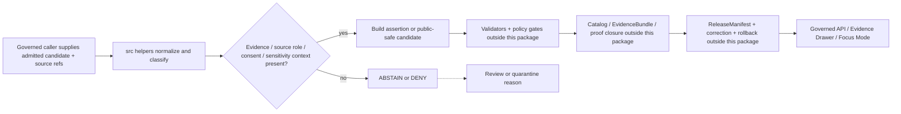

<!-- [KFM_META_BLOCK_V2]
doc_id: kfm://doc/NEEDS-VERIFICATION/packages-domains-people-dna-land-src-readme
title: People / DNA / Land Source Tree README
type: standard
version: v1
status: draft
owners: OWNER_TBD
created: 2026-06-14
updated: 2026-06-14
policy_label: restricted-review
related: [packages/domains/people-dna-land/README.md, packages/domains/people-dna-land/src/people_dna_land/README.md, docs/domains/people-dna-land/README.md, docs/domains/people/README.md, docs/domains/genealogy/README.md, docs/domains/land_ownership/README.md, schemas/contracts/v1/people_dna_land/, contracts/domains/people-dna-land/, policy/people/, policy/genealogy/, policy/land_ownership/, data/registry/people_dna_land/, fixtures/domains/people-dna-land/, tests/domains/people-dna-land/]
tags: [kfm, people-dna-land, src, packages, python, privacy, consent, genealogy, dna, land-ownership, assertions, evidence]
notes: ["README-like source-tree entrypoint for the People / DNA / Land package.", "Target path is user-requested and Directory Rules-compatible as source code under the packages responsibility root, but package metadata, import style, test runner, schema references, policy bindings, consent enforcement, review workflows, and runtime behavior remain NEEDS VERIFICATION until a mounted repo confirms them.", "This directory may contain implementation source only; it must not become a schema, contract, policy, source-registry, consent, lifecycle-data, EvidenceBundle, release, receipt, proof, title, DNA, or publication authority."]
[/KFM_META_BLOCK_V2] -->

# People / DNA / Land Source Tree

Source-code staging area for the People / Genealogy / DNA / Land package, keeping sensitive assertion helpers under the `packages/` responsibility root and away from policy, schema, source-registry, lifecycle-data, proof, receipt, and release authority.

<p>
  
  
  
  
  
  
  
</p>

> [!IMPORTANT]
> **Status:** PROPOSED source-tree README  
> **Path:** `packages/domains/people-dna-land/src/README.md`  
> **Owning responsibility root:** `packages/`  
> **Package lane:** `packages/domains/people-dna-land/`  
> **Primary import namespace:** `people_dna_land` — NEEDS VERIFICATION against package metadata  
> **Default posture:** DENY or restrict living-person, DNA/genomic, DNA-derived relationship, residential, title-sensitive, private-landowner-sensitive, culturally sensitive, and rights-uncertain outputs unless evidence, consent, policy, review, release state, correction path, and rollback target explicitly support exposure.  
> **Repo implementation depth:** NEEDS VERIFICATION — package metadata, import paths, tests, CI, schemas, policies, source registries, consent/revocation enforcement, emitted receipts, proof objects, and runtime behavior were not inspected in this file-generation pass.

## Quick links

- [Scope](#scope)
- [Repo fit](#repo-fit)
- [Accepted inputs](#accepted-inputs)
- [Exclusions](#exclusions)
- [Source-tree responsibilities](#source-tree-responsibilities)
- [Sensitive assertion posture](#sensitive-assertion-posture)
- [Proposed layout](#proposed-layout)
- [Trust-boundary flow](#trust-boundary-flow)
- [Finite outcomes](#finite-outcomes)
- [Testing posture](#testing-posture)
- [Development rules](#development-rules)
- [Definition of done](#definition-of-done)
- [Verification checklist](#verification-checklist)
- [Rollback](#rollback)

---

## Scope

`packages/domains/people-dna-land/src/` is the source-code home for the People / Genealogy / DNA / Land package lane.

This directory may contain importable implementation modules and package-internal helper code for:

- assertion-first person and genealogy normalization;
- DNA-derived evidence handling that preserves restriction, consent, revocation, and no-public-raw-data defaults;
- land-record and legal-description helper logic that does not convert assessor, tax, parcel, or geometry context into title truth;
- source-role classification and anti-collapse checks;
- temporal normalization that keeps source time, event time, valid time, recording time, retrieval time, review time, release time, correction time, and revocation time distinct where material;
- public-safe candidate preparation after governed callers provide policy, consent, sensitivity, review, and release context;
- deterministic, no-network functions that can be proven with fixtures and tests.

The source tree is implementation support only. It does not decide what is true, admissible, publishable, consented, source-authoritative, policy-allowed, legally title-bearing, or publicly released.

```text
RAW -> WORK / QUARANTINE -> PROCESSED -> CATALOG / TRIPLET -> PUBLISHED
```

> [!WARNING]
> This directory must not fetch live sensitive sources directly, store real DNA/genomic data, store living-person records, decide consent, publish claims, determine title, leak residential details, or expose internal EvidenceBundles. It prepares deterministic helper behavior for the proper KFM authorities to validate, review, restrict, publish, correct, or roll back.

## Repo fit

| Concern | This source tree owns | It must not own |
| --- | --- | --- |
| Responsibility root | Package source under `packages/` | Root-level domain authority or lifecycle authority |
| Domain segment | `people-dna-land` implementation helpers | Separate root folders for `people`, `genealogy`, `dna`, or `land_ownership` |
| Import namespace | `people_dna_land/` — proposed package module | Schemas, contracts, policies, source registries, releases, receipts, proofs |
| Trust role | Deterministic transformations, classifiers, candidate builders, restricted/public-safe derivative helpers | Evidence authority, consent authority, title authority, review authority, publication authority |
| Runtime posture | No-network code by default; explicit inputs and finite outputs | Hidden live calls, credentials, background sync, auto-publish, or ambient global state |

Related homes:

- `packages/domains/people-dna-land/README.md` — package-level orientation.
- `packages/domains/people-dna-land/src/people_dna_land/README.md` — import-namespace orientation.
- `docs/domains/people-dna-land/` — domain documentation and steward-facing explanation.
- `schemas/contracts/v1/people_dna_land/` — proposed machine-readable schema home; NEEDS VERIFICATION against current repo convention.
- `contracts/domains/people-dna-land/` — semantic contracts if this repo keeps semantic Markdown there.
- `policy/people/`, `policy/genealogy/`, `policy/land_ownership/`, and `policy/evidence/` — allow / deny / restrict / abstain decision logic.
- `data/registry/people_dna_land/` — source identity, rights, sensitivity, consent-surface, and publication-surface registries.
- `fixtures/domains/people-dna-land/` — synthetic or redacted samples.
- `tests/domains/people-dna-land/` — package behavior tests.
- `data/receipts/people-dna-land/`, `data/proofs/people-dna-land/`, `data/catalog/.../people-dna-land/`, and `release/` — trust-bearing process memory, proof, catalog, release, correction, withdrawal, and rollback objects.

## Accepted inputs

Code under this directory should accept caller-provided, already-admitted, fixture-scoped, review-scoped, or test-scoped values only.

| Input family | Accepted examples | Required handling |
| --- | --- | --- |
| Source references | Source IDs, source descriptor refs, rights refs, source-role hints, dataset-version refs | Preserve source role; do not infer rights, cadence, authority, or sensitivity. |
| Person assertion candidates | Name assertions, life-event candidates, household links, organization links, source-backed person facts | Keep assertions separate from canonical person candidates. |
| Genealogy candidates | Relationship hypotheses, family-tree fragments, GEDCOM-style normalized fragments, cemetery/obituary/census/vital-record-derived candidates | Mark hypotheses; preserve source caveats; do not convert clues into proof. |
| DNA candidates | Tokenized kit refs, tokenized match refs, restricted segment refs, consent refs, revocation refs, relationship-support features | Never accept, log, or expose raw kit IDs, raw vendor match identities, unrestricted DNA segment data, or unrestricted DNA facts. |
| Land candidates | Legal descriptions, land instruments, recording dates, grantor/grantee names, parcel context, PLSS refs, chain events, assessor/tax context | Preserve title uncertainty; assessor/parcel context is not title proof. |
| Evidence context | EvidenceRef, EvidenceBundle ref, citation target refs, review refs, correction refs | Do not pretend unresolved EvidenceRefs are evidence. |
| Policy/release context | DecisionEnvelope refs, sensitivity labels, consent grants, release refs, rollback refs | Public-safe derivatives require explicit allow/restrict state from governed callers. |

## Exclusions

Do **not** put these in `packages/domains/people-dna-land/src/`:

| Excluded content | Correct home |
| --- | --- |
| Semantic contracts | `contracts/domains/people-dna-land/` or repo-confirmed contract home |
| JSON Schema / machine schemas | `schemas/contracts/v1/people_dna_land/` or repo-confirmed schema home |
| Policy rules | `policy/people/`, `policy/genealogy/`, `policy/land_ownership/`, `policy/domains/people-dna-land/`, or repo-confirmed policy home |
| Source descriptors, rights registers, sensitivity registers, consent registries | `data/registry/people_dna_land/` or repo-confirmed registry home |
| Raw/work/quarantine/processed/published data | `data/<phase>/people-dna-land/` |
| EvidenceBundles, catalog records, graph/triplet records | `data/catalog/...`, `data/triplets/...`, or repo-confirmed trust-object homes |
| Receipts and proof objects | `data/receipts/...`, `data/proofs/...`, or repo-confirmed receipt/proof homes |
| Release manifests, correction notices, rollback records, withdrawal records | `release/` |
| Public API routes or UI components | `apps/`, `packages/ui/`, `packages/maplibre/`, or repo-confirmed app/package homes |
| Live source connectors | `connectors/` or repo-confirmed source connector home |
| Tests and fixtures | `tests/domains/people-dna-land/` and `fixtures/domains/people-dna-land/` |

## Source-tree responsibilities

Code in this source tree should be small, explicit, and testable. Prefer pure functions and typed structures that accept all trust-bearing context as parameters.

| Responsibility | Expected behavior | Failure posture |
| --- | --- | --- |
| Normalize | Convert admitted candidate fields into canonical package-internal value shapes | `ERROR` for malformed input; `ABSTAIN` for unsupported inference |
| Classify source role | Preserve source-role hints and flag unresolved role ambiguity | `ABSTAIN` or `DENY` when role is missing for sensitive output |
| Prepare assertions | Build assertion candidates without collapsing them into canonical truth | `ABSTAIN` when evidence support is insufficient |
| Preserve consent/revocation context | Carry caller-provided consent, revocation, and restriction refs through outputs | `DENY` when consent context is missing for DNA/living-person exposure |
| Prepare public-safe candidates | Strip or generalize restricted fields only when policy/release context allows | `DENY` when exposure is blocked or unsupported |
| Explain limitations | Return structured caveats for Evidence Drawer / review surfaces | `ABSTAIN` when limitations cannot be stated from inputs |
| Support rollback | Preserve stable input/output references and transformation reasons | `ERROR` when outputs cannot be traced |

## Sensitive assertion posture

People / DNA / Land work is high-consequence because it can affect privacy, identity, family relationships, property interests, cultural sensitivity, and living people.

Default rules:

- person assertions are not canonical person truth;
- genealogy relationships remain hypotheses until evidence, source role, review, and release state support stronger treatment;
- living-person output is denied or restricted by default;
- DNA/genomic and DNA-derived relationship or identity outputs are denied or restricted by default;
- raw DNA kit/vendor IDs, unrestricted segment data, and vendor match identities are never public outputs;
- assessor and tax records are administrative or contextual sources, not title truth by themselves;
- parcel geometry is not title boundary proof by itself;
- residential, culturally sensitive, tribal/sovereignty-sensitive, private-landowner-sensitive, and rights-uncertain outputs fail closed;
- public-safe outputs require EvidenceBundle support, policy decision, review state where required, release manifest, correction path, and rollback target.

> [!CAUTION]
> If a helper cannot prove that a public-safe output is supported by explicit caller-provided evidence, policy, consent, sensitivity, review, and release context, it should return `ABSTAIN` or `DENY` rather than a softened public claim.

## Proposed layout

```text
packages/domains/people-dna-land/src/
├── README.md                  # this source-tree guide
└── people_dna_land/           # proposed import namespace; verify package metadata
    └── README.md              # namespace-level guide
```

Potential future modules, all **PROPOSED** until package metadata and repo conventions are verified:

| Proposed module | Purpose | Notes |
| --- | --- | --- |
| `assertions.py` | Person, genealogy, DNA, and land assertion candidate helpers | Must keep assertion and canonical-record logic separate. |
| `source_roles.py` | Source-role classification and anti-collapse helpers | Must not own source registry. |
| `consent.py` | Consent/revocation reference helpers | Must not store or decide consent authority. |
| `dna.py` | Tokenized DNA evidence candidate helpers | Must deny raw IDs and unrestricted segment exposure. |
| `land.py` | Land instrument and legal-description helper logic | Must preserve assessor/parcel/title cautions. |
| `privacy.py` | Restricted/public-safe derivative support | Must require caller-provided policy/release context. |
| `time.py` | Temporal normalization helpers | Must keep material time dimensions separate. |
| `outcomes.py` | Finite outcome wrappers | Must align with repo-wide outcome vocabulary. |

## Trust-boundary flow



This diagram is a responsibility map, not proof that the runtime is implemented.

## Finite outcomes

Use finite outcomes instead of ambiguous exceptions for trust-significant decisions.

| Outcome | Meaning in this source tree |
| --- | --- |
| `ANSWER` | The helper produced a bounded candidate from explicit inputs; caller must still validate and govern it. |
| `ABSTAIN` | Required evidence, source role, consent, sensitivity, time, or release context is insufficient. |
| `DENY` | Policy-sensitive exposure is blocked by default or caller-provided policy/restriction context. |
| `ERROR` | Input, shape, parsing, or deterministic transformation failed. |

Do not use `ANSWER` to mean public release. Public release requires downstream validation, policy, review, release, correction, and rollback controls.

## Testing posture

Tests should use deterministic no-network fixtures only.

Recommended first fixture set:

- [ ] Historic person assertion with evidence support and public-safe fields.
- [ ] Living-person assertion request that returns `DENY`.
- [ ] DNA-derived relationship request without authorized access that returns `DENY`.
- [ ] GEDCOM-style import candidate with missing rights/living flags that returns `ABSTAIN` or quarantine reason.
- [ ] Land chain candidate with assessor/parcel evidence only that does **not** become title truth.
- [ ] Legal-description parse candidate with unresolved ambiguity that returns `ABSTAIN`.
- [ ] Revocation context that strips or blocks downstream public-safe candidate creation.
- [ ] No-log test for raw DNA/vendor IDs and restricted segment details.
- [ ] Public-safe derivative with explicit release context and rollback reference.

## Development rules

- Keep functions deterministic and side-effect-light.
- Require explicit source, evidence, consent, policy, and release context for trust-significant outputs.
- Do not infer living/deceased status from weak hints without a policy-backed classifier.
- Do not infer consent from source availability.
- Do not log raw DNA/genomic, vendor, residential, private, or title-sensitive identifiers.
- Do not collapse multiple source roles into one generic truth field.
- Preserve uncertainty, caveats, temporal scope, and transformation reason.
- Keep implementation helpers downstream of source admission and upstream of validators/policy/release.
- Prefer small modules with clear finite outcomes over broad convenience helpers.

## Definition of done

A change under this source tree is done only when:

- [ ] The path remains under the `packages/` responsibility root.
- [ ] The change does not create schema, contract, policy, source-registry, lifecycle-data, receipt, proof, or release authority.
- [ ] Sensitive fields are denied, restricted, redacted, generalized, or abstained from by default.
- [ ] Living-person and DNA-derived output behavior has explicit fixture coverage.
- [ ] Assessor/tax/parcel/geometry helpers preserve title uncertainty.
- [ ] Source-role handling is explicit and tested.
- [ ] EvidenceRef / EvidenceBundle handling does not overclaim unresolved evidence.
- [ ] Public-safe output requires policy/release context supplied by the caller.
- [ ] Tests are deterministic and no-network.
- [ ] Rollback or supersession impact is documented when output shapes change.

## Verification checklist

- [ ] Confirm the repository uses this package path.
- [ ] Confirm package manager and package metadata.
- [ ] Confirm import namespace `people_dna_land`.
- [ ] Confirm adjacent README links from package root and module namespace.
- [ ] Confirm schema home and contract home.
- [ ] Confirm policy home for living-person, DNA, consent, land-title, rights, and sensitivity decisions.
- [ ] Confirm source registry location for People / DNA / Land sources.
- [ ] Confirm fixtures and tests use synthetic or redacted data only.
- [ ] Confirm no public API/UI path imports raw/internal helper outputs directly.
- [ ] Confirm emitted receipts/proofs/releases live outside this source tree.
- [ ] Confirm rollback target and correction path for public-safe derivatives.

## Rollback

Rollback is required if this source tree starts owning truth, consent, title, source authority, policy decisions, lifecycle data, EvidenceBundles, receipts, proofs, releases, or public publication.

Rollback targets:

1. Revert the package source change.
2. Move misplaced authority-bearing files into the correct responsibility root.
3. Add or update a drift-register entry if the path caused authority confusion.
4. Re-run no-network fixtures and policy-sensitive denial tests.
5. Block release candidates that depended on the reverted behavior until validators and review records are refreshed.

## Evidence boundary

This README is a repo-ready draft for the requested path. It states KFM doctrine and path intent where supported by available project materials, but current package implementation remains **NEEDS VERIFICATION** until a mounted repo confirms package metadata, imports, tests, policies, schemas, source registries, emitted trust objects, and runtime behavior.

