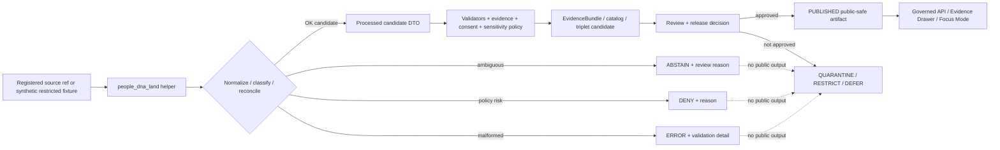

<!-- [KFM_META_BLOCK_V2]
doc_id: kfm://doc/NEEDS-VERIFICATION/packages-domains-people-dna-land-src-people-dna-land-readme
title: People / DNA / Land Python Module README
type: standard
version: v1
status: draft
owners: OWNER_TBD
created: 2026-06-14
updated: 2026-06-14
policy_label: restricted-review
related: [packages/domains/people-dna-land/README.md, packages/domains/people-dna-land/src/README.md, docs/domains/people-dna-land/README.md, docs/domains/people/README.md, docs/domains/genealogy/README.md, docs/domains/land_ownership/README.md, schemas/contracts/v1/people_dna_land/, contracts/domains/people-dna-land/, policy/people/, policy/genealogy/, policy/land_ownership/, data/registry/people_dna_land/, tests/domains/people-dna-land/, fixtures/domains/people-dna-land/]
tags: [kfm, people-dna-land, package-module, python, privacy, consent, genealogy, dna, land-ownership, assertions, evidence]
notes: ["README-like source-module entrypoint for the People / DNA / Land implementation namespace.", "Target path is user-requested and Directory Rules-compatible as code under the packages responsibility root, but package metadata, import path, tests, CI wiring, schemas, policies, consent enforcement, review flows, and runtime behavior remain NEEDS VERIFICATION until a mounted repo confirms them.", "This module may contain implementation helpers only; it must not become a source, schema, contract, policy, consent, lifecycle-data, evidence-store, title, DNA, release, receipt, proof, or publication authority."]
[/KFM_META_BLOCK_V2] -->

# People / DNA / Land Module

Implementation namespace for sensitive People, Genealogy, DNA, and Land Ownership helpers that preserve assertion-first modeling, privacy, consent, source roles, evidence, time, uncertainty, and release boundaries.

<p>
  
  
  
  
  
  
  
</p>

> [!IMPORTANT]
> **Status:** PROPOSED module README  
> **Path:** `packages/domains/people-dna-land/src/people_dna_land/README.md`  
> **Owning responsibility root:** `packages/`  
> **Package lane:** `packages/domains/people-dna-land/`  
> **Import namespace:** `people_dna_land` — NEEDS VERIFICATION against package metadata  
> **Default posture:** DENY or restrict living-person, DNA/genomic, DNA-derived relationship, residential, culturally sensitive, title-sensitive, private-landowner-sensitive, and rights-uncertain outputs unless evidence, consent, policy, review, release state, correction path, and rollback target explicitly support exposure.  
> **Repo implementation depth:** NEEDS VERIFICATION — imports, package manager, tests, fixtures, schemas, policies, source registries, consent/revocation enforcement, emitted receipts, proof objects, UI/API bindings, and runtime behavior were not inspected in this file-generation pass.

## Quick links

- [Scope](#scope)
- [Repo fit](#repo-fit)
- [Accepted inputs](#accepted-inputs)
- [Exclusions](#exclusions)
- [Module responsibilities](#module-responsibilities)
- [Sensitive assertion rules](#sensitive-assertion-rules)
- [Source-role boundaries](#source-role-boundaries)
- [Proposed module map](#proposed-module-map)
- [Trust-boundary flow](#trust-boundary-flow)
- [Finite outcomes](#finite-outcomes)
- [Testing posture](#testing-posture)
- [Development rules](#development-rules)
- [Definition of done](#definition-of-done)
- [Verification checklist](#verification-checklist)
- [Rollback](#rollback)

---

## Scope

`packages/domains/people-dna-land/src/people_dna_land/` is the proposed importable implementation namespace for People, Genealogy, DNA, and Land Ownership helpers.

This namespace may contain small, deterministic, fixture-friendly helper modules for:

- person assertion normalization and canonical-person candidate preparation;
- name, life-event, household, organization, and relationship assertion helpers;
- genealogy ingest support for already-admitted, rights-checked, privacy-reviewed source material;
- DNA token, match, segment, consent, revocation, and relationship-hypothesis helper functions;
- land instrument, legal-description, land-event, ownership-interest, parcel-context, and chain-of-title candidate helpers;
- source-role classification and anti-collapse checks;
- temporal support that preserves source time, event time, valid time, recording time, retrieval time, review time, release time, correction time, and revocation time as separate concepts;
- EvidenceRef / EvidenceBundle preparation helpers for governed callers;
- public-safe derivative preparation after caller-supplied policy, consent, sensitivity, review, and release context exists.

It must remain downstream of source admission and upstream of governed validation, catalog closure, proof construction, review, release decisions, public API delivery, and UI/Focus Mode presentation.

```text
RAW -> WORK / QUARANTINE -> PROCESSED -> CATALOG / TRIPLET -> PUBLISHED
```

> [!WARNING]
> This module must not fetch live sources directly, store real sensitive data, decide consent, publish records, determine legal title, expose DNA/genomic data, infer living-person consent, overwrite source roles, or turn relationship/title hypotheses into public truth. It prepares candidates and finite outcomes for the proper KFM authorities to validate, review, restrict, publish, correct, or roll back.

## Repo fit

| Concern | This module owns | It must not own |
| --- | --- | --- |
| Responsibility root | Importable package implementation under `packages/` | Source registries, schemas, policy, lifecycle data, releases, proofs, receipts, public UI/API |
| Domain segment | People / DNA / Land implementation helpers | Root-level `people/`, `genealogy/`, `dna/`, or `land_ownership/` authority |
| Trust role | Deterministic transformation, classification, redaction-support, and DTO preparation helpers | Evidence authority, source authority, consent authority, review authority, title authority, publication authority |
| Public posture | Prepare public-safe payload candidates only when caller supplies policy/release context | Direct public access to raw, internal, restricted, DNA, living-person, or title-sensitive records |
| Runtime posture | No-network helpers by default; explicit inputs and finite outputs | Hidden live calls, credentials, side effects, auto-publish behavior, or ambient global truth state |

Related homes:

- `packages/domains/people-dna-land/README.md` — package-level orientation.
- `packages/domains/people-dna-land/src/README.md` — source-tree-level orientation.
- `docs/domains/people-dna-land/` — domain documentation and steward-facing explanations.
- `schemas/contracts/v1/people_dna_land/` — proposed machine-readable schema home; NEEDS VERIFICATION against current repo convention.
- `contracts/domains/people-dna-land/` — semantic contracts if this repo keeps semantic Markdown there.
- `policy/people/`, `policy/genealogy/`, `policy/land_ownership/`, and `policy/evidence/` — allow / deny / restrict / abstain policy logic.
- `data/registry/people_dna_land/` — source, rights, sensitivity, dataset-version, consent-surface, and publication-surface registries.
- `pipelines/domains/people-dna-land/` and `pipeline_specs/people-dna-land/` — orchestration and declarative pipeline configuration if confirmed by repo convention.
- `tools/validators/people/`, `tools/validators/genealogy/`, `tools/validators/land_ownership/`, and `tools/validators/evidence/` — repo-wide validation commands.
- `tests/domains/people-dna-land/` and `fixtures/domains/people-dna-land/` — no-network tests and synthetic/redacted fixtures.
- `data/receipts/people-dna-land/`, `data/proofs/people-dna-land/`, `data/catalog/.../people-dna-land/`, and `release/` — trust-bearing process memory, proof, catalog, release, correction, withdrawal, and rollback objects.

## Accepted inputs

Code in this namespace should accept caller-provided, already-admitted, fixture-scoped, review-scoped, or test-scoped structures only.

| Input family | Accepted examples | Required handling |
| --- | --- | --- |
| Source references | Source IDs, source descriptor refs, rights refs, source-role hints, dataset-version refs | Preserve source role; do not invent rights, cadence, authority, or sensitivity. |
| Person assertion candidates | Name assertions, life events, household links, organization links, source-backed person facts | Keep assertions separate from canonical person candidates. |
| Genealogy candidates | Relationship hypotheses, family-tree fragments, GEDCOM-style normalized fragments, cemetery/obituary/census/vital-record-derived candidates | Mark hypotheses; preserve source caveats; do not convert clues into proof. |
| DNA candidates | Tokenized kit refs, tokenized match refs, restricted segment refs, consent refs, revocation refs, relationship-support features | Never accept or log raw kit IDs, raw vendor match identities, raw sensitive segment data, or unrestricted DNA facts. |
| Land candidates | Legal descriptions, land instruments, recording dates, grantor/grantee names, parcel context, PLSS references, chain events, assessor/tax context | Preserve title uncertainty; assessor/parcel context is not title proof. |
| Evidence context | EvidenceRef, EvidenceBundle reference, citation target refs, review refs, correction refs | Do not pretend unresolved EvidenceRefs are evidence. |
| Policy/release context | DecisionEnvelope refs, sensitivity labels, public-safe geometry flags, consent grants, release refs, rollback refs | Public-safe derivatives require explicit allow/restrict state from governed callers. |
| Run context | Run ID, actor/service ID, spec hash, package version, input/output digests, timestamp | Emit receipt-ready metadata for pipeline-owned persistence. |

Missing source role, consent, revocation check, living-person status, DNA restriction state, rights state, title-sensitive context, EvidenceBundle context, or release state should produce a finite outcome instead of a silent best-effort public object.

## Exclusions

| Excluded item | Correct home / handling |
| --- | --- |
| Real GEDCOM, DNA, living-person, residential, title, parcel, or private-landowner datasets | `data/<phase>/people-dna-land/` with appropriate restricted access and lifecycle state |
| Live source fetchers, vendor adapters, credentials, or API keys | `connectors/`, `pipelines/`, `pipeline_specs/`, `configs/`, and secret-management infrastructure |
| Consent records or revocation authority | Registry, policy, review-console, and release/correction systems; not module defaults |
| Source descriptors, rights indexes, sensitivity defaults, dataset versions | `data/registry/people_dna_land/` or repo-confirmed registry home |
| Semantic contracts | `contracts/domains/people-dna-land/` or repo-confirmed contract home |
| JSON Schemas | `schemas/contracts/v1/people_dna_land/` or repo-confirmed schema home |
| Policy rules | `policy/people/`, `policy/genealogy/`, `policy/land_ownership/`, `policy/evidence/` |
| Proofs, receipts, EvidenceBundle stores, catalog closure records | `data/proofs/`, `data/receipts/`, `data/catalog/` |
| Release manifests, promotion decisions, correction notices, withdrawal records, rollback cards | `release/` |
| Public API routes, UI components, MapLibre layers, Focus Mode answer surfaces | `apps/`, `ui/`, `web/`, or repo-confirmed interface roots |
| Legal title determinations, legal advice, medical/health interpretations, forensic DNA conclusions | Out of scope for package code; KFM may carry bounded evidence context only |
| AI-generated relationship or title explanations as truth | Governed AI runtime plus AIReceipt surfaces; generated language remains downstream and evidence-subordinate |

## Module responsibilities

| Helper family | Responsibility | Required failure behavior |
| --- | --- | --- |
| `assertions` | Build typed assertion candidates while retaining source role, evidence refs, caveats, and time scope | `ABSTAIN` on unsupported assertion type or missing evidence context |
| `identity` | Produce deterministic candidate IDs and identity-comparison features | `ABSTAIN` on weak or conflicting identity evidence; never auto-merge sensitive identities |
| `relationships` | Prepare relationship hypotheses and contradiction-aware support summaries | `ABSTAIN` unless evidence and policy context allow relationship support to proceed |
| `dna` | Handle tokenized DNA kit/match/segment candidate helpers | `DENY` for raw DNA values, missing consent, revoked consent, or public exposure request |
| `consent` | Interpret caller-supplied consent and revocation state into local guard results | `DENY` when consent is missing, expired, out of scope, or revoked |
| `land` | Normalize legal-description, instrument, event, interest, and chain candidates | `ABSTAIN` on chain gaps, assessor-only ownership, parcel-only title claims, or missing instrument evidence |
| `source_roles` | Keep archival, family, vendor, court, tax, assessor, title, survey, model-derived, and user-supplied sources distinct | `DENY` on role collapse that would overstate authority |
| `privacy` | Prepare redacted, restricted, or public-safe derivatives when caller policy allows | `DENY` if release context, redaction receipt context, or sensitivity class is absent |
| `temporal` | Preserve event, source, recording, retrieval, valid, review, release, correction, and revocation times separately | `ABSTAIN` when time semantics are insufficient for the claim |
| `evidence` | Prepare EvidenceRef/EvidenceBundle/citation-limitation fragments | `ABSTAIN` when EvidenceRef cannot be resolved by the caller-supplied context |
| `outcomes` | Provide finite, reason-coded result objects | `ERROR` on malformed local input or impossible state |

## Sensitive assertion rules

| Assertion class | Default module posture | Required before public-safe output |
| --- | --- | --- |
| Living-person assertions | DENY or RESTRICT | Living-person policy, access authorization, review state, redaction class, release state. |
| DNA/genomic or DNA-derived relationship assertions | DENY or RESTRICT | Consent, revocation check, DNA policy, vendor/source caveats, EvidenceBundle support, review state, restricted/public derivative split. |
| Raw DNA kit/vendor/segment data | DENY | Do not expose publicly; do not log raw sensitive IDs or segment values. |
| Relationship hypotheses | ABSTAIN or RESTRICT unless evidence support is sufficient | EvidenceBundle, confidence class, contradiction state, review burden, release decision. |
| Person-canonical candidates | RESTRICT until reviewed | Assertion set, merge rationale, conflict register, correction path, review record. |
| Land ownership/title claims | ABSTAIN unless instrument and chain evidence support the claim | Source role, legal-description support, chain-of-title support, uncertainty/gap state, review and release state. |
| Assessor/tax/parcel context | CONTEXT only | Explicit warning that administrative/geometry context is not title truth. |
| Residential/private-landowner-sensitive joins | DENY or RESTRICT | Rights, privacy, steward review, public-safe geometry, release-state controls. |
| Culturally sensitive / sovereignty-related assertions | DENY or RESTRICT | Steward/tribal/cultural review and access policy. |

## Source-role boundaries

| Source family | May support | Must not be silently treated as |
| --- | --- | --- |
| Census / vital / court / archival records | Evidence for person assertions, events, households, residence, names, dates, places | Final identity truth or unrestricted public release. |
| Family trees / user uploads | Candidate assertions, clues, lineage hypotheses | Independent proof without source evidence and review. |
| DNA vendor exports or match evidence | Restricted evidence for DNA-derived hypotheses where consent/policy allow | Public identity, public relationship truth, or raw segment publication. |
| Cemetery / obituary / memorial records | Historical event/context evidence | Living-person status proof without additional checks. |
| Assessor / tax rolls | Administrative context, parcel/tax-account context, temporal public-record observation | Title truth or legal ownership boundary proof. |
| Deeds / mortgages / probate / land instruments | Instrument evidence and chain candidates | Complete title chain without gap analysis and review. |
| Parcel geometry / PLSS / plats / surveys | Spatial context, legal-description helper, display/reference geometry | Title boundary proof by itself. |
| Model-derived identity / relationship / geocoding | Candidate derivative requiring evidence and policy checks | Sovereign truth or publishable claim. |

## Proposed module map

> [!NOTE]
> Names below are implementation suggestions for this namespace. Keep, rename, or split them only after package metadata and adjacent repo conventions are verified.

```text
packages/domains/people-dna-land/src/people_dna_land/
├── README.md
├── __init__.py                         # PROPOSED: namespace export boundary
├── types.py                            # PROPOSED: internal value objects / protocols
├── outcomes.py                         # PROPOSED: finite result and reason-code helpers
├── assertions.py                       # PROPOSED: assertion candidate helpers
├── identity.py                         # PROPOSED: deterministic identity and cautious matching helpers
├── relationships.py                    # PROPOSED: relationship-hypothesis helpers
├── source_roles.py                     # PROPOSED: anti-collapse source-role classification
├── privacy.py                          # PROPOSED: redaction / restricted derivative helpers
├── consent.py                          # PROPOSED: consent / revocation guard helpers
├── dna.py                              # PROPOSED: tokenized DNA helper functions
├── land.py                             # PROPOSED: land instrument, legal-description, chain helpers
├── temporal.py                         # PROPOSED: time-scope helper functions
├── evidence.py                         # PROPOSED: EvidenceRef / EvidenceBundle preparation helpers
├── public_derivatives.py               # PROPOSED: public-safe DTO candidate helpers
└── py.typed                            # PROPOSED: include only if typed Python package convention is confirmed
```

Preferred import posture, subject to package verification:

```python
from people_dna_land.outcomes import Outcome
from people_dna_land.assertions import normalize_person_assertion
from people_dna_land.consent import evaluate_consent_guard
```

## Trust-boundary flow



## Finite outcomes

Helpers should return explicit outcomes that callers can validate, log, and convert into receipts.

| Outcome | Use when | Public posture |
| --- | --- | --- |
| `OK` | Candidate output has sufficient local structure for the next governed gate | Not public until evidence, policy, review, and release gates pass. |
| `ABSTAIN` | Evidence, identity, relationship support, temporal scope, source role, chain support, or title support is insufficient | Do not publish; send to review/quarantine path. |
| `DENY` | Consent, revocation, living-person, DNA, title, public-safety, rights, or sensitivity constraints block use | Do not publish; record reason and rollback/correction target if relevant. |
| `ERROR` | Malformed input, unsupported shape, impossible state, or code failure | Do not publish; fix input/code/test. |

## Testing posture

Tests for this namespace should be no-network by default and should use synthetic or redacted fixtures only.

Minimum expected coverage:

- person assertions remain separate from canonical person candidates;
- relationship hypotheses remain hypotheses until evidence/review state supports stronger treatment;
- missing, expired, out-of-scope, or revoked consent produces `DENY`;
- raw DNA kit IDs, raw vendor match identities, and raw segment values are rejected or never logged;
- assessor-only ownership produces `ABSTAIN`, not title truth;
- parcel geometry alone produces context only, not boundary/title proof;
- source roles are preserved and role-collapse attempts fail;
- unresolved EvidenceRefs produce `ABSTAIN`;
- living-person or DNA public-derivative requests fail closed without explicit policy/release context;
- all outcomes include reason codes that can be converted into receipts by pipeline callers.

Illustrative command only — verify package manager and test paths first:

```bash
pytest tests/domains/people-dna-land -q
```

## Development rules

- Keep helper functions deterministic and side-effect-light.
- Prefer explicit value objects over ambient global configuration.
- Do not add network calls in this namespace.
- Do not import secrets, credentials, or source-system clients.
- Do not log real personal, DNA, residential, title-sensitive, or private-landowner values.
- Do not merge identities, relationships, parcels, instruments, or ownership interests without evidence-backed caller context.
- Do not replace policy decisions with package defaults.
- Do not let generated language become evidence.
- Keep exact/internal and public-safe derivatives separate.
- Keep test fixtures synthetic, redacted, and marked.
- Keep schemas and contracts referenced, not duplicated.
- Return finite outcomes rather than silently filling missing evidence or policy state.

## Definition of done

- [ ] `README.md` is present and linked from `packages/domains/people-dna-land/src/README.md`.
- [ ] Package metadata confirms the `people_dna_land` import namespace.
- [ ] Public exports are intentionally listed in `__init__.py` if such a file exists.
- [ ] Unit tests cover `OK`, `ABSTAIN`, `DENY`, and `ERROR` paths.
- [ ] DNA, living-person, consent, revocation, title-sensitive, and parcel-context denial cases are tested.
- [ ] No helper stores lifecycle data, source descriptors, policy, schemas, proofs, receipts, release decisions, or public artifacts.
- [ ] No code path logs raw DNA, living-person, residential, title-sensitive, or private-landowner data.
- [ ] Every public-safe derivative requires caller-supplied evidence, policy, review, release, correction, and rollback context.
- [ ] Fixtures are synthetic or redacted and carry sensitivity labels.
- [ ] Rollback/correction behavior is documented for any output that can influence release candidates.

## Verification checklist

- [ ] Confirm `packages/domains/people-dna-land/src/people_dna_land/` exists in the live repo.
- [ ] Confirm package manager and import namespace.
- [ ] Confirm adjacent package READMEs link here.
- [ ] Confirm schema home for `people_dna_land` via ADR or current repo convention.
- [ ] Confirm policy homes for people, genealogy, DNA, land ownership, evidence, consent, revocation, and publication.
- [ ] Confirm registry homes for source roles, rights, dataset versions, sensitivity defaults, and publication surfaces.
- [ ] Confirm consent and revocation handling is policy/review backed.
- [ ] Confirm no real sensitive data is committed in fixtures.
- [ ] Confirm no public path bypasses governed API, EvidenceBundle resolution, policy, review, release, correction, or rollback controls.
- [ ] Confirm CI denies role collapse, raw DNA leakage, living-person public exposure, assessor-as-title truth, and parcel-geometry-as-title-proof patterns.

## Rollback

Rollback is required if this module begins to own authority that belongs elsewhere, leaks sensitive values, weakens consent/revocation checks, collapses source roles, produces public-safe outputs without release context, or causes downstream public claims to outrun evidence.

Rollback steps:

1. Revert the package change that introduced the authority or sensitivity violation.
2. Move misplaced schemas, contracts, policies, registries, lifecycle data, receipts, proofs, or release objects back to their proper roots.
3. Add or update a drift-register entry if placement caused confusion.
4. Emit or update correction/withdrawal records if any release candidate or public artifact was affected.
5. Re-run privacy, consent, DNA, title, source-role, evidence, and no-public-bypass tests.

Rollback target: `ROLLBACK_TARGET_TBD_AFTER_REPO_INSPECTION`

## Evidence notes

| Source | Status | Supports | Limits |
| --- | --- | --- | --- |
| Directory Rules | CONFIRMED doctrine | Responsibility-root placement, lifecycle separation, schema-home caution, and no parallel authority homes. | Does not prove this module exists or passes tests. |
| People / Genealogy-DNA / Land Ownership Architecture Blueprint | LINEAGE / PROPOSED design | Assertion-first modeling, evidence-bound privacy posture, DNA restriction, consent/revocation objects, source-role discipline, land/title caution, schema/policy/validator families. | Does not prove current repo implementation, imports, tests, or runtime enforcement. |
| Repository Markdown Authoring Agent prompt | CONFIRMED authoring instruction | README structure, impact block, repo fit, accepted inputs, exclusions, truth labels, visual GitHub formatting, and repo-unavailable posture. | Does not prove implementation state. |

