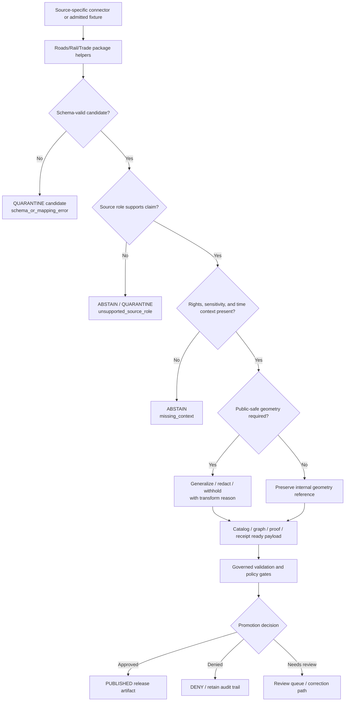

<!-- [KFM_META_BLOCK_V2]
doc_id: kfm://doc/NEEDS-VERIFICATION/packages-domains-roads-rail-trade-readme
title: Roads, Rail, and Trade Routes Domain Package README
type: standard
version: v1
status: draft
owners: OWNER_TBD
created: 2026-06-14
updated: 2026-06-14
policy_label: public
related: [docs/domains/roads-rail-trade/README.md, docs/domains/roads-rail-trade/ARCHITECTURE.md, docs/domains/roads-rail-trade/SOURCE_ROLES.md, docs/domains/roads-rail-trade/TIME_SEMANTICS.md, docs/domains/roads-rail-trade/PROMOTION.md, docs/domains/roads-rail-trade/UI_AND_EVIDENCE_DRAWER.md, contracts/domains/roads-rail-trade/, schemas/contracts/v1/domains/roads-rail-trade/, policy/domains/roads-rail-trade/, data/registry/roads-rail-trade/, data/receipts/roads-rail-trade/, data/proofs/roads-rail-trade/, release/candidates/roads-rail-trade/, tests/domains/roads-rail-trade/, fixtures/domains/roads-rail-trade/]
tags: [kfm, roads-rail-trade, packages, transport, corridors, rail, roads, evidence, map-layers, source-roles]
notes: ["README-like package entrypoint for shared Roads/Rail/Trade implementation helpers.", "Target path is user-requested and Directory Rules-compatible as a package/domain segment, but actual repo package layout remains NEEDS VERIFICATION until mounted repo evidence confirms package metadata, imports, tests, CI, and sibling conventions.", "This package may contain shared implementation helpers only; it must not become a schema, contract, policy, source-registry, lifecycle-data, release, receipt, proof, public API, or publication authority."]
[/KFM_META_BLOCK_V2] -->

# Roads, Rail, and Trade Routes Domain Package

Shared implementation package for KFM transportation-corridor helpers that preserve source roles, temporal lineage, public-safe geometry, EvidenceBundle support, governed release boundaries, and rollback/correction paths.

<p>
  
  
  
  
  
  
</p>

> [!IMPORTANT]
> **Status:** PROPOSED package README  
> **Path:** `packages/domains/roads-rail-trade/README.md`  
> **Owning responsibility root:** `packages/`  
> **Domain lane:** `roads-rail-trade`  
> **Repo implementation depth:** NEEDS VERIFICATION — package metadata, package manager, imports, tests, schemas, policies, registries, CI workflows, API routes, UI bindings, emitted receipts, proof objects, release manifests, and runtime behavior were not inspected in this file-generation pass.

## Quick links

- [Scope](#scope)
- [Repo fit](#repo-fit)
- [Accepted inputs](#accepted-inputs)
- [Exclusions](#exclusions)
- [Package responsibilities](#package-responsibilities)
- [Source-role anti-collapse rules](#source-role-anti-collapse-rules)
- [Transportation time semantics](#transportation-time-semantics)
- [Public-safe geometry and exposure controls](#public-safe-geometry-and-exposure-controls)
- [Trust-boundary flow](#trust-boundary-flow)
- [Proposed directory map](#proposed-directory-map)
- [Finite outcomes](#finite-outcomes)
- [Validation and quality gates](#validation-and-quality-gates)
- [Development rules](#development-rules)
- [Definition of done](#definition-of-done)
- [Verification checklist](#verification-checklist)
- [Rollback](#rollback)

---

## Scope

`packages/domains/roads-rail-trade/` is the shared implementation package lane for transport-network and historical-corridor helpers.

This package may contain reusable code that helps KFM normalize, classify, validate, crosswalk, compare, generalize, and package roads, rail, trade-route, access, crossing, facility, and corridor candidate records for governed downstream systems. It does **not** own truth, source authority, policy, lifecycle state, public release, steward review, public map publication, operational routing, navigation advice, legal access determinations, or AI answers.

The package may support these knowledge families:

- road segments, route identifiers, mileposts, functional classes, and jurisdictional ownership context;
- rail corridors, lines, sidings, depots, crossings, operators, status history, and service-era context;
- historic roads, trails, trade corridors, military roads, stage routes, wagon roads, cattle trails, ferry/crossing references, and interpretive reconstructions;
- access observations for frontier, settlement, economic, agriculture, infrastructure, and matrix analyses;
- restrictions, closures, grades, bridges, crossings, and facilities when rights, sensitivity, and source role allow use;
- topology and graph-projection helpers that preserve evidence and uncertainty instead of replacing source records;
- public-safe layer-manifest and MapLibre payload preparation;
- Evidence Drawer, Focus Mode, governed API, graph, catalog, proof, receipt, and release support payloads after policy and review controls.

```text
RAW -> WORK / QUARANTINE -> PROCESSED -> CATALOG / TRIPLET -> PUBLISHED
```

This package may help create WORK, QUARANTINE, PROCESSED, catalog-ready, graph-ready, proof-ready, receipt-ready, or layer-manifest-ready payloads. It must not publish, promote, bypass review, route users operationally, issue legal access claims, or treat generated summaries, model outputs, map tiles, graph edges, public layer labels, or source convenience fields as sovereign truth.

---

## Repo fit

```text
packages/domains/roads-rail-trade/
```

This path is appropriate for shared implementation helpers because `packages/` owns reusable library code and `roads-rail-trade` is a domain segment inside that responsibility root.

| Relationship | Expected home | Boundary rule |
| --- | --- | --- |
| Shared package helpers | `packages/domains/roads-rail-trade/` | Owns reusable implementation code only. |
| Domain documentation | `docs/domains/roads-rail-trade/` | Explains domain purpose, stewardship, source roles, time semantics, lane boundaries, and user-facing interpretation. |
| Architecture docs | `docs/architecture/roads-rail-trade/` or repo-confirmed docs home | Explains object model, lifecycle, control-plane integration, graph projection, and public-map boundary. |
| ADRs | `docs/adr/ADR-roads-rail-trade-*.md` | Records schema-home, source-role, graph, layer, public-safe geometry, naming, and release decisions. |
| Semantic contracts | `contracts/domains/roads-rail-trade/` or repo-confirmed contract home | Defines object meaning; package code references, not redefines. |
| Machine schemas | `schemas/contracts/v1/domains/roads-rail-trade/` or repo-confirmed schema home | Defines machine-checkable shape; package code validates against it. |
| Source registries | `data/registry/roads-rail-trade/` or repo-confirmed source-registry home | Owns source identity, rights, role, cadence, caveats, sensitivity, and activation state. |
| Policy | `policy/domains/roads-rail-trade/` or repo-confirmed policy home | Decides allow / deny / restrict / abstain, public-safe geometry, access sensitivity, and operational-use boundaries. |
| Lifecycle data | `data/raw/roads-rail-trade/`, `data/work/roads-rail-trade/`, `data/quarantine/roads-rail-trade/`, `data/processed/roads-rail-trade/`, `data/catalog/.../roads-rail-trade/`, `data/published/layers/roads-rail-trade/` | Stores evidence-bearing and released data by lifecycle phase. |
| Receipts and proofs | `data/receipts/roads-rail-trade/`, `data/proofs/roads-rail-trade/`, or repo-confirmed trust-object homes | Stores process memory and release-significant proof artifacts. |
| Release decisions and rollback | `release/` | Owns release manifests, promotion decisions, correction notices, supersession records, and rollback targets. |
| Pipelines and source activation | `pipelines/domains/roads-rail-trade/`, `pipeline_specs/roads-rail-trade/`, `connectors/` | Owns executable flows, declarative pipeline config, and source-specific fetch/admission code. |
| Tests and fixtures | `tests/domains/roads-rail-trade/`, `fixtures/domains/roads-rail-trade/`, or repo-confirmed equivalents | Proves package behavior with deterministic no-network fixtures. |

> [!WARNING]
> This package must not become a shortcut around `schemas/`, `contracts/`, `policy/`, `data/registry/`, lifecycle directories, `data/receipts/`, `data/proofs/`, or `release/`. If a helper starts owning one of those responsibilities, split the file into the correct root and record the move.

---

## Accepted inputs

Package functions should accept explicit, inspectable values from governed callers. Inputs should carry source, evidence, temporal, spatial, rights, sensitivity, topology, and run context instead of relying on ambient global state.

| Input family | Accepted examples | Required handling |
| --- | --- | --- |
| Source descriptors | `source_id`, source role, rights profile, caveat text, authority limit, activation state, cadence, steward, citation template | Treat source role as a hard boundary; do not infer stronger authority from a convenient field. |
| Transport candidate records | Road segment rows, rail-line records, crossing rows, station/depot references, historic-route references, access observations, restriction records | Preserve source-native fields and normalized fields separately. |
| Evidence context | EvidenceRef, EvidenceBundle reference, citation requirement, input digest, source descriptor ref | Preserve evidence closure requirements and return bounded outcomes when evidence is missing. |
| Spatial context | Internal geometry reference, CRS, linear referencing basis, route measure, source scale, geometry support, uncertainty, public geometry, redaction class | Keep exact/internal and public-safe geometry separate. |
| Temporal context | observed date, built/opened/abandoned dates, effective interval, status interval, source publication date, retrieval time, run time, review time, release time | Do not collapse these into one timestamp. |
| Topology context | node IDs, segment IDs, crossing relation, route relation, graph candidate ID, edge direction, connectivity confidence | Treat graph projections as derivatives, not canonical truth. |
| Rights/sensitivity context | license posture, public-safe class, infrastructure exposure class, private-property access sensitivity, historic-site sensitivity | Use as policy inputs, not publication approval. |
| Run context | run ID, actor/service ID, package version, spec hash, input/output digests, timestamp | Emit receipt-ready metadata for the owning pipeline to persist. |

Missing source role, evidence context, temporal semantics, rights/sensitivity context, or public-safe geometry context should produce a finite failure outcome rather than a silent best-effort public output.

---

## Exclusions

| Do not put here | Correct home or owner | Why |
| --- | --- | --- |
| Live source fetchers, scrapers, credentials, or source-specific admission code | `connectors/`, `pipelines/domains/roads-rail-trade/`, `pipeline_specs/roads-rail-trade/`, `configs/`, secret-management infrastructure | Source activation is governed and source-specific, not package-local convenience code. |
| RAW, WORK, QUARANTINE, PROCESSED, CATALOG, TRIPLET, PUBLISHED data | `data/<phase>/roads-rail-trade/` | Lifecycle state must remain auditable outside package source. |
| Source descriptors, rights/cadence/sensitivity registers | `data/registry/roads-rail-trade/` or repo-confirmed source-registry home | Source authority and rights are governance data. |
| Semantic contracts | `contracts/domains/roads-rail-trade/` or repo-confirmed contract home | Contracts define meaning. |
| JSON Schemas | `schemas/contracts/v1/domains/roads-rail-trade/` or repo-confirmed schema home | Schemas define machine shape. |
| Policy rules, release policies, public-safe geometry rules | `policy/domains/roads-rail-trade/` | Policy owns allow/deny/restrict/abstain decisions. |
| Proofs, receipts, EvidenceBundle stores, catalog matrices, graph-release proofs | `data/proofs/`, `data/receipts/`, `data/catalog/` | Trust objects must remain independently addressable. |
| Release manifests, promotion decisions, correction notices, rollback cards | `release/` | Publication is a governed state transition, not a package side effect. |
| Public API routes, UI components, MapLibre styles, Focus Mode answer surfaces | `apps/`, `ui/`, `web/`, or repo-confirmed equivalents | Package code may prepare DTOs but does not own public interfaces. |
| Operational routing, navigation, emergency transport guidance, or legal access advice | Outside this package; use official sources and policy-reviewed public guidance | KFM may provide evidence context, not operational instructions or legal determinations. |
| AI-generated route histories or corridor explanations as truth | Governed AI runtime and AIReceipt surfaces | Generated language is interpretive and evidence-subordinate. |

---

## Package responsibilities

The package should be conservative, deterministic, evidence-aware, and easy to test.

| Responsibility | Expected behavior |
| --- | --- |
| Normalize source payloads | Convert source-native road, rail, corridor, crossing, facility, and access fields into typed candidates without deleting raw values or caveats. |
| Preserve source roles | Keep observations, administrative records, regulatory rows, historic interpretations, reconstructed corridors, graph projections, and public layers distinct. |
| Maintain deterministic identity | Build or support stable IDs from source ID, object family, spatial/linear scope, temporal scope, version, and digest-bearing inputs. |
| Represent uncertainty | Preserve source scale, route measure uncertainty, geometry support, temporal uncertainty, historic reconstruction confidence, and topology confidence. |
| Keep temporal semantics separate | Retain source publication date, observed date, status interval, effective date, retrieval time, run time, release time, and supersession time where material. |
| Prepare public-safe geometry | Support generalized/redacted/withheld output candidates only when policy context and reason codes are present. |
| Prepare graph-ready payloads | Produce topology candidates and graph-edge candidates without replacing source records or evidence. |
| Prepare catalog-ready payloads | Build STAC/DCAT/PROV-ready or layer-manifest-ready fragments for owning catalog/release systems. |
| Prepare receipt/proof-ready metadata | Return input digests, output digests, spec hash, run ID, reason codes, source refs, and evidence refs for the owning pipeline to persist. |
| Fail closed | Return `ABSTAIN`, `DENY`, or `ERROR` when evidence, source role, policy, rights, sensitivity, time semantics, or schema support is insufficient. |

---

## Source-role anti-collapse rules

The most important transport package rule is to keep source character visible.

| Source character | Can support | Must not be treated as |
| --- | --- | --- |
| Official road inventory row | Administrative/network record under stated date and authority | Universal route truth, legal access determination, or private-property permission. |
| Rail operator or regulatory row | Operator/status/regulatory context under stated scope | Complete physical-condition, ownership, or service truth by itself. |
| Historic map route | Evidence of a mapped or interpreted route at source date/scale | Exact modern geometry or proof that a route existed continuously. |
| Archive narrative or local history | Interpretive context and candidate relation | Geometry, legal access, or authoritative status without corroboration. |
| Survey/GPS/field observation | Observation evidence under collection caveats | Release-ready public layer without rights, sensitivity, and review controls. |
| Restriction/closure feed | Time-bounded operational context | Emergency authority, route instruction, or legal advice. |
| Graph projection | Derived network relation for analysis | Canonical truth, source record, or proof of connectivity. |
| Public map layer | Released visualization artifact | EvidenceBundle, release decision, source registry, or policy authority. |
| AI summary | Interpretive downstream language | Evidence, policy, review, release, or source authority. |

> [!CAUTION]
> Historic corridor reconstructions and access observations are high-burden claims. A helper may normalize, compare, or flag them for review; it must not promote them to public fact without evidence closure, source-role fit, policy approval, review state, and release state.

---

## Transportation time semantics

Transportation claims are time-sensitive. Package helpers must keep time fields distinct and reviewable.

| Time field | Meaning | Common mistake to avoid |
| --- | --- | --- |
| `observed_at` | When the source observed or recorded the feature. | Treating it as release time. |
| `source_published_at` | When the source artifact was published. | Treating it as when the road/rail/corridor existed. |
| `status_interval` | When a route, line, crossing, restriction, or facility status is asserted to apply. | Collapsing into a single status date. |
| `effective_interval` | When a regulation, designation, restriction, or official change is effective. | Treating source retrieval as legal effective date. |
| `retrieved_at` | When KFM or a pipeline retrieved the source. | Treating retrieval as evidence creation. |
| `run_at` | When package/pipeline processing ran. | Treating run time as source or event time. |
| `reviewed_at` | When a steward or review process checked the candidate. | Treating review as release. |
| `released_at` | When a governed release approved public artifact delivery. | Treating release as source truth. |
| `superseded_at` | When a newer claim/release superseded the earlier one. | Deleting old lineage. |

---

## Public-safe geometry and exposure controls

Transport information can expose sensitive infrastructure, private-property access, emergency routes, cultural corridors, archaeological context, or operational vulnerabilities. Public geometry is therefore a governed output, not a default byproduct.

| Geometry class | Package posture | Release posture |
| --- | --- | --- |
| Internal source geometry | Preserve by reference or controlled internal object where policy allows. | Not public by default. |
| Normalized working geometry | Used for validation, crosswalk, topology, and candidate generation. | Not public unless promoted. |
| Generalized public geometry | Prepared with explicit transform, reason code, scale, and output digest. | Candidate for release only after policy/review gates. |
| Withheld geometry | Emits `DENY` or `ABSTAIN` with reason code. | No public coordinate disclosure. |
| Graph geometry | Derived edge/node shape for analysis or visualization. | Must cite source/evidence and release manifest; graph is not canonical truth. |

---

## Trust-boundary flow



This package sits inside the implementation layer. It prepares governed candidates and metadata; it does not own promotion, publication, public API delivery, UI rendering, operational routing, or AI answer authority.

---

## Proposed directory map

> [!NOTE]
> The tree below is PROPOSED. Confirm package metadata, language layout, imports, tests, and sibling package conventions before treating it as implemented.

```text
packages/domains/roads-rail-trade/
├── README.md
├── pyproject.toml                         # NEEDS VERIFICATION: package manager/layout
├── src/
│   └── roads_rail_trade/
│       ├── __init__.py
│       ├── normalizers/
│       ├── identity/
│       ├── temporal/
│       ├── geometry/
│       ├── topology/
│       ├── source_roles/
│       ├── layer_manifest/
│       └── receipts/
├── tests/
│   ├── README.md
│   ├── test_normalizers.py
│   ├── test_identity.py
│   ├── test_public_safe_geometry.py
│   └── test_source_role_outcomes.py
└── fixtures/
    ├── README.md
    ├── valid/
    └── invalid/
```

If the live repository uses a different package layout, preserve this README’s governance boundaries but adapt the physical layout through a small, reversible PR and update this file.

---

## Finite outcomes

Package helpers should return bounded outcomes rather than guessing.

| Outcome | Use when | Expected caller behavior |
| --- | --- | --- |
| `ANSWER` | Inputs are valid, source role supports the requested transformation, and policy context is adequate for the package-level operation. | Continue to validation, catalog/proof/receipt preparation, or downstream review. |
| `ABSTAIN` | Evidence, source role, rights, sensitivity, time context, topology confidence, or policy context is insufficient. | Do not publish; request missing context or route to review. |
| `DENY` | The requested transformation would expose restricted geometry, bypass release controls, imply legal/operational authority, or collapse source roles. | Block the operation and emit a reason code. |
| `ERROR` | Input shape, schema validation, CRS handling, topology logic, or transform execution fails. | Quarantine candidate and preserve failure evidence. |

---

## Validation and quality gates

Minimum package-level checks before using this package in a governed pipeline:

- [ ] Import/package metadata verified against the live repo.
- [ ] No-network fixture tests cover valid, invalid, denied, abstained, and error outcomes.
- [ ] Source-role fixtures prove anti-collapse rules for official rows, historical maps, archive narratives, field observations, restrictions, graph projections, public layers, and AI summaries.
- [ ] Temporal fixtures prove that observed, effective, status, retrieval, run, review, release, and supersession times remain distinct.
- [ ] Geometry fixtures prove exact/internal, normalized working, generalized public, withheld, and graph geometry separation.
- [ ] Deterministic identity fixtures prove stable IDs and collision handling.
- [ ] Receipt-ready metadata includes `run_id`, `spec_hash`, input digest, output digest, source refs, evidence refs, and reason codes.
- [ ] Package output cannot write directly to `data/published/`, `release/`, public API routes, UI layers, or AI answer surfaces.

---

## Development rules

1. Keep functions deterministic by default.
2. Prefer explicit typed inputs over ambient configuration.
3. Preserve source-native values and caveats alongside normalized values.
4. Return finite outcomes with reason codes.
5. Never collapse source role into confidence score alone.
6. Never collapse temporal semantics into a single timestamp.
7. Never emit public geometry without policy context and transform metadata.
8. Never treat a graph projection as canonical truth.
9. Never turn a restriction or closure feed into emergency guidance.
10. Keep package helpers side-effect-light; persistence belongs to lifecycle, receipt, proof, catalog, and release roots.

---

## Definition of done

A change in this package is done only when:

- [ ] The responsibility still belongs under `packages/domains/roads-rail-trade/`.
- [ ] Related contracts/schemas/policies are referenced, not duplicated.
- [ ] Tests cover `ANSWER`, `ABSTAIN`, `DENY`, and `ERROR` where relevant.
- [ ] EvidenceRef/EvidenceBundle expectations are preserved.
- [ ] Source-role anti-collapse behavior is tested.
- [ ] Public-safe geometry behavior is tested.
- [ ] Time semantics are tested.
- [ ] Receipt-ready metadata is emitted or intentionally out of scope.
- [ ] No code path writes directly to public release surfaces.
- [ ] Rollback and correction impact is documented when behavior changes.

---

## Verification checklist

- [ ] Confirm the target path exists in the live repo or create it in the same PR.
- [ ] Confirm package manager and import layout.
- [ ] Confirm adjacent README/doc naming conventions.
- [ ] Confirm owners and CODEOWNERS coverage.
- [ ] Confirm contract and schema homes for roads/rail/trade objects.
- [ ] Confirm source-registry paths and first-wave source descriptors.
- [ ] Confirm policy homes and public-safe geometry rules.
- [ ] Confirm fixtures and tests run in CI.
- [ ] Confirm generated artifacts are not committed into this package.
- [ ] Confirm downstream API/UI/MapLibre/Focus Mode surfaces consume only governed released or review-safe payloads.

---

## Rollback

Rollback is required when a package change weakens evidence closure, source-role boundaries, public-safe geometry behavior, temporal semantics, topology confidence, policy separation, release-state separation, or correction lineage.

Rollback target: `ROLLBACK_TARGET_TBD_AFTER_FIRST_PR`

Recommended rollback actions:

1. Revert the package change with `git revert` or an equivalent PR-level rollback.
2. Preserve failing fixtures and validation output in the appropriate test/receipt/proof locations.
3. File or update a drift, verification, or correction entry in the repo-confirmed register location.
4. Block downstream release candidates that depended on the reverted helper behavior.
5. Re-run package tests, domain tests, policy checks, and release-candidate validation before re-enabling downstream use.

---

## Evidence boundary

This README is grounded in KFM Directory Rules and the Roads/Rail/Trade Routes architecture blueprint. It does not prove that the live repo currently contains this package, tests, schemas, policies, source descriptors, release workflows, CI gates, runtime behavior, or public UI bindings.

Current implementation depth remains **NEEDS VERIFICATION** until checked against mounted repository evidence, tests, workflows, emitted receipts/proofs, release manifests, and runtime logs.
