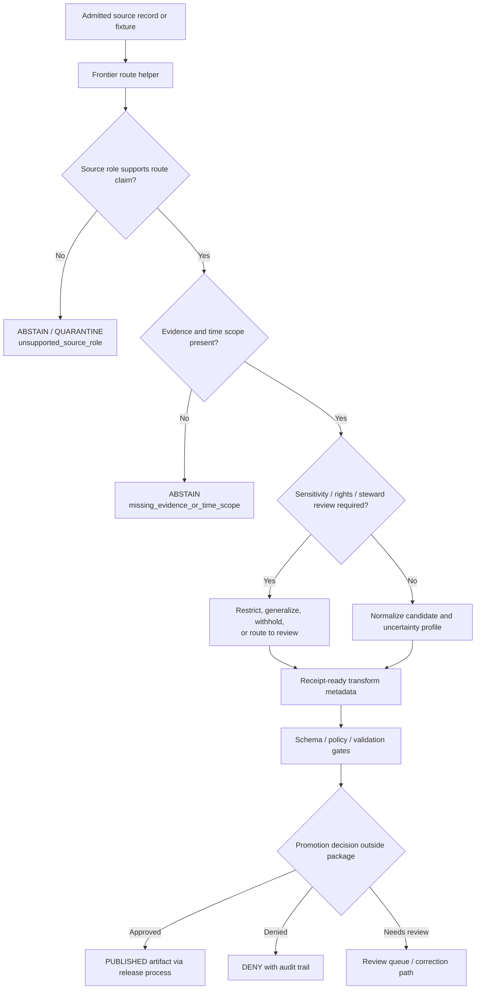

<!-- [KFM_META_BLOCK_V2]
doc_id: kfm://doc/NEEDS-VERIFICATION/packages-domains-roads-rail-trade-frontier-routes-readme
title: Roads, Rail, and Trade Routes Frontier Routes Package README
type: standard
version: v1
status: draft
owners: OWNER_TBD
created: 2026-06-14
updated: 2026-06-14
policy_label: public
related: [packages/domains/roads-rail-trade/README.md, docs/domains/roads-rail-trade/README.md, docs/domains/transport/architecture.md, docs/domains/transport/data_model.md, docs/domains/transport/source_registry.md, docs/domains/transport/lifecycle_and_promotion.md, docs/domains/transport/rollback_and_corrections.md, contracts/domains/roads-rail-trade/, schemas/contracts/v1/domains/roads-rail-trade/, policy/domains/roads-rail-trade/, data/registry/roads-rail-trade/, data/receipts/roads-rail-trade/, data/proofs/roads-rail-trade/, release/candidates/roads-rail-trade/, tests/domains/roads-rail-trade/, fixtures/domains/roads-rail-trade/]
tags: [kfm, roads-rail-trade, frontier-routes, historic-corridors, trails, trade-routes, transport, packages, evidence, geoprivacy, rollback]
notes: ["README-like package document for frontier-route implementation helpers.", "Target path is user-requested and Directory Rules-compatible as a packages/domain segment, but package metadata, imports, tests, CI, schemas, policies, registries, and runtime behavior remain NEEDS VERIFICATION.", "This package must not become the source registry, schema authority, policy authority, lifecycle-data store, release authority, proof store, receipt store, public API, map publication surface, or historic-corridor truth authority."]
[/KFM_META_BLOCK_V2] -->

# Frontier Routes Package

Shared implementation helpers for frontier-route and historic-corridor candidates in the KFM Roads/Rail/Trade Routes lane.

<p>
  
  
  
  
  
  
  
</p>

> [!IMPORTANT]
> **Status:** PROPOSED package README  
> **Path:** `packages/domains/roads-rail-trade/frontier_routes/README.md`  
> **Owning responsibility root:** `packages/`  
> **Domain lane:** `roads-rail-trade`  
> **Subpackage:** `frontier_routes`  
> **Repo implementation depth:** NEEDS VERIFICATION — package metadata, package manager, imports, tests, schemas, policies, source registries, fixtures, CI workflows, API bindings, map bindings, generated receipts, proof objects, release manifests, and runtime behavior were not inspected in this file-generation pass.

## Quick links

- [Scope](#scope)
- [Repo fit](#repo-fit)
- [Accepted inputs](#accepted-inputs)
- [Exclusions](#exclusions)
- [Frontier-route claim posture](#frontier-route-claim-posture)
- [Source-role anti-collapse rules](#source-role-anti-collapse-rules)
- [Temporal and spatial uncertainty](#temporal-and-spatial-uncertainty)
- [Public-safe geometry](#public-safe-geometry)
- [Trust-boundary flow](#trust-boundary-flow)
- [Proposed directory map](#proposed-directory-map)
- [Finite outcomes](#finite-outcomes)
- [Validation checklist](#validation-checklist)
- [Rollback](#rollback)

---

## Scope

`frontier_routes/` contains reusable implementation helpers for frontier-era route, corridor, crossing, and access candidates inside the Roads/Rail/Trade Routes domain package.

This subpackage may help normalize, compare, score, generalize, and prepare **candidate** records for:

- emigrant, military, mail, stage, freight, cattle, market, grain, livestock, wagon, and settlement corridors;
- historic roads, trails, river crossings, ferries, depots, stations, forts, trade nodes, and settlement access routes;
- route membership, route segment, corridor claim, crossing claim, and access-observation candidates;
- uncertainty profiles for reconstructed alignments and historically interpreted route geometry;
- evidence-ready and review-ready payloads for downstream catalog, graph, Evidence Drawer, Focus Mode, and release workflows.

This package is not a historic-route authority. It produces bounded, evidence-aware implementation outputs for other governed KFM surfaces.

```text
RAW -> WORK / QUARANTINE -> PROCESSED -> CATALOG / TRIPLET -> PUBLISHED
```

Helpers in this package may prepare WORK, QUARANTINE, PROCESSED, catalog-ready, graph-ready, receipt-ready, proof-ready, or release-candidate payloads. They must not publish claims, bypass policy, bypass review, expose exact sensitive locations, or treat generated narratives, historic-map traces, graph projections, or public layers as sovereign truth.

---

## Repo fit

```text
packages/domains/roads-rail-trade/frontier_routes/
```

This location is appropriate when the primary responsibility is reusable library code. The domain appears as a segment under `packages/`; schemas, contracts, policy, registries, lifecycle data, proofs, receipts, and release decisions remain in their own roots.

| Relationship | Expected home | Boundary |
| --- | --- | --- |
| Frontier-route helper code | `packages/domains/roads-rail-trade/frontier_routes/` | Normalization, uncertainty, matching, public-safe transform helpers. |
| Domain package entrypoint | `packages/domains/roads-rail-trade/README.md` | Higher-level package boundaries and shared transport helper rules. |
| Human-facing transport docs | `docs/domains/roads-rail-trade/` or repo-confirmed transport docs home | Explains lane doctrine, source roles, stewardship, and publication posture. |
| Semantic contracts | `contracts/domains/roads-rail-trade/` or repo-confirmed equivalent | Owns object meaning. |
| Machine schemas | `schemas/contracts/v1/domains/roads-rail-trade/` or repo-confirmed equivalent | Owns field shape and validation contract. |
| Source registry | `data/registry/roads-rail-trade/` or repo-confirmed equivalent | Owns source identity, source role, rights, cadence, sensitivity, and activation state. |
| Policy gates | `policy/domains/roads-rail-trade/` or repo-confirmed equivalent | Owns allow / deny / restrict / abstain decisions. |
| Lifecycle data | `data/<phase>/roads-rail-trade/` | Stores raw, work, quarantine, processed, catalog, triplet, published, receipt, proof, registry, and rollback artifacts by lifecycle phase. |
| Tests and fixtures | `tests/domains/roads-rail-trade/`, `fixtures/domains/roads-rail-trade/` | Proves behavior with deterministic valid, invalid, deny, abstain, and rollback fixtures. |
| Release decisions | `release/` | Owns release manifests, promotion decisions, correction notices, withdrawal records, and rollback targets. |

> [!WARNING]
> Do not move source descriptors, historical records, route geometries, proof bundles, release manifests, or policy decisions into this package for convenience. The package may compute candidates and metadata, but the governing objects live outside `packages/`.

---

## Accepted inputs

Inputs should be explicit, evidence-aware, and safe to validate. The package should not fetch live sources or infer authority from a convenient field.

| Input family | Accepted examples | Required handling |
| --- | --- | --- |
| Source-role context | `source_id`, `source_role`, rights label, sensitivity tier, authority limit, citation template | Preserve source role and authority limits in every output. |
| Historical evidence references | historic map refs, archive refs, survey notes, gazetteer refs, county histories, trail studies, oral-history refs where approved | Treat as evidence-bearing inputs, not automatically as precise geometry. |
| Candidate route geometry | line candidate, corridor polygon, point crossing, station/node, generalized geometry, withheld geometry ref | Preserve internal/public geometry distinction and uncertainty metadata. |
| Temporal context | source date, map date, event interval, interpreted date range, retrieval time, run time, review time | Do not collapse distinct time meanings into one timestamp. |
| Uncertainty context | scale, confidence, reconstruction method, buffer distance, alignment ambiguity, conflicting evidence, reviewer notes | Preserve and return uncertainty instead of smoothing it away. |
| Cross-domain context | settlement node ref, archaeology sensitivity flag, river crossing ref, land/private-property sensitivity flag, hazard context | Use only as bounded context; do not edit or re-own cross-domain truth. |
| Run context | run ID, spec hash, input digests, actor/service ID, package version | Return receipt-ready metadata for the owning pipeline to persist. |

Missing source role, evidence reference, source-rights status, temporal scope, uncertainty profile, or public-safe geometry context should produce a finite non-success outcome.

---

## Exclusions

| Do not put here | Correct owner | Reason |
| --- | --- | --- |
| Source fetchers, scrapers, credentials, endpoint clients | `connectors/`, `pipelines/domains/roads-rail-trade/`, `pipeline_specs/roads-rail-trade/`, `configs/` | Source activation is governed and source-specific. |
| RAW or processed route datasets | `data/<phase>/roads-rail-trade/` | Lifecycle data must remain auditable and separate from code. |
| Source descriptors and rights matrices | `data/registry/roads-rail-trade/` | Source identity and rights are governance data. |
| Object contracts | `contracts/domains/roads-rail-trade/` | Meaning belongs in contracts, not package helpers. |
| JSON Schemas | `schemas/contracts/v1/domains/roads-rail-trade/` | Machine shape belongs in schemas. |
| Policy rules | `policy/domains/roads-rail-trade/` | Policy owns allow, deny, restrict, and abstain decisions. |
| EvidenceBundle stores, proofs, receipts, release manifests | `data/proofs/`, `data/receipts/`, `release/` | Trust objects must remain independently inspectable. |
| Public MapLibre layers, API routes, Focus Mode answers | `apps/`, `ui/`, `web/`, governed API/runtime homes | This package may prepare payload fragments only. |
| Exact archaeological, sacred, culturally sensitive, or private-property route coordinates for public display | Policy-controlled lifecycle/release homes only after review | Sensitive geography fails closed or is generalized/withheld. |

---

## Frontier-route claim posture

Frontier-route work has a high uncertainty burden. Historic travel corridors can be important public context, but KFM must not convert partial archival evidence into falsely precise public geometry.

| Claim type | Package posture | Release posture |
| --- | --- | --- |
| Route existed | Candidate claim only until EvidenceBundle support and source-role review are complete. | Requires evidence closure, review state, and release decision. |
| Route alignment | Preserve uncertainty, scale, method, and geometry support. | Public geometry should be generalized unless precision is explicitly supported and policy-approved. |
| Crossing or node | Treat as candidate relation to settlement, hydrology, archaeology, or infrastructure context. | Exact point may be withheld or generalized depending sensitivity. |
| Cultural or Indigenous corridor | Default to steward/review posture; do not force into precise public geometry. | Release requires rights, sovereignty, sensitivity, and steward review support. |
| Access observation | Treat as time-bounded analytical input. | Not legal access advice, trespass permission, or current navigation guidance. |
| Graph edge | Derived analytical relation only. | Never replaces source records or evidence. |

---

## Source-role anti-collapse rules

| Source character | Can support | Must not be treated as |
| --- | --- | --- |
| Historic map | Mapped route context at a stated scale/date. | Exact modern alignment by itself. |
| Archival narrative | Interpretive or contextual evidence. | Geometry, legal status, or continuous-use proof without corroboration. |
| Survey or field note | Observation under collection caveats. | Public-release approval. |
| Modern road layer | Current or administrative transport context. | Frontier-era route proof by itself. |
| Settlement record | Node/context relation. | Proof of route alignment. |
| Archaeological/cultural context | Sensitive contextual evidence. | Public coordinate disclosure. |
| Graph projection | Derived connectivity hypothesis. | Canonical source truth. |
| AI summary | Interpretive downstream language. | Evidence, policy, review, or release authority. |

---

## Temporal and spatial uncertainty

Helpers should make uncertainty more visible, not less.

| Uncertainty field | Why it matters |
| --- | --- |
| `source_scale` | Historic maps and surveys vary by scale and precision. |
| `date_range` | Route use, mapping, construction, abandonment, and interpretation may occur at different times. |
| `alignment_method` | Digitized map trace, buffered corridor, expert reconstruction, graph inference, and source geometry carry different support. |
| `confidence` | Public outputs need reviewable confidence and reason codes. |
| `conflicting_evidence_refs` | Conflicts should be retained, not silently averaged away. |
| `public_geometry_policy` | Exact/internal geometry and public geometry are different artifacts. |
| `review_state` | Candidate outputs are not release-ready until reviewed under the correct gate. |

---

## Public-safe geometry

Frontier-route public geometry should be conservative by default.

| Geometry output | Meaning | Default behavior |
| --- | --- | --- |
| `internal_geometry_ref` | Controlled internal candidate geometry or source geometry reference. | Not public by default. |
| `working_geometry` | Geometry used for validation and comparison. | Lifecycle-limited; not a public layer. |
| `generalized_corridor` | Public-safe generalized geometry with transform metadata. | Candidate only until policy/review/release approval. |
| `withheld_geometry` | No public coordinate disclosure. | Return `DENY` or `ABSTAIN` with reason code. |
| `graph_edge_geometry` | Derived analytical edge. | Cite source/evidence and keep graph status derivative. |

---

## Trust-boundary flow



---

## Proposed directory map

```text
packages/domains/roads-rail-trade/frontier_routes/
├── README.md
├── __init__.py                  # PROPOSED / NEEDS VERIFICATION
├── models.py                    # PROPOSED: typed internal candidates, not schema authority
├── normalize.py                 # PROPOSED: source-to-candidate transforms
├── uncertainty.py               # PROPOSED: uncertainty profile helpers
├── geometry.py                  # PROPOSED: public-safe geometry prep helpers
├── source_roles.py              # PROPOSED: source-role checks that reference external registry/policy
├── crosswalks.py                # PROPOSED: route/node/cross-domain relation candidates
├── receipts.py                  # PROPOSED: receipt-ready metadata builders; does not persist receipts
└── validators.py                # PROPOSED: package-local guard helpers; authoritative tests live under tests/
```

> [!NOTE]
> The map above is a proposed implementation shape, not confirmed repo state. Confirm package language, module naming, import conventions, and test layout before adding code.

---

## Finite outcomes

Functions that evaluate frontier-route candidates should return bounded outcomes rather than silently continuing.

| Outcome | Use when |
| --- | --- |
| `ANSWER` | Candidate output is schema-valid, evidence-aware, policy-context-ready, and safe for downstream review. |
| `ABSTAIN` | Source role, evidence, time scope, or uncertainty support is insufficient. |
| `DENY` | Rights, sensitivity, public-safety, cultural, archaeological, or private-property constraints block output. |
| `ERROR` | Input is malformed, schema-invalid, contradictory beyond configured tolerance, or processing failed. |

---

## Validation checklist

- [ ] Confirm this target path against the live repository tree.
- [ ] Confirm package language and module naming conventions.
- [ ] Confirm whether `frontier_routes` is the preferred Python module name or whether repo convention requires another naming pattern.
- [ ] Confirm adjacent package README links after commit.
- [ ] Confirm contracts for route, corridor, route membership, uncertainty profile, public generalization, transform receipt, EvidenceBundle, and release manifest.
- [ ] Confirm schemas live under the repo-approved schema home and do not duplicate contract authority.
- [ ] Confirm source registry fields for historic maps, archival narratives, route studies, settlement nodes, crossings, and cultural/steward-reviewed sources.
- [ ] Confirm policy gates for sensitive geometry, private-property access, archaeology/cultural context, and public generalization.
- [ ] Confirm tests cover valid, invalid, abstain, deny, uncertainty, generalization, and rollback fixtures.
- [ ] Confirm no helper persists lifecycle data, receipts, proofs, or release decisions inside `packages/`.

---

## Rollback

Rollback is required if this subpackage begins to own source authority, schema authority, policy decisions, lifecycle data, receipts, proofs, releases, public map publication, or generated historic-route truth.

Rollback target: remove or revert files under `packages/domains/roads-rail-trade/frontier_routes/`, preserve any review notes in the appropriate docs/register location, and move misplaced trust-bearing artifacts to their responsibility roots with a drift entry and rollback/correction record.


