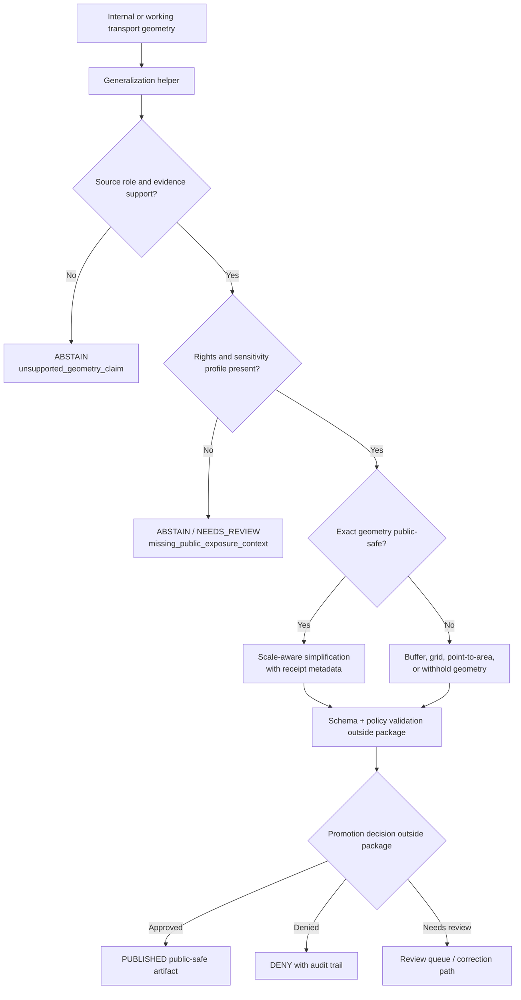

<!-- [KFM_META_BLOCK_V2]
doc_id: kfm://doc/NEEDS-VERIFICATION/packages-domains-roads-rail-trade-generalization-readme
title: Roads, Rail, and Trade Routes Generalization Package README
type: standard
version: v1
status: draft
owners: OWNER_TBD
created: 2026-06-14
updated: 2026-06-14
policy_label: public
related: [packages/domains/roads-rail-trade/README.md, packages/domains/roads-rail-trade/frontier_routes/README.md, docs/domains/roads-rail-trade/README.md, docs/domains/roads-rail-trade/ARCHITECTURE.md, docs/domains/roads-rail-trade/PUBLIC_GENERALIZATION.md, docs/domains/roads-rail-trade/UI_AND_EVIDENCE_DRAWER.md, docs/domains/roads-rail-trade/PROMOTION.md, schemas/contracts/v1/domains/roads-rail-trade/, policy/domains/roads-rail-trade/, data/receipts/roads-rail-trade/, data/proofs/roads-rail-trade/, release/]
tags: [kfm, roads-rail-trade, packages, generalization, public-safe-geometry, map-layers, corridors, transport, evidence, rollback]
notes: ["README-like package document for roads/rail/trade public-safe geometry generalization helpers.", "Target path is user-requested and Directory Rules-compatible as a package/domain segment, but package metadata, imports, tests, CI, schemas, policies, and runtime behavior remain NEEDS VERIFICATION until a mounted repo inspection confirms them.", "This package may compute generalized or withheld geometry payloads and receipt-ready transform metadata; it must not own source truth, policy decisions, release decisions, proofs, receipts, or lifecycle data."]
[/KFM_META_BLOCK_V2] -->

# Roads, Rail, and Trade Routes Generalization Package

Public-safe geometry generalization helpers for KFM transport corridors, route segments, rail alignments, historic mobility paths, crossings, restrictions, and derived map-layer payloads.

<p>
  
  
  
  
  
  
</p>

> [!IMPORTANT]
> **Status:** PROPOSED package README  
> **Path:** `packages/domains/roads-rail-trade/generalization/README.md`  
> **Owning responsibility root:** `packages/`  
> **Domain lane:** `roads-rail-trade`  
> **Repo implementation depth:** NEEDS VERIFICATION — package metadata, package manager, imports, tests, schemas, policies, source registries, CI workflows, API routes, UI bindings, emitted receipts, proof objects, release manifests, and runtime behavior were not inspected in this file-generation pass.

## Quick links

- [Scope](#scope)
- [Repo fit](#repo-fit)
- [Accepted inputs](#accepted-inputs)
- [Exclusions](#exclusions)
- [Generalization contract](#generalization-contract)
- [Sensitivity and exposure posture](#sensitivity-and-exposure-posture)
- [Transform receipt fields](#transform-receipt-fields)
- [Trust-boundary flow](#trust-boundary-flow)
- [Finite outcomes](#finite-outcomes)
- [Proposed directory map](#proposed-directory-map)
- [Validation checklist](#validation-checklist)
- [Definition of done](#definition-of-done)
- [Rollback](#rollback)

---

## Scope

`packages/domains/roads-rail-trade/generalization/` is the proposed home for reusable helpers that turn internal or working transport geometries into **public-safe candidate representations**.

The package may support:

- route-line simplification for public map display;
- corridor buffering where exact alignment is unsupported, sensitive, or too uncertain;
- point-to-area generalization for crossings, depots, stations, ferry points, bridges, route nodes, and historic-route anchors;
- geometry withholding when policy, rights, sensitivity, uncertainty, or review state does not permit public display;
- scale-aware rendering hints for MapLibre layer manifests;
- transform metadata that can be persisted by receipt/proof/release systems outside this package;
- comparison helpers that prove a public geometry was derived from, but does not expose, an internal geometry reference.

This package does **not** decide publication. It computes candidate transforms and reason codes for governed callers.

```text
RAW -> WORK / QUARANTINE -> PROCESSED -> CATALOG / TRIPLET -> PUBLISHED
```

Generalization can prepare a public-safe candidate for later gates, but promotion remains a governed state transition handled outside this package.

---

## Repo fit

```text
packages/domains/roads-rail-trade/generalization/
```

This path is appropriate only for shared implementation code. The package may calculate transforms, but it must not become a storage or authority root.

| Relationship | Expected home | Boundary rule |
| --- | --- | --- |
| Generalization helper code | `packages/domains/roads-rail-trade/generalization/` | Computes candidate public-safe geometry and transform metadata. |
| Domain documentation | `docs/domains/roads-rail-trade/` | Explains public-generalization doctrine, domain boundaries, source roles, stewardship, and review posture. |
| ADRs | `docs/adr/ADR-transport-public-generalization.md` or repo-confirmed equivalent | Records accepted public-generalization decision logic and tradeoffs. |
| Semantic contracts | `contracts/domains/roads-rail-trade/` or repo-confirmed equivalent | Owns object meaning. |
| Machine schemas | `schemas/contracts/v1/domains/roads-rail-trade/` or repo-confirmed equivalent | Owns field shape and validation rules. |
| Source registry | `data/registry/roads-rail-trade/` or repo-confirmed equivalent | Owns source identity, authority, rights, cadence, activation, and sensitivity. |
| Policy gates | `policy/domains/roads-rail-trade/` or repo-confirmed equivalent | Owns allow, deny, restrict, abstain, and public-exposure decisions. |
| Receipts and proofs | `data/receipts/roads-rail-trade/`, `data/proofs/roads-rail-trade/`, or repo-confirmed trust-object homes | Persist transform receipts and proof packs; package only emits receipt-ready values. |
| Release decisions | `release/` | Owns promotion, release manifests, rollback targets, corrections, withdrawals, and supersession. |
| Map/UI layer use | governed API, `apps/`, `packages/maplibre/`, `packages/ui/`, or repo-confirmed homes | Consumes published/released generalized payloads; does not read internal geometry directly. |

> [!WARNING]
> Do not store exact/internal transport geometry, sensitive historical-route geometry, proof packs, release manifests, policy files, source descriptors, or lifecycle datasets in this package for convenience.

---

## Accepted inputs

Inputs should already be admitted into a governed caller context. Generalization helpers should not fetch sources or infer rights from URLs.

| Input family | Accepted examples | Required handling |
| --- | --- | --- |
| Geometry references | internal geometry ref, working geometry, candidate line, corridor polygon, crossing point, route node | Never assume internal geometry is public. |
| Source context | `source_id`, source role, rights label, sensitivity tier, authority limit | Preserve in output metadata and reason codes. |
| Evidence context | EvidenceRef, EvidenceBundle ref, citation requirement, input digest | Return `ABSTAIN` or `NEEDS_REVIEW` when evidence support is missing. |
| Spatial support | source scale, map scale, digitization method, alignment method, spatial uncertainty, buffer basis | Use to select scale-aware simplification/buffering. |
| Temporal support | source date, route-use interval, event interval, interpretation interval, retrieval time | Preserve distinct time semantics. |
| Policy context | public exposure profile, sensitivity flags, review state, release candidate state | Respect fail-closed defaults. |
| Run context | run ID, spec hash, package version, transform algorithm, parameters | Emit receipt-ready transform metadata. |

---

## Exclusions

| Do not put here | Correct owner | Why |
| --- | --- | --- |
| RAW, WORK, QUARANTINE, PROCESSED, CATALOG, TRIPLET, or PUBLISHED datasets | `data/<phase>/roads-rail-trade/` | Lifecycle data is not package code. |
| Source descriptors, rights records, and activation state | `data/registry/roads-rail-trade/` | Source identity and rights are governance data. |
| Policy rules and sensitivity decisions | `policy/domains/roads-rail-trade/` | Policy owns exposure decisions. |
| JSON Schemas | `schemas/contracts/v1/domains/roads-rail-trade/` | Schema home owns machine-readable field shape. |
| Semantic contracts | `contracts/domains/roads-rail-trade/` | Contracts own object meaning. |
| Proof packs, transform receipts, release manifests, rollback cards | `data/proofs/`, `data/receipts/`, `release/` | Trust objects must remain independently inspectable. |
| Public API routes, UI components, MapLibre sources, Focus Mode answers | governed API/runtime/UI homes | This package emits helper results only. |
| Current navigation instructions, emergency routing, legal access advice | Out of scope / DENY | KFM transport outputs are evidence context, not operational routing authority. |

---

## Generalization contract

Generalization should be explicit, reversible where possible, and receipt-ready.

| Transform | Intended use | Required metadata |
| --- | --- | --- |
| `simplify_line` | Reduce display complexity while preserving route meaning at target scale. | tolerance, CRS, source scale, target scale, algorithm, input digest, output digest. |
| `buffer_corridor` | Represent uncertain or sensitive route alignment as a corridor. | buffer distance, unit, method, uncertainty reason, evidence refs. |
| `snap_to_public_grid` | Reduce precision for public display. | grid size, coordinate system, precision tier, withheld internal ref. |
| `point_to_area` | Generalize a crossing, station, depot, ferry, or node. | radius/area method, sensitivity reason, source support, review state. |
| `withhold_geometry` | Suppress public geometry entirely. | deny/restrict reason, policy ref, reviewer/steward requirement, replacement display text. |
| `derive_render_hints` | Help MapLibre choose zoom, style, and visibility constraints. | min/max zoom, generalized class, uncertainty badge, release ref requirement. |

> [!NOTE]
> A public geometry is a derived representation. It does not replace source geometry, internal working geometry, EvidenceBundle, proof pack, policy decision, review record, or release manifest.

---

## Sensitivity and exposure posture

Transport geometry may look ordinary but still carry exposure risk when it intersects sensitive topics, historic/cultural corridors, private property, restricted infrastructure, archaeology, ecological sensitivity, or current operational vulnerabilities.

| Condition | Default result | Reason |
| --- | --- | --- |
| Missing source role | `ABSTAIN` | The helper cannot determine what the source can support. |
| Missing rights/sensitivity profile | `ABSTAIN` or `NEEDS_REVIEW` | Public display cannot proceed without exposure context. |
| Exact historic/cultural route with unresolved sensitivity | `RESTRICT` or `WITHHOLD_GEOMETRY` | Avoids precision disclosure without steward review. |
| Public-safe transform lacks receipt metadata | `ERROR` | Transform is not auditable. |
| Geometry uncertainty exceeds release profile | `GENERALIZE` or `ABSTAIN` | Avoids false precision. |
| Current operational restriction or emergency context | `ABSTAIN` | KFM is not an emergency alert or live navigation authority. |
| Reviewer requires suppression | `WITHHOLD_GEOMETRY` | Steward review outranks convenience. |

---

## Transform receipt fields

This package should return values that a caller can persist as a receipt. It should not write receipt files directly unless a repo-confirmed package pattern explicitly delegates that responsibility.

| Field | Purpose |
| --- | --- |
| `transform_id` | Deterministic identifier for this transform operation. |
| `input_geometry_ref` | Reference to controlled internal or working geometry. |
| `output_geometry_digest` | Digest of the public-safe output geometry or withheld token. |
| `algorithm` | Named algorithm or transform mode. |
| `parameters` | Tolerance, buffer distance, grid size, target scale, precision tier. |
| `source_refs` | SourceDescriptor / EvidenceRef inputs used by the transform. |
| `policy_ref` | Policy profile or decision reference that shaped output. |
| `reason_codes` | Why the output was simplified, buffered, generalized, withheld, denied, or abstained. |
| `created_at` | Transform run timestamp. |
| `review_state` | Candidate, review_required, approved, denied, superseded, or withdrawn. |
| `rollback_ref` | Link target for reversing or superseding the public-safe transform. |

---

## Trust-boundary flow



---

## Finite outcomes

| Outcome | Meaning |
| --- | --- |
| `OK_GENERALIZED` | Candidate public-safe geometry and receipt-ready metadata were produced. |
| `OK_WITHHELD` | No public geometry was produced; a public-safe withheld response was generated. |
| `ABSTAIN_MISSING_EVIDENCE` | Evidence support is insufficient. |
| `ABSTAIN_MISSING_RIGHTS_OR_SENSITIVITY` | Rights/sensitivity context is missing. |
| `REQUIRES_REVIEW` | Steward, policy, or domain review is required before public use. |
| `DENY_PUBLIC_EXPOSURE` | Public geometry exposure is blocked under the current policy context. |
| `ERROR_INVALID_GEOMETRY` | Geometry is malformed, unsupported, or fails validation. |
| `ERROR_UNAUDITABLE_TRANSFORM` | Transform parameters or digests are missing. |

---

## Proposed directory map

```text
packages/domains/roads-rail-trade/generalization/
  README.md
  __init__.py                  # NEEDS VERIFICATION: package language/layout
  algorithms.py                # PROPOSED: simplify, buffer, grid, point-to-area helpers
  outcomes.py                  # PROPOSED: finite outcome labels and reason codes
  receipts.py                  # PROPOSED: receipt-ready metadata builders, not receipt storage
  sensitivity.py               # PROPOSED: sensitivity-aware transform selector helpers
  render_hints.py              # PROPOSED: MapLibre/layer manifest hint preparation
  types.py                     # PROPOSED: typed helper inputs/outputs if Python package is confirmed
```

> [!NOTE]
> The directory map is PROPOSED until the live repository confirms package language, module layout, import style, and test convention.

---

## Validation checklist

- [ ] Confirm `packages/domains/roads-rail-trade/generalization/` is the accepted package home.
- [ ] Confirm package language and layout (`pyproject.toml`, workspace package metadata, or repo-native equivalent).
- [ ] Confirm semantic contracts for public-safe geometry, route candidate, route segment, route corridor, crossing/node, and transform receipt.
- [ ] Confirm JSON Schemas live under the repo-approved `schemas/contracts/v1/...` home.
- [ ] Confirm policy profiles for exact, generalized, buffered, grid-snapped, and withheld transport geometry.
- [ ] Confirm source registry entries include rights, source role, sensitivity, cadence, and authority limits.
- [ ] Add fixtures for valid, uncertain, sensitive, missing-evidence, missing-rights, malformed-geometry, and rollback cases.
- [ ] Add tests proving no helper publishes, promotes, writes release manifests, or exposes internal geometry directly.
- [ ] Add tests proving reason codes and transform metadata are deterministic.
- [ ] Confirm MapLibre/UI callers consume only governed API/released artifacts, not internal geometry or package helpers directly.

---

## Definition of done

This package is ready for first review when:

- public-safe geometry helpers are deterministic and fixture-tested;
- every transform returns reason codes and receipt-ready metadata;
- missing evidence, missing rights, missing sensitivity, and unsupported source roles fail closed;
- exact/internal geometry is never returned as public geometry unless policy and review state explicitly allow it;
- generalized outputs preserve uncertainty, source role, temporal scope, and evidence refs;
- schema, policy, source registry, receipt, proof, and release ownership stay outside `packages/`;
- rollback/supersession metadata is emitted for every public-safe transform candidate;
- adjacent docs and tests link back to this README after repo path verification.

---

## Rollback

Rollback is required if this package starts owning source truth, lifecycle data, policy, proof, receipt, release, or public API behavior; exposes exact/internal geometry as public output; strips uncertainty or source role; or produces transform outputs without reviewable metadata.

Rollback target: `ROLLBACK_TARGET_TBD_AFTER_FIRST_ACCEPTED_PR`

Minimum rollback action:

1. Disable the affected transform path.
2. Mark derived outputs as superseded or withdrawn through the release/correction process.
3. Re-run validation fixtures and policy checks.
4. Emit or update correction/rollback records in the owning release and receipt/proof homes.
5. Preserve old transform metadata for audit; do not silently overwrite.

---

## Evidence boundary

This README is a repo-useful draft for a user-requested package path. It reflects KFM doctrine and roads/rail/trade lane planning, but does not prove that the live repository currently contains this package, tests, workflows, schemas, policies, release manifests, or runtime integrations.

Implementation status remains **NEEDS VERIFICATION** until confirmed from mounted repo evidence.

