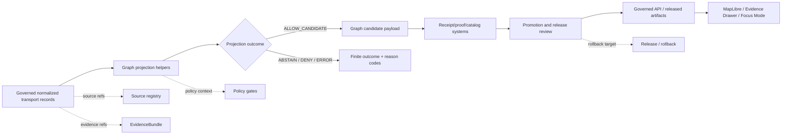

<!-- [KFM_META_BLOCK_V2]
doc_id: kfm://doc/NEEDS-VERIFICATION/packages-domains-roads-rail-trade-graph-projection-readme
title: Roads, Rail, and Trade Routes Graph Projection Package README
type: standard
version: v1
status: draft
owners: OWNER_TBD
created: 2026-06-14
updated: 2026-06-14
policy_label: public
related: [packages/domains/roads-rail-trade/README.md, packages/domains/roads-rail-trade/frontier_routes/README.md, packages/domains/roads-rail-trade/generalization/README.md, docs/domains/roads-rail-trade/README.md, docs/domains/roads-rail-trade/ARCHITECTURE.md, docs/domains/roads-rail-trade/CATALOG_AND_PROOF_OBJECTS.md, docs/domains/roads-rail-trade/PROMOTION.md, schemas/contracts/v1/domains/roads-rail-trade/, policy/domains/roads-rail-trade/, data/receipts/roads-rail-trade/, data/proofs/roads-rail-trade/, release/]
tags: [kfm, roads-rail-trade, packages, graph-projection, transport-network, corridors, topology, evidence, provenance, rollback]
notes: ["README-like package document for roads/rail/trade graph projection helpers.", "Target path is user-requested and Directory Rules-compatible as a package/domain segment, but package metadata, imports, tests, CI, schemas, policies, graph stores, emitted proofs, and runtime behavior remain NEEDS VERIFICATION until a mounted repo inspection confirms them.", "This package may compute graph-projection candidates and receipt-ready topology metadata; it must not own canonical source records, lifecycle data, graph release decisions, proofs, receipts, policies, schemas, or public APIs."]
[/KFM_META_BLOCK_V2] -->

# Roads, Rail, and Trade Routes Graph Projection Package

Derived graph-projection helpers for KFM roads, rail, crossings, trade corridors, historic routes, access observations, restrictions, facilities, and network-analysis candidates.

<p>
  
  
  
  
  
  
</p>

> [!IMPORTANT]
> **Status:** PROPOSED package README  
> **Path:** `packages/domains/roads-rail-trade/graph_projection/README.md`  
> **Owning responsibility root:** `packages/`  
> **Domain lane:** `roads-rail-trade`  
> **Repo implementation depth:** NEEDS VERIFICATION — package metadata, package manager, imports, graph-store adapters, tests, schemas, policies, source registries, CI workflows, API routes, UI bindings, emitted receipts, proof objects, release manifests, and runtime behavior were not inspected in this file-generation pass.

## Quick links

- [Scope](#scope)
- [Repo fit](#repo-fit)
- [Accepted inputs](#accepted-inputs)
- [Exclusions](#exclusions)
- [Projection contract](#projection-contract)
- [Node and edge families](#node-and-edge-families)
- [Source-role anti-collapse rules](#source-role-anti-collapse-rules)
- [Trust-boundary flow](#trust-boundary-flow)
- [Finite outcomes](#finite-outcomes)
- [Proposed directory map](#proposed-directory-map)
- [Validation checklist](#validation-checklist)
- [Definition of done](#definition-of-done)
- [Rollback](#rollback)

---

## Scope

`packages/domains/roads-rail-trade/graph_projection/` is the proposed home for reusable helpers that transform governed transport-domain records into **derived graph-projection candidates**.

The package may support:

- road, rail, trail, ferry, trade-route, and historic-corridor node/edge candidates;
- crossing, junction, depot, station, settlement-connection, facility, route-measure, and access-restriction relation candidates;
- graph-edge confidence scoring from evidence, source role, spatial support, temporal support, and topology support;
- derived connectivity summaries for governed APIs, MapLibre layer manifests, Evidence Drawer payloads, and Focus Mode context;
- graph projection metadata that can be persisted by receipt, proof, catalog, and release systems outside this package;
- deterministic projection IDs derived from source IDs, object families, spatial/linear scope, temporal scope, projection spec, and digests.

A graph projection is a **derived analytic carrier**. It is not source truth, not a release decision, not proof by itself, and not a public-routing authority.

```text
RAW -> WORK / QUARANTINE -> PROCESSED -> CATALOG / TRIPLET -> PUBLISHED
```

Graph projection belongs after governed normalization and validation. A projection can become part of a release candidate only when the owning pipeline, policy, proof, catalog, review, and release systems close the loop.

---

## Repo fit

```text
packages/domains/roads-rail-trade/graph_projection/
```

This path is appropriate only for shared implementation code. The package may compute candidate graph nodes, edges, subgraphs, route memberships, and topology summaries, but it must not become the graph authority or trust-object store.

| Relationship | Expected home | Boundary rule |
| --- | --- | --- |
| Projection helper code | `packages/domains/roads-rail-trade/graph_projection/` | Computes graph-projection candidates and receipt-ready metadata. |
| Domain documentation | `docs/domains/roads-rail-trade/` | Explains domain semantics, source roles, graph-derived status, and release posture. |
| ADRs | `docs/adr/ADR-transport-graph-derived-status.md` or repo-confirmed equivalent | Records whether graph products are analysis-only, release candidates, or public artifacts. |
| Semantic contracts | `contracts/domains/roads-rail-trade/` or repo-confirmed equivalent | Owns meaning for node, edge, route, corridor, crossing, and projection objects. |
| Machine schemas | `schemas/contracts/v1/domains/roads-rail-trade/` or repo-confirmed equivalent | Owns field shape for graph nodes, graph edges, projection receipts, and payload fragments. |
| Source registry | `data/registry/roads-rail-trade/` or repo-confirmed equivalent | Owns source identity, rights, role, caveats, cadence, and sensitivity. |
| Policy gates | `policy/domains/roads-rail-trade/` or repo-confirmed equivalent | Owns allow, deny, restrict, abstain, graph-publication, and sensitive-connectivity decisions. |
| Lifecycle data | `data/<phase>/roads-rail-trade/` | Owns RAW/WORK/QUARANTINE/PROCESSED/CATALOG/TRIPLET/PUBLISHED state. |
| Receipts and proofs | `data/receipts/roads-rail-trade/`, `data/proofs/roads-rail-trade/`, or repo-confirmed trust-object homes | Persist graph-projection run receipts, proof packs, closure checks, and integrity artifacts. |
| Release decisions | `release/` | Owns ReleaseManifest, PromotionDecision, rollback targets, correction notices, withdrawals, and supersession. |
| API/UI surfaces | governed API, `apps/`, `packages/maplibre/`, `packages/ui/`, or repo-confirmed homes | Consume released graph-derived artifacts; do not read internal projections directly. |

> [!WARNING]
> Do not store canonical graph databases, graph release manifests, proof packs, EvidenceBundles, raw source rows, source descriptors, policy files, or public API route code in this package for convenience.

---

## Accepted inputs

Package functions should accept explicit, inspectable values from governed callers. No helper should fetch sources, infer rights from URLs, or treat a graph edge as valid because geometry touches.

| Input family | Accepted examples | Required handling |
| --- | --- | --- |
| Normalized transport records | road segment candidate, rail segment candidate, crossing candidate, depot/station candidate, route/corridor candidate, restriction candidate | Preserve original source refs and normalized object refs. |
| Source context | `source_id`, source role, authority limit, rights label, sensitivity tier, caveat text | Keep source role visible in node/edge metadata. |
| Evidence context | EvidenceRef, EvidenceBundle ref, citation requirement, input digest, proof requirement | Return `ABSTAIN` or `NEEDS_REVIEW` when evidence support is missing. |
| Geometry context | internal geometry ref, public geometry ref, CRS, source scale, route measure, uncertainty, generalization class | Do not publish exact/internal geometry through graph output. |
| Temporal context | observed date, effective interval, route-use interval, status interval, source publication date, retrieval time, run time | Keep time semantics separate; graph edges are time-scoped. |
| Topology context | node ID candidate, segment ID candidate, edge direction, connection type, confidence, impedance/weight basis | Do not collapse topology confidence into truth. |
| Rights/sensitivity context | public-safe class, infrastructure exposure class, private-access warning, historic-site sensitivity | Treat as policy inputs and graph-output constraints. |
| Run context | run ID, projection spec hash, package version, input/output digests, actor/service ID | Emit receipt-ready projection metadata. |

Missing source role, evidence context, temporal scope, topology basis, rights/sensitivity context, or public-safe geometry context should produce a finite failure outcome rather than silent graph output.

---

## Exclusions

| Do not put here | Correct home or owner | Why |
| --- | --- | --- |
| RAW, WORK, QUARANTINE, PROCESSED, CATALOG, TRIPLET, or PUBLISHED datasets | `data/<phase>/roads-rail-trade/` | Lifecycle data is not package source code. |
| Source descriptors, rights records, cadence, and activation state | `data/registry/roads-rail-trade/` | Source identity and rights are governance data. |
| Policy rules and graph-publication decisions | `policy/domains/roads-rail-trade/` | Policy owns allow/deny/restrict/abstain outcomes. |
| JSON Schemas | `schemas/contracts/v1/domains/roads-rail-trade/` | Schema home owns machine-readable field shape. |
| Semantic contracts | `contracts/domains/roads-rail-trade/` | Contracts own object meaning. |
| Proof packs, projection receipts, EvidenceBundles, catalog records, release manifests | `data/proofs/`, `data/receipts/`, `data/catalog/`, `release/` | Trust objects must remain independently inspectable. |
| Graph database migrations | `migrations/` or repo-confirmed graph migration home | Migration state is not helper code. |
| Public API routes, UI components, MapLibre styles, Focus Mode answer surfaces | governed API/UI/runtime homes | Package code may prepare fragments; it does not own public interfaces. |
| Emergency routing, navigation, legal access advice, or current closure instructions | Out of scope / official source systems | KFM graph projections provide evidence context, not operational commands. |

---

## Projection contract

Graph projection should be deterministic, evidence-aware, time-scoped, source-role-preserving, and reversible enough for audit.

| Projection output | Meaning | Required metadata |
| --- | --- | --- |
| `transport_node_candidate` | Candidate graph node for junction, crossing, station, depot, settlement connection, route anchor, bridge, ferry point, or facility. | node ID, node family, source refs, evidence refs, spatial support, temporal scope, confidence, sensitivity class. |
| `transport_edge_candidate` | Candidate graph edge connecting two nodes under stated transport mode, direction, temporal support, and source role. | edge ID, endpoints, mode, direction, weight basis, source refs, evidence refs, topology rule, confidence, policy context. |
| `route_membership_candidate` | Candidate relation between a segment/edge and a named route, corridor, rail line, trail, or historic path. | route ref, segment/edge ref, time interval, evidence basis, source role, membership confidence. |
| `crossing_relation_candidate` | Candidate relation where road, rail, water, trail, bridge, ferry, or settlement link intersects or connects. | involved objects, relation type, grade/separation when known, source support, confidence. |
| `restriction_edge_annotation` | Candidate edge annotation for restriction, closure, access limit, seasonal condition, or regulatory context. | restriction source, effective interval, authority role, public-use caveat, stale-state check. |
| `projection_run_summary` | Receipt-ready summary of projection inputs, algorithm, outputs, and finite outcomes. | run ID, spec hash, package version, input digest, output digest, counts, warnings, errors, policy refs. |

> [!IMPORTANT]
> A graph edge means “KFM has a derived candidate relation under stated evidence and policy conditions.” It does **not** mean a route is legally open, physically passable, safe, current, or complete.

---

## Node and edge families

| Family | Examples | Public posture |
| --- | --- | --- |
| Road nodes | intersections, milepost anchors, bridge endpoints, county-line crossings | Public only through governed release and public-safe geometry. |
| Rail nodes | stations, depots, sidings, junctions, crossings | Public detail may require infrastructure sensitivity review. |
| Historic route nodes | trail anchors, ford/ferry references, historic map tie points | Generalize or withhold when archaeological/cultural or private-property risk is present. |
| Settlement connection nodes | townsite, depot town, river crossing, trade hub | Link to settlement lane; do not duplicate settlement identity. |
| Facility nodes | ports, warehouses, terminals, rail yards, depots | Infrastructure sensitivity and rights review required. |
| Road/rail edges | segment-to-segment or node-to-node transport relation | Derived graph output; not canonical source truth. |
| Corridor edges | generalized route/corridor relation where exact alignment is uncertain or sensitive | Public-safe candidate only; must carry uncertainty and transform reason. |
| Restriction annotations | access limits, seasonal restrictions, closures, regulatory constraints | Contextual evidence only; not an alert or instruction surface. |
| Cross-domain edges | settlement access, archaeology context, frontier access observations | Owned by the domain relation contract; graph projection cites, not absorbs, other lanes. |

---

## Source-role anti-collapse rules

The core safety rule for this package is to preserve what kind of evidence produced each node or edge.

| Source character | Can support | Must not be treated as |
| --- | --- | --- |
| Official road inventory row | Administrative/network record under stated date and authority | Universal route truth, legal access determination, or private-property permission. |
| Rail operator/regulatory record | Operator/status/regulatory context under stated scope | Complete physical-condition, ownership, or service truth by itself. |
| Historic map route | Evidence of a mapped or interpreted route at source date/scale | Exact modern geometry or continuous route proof. |
| Archive narrative/local history | Interpretive context and candidate relation | Geometry, legal access, or authoritative status without corroboration. |
| Survey/GPS/field observation | Observation evidence under collection caveats | Release-ready public graph without rights, sensitivity, and review controls. |
| Restriction/closure feed | Time-bounded operational context | Emergency authority, route instruction, or legal advice. |
| Graph projection | Derived network relation for analysis | Canonical truth, source record, proof, release, or EvidenceBundle. |
| Public map layer | Released visualization artifact | Source registry, policy authority, or graph proof. |

---

## Trust-boundary flow



The package lives at the helper stage. It does not own source admission, policy authority, proof persistence, release decisions, or public display.

---

## Finite outcomes

Projection helpers should return explicit outcomes that a caller can validate and persist in receipts.

| Outcome | Meaning | Caller expectation |
| --- | --- | --- |
| `ALLOW_CANDIDATE` | Candidate graph object was produced for downstream validation. | Continue to proof/catalog/review; do not publish automatically. |
| `RESTRICT_CANDIDATE` | Candidate graph object was produced but requires restricted access, redaction, or review. | Route to policy/review; public output blocked until resolved. |
| `ABSTAIN` | Insufficient evidence, temporal support, source role, geometry support, or topology support. | Do not infer missing connectivity. |
| `DENY` | Policy, sensitivity, rights, or safety condition blocks candidate output. | Do not emit public graph object. |
| `ERROR` | Input, schema, digest, CRS, topology, or algorithm failure. | Fail closed and emit diagnostic reason. |
| `NEEDS_REVIEW` | Candidate exists but requires steward/domain review before use. | Create review task or quarantine candidate. |

---

## Proposed directory map

```text
packages/domains/roads-rail-trade/graph_projection/
├── README.md
├── pyproject.toml                      # NEEDS VERIFICATION: package style may differ.
├── src/
│   └── roads_rail_trade_graph_projection/
│       ├── __init__.py
│       ├── nodes.py                     # PROPOSED: node candidate builders.
│       ├── edges.py                     # PROPOSED: edge candidate builders.
│       ├── route_membership.py          # PROPOSED: route/corridor membership helpers.
│       ├── crossings.py                 # PROPOSED: crossing relation helpers.
│       ├── weights.py                   # PROPOSED: impedance/weight metadata helpers.
│       ├── outcomes.py                  # PROPOSED: finite outcome types.
│       └── receipts.py                  # PROPOSED: receipt-ready summaries, not receipt storage.
└── tests/
    ├── test_nodes.py                    # PROPOSED: deterministic no-network fixtures.
    ├── test_edges.py
    ├── test_route_membership.py
    ├── test_crossings.py
    └── test_fail_closed.py
```

> [!NOTE]
> Directory names, package manager, module name, and test runner are PROPOSED until confirmed against mounted repository conventions.

---

## Validation checklist

- [ ] Confirm this path exists in the mounted repo or create it in the same PR.
- [ ] Confirm package manager and module naming convention.
- [ ] Confirm owning maintainers and CODEOWNERS entry.
- [ ] Confirm related domain docs and ADR names.
- [ ] Confirm contracts for graph node, graph edge, route membership, crossing relation, and projection run summary.
- [ ] Confirm schemas under the repo-approved schema home.
- [ ] Confirm policy rules for graph public exposure, sensitive infrastructure, historic/cultural corridors, private access, and stale restrictions.
- [ ] Confirm fixtures cover official records, historic maps, field observations, restrictions, and graph projections as separate source characters.
- [ ] Confirm tests prove source-role anti-collapse.
- [ ] Confirm tests prove time-scoped edges do not become timeless connectivity.
- [ ] Confirm tests prove exact/internal geometry is not emitted through public graph payloads.
- [ ] Confirm projection results emit input/output digests, spec hash, run ID, source refs, evidence refs, and reason codes.
- [ ] Confirm no public API/UI path reads package internals, raw/work/quarantine data, or unpublished graph candidates.
- [ ] Confirm rollback target for any released graph-derived artifact.

---

## Definition of done

This package is not done because it can build a graph. It is done only when the graph projection is governed, testable, and reversible.

- [ ] Package README and adjacent READMEs are linked.
- [ ] Contracts and schemas define node, edge, route membership, crossing relation, and run summary semantics.
- [ ] No-network fixtures represent valid, invalid, restricted, stale, uncertain, historic, and cross-domain cases.
- [ ] Unit tests prove deterministic identity and finite outcomes.
- [ ] Policy tests prove fail-closed public exposure behavior.
- [ ] Projection outputs are receipt-ready but do not persist receipts inside package source.
- [ ] Catalog/proof/release systems can validate a projection before publication.
- [ ] Evidence Drawer and Focus Mode consume only governed API or released artifacts.
- [ ] Correction and rollback paths are documented and tested.

---

## Rollback

Rollback is required when graph projection weakens source-role separation, emits unsupported connectivity, leaks exact/internal geometry, bypasses policy, publishes stale restrictions, treats historic route candidates as modern route truth, or loses rollback/correction lineage.

Rollback targets:

- previous package version or commit;
- previous projection spec hash;
- previous graph-derived release manifest;
- prior proof pack and projection run receipt;
- correction notice or withdrawal record for public artifacts that depended on the projection.

> [!CAUTION]
> Do not “fix” a bad graph projection by editing released graph artifacts in place. Emit a corrected projection, proof, receipt, catalog update, release decision, and rollback/correction record.

---

## Evidence boundary

This README is doctrine-grounded and implementation-useful, but current implementation depth remains **NEEDS VERIFICATION** unless a mounted repo inspection confirms package files, imports, tests, schemas, policies, graph stores, workflows, emitted proofs, receipts, releases, and runtime behavior.


