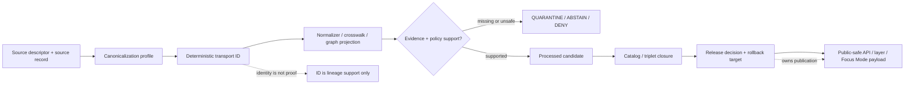

<!-- [KFM_META_BLOCK_V2]
doc_id: kfm://doc/NEEDS-VERIFICATION/packages-domains-roads-rail-trade-identity-readme
title: Roads, Rail, and Trade Routes Identity Package README
type: standard
version: v1
status: draft
owners: OWNER_TBD
created: 2026-06-14
updated: 2026-06-14
policy_label: public
related: [packages/domains/roads-rail-trade/README.md, packages/domains/roads-rail-trade/frontier_routes/README.md, packages/domains/roads-rail-trade/generalization/README.md, packages/domains/roads-rail-trade/graph_projection/README.md, docs/domains/roads-rail-trade/README.md, docs/domains/roads-rail-trade/ARCHITECTURE.md, docs/domains/roads-rail-trade/PROMOTION.md, schemas/contracts/v1/domains/roads-rail-trade/, contracts/domains/roads-rail-trade/, policy/domains/roads-rail-trade/, data/registry/roads-rail-trade/, data/receipts/roads-rail-trade/, data/proofs/roads-rail-trade/, release/]
tags: [kfm, roads-rail-trade, identity, deterministic-id, hashing, packages, transport, routes, corridors, evidence, provenance, rollback]
notes: ["README-like package document for roads/rail/trade identity helpers.", "Target path is user-requested and Directory Rules-compatible as a package/domain segment, but package metadata, imports, tests, CI, schemas, policies, source registries, emitted proofs, releases, and runtime behavior remain NEEDS VERIFICATION until checked in the live repo.", "This package may compute deterministic identifiers and hash material only; it must not become the canonical source registry, schema, contract, lifecycle data, proof, receipt, release, or policy authority."]
[/KFM_META_BLOCK_V2] -->

# Roads, Rail, and Trade Routes Identity Package

Deterministic identity helpers for roads, rail lines, historic routes, trade corridors, crossings, restrictions, access observations, and transport-derived release lineage.

<p>
  
  
  
  
  
  
</p>

> [!IMPORTANT]
> **Status:** PROPOSED package README  
> **Path:** `packages/domains/roads-rail-trade/identity/README.md`  
> **Owning responsibility root:** `packages/`  
> **Domain lane:** `roads-rail-trade`  
> **Repo implementation depth:** NEEDS VERIFICATION — package metadata, package manager, imports, tests, schemas, policies, source registries, CI workflows, graph adapters, emitted receipts, proof objects, release manifests, and runtime behavior were not inspected in this file-generation pass.

## Quick links

- [Scope](#scope)
- [Repo fit](#repo-fit)
- [Accepted inputs](#accepted-inputs)
- [Exclusions](#exclusions)
- [Identity responsibilities](#identity-responsibilities)
- [Canonicalization rules](#canonicalization-rules)
- [Identifier families](#identifier-families)
- [Source-role anti-collapse rules](#source-role-anti-collapse-rules)
- [Trust-boundary flow](#trust-boundary-flow)
- [Collision and supersession handling](#collision-and-supersession-handling)
- [Finite outcomes](#finite-outcomes)
- [Validation and quality gates](#validation-and-quality-gates)
- [Development rules](#development-rules)
- [Definition of done](#definition-of-done)
- [Verification checklist](#verification-checklist)
- [Rollback](#rollback)

---

## Scope

`packages/domains/roads-rail-trade/identity/` is the proposed home for reusable helpers that compute deterministic identity and digest material for the KFM Roads, Rail, and Trade Routes lane.

The helpers in this package may create stable identifiers, canonical digests, source-record fingerprints, route/corridor identity candidates, topology identity fragments, and lineage-aware hash material for transport-domain objects. They support deduplication, crosswalks, graph projection, review, catalog closure, release lineage, correction, and rollback.

```text
RAW -> WORK / QUARANTINE -> PROCESSED -> CATALOG / TRIPLET -> PUBLISHED
```

Identity helpers may support lifecycle transitions, but they do **not** approve promotion, publish data, define source authority, define policy, define schema authority, or replace EvidenceBundle support. A stable identifier is a locator and audit aid. It is not proof that a route, road, rail line, crossing, restriction, or corridor is true, current, legally accessible, public-safe, complete, or reviewed.

This package may support identity for:

- road segments, road routes, road names, milepost/linear-reference anchors, bridges, ferry points, and crossings;
- rail segments, rail lines, depots, stations, sidings, yards, junctions, crossings, and operator/status assertions;
- historic roads, trails, trade corridors, frontier routes, military roads, postal routes, stage routes, and migration/mobility corridors;
- restrictions, closures, seasonal conditions, access observations, regulatory contexts, and routing caveats;
- graph-projection node/edge candidates and topology relation candidates;
- public-safe layer features and generalized transport corridors;
- EvidenceBundle references, run receipts, redaction/generalization receipts, catalog records, release manifests, correction notices, and rollback targets when the owning roots provide those objects.

---

## Repo fit

```text
packages/domains/roads-rail-trade/identity/
```

This path is appropriate only for shared implementation code. The package may compute deterministic keys and digest material, but it must not become the source registry, route authority, graph authority, policy authority, proof store, release ledger, or public API.

| Relationship | Expected home | Boundary rule |
| --- | --- | --- |
| Identity helper code | `packages/domains/roads-rail-trade/identity/` | Computes deterministic keys, hashes, and identity explanations. |
| Domain package overview | `packages/domains/roads-rail-trade/README.md` | Explains the broader package lane and shared package boundaries. |
| Frontier route helpers | `packages/domains/roads-rail-trade/frontier_routes/` | May consume identity helpers for route/corridor candidates. |
| Public generalization helpers | `packages/domains/roads-rail-trade/generalization/` | May consume identity helpers for generalized public feature IDs. |
| Graph projection helpers | `packages/domains/roads-rail-trade/graph_projection/` | May consume identity helpers for node, edge, and topology candidate IDs. |
| Semantic contracts | `contracts/domains/roads-rail-trade/` or repo-confirmed equivalent | Owns object meaning and identity semantics. |
| Machine schemas | `schemas/contracts/v1/domains/roads-rail-trade/` or accepted ADR alternative | Owns ID fields, digest fields, payload shape, and validation schemas. |
| Source registry | `data/registry/roads-rail-trade/` or repo-confirmed registry home | Owns source IDs, roles, rights, cadence, caveats, and activation state. |
| Lifecycle data | `data/<phase>/roads-rail-trade/` | Stores RAW, WORK, QUARANTINE, PROCESSED, CATALOG, TRIPLET, and PUBLISHED records. |
| Receipts and proofs | `data/receipts/roads-rail-trade/`, `data/proofs/roads-rail-trade/`, or repo-confirmed trust-object homes | Persist process memory, proof packs, closure checks, and integrity artifacts. |
| Release and rollback | `release/` | Owns ReleaseManifest, PromotionDecision, CorrectionNotice, withdrawal, supersession, and rollback targets. |
| Policy gates | `policy/domains/roads-rail-trade/` or repo-confirmed policy home | Decides public exposure, sensitivity, stale-state behavior, access restrictions, and deny/restrict/abstain outcomes. |
| API/UI surfaces | governed API, `apps/`, `packages/maplibre/`, `packages/ui/`, or repo-confirmed homes | Consume released artifacts and EvidenceBundle-backed payloads; do not call internal identity helpers as public truth. |

> [!WARNING]
> Do not store source descriptors, source records, route releases, graph databases, proof packs, EvidenceBundles, release manifests, MapLibre styles, API route code, or policy rules in this package for convenience.

---

## Accepted inputs

Identity functions should accept explicit, canonicalizable values from governed callers. No helper should fetch live sources, infer rights from URLs, or treat route-name similarity as identity proof.

| Input family | Accepted examples | Required handling |
| --- | --- | --- |
| Source identity | `source_id`, `source_record_id`, source role, source version, retrieval digest | Preserve source identity and role; never infer authority from the ID string alone. |
| Object kind | `RoadSegment`, `RailSegment`, `HistoricRoute`, `TradeCorridor`, `Crossing`, `Restriction`, `AccessObservation`, `GraphNodeCandidate`, `GraphEdgeCandidate` | Include object kind or schema family in hash material to prevent cross-object collisions. |
| Spatial/linear identity material | geometry ref, CRS, source scale, route measure, milepost, stationing, generalized geometry ref, internal geometry digest | Keep exact/internal and public/generalized geometry identities separate. |
| Temporal identity material | source publication date, observed date, effective interval, route-use interval, restriction interval, retrieval time, run time, release time | Keep valid time, source time, run time, and release time distinct. |
| Evidence material | EvidenceRef, EvidenceBundle ID, evidence item digest, citation key, source excerpt ref | Use evidence references as support material; do not treat an ID as evidence closure. |
| Method material | normalization version, canonicalization profile, crosswalk version, projection spec hash, generalization profile | Include versioned method material when a method change can change identity. |
| Claim material | subject, predicate, object, source role, confidence, source caveat, temporal scope | Separate assertion identity from physical-feature identity. |
| Public-safe transform material | generalization method, redaction reason, policy decision ref, transform receipt ref, release ref | Public feature IDs must reflect public-safe geometry role and transform lineage. |

Missing source ID, object kind, canonicalization profile, temporal support, geometry role, or required method profile should produce a finite failure outcome rather than a guessed ID.

---

## Exclusions

| Do not put here | Correct home or owner | Why |
| --- | --- | --- |
| JSON Schemas for ID fields | `schemas/contracts/v1/domains/roads-rail-trade/` or accepted ADR alternative | Machine shape belongs in the schema authority root. |
| Semantic definitions for transport objects | `contracts/domains/roads-rail-trade/` or accepted ADR alternative | Object meaning belongs in contract docs. |
| Source descriptors, rights records, cadence, activation state | `data/registry/roads-rail-trade/` | Source identity and rights are governance data. |
| RAW, WORK, QUARANTINE, PROCESSED, CATALOG, TRIPLET, or PUBLISHED data | `data/<phase>/roads-rail-trade/` | Lifecycle data is not package source code. |
| Proof packs, run receipts, generalization receipts, catalog records | `data/proofs/`, `data/receipts/`, `data/catalog/`, or repo-confirmed homes | Trust objects must remain separately inspectable. |
| Release manifests, rollback cards, corrections, withdrawals | `release/` | Release authority remains separate from deterministic ID generation. |
| Policy decisions or Rego rules | `policy/domains/roads-rail-trade/` | Identity code may expose policy-relevant facts but must not decide policy. |
| Source fetchers, credentials, endpoint activation, watcher logic | `connectors/`, `pipelines/`, `pipeline_specs/`, `configs/`, `infra/` | Identity helpers must not activate sources or perform ingestion. |
| Public API routes, UI components, MapLibre styles, Focus Mode prompts | governed API/UI/runtime homes | Identity is not a public presentation or generated-answer surface. |
| Emergency routing, legal access advice, current navigation instructions | Out of scope / official operational systems | KFM transport identity supports evidence context, not operational commands. |

---

## Identity responsibilities

This package should make transport identity reproducible, boring, and auditable.

| Responsibility | Expected behavior | Failure mode to avoid |
| --- | --- | --- |
| Canonicalize hash material | Sort object keys, normalize text under explicit profile, preserve null/missing distinctions, use stable serialization | Same object hashes differently on each run. |
| Separate identity families | Include domain, object kind, schema/profile version, and identity family in every digest namespace | Road, rail, route, restriction, and graph objects collide. |
| Preserve source role | Carry source-role and authority-limit material when identity is source-derived | Administrative source, historic map, and graph projection collapse into one authority. |
| Preserve temporal scope | Include valid-time or interval fields where identity depends on time | Historic, current, planned, and restricted route states collapse. |
| Preserve spatial role | Separate exact/internal geometry, source geometry, derived geometry, and public generalized geometry | Public generalized corridor is mistaken for exact alignment. |
| Support crosswalks | Return source IDs, normalized IDs, public IDs, and relation IDs as separate fields | A crosswalk silently rewrites canonical identity. |
| Support corrections | Link corrected IDs to superseded IDs through explicit metadata, not mutation | Old release becomes unrecoverable. |
| Emit explanation | Return identity profile, fields used, fields omitted, digest algorithm, and reason codes | Maintainers cannot reproduce or review an ID. |

---

## Canonicalization rules

Identity output should be deterministic across operating systems, Python/Node versions, JSON serializers, and runtime environments.

Recommended canonicalization profile, pending repo verification:

```yaml
profile: roads_rail_trade_identity_v1
status: PROPOSED
algorithm: sha256
encoding: utf-8
serialization: canonical-json
rules:
  domain: roads-rail-trade
  object_kind: required
  identity_family: required
  schema_version: required
  source_id: required_when_source_derived
  source_record_id: required_when_available
  source_role: required_when_source_derived
  sort_object_keys: true
  preserve_null_vs_missing: true
  trim_outer_string_whitespace: true
  collapse_internal_string_whitespace: false
  unicode_normalization: NFC
  case_normalization: explicit_per_field
  numeric_precision: explicit_per_field
  crs_required_for_geometry_hashes: true
  linear_reference_profile_required_for_route_measure_hashes: true
  geometry_hash_source: normalized_wkb_or_repo_approved_equivalent
  include_profile_name_in_hash_material: true
```

> [!CAUTION]
> Geometry simplification, route-measure rounding, coordinate transformation, text case folding, abbreviation expansion, and historic-map georeferencing are identity-changing operations. They must be explicit, versioned, testable, and receipt-ready.

---

## Identifier families

| ID family | Purpose | Minimum material | Notes |
| --- | --- | --- | --- |
| `source_record_identity` | Stable key for a source-native road, rail, crossing, restriction, route, or corridor record | source ID, source version, source role, source record key, retrieval digest where applicable | Does not prove source authority, currency, or public-safety. |
| `transport_object_identity` | Stable key for normalized transport objects | domain, object kind, schema version, source identity, canonical object fields | Used before public release; may remain internal. |
| `route_identity` | Stable key for named route, rail line, trail, corridor, or historic path candidate | route name/label profile, source refs, temporal scope, route family, evidence refs | Name similarity is not identity proof. |
| `linear_segment_identity` | Stable key for road/rail/trail segment candidates | source segment key, endpoints or measures, CRS/profile, temporal scope, source role | Separate from route membership. |
| `crossing_identity` | Stable key for crossing or junction candidates | involved object refs, relation type, geometry/linear support, temporal scope, evidence refs | Grade/overpass/underpass ambiguity must remain visible. |
| `restriction_identity` | Stable key for access, closure, regulatory, seasonal, or restriction context | authority source, affected object refs, effective interval, restriction type, evidence refs | Context only; not emergency alert or legal advice. |
| `assertion_identity` | Stable key for evidence-bound transport claims | subject, predicate, object, source role, evidence refs, valid time | Assertions are not the same as physical objects. |
| `graph_node_identity` | Stable key for derived graph node candidates | node family, source object refs, geometry/linear support, projection spec hash | Graph node is a derived candidate, not source truth. |
| `graph_edge_identity` | Stable key for derived graph edge candidates | endpoints, mode, direction, topology rule, temporal scope, projection spec hash | Edge ID does not prove passability, legality, or current condition. |
| `public_feature_identity` | Stable key for public-safe released feature candidates | public geometry digest, generalization/redaction profile, policy decision ref, release ref | Must not imply exact alignment or sensitive location. |
| `run_identity` | Stable key for deterministic identity-generation runs | spec hash, input digests, code ref, parameters, actor/service | Persist as receipt material outside this package. |
| `correction_identity` | Stable key for correction or supersession notices | affected IDs, correction type, replacement refs, review ref, effective date | Supports rollback and public lineage. |

---

## Source-role anti-collapse rules

Transport identity often looks deceptively simple: two names, line geometries, or intersections may appear to match. The helper must preserve source character and role rather than flattening them.

| Source character | Can support | Must not be treated as |
| --- | --- | --- |
| Official road inventory | Administrative/network identity under stated authority and date | Universal legal access, condition, safety, or routing truth. |
| Rail operator/regulatory record | Operator/status/regulatory context under stated scope | Complete physical-condition, ownership, or service truth by itself. |
| Historic map route | Evidence of a mapped route at a source date/scale | Exact modern alignment or continuous route proof. |
| Archive narrative/local history | Interpretive context and candidate identity relation | Geometry or legal access without corroboration. |
| Survey/GPS/field observation | Observation evidence with collection caveats | Release-ready public identity without rights, sensitivity, and review controls. |
| Restriction/closure feed | Time-bounded operational context | Emergency authority, navigation instruction, or legal advice. |
| Graph projection | Derived topology relation | Canonical route identity, proof, release, or EvidenceBundle. |
| Public map layer | Released visualization artifact | Source registry, policy authority, or identity proof. |

---

## Trust-boundary flow



The ID helps KFM find, compare, deduplicate, crosswalk, supersede, and roll back transport objects. It does not move an object through the lifecycle by itself.

---

## Collision and supersession handling

| Condition | Outcome | Required response |
| --- | --- | --- |
| Same canonical material, same profile, same ID | `ANSWER` | Treat as deterministic match; preserve all source refs where applicable. |
| Same source record but changed canonical material | `NEEDS_REVIEW` | Compare source version, retrieval digest, field changes, and temporal support; emit receipt-ready diff. |
| Different objects produce same ID | `ERROR` | Block promotion; open collision incident; add regression fixture. |
| Same route name but different temporal/source support | `ABSTAIN` or `NEEDS_REVIEW` | Do not merge by name alone. |
| Same public corridor but different exact/internal alignment | `NEEDS_REVIEW` | Confirm generalization profile, evidence refs, and release lineage. |
| Schema or canonicalization profile changes | `ABSTAIN` until migration plan exists | Require migration/supersession note and test fixtures. |
| Corrected object replaces prior object | `ANSWER` with supersession metadata | Keep old ID queryable; link replacement and CorrectionNotice. |
| Rights, sensitivity, or policy changes affect public ID | `DENY` or `RESTRICT` until reviewed | Do not silently keep public layer visible. |

---

## Finite outcomes

Identity helpers should return explicit outcomes that callers can validate and persist in receipts.

| Outcome | Meaning | Caller expectation |
| --- | --- | --- |
| `ANSWER` | Deterministic ID or digest was produced. | Continue to validation; do not treat as release approval. |
| `ABSTAIN` | Required identity material is missing, conflicted, stale, or unsupported. | Do not guess identity or merge objects silently. |
| `DENY` | Policy or sensitivity context blocks output of the requested ID family. | Do not emit public or downstream identity. |
| `RESTRICT` | ID can be produced for restricted/internal use only. | Keep internal; route public use through policy/review. |
| `NEEDS_REVIEW` | Candidate ID exists but requires steward/domain review. | Create review task or quarantine candidate. |
| `ERROR` | Canonicalization, schema, digest, CRS, topology, or input-shape failure. | Fail closed and emit diagnostic reason. |

---

## Validation and quality gates

Minimum validation targets before this package is treated as active:

- [ ] Golden fixtures for road, rail, historic route, trade corridor, crossing, restriction, graph node, graph edge, and public feature ID families.
- [ ] Regression fixtures proving stable IDs across repeated runs and serializer versions.
- [ ] Collision fixtures proving cross-family namespace separation.
- [ ] Temporal fixtures proving historic/current/planned/restricted states do not collapse.
- [ ] Source-role fixtures proving official, historic, narrative, observed, regulatory, and derived sources stay distinct.
- [ ] Geometry fixtures proving exact/internal geometry IDs and public/generalized feature IDs stay separate.
- [ ] Crosswalk fixtures proving source ID, normalized ID, route ID, graph ID, and public ID remain separate fields.
- [ ] Failure fixtures for missing source ID, missing object kind, missing canonicalization profile, invalid CRS, unsupported topology, and unsupported public geometry.
- [ ] Policy-adjacent fixtures for `ANSWER`, `ABSTAIN`, `DENY`, `RESTRICT`, `NEEDS_REVIEW`, and `ERROR`.
- [ ] Receipt-ready output fixtures with input digests, profile name, profile version, algorithm, fields used, fields omitted, warnings, and reason codes.

> [!NOTE]
> The exact test runner and package manager remain NEEDS VERIFICATION. Use repo-native test commands once the mounted repository confirms them.

---

## Development rules

- Keep identity functions pure where practical: explicit inputs, deterministic outputs, no source fetching, no hidden clock, no environment-dependent behavior.
- Include `domain`, `identity_family`, `object_kind`, `schema_version`, and `profile` in hash material.
- Preserve null, missing, empty string, and unknown values as distinct states unless a contract explicitly says otherwise.
- Treat geometry identity as profile-dependent and CRS-dependent.
- Never transform exact/internal geometry into public geometry without an explicit generalization/redaction profile and receipt-ready metadata.
- Never merge roads, rail lines, historic routes, trade corridors, or restrictions by label similarity alone.
- Return reason codes and explanation metadata with every non-trivial outcome.
- Keep examples synthetic unless a source descriptor, rights status, sensitivity status, evidence support, and release state are verified.

---

## Definition of done

This README can be considered implementation-ready when:

- [ ] The package path is confirmed in the live repo.
- [ ] The owner is replaced with a real package/domain owner.
- [ ] Package metadata and import layout are confirmed.
- [ ] Contracts and schemas for identity-bearing transport objects are linked.
- [ ] Source registry and source-role vocabulary are linked.
- [ ] Policy gates for public IDs, restricted IDs, and sensitive geometry are linked.
- [ ] Test fixtures cover positive, negative, collision, stale-state, temporal, source-role, and public-safe geometry cases.
- [ ] Generated IDs are reproducible across local and CI environments.
- [ ] Receipt-ready metadata is emitted by identity runs or returned to callers that persist receipts.
- [ ] Corrections and supersession cases retain old IDs, replacement IDs, and rollback targets.
- [ ] No public client, MapLibre layer, Focus Mode answer, or API route treats a raw ID as proof or release approval.

---

## Verification checklist

- [ ] Confirm `packages/domains/roads-rail-trade/identity/` exists or create it in the same PR as this README.
- [ ] Confirm package manager and import style.
- [ ] Confirm adjacent package READMEs link to this file.
- [ ] Confirm identity schemas under the repo-approved schema home.
- [ ] Confirm semantic contracts for route, segment, crossing, restriction, graph node, graph edge, and public feature identity.
- [ ] Confirm source registry path and source-role vocabulary.
- [ ] Confirm public-safe geometry and generalization policies.
- [ ] Confirm tests and fixtures for all identifier families.
- [ ] Confirm generated receipts or receipt-ready outputs.
- [ ] Confirm release/rollback systems consume identity metadata without letting identity code publish directly.
- [ ] Add drift or ADR entry if any referenced path conflicts with mounted repo evidence.

---

## Rollback

Rollback is required if this package or README causes identity helpers to become a hidden authority for source truth, schema shape, policy decisions, release decisions, graph truth, public geometry, or EvidenceBundle closure.

Rollback target: `ROLLBACK_TARGET_TBD_AFTER_REPO_INSPECTION`

Rollback steps:

1. Revert package code and README changes that introduced the authority drift.
2. Preserve any emitted IDs, digests, fixtures, or receipts as audit artifacts if they influenced review or release work.
3. Add or update `docs/registers/DRIFT_REGISTER.md` if the issue involved path authority or parallel homes.
4. Add regression fixtures for the failure mode that triggered rollback.
5. Re-run identity, source-role, temporal, geometry, policy-adjacent, and release-lineage validation before reattempting promotion.

