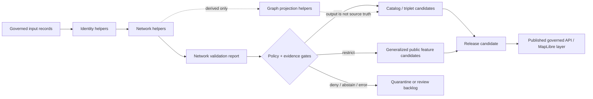

<!-- [KFM_META_BLOCK_V2]
doc_id: kfm://doc/NEEDS-VERIFICATION/packages-domains-roads-rail-trade-network-readme
title: Roads, Rail, and Trade Routes Network Package README
type: standard
version: v1
status: draft
owners: OWNER_TBD
created: 2026-06-14
updated: 2026-06-14
policy_label: public
related: [packages/domains/roads-rail-trade/README.md, packages/domains/roads-rail-trade/identity/README.md, packages/domains/roads-rail-trade/graph_projection/README.md, packages/domains/roads-rail-trade/generalization/README.md, packages/domains/roads-rail-trade/frontier_routes/README.md, docs/domains/roads-rail-trade/README.md, docs/domains/roads-rail-trade/ARCHITECTURE.md, docs/domains/roads-rail-trade/PROMOTION.md, schemas/contracts/v1/domains/roads-rail-trade/, contracts/domains/roads-rail-trade/, policy/domains/roads-rail-trade/, data/registry/roads-rail-trade/, data/receipts/roads-rail-trade/, data/proofs/roads-rail-trade/, release/]
tags: [kfm, roads-rail-trade, network, topology, roads, rail, trade-routes, transport, packages, evidence, provenance, rollback]
notes: ["README-like package document for roads/rail/trade network helpers.", "Target path is user-requested and Directory Rules-compatible as a package/domain segment, but package metadata, imports, tests, CI, schemas, policies, source registries, emitted proofs, releases, and runtime behavior remain NEEDS VERIFICATION until checked in the live repo.", "This package may assemble and validate network primitives only; it must not become the canonical source registry, schema, contract, lifecycle data, proof, receipt, release, API, UI, navigation, emergency-alert, or policy authority."]
[/KFM_META_BLOCK_V2] -->

# Roads, Rail, and Trade Routes Network Package

Reusable network and topology helpers for KFM roads, rail, historic routes, trade corridors, crossings, restrictions, and transport-derived graph inputs.

<p>
  
  
  
  
  
  
  
</p>

> [!IMPORTANT]
> **Status:** PROPOSED package README  
> **Path:** `packages/domains/roads-rail-trade/network/README.md`  
> **Owning responsibility root:** `packages/`  
> **Domain lane:** `roads-rail-trade`  
> **Repo implementation depth:** NEEDS VERIFICATION — package metadata, package manager, imports, tests, schemas, policies, source registries, CI workflows, graph adapters, emitted receipts, proof objects, release manifests, and runtime behavior were not inspected in this file-generation pass.

## Quick links

- [Scope](#scope)
- [Repo fit](#repo-fit)
- [Accepted inputs](#accepted-inputs)
- [Exclusions](#exclusions)
- [Network responsibilities](#network-responsibilities)
- [Network object families](#network-object-families)
- [Topology rules](#topology-rules)
- [Trust-boundary flow](#trust-boundary-flow)
- [Graph projection boundary](#graph-projection-boundary)
- [Public-safety and sensitivity controls](#public-safety-and-sensitivity-controls)
- [Finite outcomes](#finite-outcomes)
- [Validation and quality gates](#validation-and-quality-gates)
- [Development rules](#development-rules)
- [Definition of done](#definition-of-done)
- [Verification checklist](#verification-checklist)
- [Rollback](#rollback)

---

## Scope

`packages/domains/roads-rail-trade/network/` is the proposed home for reusable implementation helpers that assemble, normalize, inspect, and validate transport-network primitives for the KFM Roads, Rail, and Trade Routes lane.

This package may help represent networks for:

- roads, road segments, named routes, milepost anchors, bridges, crossings, ferries, restrictions, and access contexts;
- rail lines, depots, stations, junctions, yards, sidings, crossings, ownership/operator assertions, and status intervals;
- historic roads, trails, trade routes, postal routes, military roads, stage routes, frontier mobility corridors, and uncertain corridor reconstructions;
- network node/edge candidates that downstream graph projection can consume;
- public-safe, generalized, or withheld network representations used by released map layers and governed UI surfaces.

The package supports the KFM lifecycle, but does not own the lifecycle:

```text
RAW -> WORK / QUARANTINE -> PROCESSED -> CATALOG / TRIPLET -> PUBLISHED
```

Network helpers may prepare evidence-bound network objects for validation, catalog closure, graph projection, and public-safe layer generation. They do **not** publish data, activate sources, decide policy, approve routing claims, replace EvidenceBundle support, or turn derived graph edges into source truth.

> [!WARNING]
> KFM transport-network objects are evidence context, historical/geographic analysis, and governed publication material. They are **not** emergency alerts, navigation instructions, legal access advice, evacuation routing, current road-condition authority, or railroad-operating instructions.

---

## Repo fit

```text
packages/domains/roads-rail-trade/network/
```

This path is appropriate only for reusable package code. Network helpers may shape and validate in-memory or serialized network primitives, but trust-bearing records remain in their owning roots.

| Relationship | Expected home | Boundary rule |
| --- | --- | --- |
| Network helper code | `packages/domains/roads-rail-trade/network/` | Builds and validates network primitives for package consumers. |
| Domain package overview | `packages/domains/roads-rail-trade/README.md` | Explains the broader implementation package lane. |
| Deterministic identity helpers | `packages/domains/roads-rail-trade/identity/` | Computes IDs and digest material consumed by network helpers. |
| Graph projection helpers | `packages/domains/roads-rail-trade/graph_projection/` | Consumes network primitives to produce graph nodes, graph edges, and triplet candidates. |
| Public generalization helpers | `packages/domains/roads-rail-trade/generalization/` | Produces public-safe generalized geometry and representation support. |
| Historic/frontier route helpers | `packages/domains/roads-rail-trade/frontier_routes/` | Handles corridor uncertainty and historical route reconstruction logic. |
| Semantic contracts | `contracts/domains/roads-rail-trade/` or repo-confirmed equivalent | Owns meaning of road, rail, route, crossing, restriction, access, and network objects. |
| Machine schemas | `schemas/contracts/v1/domains/roads-rail-trade/` or accepted ADR alternative | Owns field shape and validation schemas. |
| Source registry | `data/registry/roads-rail-trade/` or repo-confirmed registry home | Owns source IDs, roles, rights, cadence, activation status, and caveats. |
| Lifecycle data | `data/<phase>/roads-rail-trade/` | Stores source, work, quarantine, processed, catalog, triplet, and published records. |
| Receipts and proofs | `data/receipts/roads-rail-trade/`, `data/proofs/roads-rail-trade/`, or repo-confirmed trust-object homes | Persist run memory, topology checks, source coverage, proof packs, and closure checks. |
| Release and rollback | `release/` | Owns promotion decisions, release manifests, correction notices, withdrawals, and rollback targets. |
| Policy gates | `policy/domains/roads-rail-trade/` or repo-confirmed policy home | Decides public exposure, sensitivity, restrictions, stale-state behavior, and deny/restrict/abstain outcomes. |
| API/UI surfaces | governed API, `apps/`, `packages/maplibre/`, `packages/ui/`, or repo-confirmed homes | Consume released artifacts and EvidenceBundle-backed payloads; do not treat network helpers as public truth. |

---

## Accepted inputs

Network helpers should accept already-admitted, already-normalized, explicitly scoped records from governed callers. They should not fetch sources, scrape data, assume rights, or infer official status from a label.

| Input family | Accepted examples | Required handling |
| --- | --- | --- |
| Segment records | road segment, rail segment, trail segment, ferry segment, historic corridor segment | Preserve source ID, object kind, temporal scope, geometry role, and uncertainty. |
| Node records | intersection, crossing, depot, junction, terminus, waypoint, milepost anchor, station point | Keep physical nodes, administrative nodes, and graph nodes separate. |
| Route membership | route ID, segment ID, sequence, direction, measure interval, validity interval | Do not treat membership as proof of current passability or legal access. |
| Crossing relations | road-road, road-rail, rail-rail, bridge, grade separation, ferry, interchange, junction | Preserve relation type and evidence support; do not collapse uncertain crossing forms. |
| Restriction context | closure, seasonal restriction, legal restriction, weight/height limit, access note, source caveat | Context only; not operational routing or emergency instruction. |
| Temporal material | observed date, effective interval, source publication date, route-use interval, release time | Keep valid time, source time, run time, and release time distinct. |
| Geometry material | exact/internal geometry ref, source geometry digest, generalized public geometry ref, linear reference material | Keep exact/internal and public-safe geometry identities separate. |
| Evidence material | EvidenceRef, EvidenceBundle ID, citation key, source role, source excerpt ref, proof object ref | Network output must remain evidence-bound and cite-or-abstain capable. |
| Method material | topology profile, snapping tolerance, linear-reference profile, graph-projection profile, generalization profile | Version every method that can change topology or public representation. |

Missing source identity, object kind, temporal scope, geometry role, or evidence support should produce a finite failure outcome rather than a guessed network relation.

---

## Exclusions

| Do not put here | Correct home or owner | Why |
| --- | --- | --- |
| Source fetchers, endpoint clients, credentials, watchers | `connectors/`, `pipelines/`, `pipeline_specs/`, `configs/`, `infra/` | Network helpers must not activate or fetch sources. |
| JSON Schemas for network objects | `schemas/contracts/v1/domains/roads-rail-trade/` or accepted ADR alternative | Machine shape belongs in schema authority. |
| Semantic definitions for network objects | `contracts/domains/roads-rail-trade/` or accepted ADR alternative | Object meaning belongs in contracts. |
| Source descriptors and rights/cadence metadata | `data/registry/roads-rail-trade/` | Source authority and rights are governance data. |
| Lifecycle datasets | `data/<phase>/roads-rail-trade/` | Lifecycle data is not package source code. |
| Proof packs, receipts, catalog records | `data/proofs/`, `data/receipts/`, `data/catalog/`, or repo-confirmed homes | Trust objects must remain independently inspectable. |
| Release manifests and rollback cards | `release/` | Release authority remains separate from package logic. |
| Policy rules and public-exposure decisions | `policy/domains/roads-rail-trade/` | Policy is not helper code. |
| Public MapLibre styles, API routes, Focus Mode prompts | governed API/UI/runtime homes | Presentation and runtime surfaces consume governed outputs. |
| Current navigation, dispatch, emergency routing, legal advice | Out of scope / official systems | KFM is not the authoritative operational system for movement decisions. |

---

## Network responsibilities

| Responsibility | Package behavior | Guardrail |
| --- | --- | --- |
| Normalize network primitives | Create consistent segment, node, relation, and route-membership structures from governed inputs | Never rewrite source meaning silently. |
| Validate topology candidates | Detect dangling endpoints, duplicate segments, impossible relation types, missing temporal scope, and inconsistent geometry roles | Findings are validation outputs, not automatic corrections. |
| Preserve uncertainty | Carry confidence, evidence class, route-status uncertainty, historic-map uncertainty, and geometry uncertainty | Do not convert uncertainty into false precision. |
| Support multimodal relations | Keep road, rail, trail, ferry, bridge, crossing, corridor, and restriction relations distinct | Do not collapse all movement into one edge type. |
| Support temporal networks | Allow historic, current, planned, abandoned, seasonal, restricted, and superseded states | Do not overwrite prior network states. |
| Support public-safe delivery | Mark public geometry role, sensitivity state, generalization profile, and release refs | Do not expose exact sensitive or rights-unclear geometry. |
| Support graph projection | Produce graph-ready primitives with method metadata and evidence support | Graph projection is downstream and derived, not source truth. |
| Support correction and rollback | Preserve previous IDs, source refs, release refs, and correction lineage | Never mutate released network meaning without a correction path. |

---

## Network object families

| Object family | Purpose | Typical fields | Notes |
| --- | --- | --- | --- |
| `NetworkSegment` | Normalized segment candidate for road, rail, trail, ferry, or corridor geometry | `segment_id`, `mode`, `source_ref`, `geometry_ref`, `valid_time`, `status`, `evidence_refs` | Segment geometry does not prove public access or current passability. |
| `NetworkNode` | Physical or interpreted network node candidate | `node_id`, `node_kind`, `geometry_ref`, `source_ref`, `evidence_refs` | Keep physical nodes separate from derived graph nodes. |
| `RouteMembership` | Relationship between route/corridor and segments | `route_id`, `segment_id`, `sequence`, `direction`, `measure_interval`, `valid_time` | Route names and segment membership need source support. |
| `CrossingRelation` | Connection, overlap, crossing, grade separation, junction, bridge, or ferry relation | `relation_id`, `relation_kind`, `from_ref`, `to_ref`, `grade_context`, `evidence_refs` | Crossing type uncertainty must remain visible. |
| `RestrictionContext` | Evidence-bound operational/regulatory/contextual restriction attached to a network object | `restriction_id`, `restriction_kind`, `affected_ref`, `authority_source`, `effective_time`, `evidence_refs` | Context only; no emergency alert or legal advice. |
| `HistoricCorridorCandidate` | Evidence-bound generalized or uncertain historic route/corridor | `corridor_id`, `source_refs`, `certainty`, `temporal_scope`, `public_geometry_ref` | Exact reconstruction should usually be avoided unless evidence supports it. |
| `NetworkValidationReport` | Structured result of network checks | `run_id`, `input_refs`, `findings`, `finite_outcome`, `receipt_ref` | Report belongs in receipts/proofs when persisted. |
| `PublicNetworkFeature` | Released or candidate public-safe feature representation | `public_feature_id`, `release_ref`, `generalization_profile`, `policy_decision_ref`, `evidence_refs` | Public geometry must not imply exact/internal geometry. |

---

## Topology rules

Topology rules should be explicit, versioned, and test-backed. They should produce reviewable findings rather than silent geometry edits.

| Rule | Expected behavior | Reason code examples |
| --- | --- | --- |
| Required source support | Every network object has source identity and evidence refs | `missing_source_ref`, `missing_evidence_ref` |
| Required geometry role | Every geometry-bearing object declares exact/source/derived/public/generalized role | `missing_geometry_role`, `unsafe_geometry_role` |
| Required temporal scope | Every network object declares a valid time or interval when time affects interpretation | `missing_valid_time`, `temporal_scope_conflict` |
| CRS/profile explicitness | Geometry and linear reference operations declare CRS and method profile | `missing_crs`, `missing_linear_reference_profile` |
| Snap tolerance explicitness | Snapping, joining, and endpoint clustering require a named tolerance profile | `implicit_snap_tolerance` |
| No silent grade collapse | Crossing relations distinguish at-grade, bridge, tunnel, overpass, underpass, ferry, unknown | `grade_context_unknown`, `crossing_type_conflict` |
| No source-role collapse | Administrative, regulatory, historic, modeled, derived, and operational context sources remain distinct | `source_role_collapse` |
| No public exact exposure | Public-safe outputs reference generalized or approved geometry and policy decision | `exact_geometry_public_exposure`, `missing_generalization_receipt` |
| Graph derived status | Graph nodes/edges declare projection spec and derived status | `missing_projection_spec`, `graph_as_truth_risk` |
| Correction lineage | Superseded network objects point to correction/rollback targets | `missing_correction_ref`, `unlinked_supersession` |

---

## Trust-boundary flow



The diagram is architectural and PROPOSED for this package README. It does not prove that these calls, objects, tests, or runtime paths already exist in the live repository.

---

## Graph projection boundary

`network/` and `graph_projection/` should remain separate.

| Concern | `network/` | `graph_projection/` |
| --- | --- | --- |
| Primary job | Normalize and validate network primitives | Create derived graph nodes, edges, relations, and triplet candidates |
| Truth posture | Evidence-bound transport objects and relations | Derived graph representation from network objects |
| Typical output | `NetworkSegment`, `NetworkNode`, `RouteMembership`, `CrossingRelation`, validation report | `GraphNodeCandidate`, `GraphEdgeCandidate`, topology/triplet payload, graph projection report |
| Risk | False precision, source-role collapse, exact public exposure | Treating derived graph as source truth |
| Required metadata | source refs, evidence refs, geometry role, temporal scope, topology profile | projection spec hash, input network refs, evidence refs, derived status, rollback ref |

A graph edge may be useful for routing-style analysis, connectivity visualization, or Focus Mode explanation. It must still be marked as a derived product and must not assert legal, safe, current, or official movement authority unless a governed release explicitly supports that limited claim.

---

## Public-safety and sensitivity controls

Transport networks can expose sensitive infrastructure, private access details, cultural routes, archaeological context, emergency response assumptions, or operational constraints. This package should therefore fail closed when public safety, rights, or exact-location posture is unclear.

| Risk | Required behavior |
| --- | --- |
| Exact sensitive infrastructure exposure | Require policy decision and public-safe geometry role before public output. |
| Historic/cultural corridor precision | Prefer generalized corridor representation when exact alignment is uncertain or sensitive. |
| Archaeology-adjacent route context | Cite as historical context only; deny exact archaeological coordinates by default. |
| Current road closure or hazard context | Treat as contextual source record only; do not emit emergency alert or routing instruction. |
| Rail operational detail | Avoid operationally sensitive or unsafe public detail unless source rights, policy, and release state support exposure. |
| Private access / land ownership implications | Avoid person-parcel or private-access conclusions without appropriate evidence and policy review. |
| Derived graph overclaiming | Mark graph outputs as derived, method-bound, and release-scoped. |

---

## Finite outcomes

Network helpers should return bounded outcomes that callers can test and policy gates can interpret.

| Outcome | Meaning | Typical caller action |
| --- | --- | --- |
| `PASS` | Network primitive or validation check is structurally acceptable under the supplied profile | Continue to catalog/proof/release candidate flow. |
| `RESTRICT` | Object may be usable only with redaction, generalization, access control, or review | Route to policy review or public-safe transform. |
| `DENY` | Object should not be used for the requested public or downstream purpose | Keep in quarantine or blocked backlog. |
| `ABSTAIN` | Evidence, source role, geometry role, temporal scope, or rights support is insufficient | Request more evidence or source registry support. |
| `ERROR` | Tool, input, schema, profile, or runtime failure | Stop, emit diagnostics, and do not promote. |

---

## Validation and quality gates

Before this package is considered active, the lane should have tests and fixtures that prove behavior without live network access.

| Gate | Minimum check | Status |
| --- | --- | --- |
| Package import | Import path and package metadata are repo-confirmed | NEEDS VERIFICATION |
| Schema alignment | Network object examples validate against accepted schemas | NEEDS VERIFICATION |
| Contract alignment | Terms match transport contracts and source-role vocabulary | NEEDS VERIFICATION |
| Fixture coverage | Valid, invalid, sensitive, historic, uncertain, restricted, and graph-derived fixtures exist | NEEDS VERIFICATION |
| Topology checks | Dangling endpoints, crossing ambiguity, temporal conflict, geometry-role errors, and source-role collapse are tested | PROPOSED |
| Public-safe checks | Exact geometry cannot become public output without policy/release refs | PROPOSED |
| Evidence checks | Network objects without EvidenceRef/EvidenceBundle support cannot pass release-oriented validation | PROPOSED |
| Rollback checks | Supersession and correction lineage is preserved in outputs | PROPOSED |
| No live source activation | Tests run offline using fixtures | PROPOSED |

Suggested command placeholders after repo inspection:

```bash
# NEEDS VERIFICATION: adapt to the repo's actual package manager and test runner.
pytest tests/domains/roads-rail-trade/network
```

```bash
# NEEDS VERIFICATION: adapt to the repo's actual schema validator entry point.
python tools/validators/validate_contract_fixtures.py \
  --domain roads-rail-trade \
  --family network
```

---

## Development rules

- Keep functions side-effect-light and deterministic.
- Require explicit profiles for topology, snapping, linear referencing, CRS transformation, and public generalization.
- Do not fetch live sources or call external services from network helpers.
- Do not hide uncertainty through snapping, simplification, route-name matching, or graph projection.
- Keep road, rail, ferry, trail, historic corridor, restriction, and graph-derived object types separate.
- Return reason codes and evidence references with failures.
- Treat public-safe representation as a separate output with a policy and release context.
- Keep generated graph artifacts downstream from evidence-bound network objects.
- Prefer small fixtures that exercise one governance rule at a time.
- Update this README when package boundaries, object families, schema names, or policy gates change materially.

---

## Definition of done

- [ ] Target path exists in the live repo and is accepted by Directory Rules review.
- [ ] Package metadata and imports are verified.
- [ ] Owners are assigned.
- [ ] Semantic contracts for network object families exist or are explicitly scheduled.
- [ ] Machine schemas for network objects exist or are explicitly scheduled.
- [ ] Source-role vocabulary is shared with the lane source registry.
- [ ] Test fixtures cover valid, invalid, sensitive, historic, uncertain, restricted, and derived-graph cases.
- [ ] Network validation emits finite outcomes and reason codes.
- [ ] Public geometry exposure requires policy and release support.
- [ ] Graph projection consumers cannot treat network outputs as source truth.
- [ ] Receipts/proofs/releases are written outside this package by their owning systems.
- [ ] Rollback and correction lineage is preserved.

---

## Verification checklist

- [ ] Confirm adjacent package READMEs link to this README.
- [ ] Confirm `packages/domains/roads-rail-trade/network/` is the accepted package home.
- [ ] Confirm import path and package naming convention.
- [ ] Confirm object-family names against contracts.
- [ ] Confirm schema-home path and schema version.
- [ ] Confirm policy package path and finite outcome vocabulary.
- [ ] Confirm source registry fields for source role, source cadence, source rights, and source authority limits.
- [ ] Confirm graph projection package consumes network outputs without claiming source truth.
- [ ] Confirm public-safe generalization package handles geometry exposure and receipts.
- [ ] Confirm tests run offline from fixtures.
- [ ] Confirm release, correction, and rollback homes.

---

## Rollback

Rollback is required if this package begins to own data lifecycle records, schema authority, source registry records, policy decisions, public API output, MapLibre styles, release manifests, proof packs, receipts, emergency-alert behavior, navigation instructions, or legal-access claims.

Rollback target: restore the previous package tree and move misplaced trust-bearing files back to their owning roots:

- source registry material -> `data/registry/roads-rail-trade/`
- lifecycle records -> `data/<phase>/roads-rail-trade/`
- schemas -> `schemas/contracts/v1/domains/roads-rail-trade/`
- contracts -> `contracts/domains/roads-rail-trade/`
- policy -> `policy/domains/roads-rail-trade/`
- receipts/proofs/catalog records -> `data/receipts/`, `data/proofs/`, `data/catalog/`
- release decisions, corrections, withdrawals, and rollback cards -> `release/`

Record rollback evidence in the lane change log and verification backlog after the live repo paths are confirmed.

---

<details>
<summary>Appendix — Maintainer notes</summary>

### Open questions

- NEEDS VERIFICATION: accepted Python/TypeScript package naming and import path.
- NEEDS VERIFICATION: canonical schema names for `NetworkSegment`, `NetworkNode`, `RouteMembership`, `CrossingRelation`, `RestrictionContext`, and `NetworkValidationReport`.
- NEEDS VERIFICATION: whether transport docs use `roads-rail-trade` or `transport` as the canonical documentation slug.
- NEEDS VERIFICATION: exact policy outcome vocabulary and policy engine entry point.
- NEEDS VERIFICATION: whether topology validation reports persist as receipts, proofs, validation artifacts, or all three under different conditions.

### Non-goals

- No live source fetching.
- No public route publication.
- No route optimization.
- No emergency alerts.
- No turn-by-turn navigation.
- No legal access advice.
- No railroad operational instruction.
- No source-rights inference.
- No public exact-location exposure without policy/release support.

</details>

