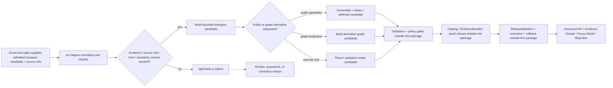

<!-- [KFM_META_BLOCK_V2]
doc_id: kfm://doc/NEEDS-VERIFICATION/packages-domains-roads-rail-trade-src-readme
title: Roads / Rail / Trade Source Tree README
type: standard
version: v1
status: draft
owners: OWNER_TBD
created: 2026-06-14
updated: 2026-06-14
policy_label: public
related: [packages/domains/roads-rail-trade/README.md, packages/domains/roads-rail-trade/src/roads_rail_trade/README.md, packages/domains/roads-rail-trade/identity/README.md, packages/domains/roads-rail-trade/network/README.md, packages/domains/roads-rail-trade/graph_projection/README.md, packages/domains/roads-rail-trade/generalization/README.md, packages/domains/roads-rail-trade/frontier_routes/README.md, docs/domains/roads-rail-trade/README.md, contracts/domains/roads-rail-trade/, schemas/contracts/v1/domains/roads-rail-trade/, policy/domains/roads-rail-trade/, data/registry/roads-rail-trade/, data/receipts/roads-rail-trade/, data/proofs/roads-rail-trade/, release/]
tags: [kfm, roads-rail-trade, src, packages, python, roads, rail, trade-routes, transport, graph-projection, public-generalization, evidence, governance]
notes: ["README-like source-tree entrypoint for the Roads / Rail / Trade Routes package.", "Target path is user-requested and Directory Rules-compatible as source code under the packages responsibility root, but package metadata, import style, test runner, schema references, policy bindings, source registries, graph projections, public generalization, receipts, proofs, releases, and runtime behavior remain NEEDS VERIFICATION until a mounted repo confirms them.", "This directory may contain implementation source only; it must not become a schema, contract, policy, source-registry, lifecycle-data, EvidenceBundle, graph-truth, public-map, receipt, proof, release, route-instruction, access-law, or publication authority."]
[/KFM_META_BLOCK_V2] -->

# Roads / Rail / Trade Source Tree

Source-code staging area for the Roads, Rail, and Trade Routes package, keeping transport implementation helpers under the `packages/` responsibility root and away from policy, schema, source-registry, lifecycle-data, proof, receipt, release, API, and UI authority.

<p>
  
  
  
  
  
  
  
</p>

> [!IMPORTANT]
> **Status:** PROPOSED source-tree README  
> **Path:** `packages/domains/roads-rail-trade/src/README.md`  
> **Owning responsibility root:** `packages/`  
> **Package lane:** `packages/domains/roads-rail-trade/`  
> **Primary import namespace:** `roads_rail_trade` — NEEDS VERIFICATION against package metadata  
> **Default posture:** evidence-first, source-role-preserving, public-safe, non-operational, and fail-closed for access, restriction, infrastructure sensitivity, Indigenous/cultural route sensitivity, historic uncertainty, rights ambiguity, and unreviewed exact geometry.  
> **Repo implementation depth:** NEEDS VERIFICATION — package metadata, import paths, tests, CI, schemas, policies, source registries, emitted receipts, proof objects, graph exports, release manifests, MapLibre layer bindings, governed API routes, and runtime behavior were not inspected in this file-generation pass.

## Quick links

- [Scope](#scope)
- [Repo fit](#repo-fit)
- [Accepted inputs](#accepted-inputs)
- [Exclusions](#exclusions)
- [Source-tree responsibilities](#source-tree-responsibilities)
- [Transport source-role posture](#transport-source-role-posture)
- [Public-safety and public-geometry posture](#public-safety-and-public-geometry-posture)
- [Proposed layout](#proposed-layout)
- [Trust-boundary flow](#trust-boundary-flow)
- [Finite outcomes](#finite-outcomes)
- [Testing posture](#testing-posture)
- [Development rules](#development-rules)
- [Definition of done](#definition-of-done)
- [Verification checklist](#verification-checklist)
- [Rollback](#rollback)

---

## Scope

`packages/domains/roads-rail-trade/src/` is the source-code home for the Roads, Rail, and Trade Routes package lane.

This directory may contain importable implementation modules and package-internal helper code for:

- source-scoped transport candidate normalization;
- deterministic identity helpers for road segments, rail segments, corridors, routes, crossings, facilities, restrictions, status events, and graph candidates;
- route membership and network-topology helper logic;
- graph-projection candidate preparation that remains downstream of source records;
- public-safe geometry generalization and withholding support;
- historic/frontier-route uncertainty helpers;
- source-role anti-collapse checks;
- temporal normalization that keeps source time, observation time, valid/effective time, status time, retrieval time, run time, review time, release time, correction time, and rollback time distinct where material;
- release-candidate and Evidence Drawer payload helper structures for governed callers;
- deterministic, no-network functions that can be proven with fixtures and tests.

The source tree is implementation support only. It does not decide what is true, legally authoritative, operationally safe, public, released, routeable, traversable, accessible, current, policy-allowed, or evidence-complete.

```text
RAW -> WORK / QUARANTINE -> PROCESSED -> CATALOG / TRIPLET -> PUBLISHED
```

> [!WARNING]
> This directory must not fetch live transport sources directly, store lifecycle data, publish map layers, claim legal access, provide operational routing or emergency directions, collapse graph projections into canonical truth, or expose exact sensitive geometry. It prepares deterministic helper behavior for the proper KFM authorities to validate, review, restrict, publish, correct, or roll back.

---

## Repo fit

| Concern | This source tree owns | It must not own |
| --- | --- | --- |
| Responsibility root | Package source under `packages/` | Root-level domain authority or lifecycle authority |
| Domain segment | `roads-rail-trade` implementation helpers | Separate root folders for `roads`, `rail`, `transport`, `routes`, or `trade_routes` |
| Import namespace | `roads_rail_trade/` — proposed package module | Schemas, contracts, policies, source registries, releases, receipts, proofs |
| Trust role | Deterministic transformations, classifiers, candidate builders, topology helpers, public-safe derivative helpers | Evidence authority, source authority, graph truth, review authority, publication authority |
| Runtime posture | No-network code by default; explicit inputs and finite outputs | Hidden live calls, credentials, background sync, direct map publication, or ambient global state |

Related homes:

- `packages/domains/roads-rail-trade/README.md` — package-level orientation.
- `packages/domains/roads-rail-trade/src/roads_rail_trade/README.md` — import-namespace orientation.
- `packages/domains/roads-rail-trade/identity/README.md` — deterministic identity helper boundary.
- `packages/domains/roads-rail-trade/network/README.md` — road/rail/corridor topology helper boundary.
- `packages/domains/roads-rail-trade/graph_projection/README.md` — derived graph-projection helper boundary.
- `packages/domains/roads-rail-trade/generalization/README.md` — public-safe geometry and redaction helper boundary.
- `packages/domains/roads-rail-trade/frontier_routes/README.md` — historic/frontier corridor uncertainty helper boundary.
- `docs/domains/roads-rail-trade/` — domain documentation and steward-facing explanation.
- `contracts/domains/roads-rail-trade/` — semantic contracts if this repo keeps semantic Markdown there.
- `schemas/contracts/v1/domains/roads-rail-trade/` — proposed machine-readable schema home; NEEDS VERIFICATION against current repo convention and ADRs.
- `policy/domains/roads-rail-trade/` — allow / deny / restrict / abstain decision logic for transport publication and exposure.
- `data/registry/roads-rail-trade/` — source identity, source roles, rights, cadence, caveats, sensitivity defaults, and activation status.
- `data/<phase>/roads-rail-trade/` — lifecycle data by phase.
- `data/catalog/.../roads-rail-trade/`, `data/triplets/.../roads-rail-trade/`, `data/receipts/roads-rail-trade/`, and `data/proofs/roads-rail-trade/` — trust-bearing catalog, graph/triplet, receipt, and proof objects.
- `release/` — promotion decisions, release manifests, correction notices, withdrawals, supersession records, and rollback targets.
- `apps/`, `ui/`, `web/`, `packages/maplibre/`, or repo-confirmed equivalents — governed API and public UI consumers.

---

## Accepted inputs

Code under this directory should accept caller-provided, already-admitted, fixture-scoped, review-scoped, release-candidate-scoped, or test-scoped values only.

| Input family | Accepted examples | Required handling |
| --- | --- | --- |
| Source references | Source ID, source descriptor ref, source role, rights ref, steward ref, dataset version, retrieval ref, citation key | Preserve source role and source limits; do not infer stronger authority from convenient attributes. |
| Road candidates | road segment, highway designation, jurisdiction, local road name, bridge/crossing relation, restriction/status event | Keep geometry, designation, jurisdiction, restriction, and status as separate claims. |
| Rail candidates | line segment, branch, siding, spur, yard, depot, crossing, operator assignment, abandonment/status event | Keep alignment, operator, ownership, service, and abandonment temporal events distinct. |
| Historic/frontier route candidates | wagon road, stage road, military road, cattle trail, mail route, emigrant route, settlement corridor, market/grain/livestock corridor | Preserve source scale, uncertainty, date, interpretation role, and public-generalization need. |
| Trade/logistics candidates | freight corridor, market route, commodity movement corridor, modeled flow, observed flow, administrative designation | Keep modeled flow, observed movement, legal status, and public map layer separate. |
| Facility candidates | bridge, ferry, ford, crossing, culvert, tunnel, terminal, depot, station, junction, continuity-critical facility | Apply sensitivity and public-exposure checks before public geometry or labels. |
| Geometry context | internal geometry ref, source geometry ref, CRS, source scale, route measure, linear referencing basis, geometry confidence, public geometry ref | Keep exact/internal geometry and public-safe geometry separate. |
| Temporal context | observed date, source date, built/opened date, closed/abandoned date, effective interval, restriction interval, retrieval time, run time, review time, release time | Do not collapse material time dimensions into one timestamp. |
| Evidence context | EvidenceRef, EvidenceBundle ref, citation target, review ref, proof ref, source descriptor ref | Do not pretend unresolved EvidenceRefs are evidence. |
| Policy/release context | sensitivity label, public-safe class, release ref, rollback ref, reason code, reviewer/steward decision ref | Public-safe derivatives require explicit allow/restrict context from governed callers. |

Missing source role, evidence context, temporal semantics, rights/sensitivity context, or public-safe geometry context should produce a finite failure outcome rather than a silent best-effort public output.

---

## Exclusions

Do **not** put these in `packages/domains/roads-rail-trade/src/`:

| Excluded content | Correct home |
| --- | --- |
| Semantic contracts | `contracts/domains/roads-rail-trade/` or repo-confirmed contract home |
| JSON Schema / machine schemas | `schemas/contracts/v1/domains/roads-rail-trade/` or repo-confirmed schema home |
| Policy rules | `policy/domains/roads-rail-trade/` or repo-confirmed policy home |
| Source descriptors, rights registers, sensitivity registers, cadence registers | `data/registry/roads-rail-trade/` or repo-confirmed registry home |
| Raw/work/quarantine/processed/catalog/triplet/published data | `data/<phase>/roads-rail-trade/` and `data/catalog/.../roads-rail-trade/` as appropriate |
| EvidenceBundles, catalog records, graph/triplet records | `data/catalog/...`, `data/triplets/...`, or repo-confirmed trust-object homes |
| Receipts and proof objects | `data/receipts/...`, `data/proofs/...`, or repo-confirmed receipt/proof homes |
| Release manifests, correction notices, rollback records, withdrawal records | `release/` |
| Public API routes or UI components | `apps/`, `packages/api/`, `packages/ui/`, `packages/maplibre/`, `ui/`, `web/`, or repo-confirmed homes |
| Live source connectors | `connectors/`, `pipelines/`, or repo-confirmed source connector home |
| Tests and fixtures | `tests/domains/roads-rail-trade/` and `fixtures/domains/roads-rail-trade/` or repo-confirmed equivalents |
| Operational navigation or emergency routing logic | Outside this package; official operational systems and public-safety authorities |

---

## Source-tree responsibilities

Code in this source tree should be small, explicit, deterministic, and testable. Prefer pure functions and typed structures that accept all trust-bearing context as parameters.

| Responsibility | Expected behavior | Failure posture |
| --- | --- | --- |
| Normalize | Convert admitted candidate fields into package-internal value shapes while preserving source-native values and caveats | `ERROR` for malformed input; `ABSTAIN` for unsupported inference |
| Classify source role | Preserve source-role hints and flag unresolved authority ambiguity | `ABSTAIN` when role is missing; `DENY` for public output when role blocks release |
| Maintain deterministic identity | Build stable IDs from source ID, object family, spatial/linear scope, temporal scope, version, and digest-bearing inputs | `ERROR` when ID material is incomplete or non-deterministic |
| Preserve time semantics | Keep source, observation, valid/effective, status, retrieval, run, review, release, correction, and rollback times distinct where material | `ABSTAIN` when time support is too weak for the requested claim |
| Prepare network candidates | Build road/rail/corridor node-edge-membership candidates without replacing source records | `ABSTAIN` when topology is unsupported or contradictory |
| Prepare graph-projection candidates | Build derived traversal/corridor reasoning artifacts with explicit derivative status | `DENY` or `ABSTAIN` when graph output could be mistaken for canonical truth |
| Prepare public-safe geometry | Generalize, redact, or withhold output candidates only when caller-provided policy/release context allows | `DENY` when exact or sensitive exposure is blocked |
| Explain limitations | Return structured caveats for Evidence Drawer / review surfaces | `ABSTAIN` when limitations cannot be stated from inputs |
| Support rollback | Preserve stable input/output references, method versions, and transformation reasons | `ERROR` when outputs cannot be traced |

---

## Transport source-role posture

The most important transport package rule is to keep source character visible.

| Source character | Can support | Must not be treated as |
| --- | --- | --- |
| Official road inventory row | Administrative/network record under stated date and authority | Universal legal access, private-property permission, or live condition truth |
| Rail operator/regulatory row | Operator/status/regulatory context under stated scope | Complete physical-condition, ownership, or service truth by itself |
| Historic map route | Evidence of a mapped or interpreted route at source date/scale | Exact modern geometry or proof that a route existed continuously |
| Archive narrative or local history | Interpretive context and candidate relation | Geometry, legal access, or authoritative status without corroboration |
| Survey/GPS/field observation | Observation evidence under collection caveats | Release-ready public layer without rights, sensitivity, and review controls |
| Restriction/closure feed | Time-bounded operational context | Emergency authority, route instruction, or legal advice |
| Graph projection | Derived network relation for analysis | Canonical truth, source record, or proof of connectivity |
| Public map layer | Released visualization artifact | EvidenceBundle, release decision, source registry, or policy authority |

---

## Public-safety and public-geometry posture

Transport data can expose sensitive infrastructure, access patterns, private-property issues, restricted facilities, and culturally sensitive historic corridors. This source tree should therefore treat public output preparation as a restricted derivative process, not a default transformation.

Default rules:

- road geometry, jurisdiction, designation, restriction, and status are separate claims;
- rail alignment, operator, ownership, service, and abandonment status are separate temporal events;
- historic/frontier corridors produce claim and uncertainty profiles first;
- public geometry for historic or culturally sensitive routes is generalized unless surveyed, reviewed evidence and policy allow precision;
- Indigenous trade and mobility corridors require steward/review posture and must not be converted into falsely precise public geometry;
- graph projections are derived reasoning projections only;
- access restrictions, closures, and operational notices are time-bounded and source-scoped;
- public map layers are released downstream artifacts, not source truth;
- public UI and Focus Mode should consume governed API/released artifacts only;
- exact sensitive geometry should be withheld, generalized, or downgraded when rights, policy, review, or sensitivity support is incomplete.

> [!CAUTION]
> If a helper cannot prove from explicit caller inputs that a public-safe transport output is supported by evidence, source role, sensitivity, policy, review, release, correction path, and rollback target, it should return `ABSTAIN` or `DENY` rather than a softened public claim.

---

## Proposed layout

```text
packages/domains/roads-rail-trade/src/
├── README.md                   # this source-tree guide
└── roads_rail_trade/           # proposed import namespace; verify package metadata
    └── README.md               # namespace-level guide
```

Potential future modules, all **PROPOSED** until package metadata and repo conventions are verified:

| Proposed module | Purpose | Notes |
| --- | --- | --- |
| `outcomes.py` | Finite outcome wrappers and reason-code carriers | Must align with repo-wide outcome vocabulary. |
| `identity.py` | Deterministic transport object IDs | Must not own registry or canonical truth. |
| `sources.py` | Source-role and source-limit helpers | Must not own source registry or rights register. |
| `time.py` | Temporal normalization and interval helpers | Must keep material time dimensions separate. |
| `geometry.py` | Geometry-role, CRS, scale, linear reference, and support helpers | Must separate internal and public geometry. |
| `network.py` | Segment/node/route-membership helper logic | Must not turn derived topology into source truth. |
| `rail.py` | Rail-specific alignment, operator, facility, and status helpers | Must separate alignment, operator, ownership, service, and abandonment events. |
| `roads.py` | Road/highway/local-network helpers | Must separate designation, jurisdiction, status, restriction, and geometry. |
| `frontier_routes.py` | Historic/frontier-route claim and uncertainty helpers | Must preserve uncertainty and steward-review posture. |
| `graph_projection.py` | Derived graph-candidate helpers | Must mark outputs as derivative and evidence-subordinate. |
| `generalization.py` | Public-safe geometry/generalization helpers | Must require caller-provided policy/release context. |
| `evidence.py` | EvidenceRef and EvidenceBundle reference-carrier helpers | Must not store or resolve EvidenceBundles by itself. |
| `manifests.py` | Layer/catalog/release-candidate fragments | Must not issue release decisions. |

---

## Trust-boundary flow



This diagram is a responsibility map, not proof that the runtime is implemented.

---

## Finite outcomes

Use finite outcomes instead of ambiguous exceptions for trust-significant decisions.

| Outcome | Meaning in this source tree |
| --- | --- |
| `ANSWER` | The helper produced a bounded candidate from explicit inputs; caller must still validate and govern it. |
| `ABSTAIN` | Required evidence, source role, time, geometry support, sensitivity, review, or release context is insufficient. |
| `DENY` | Policy-sensitive exposure is blocked by default or caller-provided restriction context. |
| `ERROR` | Input, shape, parsing, topology, identity, or deterministic transformation failed. |

Do not use `ANSWER` to mean public release. Public release requires downstream validation, policy, review, release, correction, and rollback controls.

---

## Testing posture

Source-tree tests should prove deterministic behavior, anti-collapse behavior, and fail-closed outcomes.

Minimum test families:

| Test family | Required proof |
| --- | --- |
| Import tests | `roads_rail_trade` imports without side effects or network calls. |
| Deterministic identity tests | Stable IDs repeat for identical source-scoped inputs and change when material identity fields change. |
| Source-role tests | Official, observational, archival, interpreted, graph-derived, and public-layer inputs remain distinct. |
| Temporal tests | Source date, observed date, effective/status interval, retrieval time, run time, release time, and correction time are not collapsed. |
| Geometry-role tests | Internal, source, generalized, withheld, and public geometry roles stay separate. |
| Public-generalization tests | Exact historic/culturally sensitive or infrastructure-sensitive geometry is denied/withheld unless explicit policy/release context permits. |
| Graph-projection tests | Graph outputs are marked derivative and cannot replace canonical source records. |
| Finite-outcome tests | Missing evidence, source role, rights, sensitivity, or release context returns `ABSTAIN`/`DENY`/`ERROR` as appropriate. |
| Receipt-readiness tests | Outputs include enough digest/version/reason metadata for pipeline receipts and rollback references. |
| No-network tests | Unit tests run offline with synthetic or redacted fixtures only. |

Suggested local checks after implementation exists:

```bash
python -m compileall packages/domains/roads-rail-trade/src
python -m pytest tests/domains/roads-rail-trade -q
```

These commands are PROPOSED until package metadata, test homes, and current repo tooling are verified.

---

## Development rules

- Keep source modules deterministic, typed, and no-network by default.
- Pass evidence, source, rights, sensitivity, geometry, time, review, and release context explicitly.
- Do not read RAW, WORK, QUARANTINE, PROCESSED, CATALOG, TRIPLET, or PUBLISHED stores directly from helper functions.
- Do not write receipts, proofs, release manifests, policy decisions, or catalog records from package helpers.
- Do not make public API, MapLibre, Focus Mode, or Evidence Drawer behavior depend on unpublished internal candidates.
- Do not infer legal access, route operation, emergency status, railroad service, title, or public safety from weak source evidence.
- Do not silently snap, simplify, or generalize geometry without method version, reason code, and support metadata.
- Do not convert oral-history, treaty, Indigenous, cultural, or interpretive route evidence into exact public geometry without steward/review support.
- Return finite outcomes and reason codes for reviewable failures.
- Prefer small modules that can be tested with synthetic fixtures.

---

## Definition of done

This source tree is ready for repo review when:

- package metadata identifies `packages/domains/roads-rail-trade/src` as the source root or another ADR-approved import configuration;
- `roads_rail_trade` imports without side effects;
- every helper has deterministic no-network tests;
- source-role, time, geometry-role, graph-derivative, public-generalization, and finite-outcome tests pass;
- package outputs carry source refs, evidence refs, method versions, digest material, reason codes, and rollback-ready references where applicable;
- schemas, contracts, policy, source registries, lifecycle stores, receipts, proofs, and release manifests remain outside this source tree;
- public-facing outputs are only release-candidate fragments until governed validators, policy gates, review, release manifests, correction paths, and rollback targets approve them;
- README links and related paths are reconciled with the live repo and any ADRs.

---

## Verification checklist

| Check | Status |
| --- | --- |
| `packages/` responsibility root confirmed by Directory Rules | CONFIRMED doctrine |
| `packages/domains/roads-rail-trade/src/README.md` exists in generated artifact | CONFIRMED in this sandbox artifact |
| Live repo path exists | NEEDS VERIFICATION |
| Package metadata includes this source root | NEEDS VERIFICATION |
| `roads_rail_trade` import path works | NEEDS VERIFICATION |
| Tests exist for this source tree | NEEDS VERIFICATION |
| Schemas and contracts live outside this source tree | NEEDS VERIFICATION |
| Policy gates live outside this source tree | NEEDS VERIFICATION |
| Source registry and rights/sensitivity registers live outside this source tree | NEEDS VERIFICATION |
| Receipts/proofs/releases are emitted outside this source tree | NEEDS VERIFICATION |
| Public UI/API consumes only released/governed artifacts | NEEDS VERIFICATION |

---

## Rollback

This README can be rolled back by deleting or reverting only:

```text
packages/domains/roads-rail-trade/src/README.md
```

Rollback of this README must not delete package code, source registries, policies, schemas, contracts, lifecycle data, receipts, proofs, release manifests, tests, or generated artifacts unless a separate reviewed migration says so.

If the live repo uses a different package layout, retain this README as a migration candidate, mark this path `SUPERSEDED`, add a backlink to the accepted source-tree home, and record the reason in the appropriate drift register or ADR.

