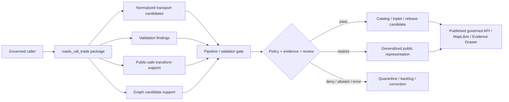

<!-- [KFM_META_BLOCK_V2]
doc_id: kfm://doc/NEEDS-VERIFICATION/packages-domains-roads-rail-trade-src-roads-rail-trade-readme
title: Roads Rail Trade Python Package README
type: standard
version: v1
status: draft
owners: OWNER_TBD
created: 2026-06-14
updated: 2026-06-14
policy_label: public
related: [packages/domains/roads-rail-trade/README.md, packages/domains/roads-rail-trade/src/README.md, packages/domains/roads-rail-trade/identity/README.md, packages/domains/roads-rail-trade/network/README.md, packages/domains/roads-rail-trade/graph_projection/README.md, packages/domains/roads-rail-trade/generalization/README.md, packages/domains/roads-rail-trade/frontier_routes/README.md, docs/domains/roads-rail-trade/README.md, contracts/domains/roads-rail-trade/, schemas/contracts/v1/domains/roads-rail-trade/, policy/domains/roads-rail-trade/, data/registry/roads-rail-trade/, data/receipts/roads-rail-trade/, data/proofs/roads-rail-trade/, release/]
tags: [kfm, roads-rail-trade, python-package, package-root, transport, roads, rail, trade-routes, evidence, governance, rollback]
notes: ["README-like package-module document for the proposed roads_rail_trade implementation package.", "Target path is user-requested and Directory Rules-compatible as a package/domain segment, but import availability, package metadata, tests, schemas, policies, registries, emitted proofs, releases, and runtime behavior remain NEEDS VERIFICATION until checked in the live repo.", "This package module may coordinate implementation helpers only; it must not become schema, policy, source registry, lifecycle data, proof, receipt, release, API, UI, or publication authority."]
[/KFM_META_BLOCK_V2] -->

# Roads Rail Trade Python Package

Implementation package namespace for KFM Roads, Rail, and Trade Routes helpers that normalize, identify, validate, generalize, and prepare evidence-bound transport objects for governed downstream use.

<p>
  
  
  
  
  
  
  
</p>

> [!IMPORTANT]
> **Status:** PROPOSED package-module README  
> **Path:** `packages/domains/roads-rail-trade/src/roads_rail_trade/README.md`  
> **Owning responsibility root:** `packages/`  
> **Domain lane:** `roads-rail-trade`  
> **Import namespace:** `roads_rail_trade` — NEEDS VERIFICATION against package metadata and editable-install behavior.  
> **Repo implementation depth:** NEEDS VERIFICATION — package metadata, Python import behavior, tests, CI workflows, schema bindings, policy gates, source registries, emitted receipts, proof objects, release manifests, and runtime/API/UI integrations were not inspected in this file-generation pass.

## Quick links

- [Scope](#scope)
- [Repo fit](#repo-fit)
- [Accepted inputs](#accepted-inputs)
- [Exclusions](#exclusions)
- [Package responsibilities](#package-responsibilities)
- [Proposed module map](#proposed-module-map)
- [Trust-boundary flow](#trust-boundary-flow)
- [Finite outcomes](#finite-outcomes)
- [Development rules](#development-rules)
- [Testing and validation](#testing-and-validation)
- [Definition of done](#definition-of-done)
- [Verification checklist](#verification-checklist)
- [Rollback](#rollback)

---

## Scope

`packages/domains/roads-rail-trade/src/roads_rail_trade/` is the proposed importable package namespace for reusable Roads, Rail, and Trade Routes implementation helpers.

This namespace may coordinate code for:

- deterministic transport-object identity;
- road, rail, crossing, facility, restriction, and route membership normalization;
- historic route and frontier corridor uncertainty handling;
- network topology validation;
- graph-projection candidate preparation;
- public-safe generalization helpers;
- layer-manifest helper DTOs;
- evidence, source-role, temporal, geometry-role, and release-reference checks.

The package exists to support the KFM lifecycle:

```text
RAW -> WORK / QUARANTINE -> PROCESSED -> CATALOG / TRIPLET -> PUBLISHED
```

It may help produce candidates and validation findings for governed pipelines, validators, catalog closure, graph projection, release review, and public-safe layer delivery. It does **not** own source activation, lifecycle storage, source truth, release decisions, public API behavior, MapLibre rendering, policy enforcement authority, or EvidenceBundle authority.

> [!WARNING]
> Transport package helpers are not emergency-alert, dispatch, navigation, routing, railroad-operation, legal-access, title, engineering-safety, or current-condition authority. Public claims must resolve through governed APIs, released artifacts, EvidenceBundle support, policy decisions, review state, and rollback lineage.

---

## Repo fit

```text
packages/domains/roads-rail-trade/src/roads_rail_trade/
```

This path is appropriate for importable package code only. Trust-bearing records, machine contracts, release decisions, source descriptors, lifecycle data, and policy rules stay in their own authority roots.

| Relationship | Expected home | Boundary rule |
| --- | --- | --- |
| Importable package namespace | `packages/domains/roads-rail-trade/src/roads_rail_trade/` | Coordinates implementation helpers for this package. |
| Source-root README | `packages/domains/roads-rail-trade/src/README.md` | Explains source layout and package import boundaries. |
| Package overview | `packages/domains/roads-rail-trade/README.md` | Explains the whole Roads/Rail/Trade package lane. |
| Identity helpers | `packages/domains/roads-rail-trade/identity/` or submodules here after repo verification | Computes deterministic IDs and digest material. |
| Network helpers | `packages/domains/roads-rail-trade/network/` or submodules here after repo verification | Normalizes and validates road/rail/route network primitives. |
| Graph projection helpers | `packages/domains/roads-rail-trade/graph_projection/` | Produces derived graph candidates without replacing source truth. |
| Public generalization helpers | `packages/domains/roads-rail-trade/generalization/` | Produces public-safe generalized geometry support. |
| Frontier route helpers | `packages/domains/roads-rail-trade/frontier_routes/` | Handles historic corridor uncertainty and review-sensitive reconstruction. |
| Semantic contracts | `contracts/domains/roads-rail-trade/` or repo-confirmed equivalent | Owns object meaning. |
| Machine schemas | `schemas/contracts/v1/domains/roads-rail-trade/` or accepted ADR alternative | Owns field shape and validation schemas. |
| Source registry | `data/registry/roads-rail-trade/` or repo-confirmed registry home | Owns source identity, source roles, rights, cadence, and activation status. |
| Lifecycle data | `data/<phase>/roads-rail-trade/` | Owns raw/work/quarantine/processed/catalog/triplet/published data. |
| Receipts and proofs | `data/receipts/roads-rail-trade/`, `data/proofs/roads-rail-trade/`, or repo-confirmed homes | Own run memory, validation evidence, proof packs, and closure checks. |
| Release decisions | `release/` | Owns release manifests, promotion decisions, correction notices, withdrawals, and rollback targets. |
| Policy rules | `policy/domains/roads-rail-trade/` or repo-confirmed policy home | Owns allow/restrict/deny/abstain decisions. |
| Governed API/UI | `apps/`, `packages/ui/`, `packages/maplibre/`, runtime/API homes, or repo-confirmed equivalents | Consume released artifacts and evidence-bound payloads; they do not import this package as public truth authority. |

---

## Accepted inputs

The package should accept already-admitted, source-identified, explicitly scoped objects from governed callers. It should not fetch live sources, create source truth, or guess missing authority.

| Input family | Accepted examples | Required handling |
| --- | --- | --- |
| Source-scoped records | road segment, rail segment, crossing, route, corridor, facility, restriction, status event | Preserve source ID, source role, source record identity, rights/sensitivity flags, and temporal scope. |
| Identity material | source key, object kind, geometry digest, validity interval, route membership key, release key | Build deterministic IDs without pretending the ID proves the claim. |
| Geometry material | source geometry ref, exact/internal geometry ref, public geometry ref, generalized geometry ref | Keep geometry roles distinct and deny public exact exposure unless policy/release allow it. |
| Temporal material | observed date, effective interval, publication date, abandonment/status interval, release time | Keep valid time, source time, run time, and release time separate. |
| Evidence material | EvidenceRef, EvidenceBundle ID, citation key, proof ref, source role | Carry through to output; do not generate authoritative claims without closure. |
| Method material | normalization profile, topology profile, snapping tolerance, graph projection profile, public generalization profile | Version every method that can alter topology, identity, or public representation. |

Missing source identity, source role, evidence ref, object kind, temporal scope, or geometry role should return a finite failure outcome instead of silently guessing.

---

## Exclusions

| Do not put here | Correct home or owner | Why |
| --- | --- | --- |
| Live fetchers, scrapers, credentials, endpoint clients | `connectors/`, `pipelines/`, `pipeline_specs/`, `configs/`, `infra/` | Source activation belongs outside package helpers. |
| JSON Schemas | `schemas/contracts/v1/domains/roads-rail-trade/` or ADR-approved alternative | Machine shape belongs in schema authority. |
| Semantic contract Markdown | `contracts/domains/roads-rail-trade/` or ADR-approved alternative | Object meaning belongs in contract authority. |
| Source descriptors and rights matrices | `data/registry/roads-rail-trade/` | Source identity and rights are governance records. |
| Lifecycle datasets | `data/<phase>/roads-rail-trade/` | Data lifecycle cannot be hidden inside package code. |
| Proof packs, receipts, catalog records | `data/proofs/`, `data/receipts/`, `data/catalog/`, or repo-confirmed homes | Trust objects must remain independently inspectable. |
| Release manifests, rollback cards, correction notices | `release/` | Publication is a governed decision, not a package side effect. |
| Rego or policy rules | `policy/domains/roads-rail-trade/` | Policy authority must stay separate from helper code. |
| Public API routes, MapLibre styles, UI components | governed API/UI roots | UI/API surfaces consume governed outputs. |
| Emergency routing, navigation, dispatch, current-condition alerts | Out of scope / official systems | KFM transport knowledge is contextual and evidence-bound, not operational authority. |

---

## Package responsibilities

| Responsibility | Package behavior | Guardrail |
| --- | --- | --- |
| Normalize | Convert governed records into consistent in-memory package objects | Preserve source role and source caveats. |
| Identify | Produce deterministic identifiers for transport objects and derived candidates | IDs are handles, not proof. |
| Validate | Emit structured findings for missing evidence, temporal conflicts, unsafe geometry, and topology risk | Findings do not auto-promote records. |
| Generalize | Support public-safe geometry transformations and receipts | Exact/internal geometry remains separated. |
| Prepare graph candidates | Shape derived nodes/edges for graph projection | Graph edges never replace canonical records. |
| Preserve uncertainty | Carry confidence, certainty class, route reconstruction uncertainty, and review state | No false precision. |
| Support finite outcomes | Return `ANSWER`, `ABSTAIN`, `DENY`, or `ERROR`-compatible results where used by runtime callers | Do not throw away policy context. |
| Support rollback | Carry release refs, supersession refs, correction refs, and method versions | Released meanings remain reconstructable. |

---

## Proposed module map

Actual modules remain NEEDS VERIFICATION until package files are inspected or created. A future implementation should keep public imports small, explicit, and easy to test.

```text
roads_rail_trade/
├── __init__.py                    # package exports; no side effects
├── ids.py                         # deterministic identity helpers
├── models.py                      # lightweight package dataclasses / DTO helpers, not schema authority
├── normalize.py                   # source-scoped normalization helpers
├── temporal.py                    # valid/source/run/release time utilities
├── geometry_roles.py              # exact/source/derived/public/generalized role helpers
├── topology.py                    # topology validation helpers
├── restrictions.py                # restriction/status event normalization helpers
├── historic_corridors.py          # uncertainty-aware historic/frontier route helpers
├── public_generalization.py       # public-safe geometry transform helpers
├── graph_candidates.py            # graph projection candidate preparation
├── evidence.py                    # EvidenceRef/EvidenceBundle reference handling helpers
├── outcomes.py                    # finite outcome helpers
└── py.typed                       # include only if type hints are part of package contract
```

> [!NOTE]
> This tree is PROPOSED. Do not create parallel schema, policy, source registry, release, proof, receipt, or lifecycle homes under this package just because a helper module needs to reference those objects.

---

## Trust-boundary flow



This diagram is architectural and PROPOSED for the package namespace. It does not prove implemented imports, call paths, runtime behavior, tests, workflows, or release gates.

---

## Finite outcomes

Package helpers should make failure states explicit enough for callers to route them through policy, validation, review, or correction systems.

| Outcome | Use when | Package response |
| --- | --- | --- |
| `ANSWER` | The helper can return a bounded, evidence-linked result for a governed caller | Return value plus evidence/source/method/release context. |
| `ABSTAIN` | Required evidence, source role, temporal support, or review state is missing | Return structured reason codes; do not invent a result. |
| `DENY` | Public exposure would violate sensitivity, rights, exact-location, safety, or policy constraints | Return denial reason and required review/policy refs when known. |
| `ERROR` | Input is malformed, unsupported, internally inconsistent, or tool execution failed | Return deterministic error class and non-sensitive debug context. |

Recommended reason-code families:

- `missing_source_ref`
- `missing_source_role`
- `missing_evidence_ref`
- `missing_geometry_role`
- `public_exact_geometry_risk`
- `temporal_scope_conflict`
- `source_role_collapse_risk`
- `graph_as_truth_risk`
- `historic_corridor_precision_risk`
- `release_ref_missing`
- `policy_decision_missing`

---

## Development rules

- Keep imports deterministic and side-effect free.
- Do not perform network access at import time or from pure helper functions.
- Do not read RAW, WORK, QUARANTINE, unpublished candidates, source credentials, or canonical/internal stores from public-facing helpers.
- Do not embed source endpoints, credentials, licenses, or rights assertions in package code.
- Do not promote, publish, withdraw, or correct records from package helpers.
- Do not treat graph candidates, public geometry, or layer features as source truth.
- Preserve source role, source ID, temporal scope, geometry role, method profile, evidence refs, and release refs through transformations.
- Prefer deterministic IDs and digestable method metadata.
- Return structured validation findings instead of silently fixing source or topology problems.
- Keep package examples synthetic unless source rights and release status are confirmed.

---

## Testing and validation

Testing commands are NEEDS VERIFICATION until the live repo package manager and CI conventions are inspected.

```bash
# PROPOSED — adjust after repo inspection.
python -m pytest tests/domains/roads-rail-trade
```

Expected test families:

| Test family | Required coverage |
| --- | --- |
| Import tests | Package imports without source fetches, side effects, credentials, or runtime dependency on private data. |
| Identity tests | Deterministic IDs are stable, scoped, collision-aware, and sensitive-field safe. |
| Normalization tests | Required source/evidence/temporal/geometry fields are preserved. |
| Topology tests | Dangling endpoints, crossing ambiguity, duplicate segments, and unsafe snapping emit findings. |
| Public-safety tests | Exact/internal geometry cannot become public-safe output without policy/release context. |
| Graph tests | Derived graph candidates carry source, method, evidence, and derived-status markers. |
| Finite-outcome tests | `ANSWER`, `ABSTAIN`, `DENY`, and `ERROR` paths are fixture-backed. |
| Rollback tests | Supersession and correction refs remain reconstructable across transforms. |

---

## Definition of done

- [ ] `README.md` matches the actual package layout after repo inspection.
- [ ] Package metadata confirms the `roads_rail_trade` import namespace.
- [ ] Package imports do not fetch sources, read lifecycle data, or require credentials.
- [ ] Public exports are documented and minimal.
- [ ] Helpers preserve source ID, source role, evidence refs, temporal scope, geometry role, method profile, and release refs.
- [ ] Package outputs cannot be mistaken for source truth, policy decisions, releases, proofs, receipts, or catalog closure.
- [ ] Unit tests cover valid, invalid, deny, abstain, and error fixtures.
- [ ] Type checks and lint checks are either configured or explicitly deferred with a reason.
- [ ] Adjacent package READMEs link here after the file lands.
- [ ] Rollback target is recorded in the PR or release note if this package becomes part of a release.

---

## Verification checklist

- [ ] Confirm this path exists in the live repo or create it through a Directory Rules-compliant PR.
- [ ] Confirm `pyproject.toml`, workspace config, or package metadata includes `roads_rail_trade` as intended.
- [ ] Confirm adjacent package READMEs and imports use the same naming convention.
- [ ] Confirm whether helper modules live directly under `src/roads_rail_trade/` or in sibling package folders.
- [ ] Confirm schema home for roads/rail/trade objects.
- [ ] Confirm policy home for source-role, public-safety, generalization, and graph-derived-status gates.
- [ ] Confirm source registry home and activation requirements.
- [ ] Confirm receipt/proof/release homes used by validators and pipelines.
- [ ] Confirm tests and fixtures are in repo-native locations.
- [ ] Confirm public UI/API surfaces consume only governed, released, evidence-bound outputs.
- [ ] Add unresolved placement or naming conflicts to `docs/registers/DRIFT_REGISTER.md` or `docs/registers/VERIFICATION_BACKLOG.md`.

---

## Rollback

Rollback is required if this package namespace starts acting as a source registry, schema authority, policy authority, lifecycle data store, proof store, receipt store, release authority, public API, UI surface, or canonical truth store.

Rollback target: `ROLLBACK_TARGET_TBD_AFTER_REPO_INSPECTION`

Minimum rollback actions:

1. Revert the package change or disable the import/export path.
2. Preserve emitted validation findings, receipts, and release references for audit if any were produced.
3. Add a correction or drift entry if public-facing documentation, API behavior, or release material referenced the withdrawn helper.
4. Re-run package tests and any domain-level validation affected by the rollback.
5. Confirm no public layer, Focus Mode response, Evidence Drawer payload, or graph projection relies on withdrawn outputs.

---

## Maintainer notes

- Keep this README synchronized with `packages/domains/roads-rail-trade/src/README.md` and the package-level README.
- Prefer small modules with explicit inputs and outputs over broad helper classes that hide evidence or policy state.
- Keep examples synthetic until source rights, public safety, and release status are confirmed.
- Treat prior roads/rail/trade reports as LINEAGE unless current repo files and tests confirm implementation.

