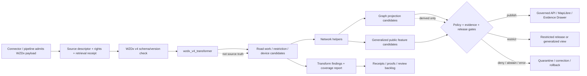

<!-- [KFM_META_BLOCK_V2]
doc_id: kfm://doc/NEEDS-VERIFICATION/packages-domains-roads-rail-trade-wzdx-v4-transformer-readme
title: Roads, Rail, and Trade Routes WZDx v4 Transformer Package README
type: standard
version: v1
status: draft
owners: OWNER_TBD
created: 2026-06-14
updated: 2026-06-14
policy_label: public
related: [packages/domains/roads-rail-trade/README.md, packages/domains/roads-rail-trade/src/README.md, packages/domains/roads-rail-trade/src/roads_rail_trade/README.md, packages/domains/roads-rail-trade/network/README.md, packages/domains/roads-rail-trade/identity/README.md, packages/domains/roads-rail-trade/generalization/README.md, packages/domains/roads-rail-trade/graph_projection/README.md, docs/domains/roads-rail-trade/README.md, docs/domains/roads-rail-trade/ARCHITECTURE.md, contracts/domains/roads-rail-trade/, schemas/contracts/v1/domains/roads-rail-trade/, policy/domains/roads-rail-trade/, data/registry/roads-rail-trade/, data/receipts/roads-rail-trade/, data/proofs/roads-rail-trade/, release/]
tags: [kfm, roads-rail-trade, wzdx, wzdx-v4, work-zone, road-restrictions, transformer, packages, evidence, provenance, rollback]
notes: ["README-like package document for WZDx v4 transformation helpers inside the roads/rail/trade package lane.", "Target path is user-requested and Directory Rules-compatible as a package/domain segment, but package metadata, imports, validators, tests, schemas, policies, source registries, WZDx feed registry entries, live endpoint behavior, emitted proofs, releases, and runtime behavior remain NEEDS VERIFICATION until checked in the live repo.", "This package may transform already-admitted WZDx v4-family work-zone/device/restriction feed payloads into KFM road restriction and network context candidates only; it must not become the canonical WZDx schema home, source registry, source fetcher, policy authority, operational alert authority, public navigation authority, or release authority."]
[/KFM_META_BLOCK_V2] -->

# Roads, Rail, and Trade Routes WZDx v4 Transformer Package

Reusable transformer helpers for converting already-admitted WZDx v4-family feed payloads into KFM road-work, restriction, work-zone, device-context, network-context, evidence, receipt, and graph-projection candidate records without weakening KFM source, policy, publication, or public-safety boundaries.

<p>
  
  
  
  
  
  
  
</p>

> [!IMPORTANT]
> **Status:** PROPOSED package README  
> **Path:** `packages/domains/roads-rail-trade/wzdx_v4_transformer/README.md`  
> **Owning responsibility root:** `packages/`  
> **Domain lane:** `roads-rail-trade`  
> **Transformer scope:** WZDx v4-family payload normalization and mapping helpers only  
> **Repo implementation depth:** NEEDS VERIFICATION — package metadata, imports, tests, WZDx schema references, live feed endpoints, source descriptors, policies, CI workflows, emitted receipts, proof objects, release manifests, and runtime behavior were not inspected in this file-generation pass.

## Quick links

- [Scope](#scope)
- [Repo fit](#repo-fit)
- [WZDx boundary](#wzdx-boundary)
- [Accepted inputs](#accepted-inputs)
- [Exclusions](#exclusions)
- [Transformer responsibilities](#transformer-responsibilities)
- [Output object families](#output-object-families)
- [Mapping posture](#mapping-posture)
- [Trust-boundary flow](#trust-boundary-flow)
- [Validation and quality gates](#validation-and-quality-gates)
- [Public-safety controls](#public-safety-controls)
- [Finite outcomes](#finite-outcomes)
- [Development rules](#development-rules)
- [Definition of done](#definition-of-done)
- [Verification checklist](#verification-checklist)
- [Rollback](#rollback)

---

## Scope

`packages/domains/roads-rail-trade/wzdx_v4_transformer/` is the proposed home for reusable implementation helpers that transform **already-admitted** Work Zone Data Exchange v4-family payloads into KFM road-work and restriction context candidates.

This package may help transform and normalize:

- WZDx v4-family work-zone feed payloads;
- WZDx v4-family device feed payloads;
- work-zone road events, lane closures, detours, restrictions, worker-presence contexts, and road-event validity intervals;
- smart work-zone device observations where the source, rights, cadence, and sensitivity posture have already been admitted by KFM source governance;
- non-work-zone road restriction records where the source payload and KFM contract mapping explicitly support them;
- road-network context candidates consumed by `network/`, `graph_projection/`, `generalization/`, governed API payload builders, and Evidence Drawer helpers.

This package does **not** fetch WZDx feeds, register sources, decide whether a feed may be used, define WZDx itself, publish live operational alerts, or produce navigation instructions.

The transformer supports the KFM lifecycle, but does not own the lifecycle:

```text
RAW -> WORK / QUARANTINE -> PROCESSED -> CATALOG / TRIPLET -> PUBLISHED
```

A valid transformer output remains a **candidate** until schemas, policy, source rights, evidence closure, review state, catalog/triplet closure, release state, correction path, and rollback path are satisfied by their owning roots.

> [!WARNING]
> WZDx data can describe active or recent roadway work-zone and restriction conditions. KFM must treat this package as a controlled transformation helper, not as an emergency-alert system, navigation product, dispatch system, live road-condition authority, legal access authority, or worker-safety instruction channel.

---

## Repo fit

```text
packages/domains/roads-rail-trade/wzdx_v4_transformer/
```

This path is appropriate only for shared reusable package code. WZDx transformer helpers may convert, validate, normalize, and annotate input payloads for KFM callers, but trust-bearing records remain under their owning roots.

| Relationship | Expected home | Boundary rule |
| --- | --- | --- |
| WZDx v4 transformer helpers | `packages/domains/roads-rail-trade/wzdx_v4_transformer/` | Reusable implementation logic for admitted payloads only. |
| Roads/Rail/Trade package overview | `packages/domains/roads-rail-trade/README.md` | Explains broader package-lane responsibilities. |
| Importable package namespace | `packages/domains/roads-rail-trade/src/roads_rail_trade/` | Owns importable Python code if this repo uses Python packaging for the lane. |
| Network helper integration | `packages/domains/roads-rail-trade/network/` | Consumes transformed road-event/network-context candidates. |
| Identity helper integration | `packages/domains/roads-rail-trade/identity/` | Computes deterministic IDs from source, object role, temporal scope, geometry/material digest, and method version. |
| Public generalization helpers | `packages/domains/roads-rail-trade/generalization/` | Produces public-safe representations after policy/evidence support. |
| Graph projection helpers | `packages/domains/roads-rail-trade/graph_projection/` | Consumes transformed objects as downstream derived inputs only. |
| Semantic contracts | `contracts/domains/roads-rail-trade/` or repo-confirmed equivalent | Owns KFM object meanings such as RoadWorkEvent, RoadRestrictionContext, WorkZoneDeviceObservation, and PublicRoadConditionFeature. |
| Machine schemas | `schemas/contracts/v1/domains/roads-rail-trade/` or accepted ADR alternative | Owns KFM machine shapes and validation schemas. |
| Source descriptors and feed registry records | `data/registry/roads-rail-trade/` or repo-confirmed source-registry home | Owns source identity, WZDx feed URL metadata, rights, cadence, source roles, and activation status. |
| Lifecycle records | `data/<phase>/roads-rail-trade/` | Stores raw, work, quarantine, processed, catalog, triplet, and published records. |
| Receipts and proofs | `data/receipts/roads-rail-trade/`, `data/proofs/roads-rail-trade/`, or repo-confirmed trust-object homes | Persist transform run receipts, validation results, schema-conformance proof refs, and policy outcomes. |
| Policy gates | `policy/domains/roads-rail-trade/` or repo-confirmed policy home | Decides allow/restrict/deny/abstain for exposure, freshness, sensitivity, rights, and operational-risk conditions. |
| Release and rollback | `release/` | Owns release manifests, corrections, withdrawals, and rollback targets. |
| Public API/UI | governed API, `apps/`, `packages/maplibre/`, `packages/ui/`, or repo-confirmed homes | Consume only released, policy-safe, evidence-backed objects; never read this transformer as public truth. |

---

## WZDx boundary

WZDx v4-family material is an external specification and feed ecosystem. This package only maps admitted WZDx-like payloads into KFM candidate objects.

| Boundary question | Required answer |
| --- | --- |
| Does this package define the WZDx standard? | No. Use official WZDx / connected-work-zone schemas and release notes as source references. |
| Does this package fetch WZDx endpoints? | No. Fetching belongs in `connectors/`, `pipelines/`, or another governed source-admission root. |
| Does this package activate feeds from a registry? | No. Source descriptors and activation state belong in `data/registry/roads-rail-trade/` or repo-confirmed equivalent. |
| Does this package validate against official WZDx JSON Schema? | It may call a pinned external-schema adapter, but the pinned schema reference, version, digest, and compatibility matrix must be reviewable. |
| Does this package publish current work-zone alerts? | No. It can produce evidence-bound candidates; public release must pass KFM policy, evidence, freshness, release, and rollback gates. |
| Does this package provide navigation or safety instructions? | No. KFM must not present transformed WZDx records as routing, emergency, worker-safety, or legal-access instructions. |
| Does this package normalize operational data into historical context? | Yes, when supported by source rights, temporal scope, evidence bundle, policy, and release state. |

### Version posture

This README names `wzdx_v4_transformer` because the requested package path is version-specific. The package should still treat WZDx version compatibility as explicit data, not an assumption.

Minimum version metadata expected for every transform run:

```yaml
wzdx_family: wzdx
wzdx_major_version: 4
wzdx_minor_version: NEEDS_VERIFICATION
feed_kind: work_zone | device | road_restriction | unknown
schema_uri: NEEDS_VERIFICATION
schema_digest: NEEDS_VERIFICATION
source_descriptor_ref: NEEDS_VERIFICATION
transformer_version: NEEDS_VERIFICATION
mapping_profile: NEEDS_VERIFICATION
```

If a payload cannot prove its WZDx version, schema identity, feed kind, source identity, retrieval time, and rights posture, the transformer must emit a finite failure outcome rather than guess.

---

## Accepted inputs

The transformer should accept only already-admitted payloads or payload fragments supplied by governed callers. Inputs should carry source, retrieval, schema, rights, time, and evidence context.

| Input family | Accepted examples | Required handling |
| --- | --- | --- |
| Feed envelope metadata | feed ID, feed kind, WZDx version, schema URI, schema digest, feed update time, retrieval time | Validate presence; do not infer version from field names alone. |
| Source descriptor refs | source ID, publisher, owner/operator role, rights status, cadence, jurisdiction, access terms | Preserve source role and rights posture in every output. |
| Work-zone events | road event, work zone, lane closure, detour, worker presence context, impact area, start/end time | Preserve valid time, update time, source time, uncertainty, and operational-risk flags. |
| Device observations | smart arrow board, message sign, traffic sensor, camera/device metadata, device status | Treat as observations or context, not verified ground truth unless policy and source support say so. |
| Road restrictions | closure, lane restriction, width/height/weight restriction, speed context, detour route | Preserve authority source and effective interval; do not convert into navigation advice. |
| Geometry fragments | line strings, points, polygons, bounding areas, road segment refs, directionality | Preserve CRS/profile and geometry role; do not expose exact internal geometry publicly by default. |
| Road-name and network refs | route names, road names, milepost refs, linear reference refs, segment refs | Normalize with evidence; avoid collapsing naming variants without deterministic identity support. |
| Evidence refs | EvidenceBundle ID, EvidenceRef, source payload URI/digest, retrieval receipt ref, validation proof ref | Every output should remain cite-or-abstain capable. |
| Policy hints | freshness class, operational sensitivity, publication risk, public-release request, redaction profile | Treat as inputs to policy; do not make policy decisions in the transformer. |

### Minimum admitted input envelope

```json
{
  "source_descriptor_ref": "NEEDS_VERIFICATION",
  "retrieval_receipt_ref": "NEEDS_VERIFICATION",
  "wzdx_version": "4.x",
  "feed_kind": "work_zone",
  "payload_digest": "sha256:NEEDS_VERIFICATION",
  "retrieved_at": "NEEDS_VERIFICATION",
  "rights_status": "NEEDS_VERIFICATION",
  "evidence_refs": ["NEEDS_VERIFICATION"],
  "payload": {}
}
```

This is a README-level illustrative shape, not a schema. Machine shape belongs under `schemas/contracts/v1/domains/roads-rail-trade/` or an accepted ADR alternative.

---

## Exclusions

| Do not put here | Correct home or owner | Why |
| --- | --- | --- |
| WZDx feed fetchers, endpoint clients, polling, watcher cadence | `connectors/`, `pipelines/`, `pipeline_specs/`, `configs/`, `runtime/` | The transformer must not activate or fetch sources. |
| API keys, feed credentials, private endpoints, secrets | Secret store, `configs/` templates only, `infra/` references | Never store secrets in package code or README examples. |
| Official WZDx JSON Schemas copied without provenance | External pinned source ref, schema mirror only if ADR-approved | Avoid creating an unofficial schema authority. |
| KFM JSON Schemas | `schemas/contracts/v1/domains/roads-rail-trade/` | Machine shape authority stays in schemas. |
| KFM semantic contracts | `contracts/domains/roads-rail-trade/` | Object meaning belongs in contracts. |
| WZDx source descriptors / registry entries | `data/registry/roads-rail-trade/` | Source identity, rights, cadence, and activation are registry authority. |
| Raw, work, quarantine, processed, catalog, triplet, published data | `data/<phase>/roads-rail-trade/` | Lifecycle data is not package source code. |
| Transform receipts and proof packs | `data/receipts/roads-rail-trade/`, `data/proofs/roads-rail-trade/`, or repo-confirmed homes | Trust objects must be inspectable outside code. |
| Policy rules for public exposure | `policy/domains/roads-rail-trade/` | Policy is not helper code. |
| Release manifests, correction notices, rollback cards | `release/` | Publication is a governed state transition. |
| Public MapLibre style definitions and Focus Mode UI text | UI/API/documentation homes | Presentation consumes governed outputs; it does not own transforms. |
| Live road-condition alerts, evacuation route logic, navigation instructions | Out of scope / official systems | KFM must not become an operational safety authority. |

---

## Transformer responsibilities

| Responsibility | Package behavior | Guardrail |
| --- | --- | --- |
| Identify feed family | Confirm WZDx major/minor version and feed kind from explicit metadata or validated schema context | Do not infer compatibility from field similarity alone. |
| Normalize time | Preserve retrieval time, source update time, event valid time, start/end windows, release time, and stale-state indicators separately | Do not silently refresh or overwrite stale events. |
| Normalize geometry | Convert input geometry into internal geometry refs and public-safe candidate refs with declared geometry role | Do not expose precise active work-zone geometry publicly without policy release. |
| Map work-zone events | Convert work-zone road events into KFM `RoadWorkEvent` or equivalent candidates | Do not claim current field reality beyond source support. |
| Map device context | Convert smart work-zone device records into KFM observation/context candidates | Device status is observation context, not necessarily verified condition truth. |
| Map restrictions | Convert closure/restriction records into KFM `RoadRestrictionContext` or equivalent candidates | Do not convert restrictions into routing instructions. |
| Preserve source authority | Carry source descriptor refs, publisher/operator roles, rights status, cadence, and jurisdiction | Do not collapse feed publisher, road authority, contractor, and device owner roles. |
| Emit validation findings | Return structured findings for missing fields, incompatible version, stale data, invalid geometry, rights gaps, and policy blockers | Findings are reviewable outputs; no silent repair. |
| Support evidence closure | Attach evidence refs, payload digest refs, retrieval receipt refs, and schema-validation proof refs | Output without evidence support must ABSTAIN or ERROR. |
| Support graph projection | Produce graph-ready candidate refs and relation hints for downstream graph projection | Graph edges remain derived and non-authoritative. |
| Support rollback | Version mapping profiles and preserve transform lineage for rollback and correction | A mapping-profile change should be auditable and reversible. |

---

## Output object families

The exact KFM object names must be verified against current contracts and schemas. The families below are PROPOSED implementation targets for this README.

| Output family | Purpose | Typical fields | Public boundary |
| --- | --- | --- | --- |
| `WZDxTransformRun` | One transformer invocation over one feed payload or payload slice | `run_id`, `source_descriptor_ref`, `schema_ref`, `payload_digest`, `mapping_profile`, `started_at`, `finished_at`, `finite_outcome` | Receipt/proof data; not public by default. |
| `RoadWorkEventCandidate` | Evidence-bound work-zone or roadway work event candidate | `event_id`, `source_ref`, `valid_time`, `road_ref`, `geometry_ref`, `impact_summary`, `evidence_refs` | Public only through release and freshness policy. |
| `RoadRestrictionCandidate` | Road closure/restriction/access context candidate | `restriction_id`, `restriction_kind`, `effective_time`, `authority_source_ref`, `affected_network_ref`, `evidence_refs` | Context only; not legal or navigation advice. |
| `WorkZoneDeviceObservationCandidate` | Smart work-zone device observation/context candidate | `device_obs_id`, `device_kind`, `status`, `observed_time`, `location_ref`, `source_ref`, `evidence_refs` | Potentially sensitive/operational; restrict by default until policy decides. |
| `NetworkContextCandidate` | Road segment, route, lane, or crossing context produced from the payload | `network_context_id`, `segment_refs`, `direction`, `lane_context`, `geometry_role`, `valid_time` | Downstream support only; not public truth. |
| `PublicRoadConditionFeatureCandidate` | Candidate public-safe display feature | `public_feature_id`, `generalization_profile`, `policy_decision_ref`, `release_candidate_ref`, `evidence_refs` | Requires policy/release before public UI. |
| `TransformFinding` | Structured validation or mapping issue | `finding_id`, `severity`, `reason_code`, `object_ref`, `evidence_ref`, `suggested_disposition` | May drive quarantine/review; not a user-facing claim alone. |
| `MappingCoverageReport` | Which input fields were mapped, ignored, quarantined, or unsupported | `coverage_id`, `input_schema_ref`, `mapping_profile`, `mapped_fields`, `unsupported_fields`, `quarantined_fields` | Supports review and regression tests. |

---

## Mapping posture

WZDx payloads are external source-shaped records. KFM outputs are governed, evidence-bound objects. Mapping must be explicit and lossy transforms must be visible.

### Recommended mapping table shape

| WZDx-side concept | KFM-side candidate | Required notes |
| --- | --- | --- |
| Feed metadata | `WZDxTransformRun` and source/ref envelope | Preserve feed kind, schema/version, retrieval time, source ID, rights, payload digest. |
| Road event / work zone | `RoadWorkEventCandidate` | Preserve event type, valid time, update time, road reference, geometry role, source support. |
| Device record | `WorkZoneDeviceObservationCandidate` | Preserve device kind, observation time, location ref, status, source role, uncertainty. |
| Restriction / closure | `RoadRestrictionCandidate` | Preserve restriction kind, effective interval, affected road/network refs, authority context. |
| Geometry | `NetworkContextCandidate` + geometry refs | Geometry role must be explicit: source/internal/derived/public/generalized. |
| Route or road name | `NetworkContextCandidate` or identity hints | Normalize names without collapsing unrelated roads/routes. |
| Lane context | `RoadWorkEventCandidate` or `RoadRestrictionCandidate` substructure | Do not turn lane context into passability instruction. |
| Detour context | `RoadRestrictionCandidate` or supporting relation | Public display requires policy; no routing claims. |
| Worker presence context | Restricted operational-risk field or redacted summary | Treat as sensitive by default unless policy permits. |
| Unsupported fields | `TransformFinding` + coverage report | Do not drop silently. |

### Loss handling

Every transform run should classify field handling:

| Classification | Meaning | Required action |
| --- | --- | --- |
| `mapped_exact` | Field mapped without semantic loss | Include mapping profile and schema version. |
| `mapped_normalized` | Field mapped after controlled normalization | Include normalization method and reason. |
| `mapped_generalized` | Field mapped after public-safe generalization | Include generalization profile and policy ref. |
| `mapped_restricted` | Field retained but restricted from public release | Include policy reason and redaction path. |
| `not_mapped_irrelevant` | Field intentionally ignored because it is irrelevant to KFM object family | Include coverage note. |
| `not_mapped_unsupported` | Field not supported by this mapping profile | Emit finding and coverage report. |
| `quarantined_sensitive` | Field held for steward/policy review | Emit quarantine reason and avoid public derivative. |
| `error_invalid` | Field or record invalid enough to block transform | Emit finite ERROR outcome. |

---

## Trust-boundary flow



The diagram is architectural and PROPOSED for this package README. It does not prove that these calls, objects, tests, source descriptors, policies, releases, or runtime paths already exist in the live repository.

---

## Validation and quality gates

Validation should be layered so a caller can distinguish source/schema failures from KFM contract failures, policy blockers, freshness problems, and publication blockers.

| Gate | Check | Failure outcome |
| --- | --- | --- |
| Source admission gate | Input has source descriptor ref, retrieval receipt ref, rights status, source role, and payload digest | `ERROR:source_admission_missing` or `DENY:rights_unknown` |
| Version gate | Payload declares WZDx major/minor version and feed kind supported by this profile | `ERROR:unsupported_wzdx_version` |
| Schema gate | Payload validates against pinned WZDx schema ref or a documented compatibility adapter | `ERROR:wzdx_schema_invalid` |
| Mapping profile gate | Transformer has a versioned mapping profile for the feed kind and version | `ERROR:mapping_profile_missing` |
| Required-field gate | Required fields for candidate object family are present or explicitly quarantined | `ABSTAIN:insufficient_fields` |
| Temporal gate | Valid time, retrieval time, source update time, and stale-state rules are explicit | `ABSTAIN:stale_or_time_ambiguous` |
| Geometry gate | Geometry role, CRS/profile, directionality, and public-safety posture are explicit | `DENY:unsafe_geometry_exposure` |
| Evidence gate | Output candidates include EvidenceRef / EvidenceBundle / payload digest support | `ABSTAIN:evidence_missing` |
| Policy gate | Operational-risk, worker-safety, infrastructure, rights, and public-safety rules evaluated | `DENY:policy_blocked` or `RESTRICT:policy_restricted` |
| Receipt gate | Transform run emits receipt/proof refs when persisted | `ERROR:receipt_missing` |
| Release gate | Public objects reference release candidate / release manifest / rollback target | `DENY:unreleased_candidate` |

### Suggested reason-code families

```text
source_admission_missing
rights_unknown
feed_kind_unknown
unsupported_wzdx_version
wzdx_schema_invalid
mapping_profile_missing
unsupported_field_present
required_field_missing
stale_feed
time_window_conflict
geometry_role_missing
unsafe_geometry_exposure
worker_presence_restricted
device_location_restricted
restriction_authority_unclear
evidence_missing
policy_blocked
release_state_missing
receipt_missing
rollback_target_missing
```

---

## Public-safety controls

WZDx-derived material can affect roadway safety and worker exposure. KFM must use fail-safe posture where publication risk matters.

| Risk | Required control |
| --- | --- |
| Live work-zone information mistaken for official alert | Label as historical/contextual or governed release; never present as emergency alert. |
| Navigation system relying on KFM output | Public UI copy must say KFM does not provide routing, detours, legal access, or operational guidance. |
| Worker presence exposure | Restrict, generalize, aggregate, or deny by default unless policy explicitly permits. |
| Device location sensitivity | Restrict or generalize precise device locations where operational risk exists. |
| Stale or superseded road event | Mark stale, abstain, or remove from public release; do not refresh silently. |
| Feed rights unclear | Deny public release and route to source-governance review. |
| Geometry precision too high | Use generalized public geometry and record transform receipt. |
| Authority role unclear | Distinguish publisher, road authority, contractor, device owner, derived processor, and KFM release authority. |
| Public map implies current passability | Add stale/freshness badge, evidence drawer, and non-navigation boundary. |
| Correction or rollback missing | Block release until rollback target exists. |

---

## Finite outcomes

Transformer calls should return a finite outcome. They should not throw ambiguous exceptions to normal governed callers.

| Outcome | Meaning | Example reason codes |
| --- | --- | --- |
| `ANSWER` | Transform completed and produced candidate objects with evidence, validation status, and receipt/proof refs where required | `transform_complete`, `candidate_objects_emitted` |
| `RESTRICT` | Transform completed, but some outputs must be restricted, generalized, redacted, or held from public release | `worker_presence_restricted`, `device_location_restricted`, `public_geometry_generalized` |
| `ABSTAIN` | Transformer cannot produce a trustworthy candidate because support is insufficient | `evidence_missing`, `time_window_conflict`, `required_field_missing` |
| `DENY` | Transformer or downstream caller must not expose or promote output because policy/rights/safety blocks it | `rights_unknown`, `policy_blocked`, `unsafe_geometry_exposure` |
| `ERROR` | Input or environment failed deterministically | `unsupported_wzdx_version`, `wzdx_schema_invalid`, `mapping_profile_missing`, `receipt_missing` |

Suggested result envelope:

```json
{
  "outcome": "ANSWER",
  "reason_codes": ["candidate_objects_emitted"],
  "source_descriptor_ref": "NEEDS_VERIFICATION",
  "retrieval_receipt_ref": "NEEDS_VERIFICATION",
  "schema_ref": "NEEDS_VERIFICATION",
  "mapping_profile": "NEEDS_VERIFICATION",
  "candidate_refs": [],
  "finding_refs": [],
  "receipt_ref": "NEEDS_VERIFICATION",
  "proof_ref": "NEEDS_VERIFICATION",
  "policy_decision_ref": "NEEDS_VERIFICATION"
}
```

This is an illustrative README shape, not an authoritative schema.

---

## Development rules

1. **No fetching in transformer code.** The package accepts payload envelopes supplied by governed callers.
2. **No source activation.** Source descriptors, feed registry entries, rights, cadence, and access decisions live outside this package.
3. **No unofficial schema authority.** Official WZDx schemas may be referenced and pinned; KFM schemas belong in KFM schema roots.
4. **No silent field loss.** Every input field is mapped, intentionally ignored, unsupported, restricted, quarantined, or error-reported in a coverage report.
5. **No time collapse.** Retrieval time, source update time, event valid time, transform run time, release time, and correction time remain distinct.
6. **No geometry precision leak.** Exact/internal geometry refs and public-safe geometry refs remain separate.
7. **No operational authority.** Outputs are not navigation, emergency alert, legal access, construction safety, or dispatch instructions.
8. **No generated truth.** AI or model helpers may summarize released evidence, but cannot certify WZDx truth or public-safety status.
9. **Version all profiles.** Schema refs, mapping profiles, normalization profiles, generalization profiles, and transformer versions must be explicit.
10. **Make rollback possible.** Mapping changes that affect output identity, geometry, policy status, or public representation require receipt/proof/release rollback planning.

---

## Proposed module map

Implementation details are PROPOSED until verified against actual package metadata and import conventions.

```text
packages/domains/roads-rail-trade/wzdx_v4_transformer/
├── README.md
├── __init__.py                         # PROPOSED if this folder is importable
├── envelope.py                         # admitted input envelope helpers
├── versioning.py                       # WZDx version/feed-kind detection helpers
├── schema_refs.py                      # pinned external-schema refs and digests, not schema authority
├── map_work_zone.py                    # work-zone event mapping helpers
├── map_device_feed.py                  # device observation/context mapping helpers
├── map_restrictions.py                 # road restriction mapping helpers
├── geometry.py                         # geometry-role and public-safe geometry-ref helpers
├── temporal.py                         # source/update/valid/retrieval/release time handling
├── findings.py                         # transform finding and reason-code helpers
├── coverage.py                         # field coverage report helpers
├── result.py                           # finite result envelope helpers
└── tests/                              # only if package-local tests are accepted by repo convention
```

If repository convention requires all importable code under `src/roads_rail_trade/`, this folder should remain documentation and/or wrapper entry point only, with importable modules placed under the confirmed `src` package namespace. That needs repo verification before implementation.

---

## Definition of done

This package should not be considered done until all relevant items are verified in the live repository.

| Done item | Status |
| --- | --- |
| Directory Rules placement confirmed | PROPOSED |
| Package metadata/import path confirmed | NEEDS VERIFICATION |
| Official WZDx v4-family schema refs pinned with digest | NEEDS VERIFICATION |
| Source descriptor contract for WZDx feeds confirmed | NEEDS VERIFICATION |
| Rights and source-role gate connected | NEEDS VERIFICATION |
| Mapping profile documented and versioned | NEEDS VERIFICATION |
| Work-zone feed fixtures added under proper fixture root | NEEDS VERIFICATION |
| Device feed fixtures added under proper fixture root | NEEDS VERIFICATION |
| Unsupported-field coverage report tested | NEEDS VERIFICATION |
| Temporal, geometry, and stale-state validators tested | NEEDS VERIFICATION |
| Public-safety policy blockers tested | NEEDS VERIFICATION |
| Evidence refs and payload digest preservation tested | NEEDS VERIFICATION |
| Receipt/proof emission path verified | NEEDS VERIFICATION |
| Graph projection integration tested | NEEDS VERIFICATION |
| Generalization integration tested | NEEDS VERIFICATION |
| Release/correction/rollback path verified | NEEDS VERIFICATION |
| Docs updated to point to contracts, schemas, policy, fixtures, and registry entries | NEEDS VERIFICATION |

---

## Verification checklist

Before implementation or PR merge, verify:

- [ ] The live repo actually contains or accepts `packages/domains/roads-rail-trade/wzdx_v4_transformer/`.
- [ ] The per-root `packages/README.md` and roads/rail/trade package README do not route this responsibility elsewhere.
- [ ] The import path is confirmed: package-local module vs `src/roads_rail_trade/` module.
- [ ] Official WZDx v4-family schema references, release notes, and schema digests are pinned.
- [ ] WZDx v4.0 vs v4.1 vs v4.2 compatibility is explicit and tested.
- [ ] Source descriptors exist for every feed or registry source used by tests.
- [ ] Rights status is never assumed from public URL availability.
- [ ] Transform fixtures are synthetic, public-safe, or rights-cleared.
- [ ] Real endpoint URLs, credentials, tokens, private feed names, and sensitive operational details are not embedded in code or README examples.
- [ ] Transform output IDs are deterministic where practical and include source/version/temporal/method material.
- [ ] Unsupported fields produce coverage findings.
- [ ] Stale, superseded, or expired road events cannot silently remain public.
- [ ] Worker presence, device locations, and operationally sensitive details are restricted/generalized/denied as policy requires.
- [ ] Public UI payloads include evidence refs, freshness status, policy/release state, and non-navigation boundary copy.
- [ ] Receipts, proofs, release manifests, correction notices, and rollback targets remain outside this package.

---

## Rollback

Rollback must be possible for both code changes and transformed/released outputs.

| Rollback target | Required action |
| --- | --- |
| Transformer code change | Revert package code or restore prior mapping profile. |
| Mapping profile change | Mark new profile superseded, restore prior profile, and re-run affected transform fixtures. |
| Schema compatibility change | Restore pinned schema ref or quarantine affected payloads until compatibility is reviewed. |
| Incorrect candidate objects | Emit correction notice, supersede candidate refs, and preserve prior receipt lineage. |
| Unsafe public geometry | Withdraw release or replace with generalized representation; record reason and transform receipt. |
| Stale live-condition display | Remove or downgrade public display; add stale/correction notice; do not silently refresh. |
| Rights-policy failure | Deny or withdraw public output; re-evaluate source descriptor and release manifest. |
| Graph projection contamination | Rebuild graph projection from prior valid candidates; mark contaminated projection refs superseded. |
| Public release error | Use release rollback target; preserve release manifest, proof, receipt, and correction chain. |

---

## Source and standards notes

- WZDx is an external specification/feed ecosystem and should be referenced through official specification, schema, release-note, and feed-registry sources during implementation.
- This README intentionally does not embed full WZDx schemas or field inventories.
- Any source URLs, schema refs, feed-registry entries, or endpoint examples must be verified at implementation time and represented through KFM source descriptors, pinned schema references, fixtures, tests, and receipts.

---

## Final status

**PROPOSED:** `packages/domains/roads-rail-trade/wzdx_v4_transformer/` is a suitable package-lane home for reusable WZDx v4-family transformation helpers because it is code-oriented and domain-specific inside the `packages/` responsibility root.

**NEEDS VERIFICATION:** Live repository package metadata, import conventions, official WZDx schema pins, source registry entries, rights posture, fixtures, tests, policy gates, receipt/proof emission, release manifests, and runtime integration.

**UNKNOWN:** Whether KFM currently implements any WZDx ingestion, transformer, source descriptor, schema adapter, public layer, governed API route, Evidence Drawer surface, or Focus Mode flow for WZDx-derived material.

