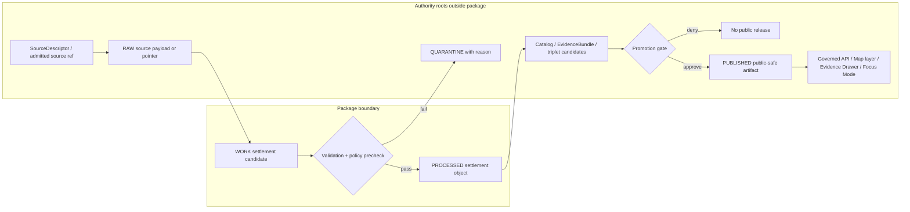

<!-- [KFM_META_BLOCK_V2]
doc_id: kfm://doc/NEEDS-VERIFICATION/packages-domains-settlement-readme
title: Settlement Domain Package README
type: standard
version: v1
status: draft
owners: OWNER_TBD
created: 2026-06-14
updated: 2026-06-14
policy_label: public
related:
  - docs/domains/settlements-infrastructure/README.md
  - docs/domains/settlements-infrastructure/ARCHITECTURE.md
  - docs/domains/settlements-infrastructure/SOURCE_ROLES.md
  - docs/domains/settlements-infrastructure/TIME_SEMANTICS.md
  - docs/domains/settlements-infrastructure/PROMOTION.md
  - docs/domains/settlements-infrastructure/UI_AND_EVIDENCE_DRAWER.md
  - contracts/domains/settlements-infrastructure/
  - schemas/contracts/v1/domains/settlements-infrastructure/
  - policy/domains/settlements-infrastructure/
  - data/registry/settlements-infrastructure/
  - data/receipts/settlements-infrastructure/
  - data/proofs/settlements-infrastructure/
  - release/candidates/settlements-infrastructure/
  - tests/domains/settlements-infrastructure/
  - fixtures/domains/settlements-infrastructure/
tags:
  - kfm
  - settlement
  - settlements-infrastructure
  - packages
  - place-identity
  - municipalities
  - historic-townsites
  - evidence
  - public-safe-layers
notes:
  - "README-like package entrypoint for shared settlement normalization and identity helpers."
  - "Requested path uses singular settlement. Directory Rules and the domain atlas name the broader domain lane as settlements-infrastructure; this README therefore treats packages/domains/settlement/ as a PROPOSED narrow implementation lane or compatibility alias until an ADR, package manifest, or per-root README confirms the naming decision."
  - "This package may contain shared implementation helpers only; it must not become a schema, contract, policy, source-registry, lifecycle-data, release, receipt, proof, public API, or publication authority."
[/KFM_META_BLOCK_V2] -->

# Settlement Domain Package

Shared implementation package for KFM settlement-place helpers that preserve legal status evidence, temporal scope, source roles, public-safe geometry, EvidenceBundle support, governed release boundaries, correction paths, and rollback targets.

<p>
  
  
  
  
  
  
  
</p>

> [!IMPORTANT]
> **Status:** PROPOSED package README  
> **Path:** `packages/domains/settlement/README.md`  
> **Owning responsibility root:** `packages/`  
> **Requested domain segment:** `settlement`  
> **Canonical-domain caution:** NEEDS VERIFICATION — KFM doctrine commonly names the broader lane as `settlements-infrastructure`. This file treats `settlement` as a narrow helper package or compatibility alias until repo evidence or an ADR confirms the naming.  
> **Repo implementation depth:** NEEDS VERIFICATION — package metadata, imports, tests, schemas, policies, registries, CI workflows, API routes, UI bindings, emitted receipts, proof objects, release manifests, and runtime behavior were not inspected in this file-generation pass.

## Quick links

- [Scope](#scope)
- [Repo fit](#repo-fit)
- [Canonical naming caution](#canonical-naming-caution)
- [Accepted inputs](#accepted-inputs)
- [Exclusions](#exclusions)
- [Package responsibilities](#package-responsibilities)
- [Settlement source-role rules](#settlement-source-role-rules)
- [Identity and time rules](#identity-and-time-rules)
- [Public-safe geometry and exposure controls](#public-safe-geometry-and-exposure-controls)
- [Trust-boundary flow](#trust-boundary-flow)
- [Proposed directory map](#proposed-directory-map)
- [Finite outcomes](#finite-outcomes)
- [Validation and quality gates](#validation-and-quality-gates)
- [Development rules](#development-rules)
- [Definition of done](#definition-of-done)
- [Verification checklist](#verification-checklist)
- [Rollback](#rollback)

---

## Scope

`packages/domains/settlement/` is a PROPOSED shared implementation package lane for settlement-place helper code. It may help normalize, classify, compare, crosswalk, hash, and prepare settlement candidate objects for the broader KFM Settlements/Infrastructure governance lane.

The package may support these settlement knowledge families:

- settlements;
- legal municipalities;
- census places;
- historic townsites;
- ghost towns;
- forts;
- depots as settlement/place context, not transport-infrastructure authority;
- missions;
- reservation communities;
- neighborhoods;
- unincorporated places;
- settlement legal-status events;
- public-safe settlement map labels and layer payload fragments;
- Evidence Drawer and Focus Mode support payload fragments after evidence, policy, review, catalog, and release gates.

The package may help create normalized candidate payloads, deterministic identity material, validation inputs, public-safe map derivatives, and governed API DTO fragments. It must not publish, promote, create sovereign truth, define schemas, decide policy, serve public clients directly, or expose restricted settlement, infrastructure, utility, dependency, facility, condition, operator, or living-person-sensitive context.

```text
RAW -> WORK / QUARANTINE -> PROCESSED -> CATALOG / TRIPLET -> PUBLISHED
```

This package may assist the WORK, QUARANTINE, PROCESSED, catalog-ready, graph-ready, proof-ready, receipt-ready, or layer-manifest-ready stages. It must not collapse those stages or treat a generated label, map tile, graph edge, search hit, route response, AI summary, or public layer as root truth.

## Repo fit

Directory ownership is by responsibility root, not by topic. This README is placed under `packages/` because the requested artifact is a reusable implementation package README, not a contract, schema, policy file, lifecycle data object, release decision, proof, receipt, registry, app, pipeline, or public document.

| Concern | Canonical owner | This package role |
|---|---:|---|
| Human doctrine and domain docs | `docs/domains/settlements-infrastructure/` | Link to docs; do not replace them. |
| Object meaning | `contracts/domains/settlements-infrastructure/` | Import or reference semantic contracts only after confirmed. |
| Machine shape | `schemas/contracts/v1/domains/settlements-infrastructure/` | Validate against schemas; do not author canonical schemas here. |
| Allow/deny/restrict/abstain | `policy/domains/settlements-infrastructure/` and sensitivity policy roots | Consume policy decisions; do not decide publication alone. |
| Source identity, rights, cadence, sensitivity | `data/registry/settlements-infrastructure/` or source registry lanes | Read descriptors through governed interfaces; do not become registry. |
| Lifecycle records | `data/raw`, `data/work`, `data/quarantine`, `data/processed`, `data/catalog`, `data/triplets`, `data/published` | Prepare candidate objects; do not store lifecycle data here. |
| Receipts and proofs | `data/receipts/`, `data/proofs/` | Emit receipt/proof payloads only through approved pipeline writers. |
| Release decisions and rollback | `release/` | Consume release state; do not publish. |
| Public UI | `apps/explorer-web/`, `packages/ui/`, `packages/maplibre/` | Provide safe DTO helpers after release and policy checks. |

## Canonical naming caution

This path uses the requested singular segment `settlement`. The current KFM doctrine set commonly uses `settlements-infrastructure` for the combined domain. Until the repository has an accepted ADR, package manifest, or per-root README that confirms a narrower `settlement` package lane, this README treats the singular path as **PROPOSED / NEEDS VERIFICATION**.

Recommended steward decision before merging this into a real repo:

| Option | Meaning | Governance effect |
|---|---|---|
| Keep `packages/domains/settlement/` | Narrow implementation helper for settlement-only code. | Must clearly defer schemas, policy, release, registries, and domain docs to `settlements-infrastructure`. |
| Rename to `packages/domains/settlements-infrastructure/settlement/` | Subpackage under the canonical broader domain package. | Reduces parallel-domain drift and keeps ownership visible. |
| Rename to `packages/domains/settlements-infrastructure/` | Single package for settlement and infrastructure helpers. | Best if repo wants one package per canonical domain lane. |
| Add ADR for `settlement` | Formalizes a new domain or package lane. | Required if this becomes authority-bearing or a split from the canonical domain. |

This README is written so the change is reversible: a future `git mv packages/domains/settlement packages/domains/settlements-infrastructure/settlement` should preserve the package contract with minimal edits.

## Accepted inputs

The package may accept **already-admitted or test-fixture** inputs such as:

| Input family | Minimum expectation | Package treatment |
|---|---|---|
| Settlement candidate records | Source descriptor reference, evidence refs, temporal fields, geometry or place reference, rights and sensitivity metadata. | Normalize into package-local candidate structures; never treat as released truth. |
| Legal municipality records | Legal status evidence refs and time scope. | Preserve distinction between legal status, census reporting, map labels, and historic interpretation. |
| Census place records | Census source role and vintage/time scope. | Preserve census-place semantics; do not imply legal municipal status. |
| Historic townsite / ghost town records | Evidence refs, source role, uncertainty, date range, and interpretive posture. | Preserve uncertainty and avoid over-precise public display. |
| Fort / mission / reservation community records | Stewardship, cultural sensitivity, evidence, rights, and time scope. | Preserve sensitivity and review requirements; never expose restricted exact locations by default. |
| Boundary geometry candidates | CRS, precision, source geometry hash, valid time, retrieval time, and source role. | Normalize for validation; do not publish exact restricted geometry. |
| Place-name aliases | Source role, language/script where available, time scope, evidence refs. | Maintain aliases as assertions; do not canonicalize without policy and review support. |
| Public-safe layer fragments | Release ID, layer manifest ref, public geometry or label, evidence hooks. | Prepare DTO fragments only after release/policy state is supplied. |

All production inputs must be traceable to governed source descriptors and EvidenceRefs. Synthetic fixtures must be marked as fixtures and must not be confused with historical or operational truth.

## Exclusions

This package must not own or store:

- raw source downloads;
- source credentials;
- source descriptors or rights authority;
- canonical contracts or schemas;
- policy rules or sensitivity decisions;
- release manifests or rollback cards;
- evidence bundles as authoritative records;
- data lifecycle objects;
- public tiles or PMTiles as release authority;
- public API routes;
- direct database connections exposed to public clients;
- direct model-runtime outputs;
- critical infrastructure exact locations or condition observations as public outputs;
- living-person or private-property sensitive assertions without policy/review controls.

It must not infer legal municipality status from a label alone, infer settlement existence from a map symbol alone, infer title/ownership from parcel context, or treat generated summaries as evidence.

## Package responsibilities

### 1. Normalize settlement candidates

Convert admitted candidate records into deterministic, inspectable, validation-ready structures while preserving source role, evidence, time, rights, sensitivity, review, and release references.

Expected responsibilities:

- field normalization;
- controlled settlement type mapping;
- geometry/CRS normalization helpers;
- alias/name assertion normalization;
- legal-status event reference shaping;
- source-role preservation;
- uncertainty and confidence field preservation;
- deterministic digest material creation;
- validation error collection.

### 2. Preserve settlement-type distinctions

The package should keep these concepts separate unless a contract explicitly unifies them:

| Concept | Must not be collapsed into |
|---|---|
| Legal municipality | Census place, map label, settlement name, or historic townsite. |
| Census place | Legal municipality or incorporated city. |
| Historic townsite | Current city or legal municipality. |
| Ghost town | Abandoned place proof, folklore, or modern property status. |
| Fort | Archaeological site, military installation, tourist label, or settlement without evidence. |
| Mission | Church/place label, archaeology record, or settlement without evidence. |
| Reservation community | Generic settlement, legal municipality, or cultural place without stewardship context. |
| Neighborhood | Incorporated municipality or census place. |
| Unincorporated place | Legal municipality or census place. |

### 3. Prepare public-safe derivatives

The package may prepare public-safe derivative payloads only when supplied with policy, review, and release state. It may generalize, aggregate, omit, or mask exact location details when sensitivity requires it, but the policy root owns the decision and the pipeline/release roots own the recorded transform and release state.

### 4. Support Evidence Drawer and Focus Mode payloads

The package may produce helper structures used by Evidence Drawer and Focus Mode, but only as downstream projections. Any UI or AI output must resolve to EvidenceBundle support or abstain/deny.

## Settlement source-role rules

Source roles must remain visible and non-collapsed. Typical source families may include legal records, census data, maps, gazetteers, archives, local histories, archaeological/cultural references, infrastructure records, and generated derivatives. These do not carry the same authority.

| Source family | Safe package posture |
|---|---|
| Legal municipal records | Strong source for legal status when evidence and time scope are explicit. |
| Census records | Strong source for census classification and reporting vintage, not legal incorporation. |
| Maps/gazetteers | Useful for place labels and coordinates, not alone proof of legal status or current existence. |
| Historic archives | Evidence for historical claims; rights and interpretive uncertainty must be preserved. |
| Local histories | Contextual or interpretive unless corroborated by primary records. |
| Infrastructure datasets | May relate to settlement services/assets; exact sensitive geometry defaults restricted/review. |
| Generated summaries | Downstream carrier only; never root evidence. |

## Identity and time rules

Settlement identity must be deterministic where practical and must not silently merge different source records.

Recommended candidate identity material:

```text
source_id + object_role + settlement_type + normalized_name + temporal_scope + normalized_geometry_or_place_ref_digest
```

Time fields must remain distinct where material:

| Time field | Meaning |
|---|---|
| `source_time` | Time represented by the source record. |
| `observed_at` | Time an observation was made. |
| `valid_from` / `valid_to` | Time interval when the claim is asserted to apply. |
| `retrieved_at` | Time KFM acquired the source material. |
| `release_at` | Time a public-safe derivative was released. |
| `corrected_at` | Time a correction, withdrawal, or supersession was recorded. |

No package helper may refresh stale time-sensitive settlement claims silently. It should surface stale-state metadata or return a finite failure outcome for upstream handling.

## Public-safe geometry and exposure controls

Settlement geometry can be policy-significant, especially where it overlaps cultural sites, critical infrastructure, private property, rare/resource-sensitive places, or vulnerable communities. The package must support fail-closed handling.

| Geometry category | Default package behavior |
|---|---|
| Public municipal boundary from suitable source | Normalize and hash; release still requires catalog/policy/review/release state. |
| Census place boundary | Preserve source vintage and census role. |
| Historic townsite point/polygon | Preserve uncertainty; public exactness requires review. |
| Ghost town location | Generalize or require review when exact location could expose private property, archaeology, or sensitive resources. |
| Fort/mission/reservation community | Treat exact location and cultural context with sensitivity review. |
| Infrastructure-adjacent settlement geometry | Restrict, generalize, or aggregate when it reveals vulnerable assets, dependencies, condition, operator, or facility details. |

When a public-safe transform is applied, the package should produce transform metadata that can be recorded by the proper receipt/proof/release writer:

```text
method + precision + reason + source_geometry_hash + public_geometry_hash + policy_decision_ref + review_ref
```

## Trust-boundary flow



## Proposed directory map

This is a PROPOSED package structure, not proof of current repo implementation.

```text
packages/domains/settlement/
├── README.md
├── pyproject.toml                         # optional; only if this is a standalone package
├── src/
│   └── settlement/
│       ├── __init__.py
│       ├── aliases.py                     # PROPOSED name/name-assertion helpers
│       ├── canonicalize.py                # PROPOSED normalization helpers, not canonical truth
│       ├── geometry.py                    # PROPOSED CRS/hash/generalization support
│       ├── identity.py                    # PROPOSED deterministic identity material helpers
│       ├── legal_status.py                # PROPOSED legal-status event support
│       ├── public_payloads.py             # PROPOSED released DTO fragment helpers
│       ├── source_roles.py                # PROPOSED source-role preservation helpers
│       ├── time.py                        # PROPOSED temporal semantics helpers
│       └── outcomes.py                    # PROPOSED finite package outcomes
├── tests/
│   ├── test_identity.py
│   ├── test_type_distinctions.py
│   ├── test_legal_status_evidence.py
│   ├── test_public_geometry_redaction.py
│   └── test_outcomes.py
└── fixtures/
    ├── synthetic_valid_settlement.json
    ├── synthetic_invalid_missing_evidence.json
    └── synthetic_sensitive_geometry.json
```

If the real repo already has `packages/domains/settlements-infrastructure/`, prefer adding settlement helpers below that lane rather than creating a parallel package. If this package remains separate, add an ADR or per-root README note explaining why the singular package lane exists.

## Finite outcomes

Package functions should return finite, machine-testable outcomes instead of ambiguous strings or silent exceptions.

| Outcome | Meaning | Typical use |
|---|---|---|
| `ANSWER` | Helper produced a valid, policy-compatible candidate or projection. | Normalization succeeded. |
| `ABSTAIN` | Evidence, source role, time, or authority is insufficient for the requested helper output. | Missing legal-status support. |
| `DENY` | Policy, sensitivity, rights, release state, or trust-boundary rule blocks the output. | Restricted exact geometry requested for public payload. |
| `ERROR` | Tool/runtime failure, invalid caller input, unexpected schema mismatch, or dependency failure. | Malformed candidate object. |

Reason codes should be stable enough for tests and receipts:

```text
missing_evidence_refs
missing_source_descriptor
unknown_source_role
legal_status_without_support
census_place_not_legal_status
restricted_exact_geometry
rights_status_unknown
sensitivity_unresolved
release_state_absent
stale_source_window
non_deterministic_identity
schema_mismatch
unexpected_runtime_error
```

## Validation and quality gates

Minimum proposed validation matrix:

| Gate | Expected behavior |
|---|---|
| Type distinction tests | Legal municipality, census place, historic townsite, ghost town, fort, mission, reservation community, neighborhood, and unincorporated place stay distinct. |
| Legal-status evidence tests | Legal status claims require evidence refs and time scope. |
| Census-vs-municipality tests | Census place records do not imply incorporation. |
| Geometry normalization tests | CRS, winding/order, coordinate precision, and hashing are deterministic. |
| Restricted geometry tests | Exact restricted or review-required locations are denied, generalized, aggregated, or omitted for public payloads. |
| Source-role tests | Legal, census, map, archive, local-history, infrastructure, and generated-source roles are preserved. |
| Temporal tests | Source, observed, valid, retrieval, release, and correction times are not collapsed. |
| Evidence reference tests | Public claims require EvidenceRef/EvidenceBundle support. |
| Release-state tests | Public payload helpers deny outputs without release state. |
| Fixture tests | Synthetic fixtures pass/fail deterministically and carry fixture labels. |
| No-network tests | Unit tests use fixtures only and do not hit live source systems. |

Recommended local validation commands, to be replaced by repo-specific commands after package metadata is confirmed:

```bash
python -m pytest packages/domains/settlement/tests
python -m ruff check packages/domains/settlement
python -m mypy packages/domains/settlement/src
```

## Development rules

1. Keep this package side-effect light: no live source fetches on import, no public writes, no promotion writes, no unreviewed publication.
2. Treat every helper output as downstream candidate material, not truth.
3. Keep source roles explicit and testable.
4. Keep legal municipality, census place, map label, historic interpretation, and public layer label separate.
5. Preserve temporal scopes instead of collapsing them into a single date.
6. Preserve evidence refs and policy/review/release refs where supplied.
7. Never log raw sensitive location, private-person, private-property, operator-sensitive, or restricted infrastructure details beyond approved redacted references.
8. Avoid broad automatic merges; prefer deterministic identity candidates plus reviewable match explanations.
9. Keep fixtures synthetic or rights-cleared.
10. Use stable reason codes and finite outcomes.

## Definition of done

This package README is ready to be treated as implemented only when all of the following are CONFIRMED in the repo:

- package path and domain naming are accepted by Directory Rules, per-root README, or ADR;
- package metadata exists if required by the repo build system;
- import path is documented and tested;
- schemas live under the canonical schema root, not inside this package;
- contracts live under the contract root, not inside this package;
- policies live under the policy root, not inside this package;
- source descriptors and registries live under source/registry roots;
- unit tests cover identity, source roles, time, geometry, sensitivity, and finite outcomes;
- fixture tests use synthetic or rights-cleared fixture records;
- CI runs lint/typecheck/schema/policy/unit/fixture gates;
- public DTO helpers require policy/review/release state;
- no RAW, WORK, QUARANTINE, canonical store, direct database, direct source API, or direct model output is exposed to public clients;
- rollback or migration notes exist if this path later moves to `settlements-infrastructure`.

## Verification checklist

Use this checklist in the PR body or verification backlog.

- [ ] Confirm whether `settlement` is an accepted package lane or should be renamed under `settlements-infrastructure`.
- [ ] Confirm package manager and import layout.
- [ ] Confirm no parallel schema, contract, policy, source, registry, proof, receipt, or release authority is created.
- [ ] Confirm all tests use synthetic/rights-cleared fixtures.
- [ ] Confirm legal-status claims require evidence refs.
- [ ] Confirm census place records cannot be promoted as legal municipalities without separate support.
- [ ] Confirm restricted geometry and infrastructure-adjacent details fail closed for public outputs.
- [ ] Confirm Evidence Drawer and Focus Mode payload helpers cite EvidenceBundle refs or abstain/deny.
- [ ] Confirm release-state absence denies public payload generation.
- [ ] Confirm logging redacts sensitive settlement, infrastructure, operator, private-property, and living-person details.

## Rollback

Rollback is intentionally simple because this README creates no authority-bearing data or release state by itself.

If the path is rejected:

```bash
git rm packages/domains/settlement/README.md
```

If the package is renamed into the canonical broader lane:

```bash
git mv packages/domains/settlement packages/domains/settlements-infrastructure/settlement
```

After any move:

1. Update imports and package metadata.
2. Update docs links and package indexes.
3. Add a migration note or ADR if the rename affects downstream imports.
4. Keep old path as a temporary compatibility shim only if downstream consumers require it.
5. Remove compatibility shims after the documented deprecation window.

## Appendix A — Package anti-patterns

| Anti-pattern | Why it is unsafe | Required correction |
|---|---|---|
| Treating `settlement` as a new canonical domain without ADR | Creates a parallel lane beside `settlements-infrastructure`. | Mark as PROPOSED, move under canonical lane, or record ADR. |
| Storing schemas in the package | Splits machine-shape authority. | Move schemas to `schemas/contracts/v1/domains/settlements-infrastructure/`. |
| Storing policy in the package | Splits allow/deny authority. | Move policy to `policy/domains/settlements-infrastructure/` or shared sensitivity policy roots. |
| Publishing public tiles from package code | Bypasses release gates. | Publish only through release/published artifact flow. |
| Treating map labels as legal status | Converts display into authority. | Require legal-status evidence refs and time scope. |
| Treating census places as municipalities | Collapses source roles. | Preserve census role and legal status separately. |
| Exposing exact restricted historic or infrastructure-adjacent geometry | May reveal sensitive sites, private property, or vulnerable infrastructure. | Generalize, aggregate, restrict, quarantine, or deny. |
| Treating generated summaries as evidence | Breaks EvidenceBundle-first doctrine. | Use generated text only as downstream carrier with citations or abstain. |

## Appendix B — Minimal candidate object sketch

This sketch is illustrative only. Canonical machine shape belongs under `schemas/contracts/v1/...`.

```json
{
  "id_material": {
    "source_id": "SRC_EXAMPLE",
    "object_role": "settlement_candidate",
    "settlement_type": "historic_townsite",
    "temporal_scope": "1870/1890",
    "normalized_digest": "sha256:..."
  },
  "names": [
    {
      "name": "Example Townsite",
      "role": "primary_label",
      "source_role": "historic_map",
      "valid_from": "1870",
      "valid_to": "1890",
      "evidence_refs": ["evidence:example:1"]
    }
  ],
  "geometry_ref": {
    "source_geometry_hash": "sha256:...",
    "public_geometry_hash": null,
    "sensitivity": "review"
  },
  "legal_status": null,
  "legal_status_event_refs": [],
  "evidence_refs": ["evidence:example:1"],
  "rights_status": "fixture",
  "review_state": "draft",
  "release_state": "unreleased"
}
```

Do not copy this sketch into production as a schema. Use it only to discuss package behavior until the canonical contract/schema is confirmed.

