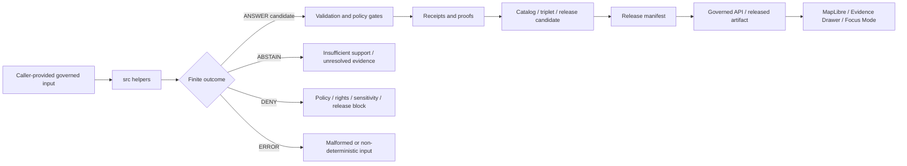

<!-- [KFM_META_BLOCK_V2]
doc_id: kfm://doc/packages-domains-settlements-infrastructure-src-readme
title: Settlements Infrastructure Source Tree README
type: standard
version: v1
status: draft
owners: OWNER_TBD
created: 2026-06-14
updated: 2026-06-14
policy_label: public
related:
  - packages/domains/settlements-infrastructure/README.md
  - packages/domains/settlements-infrastructure/src/settlements_infrastructure/README.md
  - docs/domains/settlements-infrastructure/README.md
  - docs/domains/settlements-infrastructure/ARCHITECTURE.md
  - docs/domains/settlements-infrastructure/SOURCE_ROLES.md
  - docs/domains/settlements-infrastructure/TIME_SEMANTICS.md
  - docs/domains/settlements-infrastructure/PROMOTION.md
  - contracts/domains/settlements-infrastructure/
  - schemas/contracts/v1/domains/settlements-infrastructure/
  - policy/domains/settlements-infrastructure/
  - tests/domains/settlements-infrastructure/
  - fixtures/domains/settlements-infrastructure/
  - data/registry/settlements-infrastructure/
  - data/receipts/settlements-infrastructure/
  - data/proofs/settlements-infrastructure/
  - data/catalog/domain/settlements-infrastructure/
  - data/published/layers/settlements-infrastructure/
  - release/settlements-infrastructure/
tags:
  - kfm
  - packages
  - domains
  - settlements-infrastructure
  - src
  - python
  - settlements
  - municipalities
  - census-places
  - historic-townsites
  - infrastructure
  - public-safe-geometry
  - evidence
  - policy-aware
  - rollback
notes:
  - "README-like source-tree contract for the proposed Settlements/Infrastructure package source root."
  - "This document describes allowed implementation source placement only; it is not evidence that modules, tests, schemas, policies, release manifests, or runtime behavior exist in a mounted repository."
  - "Schemas, contracts, policy, source registries, lifecycle data, receipts, proofs, release decisions, public API routes, and UI components remain outside this source tree."
[/KFM_META_BLOCK_V2] -->

# Settlements Infrastructure Source Tree

Source-code staging area for reusable KFM Settlements/Infrastructure helpers, keeping implementation under the `packages/` responsibility root while preserving the separation between code, evidence, schemas, policy, lifecycle data, release decisions, public UI, and governed APIs.

<p>
  
  
  
  
  
  
  
  
</p>

> [!IMPORTANT]
> **Status:** PROPOSED source-tree README  
> **Path:** `packages/domains/settlements-infrastructure/src/README.md`  
> **Owning responsibility root:** `packages/`  
> **Package lane:** `packages/domains/settlements-infrastructure/`  
> **Primary import namespace:** `settlements_infrastructure` — NEEDS VERIFICATION against package metadata  
> **Default posture:** evidence-first, source-role-preserving, public-safe, sensitivity-aware, and fail-closed for infrastructure exposure, legal-status ambiguity, missing evidence, rights uncertainty, exact restricted geometry, unreleased data, and unresolved review state.  
> **Repo implementation depth:** NEEDS VERIFICATION — package metadata, import paths, tests, CI, schemas, policies, source registries, emitted receipts, proof objects, release manifests, governed API routes, MapLibre layer bindings, and runtime behavior were not inspected in this file-generation pass.

> [!NOTE]
> This README governs source-code placement under `src/`. It is not a schema, semantic contract, source registry, policy file, EvidenceBundle, receipt, proof, release manifest, public API contract, UI contract, or implementation proof.

## Quick links

- [Scope](#scope)
- [Repo fit](#repo-fit)
- [Accepted inputs](#accepted-inputs)
- [Exclusions](#exclusions)
- [Source-tree responsibilities](#source-tree-responsibilities)
- [Settlement and infrastructure posture](#settlement-and-infrastructure-posture)
- [Public-safe geometry posture](#public-safe-geometry-posture)
- [Proposed layout](#proposed-layout)
- [Trust-boundary flow](#trust-boundary-flow)
- [Finite outcomes](#finite-outcomes)
- [Testing posture](#testing-posture)
- [Development rules](#development-rules)
- [Definition of done](#definition-of-done)
- [Verification checklist](#verification-checklist)
- [Rollback](#rollback)

---

## Scope

`packages/domains/settlements-infrastructure/src/` is the proposed source-code home for the Settlements/Infrastructure package lane.

This directory may contain importable implementation modules and package-internal helper code for:

- settlement candidate normalization;
- legal municipality, census place, unincorporated place, historic townsite, ghost town, fort, depot, mission, reservation community, and neighborhood helper logic;
- settlement name normalization that preserves source text, source language where known, source role, and temporal scope;
- legal status event preparation, including incorporation, annexation, dissolution, county-seat status, boundary change, and name-change candidates;
- boundary-version and public-safe geometry preparation;
- population observation normalization where the geography, year, source, and scope remain explicit;
- civic-function context helpers;
- infrastructure asset, facility, network, node, segment, and service-area candidate helpers;
- condition or inspection observation helpers when sensitivity, time, and source limits are explicit;
- infrastructure dependency-summary helpers that avoid exposing sensitive topology or exact vulnerable geometry;
- cross-lane relation stubs for roads/rail/trade, hydrology, hazards, people/land, agriculture, archaeology, habitat, and public services;
- Evidence Drawer and Focus Mode support payload fragments for governed callers;
- deterministic identity, time-semantics, source-role, public-safe geometry, and finite-outcome helpers that can be proven with fixtures and tests.

The source tree is implementation support only. It does not decide what is true, legally authoritative, public, released, current, complete, safe to expose, or policy-allowed.

```text
RAW -> WORK / QUARANTINE -> PROCESSED -> CATALOG / TRIPLET -> PUBLISHED
```

> [!WARNING]
> This directory must not fetch live sources directly, store lifecycle data, publish map layers, expose exact restricted infrastructure geometry, bypass review, treat package output as evidence, or serve public clients directly. Public clients must use governed APIs and released artifacts.

---

## Repo fit

| Concern | This source tree owns | It must not own |
| --- | --- | --- |
| Responsibility root | Package source under `packages/` | Root-level domain authority or lifecycle authority |
| Domain segment | `settlements-infrastructure` implementation helpers | Separate root folders for `settlements`, `cities`, `infrastructure`, `townsites`, or `assets` |
| Import namespace | `settlements_infrastructure/` — proposed package module | Schemas, contracts, policies, source registries, releases, receipts, proofs |
| Trust role | Deterministic helpers, candidate builders, normalizers, public-safe derivative helpers, local pre-validation | Evidence authority, source authority, review authority, policy authority, release authority |
| Runtime posture | No-network code by default; explicit inputs and finite outputs | Hidden live calls, credentials, direct database access, background sync, direct publication, or ambient global state |

Related homes:

- `packages/domains/settlements-infrastructure/README.md` — package-level orientation.
- `packages/domains/settlements-infrastructure/src/settlements_infrastructure/README.md` — import-namespace orientation.
- `docs/domains/settlements-infrastructure/` — domain documentation and steward-facing explanation.
- `contracts/domains/settlements-infrastructure/` — semantic contracts if this repo keeps semantic Markdown there.
- `schemas/contracts/v1/domains/settlements-infrastructure/` — proposed machine-readable schema home; NEEDS VERIFICATION against current repo convention and ADRs.
- `policy/domains/settlements-infrastructure/` — allow / deny / restrict / abstain decision logic for settlement and infrastructure exposure.
- `data/registry/settlements-infrastructure/` — source identity, source roles, rights, cadence, caveats, sensitivity defaults, and activation state.
- `data/<phase>/settlements-infrastructure/`, `data/<phase>/settlements/`, or `data/<phase>/infrastructure/` — lifecycle data by phase, subject to repo-confirmed lane convention.
- `data/catalog/.../settlements-infrastructure/`, `data/triplets/.../settlements-infrastructure/`, `data/receipts/settlements-infrastructure/`, and `data/proofs/settlements-infrastructure/` — trust-bearing catalog, graph/triplet, receipt, and proof objects.
- `release/settlements-infrastructure/` or repo-confirmed release lane — promotion decisions, release manifests, correction notices, withdrawals, supersession records, and rollback targets.
- `apps/`, `packages/ui/`, `packages/maplibre/`, `apps/explorer-web/`, or repo-confirmed equivalents — governed API and public UI consumers.

---

## Accepted inputs

Code under this directory should accept caller-provided, already-admitted, fixture-scoped, review-scoped, release-candidate-scoped, or test-scoped values only.

| Input family | Accepted examples | Required handling |
| --- | --- | --- |
| Source references | Source ID, source descriptor ref, source role, rights ref, steward ref, dataset version, retrieval ref, citation key | Preserve source role and source limits; do not infer stronger authority from convenient fields. |
| Settlement candidates | place name, alternative name, legal name, settlement type, status event, county/township relation, historic context | Preserve source string, normalized string, source role, source date, and uncertainty. |
| Legal/census context | incorporation status, annexation event, census place identifier, county-seat status, historic designation | Keep legal municipality, census place, administrative label, and historic interpretation distinct. |
| Boundary candidates | source geometry, geometry ref, CRS, source scale, validity interval, generalized geometry ref, geometry confidence | Keep exact/internal geometry and public-safe geometry separate. |
| Infrastructure candidates | asset/facility/network/node/segment/service-area type, operator context where allowed, condition observation, dependency relation | Apply sensitivity and review posture before any public representation. |
| Condition observations | observed_at, collector/source, measurement type, confidence, validity, caveat, sensitivity flag | Never convert stale or source-scoped observations into current operational truth. |
| Temporal context | source date, observed date, valid/effective interval, retrieval time, run time, review time, release time, correction time | Do not collapse material time dimensions into one timestamp. |
| Evidence context | EvidenceRef, EvidenceBundle ref, citation target, review ref, proof ref, source descriptor ref | Do not pretend unresolved EvidenceRefs are evidence. |
| Policy/release context | sensitivity label, public-safe class, release ref, rollback ref, reason code, reviewer/steward decision ref | Public-safe derivatives require explicit allow/restrict context from governed callers. |

Missing source role, evidence context, temporal semantics, rights/sensitivity context, or public-safe geometry context should produce a finite failure outcome rather than a silent best-effort public output.

---

## Exclusions

Do **not** put these in `packages/domains/settlements-infrastructure/src/`:

| Excluded content | Correct home |
| --- | --- |
| Semantic contracts | `contracts/domains/settlements-infrastructure/` or repo-confirmed contract home |
| JSON Schema / machine schemas | `schemas/contracts/v1/domains/settlements-infrastructure/` or repo-confirmed schema home |
| Policy rules | `policy/domains/settlements-infrastructure/` or repo-confirmed policy home |
| Source descriptors, rights registers, sensitivity registers, cadence registers | `data/registry/settlements-infrastructure/` or repo-confirmed registry home |
| Raw/work/quarantine/processed/catalog/triplet/published data | `data/<phase>/...` responsibility roots |
| EvidenceBundles, catalog records, graph/triplet records | `data/catalog/...`, `data/triplets/...`, or repo-confirmed trust-object homes |
| Receipts and proof objects | `data/receipts/...`, `data/proofs/...`, or repo-confirmed receipt/proof homes |
| Release manifests, correction notices, rollback records, withdrawal records | `release/` |
| Public API routes or UI components | `apps/`, `packages/api/`, `packages/ui/`, `packages/maplibre/`, `ui/`, `web/`, or repo-confirmed homes |
| Live source connectors | `connectors/`, `pipelines/`, or repo-confirmed source connector home |
| Tests and fixtures | `tests/domains/settlements-infrastructure/` and `fixtures/domains/settlements-infrastructure/` or repo-confirmed equivalents |
| Operational control, emergency response, utility-disruption, or vulnerability-exposure logic | Outside this package and subject to restricted/admin policy gates |

---

## Source-tree responsibilities

Code in this source tree should be small, explicit, deterministic, and testable. Prefer pure functions and typed structures that accept all trust-bearing context as parameters.

| Responsibility | Expected behavior | Failure posture |
| --- | --- | --- |
| Normalize | Convert admitted candidate fields into package-internal value shapes while preserving source-native values and caveats | `ERROR` for malformed input; `ABSTAIN` for unsupported inference |
| Classify source role | Preserve source-role hints and flag unresolved authority ambiguity | `ABSTAIN` when role is missing; `DENY` for public output when role blocks release |
| Maintain deterministic identity | Build stable IDs from source ID, object family, spatial scope, temporal scope, version, and digest-bearing inputs | `ERROR` when ID material is incomplete or non-deterministic |
| Preserve time semantics | Keep source, observation, valid/effective, retrieval, run, review, release, correction, and rollback times distinct where material | `ABSTAIN` when time support is too weak for the requested claim |
| Distinguish settlement concepts | Keep legal municipality, census place, unincorporated place, neighborhood, historic townsite, ghost town, fort, depot, mission, and reservation community separate | `ABSTAIN` when evidence cannot support the requested class |
| Prepare infrastructure candidates | Build asset/facility/network/node/segment/service-area candidates with explicit sensitivity context | `DENY` or `ABSTAIN` when sensitivity or evidence support is missing |
| Prepare public-safe geometry | Generalize, redact, aggregate, or withhold output candidates only when caller-provided policy/release context allows | `DENY` when exact or sensitive exposure is blocked |
| Prepare relation candidates | Express cross-domain links without collapsing ownership, source role, sensitivity, or EvidenceBundle support | `ABSTAIN` when relation evidence is incomplete or contradictory |
| Explain limitations | Return structured caveats for Evidence Drawer / review surfaces | `ABSTAIN` when limitations cannot be stated from inputs |
| Support rollback | Preserve stable input/output references, method versions, and transformation reasons | `ERROR` when outputs cannot be traced |

---

## Settlement and infrastructure posture

The most important domain rule is to keep object character visible. A settlement helper should not collapse legal, census, administrative, historic, and interpreted settlement concepts into one generic place label. An infrastructure helper should not collapse asset inventory, condition observation, network topology, service-area generalization, and dependency interpretation into one public asset fact.

| Object character | Can support | Must not be treated as |
| --- | --- | --- |
| Legal municipality | Legal-status claim under stated jurisdiction, source, and effective time | Census place, populated place, or current legal status without evidence |
| Census place | Statistical geography under a census vintage | Legal municipality or incorporated status |
| Historic townsite / ghost town | Historic settlement evidence or released derivative | Exact modern location, private-property access, or current occupancy truth |
| Fort / mission / depot | Historically significant settlement/infrastructure feature | Public-safe precise location without sensitivity and review controls |
| Neighborhood / unincorporated place | Place context under source caveats | Incorporated municipality or legal boundary truth |
| Boundary version | Source-scoped geometry or released derivative | Permanent legal boundary unless supported by legal evidence and release state |
| Infrastructure asset | Asset/facility candidate under source/date/sensitivity limits | Current condition, vulnerability, ownership, or operational status by itself |
| Infrastructure network | Derived network relation for analysis and display | Canonical topology or operational dependency truth without proof and review |
| Public map layer | Released visualization artifact | EvidenceBundle, release decision, source registry, or policy authority |

---

## Public-safe geometry posture

Settlements and infrastructure can expose private-property context, precise vulnerable infrastructure, public-safety concerns, sovereignty-sensitive places, culturally sensitive historic places, or stale operational conditions. This source tree should therefore treat public output preparation as a restricted derivative process, not a default transformation.

Default rules:

- exact restricted infrastructure geometry is absent, generalized, aggregated, or withheld from public output;
- generalized geometry must preserve a transform reason, source geometry hash, public geometry hash, precision/scale note, and review context where required;
- legal boundary, census boundary, historic place location, service area, dependency area, and map display geometry remain separate object families;
- public-safe display geometry is a released derivative, not proof of legal boundary or asset condition;
- condition observations are time-bounded, source-scoped, and sensitivity-aware;
- critical infrastructure, utilities, water/wastewater/stormwater, communications, facilities, dependencies, yards, depots, and operator-sensitive details default to restricted or review until allowed;
- public UI and Focus Mode consume governed APIs and released artifacts only;
- ambiguous rights, missing EvidenceBundle, unresolved sensitivity, absent release state, or missing rollback target blocks promotion.

> [!CAUTION]
> If a helper cannot prove from explicit caller inputs that a public-safe settlement or infrastructure output is supported by evidence, source role, sensitivity, policy, review, release, correction path, and rollback target, it should return `ABSTAIN` or `DENY` rather than a softened public claim.

---

## Proposed layout

```text
packages/domains/settlements-infrastructure/src/
├── README.md
└── settlements_infrastructure/
    ├── README.md
    ├── __init__.py                         # PROPOSED: public import surface, no side effects
    ├── py.typed                            # PROPOSED: type marker if package is typed
    ├── outcomes.py                         # PROPOSED: finite outcome enums/helpers
    ├── identity.py                         # PROPOSED: deterministic identity helpers
    ├── time_semantics.py                   # PROPOSED: observed/valid/retrieved/released/corrected time helpers
    ├── evidence_refs.py                    # PROPOSED: EvidenceRef shape helpers, no bundle storage
    ├── source_roles.py                     # PROPOSED: source-role normalization helpers
    ├── settlements.py                      # PROPOSED: settlement concept helpers
    ├── names.py                            # PROPOSED: settlement name normalization helpers
    ├── legal_status.py                     # PROPOSED: incorporation/annexation/dissolution/status event helpers
    ├── boundaries.py                       # PROPOSED: boundary-version preparation helpers
    ├── population.py                       # PROPOSED: population observation helpers
    ├── civic_functions.py                  # PROPOSED: civic-function and county-seat context helpers
    ├── infrastructure_assets.py            # PROPOSED: asset/facility object helpers
    ├── infrastructure_networks.py          # PROPOSED: network/node/segment preparation helpers
    ├── dependencies.py                     # PROPOSED: dependency-summary helpers with sensitivity flags
    ├── public_safe_geometry.py             # PROPOSED: generalization/redaction candidate helpers
    ├── relations.py                        # PROPOSED: cross-domain relation stubs
    ├── layer_payloads.py                   # PROPOSED: layer descriptor fragments after release filtering
    ├── evidence_drawer_payloads.py         # PROPOSED: UI evidence fragments, not raw evidence authority
    ├── focus_mode_payloads.py              # PROPOSED: AI answer-support fragments, not AI truth
    └── validation.py                       # PROPOSED: local pre-validation utilities, not schema authority
```

Any new source file should have a clear non-authority purpose and should point to the owning schema, contract, policy, fixture, and test path when those exist.

---

## Trust-boundary flow



The package source tree appears near the beginning of the transformation chain. It prepares candidates and helper outputs. It does not close evidence, decide policy, approve release, or serve public clients.

---

## Finite outcomes

All helpers that can fail should use explicit finite outcomes rather than ambiguous booleans or silent `None` returns.

| Outcome | Meaning | Typical trigger |
| --- | --- | --- |
| `ANSWER` | The helper produced a bounded, traceable candidate or derivative for the caller's next governed step | Inputs include required source, evidence, time, identity, sensitivity, and method context |
| `ABSTAIN` | The helper cannot responsibly infer the requested output | Missing EvidenceRef, unresolved source role, ambiguous time, unsupported settlement class, or contradictory source context |
| `DENY` | The helper knows the requested output is blocked under caller-supplied policy/release/sensitivity context | Exact restricted geometry, missing release state for public output, private/sensitive infrastructure exposure, or rights block |
| `ERROR` | The input is malformed, non-deterministic, internally inconsistent, or not processable | Invalid geometry, missing required field, impossible time interval, bad digest, unsupported CRS, or type mismatch |

Outcome payloads should include reason codes, input references, method version, and next-step hints without leaking sensitive data.

---

## Testing posture

Source code under this tree should be covered by tests before promotion into working implementation.

Minimum test classes:

- import smoke test for `settlements_infrastructure`;
- deterministic identity stability tests;
- settlement type distinction tests;
- legal municipality versus census place tests;
- boundary geometry hash and transform tests;
- public-safe geometry no-leak tests;
- infrastructure restricted geometry tests;
- condition observation time semantics tests;
- source-role missing/ambiguous tests;
- EvidenceRef missing/invalid tests;
- finite outcome exhaustiveness tests;
- no-network / no-credential / no-side-effect import tests;
- fixture-only pipeline smoke tests;
- API envelope compatibility tests if this package prepares governed API payload fragments;
- release candidate traceability tests if this package prepares release-support fragments.

Suggested command names are PROPOSED until verified against repo tooling:

```bash
python -m pytest tests/domains/settlements-infrastructure
python -m pytest tests/e2e/test_settlements_infrastructure_promotion.py
python -m pytest tests/e2e/test_map_layer_evidence_drawer.py
```

---

## Development rules

1. Keep import-time behavior boring: no network, no model calls, no source fetching, no writes, no registry mutation, and no public-serving side effects.
2. Prefer typed pure functions that accept explicit source/evidence/time/policy context from callers.
3. Never hide evidence gaps behind generated prose or convenience defaults.
4. Preserve source values and normalized values when both matter.
5. Keep legal, census, historic, administrative, and map-display object families separate.
6. Keep exact/internal geometry and public-safe geometry separate.
7. Keep condition observations time-bounded and source-scoped.
8. Treat infrastructure exposure as deny/review by default until caller-supplied policy says otherwise.
9. Return finite outcomes with reason codes instead of silently coercing invalid or unsupported records.
10. Put schemas, contracts, policy, registries, data, receipts, proofs, releases, fixtures, and tests in their own responsibility roots.

---

## Definition of done

This source tree is not implementation-complete until all applicable items are satisfied:

- package metadata confirms the import namespace;
- modules are present with typed public interfaces;
- imports have no side effects;
- source files have matching tests and fixtures;
- schema and contract references resolve to canonical homes;
- policy/release dependencies are external and explicit;
- no raw/work/quarantine/processed/catalog/published data is stored under `src/`;
- no EvidenceBundle, receipt, proof, release manifest, or rollback record is authored under `src/`;
- no public UI reads package code directly;
- no exact restricted infrastructure geometry is emitted without explicit restricted/admin context;
- generated derivatives include traceable method/version/context fields;
- finite outcome tests cover `ANSWER`, `ABSTAIN`, `DENY`, and `ERROR`;
- rollback or removal of the package source does not orphan published artifacts or trust objects.

---

## Verification checklist

Before treating this README as active implementation guidance, verify:

- [ ] `packages/domains/settlements-infrastructure/` exists in the mounted repo.
- [ ] `packages/domains/settlements-infrastructure/src/` exists or is created in a PR.
- [ ] `settlements_infrastructure` is the approved import namespace.
- [ ] Package metadata points to this source tree.
- [ ] `docs/domains/settlements-infrastructure/` exists and is the steward-facing domain doc lane.
- [ ] `contracts/domains/settlements-infrastructure/` or successor semantic-contract path exists.
- [ ] `schemas/contracts/v1/domains/settlements-infrastructure/` or successor schema path exists.
- [ ] `policy/domains/settlements-infrastructure/` or successor policy path exists.
- [ ] Source registry entries exist for approved settlement/infrastructure sources.
- [ ] Tests and fixtures exist for legal/census distinctions, restricted infrastructure, public-safe geometry, evidence refs, and finite outcomes.
- [ ] CI validates package import, typing, linting, unit tests, schema drift, policy gates, and public no-leak behavior.
- [ ] Release and rollback manifests are managed outside this source tree.

---

## Rollback

If this source tree is added incorrectly or becomes a parallel authority:

1. Freeze new imports and open a drift entry.
2. Identify downstream modules, tests, fixtures, docs, schemas, policies, receipts, proofs, and release candidates that reference it.
3. Move misplaced non-code material back to the correct responsibility root.
4. Revert or supersede source files with `git mv` where history should be preserved.
5. Keep any cited README as deprecated with a successor link until references are repaired.
6. Re-run import, no-network, fixture, schema, policy, catalog-closure, and release rollback checks.
7. Do not delete receipts, proofs, release manifests, or published rollback targets from this source tree because they should never have been stored here.

---

## Maintainer note

This README intentionally uses PROPOSED and NEEDS VERIFICATION language because no mounted repository inspection, tests, CI logs, package metadata, or emitted KFM artifacts were used to prove implementation depth in this file-generation pass. It is a repo-ready source-tree contract for the requested path, not a claim that the path is already wired into production.

