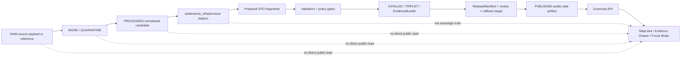

<!-- [KFM_META_BLOCK_V2]
doc_id: kfm://doc/packages-domains-settlements-infrastructure-src-settlements-infrastructure-readme
title: Settlements Infrastructure Python Namespace README
type: standard
version: v1
status: draft
owners: OWNER_TBD
created: 2026-06-14
updated: 2026-06-14
policy_label: public
related:
  - packages/domains/settlements-infrastructure/README.md
  - packages/domains/settlements-infrastructure/src/README.md
  - docs/domains/settlements-infrastructure/README.md
  - docs/domains/settlements-infrastructure/ARCHITECTURE.md
  - contracts/domains/settlements-infrastructure/
  - schemas/contracts/v1/domains/settlements-infrastructure/
  - policy/domains/settlements-infrastructure/
  - tests/domains/settlements-infrastructure/
  - fixtures/domains/settlements-infrastructure/
  - data/registry/settlements-infrastructure/
  - data/catalog/domain/settlements-infrastructure/
  - data/proofs/settlements-infrastructure/
  - data/receipts/settlements-infrastructure/
  - data/published/layers/settlements-infrastructure/
  - release/settlements-infrastructure/
tags:
  - kfm
  - packages
  - domains
  - settlements-infrastructure
  - python
  - namespace
  - settlements
  - infrastructure
  - public-safe-geometry
  - evidence
  - policy-aware
  - rollback
notes:
  - "README-like source namespace contract for the proposed settlements_infrastructure Python package."
  - "This document describes allowed implementation helpers only; it does not prove the package exists in a mounted repository."
  - "Schemas, semantic contracts, policy, registries, lifecycle data, receipts, proofs, releases, public API routes, and UI components remain outside this namespace."
[/KFM_META_BLOCK_V2] -->

# Settlements Infrastructure Python Namespace

Implementation namespace for reusable KFM Settlements/Infrastructure helpers that normalize, classify, prepare, and validate evidence-bound settlement and infrastructure objects without becoming source, schema, policy, release, or public truth authority.

<p>
  
  
  
  
  
  
  
</p>

> [!IMPORTANT]
> **Status:** PROPOSED namespace README  
> **Path:** `packages/domains/settlements-infrastructure/src/settlements_infrastructure/README.md`  
> **Owning responsibility root:** `packages/`  
> **Parent package lane:** `packages/domains/settlements-infrastructure/`  
> **Import namespace:** `settlements_infrastructure`  
> **Truth posture:** CONFIRMED doctrine / PROPOSED implementation / UNKNOWN repo depth  
> **Repo implementation depth:** NEEDS VERIFICATION — package metadata, Python modules, tests, validators, schemas, policy files, source descriptors, release manifests, emitted receipts, proof objects, CI workflows, API routes, UI bindings, and runtime behavior were not inspected in this file-generation pass.

> [!NOTE]
> This README is a namespace contract. It describes what Python source files under `settlements_infrastructure/` may responsibly do. It is not a schema, a source registry, a release manifest, a public API contract, a proof artifact, a receipt, or evidence that implementation is complete.

## Quick links

- [Scope](#scope)
- [Repo fit](#repo-fit)
- [Accepted inputs](#accepted-inputs)
- [Excluded inputs and outputs](#excluded-inputs-and-outputs)
- [Namespace responsibilities](#namespace-responsibilities)
- [Suggested module layout](#suggested-module-layout)
- [Domain boundaries](#domain-boundaries)
- [Evidence and source-role rules](#evidence-and-source-role-rules)
- [Identity and time rules](#identity-and-time-rules)
- [Infrastructure sensitivity rules](#infrastructure-sensitivity-rules)
- [Trust-boundary flow](#trust-boundary-flow)
- [Finite outcomes](#finite-outcomes)
- [Validation and tests](#validation-and-tests)
- [Development rules](#development-rules)
- [Definition of done](#definition-of-done)
- [Verification checklist](#verification-checklist)
- [Rollback](#rollback)

---

## Scope

`packages/domains/settlements-infrastructure/src/settlements_infrastructure/` is the PROPOSED Python import namespace for reusable implementation helpers in the KFM Settlements/Infrastructure lane.

The namespace may contain code that helps transform or prepare evidence-bound representations of:

- settlements;
- legal municipalities;
- census places;
- historic townsites;
- ghost towns;
- forts, missions, depots, and other historically significant settlement features when policy permits;
- settlement names and status events;
- boundary versions and generalized public-safe geometry fragments;
- population observations;
- civic functions;
- infrastructure assets;
- infrastructure facilities;
- infrastructure networks;
- infrastructure nodes and segments;
- service areas;
- condition or inspection observations when restricted handling is respected;
- settlement-to-infrastructure relations;
- cross-lane relation stubs for transport, hydrology, hazards, people/land, and archaeology;
- evidence payload fragments for governed UI surfaces;
- finite outcome helpers for `ANSWER`, `ABSTAIN`, `DENY`, and `ERROR` decisions.

The namespace must keep KFM's core trust posture visible: generated or normalized code output is not sovereign truth; EvidenceBundle and release state carry authority.

---

## Repo fit

| Question | Answer |
| --- | --- |
| Responsibility root | `packages/` |
| Package lane | `packages/domains/settlements-infrastructure/` |
| Source root | `packages/domains/settlements-infrastructure/src/` |
| Import namespace | `settlements_infrastructure` |
| Current implementation status | PROPOSED / NEEDS VERIFICATION |
| Public serving path | Governed APIs and released artifacts only; not direct package imports from public UI |
| Canonical schemas | `schemas/contracts/v1/domains/settlements-infrastructure/` |
| Semantic contracts | `contracts/domains/settlements-infrastructure/` |
| Release policy | `policy/domains/settlements-infrastructure/` and release gates under the proper policy/release roots |
| Source descriptors and rights | `data/registry/settlements-infrastructure/` or the repo's canonical source registry lane |
| Receipts and proofs | `data/receipts/settlements-infrastructure/`, `data/proofs/settlements-infrastructure/` |
| Published artifacts | `data/published/layers/settlements-infrastructure/` or release-approved published lanes |
| Release decisions | `release/settlements-infrastructure/` or repo-approved release manifest path |

This namespace is allowed to implement reusable mechanics. It is not allowed to become a parallel authority root for domain meaning, schema shape, source rights, sensitivity policy, release approval, public UI behavior, receipts, proofs, or canonical data.

---

## Accepted inputs

Code under this namespace may accept only bounded, explicit, testable inputs such as:

- already-ingested source-record references;
- source descriptor IDs;
- evidence references;
- normalized field dictionaries from governed pipeline stages;
- schema-validated DTO-like objects supplied by callers;
- geometry objects with CRS, precision, transform lineage, and sensitivity context;
- status-event records with source, date, and evidence support;
- population observations with year, geography, source, and scope;
- infrastructure network fragments with source, operator context where allowed, temporal scope, and sensitivity flags;
- policy decision summaries supplied by the policy layer;
- release-state summaries supplied by release/candidate workflows;
- test fixtures that are synthetic, redacted, rights-clear, or explicitly marked as restricted fixture material;
- configuration objects that point to canonical registries rather than embedding registry truth.

Accepted inputs must be treated as representations, not proof by themselves. Where a material claim depends on evidence, the caller must be able to resolve EvidenceRef to EvidenceBundle before public-facing use.

---

## Excluded inputs and outputs

This namespace must not directly own or store:

- raw source payloads;
- credentials, API tokens, private service URLs, or secret material;
- source registries or rights ledgers;
- schema files as canonical authority;
- semantic contracts as canonical authority;
- policy rules as canonical authority;
- release manifests or promotion approvals;
- receipts, proof bundles, or rollback records;
- published public layer artifacts;
- direct public API routes;
- UI components or MapLibre layer configuration authority;
- direct model outputs as truth;
- unsupported claims about legal settlement status, municipal boundary, infrastructure condition, ownership, operator responsibility, hazard exposure, or critical dependency;
- exact sensitive infrastructure geometry intended for public display;
- unreviewed critical infrastructure dependency details;
- living-person residence, ownership, or sensitive private-property overlays without appropriate People/Land policy and release gates;
- archaeology, sacred/cultural, or sovereignty-sensitive locations without the appropriate restricted review lane.

> [!WARNING]
> Do not use this namespace as a shortcut around governed promotion. A successful Python function return value is not a publication decision. Public release still requires evidence, rights, sensitivity, validation, review state where required, release manifest, correction path, and rollback target.

---

## Namespace responsibilities

The namespace may provide implementation helpers for these responsibilities.

| Responsibility | Allowed here? | Notes |
| --- | --- | --- |
| Normalize settlement names | Yes | Preserve source string, normalized form, source role, language where available, and time scope. |
| Distinguish legal municipality from census place | Yes | Helpers may classify or prepare claims; they must not infer legal status without evidence. |
| Prepare settlement status events | Yes | Incorporation, annexation, dissolution, county-seat, and status-change helpers require source/date/evidence fields. |
| Prepare boundary-version objects | Yes | Must keep CRS, precision, source, transform lineage, validity time, and sensitivity/generalization state. |
| Prepare infrastructure asset records | Yes | Must include source, type, date/validity context, sensitivity, and public-safe handling flags. |
| Prepare topology fragments | Yes | Network node/segment helpers are derivative preparation only; graph truth remains evidence/release-bound. |
| Prepare public-safe geometry fragments | Yes | Generalization/redaction helpers may produce candidates, not release decisions. |
| Build Evidence Drawer fragments | Limited | Only evidence-filtered payload fragments; not raw EvidenceBundle authority. |
| Build Focus Mode support objects | Limited | AI support fragments must be evidence-bound and finite-outcome aware. |
| Evaluate release policy | No | Policy engine and policy files remain outside this namespace. |
| Approve publication | No | Release root owns release decisions. |
| Store canonical objects | No | Canonical/lifecycle data belongs in data roots, not package code. |
| Serve public UI directly | No | Public clients use governed APIs and released artifacts. |

---

## Suggested module layout

The exact module tree is PROPOSED and requires repo/package-manager verification before treating it as current implementation.

```text
packages/domains/settlements-infrastructure/src/settlements_infrastructure/
├── README.md
├── __init__.py                         # PROPOSED: public import surface, no side effects
├── py.typed                            # PROPOSED: type marker if package is typed
├── outcomes.py                         # PROPOSED: finite outcome enums/helpers
├── identity.py                         # PROPOSED: deterministic identity helpers
├── time_semantics.py                   # PROPOSED: observed/valid/retrieved/released/corrected time helpers
├── evidence_refs.py                    # PROPOSED: EvidenceRef shape helpers, no bundle storage
├── source_roles.py                     # PROPOSED: source-role normalization helpers
├── settlements.py                      # PROPOSED: settlement concept helpers
├── names.py                            # PROPOSED: settlement name normalization helpers
├── legal_status.py                     # PROPOSED: incorporation/annexation/dissolution/status event helpers
├── boundaries.py                       # PROPOSED: boundary-version preparation helpers
├── population.py                       # PROPOSED: population observation helpers
├── civic_functions.py                  # PROPOSED: civic-function and county-seat context helpers
├── infrastructure_assets.py            # PROPOSED: asset/facility object helpers
├── infrastructure_networks.py          # PROPOSED: network/node/segment preparation helpers
├── dependencies.py                     # PROPOSED: dependency-summary helpers with sensitivity flags
├── public_safe_geometry.py             # PROPOSED: generalization/redaction candidate helpers
├── relations.py                        # PROPOSED: cross-domain relation stubs
├── layer_payloads.py                   # PROPOSED: layer descriptor fragments after release filtering
├── evidence_drawer_payloads.py         # PROPOSED: UI evidence fragments, not raw evidence authority
├── focus_mode_payloads.py              # PROPOSED: AI answer-support fragments, not AI truth
└── validation.py                       # PROPOSED: local pre-validation utilities, not schema authority
```

### `__init__.py` rule

`__init__.py` should be boring and low-risk:

- no network calls;
- no file-system writes;
- no import-time registry loading;
- no model calls;
- no source fetching;
- no promotion decisions;
- no release decisions;
- no logging of sensitive inputs;
- no hidden defaults that weaken policy.

A package import must not change KFM state.

---

## Domain boundaries

Settlements/Infrastructure is not a flat place layer. It should preserve distinctions that matter for evidence, law, time, and public safety.

| Object or concept | Namespace handling rule |
| --- | --- |
| Settlement | Human place concept; not automatically a legal municipality. |
| Legal municipality | Requires legal/status evidence; do not infer from name, label, or census record alone. |
| Census place | Census geography; do not conflate with municipality or historical settlement. |
| Historic townsite / ghost town | Documentary/historic claim; preserve uncertainty and source role. |
| Settlement boundary version | Time-scoped geometry claim with source, CRS, precision, transform lineage, and evidence. |
| Population observation | Source/year/geography scoped observation, not a timeless population fact. |
| Civic function | Time-scoped role, such as county seat, school, courthouse, post office, or other civic context. |
| Infrastructure asset | Bridge, utility facility, road asset, rail facility, public works object, or similar; public safety review may apply. |
| Infrastructure network | Grouping or topology representation; may be public, restricted, generalized, or aggregate depending on sensitivity. |
| Service area | Public-safe aggregate or restricted internal geometry depending on operator/security/sensitivity context. |
| Dependency | Critical dependency defaults to restricted/review unless release policy explicitly permits a public summary. |

---

## Evidence and source-role rules

This namespace must keep evidence and source-role requirements visible in every object preparation path.

### Minimum evidence posture

| Claim type | Minimum support expected before public-facing use |
| --- | --- |
| Settlement exists | Source descriptor, source record reference, evidence reference, observed/retrieval time, and rights/sensitivity state. |
| Settlement has a name | Source name string, normalized name, source role, language/script where available, and time context. |
| Settlement has legal status | Legal or documentary evidence; date/event support; no inference from label alone. |
| Boundary is valid for time period | Boundary source, CRS, transform, precision, valid time, evidence reference, and sensitivity/generalization state. |
| Population value | Source, year/date, geography, method/scope, and citation support. |
| Infrastructure asset exists | Source, asset type, location precision, time context, sensitivity state, and evidence reference. |
| Infrastructure condition/inspection | Inspection/condition source, date, method, rights, sensitivity, and public-release approval if exposed. |
| Infrastructure dependency | Source, method, target/source object IDs, sensitivity state, and restricted review by default. |
| Cross-domain relation | Both object references, relation type, method, evidence, time, confidence, and policy state. |

### Source-role separation

Helpers should preserve, not flatten, the difference between:

- legal authority sources;
- administrative sources;
- census/statistical sources;
- operational infrastructure sources;
- inspection/condition sources;
- historical documentary sources;
- local/archive sources;
- community/corroborating sources;
- generated or model-assisted interpretations.

Generated outputs may support review, but they must not be promoted as source authority.

---

## Identity and time rules

Identity helpers should prefer deterministic, reviewable IDs where practical. A PROPOSED deterministic basis is:

```text
source_id + object_role + temporal_scope + normalized_digest
```

This README does not make that basis canonical. Canonical identity shape belongs in the schema/contract authority roots and requires validation.

### Time fields must not collapse

When material, helpers must preserve distinctions between:

- `source_time` — when the source says the thing existed or occurred;
- `observed_at` — when the observation was made;
- `valid_from` / `valid_to` — when the claim is valid for the represented world state;
- `retrieved_at` — when KFM fetched or accessed the source;
- `processed_at` — when KFM normalized or transformed the representation;
- `released_at` — when a public-safe artifact was released;
- `corrected_at` — when a correction notice or supersession was issued.

> [!CAUTION]
> A current map feature, a historical map label, a census geography, and a legal municipality record may all use the same place name while referring to different object roles, time scopes, authority levels, or geometries.

---

## Infrastructure sensitivity rules

Infrastructure is useful for public maps, but some details can expose safety, security, operator, or critical-dependency risk.

The namespace should default to conservative handling for:

- exact critical facility geometry;
- bridge/structure condition or inspection details;
- utility, water, wastewater, stormwater, power, communications, or security-sensitive assets;
- operator-sensitive network details;
- emergency-service dependency paths;
- public-safety access/control claims;
- facility service areas when exposure could reveal vulnerability;
- infrastructure dependencies derived from multiple sources;
- precise relation between a sensitive facility and a hazard exposure;
- current operational restrictions not cleared for public release.

Allowed public-facing derivatives should be:

- released;
- source-supported;
- rights-cleared;
- sensitivity-reviewed;
- generalized or aggregated when needed;
- accompanied by evidence and limitation badges;
- traceable to correction and rollback paths.

---

## Trust-boundary flow



The namespace sits inside the implementation path. It does not bypass validation, policy, catalog/proof closure, release state, or governed API serving.

---

## Finite outcomes

Helpers that return decisions should use finite outcomes instead of ambiguous booleans.

| Outcome | Meaning in this namespace |
| --- | --- |
| `ANSWER` | The helper can produce a bounded, non-publication decision or prepared fragment from sufficient inputs. |
| `ABSTAIN` | Inputs are insufficient to classify, normalize, relate, or prepare the object safely. |
| `DENY` | Policy, rights, sensitivity, release state, or scope blocks the requested helper output. |
| `ERROR` | A tool, validation, parsing, geometry, configuration, or runtime failure occurred. |

A helper returning `ANSWER` does not mean the object is publishable. It means only that the helper completed its bounded responsibility.

---

## Validation and tests

Tests should prove that the namespace preserves governance boundaries, not merely that code runs.

### Required test themes

| Test theme | Example expectation |
| --- | --- |
| Import safety | Importing `settlements_infrastructure` performs no network, file-write, source-fetch, model-call, or promotion action. |
| Legal municipality distinction | Census place helpers do not silently classify a place as a municipality. |
| Status evidence | Incorporation, annexation, dissolution, and county-seat events require source/date/evidence. |
| Boundary precision | Boundary helpers preserve CRS, transform, precision, valid time, and sensitivity fields. |
| Infrastructure no-leak | Sensitive exact facility geometry and dependency details default to `DENY` or restricted handling. |
| Evidence references | EvidenceRef-like inputs are preserved and not replaced by generated text. |
| Time semantics | Source, observed, valid, retrieval, release, and correction times are not collapsed. |
| Source roles | Administrative, legal, census, historic, operational, and generated source roles remain distinct. |
| Public-safe geometry | Generalization candidates include transform metadata and do not imply release approval. |
| Finite outcomes | Decision helpers return `ANSWER`, `ABSTAIN`, `DENY`, or `ERROR` with reason codes. |
| No direct public path | Layer/Evidence Drawer/Focus fragments are marked as governed API support only. |
| Rollback metadata | Prepared release candidates can be tied back to prior artifact IDs or rollback targets by caller-supplied metadata. |

### Proposed local commands

Commands are PROPOSED until the repository's package manager and test layout are verified.

```bash
# NEEDS VERIFICATION: run from repository root after package metadata exists
python -m pytest tests/domains/settlements-infrastructure
```

```bash
# NEEDS VERIFICATION: run package-specific type checks if configured
python -m mypy packages/domains/settlements-infrastructure/src/settlements_infrastructure
```

```bash
# NEEDS VERIFICATION: run markdown checks if repo tooling supports it
markdownlint packages/domains/settlements-infrastructure/src/settlements_infrastructure/README.md
```

---

## Development rules

1. Keep functions pure where practical.
2. Prefer explicit inputs over hidden global state.
3. Do not fetch sources directly unless the package contract later defines a controlled adapter and source registry integration.
4. Do not read RAW, WORK, QUARANTINE, or published paths directly from public-facing helpers.
5. Do not embed source authority or rights decisions in code constants except as test fixtures clearly labeled synthetic.
6. Do not encode policy decisions as informal `if` statements when canonical policy belongs under `policy/`.
7. Do not log raw sensitive infrastructure, restricted geometry, private ownership, living-person, or security-relevant details.
8. Do not silently generalize geometry without producing transform metadata.
9. Do not infer legal status, operator responsibility, infrastructure condition, or dependency from names alone.
10. Do not treat map tiles, layer manifests, graph projections, generated summaries, or helper outputs as canonical truth.
11. Preserve deterministic identity inputs and digest fields when available.
12. Preserve enough provenance for a reviewer to reconstruct why a helper returned `ANSWER`, `ABSTAIN`, `DENY`, or `ERROR`.

---

## Definition of done

This namespace is not done merely because files exist. A credible implementation should have:

- package metadata confirming the source root and import namespace;
- an intentionally small public import surface;
- no import-time side effects;
- typed or schema-adjacent DTO helpers that do not become schema authority;
- tests for settlement/census/legal distinction;
- tests for boundary version and time semantics;
- tests for infrastructure no-leak behavior;
- tests for source-role preservation;
- finite outcome reason codes;
- synthetic/redacted fixtures only;
- links to canonical schemas/contracts/policy rather than duplicating them;
- a documented release/promotion boundary;
- a rollback-safe migration plan for any renamed modules;
- README and package docs kept synchronized with behavior.

---

## Verification checklist

Before relying on this namespace as implemented, verify:

- [ ] `packages/domains/settlements-infrastructure/pyproject.toml` or repo-level package metadata includes this source root, or an ADR explains the package layout.
- [ ] `src/settlements_infrastructure/__init__.py` exists and has no side effects.
- [ ] Public functions do not perform source fetches, policy approval, publication, or UI serving directly.
- [ ] Tests exist under the repo-approved tests lane.
- [ ] Fixtures are synthetic, redacted, or rights-cleared.
- [ ] Canonical schemas live under `schemas/contracts/v1/domains/settlements-infrastructure/` or the ADR-approved schema home.
- [ ] Semantic contracts live under `contracts/domains/settlements-infrastructure/`.
- [ ] Policy lives under `policy/domains/settlements-infrastructure/` or approved policy root.
- [ ] Source descriptors, rights, and sensitivity records live under the approved registry roots.
- [ ] Receipts and proofs are emitted to their own object-family roots, not this package.
- [ ] Release manifests and rollback targets live under release-approved roots, not this package.
- [ ] Sensitive infrastructure and exact facility geometry are denied, restricted, generalized, or aggregated by default.
- [ ] Public layer fragments are served only through governed APIs after release approval.
- [ ] Evidence Drawer and Focus Mode payloads remain evidence-bound and policy-filtered.

---

## Rollback

Changes to this namespace should be reversible.

| Change type | Rollback action |
| --- | --- |
| Add module | Remove module and tests in one PR; record why the responsibility moved or was rejected. |
| Rename module | Keep compatibility shim only if repo policy permits; mark deprecated; remove after migration window. |
| Change identity helper | Keep old digest/ID version path; add migration note; do not rewrite historical IDs silently. |
| Change public-safe geometry helper | Preserve old transform metadata; emit supersession/correction where released artifacts depended on it. |
| Change finite outcome reason code | Keep compatibility mapping; update tests and downstream docs. |
| Move schema-like logic out of package | Migrate to `schemas/contracts/v1/...`; leave README pointer; add drift/ADR note if needed. |
| Move policy-like logic out of package | Migrate to `policy/...`; add tests proving package no longer owns policy. |
| Remove unsafe helper | Add denial test and release/correction note if prior outputs may have been affected. |

Rollback must preserve auditability. Do not delete the only explanation of a released or reviewed behavior.

---

## Evidence basis

This README is grounded in KFM doctrine and placement rules available in the session:

- Directory Rules: package/domain placement, authority roots, anti-pattern prevention, and lifecycle separation.
- Settlements/Infrastructure architecture doctrine: settlement/legal/census/historic distinctions, infrastructure exposure controls, public-safe geometry, source-role handling, cross-lane relations, finite outcomes, governed UI/Focal Mode support, promotion, correction, and rollback.
- KFM core invariants: evidence before generated language, governed APIs for public surfaces, lifecycle separation, policy-aware fail-safe defaults, cite-or-abstain, receipts/proofs/releases as separate object families, and AI as evidence-subordinate.

Implementation evidence remains UNKNOWN until a mounted repo, tests, package metadata, schemas, policies, workflows, runtime logs, emitted artifacts, and release records are inspected.

<details>
<summary>Reviewer notes</summary>

- This README intentionally uses the import namespace `settlements_infrastructure` while the package lane remains `settlements-infrastructure`.
- Hyphenated directory names are appropriate for repo path readability; underscore names are appropriate for Python import namespaces.
- Any future move from `settlements_infrastructure` to another namespace should use a migration note and compatibility window if downstream imports exist.
- If the repo later adopts a different domain slug, this README should be updated rather than leaving two competing package lanes.

</details>

