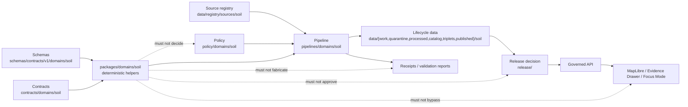

<!-- [KFM_META_BLOCK_V2]
doc_id: kfm://doc/NEEDS-VERIFICATION/packages-domains-soil-readme
title: Soil Domain Package README
type: readme
version: v0.2
status: draft
owners:
  - OWNER_TBD_PACKAGE_STEWARD
  - OWNER_TBD_SOIL_DOMAIN_STEWARD
  - OWNER_TBD_SCHEMA_STEWARD
  - OWNER_TBD_EVIDENCE_STEWARD
  - OWNER_TBD_POLICY_STEWARD
created: NEEDS VERIFICATION — confirm original stub creation date from git history
updated: 2026-06-14
policy_label: public
path: packages/domains/soil/README.md
related:
  - packages/README.md
  - packages/domains/README.md
  - docs/domains/soil/README.md
  - docs/doctrine/directory-rules.md
  - docs/doctrine/trust-membrane.md
  - docs/doctrine/lifecycle-law.md
  - contracts/domains/soil/README.md
  - schemas/contracts/v1/domains/soil/
  - policy/domains/soil/
  - pipelines/domains/soil/
  - data/registry/sources/soil/
  - data/receipts/soil/
  - data/proofs/evidence_bundle/
  - release/
tags: [kfm, packages, domains, soil, shared-library, support-type, ssurgo, sda, mesonet, evidence-boundary]
notes:
  - "README-like package-lane document; package maturity is experimental while document status remains draft."
  - "This file orients shared soil helper code only. It is not soil doctrine, schema authority, contract authority, source registry, policy authority, pipeline logic, lifecycle data, EvidenceBundle authority, or release approval."
  - "Current implementation depth below this README remains NEEDS VERIFICATION until the mounted repo is recursively inspected."
[/KFM_META_BLOCK_V2] -->

<a id="top"></a>

# Soil Domain Package

Shared-library home for soil-domain helper code that preserves source role, support type, evidence references, policy labels, and KFM lifecycle boundaries.


> [!IMPORTANT]
> **Status:** experimental package lane / draft README  
> **Owners:** `OWNER_TBD_PACKAGE_STEWARD`, `OWNER_TBD_SOIL_DOMAIN_STEWARD`  
> **Path:** `packages/domains/soil/README.md`  
> **Responsibility root:** `packages/` — shared libraries used by apps, workers, pipelines, and tools  
> **Truth posture:** CONFIRMED placement boundary / PROPOSED helper responsibilities / UNKNOWN package implementation depth  
> **Public posture:** no public client should import this package directly for truth, policy, evidence, lifecycle, or release decisions.

## Quick jump

| Start here | Boundaries | Soil helpers | Review |
|---|---|---|---|
| [Scope](#1-scope) · [Repo fit](#2-repo-fit) · [Evidence boundary](#3-evidence-boundary) | [Accepted inputs](#4-accepted-inputs) · [Exclusions](#5-exclusions) · [Trust membrane](#6-trust-membrane) | [Support types](#7-soil-support-types) · [Helper responsibilities](#8-helper-responsibilities) · [Directory map](#9-directory-map) | [Validation](#10-validation) · [Definition of done](#11-definition-of-done) · [Rollback](#12-rollback) · [Open questions](#13-open-questions) |

---

## 1. Scope

`packages/domains/soil/` is the proposed shared-library lane for reusable soil-domain helper code.

It may contain deterministic, side-effect-minimal helpers for:

- preserving and normalizing soil identifiers such as `mukey`, `cokey`, `chkey`, station identifiers, grid-cell identifiers, and query hashes;
- mapping source-shaped records into schema-shaped candidate DTOs without redefining schema authority;
- preserving `source_refs`, `evidence_refs`, `content_spec_hash`, `run_hash`, `query_hash`, `geometry_hash`, policy labels, units, time basis, quality flags, and known limitations;
- separating static soil survey support from station observations, gridded derivatives, satellite grids, pedon/profile evidence, and interpretation summaries;
- preparing package-safe objects for pipelines, validators, governed APIs, tests, fixtures, and Evidence Drawer payload builders.

It must stay subordinate to KFM doctrine:

```text
RAW -> WORK / QUARANTINE -> PROCESSED -> CATALOG / TRIPLET -> PUBLISHED
```

A package helper can translate, normalize, and preserve references. It cannot decide that a soil claim is true, admissible, validated, promoted, published, or safe for public display.

[⬆ Back to top](#top)

---

## 2. Repo fit

| Surface | Correct home | Relationship to this package |
|---|---|---|
| Human-facing soil domain scope | `docs/domains/soil/` | Explains the soil lane; this package does not replace it. |
| Soil object meaning | `contracts/domains/soil/` | Semantic contract authority; helpers may implement against it but cannot redefine it. |
| Soil machine shapes | `schemas/contracts/v1/domains/soil/` | JSON Schema / machine validation authority; helpers may consume generated types. |
| Soil policy | `policy/domains/soil/` and sensitivity / rights roots | Admissibility, exposure, redaction, restrict, deny, and abstain decisions live there. |
| Soil source descriptors | `data/registry/sources/soil/` | Source identity, rights, cadence, access method, and limitations live there. |
| Soil executable pipeline logic | `pipelines/domains/soil/` | Runs transformations and emits candidates, receipts, and reports. |
| Soil pipeline configuration | `pipeline_specs/soil/` | Declarative source/AOI/query/run configuration. |
| Soil lifecycle data | `data/<phase>/soil/` | RAW/WORK/QUARANTINE/PROCESSED/CATALOG/TRIPLET/PUBLISHED state; helpers must not write here secretly. |
| Soil receipts and proofs | `data/receipts/soil/`, `data/proofs/` | Receipts/proofs are emitted by governed flows, not fabricated by helper functions. |
| Soil release decisions | `release/` | Release manifests, rollback cards, corrections, and promotion decisions. |
| Soil package tests | `tests/packages/domains/soil/` or repo-confirmed equivalent | Validates helper behavior and anti-bypass boundaries. |
| Soil package fixtures | `fixtures/packages/domains/soil/` or repo-confirmed equivalent | Synthetic or sanitized helper fixtures only. |

> [!NOTE]
> `packages/domains/soil/` is correct only for reusable shared helper code. If a file’s primary responsibility is source admission, policy, schema, pipeline execution, lifecycle data, proof, release, UI, or public API behavior, it belongs under that responsibility root instead.

[⬆ Back to top](#top)

---

## 3. Evidence boundary

Current repo evidence for this specific package lane is intentionally narrow.

| Claim | Status | Basis |
|---|---|---|
| `packages/domains/soil/README.md` exists. | CONFIRMED | Current GitHub file fetch in this authoring pass. |
| This README is being expanded from a greenfield scaffold stub. | CONFIRMED | Existing file labels status as `PROPOSED (greenfield scaffold)`. |
| Parent root `packages/domains/` defines domain packages as shared helper code, not doctrine, contracts, schemas, policy, lifecycle data, evidence, or release. | CONFIRMED | Parent README boundary. |
| Soil helper implementation files exist below this README. | UNKNOWN | No recursive directory inventory was performed in this authoring pass. |
| Package language/runtime, manifest, exports, CI workflow, and test runner are known. | UNKNOWN | Must be verified from mounted repo evidence. |
| Soil source endpoints, rights, rate limits, and current schemas are safe for live use. | NEEDS VERIFICATION | Source activation requires source registry, rights, policy, and fixture/dry-run checks. |

[⬆ Back to top](#top)

---

## 4. Accepted inputs

This package may accept only bounded, reviewable helper inputs.

| Input class | Accepted form | Required preservation |
|---|---|---|
| Static soil survey identifiers | `mukey`, `cokey`, `chkey`, `areasymbol`, `musym` | Source id, query hash, source version, join path, geometry hash when geometry participates. |
| Soil component / horizon candidate records | Schema-shaped or fixture-shaped objects | Native identifiers, units, depth basis, source table, source refs, validation context. |
| Station soil-moisture records | Station id, variable, depth, timestamp, value, QC flags | Source timezone, UTC timestamp, units such as `m3/m3`, depth in centimeters, QC summary. |
| Gridded / raster derivative context | Grid cell id, product id/version, resolution, asset ref | Derivation path, source product, raster support type, limitations, content hash. |
| Satellite soil-moisture context | Product id, granule id, time window, QA flags, grid reference | Explicit satellite/grid support label and warning that it is not station truth. |
| Evidence and policy references | `evidence_refs`, `source_refs`, `policy_labels`, receipt refs | Preserve only; do not fabricate, upgrade, or resolve as authoritative inside helper code. |
| Synthetic / sanitized fixtures | Minimal package-test examples | No sensitive exact-location, private-person, DNA/genomic, restricted infrastructure, or source-term-restricted content unless fixture policy allows. |

[⬆ Back to top](#top)

---

## 5. Exclusions

Do not place these materials in `packages/domains/soil/`.

| Excluded material | Correct home | Reason |
|---|---|---|
| Soil domain doctrine or lane status | `docs/domains/soil/` | Human-facing domain authority. |
| Soil architecture ADRs and design records | `docs/architecture/soil/` or accepted docs convention | Architecture decision history is documentation, not package code. |
| Source descriptors for SSURGO, SDA, gSSURGO, gNATSGO, Kansas Mesonet, SCAN, USCRN, SMAP | `data/registry/sources/soil/` | Source identity, rights, terms, cadence, and limitations belong in registry. |
| Soil semantic contracts | `contracts/domains/soil/` | Object meaning authority. |
| Soil JSON Schemas | `schemas/contracts/v1/domains/soil/` | Machine shape authority. |
| Soil policy / sensitivity / rights rules | `policy/domains/soil/`, `policy/sensitivity/`, `policy/rights/` | Allow, restrict, deny, and abstain decisions. |
| Executable ingest / normalize / emit pipelines | `pipelines/domains/soil/` | Pipeline logic owns lifecycle side effects. |
| Declarative source/AOI/query specs | `pipeline_specs/soil/` | Run configuration, not shared library code. |
| RAW, WORK, QUARANTINE, PROCESSED, CATALOG, TRIPLET, or PUBLISHED data | `data/<phase>/soil/` | Lifecycle state must stay visible. |
| Receipts, proofs, release manifests, rollback cards | `data/receipts/`, `data/proofs/`, `release/` | Trust objects and release decisions are separate object families. |
| Public API routes | `apps/governed-api/` or repo-confirmed API app | Package helpers are not public trust membranes. |
| UI / MapLibre layer components | `apps/explorer-web/` or accepted UI package root | Rendering is downstream and must use governed interfaces. |
| Live credentials, API keys, local secrets | Secret manager / ignored local config | Never commit secrets into packages. |

[⬆ Back to top](#top)

---

## 6. Trust membrane

The package is inside the implementation layer. It is not the trust membrane.



Blocked flows:

```text
packages/domains/soil helper
  -> direct RAW / WORK / QUARANTINE / PROCESSED / PUBLISHED writes
  -> policy decision
  -> source-rights decision
  -> EvidenceBundle creation
  -> catalog closure
  -> promotion decision
  -> public UI assertion
  -> release approval
```

[⬆ Back to top](#top)

---

## 7. Soil support types

The package must preserve soil support types because soil is a governed family, not a single all-purpose truth layer.

| Support type | Example helper responsibility | Must not collapse into |
|---|---|---|
| `authoritative_static_soil` | Preserve `mukey` / `cokey` / `chkey` joins, source table lineage, query hash, geometry hash, source version, and aggregation method. | Station readings or gridded derivatives. |
| `gridded_derivative_soil` | Preserve raster/grid resolution, product version, MUKEY raster mapping, COG/PMTiles asset refs, and derivation limits. | SSURGO/SDA source truth. |
| `station_soil_moisture` | Normalize station id, depth, timestamp, unit, source timezone, QC flags, freshness, and duplicate behavior. | Satellite grid or static soil survey. |
| `reference_station_soil_climate` | Preserve reference network identity, cadence, timezone behavior, station metadata, and QC/status flags. | Kansas Mesonet local station truth unless source role allows. |
| `satellite_soil_moisture_grid` | Preserve product id, grid support, QA flags, time window, latency, and masking. | Field-level station reading. |
| `profile_soil_evidence` | Preserve profile/pedon/horizon field provenance and source-supported analytical fields. | Invented chemistry, physics, or unsupported horizon facts. |
| `soil_interpretation` | Preserve method, aggregation basis, source interpretation vs KFM-derived summary, units, and limitations. | Raw authoritative soil survey records. |
| `governed_change_evidence` | Preserve diff reason, materiality, source/schema/validator/policy change reason, and rollback pointer. | Timestamp-only promotion trigger. |

> [!WARNING]
> A helper that merges static survey, station, satellite, raster, and interpretation supports into one unlabeled “soil layer” weakens KFM truth posture. Keep `support_type` explicit.

[⬆ Back to top](#top)

---

## 8. Helper responsibilities

### Allowed helper families

| Helper family | Allowed behavior | Review focus |
|---|---|---|
| Identifier helpers | Normalize native ids while preserving originals and source refs. | No invented stable ids without documented deterministic rule. |
| Support-type helpers | Validate and carry support-type labels through caller objects. | No support collapse or silent relabeling. |
| Unit and depth helpers | Normalize values and depth units for station/profile records. | Preserve native unit, normalized unit, depth basis, and uncertainty. |
| Time helpers | Convert source time to UTC while preserving source timezone and valid-time basis. | No loss of source cadence or observation window. |
| Source-shape adapters | Map source-shaped fixtures into schema-shaped candidate objects. | No schema invention; fields must trace to canonical schemas. |
| Evidence-ref carriers | Preserve evidence/source/receipt refs supplied by governed callers. | No fabricated EvidenceBundle ids. |
| Validation adapters | Prepare validator inputs or parse validator outputs. | Adapter success is not validation success. |
| Fixture builders | Create synthetic or sanitized package-level examples. | No sensitive raw examples or source-term-restricted data. |

### Package-local consent and privacy posture

Soil data can become sensitive when it involves private field observations, farm-level submissions, partner-provided station metadata, proprietary agronomic data, or exact locations that expose operations or private property patterns.

This package may only preserve consent and restriction references supplied by governed callers.

```text
consent_ref supplied by source registry / policy gate
  -> package preserves consent_ref and policy_labels
  -> pipeline/API/policy decides admissibility and exposure
  -> package never upgrades restricted material to public
```

Required behavior:

- preserve `consent_ref`, `rights_status`, `policy_labels`, and source limitations when present;
- fail helper validation when a caller asks to drop restriction metadata from a sensitive candidate;
- prefer `ABSTAIN`, `DENY`, or caller-owned quarantine routing when required references are missing;
- never infer consent from file availability, successful parsing, or user convenience.

[⬆ Back to top](#top)

---

## 9. Directory map

Current inspected package inventory is intentionally minimal.

```text
packages/domains/soil/
└── README.md  # CONFIRMED current file; implementation files below this path NEEDS VERIFICATION
```

Possible future helper layout is `PROPOSED` and must be verified against repo language/runtime conventions before creation:

```text
packages/domains/soil/
├── README.md
├── pyproject.toml / package.json / other manifest   # NEEDS VERIFICATION
├── src/                                             # NEEDS VERIFICATION
│   └── <repo-native-module-name>/                   # NEEDS VERIFICATION
│       ├── identifiers.*                            # PROPOSED helper family
│       ├── support_types.*                          # PROPOSED helper family
│       ├── ssurgo_sda.*                             # PROPOSED helper family
│       ├── soil_moisture.*                          # PROPOSED helper family
│       ├── evidence_refs.*                          # PROPOSED helper family
│       └── validation_adapters.*                    # PROPOSED helper family
└── CHANGELOG.md                                     # OPTIONAL / NEEDS VERIFICATION
```

Do not add implementation files until these are verified:

- language/runtime owner;
- package manifest style;
- import/export convention;
- package test home;
- fixture home;
- schema-generated type strategy;
- package CI workflow or path filter;
- domain steward and package owner.

[⬆ Back to top](#top)

---

## 10. Validation

### Maintainer preflight

Run these from the repository root before adding or changing package code:

```bash
pwd
git status --short
git branch --show-current 2>/dev/null || true

find packages/domains/soil -maxdepth 4 -type f | sort 2>/dev/null || true
find tests fixtures schemas contracts policy pipelines pipeline_specs data release -maxdepth 5 -type f 2>/dev/null \
  | sort \
  | grep -Ei 'soil|soils|ssurgo|gssurgo|gnatsgo|sda|mesonet|scan|uscrn|smap|mukey|cokey|chkey|receipt|proof|promotion|stac|dcat|prov|validator|policy|contract|schema' \
  || true

git grep -n "mukey\|cokey\|chkey\|SSURGO\|gSSURGO\|gNATSGO\|Soil Data Access\|SDA\|Kansas Mesonet\|SCAN\|USCRN\|SMAP\|soil_moisture\|soil-moisture\|soil temperature\|pedon\|hydric\|EvidenceBundle\|content_spec_hash\|run_hash" -- . 2>/dev/null || true
```

### Package gate checklist

- [ ] Package code is deterministic where practical.
- [ ] Package helpers do not perform hidden lifecycle reads or writes.
- [ ] Package helpers do not decide policy, release, catalog closure, or promotion.
- [ ] Source ids, native ids, support types, units, time basis, QC flags, and limitations are preserved.
- [ ] Static soil survey support is not collapsed with station, raster, satellite, or interpretation support.
- [ ] Evidence refs are preserved but not fabricated.
- [ ] Consent / rights / policy labels are preserved when present.
- [ ] Package fixtures are synthetic or sanitized.
- [ ] Package tests prove blocked flows remain blocked.
- [ ] Any generated adapters include generation provenance and schema version.
- [ ] Steward review includes package, soil domain, schema, evidence, and policy owners for trust-bearing changes.

### Example future validation commands

These commands are `PROPOSED` until package runtime and test layout are confirmed:

```bash
# PROPOSED only — confirm test runner and paths first.
pytest tests/packages/domains/soil

# PROPOSED only — only if repo has these validator paths.
python tools/validators/soil_integrity/evaluate.py \
  --candidate fixtures/packages/domains/soil/valid/ssurgo_candidate.json \
  --out /tmp/soil-integrity-report.json

python tools/validators/soil_moisture/evaluate.py \
  --candidate fixtures/packages/domains/soil/valid/soil_moisture_reading.json \
  --out /tmp/soil-moisture-report.json
```

[⬆ Back to top](#top)

---

## 11. Definition of done

This README revision is ready for review when it:

- preserves the existing package-lane purpose;
- corrects the package boundary so `packages/domains/soil/` does not claim docs, contracts, schemas, policy, fixtures, tests, pipelines, registries, data lifecycle artifacts, evidence, or release authority;
- states accepted inputs and exclusions;
- identifies the soil support types that helpers must preserve;
- makes source role, policy, consent, evidence, lifecycle, and release boundaries visible;
- leaves implementation depth explicitly `NEEDS VERIFICATION`;
- provides verification, rollback, and open-question surfaces for maintainers.

Future package implementation is done only when:

- package owner and domain steward are assigned;
- package runtime and manifest are confirmed;
- tests and fixtures are committed in the accepted homes;
- schema and contract references resolve;
- policy and evidence refs are preserved;
- no helper bypasses governed APIs, EvidenceBundle resolution, policy decisions, promotion gates, or release decisions.

[⬆ Back to top](#top)

---

## 12. Rollback

Rollback is required if this README or future package work:

- weakens the trust membrane;
- lets helper code decide truth, policy, promotion, evidence, or release;
- collapses soil support types;
- hides rights, consent, source-role, or sensitivity gaps;
- creates a parallel schema, contract, policy, source, receipt, proof, release, or lifecycle home;
- publishes or exposes unsupported soil claims;
- breaks stable links without a migration note.

Rollback target for this README revision:

```text
Previous fetched README blob SHA: 5dacd563aac10e308db4d66157fa2f4a13a9f3ea
Rollback command: git checkout <verified-prior-ref> -- packages/domains/soil/README.md
```

> [!CAUTION]
> Verify the branch, current blob SHA, and intervening commits before rollback. Do not overwrite maintainer edits made after this README revision.

[⬆ Back to top](#top)

---

## 13. Open questions

| ID | Question | Status | Blocks |
|---|---|---|---|
| `SOIL-PKG-001` | Which language/runtime owns `packages/domains/soil/`? | UNKNOWN | Package manifest and command examples. |
| `SOIL-PKG-002` | Are there implementation files below this README? | NEEDS VERIFICATION | Directory map and test references. |
| `SOIL-PKG-003` | Which test home is canonical for package tests: `tests/packages/domains/soil/`, `tests/domains/soil/`, or another repo-confirmed path? | NEEDS VERIFICATION | Validation section. |
| `SOIL-PKG-004` | Which fixture home is canonical for package fixtures: `fixtures/packages/domains/soil/`, `fixtures/domains/soil/`, or `tests/fixtures/`? | NEEDS VERIFICATION | Fixture examples. |
| `SOIL-PKG-005` | Which schemas define SoilMapUnit, SoilComponent, SoilHorizon, SoilMoistureStation, SoilMoistureReading, and soil interpretation candidates? | NEEDS VERIFICATION | Generated adapters. |
| `SOIL-PKG-006` | Which source descriptors are accepted for SSURGO, SDA, gSSURGO, gNATSGO, Kansas Mesonet, SCAN, USCRN, and SMAP? | NEEDS VERIFICATION | Source-role preservation helpers. |
| `SOIL-PKG-007` | What consent/refusal/restriction pattern applies to private farm-level or partner-provided soil observations? | NEEDS VERIFICATION / policy review | Privacy-first metadata preservation. |
| `SOIL-PKG-008` | Which CI workflow validates package helpers and anti-bypass behavior? | UNKNOWN | Definition of done. |
| `SOIL-PKG-009` | Should package helpers expose typed errors matching `PASS / QUARANTINE / DENY / ERROR`, or leave finite outcomes entirely to validators? | NEEDS VERIFICATION | Validator adapter design. |

---

## Maintainer note

Keep this package helper-focused.

A soil helper may make a value easier to compare, validate, render, or pass through a governed pipeline. It may not make the value authoritative. Evidence, source role, support type, policy, review state, release state, correction lineage, and rollback targets must stay inspectable outside this package.