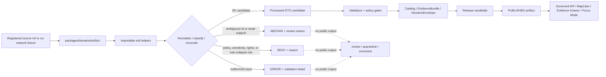

<!-- [KFM_META_BLOCK_V2]
doc_id: kfm://doc/NEEDS-VERIFICATION/packages-domains-soil-src-readme
title: Soil Package Source README
type: readme
version: v1
status: draft
owners: OWNER_TBD
created: NEEDS VERIFICATION — target file existed before this repair but contained only placeholder text
updated: 2026-06-14
policy_label: public
related: [packages/domains/soil/README.md, packages/domains/README.md, docs/domains/soil/README.md, contracts/domains/soil/README.md, schemas/contracts/v1/domains/soil/, policy/domains/soil/, pipelines/domains/soil/, pipeline_specs/soil/, data/registry/sources/soil/, data/receipts/soil/, data/proofs/evidence_bundle/, release/]
tags: [kfm, soil, packages, src, implementation, evidence, ssurgo, sda, gssurgo, gnatsgo, mesonet, scan, uscrn, smap, support-type]
notes: ["README-like source-directory guide for the Soil package.", "Target path is user-requested and Directory Rules-compatible as source code under packages/, but actual package metadata, import layout, build tools, tests, and CI remain NEEDS VERIFICATION until the live repo is recursively inspected.", "This directory may contain package source code only; it must not own schemas, contracts, policy, source registries, lifecycle data, proofs, receipts, release decisions, API routes, UI surfaces, or AI truth claims."]
[/KFM_META_BLOCK_V2] -->

<a id="top"></a>

# Soil Package Source

Source-code envelope for the KFM Soil package: deterministic helpers that support admitted soil records without becoming the source of truth, source registry, policy authority, release authority, lifecycle store, or public data path.

<p>
  
  
  
  
  
  
  
</p>

> [!IMPORTANT]
> **Status:** PROPOSED source-directory README  
> **Path:** `packages/domains/soil/src/README.md`  
> **Owning responsibility root:** `packages/`  
> **Package lane:** `packages/domains/soil/`  
> **Import/package layout:** NEEDS VERIFICATION  
> **Repo implementation depth:** UNKNOWN for package metadata, package manager, import style, tests, CI workflows, API bindings, UI bindings, policy engine, emitted receipts, proof packs, release manifests, branch protections, and runtime behavior.

## Quick links

- [Scope](#scope)
- [Repo fit](#repo-fit)
- [Accepted inputs](#accepted-inputs)
- [Exclusions](#exclusions)
- [Expected package layout](#expected-package-layout)
- [Trust-boundary flow](#trust-boundary-flow)
- [Soil anti-collapse rules](#soil-anti-collapse-rules)
- [Finite outcomes](#finite-outcomes)
- [Development rules](#development-rules)
- [Validation checklist](#validation-checklist)
- [Rollback](#rollback)
- [Evidence boundary](#evidence-boundary)

---

## Scope

`packages/domains/soil/src/` is the proposed source-code root for the Soil package.

This directory is for importable, deterministic implementation helpers used by governed soil pipelines, validators, API adapters, MapLibre layer-preparation code, Evidence Drawer mappers, and Focus Mode support code. It should stay small, fixture-testable, no-network by default, and evidence-subordinate.

This source tree may support helpers for:

- SSURGO / SDA static survey identity and join checks for `MUKEY`, `COKEY`, `CHKEY`, `areasymbol`, `musym`, and query fingerprints;
- gSSURGO / gNATSGO derivative metadata preparation where raster support, source derivation, resolution, and MUKEY mapping remain visible;
- soil moisture station and reading normalization for station id, variable, depth, timestamp, unit, QC flag, and source timezone preservation;
- SCAN / USCRN reference-station support while keeping those networks distinct from Kansas Mesonet observations;
- SMAP or other satellite soil-moisture grid context where pixel/grid support, QA flags, product version, and latency are explicit;
- pedon, profile, horizon, and soil interpretation candidate helpers where every derived value remains tied to `source_refs` and known limitations;
- EvidenceRef / EvidenceBundle reference preparation for downstream proof systems;
- candidate layer-manifest and Evidence Drawer fields for released soil artifacts;
- finite outcomes such as `OK`, `ABSTAIN`, `DENY`, and `ERROR`.

This directory must not fetch live source data, store lifecycle artifacts, own source descriptors, approve releases, publish tiles, answer public claims, or treat generated summaries, maps, graph projections, model output, station dashboards, or raster derivatives as sovereign truth.

```text
RAW -> WORK / QUARANTINE -> PROCESSED -> CATALOG / TRIPLET -> PUBLISHED
```

Package code may prepare candidate objects inside that lifecycle. It does not own the lifecycle state itself.

[⬆ Back to top](#top)

---

## Repo fit

```text
packages/domains/soil/src/
```

`packages/` is the responsibility root for shared reusable code. `domains/soil/` is the domain segment. `src/` is the package source-code envelope.

| Relationship | Expected home | Boundary rule |
| --- | --- | --- |
| Package source code | `packages/domains/soil/src/` | Reusable soil implementation helpers only. |
| Importable module | `packages/domains/soil/src/soil/` or repo-confirmed namespace | Package namespace, subject to repo package convention verification. |
| Package entry README | `packages/domains/soil/README.md` | Explains the soil package as a whole. |
| Domain docs | `docs/domains/soil/` | Explains doctrine, source roles, stewardship, public-safety limits, and publication posture. |
| Semantic contracts | `contracts/domains/soil/` | Defines meaning; source code references, not redefines. |
| Machine schemas | `schemas/contracts/v1/domains/soil/` | Defines shape; source code validates against it. |
| Source registry | `data/registry/sources/soil/` or repo-confirmed registry home | Owns source identity, rights, role, cadence, sensitivity, and activation state. |
| Policy | `policy/domains/soil/` or repo-confirmed policy lane | Owns allow/deny/restrict/abstain behavior. |
| Lifecycle data | `data/raw/`, `data/work/`, `data/quarantine/`, `data/processed/`, `data/catalog/`, `data/triplets/`, `data/published/` | Stores evidence-bearing and released artifacts by phase. |
| Receipts and proofs | `data/receipts/soil/`, `data/proofs/evidence_bundle/`, or repo-confirmed proof homes | Stores process memory and proof objects. |
| Release decisions | `release/` | Owns release manifests, promotion decisions, corrections, rollback targets, and supersession. |
| API and UI runtime | `apps/`, `ui/`, `web/`, or repo-confirmed equivalents | May call package helpers; must not be replaced by package internals. |
| Tests and fixtures | `tests/packages/domains/soil/`, `fixtures/packages/domains/soil/`, or repo-confirmed equivalents | Proves behavior with deterministic fixtures. |

> [!WARNING]
> A source-code directory is not a trust-object home. Keep schemas, contracts, source registries, policy rules, lifecycle data, receipts, proofs, and release decisions in their owning roots.

[⬆ Back to top](#top)

---

## Accepted inputs

Functions in this source tree should accept explicit values from governed callers. They should not fetch missing facts from live services, hidden globals, local operator memory, UI state, or generated language.

| Input family | Accepted examples | Required handling |
| --- | --- | --- |
| Static soil survey context | `MUKEY`, `COKEY`, `CHKEY`, `areasymbol`, `musym`, SDA query text, source version, geometry fingerprint, spatial reference | Preserve native ids, query hash, source version, geometry hash, join path, and aggregation method; abstain when joins are broken or ambiguous. |
| Gridded derivative context | gSSURGO / gNATSGO product id, grid resolution, raster support, MUKEY raster mapping, COG/PMTiles candidate metadata | Label as derivative support; cite source derivation; never replace SSURGO/SDA provenance. |
| Station soil moisture context | station id, network id, variable, depth, timestamp, value, units, QC flags, source timezone | Preserve UTC timestamp plus source timezone, depth in centimeters, volumetric water content units where applicable, and QC/freshness fields. |
| Reference soil climate context | SCAN / USCRN station metadata, depth layers, hourly/daily variables, product version, QC/status flags | Keep source network distinct from Mesonet; preserve cadence, metadata, and known limitations. |
| Satellite soil moisture context | SMAP product id, granule id, grid cell id, time window, QA flags, product version, latency | Keep pixel/grid support explicit; never masquerade as station reading. |
| Profile / pedon / horizon context | pedon/profile ids, horizon depths, analytical properties, method refs, source refs | Do not invent unsupported chemistry or physics; tie every field to source support. |
| Soil interpretation context | hydrologic group, hydric rating, drainage class, prime farmland, land capability, suitability/constraint ratings | Separate source interpretation from KFM-derived summary; preserve method, unit, aggregation, and limitations. |
| Source context | `source_id`, source descriptor ref, source role, rights profile, sensitivity label, cadence, citation template | Treat source role as a boundary, not a display hint. |
| Evidence context | EvidenceRef, EvidenceBundle ref, input digest, citation obligation, release state | Return finite negative outcomes when evidence is missing or unresolved. |
| Policy context | policy decision ref, sensitivity tier, obligations, deny/abstain reason codes, transform requirements | Use as input; do not approve release inside package code. |
| Run context | run ID, actor/service ID, package version, `content_spec_hash`, `run_hash`, `query_hash`, input/output digest, processing timestamp | Return receipt-ready metadata for owning pipelines to persist. |

[⬆ Back to top](#top)

---

## Exclusions

| Do not put here | Correct home or owner | Reason |
| --- | --- | --- |
| Live source connectors, API clients, scrapers, tokens, credentials, or source polling logic | `connectors/`, `pipelines/`, `pipeline_specs/`, `configs/`, secret infrastructure | Source activation must be governed and audited. |
| RAW, WORK, QUARANTINE, PROCESSED, CATALOG, TRIPLET, or PUBLISHED artifacts | `data/<phase>/soil/` | Lifecycle state must remain inspectable outside source code. |
| Source descriptors, rights matrices, or source-role registries | `data/registry/sources/soil/` or verified registry home | Source authority is governance data. |
| Semantic contracts | `contracts/domains/soil/` | Contracts own meaning. |
| JSON Schemas | `schemas/contracts/v1/domains/soil/` | Schemas own machine shape. |
| Policy rules or release criteria | `policy/domains/soil/`, `policy/sensitivity/`, `policy/rights/`, `release/` | Policy and release decisions are separate authority roots. |
| Run receipts, AI receipts, proof packs, catalog records, EvidenceBundle stores | `data/receipts/`, `data/proofs/`, `data/catalog/` | Trust artifacts must remain separately auditable. |
| API route handlers or public UI components | `apps/`, `ui/`, `web/`, or verified runtime roots | Package internals must not become the public path. |
| Private farm-level observations, partner-provided raw station payloads, or restricted exact-location examples | governed fixture/data homes after policy review | Sensitive or rights-constrained material must fail closed. |
| Agricultural recommendations, legal/title claims, emergency alerts, or operational instructions | Out of scope unless separately governed by official-source handoff policy | KFM is an evidence and publication system, not an advisory authority. |

[⬆ Back to top](#top)

---

## Expected package layout

> [!NOTE]
> The tree below is PROPOSED. Confirm package metadata, language conventions, and test layout before committing code beyond README files.

```text
packages/domains/soil/src/
├── README.md                    # This file: source-code boundary and trust rules
└── soil/
    ├── README.md                # PROPOSED: importable namespace guide
    ├── __init__.py              # PROPOSED: namespace export boundary if Python convention is confirmed
    ├── outcomes.py              # PROPOSED: finite outcomes and reason codes
    ├── identifiers.py           # PROPOSED: MUKEY/COKEY/CHKEY/station/grid identity helpers
    ├── support_types.py         # PROPOSED: static/station/grid/satellite/profile/interpretation guards
    ├── ssurgo_sda.py            # PROPOSED: SDA/SSURGO candidate helpers
    ├── gridded_derivatives.py   # PROPOSED: gSSURGO/gNATSGO derivative metadata helpers
    ├── soil_moisture.py         # PROPOSED: station reading normalization helpers
    ├── temporal.py              # PROPOSED: observed/valid/retrieved/released time helpers
    ├── units.py                 # PROPOSED: depth/unit annotation helpers
    ├── evidence.py              # PROPOSED: EvidenceRef/EvidenceBundle preparation helpers
    ├── layer_manifest.py        # PROPOSED: released layer payload helper functions
    └── py.typed                 # PROPOSED: include only if typed Python package convention is confirmed
```

Preferred import posture, subject to package verification:

```python
from soil.outcomes import Outcome
from soil.identifiers import normalize_mukey
from soil.support_types import classify_soil_support_type
from soil.soil_moisture import normalize_soil_moisture_reading
```

[⬆ Back to top](#top)

---

## Trust-boundary flow



[⬆ Back to top](#top)

---

## Soil anti-collapse rules

Soil source code must preserve differences between source families and knowledge characters. Convenience helpers must never flatten them into generic “soil facts.”

| Boundary | Preserve as | Never collapse into |
| --- | --- | --- |
| SSURGO / SDA | Authoritative static soil survey support with MUKEY/COKEY/CHKEY joins, query text, source version, geometry hash, and aggregation method | Station reading, satellite estimate, or all-purpose soil truth |
| gSSURGO / gNATSGO | Gridded derivative companion with raster support, resolution, MUKEY mapping, source derivation, and limitations | Replacement for SSURGO/SDA provenance |
| Kansas Mesonet | Station soil moisture/time-series observation with station metadata, source timezone, UTC timestamp, depth, unit, QC flag, and freshness | SCAN/USCRN reference station, SMAP grid, or static soil survey |
| SCAN / USCRN | Reference station / soil climate network support with source cadence, product version, and QC/status fields | Kansas Mesonet local station truth unless evidence supports relation |
| SMAP or other satellite grid | Satellite soil-moisture grid context with grid cell, product version, time window, QA flag, and latency | Station reading or field measurement |
| Pedon / profile / horizon records | Profile-level evidence with source-supported analytical fields | Invented soil chemistry, physics, or suitability values |
| Soil interpretation | Source interpretation or KFM-derived summary with method, aggregation, unit, and limitations | Raw authoritative mapunit/component/horizon record |
| EvidenceBundle reference | Evidence closure object resolved by KFM proof systems | Citation-looking string that proves itself |
| Layer manifest candidate | Public-delivery metadata candidate | Publication authority or canonical truth |

[⬆ Back to top](#top)

---

## Finite outcomes

Soil helpers should return explicit outcomes that calling pipelines, validators, APIs, or tests can inspect.

| Outcome | Use when | Public posture |
| --- | --- | --- |
| `OK` | Candidate output has sufficient local structure for the next governed gate. | Not public until catalog/proof/release gates pass. |
| `ABSTAIN` | Evidence, identity, temporal scope, source-role support, support-type separation, or crosswalk support is insufficient. | Do not publish; send to review or quarantine path. |
| `DENY` | Policy, sensitivity, rights, consent, role collapse, release, or public-safety constraint blocks use. | Do not publish; record reason and rollback/correction target if relevant. |
| `ERROR` | Malformed input, unsupported unit/depth, invalid geometry, schema mismatch, invalid time window, or code failure. | Do not publish; fix input, code, fixture, or validator. |

[⬆ Back to top](#top)

---

## Development rules

1. Prefer pure functions with explicit inputs and outputs.
2. Preserve source-native fields before deriving convenience fields.
3. Keep source role, support type, time semantics, units, depths, QC flags, uncertainty, and limitations visible.
4. Make ambiguous MUKEY/COKEY/CHKEY/station/grid identity resolution impossible to ignore.
5. Keep static survey, gridded derivative, station, reference-station, satellite, profile, and interpretation supports separate.
6. Return finite outcomes instead of silent fallbacks.
7. Do not make network calls from `src/` helpers.
8. Do not import UI, API route, connector, policy engine, source watcher, release writer, or receipt store code into this namespace unless an ADR-backed package boundary allows it.
9. Do not create parallel schema, policy, source registry, proof, receipt, release, or lifecycle homes inside `src/`.
10. Add or update tests with every behavior-changing helper.
11. Keep rollback and correction needs visible in return metadata when transforms affect downstream release candidates.
12. Preserve `consent_ref`, `rights_status`, `policy_labels`, and source limitations when callers provide them; never infer consent from successful parsing or public discoverability.

[⬆ Back to top](#top)

---

## Validation checklist

- [ ] Confirm `packages/domains/soil/src/` exists in the mounted repo with this README as its source-directory guide.
- [ ] Confirm package manager and import convention (`pyproject.toml`, workspace config, or equivalent).
- [ ] Confirm whether this source tree is Python-only, TypeScript-only, or mixed-language.
- [ ] Confirm owners and CODEOWNERS path coverage.
- [ ] Confirm schema home for soil contracts and generated adapters.
- [ ] Confirm source registry home for soil descriptors.
- [ ] Confirm validators and tests that exercise this namespace.
- [ ] Confirm no helper performs live source fetch, public publication, release decision, or policy enforcement outside the proper roots.
- [ ] Confirm MUKEY/COKEY/CHKEY joins and SDA query hashes return `ABSTAIN` or equivalent review-required outcome when incomplete.
- [ ] Confirm station soil-moisture helpers preserve station metadata, UTC timestamp, source timezone, depth, unit, QC flags, and freshness.
- [ ] Confirm SMAP/grid helpers cannot be labeled as station observations.
- [ ] Confirm gSSURGO/gNATSGO helpers preserve raster support, resolution, MUKEY mapping, and source derivation.
- [ ] Confirm all public-facing payload candidates carry EvidenceBundle / DecisionEnvelope / release-state references as required.
- [ ] Confirm rollback/correction metadata can be produced by downstream receipt/proof/release systems.

[⬆ Back to top](#top)

---

## Rollback

Rollback is required if this source tree:

- creates a parallel authority home for schemas, contracts, policy, registries, receipts, proofs, releases, or lifecycle data;
- permits public output without EvidenceBundle, policy decision, review state, and release state;
- collapses static soil survey, gridded derivative, station observation, reference station, satellite grid, profile evidence, or interpretation into one generic soil claim;
- silently resolves ambiguous MUKEY/COKEY/CHKEY/station/grid identities;
- strips units, depths, timestamps, QC flags, source timezone, freshness, source version, query hash, geometry hash, or known limitations;
- bypasses governed APIs, released artifacts, catalog records, or the Evidence Drawer trust path.

Rollback target: revert the package-source PR, keep any generated audit notes as review evidence, and file the affected behavior in `docs/registers/DRIFT_REGISTER.md` or `docs/registers/VERIFICATION_BACKLOG.md` if the mounted repo uses those registers.

[⬆ Back to top](#top)

---

## Evidence boundary

| Source | Status | Supports | Limits |
| --- | --- | --- | --- |
| Directory Rules | CONFIRMED doctrine | `packages/` as shared library root; domain as segment; lifecycle and authority separation | Does not prove this source tree is wired into tests/CI. |
| Parent domain packages README | CONFIRMED repo doc | Domain packages are shared helper code and cannot become doctrine, schema, contract, policy, lifecycle, evidence, release, or public-trust authority | Does not prove soil implementation files exist. |
| KFM Soil Architecture Extended Pro PDF-Only Planning Report | LINEAGE / PROPOSED plan | Soil support-type separation, SSURGO/SDA, gSSURGO/gNATSGO, Mesonet, SCAN, USCRN, SMAP, Evidence Drawer, validators, receipts, and promotion concepts | States repo implementation depth was unknown in that run; not current implementation proof. |
| Current file-generation pass | CONFIRMED request | User-requested target path and README repair/replacement | Does not inspect package metadata, imports, tests, CI, runtime logs, source rights, or current endpoint behavior. |

[⬆ Back to top](#top)
