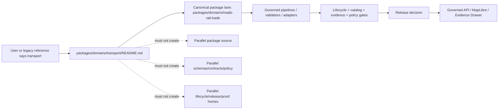

<!-- [KFM_META_BLOCK_V2]
doc_id: kfm://doc/NEEDS-VERIFICATION/packages-domains-transport-readme
title: Transport Compatibility Package README
type: readme
version: v1
status: draft
owners: OWNER_TBD
created: NEEDS VERIFICATION — target file existed before this repair but contained only placeholder text
updated: 2026-06-14
policy_label: public
related: [packages/domains/README.md, packages/domains/roads-rail-trade/README.md, docs/domains/roads-rail-trade/README.md, contracts/domains/roads-rail-trade/, schemas/contracts/v1/domains/roads-rail-trade/, policy/domains/roads-rail-trade/, pipelines/domains/roads-rail-trade/, data/registry/sources/roads-rail-trade/, release/]
tags: [kfm, packages, domains, transport, compatibility, roads-rail-trade, shared-library, evidence, lifecycle, trust-membrane]
notes: ["Compatibility README for the broad transport alias under packages/domains/.", "Canonical package lane for KFM transportation helpers is packages/domains/roads-rail-trade/ unless an accepted ADR changes the domain slug register.", "This path must not become a parallel domain authority, schema home, contract home, policy home, lifecycle-data home, public API, UI surface, source registry, proof/receipt home, or release authority."]
[/KFM_META_BLOCK_V2] -->

<a id="top"></a>

# Transport Compatibility Package

Compatibility landing page for broad “transport” references. Canonical KFM transportation helper work should use `packages/domains/roads-rail-trade/` unless an accepted ADR changes the domain-lane register.

<p>
  
  
  
  
  
  
</p>

> [!IMPORTANT]
> **Status:** compatibility / alias README  
> **Path:** `packages/domains/transport/README.md`  
> **Owning responsibility root:** `packages/`  
> **Canonical domain package:** `packages/domains/roads-rail-trade/`  
> **Placement posture:** PROPOSED compatibility path; do not add implementation files here without ADR-backed migration or alias policy.  
> **Repo implementation depth:** UNKNOWN for package metadata, imports, tests, CI workflows, emitted receipts, proof objects, release manifests, and runtime behavior.

## Quick links

- [Scope](#scope)
- [Repo fit](#repo-fit)
- [Canonical lane](#canonical-lane)
- [Accepted contents](#accepted-contents)
- [Exclusions](#exclusions)
- [Compatibility rules](#compatibility-rules)
- [Trust-boundary flow](#trust-boundary-flow)
- [Validation checklist](#validation-checklist)
- [Rollback](#rollback)
- [Evidence boundary](#evidence-boundary)

---

## Scope

`packages/domains/transport/` is a compatibility surface for broad transport wording.

It exists to prevent drift by pointing maintainers toward the accepted transportation package lane:

```text
packages/domains/roads-rail-trade/
```

This README does not create a new canonical KFM domain. It does not rename `roads-rail-trade`, and it does not authorize duplicate helper modules, schemas, contracts, policies, source registries, lifecycle data, proofs, receipts, releases, API routes, UI components, or public map layers under `transport`.

The safe posture is:

```text
transport = compatibility label / search aid / migration note
roads-rail-trade = canonical package lane for transportation helpers
```

[⬆ Back to top](#top)

---

## Repo fit

`packages/` owns shared reusable implementation code. Domain-specific code appears as a domain segment inside `packages/domains/`.

| Relationship | Correct home | Status |
| --- | --- | --- |
| Broad compatibility README | `packages/domains/transport/README.md` | PROPOSED / compatibility |
| Canonical transport helper package | `packages/domains/roads-rail-trade/` | CONFIRMED sibling package path / canonical lane per current domain slug posture |
| Transportation domain documentation | `docs/domains/roads-rail-trade/` | Canonical docs lane, subject to repo verification |
| Transportation contracts | `contracts/domains/roads-rail-trade/` | Contract authority, not package source |
| Transportation schemas | `schemas/contracts/v1/domains/roads-rail-trade/` | Machine shape authority |
| Transportation policy | `policy/domains/roads-rail-trade/` | Admissibility and exposure authority |
| Transportation pipelines | `pipelines/domains/roads-rail-trade/` | Executable lifecycle logic |
| Transportation source registry | `data/registry/sources/roads-rail-trade/` or repo-confirmed registry home | Source identity, rights, role, cadence, and limitations |
| Transportation release decisions | `release/` | Promotion, release manifests, corrections, supersession, rollback |

> [!WARNING]
> Do not treat `transport/` as a second package lane parallel to `roads-rail-trade/`. Parallel domain homes create authority drift unless an ADR explicitly accepts the split and defines migration, compatibility, tests, and rollback.

[⬆ Back to top](#top)

---

## Canonical lane

Use this lane for new transport helper work:

```text
packages/domains/roads-rail-trade/
```

The canonical lane covers KFM helper code for:

- roads and road-network candidate helpers;
- rail and railroad-corridor candidate helpers;
- trade routes, trails, historic corridors, crossings, depots, routes, facilities, and access evidence;
- transport graph-projection helpers that preserve source evidence and uncertainty;
- public-safe layer-manifest and Evidence Drawer payload preparation after policy and review controls;
- receipt-ready, proof-ready, catalog-ready, and release-candidate metadata preparation.

This compatibility README may point there. It must not reimplement that package.

[⬆ Back to top](#top)

---

## Accepted contents

Keep this directory intentionally small.

| Accepted content | Purpose | Status |
| --- | --- | --- |
| `README.md` | Explains compatibility posture and redirects maintainers to `roads-rail-trade`. | CONFIRMED current file |
| `MIGRATION.md` | Optional future migration note if an old `transport` package ever needs to move into `roads-rail-trade`. | PROPOSED / NEEDS VERIFICATION |
| `ALIASES.md` | Optional future alias table mapping `transport` terms to canonical `roads-rail-trade` terms. | PROPOSED / NEEDS VERIFICATION |

Anything beyond documentation should be treated as `NEEDS VERIFICATION / ADR REQUIRED` unless current repo governance explicitly permits compatibility source files here.

[⬆ Back to top](#top)

---

## Exclusions

| Do not place here | Correct home | Reason |
| --- | --- | --- |
| New transport helper source code | `packages/domains/roads-rail-trade/` | Avoid parallel package authority. |
| Importable modules such as `transport/`, `transport.py`, or generated transport adapters | `packages/domains/roads-rail-trade/src/` or repo-confirmed canonical package namespace | Prevent duplicate runtime package names and import drift. |
| Semantic contracts | `contracts/domains/roads-rail-trade/` | Contracts own meaning. |
| JSON Schemas | `schemas/contracts/v1/domains/roads-rail-trade/` | Schemas own machine shape. |
| Policy rules | `policy/domains/roads-rail-trade/` | Policy owns allow / deny / restrict / abstain decisions. |
| Source descriptors | `data/registry/sources/roads-rail-trade/` or repo-confirmed registry home | Source authority and rights are governance data. |
| RAW / WORK / QUARANTINE / PROCESSED / CATALOG / TRIPLET / PUBLISHED data | `data/<phase>/roads-rail-trade/` | Lifecycle data must remain phase-visible. |
| Receipts, proofs, catalog matrices, EvidenceBundle stores | `data/receipts/`, `data/proofs/`, `data/catalog/` | Trust artifacts must remain separately auditable. |
| Release manifests, rollback cards, correction notices | `release/` | Publication is a governed state transition. |
| API routes, UI components, MapLibre styles, Focus Mode answer surfaces | `apps/`, `ui/`, `web/`, or repo-confirmed equivalents | Public surfaces must use governed interfaces, not compatibility package internals. |

[⬆ Back to top](#top)

---

## Compatibility rules

1. Prefer `roads-rail-trade` in new file paths, imports, source ids, schema ids, policy ids, test names, fixture names, and release ids.
2. Use `transport` only as a search term, compatibility note, or user-facing explanatory label when appropriate.
3. Do not add implementation code under `transport/` without an ADR that explains why `roads-rail-trade/` is insufficient.
4. Do not create duplicate schema, contract, policy, source, receipt, proof, release, test, fixture, pipeline, or data homes for the same concept.
5. If a future migration finds existing `transport` implementation files, preserve history, add a migration note, update references, run tests, and keep rollback targets.
6. If `transport` is intentionally promoted as a canonical domain alias later, record the decision in an ADR and update the domain-lane register, Directory Rules references, parent README, contracts, schemas, policies, fixtures, tests, release manifests, and affected docs.

[⬆ Back to top](#top)

---

## Trust-boundary flow



[⬆ Back to top](#top)

---

## Validation checklist

- [ ] Confirm whether any implementation files exist under `packages/domains/transport/` beyond this README.
- [ ] Confirm `packages/domains/roads-rail-trade/` remains the canonical package lane.
- [ ] Search for imports, references, source ids, schemas, tests, fixtures, policies, pipelines, and release manifests using the broad term `transport`.
- [ ] Move or redirect implementation references to `roads-rail-trade` unless an ADR accepts the alias.
- [ ] Confirm no public UI or API points at `packages/domains/transport/` directly.
- [ ] Confirm any retained compatibility docs are linked from parent docs only when useful.
- [ ] Add a drift-register entry if repo reality conflicts with the domain-lane register or Directory Rules.

Suggested inspection commands:

```bash
git grep -n "packages/domains/transport\|domains/transport\|transport" -- .
find packages/domains/transport -maxdepth 4 -type f | sort
find packages/domains/roads-rail-trade -maxdepth 4 -type f | sort
```

[⬆ Back to top](#top)

---

## Rollback

Rollback is required if this compatibility path:

- becomes a parallel implementation package without ADR approval;
- duplicates `roads-rail-trade` helpers;
- creates alternate schemas, contracts, policy, fixtures, tests, source registries, lifecycle data, proofs, receipts, or release objects;
- lets public clients import compatibility package internals;
- hides the canonical lane from maintainers.

Rollback target: remove or revert non-README files under `packages/domains/transport/`, preserve review notes, and redirect references to `packages/domains/roads-rail-trade/`. If this README itself causes confusion, revert to the previous blob or replace it with a shorter redirect-only README.

[⬆ Back to top](#top)

---

## Evidence boundary

| Source | Status | Supports | Limits |
| --- | --- | --- | --- |
| Current target file | CONFIRMED | `packages/domains/transport/README.md` existed and required replacement from placeholder content. | Does not prove transport is canonical. |
| Parent domain packages README | CONFIRMED repo doc | `packages/domains/` is shared helper-code space; canonical domain slug posture names `roads-rail-trade`, not `transport`. | Does not prove every child package implementation detail. |
| Roads/Rail/Trade package README | CONFIRMED sibling repo doc | `packages/domains/roads-rail-trade/` is the transportation-corridor helper lane. | Does not make `transport/` canonical. |
| Directory Rules | CONFIRMED doctrine | Domain-specific files live as segments inside responsibility roots; responsibility roots and authority separation must be preserved. | Path presence and runtime maturity still require repo inspection. |
| Current file-generation pass | CONFIRMED request | User-requested target path and README repair/replacement. | Does not inspect full repo, tests, CI, branch protection, runtime logs, or release artifacts. |

[⬆ Back to top](#top)
