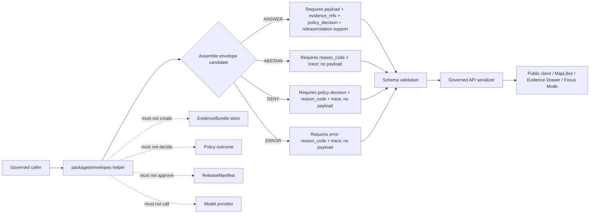

<!-- [KFM_META_BLOCK_V2]
doc_id: kfm://doc/NEEDS-VERIFICATION/packages-envelopes-readme
title: Envelopes Package README
type: readme
version: v1
status: draft
owners: OWNER_TBD
created: NEEDS VERIFICATION — target file existed before this revision as a short stub
updated: 2026-06-14
policy_label: public
related: [packages/README.md, docs/architecture/governed-api/ENVELOPES.md, docs/architecture/cross-domain/shared-kernel.md, docs/adr/ADR-0019-ai-adapter-contract-and-finite-envelopes.md, contracts/, schemas/contracts/v1/runtime/, schemas/contracts/v1/policy/, policy/runtime/, data/receipts/, data/proofs/evidence_bundle/, release/]
tags: [kfm, packages, envelopes, runtime-response-envelope, decision-envelope, domain-feature-envelope, finite-outcomes, governed-api, evidence, policy, release]
notes: ["README-like package landing page for shared envelope helper code.", "This package may contain implementation helpers for finite outcome envelopes, but schemas, semantic contracts, policy, receipts, proofs, lifecycle data, and release decisions remain in their owning roots.", "Implementation files, package metadata, imports, tests, CI workflows, and runtime bindings remain NEEDS VERIFICATION until recursively inspected."]
[/KFM_META_BLOCK_V2] -->

<a id="top"></a>

# Envelopes Package

Shared helper-code package for KFM finite-outcome envelopes: `RuntimeResponseEnvelope`, `DecisionEnvelope`, and related envelope composition helpers that keep public responses bounded, evidence-aware, policy-visible, and release-aware.

<p>
  
  
  
  
  
  
</p>

> [!IMPORTANT]
> **Status:** PROPOSED package README  
> **Path:** `packages/envelopes/README.md`  
> **Owning responsibility root:** `packages/` — shared reusable implementation libraries  
> **Schema authority:** `schemas/contracts/v1/runtime/` and related schema homes, not this package  
> **Policy authority:** `policy/runtime/` and related policy homes, not this package  
> **Repo implementation depth:** UNKNOWN for package metadata, import style, source files, tests, CI workflows, API bindings, emitted receipts, proof packs, release manifests, and runtime behavior.

## Quick links

- [Scope](#scope)
- [Repo fit](#repo-fit)
- [Accepted inputs](#accepted-inputs)
- [Exclusions](#exclusions)
- [Envelope families](#envelope-families)
- [Finite outcome rules](#finite-outcome-rules)
- [Trust-boundary flow](#trust-boundary-flow)
- [Expected package layout](#expected-package-layout)
- [Development rules](#development-rules)
- [Validation checklist](#validation-checklist)
- [Rollback](#rollback)
- [Evidence boundary](#evidence-boundary)

---

## Scope

`packages/envelopes/` is a shared implementation package for envelope helper code.

It may contain reusable code for:

- typed constants or enums for finite runtime outcomes;
- helper builders for `RuntimeResponseEnvelope` and `DecisionEnvelope` candidates;
- envelope composition guards that prevent bare payloads at governed public boundaries;
- reason-code helpers that preserve stable namespaced codes;
- reference carriers for `EvidenceRef`, `EvidenceBundle`, `PolicyDecision`, `AIReceipt`, `RunReceipt`, `ReleaseManifest`, and `RollbackCard` references;
- deterministic serialization, hashing support, or shape adapters when aligned to canonical schemas;
- test-only fixture builders for valid and invalid envelope examples;
- adapter glue used by governed API, runtime, domain packages, and validation tools.

It must not own envelope meaning, field-level schemas, policy decisions, source authority, evidence closure, lifecycle state, receipts, proof packs, release approval, public API routes, UI behavior, or AI answers.

```text
RAW -> WORK / QUARANTINE -> PROCESSED -> CATALOG / TRIPLET -> PUBLISHED
```

Envelope helpers may make that trust path easier to assemble and test. They do not decide whether a claim is true, admissible, publishable, or safe.

[⬆ Back to top](#top)

---

## Repo fit

```text
packages/envelopes/
```

This path is appropriate only for shared implementation helpers because `packages/` owns reusable library code.

| Relationship | Expected home | Boundary rule |
| --- | --- | --- |
| Shared envelope helper code | `packages/envelopes/` | Reusable implementation code only. |
| Governed API envelope doctrine | `docs/architecture/governed-api/ENVELOPES.md` | Names the envelopes, fields, composition rules, and anti-patterns. |
| Cross-domain object catalog | `docs/architecture/cross-domain/shared-kernel.md` | Defines shared kernel object families and cross-domain posture. |
| ADR for AI adapter and finite envelopes | `docs/adr/ADR-0019-ai-adapter-contract-and-finite-envelopes.md` | Proposed decision record for adapter/envelope behavior. |
| Semantic contracts | `contracts/` and contract-family docs | Own object meaning; package code references, not redefines. |
| Machine schemas | `schemas/contracts/v1/runtime/`, `schemas/contracts/v1/policy/`, and related schema homes | Own machine-checkable shape. |
| Runtime policy | `policy/runtime/` and related policy homes | Own allow/deny/restrict/hold/abstain behavior and obligations. |
| Receipts and proofs | `data/receipts/`, `data/proofs/evidence_bundle/` | Own audit memory and evidence closure. |
| Release decisions | `release/` | Own manifests, promotion decisions, corrections, supersession, and rollback. |
| Public API routes | `apps/governed-api/` or repo-confirmed API app | May call this package, but must not be replaced by package internals. |
| Tests and fixtures | `tests/packages/envelopes/`, `fixtures/packages/envelopes/`, or repo-confirmed equivalents | Prove envelope helper behavior with deterministic no-network cases. |

> [!WARNING]
> Do not place schemas, contracts, policy bundles, receipts, proofs, release manifests, lifecycle data, source descriptors, API routes, UI components, or model-runtime code in this package.

[⬆ Back to top](#top)

---

## Accepted inputs

Package helpers should accept explicit, already-governed values from callers. They should not fetch missing facts from live services, raw stores, UI state, source systems, hidden globals, or generated language.

| Input family | Accepted examples | Required handling |
| --- | --- | --- |
| Runtime outcome | `ANSWER`, `ABSTAIN`, `DENY`, `ERROR` | Closed set; unknown outcomes fail schema/helper validation. |
| Policy decision context | `allow`, `deny`, `restrict`, `hold`, `abstain`, reason code, obligations, audience class, sensitivity posture, policy bundle hash | Preserve decision and reason; do not rewrite policy outcome inside helper code. |
| Evidence context | EvidenceRef list, EvidenceBundle ref, citation validation ref, `all_resolved`, evidence gap reason | `ANSWER` requires resolvable evidence refs; unresolved evidence routes to finite negative outcome. |
| Release context | release ref, release state, rollback ref, correction/supersession ref | `ANSWER` for released content must carry release support; helpers do not approve release. |
| Payload context | domain payload, DomainFeatureEnvelope candidate, map context, AI answer candidate, error detail | Payload is allowed only when outcome rules allow it. |
| Reason context | stable namespaced reason code such as `evidence/unresolved`, `policy/rights-unknown`, `schema/invalid-response`, `adapter/timeout` | Use stable code; avoid free-text, PII, secrets, provider internals, or chain-of-thought. |
| Trace context | request id, spec hash, parent span, run id, adapter id, schema hash, policy bundle hash | Preserve enough for replay and audit without storing hidden reasoning. |
| Receipt context | AIReceipt ref, RunReceipt ref, representation receipt ref, validation report ref | Reference only; do not persist receipts from package helpers unless owned by a receipt subsystem. |

[⬆ Back to top](#top)

---

## Exclusions

| Do not put here | Correct home or owner | Reason |
| --- | --- | --- |
| Envelope semantic contract docs | `contracts/` | Contracts own meaning. |
| Envelope JSON Schemas | `schemas/contracts/v1/runtime/` or related schema home | Schemas own machine shape. |
| Policy rules and OPA/Rego bundles | `policy/runtime/` and related policy homes | Policy owns decisions and obligations. |
| Reason-code registry if treated as policy/schema authority | `docs/architecture/governed-api/ERROR_CODES.md`, `schemas/`, or policy/docs registry home | Reason-code stability is contract-significant. |
| EvidenceBundle stores or evidence material | `data/proofs/evidence_bundle/` and lifecycle/proof homes | Evidence closure is not package-local. |
| AIReceipt, RunReceipt, proof packs, validation reports | `data/receipts/`, `data/proofs/`, or repo-confirmed trust-object homes | Trust artifacts must remain separately auditable. |
| ReleaseManifest, RollbackCard, correction notices | `release/` | Publication is a governed state transition. |
| Public API route handlers | `apps/governed-api/` or repo-confirmed API app | Package internals must not become the public boundary. |
| UI components, MapLibre styles, Evidence Drawer views | `apps/explorer-web/`, `ui/`, `web/`, or repo-confirmed UI roots | Rendering is downstream from governed envelopes. |
| Model provider adapters or live AI calls | governed AI runtime package/app after ADR-backed placement | Envelope helpers should not couple public shape to provider APIs. |
| RAW / WORK / QUARANTINE / PROCESSED / CATALOG / TRIPLET / PUBLISHED data | `data/<phase>/` | Lifecycle state must remain phase-visible. |

[⬆ Back to top](#top)

---

## Envelope families

| Envelope / object | Package posture | Authority posture |
| --- | --- | --- |
| `RuntimeResponseEnvelope` | Helpers may assemble, validate local invariants, serialize, or reject malformed candidates. | Wire-level doctrine and schemas live outside this package. |
| `DecisionEnvelope` | Helpers may carry or adapt policy decision fields supplied by callers. | Policy evaluation and policy bundle hashes are owned by policy/runtime systems. |
| `DomainFeatureEnvelope` | Helpers may provide adapters only if accepted by docs/schemas. | Adoption status and exact schema remain governed outside this package. |
| `MapContextEnvelope` | Helpers may adapt runtime context refs when schemas allow. | Map context truth and admission rules remain governed. |
| `AIReceipt` | Helpers may reference receipt ids or receipt-ready hashes. | Receipt creation and storage are owned by receipt/proof systems. |
| `ReleaseManifest` / `RollbackCard` | Helpers may carry refs and check presence. | Release approval and rollback authority live under `release/`. |

[⬆ Back to top](#top)

---

## Finite outcome rules

`RuntimeResponseEnvelope.outcome` is a closed public set:

| Outcome | Use when | Required posture |
| --- | --- | --- |
| `ANSWER` | The governed system can return a substantive payload with evidence, policy, release, citation validation, and trace support. | Payload allowed; evidence refs and release support required where applicable. |
| `ABSTAIN` | Evidence, citation resolution, release support, identity, review state, or source-role support is insufficient. | No substantive payload; stable reason code required. |
| `DENY` | Policy, rights, sensitivity, audience class, security, or fail-closed rule blocks disclosure or action. | No substantive payload; policy decision and reason code required. |
| `ERROR` | Request, schema, adapter, runtime, validator, or internal failure prevents trusted response assembly. | No substantive payload; trace and error reason code required. |

`DecisionEnvelope.decision` is a policy/runtime decision set, not a public answer set:

```text
allow · deny · restrict · hold · abstain
```

> [!IMPORTANT]
> `HOLD` is not a public runtime outcome. Public surfaces should translate steward-visible hold states into an `ABSTAIN` or `DENY` envelope with an appropriate reason code and policy reference.

[⬆ Back to top](#top)

---

## Trust-boundary flow



[⬆ Back to top](#top)

---

## Expected package layout

> [!NOTE]
> The tree below is PROPOSED. Confirm package metadata, language conventions, import namespace, test layout, and CI before committing code beyond README files.

```text
packages/envelopes/
├── README.md                         # This file: package boundary and trust rules
├── pyproject.toml / package.json      # NEEDS VERIFICATION
├── src/                               # NEEDS VERIFICATION
│   └── envelopes/                     # PROPOSED namespace; confirm against repo convention
│       ├── README.md                  # PROPOSED namespace guide
│       ├── outcomes.*                 # PROPOSED finite outcome constants
│       ├── runtime_response.*         # PROPOSED RuntimeResponseEnvelope helpers
│       ├── decision.*                 # PROPOSED DecisionEnvelope helpers
│       ├── domain_feature.*           # PROPOSED DomainFeatureEnvelope adapters if adopted
│       ├── reason_codes.*             # PROPOSED reason-code helpers, not authority registry
│       ├── trace.*                    # PROPOSED trace/spec-hash helper functions
│       ├── validation.*               # PROPOSED schema-adapter helpers
│       └── fixtures.*                 # PROPOSED test helper builders only
└── CHANGELOG.md                       # OPTIONAL / NEEDS VERIFICATION
```

Potential imports, subject to package verification:

```python
from envelopes.outcomes import Outcome
from envelopes.runtime_response import build_answer, build_abstain, build_deny, build_error
from envelopes.decision import attach_policy_decision
```

[⬆ Back to top](#top)

---

## Development rules

1. Treat this package as a helper layer, not an authority layer.
2. Keep finite outcomes closed: `ANSWER`, `ABSTAIN`, `DENY`, `ERROR`.
3. Do not allow bare payloads to leave governed API surfaces.
4. Do not allow `ANSWER` without evidence support and applicable release/citation support.
5. Do not allow payloads on `ABSTAIN`, `DENY`, or `ERROR` unless an accepted schema explicitly permits a non-substantive diagnostic field.
6. Preserve stable reason codes; do not substitute free-text denial/explanation for reason-code discipline.
7. Preserve policy refs, policy bundle hashes, sensitivity posture, audience class, and obligations supplied by policy systems.
8. Preserve EvidenceRef / EvidenceBundle refs without resolving or fabricating bundles inside helper code.
9. Preserve release refs and rollback refs without approving release inside helper code.
10. Do not make network calls or call model providers from this package.
11. Do not store hidden chain-of-thought, raw provider payloads, secrets, private source data, or unrestricted sensitive context in envelope helpers.
12. Add deterministic tests for every behavior-changing helper.

[⬆ Back to top](#top)

---

## Validation checklist

- [ ] Confirm `packages/envelopes/` package metadata and language/runtime convention.
- [ ] Confirm import namespace and whether this package is Python, TypeScript, or mixed-language.
- [ ] Confirm owners and CODEOWNERS path coverage.
- [ ] Confirm canonical schema locations for runtime and policy envelopes.
- [ ] Confirm reason-code registry home.
- [ ] Confirm tests for all four public outcomes.
- [ ] Confirm `ANSWER` without evidence refs fails.
- [ ] Confirm `ABSTAIN`, `DENY`, and `ERROR` cannot carry substantive payloads.
- [ ] Confirm `DecisionEnvelope` carries policy refs and bundle hashes when required.
- [ ] Confirm helpers do not create schemas, contracts, policy decisions, receipts, proofs, EvidenceBundles, release manifests, API routes, UI components, or model-provider calls.
- [ ] Confirm governed API routes use envelope helpers only after schema and policy validation.

Suggested inspection commands:

```bash
find packages/envelopes -maxdepth 5 -type f | sort
git grep -n "RuntimeResponseEnvelope\|DecisionEnvelope\|DomainFeatureEnvelope\|ANSWER\|ABSTAIN\|DENY\|ERROR" -- .
git grep -n "packages/envelopes\|from envelopes\|import .*envelope" -- .
```

[⬆ Back to top](#top)

---

## Rollback

Rollback is required if this package:

- becomes a parallel schema, contract, policy, evidence, receipt, proof, release, API, UI, or source-registry authority;
- permits bare payloads at public boundaries;
- emits `ANSWER` without evidence, policy, citation, trace, and release support where required;
- hides `ABSTAIN`, `DENY`, or `ERROR` behind fluent prose;
- stores chain-of-thought, raw provider payloads, secrets, sensitive source data, or unrestricted private context;
- lets public clients call model runtimes or package internals directly.

Rollback target: revert the package README or package-source PR, preserve audit notes, and file any authority drift in `docs/registers/DRIFT_REGISTER.md` or the repo-confirmed drift register.

[⬆ Back to top](#top)

---

## Evidence boundary

| Source | Status | Supports | Limits |
| --- | --- | --- | --- |
| Current target file | CONFIRMED | `packages/envelopes/README.md` existed as a short stub naming finite-outcome envelope models. | Stub did not prove package implementation maturity. |
| `packages/README.md` | CONFIRMED repo doc | `packages/` is the shared-library root. | Does not define envelope behavior. |
| `docs/architecture/governed-api/ENVELOPES.md` | CONFIRMED repo doc | RuntimeResponseEnvelope, DecisionEnvelope, DomainFeatureEnvelope posture, finite outcomes, reason codes, and composition rules. | Field-level schemas and policy live elsewhere. |
| `docs/architecture/cross-domain/shared-kernel.md` | CONFIRMED repo doc | Shared object family posture for SourceDescriptor, EvidenceRef, EvidenceBundle, PolicyDecision, DecisionEnvelope, AIReceipt, ReleaseManifest, RollbackCard, and MapContextEnvelope. | Does not prove package code exists. |
| `docs/adr/ADR-0019-ai-adapter-contract-and-finite-envelopes.md` | CONFIRMED repo doc / PROPOSED ADR | AI adapter and finite envelope contract posture; public outcomes `ANSWER`, `ABSTAIN`, `DENY`, `ERROR`; no-direct-model-client and no-generated-truth rules. | ADR status remains draft/proposed until accepted. |
| Current file-generation pass | CONFIRMED request | User-requested target path and README expansion. | Does not inspect package metadata, tests, CI logs, dashboards, deployment posture, runtime behavior, or branch protection. |

[⬆ Back to top](#top)
