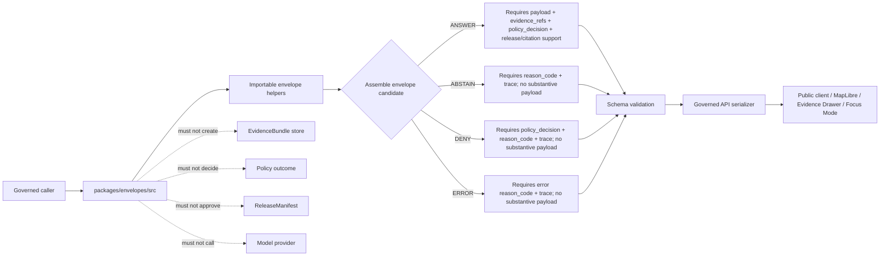

<!-- [KFM_META_BLOCK_V2]
doc_id: kfm://doc/NEEDS-VERIFICATION/packages-envelopes-src-readme
title: Envelopes Package Source README
type: readme
version: v1
status: draft
owners: OWNER_TBD
created: NEEDS VERIFICATION — target file existed before this repair but contained only placeholder text
updated: 2026-06-14
policy_label: public
related: [packages/envelopes/README.md, packages/README.md, docs/architecture/governed-api/ENVELOPES.md, docs/architecture/cross-domain/shared-kernel.md, docs/adr/ADR-0019-ai-adapter-contract-and-finite-envelopes.md, contracts/, schemas/contracts/v1/runtime/, schemas/contracts/v1/policy/, policy/runtime/, data/receipts/, data/proofs/evidence_bundle/, release/]
tags: [kfm, packages, envelopes, src, runtime-response-envelope, decision-envelope, finite-outcomes, governed-api, evidence, policy, release]
notes: ["README-like source-directory guide for the Envelopes package.", "This directory may contain source code for envelope helper functions only; it must not own schemas, contracts, policy, source registries, lifecycle data, proofs, receipts, release decisions, API routes, UI surfaces, or AI truth claims.", "Import layout, package metadata, tests, CI workflows, and runtime bindings remain NEEDS VERIFICATION until the live repo is recursively inspected."]
[/KFM_META_BLOCK_V2] -->

<a id="top"></a>

# Envelopes Package Source

Source-code envelope for KFM finite-outcome helpers: implementation utilities that assemble and guard `RuntimeResponseEnvelope`, `DecisionEnvelope`, and related response shapes without becoming schema authority, policy authority, evidence authority, release authority, or a public API surface.

<p>
  
  
  
  
  
  
  
</p>

> [!IMPORTANT]
> **Status:** PROPOSED source-directory README  
> **Path:** `packages/envelopes/src/README.md`  
> **Owning responsibility root:** `packages/`  
> **Package lane:** `packages/envelopes/`  
> **Import/package layout:** NEEDS VERIFICATION  
> **Repo implementation depth:** UNKNOWN for package metadata, import style, tests, CI workflows, API bindings, emitted receipts, proof packs, release manifests, branch protections, and runtime behavior.

## Quick links

- [Scope](#scope)
- [Repo fit](#repo-fit)
- [Accepted inputs](#accepted-inputs)
- [Exclusions](#exclusions)
- [Expected source layout](#expected-source-layout)
- [Trust-boundary flow](#trust-boundary-flow)
- [Source anti-collapse rules](#source-anti-collapse-rules)
- [Finite outcome guards](#finite-outcome-guards)
- [Development rules](#development-rules)
- [Validation checklist](#validation-checklist)
- [Rollback](#rollback)
- [Evidence boundary](#evidence-boundary)

---

## Scope

`packages/envelopes/src/` is the proposed source-code root for the Envelopes package.

This directory is for importable, deterministic implementation helpers used by governed API assemblers, runtime adapters, domain packages, validators, test fixtures, Evidence Drawer mappers, and Focus Mode support code.

This source tree may support helpers for:

- finite outcome constants and guards for `ANSWER`, `ABSTAIN`, `DENY`, and `ERROR`;
- `RuntimeResponseEnvelope` candidate builders;
- `DecisionEnvelope` attachment and policy-decision reference helpers;
- `DomainFeatureEnvelope` or payload-slot adapters when accepted by docs and schemas;
- reason-code namespace helpers that keep codes stable and non-sensitive;
- trace/spec-hash/run-id helper fields for auditability;
- evidence reference carriers that preserve `EvidenceRef` and `EvidenceBundle` refs without fabricating bundles;
- release reference carriers that preserve `ReleaseManifest` and rollback refs without approving release;
- receipt reference carriers for AI, runtime, validation, representation, or run receipts;
- no-network fixture builders for valid and invalid envelope examples.

This source tree must not fetch live data, call model providers, store lifecycle artifacts, own schemas, own contracts, decide policy, emit receipt/proof stores, approve releases, expose public API routes, or treat generated summaries, maps, graph projections, vector indexes, screenshots, or model output as sovereign truth.

```text
RAW -> WORK / QUARANTINE -> PROCESSED -> CATALOG / TRIPLET -> PUBLISHED
```

Envelope source code may help assemble and validate response candidates inside that lifecycle. It does not own the lifecycle state itself.

[⬆ Back to top](#top)

---

## Repo fit

```text
packages/envelopes/src/
```

`packages/` is the responsibility root for shared reusable code. `envelopes/` is the package segment. `src/` is the source-code envelope.

| Relationship | Expected home | Boundary rule |
| --- | --- | --- |
| Package source code | `packages/envelopes/src/` | Reusable envelope implementation helpers only. |
| Importable module | `packages/envelopes/src/envelopes/` or repo-confirmed namespace | Package namespace, subject to repo package convention verification. |
| Package entry README | `packages/envelopes/README.md` | Explains the package as a whole. |
| Governed API envelope docs | `docs/architecture/governed-api/ENVELOPES.md` | Names envelope roles, fields, composition rules, reason-code posture, and anti-patterns. |
| Cross-domain shared kernel docs | `docs/architecture/cross-domain/shared-kernel.md` | Defines shared object families and cross-domain posture. |
| Semantic contracts | `contracts/` | Defines object meaning; source code references, not redefines. |
| Machine schemas | `schemas/contracts/v1/runtime/`, `schemas/contracts/v1/policy/`, and related schema homes | Defines machine-checkable shape. |
| Runtime policy | `policy/runtime/` and related policy homes | Owns allow/deny/restrict/hold/abstain behavior and obligations. |
| Receipts and proofs | `data/receipts/`, `data/proofs/evidence_bundle/` | Stores audit memory and evidence closure. |
| Release decisions | `release/` | Owns release manifests, promotion decisions, corrections, rollback targets, and supersession. |
| API and UI runtime | `apps/`, `ui/`, `web/`, or repo-confirmed equivalents | May call package helpers; must not be replaced by package internals. |
| Tests and fixtures | `tests/packages/envelopes/`, `fixtures/packages/envelopes/`, or repo-confirmed equivalents | Proves source behavior with deterministic no-network fixtures. |

> [!WARNING]
> A source-code directory is not a trust-object home. Keep schemas, contracts, policy rules, lifecycle data, receipts, proofs, and release decisions in their owning roots.

[⬆ Back to top](#top)

---

## Accepted inputs

Functions in this source tree should accept explicit values from governed callers. They should not fetch missing facts from raw stores, source systems, live services, UI state, hidden globals, operator memory, or generated language.

| Input family | Accepted examples | Required handling |
| --- | --- | --- |
| Outcome context | `ANSWER`, `ABSTAIN`, `DENY`, `ERROR` | Treat as closed set; reject unknown, null, or provider-specific outcomes. |
| Payload context | domain payload candidate, map context candidate, AI answer candidate, error diagnostic candidate | Include payload only when the outcome rules allow it. |
| Evidence context | EvidenceRef list, EvidenceBundle ref, citation validation ref, `all_resolved`, unresolved-evidence reason | Preserve refs; never fabricate, upgrade, or resolve evidence inside generic envelope helpers. |
| Policy context | policy decision, reason code, obligations, audience class, sensitivity posture, policy ref, policy bundle hash | Preserve supplied decision data; do not reinterpret policy outcomes. |
| Release context | release ref, release state, rollback ref, correction/supersession ref | Carry refs and states; do not approve or promote release. |
| Reason context | stable reason code such as `evidence/unresolved`, `policy/fail-closed-lane`, `schema/invalid-response`, `adapter/timeout` | Keep codes stable, namespaced, non-PII, and non-secret. |
| Trace context | request id, spec hash, schema hash, run id, adapter id, parent span | Preserve auditability without storing hidden reasoning. |
| Receipt context | AIReceipt ref, RunReceipt ref, validation report ref, representation receipt ref | Reference only; receipt storage belongs to trust-object homes. |

[⬆ Back to top](#top)

---

## Exclusions

| Do not put here | Correct home or owner | Reason |
| --- | --- | --- |
| JSON Schemas | `schemas/contracts/v1/runtime/` or related schema home | Schemas own machine shape. |
| Semantic contract docs | `contracts/` | Contracts own meaning. |
| Policy rules or policy evaluation engines | `policy/runtime/` or policy subsystem | Policy owns decisions and obligations. |
| Source descriptors or source registry data | `data/registry/` | Source authority and rights are governance data. |
| RAW, WORK, QUARANTINE, PROCESSED, CATALOG, TRIPLET, or PUBLISHED data | `data/<phase>/` | Lifecycle state must remain phase-visible. |
| EvidenceBundle stores or source evidence material | `data/proofs/evidence_bundle/` and lifecycle/proof homes | Evidence closure is not package-local. |
| AIReceipt, RunReceipt, proof packs, validation reports | `data/receipts/`, `data/proofs/`, or repo-confirmed trust-object homes | Trust artifacts must remain separately auditable. |
| ReleaseManifest, RollbackCard, correction notices | `release/` | Publication is a governed state transition. |
| API route handlers or response serializers that own public routes | `apps/governed-api/` or repo-confirmed API app | Package internals must not become the public boundary. |
| UI components, MapLibre styles, Evidence Drawer views | `apps/explorer-web/`, `ui/`, `web/`, or repo-confirmed UI roots | Rendering is downstream from governed envelopes. |
| Model provider adapters or live AI calls | governed AI runtime package/app after ADR-backed placement | Envelope helpers should not couple public response shape to provider APIs. |
| Hidden chain-of-thought, raw model payloads, secrets, source credentials, private records | Nowhere in package source or fixtures | Auditability must not leak private reasoning or sensitive data. |

[⬆ Back to top](#top)

---

## Expected source layout

> [!NOTE]
> The tree below is PROPOSED. Confirm package metadata, language conventions, import namespace, test layout, and CI before committing code beyond README files.

```text
packages/envelopes/src/
├── README.md                 # This file: source-code boundary and trust rules
└── envelopes/
    ├── README.md             # PROPOSED: importable namespace guide
    ├── __init__.py           # PROPOSED: namespace export boundary if Python convention is confirmed
    ├── outcomes.py           # PROPOSED: finite public outcome constants and guards
    ├── runtime_response.py   # PROPOSED: RuntimeResponseEnvelope candidate builders
    ├── decision.py           # PROPOSED: DecisionEnvelope helpers and policy-decision carriers
    ├── domain_feature.py     # PROPOSED: DomainFeatureEnvelope adapters if adopted
    ├── reason_codes.py       # PROPOSED: reason-code helpers, not the authority registry
    ├── trace.py              # PROPOSED: request/spec/run trace helpers
    ├── references.py         # PROPOSED: Evidence/receipt/release ref carriers
    ├── validation.py         # PROPOSED: schema-adapter helpers
    └── py.typed              # PROPOSED: include only if typed Python package convention is confirmed
```

Preferred import posture, subject to package verification:

```python
from envelopes.outcomes import Outcome
from envelopes.runtime_response import build_answer, build_abstain, build_deny, build_error
from envelopes.decision import attach_policy_decision
```

[⬆ Back to top](#top)

---

## Trust-boundary flow



[⬆ Back to top](#top)

---

## Source anti-collapse rules

| Boundary | Preserve as | Never collapse into |
| --- | --- | --- |
| `RuntimeResponseEnvelope` | Wire-level response candidate with finite public outcome | Bare payload, ad hoc JSON, provider response, or UI convenience object |
| `DecisionEnvelope` | Policy decision + runtime context carrier | Policy engine, release approval, or explanation prose |
| `EvidenceRef` / `EvidenceBundle` refs | References to evidence closure owned elsewhere | Fabricated citation, inline evidence store, or trust substitute |
| `AIReceipt` / `RunReceipt` refs | Pointers to separately auditable receipt objects | Hidden chain-of-thought, raw provider payload, or package-local log |
| `ReleaseManifest` / `RollbackCard` refs | References to release and rollback authority | Publication approval inside package code |
| Reason code | Stable, namespaced, non-sensitive outcome reason | Free-text PII, policy internals, provider internals, or ambiguous null |
| Trace metadata | Request/spec/run correlation fields | Complete private reasoning trace or source secret |

[⬆ Back to top](#top)

---

## Finite outcome guards

Envelope helpers should make invalid states impossible or visibly invalid.

| Guard | Required behavior |
| --- | --- |
| `ANSWER` guard | Requires substantive payload, policy decision, trace, evidence refs, and release/citation support where applicable. |
| `ABSTAIN` guard | Requires stable reason code and trace; omits substantive payload. |
| `DENY` guard | Requires policy decision or policy ref, reason code, and trace; omits substantive payload. |
| `ERROR` guard | Requires error reason code and trace; omits substantive payload and prevents partial leakage. |
| Unknown outcome guard | Rejects unknown values; no fallback to `ANSWER`, null, or free-text failure. |
| Bare payload guard | Prevents public-boundary serialization without `RuntimeResponseEnvelope`. |
| Nested envelope guard | Prevents nested envelopes from upgrading a parent `ABSTAIN`, `DENY`, or `ERROR` to `ANSWER`. |

[⬆ Back to top](#top)

---

## Development rules

1. Prefer pure functions with explicit inputs and outputs.
2. Keep the public outcome vocabulary closed: `ANSWER`, `ABSTAIN`, `DENY`, `ERROR`.
3. Keep policy decisions and public runtime outcomes distinct.
4. Preserve source refs, evidence refs, policy refs, release refs, receipt refs, and trace fields supplied by callers.
5. Do not make network calls from `src/` helpers.
6. Do not call model providers, source services, policy engines, release writers, receipt stores, proof stores, or API route handlers from this source namespace unless an ADR-backed package boundary allows it.
7. Do not create parallel schema, contract, policy, source registry, proof, receipt, release, API, UI, or lifecycle homes inside `src/`.
8. Do not store chain-of-thought, raw provider payloads, secrets, private source records, or unrestricted sensitive context.
9. Return finite outcomes or typed errors instead of silent fallbacks.
10. Add or update tests with every behavior-changing helper.
11. Keep rollback and correction needs visible in returned metadata when envelope assembly affects downstream release candidates.

[⬆ Back to top](#top)

---

## Validation checklist

- [ ] Confirm `packages/envelopes/src/` exists in the mounted repo with this README as its source-directory guide.
- [ ] Confirm package manager and import convention (`pyproject.toml`, workspace config, or equivalent).
- [ ] Confirm whether this source tree is Python-only, TypeScript-only, or mixed-language.
- [ ] Confirm owners and CODEOWNERS path coverage.
- [ ] Confirm schema home for runtime envelopes.
- [ ] Confirm policy home for runtime decision rules.
- [ ] Confirm reason-code registry home and stability discipline.
- [ ] Confirm validators and tests that exercise this namespace.
- [ ] Confirm all four public outcomes are covered by valid and invalid fixtures.
- [ ] Confirm `ANSWER` without evidence refs fails.
- [ ] Confirm `ABSTAIN`, `DENY`, and `ERROR` cannot carry substantive payloads.
- [ ] Confirm helpers cannot create receipts, proofs, EvidenceBundles, release manifests, API routes, UI components, or model-provider calls.
- [ ] Confirm public-facing API routes serialize only schema-valid `RuntimeResponseEnvelope` objects.

Suggested inspection commands:

```bash
find packages/envelopes/src -maxdepth 5 -type f | sort
git grep -n "RuntimeResponseEnvelope\|DecisionEnvelope\|DomainFeatureEnvelope\|ANSWER\|ABSTAIN\|DENY\|ERROR" -- packages docs contracts schemas policy tests fixtures apps 2>/dev/null || true
git grep -n "from envelopes\|import envelopes\|packages/envelopes/src" -- . 2>/dev/null || true
```

[⬆ Back to top](#top)

---

## Rollback

Rollback is required if this source tree:

- creates a parallel authority home for schemas, contracts, policy, registries, receipts, proofs, releases, API routes, UI surfaces, model runtimes, or lifecycle data;
- permits public output without `RuntimeResponseEnvelope`;
- permits `ANSWER` without evidence, policy, citation, trace, and release support where required;
- hides `ABSTAIN`, `DENY`, or `ERROR` behind fluent prose or null payloads;
- stores chain-of-thought, raw provider payloads, secrets, sensitive source data, or unrestricted private context;
- lets public clients call model runtimes or package internals directly.

Rollback target: revert the package-source PR, keep any generated audit notes as review evidence, and file the affected behavior in `docs/registers/DRIFT_REGISTER.md` or `docs/registers/VERIFICATION_BACKLOG.md` if the mounted repo uses those registers.

[⬆ Back to top](#top)

---

## Evidence boundary

| Source | Status | Supports | Limits |
| --- | --- | --- | --- |
| Current target file | CONFIRMED | `packages/envelopes/src/README.md` existed and required replacement from placeholder content. | Did not prove source implementation maturity. |
| Parent package README | CONFIRMED repo doc | `packages/envelopes/` is a shared helper-code package for finite-outcome envelope helpers. | Does not prove source files, package metadata, tests, or CI. |
| `docs/architecture/governed-api/ENVELOPES.md` | CONFIRMED repo doc | RuntimeResponseEnvelope, DecisionEnvelope, DomainFeatureEnvelope posture, finite outcomes, reason codes, and composition rules. | Field-level schemas and policy live elsewhere. |
| `docs/architecture/cross-domain/shared-kernel.md` | CONFIRMED repo doc | Shared object family posture for SourceDescriptor, EvidenceRef, EvidenceBundle, PolicyDecision, DecisionEnvelope, AIReceipt, ReleaseManifest, RollbackCard, and MapContextEnvelope. | Does not prove this package source tree is implemented. |
| `docs/adr/ADR-0019-ai-adapter-contract-and-finite-envelopes.md` | CONFIRMED repo doc / PROPOSED ADR | AI adapter and finite envelope contract posture; no-direct-model-client and no-generated-truth rules. | ADR status remains draft/proposed until accepted. |
| Current file-generation pass | CONFIRMED request | User-requested target path and README repair/replacement. | Does not inspect package metadata, tests, CI logs, dashboards, deployment posture, runtime behavior, or branch protection. |

[⬆ Back to top](#top)
