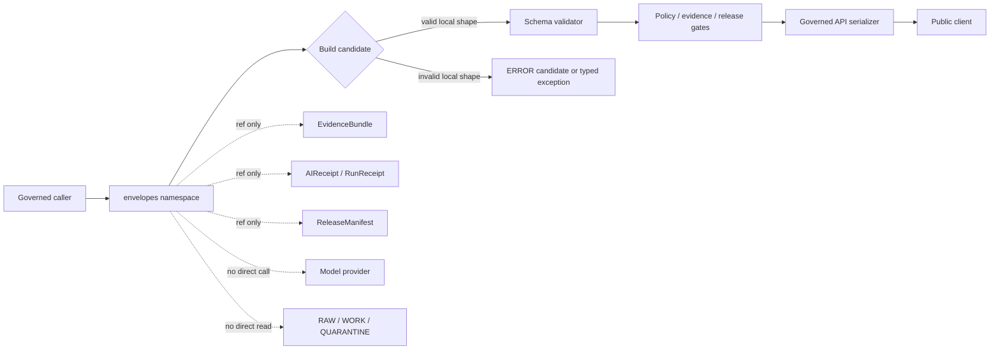

<!-- [KFM_META_BLOCK_V2]
doc_id: kfm://doc/NEEDS-VERIFICATION/packages-envelopes-src-envelopes-readme
title: Envelopes Import Namespace README
type: readme
version: v1
status: draft
owners: OWNER_TBD
created: NEEDS VERIFICATION — target file existed before this repair but contained only placeholder text
updated: 2026-06-14
policy_label: public
related: [packages/envelopes/README.md, packages/envelopes/src/README.md, packages/README.md, docs/architecture/governed-api/ENVELOPES.md, docs/architecture/cross-domain/shared-kernel.md, docs/adr/ADR-0019-ai-adapter-contract-and-finite-envelopes.md, contracts/, schemas/contracts/v1/runtime/, schemas/contracts/v1/policy/, policy/runtime/, data/receipts/, data/proofs/evidence_bundle/, release/]
tags: [kfm, packages, envelopes, import-namespace, runtime-response-envelope, decision-envelope, finite-outcomes, governed-api, evidence, policy, release]
notes: ["README-like namespace guide for the importable envelopes helper package.", "This namespace may expose deterministic helper functions and typed constants only; it must not own schemas, contracts, policy, source registries, lifecycle data, proofs, receipts, release decisions, API routes, UI surfaces, or AI truth claims.", "Actual module files, package metadata, tests, CI workflows, and runtime bindings remain NEEDS VERIFICATION until the live repo is recursively inspected."]
[/KFM_META_BLOCK_V2] -->

<a id="top"></a>

# `envelopes` Import Namespace

Importable helper namespace for KFM finite-outcome envelope utilities. Code in this namespace should help callers assemble, check, and serialize envelope candidates without becoming the source of schema truth, policy truth, evidence truth, release truth, or public API authority.

<p>
  
  
  
  
  
  
  
</p>

> [!IMPORTANT]
> **Status:** PROPOSED import-namespace README  
> **Path:** `packages/envelopes/src/envelopes/README.md`  
> **Owning responsibility root:** `packages/`  
> **Package lane:** `packages/envelopes/`  
> **Source envelope:** `packages/envelopes/src/`  
> **Import namespace:** `envelopes` — NEEDS VERIFICATION against package metadata  
> **Repo implementation depth:** UNKNOWN for module files, exports, tests, package manager, CI workflows, API bindings, receipts, proof packs, release manifests, branch protections, and runtime behavior.

## Quick links

- [Scope](#scope)
- [Namespace contract](#namespace-contract)
- [Expected modules](#expected-modules)
- [Allowed exports](#allowed-exports)
- [Disallowed exports](#disallowed-exports)
- [Import posture](#import-posture)
- [Finite outcome behavior](#finite-outcome-behavior)
- [Trust-boundary flow](#trust-boundary-flow)
- [Development rules](#development-rules)
- [Validation checklist](#validation-checklist)
- [Rollback](#rollback)
- [Evidence boundary](#evidence-boundary)

---

## Scope

`packages/envelopes/src/envelopes/` is the proposed importable namespace for reusable envelope helper code.

It may contain pure, deterministic helpers for:

- finite public outcome constants: `ANSWER`, `ABSTAIN`, `DENY`, and `ERROR`;
- `RuntimeResponseEnvelope` candidate construction and local invariant checks;
- `DecisionEnvelope` field carriers supplied by policy systems;
- optional `DomainFeatureEnvelope` adapters when accepted by docs and schemas;
- reason-code validation helpers that preserve stable namespaced codes;
- trace helper functions for request id, spec hash, schema hash, run id, and parent span values;
- reference carrier helpers for EvidenceRef, EvidenceBundle, receipt refs, release refs, rollback refs, and citation validation refs;
- fixture helpers for deterministic no-network tests.

This namespace must not decide truth, source authority, policy outcome, sensitivity posture, evidence closure, release state, review state, correction state, or publication state.

[⬆ Back to top](#top)

---

## Namespace contract

The namespace is a helper boundary, not an authority boundary.

| Namespace concern | Expected behavior | Authority home |
| --- | --- | --- |
| Public outcome constants | Provide closed-set constants or enums for helper code. | `docs/architecture/governed-api/ENVELOPES.md` and `schemas/contracts/v1/runtime/` |
| Runtime envelope assembly | Build candidate objects and reject invalid combinations. | Runtime schemas and governed API serializers |
| Policy decision carrier | Preserve policy fields supplied by policy systems. | `policy/runtime/`, `schemas/contracts/v1/policy/`, and semantic contracts |
| Evidence reference carrier | Preserve references and enforce required presence where local guards can. | EvidenceBundle/proof systems and evidence schemas |
| Release reference carrier | Preserve release and rollback references supplied by callers. | `release/` |
| Reason-code helper | Validate syntax and known local namespace conventions. | Reason-code registry and schema/policy docs |
| Trace helper | Preserve request/spec/run correlation fields. | Runtime trace/audit subsystem |
| Test fixture helper | Produce synthetic valid/invalid examples. | Tests and fixtures, not production evidence |

[⬆ Back to top](#top)

---

## Expected modules

> [!NOTE]
> The tree below is PROPOSED. Confirm actual language, module names, package manager, and tests before treating these as implementation facts.

```text
packages/envelopes/src/envelopes/
├── README.md                 # This file: namespace guide
├── __init__.py               # PROPOSED: export boundary if Python convention is confirmed
├── outcomes.py               # PROPOSED: finite public outcome constants and guard helpers
├── runtime_response.py       # PROPOSED: RuntimeResponseEnvelope candidate builders
├── decision.py               # PROPOSED: DecisionEnvelope field helpers
├── domain_feature.py         # PROPOSED: DomainFeatureEnvelope adapters if adopted
├── reason_codes.py           # PROPOSED: reason-code helper functions, not registry authority
├── trace.py                  # PROPOSED: request/spec/run trace helpers
├── references.py             # PROPOSED: Evidence/receipt/release ref carriers
├── validation.py             # PROPOSED: local validation adapter hooks
└── py.typed                  # PROPOSED: include only if typed Python package convention is confirmed
```

Keep any implementation smaller than this until tests, schemas, and callers prove the need.

[⬆ Back to top](#top)

---

## Allowed exports

Exports from this namespace should be boring, deterministic, and safe to call from tests and governed runtime code.

| Export family | Examples | Rule |
| --- | --- | --- |
| Outcome constants | `Outcome.ANSWER`, `Outcome.ABSTAIN`, `Outcome.DENY`, `Outcome.ERROR` | Closed set only. |
| Builders | `build_answer`, `build_abstain`, `build_deny`, `build_error` | Return candidate dictionaries/objects aligned to schemas; do not serialize public responses by themselves. |
| Guards | `is_answer`, `requires_reason`, `requires_payload_absent`, `requires_evidence_refs` | Local invariant checks only; schema validation still required. |
| Ref helpers | `EvidenceRefValue`, `ReleaseRefValue`, `ReceiptRefValue` | Preserve refs; do not resolve or fabricate target objects. |
| Reason-code helpers | `is_reason_code`, `normalize_reason_code_namespace` | Stable syntax helpers; no free-text policy explanations. |
| Trace helpers | `make_trace_stub`, `attach_trace` | Accept explicit inputs; do not generate hidden state beyond caller-approved ids/hashes. |
| Fixture helpers | `valid_answer_fixture`, `invalid_missing_evidence_fixture` | Synthetic/sanitized only; no sensitive or real private data. |

[⬆ Back to top](#top)

---

## Disallowed exports

Do not export functions, classes, or constants that make this namespace look like an authority surface.

| Disallowed export | Why |
| --- | --- |
| `approve_release`, `publish`, `promote`, `rollback_release` | Release authority belongs under `release/` and governed release workflows. |
| `evaluate_policy`, `decide_sensitivity`, `allow_public`, `deny_public` | Policy evaluation belongs to policy systems. |
| `resolve_evidence_bundle`, `create_evidence_bundle`, `store_proof` | Evidence closure and proof storage belong to proof systems. |
| `create_ai_receipt`, `write_run_receipt`, `sign_receipt` | Receipt persistence and authority belong to receipt/proof systems. |
| `fetch_source`, `read_raw`, `poll_connector` | Source activation and lifecycle access belong to connectors/pipelines/data roots. |
| `call_model`, `generate_answer`, `chat`, `complete` | Model runtime adapters belong behind governed AI adapter placement, not this namespace. |
| `render_ui`, `maplibre_layer`, `public_route_handler` | UI/API surfaces live in app/UI roots. |
| `truth_score`, `is_true`, `canonicalize_fact` | Generated or helper logic must not become truth authority. |

[⬆ Back to top](#top)

---

## Import posture

Preferred imports, subject to package metadata verification:

```python
from envelopes.outcomes import Outcome
from envelopes.runtime_response import build_answer, build_abstain, build_deny, build_error
from envelopes.decision import attach_policy_decision
from envelopes.references import EvidenceRefValue, ReleaseRefValue
```

Avoid wildcard imports and deep imports from callers:

```python
# Avoid
from envelopes.runtime_response import *
from envelopes._internal import unsafe_assembler
```

Callers should treat returned envelope objects as candidates until schema validation and policy/release/evidence gates pass.

[⬆ Back to top](#top)

---

## Finite outcome behavior

| Outcome | Namespace helper may do | Namespace helper must not do |
| --- | --- | --- |
| `ANSWER` | Require payload, trace, policy decision carrier, evidence refs, and release/citation refs where supplied by caller. | Decide truth, fabricate citations, approve release, or publish. |
| `ABSTAIN` | Require reason code and trace; reject substantive payload. | Hide insufficient evidence behind fluent prose. |
| `DENY` | Require policy decision/ref, reason code, and trace; reject substantive payload. | Reveal sensitive details in reason text or override policy. |
| `ERROR` | Require error reason code and trace; reject substantive payload and partial leakage. | Return partial answers, raw exceptions, provider payloads, secrets, or chain-of-thought. |

`DecisionEnvelope.decision` values are policy/runtime values and remain distinct from public outcomes:

```text
allow · deny · restrict · hold · abstain
```

`hold` is steward-visible; public callers should see a finite runtime envelope such as `ABSTAIN` or `DENY` with stable reason-code support.

[⬆ Back to top](#top)

---

## Trust-boundary flow



[⬆ Back to top](#top)

---

## Development rules

1. Keep the namespace no-network by default.
2. Prefer pure functions with explicit input objects.
3. Keep public outcomes closed: `ANSWER`, `ABSTAIN`, `DENY`, `ERROR`.
4. Keep policy decisions distinct from runtime outcomes.
5. Treat returned envelope objects as candidates until schema validation passes.
6. Never fabricate EvidenceRef, EvidenceBundle, citation, release, rollback, policy, or receipt authority.
7. Never store chain-of-thought, raw provider payloads, secrets, private source records, or unrestricted sensitive context.
8. Never read from RAW, WORK, QUARANTINE, unpublished candidates, canonical stores, source credentials, or direct model runtimes.
9. Keep reason codes stable, namespaced, non-sensitive, and machine-readable.
10. Add deterministic tests for each export and for every invalid envelope combination.
11. Keep fixtures synthetic or public-safe and mark fixture-only data clearly.
12. Change exported names only with compatibility notes and tests.

[⬆ Back to top](#top)

---

## Validation checklist

- [ ] Confirm this namespace exists in package metadata.
- [ ] Confirm the package import name is actually `envelopes`.
- [ ] Confirm `__init__` exports are intentional and minimal.
- [ ] Confirm all four outcomes have valid and invalid fixtures.
- [ ] Confirm `ANSWER` without evidence refs fails in helper and schema tests.
- [ ] Confirm `ABSTAIN`, `DENY`, and `ERROR` cannot carry substantive payloads.
- [ ] Confirm reason-code helpers reject free-text, PII-like, secret-like, and unknown unstable formats where possible.
- [ ] Confirm helpers do not import connectors, data stores, policy engines, release writers, model providers, API routers, UI components, or receipt/proof stores.
- [ ] Confirm public routes perform schema validation after helper construction.
- [ ] Confirm package docs and tests identify this namespace as helper code only.

Suggested inspection commands:

```bash
find packages/envelopes/src/envelopes -maxdepth 3 -type f | sort
git grep -n "from envelopes\|import envelopes" -- . 2>/dev/null || true
git grep -n "RuntimeResponseEnvelope\|DecisionEnvelope\|ANSWER\|ABSTAIN\|DENY\|ERROR" -- packages/envelopes tests fixtures docs schemas contracts policy 2>/dev/null || true
```

[⬆ Back to top](#top)

---

## Rollback

Rollback is required if this namespace:

- becomes a parallel schema, contract, policy, evidence, receipt, proof, release, API, UI, source-registry, or lifecycle authority;
- permits public output without `RuntimeResponseEnvelope`;
- permits `ANSWER` without evidence, policy, citation, trace, and release support where required;
- hides `ABSTAIN`, `DENY`, or `ERROR` behind prose, nulls, or partial payloads;
- stores chain-of-thought, raw provider payloads, secrets, sensitive source data, or unrestricted private context;
- lets public clients call model runtimes or package internals directly;
- exports broad authority verbs such as `publish`, `approve`, `decide`, `resolve_truth`, or `call_model`.

Rollback target: revert the namespace-source PR, keep any generated audit notes as review evidence, and file the affected behavior in `docs/registers/DRIFT_REGISTER.md` or `docs/registers/VERIFICATION_BACKLOG.md` if the mounted repo uses those registers.

[⬆ Back to top](#top)

---

## Evidence boundary

| Source | Status | Supports | Limits |
| --- | --- | --- | --- |
| Current target file | CONFIRMED | `packages/envelopes/src/envelopes/README.md` existed and required replacement from placeholder content. | Did not prove namespace implementation maturity. |
| Parent source README | CONFIRMED repo doc | `packages/envelopes/src/` is bounded to envelope helper source code. | Does not prove package metadata, imports, tests, or CI. |
| Package README | CONFIRMED repo doc | `packages/envelopes/` is a shared helper-code package for finite-outcome envelope helpers. | Does not prove source files or runtime bindings. |
| `docs/architecture/governed-api/ENVELOPES.md` | CONFIRMED repo doc | RuntimeResponseEnvelope, DecisionEnvelope, DomainFeatureEnvelope posture, finite outcomes, reason codes, and composition rules. | Field-level schemas and policy live elsewhere. |
| `docs/architecture/cross-domain/shared-kernel.md` | CONFIRMED repo doc | Shared object family posture for SourceDescriptor, EvidenceRef, EvidenceBundle, PolicyDecision, DecisionEnvelope, AIReceipt, ReleaseManifest, RollbackCard, and MapContextEnvelope. | Does not prove this namespace is implemented. |
| `docs/adr/ADR-0019-ai-adapter-contract-and-finite-envelopes.md` | CONFIRMED repo doc / PROPOSED ADR | AI adapter and finite envelope contract posture; no-direct-model-client and no-generated-truth rules. | ADR status remains draft/proposed until accepted. |
| Current file-generation pass | CONFIRMED request | User-requested target path and README repair/replacement. | Does not inspect package metadata, tests, CI logs, dashboards, deployment posture, runtime behavior, or branch protection. |

[⬆ Back to top](#top)
