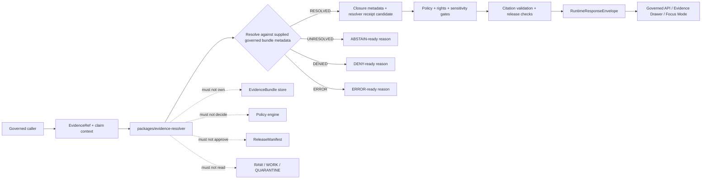

<!-- [KFM_META_BLOCK_V2]
doc_id: kfm://doc/NEEDS-VERIFICATION/packages-evidence-resolver-readme
title: Evidence Resolver Package README
type: readme
version: v1
status: draft
owners: OWNER_TBD
created: NEEDS VERIFICATION — target file existed before this revision as a short stub
updated: 2026-06-14
policy_label: public
related: [packages/README.md, packages/evidence/README.md, docs/architecture/evidence-identity.md, docs/architecture/cross-domain/shared-kernel.md, docs/architecture/trust-membrane.md, docs/architecture/governed-api/ENVELOPES.md, docs/architecture/evidence-drawer.md, contracts/evidence/, schemas/contracts/v1/evidence/, policy/evidence/, policy/runtime/, data/proofs/evidence_bundle/, data/receipts/, release/]
tags: [kfm, packages, evidence-resolver, evidenceref, evidencebundle, closure-validation, cite-or-abstain, trust-membrane, finite-outcomes]
notes: ["README-like package entrypoint for EvidenceRef -> EvidenceBundle resolver helper code.", "This package is the resolver lane for closure validation and finite evidence-resolution outcomes; it must not become the proof store, evidence store, schema home, contract home, policy home, lifecycle-data home, release authority, public API route, UI surface, or AI truth source.", "The sibling package packages/evidence/ is the broader helper lane for evidence value objects, refs, digests, and fixtures; do not duplicate that package unless an ADR-backed consolidation changes the package boundary."]
[/KFM_META_BLOCK_V2] -->

<a id="top"></a>

# Evidence Resolver Package

Shared resolver package for KFM EvidenceRef → EvidenceBundle closure validation: deterministic helper code that turns evidence references into bounded resolver outcomes without becoming the evidence store, proof authority, policy engine, release gate, public API, or truth source.

<p>
  
  
  
  
  
  
</p>

> [!IMPORTANT]
> **Status:** PROPOSED package README  
> **Path:** `packages/evidence-resolver/README.md`  
> **Owning responsibility root:** `packages/` — shared reusable implementation libraries  
> **Resolver responsibility:** closure validation for `EvidenceRef` → `EvidenceBundle` support  
> **Sibling helper boundary:** `packages/evidence/` handles broader evidence refs, identity, digest, carrier, and fixture helpers  
> **Schema authority:** `schemas/contracts/v1/evidence/`, not this package  
> **Contract authority:** `contracts/evidence/`, not this package  
> **Proof authority:** `data/proofs/evidence_bundle/` or repo-confirmed proof home, not this package  
> **Repo implementation depth:** UNKNOWN for package metadata, import style, source files, tests, CI workflows, API bindings, emitted receipts, proof packs, release manifests, and runtime behavior.

## Quick links

- [Scope](#scope)
- [Repo fit](#repo-fit)
- [Relationship to packages/evidence](#relationship-to-packagesevidence)
- [Accepted inputs](#accepted-inputs)
- [Resolver outcomes](#resolver-outcomes)
- [Exclusions](#exclusions)
- [Closure validation responsibilities](#closure-validation-responsibilities)
- [Cite-or-abstain rules](#cite-or-abstain-rules)
- [Trust-boundary flow](#trust-boundary-flow)
- [Expected package layout](#expected-package-layout)
- [Development rules](#development-rules)
- [Validation checklist](#validation-checklist)
- [Rollback](#rollback)
- [Evidence boundary](#evidence-boundary)

---

## Scope

`packages/evidence-resolver/` is the shared package lane for resolver helper code that checks whether an `EvidenceRef` can resolve to an `EvidenceBundle` with sufficient closure for a governed caller.

This package may contain deterministic utilities for:

- resolving candidate `EvidenceRef` values to bundle references supplied by governed stores;
- checking closure metadata supplied by proof/evidence systems;
- validating that referenced bundle identity, digest, source-role distribution, temporal scope, and claim scope are compatible with the caller's requested claim;
- returning finite resolver outcomes such as `RESOLVED`, `UNRESOLVED`, `DENIED`, and `ERROR` for conversion into runtime envelopes;
- preserving validation-report refs, run refs, evidence refs, source refs, policy refs, release refs, and rollback refs supplied by callers;
- producing resolver-candidate metadata for governed API, Evidence Drawer, Focus Mode, domain packages, and validation tools;
- building synthetic no-network resolver fixtures.

This package must not fetch raw source data, write proof bundles, decide policy, approve release, expose public API routes, render UI, or generate claims. It resolves references against governed inputs; it does not make evidence true by itself.

```text
RAW -> WORK / QUARANTINE -> PROCESSED -> CATALOG / TRIPLET -> PUBLISHED
```

Resolver helpers may support runtime access to already-governed evidence. They do not own lifecycle state, proof state, review state, or release state.

[⬆ Back to top](#top)

---

## Repo fit

```text
packages/evidence-resolver/
```

This path is appropriate only for shared resolver implementation code because `packages/` owns reusable libraries.

| Relationship | Expected home | Boundary rule |
| --- | --- | --- |
| Evidence resolver helper code | `packages/evidence-resolver/` | Resolver logic and closure-validation helpers only. |
| General evidence helper code | `packages/evidence/` | EvidenceRef value helpers, digest helpers, citation carriers, and fixtures. |
| Evidence architecture docs | `docs/architecture/evidence-identity.md` | Explains evidence identity, deterministic hashing, resolver posture, and cite-or-abstain. |
| Cross-domain shared kernel docs | `docs/architecture/cross-domain/shared-kernel.md` | Defines EvidenceRef, EvidenceBundle, PolicyDecision, DecisionEnvelope, AIReceipt, ReleaseManifest, RollbackCard, and related shared objects. |
| Evidence contracts | `contracts/evidence/` | Defines meaning; resolver code references, not redefines. |
| Evidence schemas | `schemas/contracts/v1/evidence/` | Defines machine-checkable shape. |
| Evidence policy | `policy/evidence/`, `policy/runtime/`, or repo-confirmed policy homes | Owns admissibility, sensitivity, rights, and fail-closed behavior. |
| Evidence/proof instances | `data/proofs/evidence_bundle/`, `data/proofs/`, or repo-confirmed proof homes | Stores resolved proof/evidence artifacts. |
| Receipts | `data/receipts/` | Stores process memory, validation reports, AI receipts, run receipts, and promotion receipts. |
| Release decisions | `release/` | Owns promotion, publication, correction, supersession, and rollback. |
| API and UI runtime | `apps/`, `ui/`, `web/`, or repo-confirmed equivalents | May call resolver helpers through governed interfaces; must not be replaced by package internals. |
| Tests and fixtures | `tests/packages/evidence-resolver/`, `fixtures/packages/evidence-resolver/`, or repo-confirmed equivalents | Proves resolver behavior with deterministic no-network fixtures. |

> [!WARNING]
> Do not use `packages/evidence-resolver/` as a storage location for evidence bundles, proof packs, receipts, source descriptors, or lifecycle data. Resolver code may read governed references supplied by callers; trust objects remain in their owning roots.

[⬆ Back to top](#top)

---

## Relationship to packages/evidence

`packages/evidence-resolver/` is narrower than `packages/evidence/`.

| Package | Responsibility | Must not become |
| --- | --- | --- |
| `packages/evidence/` | Small shared helper layer for evidence refs, IDs, digest helpers, carriers, citation helpers, and fixtures. | Runtime resolver authority, proof store, policy engine, lifecycle data home, or release gate. |
| `packages/evidence-resolver/` | EvidenceRef → EvidenceBundle closure-validation lane. | General dumping ground for all evidence helpers, schema authority, proof storage, or public API surface. |

A future consolidation may be valid, but it is ADR-class because it affects package responsibilities, imports, tests, docs, schemas, runtime trust boundaries, and rollback paths.

[⬆ Back to top](#top)

---

## Accepted inputs

Resolver functions should accept explicit, governed inputs. They should not fetch missing facts from raw stores, source systems, hidden globals, UI state, operator memory, or generated language.

| Input family | Accepted examples | Required handling |
| --- | --- | --- |
| Evidence reference | EvidenceRef URI, claim support ref, field path, source offset, candidate bundle ref | Validate syntax and preserve original ref; do not silently retarget. |
| Bundle lookup result | bundle id, bundle ref, spec hash, content hash, closure status, validation report ref, supersession state | Check supplied metadata; do not fabricate missing bundle contents. |
| Source context | source descriptor ref, source role, authority class, rights posture, sensitivity tier, citation obligation | Preserve source-role and rights context; fail closed when required support is absent. |
| Claim context | claim id, domain, object id, field path, temporal scope, spatial scope, claim significance | Ensure evidence scope matches claim scope or return unresolved/abstain-ready state. |
| Policy context | policy decision ref, audience class, obligations, denied/restricted reason codes | Preserve policy posture; do not evaluate policy as resolver code. |
| Release context | release ref, release state, rollback ref, correction/supersession ref | Carry release refs; do not approve release. |
| Trace context | request id, run id, spec hash, resolver version, schema hash, input/output digests | Return receipt-ready metadata for owning systems to persist. |
| Fixture context | synthetic refs, synthetic bundle metadata, expected resolver outcomes | Keep fixture-only data public-safe and marked as synthetic. |

[⬆ Back to top](#top)

---

## Resolver outcomes

Resolver outcomes should be finite and easy to map into `RuntimeResponseEnvelope` outcomes.

| Resolver outcome | Use when | Runtime mapping |
| --- | --- | --- |
| `RESOLVED` | EvidenceRef resolves to a bundle with sufficient local closure metadata for the next governed gate. | Candidate for `ANSWER` only after policy, citation, release, and schema checks pass. |
| `UNRESOLVED` | Ref is missing, stale, superseded, inconsistent, incomplete, out-of-scope, or not found. | `ABSTAIN` with `evidence/*` reason code. |
| `DENIED` | Resolver was supplied a policy/sensitivity/rights posture that blocks disclosure or use. | `DENY` with `policy/*` or `auth/*` reason code. |
| `ERROR` | Input is malformed, schema-invalid, unsupported, or resolver helper failed. | `ERROR` with `schema/*`, `error/*`, or `resolver/*` reason code. |

> [!IMPORTANT]
> `RESOLVED` is not the same as published truth. It only means the resolver found locally sufficient closure support for the next gate. Public `ANSWER` still requires policy, citation validation, release state, and envelope validation.

[⬆ Back to top](#top)

---

## Exclusions

| Do not put here | Correct home or owner | Reason |
| --- | --- | --- |
| RAW, WORK, QUARANTINE, PROCESSED, CATALOG, TRIPLET, or PUBLISHED evidence data | `data/<phase>/` | Lifecycle state must remain phase-visible. |
| Resolved EvidenceBundle instances or proof packs | `data/proofs/evidence_bundle/`, `data/proofs/`, or repo-confirmed proof homes | Evidence closure must remain separately auditable. |
| Source descriptors and rights registries | `data/registry/` or repo-confirmed source registry homes | Source authority, rights, and cadence are governance data. |
| Evidence semantic contracts | `contracts/evidence/` | Contracts own meaning. |
| Evidence JSON Schemas | `schemas/contracts/v1/evidence/` | Schemas own machine shape. |
| Evidence, rights, sensitivity, or release policy rules | `policy/evidence/`, `policy/rights/`, `policy/sensitivity/`, `policy/runtime/` | Policy owns allow/deny/restrict/hold/abstain decisions. |
| General evidence ref/digest helper sprawl | `packages/evidence/` | Keep resolver logic focused on closure validation. |
| Receipts, validation reports, AI receipts, run receipts, promotion receipts | `data/receipts/` and proof homes | Process memory must remain separately auditable. |
| Release manifests, rollback cards, correction notices | `release/` | Publication is a governed state transition. |
| API route handlers or public serializers | `apps/` or repo-confirmed API app | Public clients must use governed APIs, not package internals. |
| UI components, MapLibre styles, Evidence Drawer views | `ui/`, `web/`, `apps/`, or repo-confirmed UI roots | Rendering is downstream from governed evidence and envelopes. |
| AI-generated citations, generated claims, or source summaries as proof | governed AI runtime + receipts + citation validation | AI output is interpretive and evidence-subordinate. |
| Hidden chain-of-thought, secrets, credentials, private raw source content | Nowhere in package source or fixtures | Auditability must not leak private reasoning or sensitive data. |

[⬆ Back to top](#top)

---

## Closure validation responsibilities

| Responsibility | Expected behavior |
| --- | --- |
| Resolve by explicit ref | Accept an EvidenceRef and explicit lookup/result objects; never search raw data opportunistically. |
| Check identity consistency | Compare ref, bundle id, spec hash, content hash, source descriptor refs, and supplied validation metadata. |
| Check scope fit | Verify claim field path, temporal scope, spatial scope, and source-role support match the requested claim. |
| Check closure state | Preserve resolver state such as resolved, unresolved, superseded, stale, partial, denied, or malformed. |
| Preserve source-role distribution | Mixed-role bundles are allowed only when role distribution remains visible to downstream policy/UI. |
| Preserve rights and sensitivity posture | Carry rights/sensitivity reasons into finite outcomes; do not redact silently. |
| Return receipt-ready metadata | Emit input digest, output digest, resolver version, spec hash, reason code, and validation refs for owning systems. |
| Fail closed | Missing bundle, unresolved source descriptor, stale hash, supersession conflict, unknown rights, or sensitivity hold should not become public answer text. |

[⬆ Back to top](#top)

---

## Cite-or-abstain rules

The resolver is the trust membrane for evidence-backed claims.

| Case | Resolver posture |
| --- | --- |
| EvidenceRef is malformed | `ERROR` or invalid candidate; no public claim. |
| EvidenceRef is syntactically valid but not found | `UNRESOLVED`; map to `ABSTAIN`. |
| EvidenceBundle exists but hash/source-role/scope mismatch is detected | `UNRESOLVED` or `ERROR`, depending on cause; no public claim. |
| EvidenceBundle is stale, superseded, or rollback-affected | `UNRESOLVED`; require correction/review path. |
| Bundle is denied by supplied rights/sensitivity posture | `DENIED`; map to `DENY`. |
| Bundle resolves but release/citation/policy checks are still pending | Return `RESOLVED` with pending refs; public `ANSWER` remains blocked until downstream gates pass. |
| Public surface asks for direct proof text | Return refs and resolver status; proof details are exposed only through governed evidence APIs and policy-safe views. |

[⬆ Back to top](#top)

---

## Trust-boundary flow



[⬆ Back to top](#top)

---

## Expected package layout

> [!NOTE]
> The tree below is PROPOSED. Confirm package metadata, language conventions, import namespace, test layout, and CI before committing code beyond README files.

```text
packages/evidence-resolver/
├── README.md                           # This file: package boundary and trust rules
├── pyproject.toml / package.json        # NEEDS VERIFICATION
├── src/                                 # NEEDS VERIFICATION
│   └── evidence_resolver/               # PROPOSED namespace; confirm against repo convention
│       ├── README.md                    # PROPOSED namespace guide
│       ├── __init__.py                  # PROPOSED export boundary if Python convention is confirmed
│       ├── outcomes.py                  # PROPOSED resolver outcomes and reason codes
│       ├── resolver.py                  # PROPOSED closure-validation orchestration helpers
│       ├── refs.py                      # PROPOSED EvidenceRef parsing adapters or imports from packages/evidence
│       ├── closure.py                   # PROPOSED closure-state checks
│       ├── scope.py                     # PROPOSED claim/evidence scope checks
│       ├── integrity.py                 # PROPOSED digest/spec-hash consistency checks
│       ├── receipts.py                  # PROPOSED receipt-ready metadata carriers, not receipt store
│       ├── fixtures.py                  # PROPOSED synthetic resolver fixtures
│       └── py.typed                     # PROPOSED if typed Python package convention is confirmed
└── CHANGELOG.md                         # OPTIONAL / NEEDS VERIFICATION
```

Potential imports, subject to package verification:

```python
from evidence_resolver.outcomes import ResolverOutcome
from evidence_resolver.resolver import resolve_evidence_ref
from evidence_resolver.closure import check_bundle_closure
```

[⬆ Back to top](#top)

---

## Development rules

1. Treat this package as a resolver helper layer, not a proof store or truth authority.
2. Prefer pure functions with explicit input objects and no ambient state.
3. Resolve only against governed lookup objects supplied by callers or configured test fixtures.
4. Preserve EvidenceRef, EvidenceBundle, SourceDescriptor, PolicyDecision, ReleaseManifest, RollbackCard, ValidationReport, and Receipt references distinctly.
5. Preserve source role, rights, sensitivity, time scope, spatial scope, claim field path, and digest algorithm fields supplied by callers.
6. Do not read directly from RAW, WORK, QUARANTINE, unpublished candidates, source credentials, source systems, or model runtimes.
7. Do not write proofs, receipts, release manifests, catalog records, or lifecycle data.
8. Do not evaluate policy; consume policy posture and return finite resolver outcomes.
9. Do not create schemas, contracts, policy rules, source registries, API routes, UI components, or public answers from this package.
10. Do not store chain-of-thought, raw provider payloads, secrets, private source records, or unrestricted sensitive context.
11. Return finite resolver outcomes instead of silent fallback refs.
12. Add deterministic tests for every behavior-changing helper and every negative path.
13. Keep fixtures synthetic or public-safe and mark fixture-only data clearly.
14. Preserve rollback and correction metadata supplied by callers when resolver output can affect downstream publication candidates.

[⬆ Back to top](#top)

---

## Validation checklist

- [ ] Confirm `packages/evidence-resolver/` package metadata and language/runtime convention.
- [ ] Confirm whether this package is intended to coexist with `packages/evidence/` or be consolidated by ADR.
- [ ] Confirm import namespace and whether it conflicts with Python/JS ecosystem package names.
- [ ] Confirm owners and CODEOWNERS path coverage.
- [ ] Confirm schema home for EvidenceRef and EvidenceBundle.
- [ ] Confirm contract home for EvidenceRef and EvidenceBundle.
- [ ] Confirm policy home for evidence admissibility, rights, sensitivity, and runtime denial behavior.
- [ ] Confirm tests for malformed refs, missing bundles, stale hashes, superseded bundles, source-role mismatch, claim-scope mismatch, rights denial, and successful resolution.
- [ ] Confirm resolver helpers do not access RAW/WORK/QUARANTINE or unpublished candidate stores.
- [ ] Confirm resolver helpers do not write proofs, receipts, release manifests, catalog records, or API responses.
- [ ] Confirm public API routes wrap resolver outcomes in schema-valid `RuntimeResponseEnvelope` objects.

Suggested inspection commands:

```bash
find packages/evidence-resolver -maxdepth 5 -type f | sort
find packages/evidence -maxdepth 5 -type f | sort
git grep -n "EvidenceRef\|EvidenceBundle\|evidence-resolver\|resolve_evidence\|closure" -- packages docs contracts schemas policy tests fixtures apps 2>/dev/null || true
```

[⬆ Back to top](#top)

---

## Rollback

Rollback is required if this package:

- becomes a parallel schema, contract, policy, evidence-store, proof-store, receipt-store, release, API, UI, source-registry, or lifecycle authority;
- duplicates or bypasses `packages/evidence/` helper responsibility without ADR approval;
- permits public claims without EvidenceRef → EvidenceBundle resolution and downstream policy/citation/release gates;
- fabricates citations, evidence refs, bundle ids, source roles, policy decisions, release refs, proof state, or closure status;
- stores chain-of-thought, raw provider payloads, secrets, sensitive source data, or unrestricted private context;
- lets public clients call resolver internals directly instead of governed APIs.

Rollback target: revert the resolver package README or resolver-source PR, preserve audit notes, and file any authority drift in `docs/registers/DRIFT_REGISTER.md` or the repo-confirmed drift register.

[⬆ Back to top](#top)

---

## Evidence boundary

| Source | Status | Supports | Limits |
| --- | --- | --- | --- |
| Current target file | CONFIRMED | `packages/evidence-resolver/README.md` existed as a short stub naming EvidenceRef → EvidenceBundle closure validation. | Stub did not prove package implementation maturity. |
| `packages/evidence/README.md` | CONFIRMED sibling package doc | Broader evidence helper lane exists for refs, digests, carriers, and fixtures. | Does not prove resolver implementation. |
| `docs/architecture/evidence-identity.md` | CONFIRMED repo doc | EvidenceRef/EvidenceBundle identity posture, deterministic hashing, resolver trust membrane, cite-or-abstain, and proposed homes. | Some paths and implementation claims remain PROPOSED/NEEDS VERIFICATION in that doc. |
| `docs/architecture/cross-domain/shared-kernel.md` | CONFIRMED repo doc | Shared object family posture for SourceDescriptor, EvidenceRef, EvidenceBundle, PolicyDecision, DecisionEnvelope, AIReceipt, ReleaseManifest, RollbackCard, and MapContextEnvelope. | Does not prove this resolver package is implemented. |
| `docs/architecture/governed-api/ENVELOPES.md` | CONFIRMED repo doc | Finite runtime outcomes and envelope composition expected after resolver output. | Field-level schemas and policy live elsewhere. |
| Current file-generation pass | CONFIRMED request | User-requested target path and README expansion. | Does not inspect package metadata, tests, CI logs, dashboards, deployment posture, runtime behavior, or branch protection. |

[⬆ Back to top](#top)
