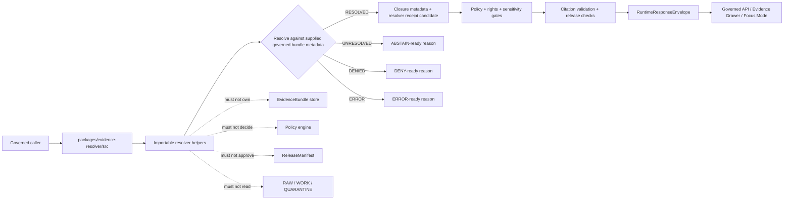

<!-- [KFM_META_BLOCK_V2]
doc_id: kfm://doc/NEEDS-VERIFICATION/packages-evidence-resolver-src-readme
title: Evidence Resolver Package Source README
type: readme
version: v1
status: draft
owners: OWNER_TBD
created: NEEDS VERIFICATION — target file existed before this repair but contained only placeholder text
updated: 2026-06-14
policy_label: public
related: [packages/evidence-resolver/README.md, packages/evidence/README.md, packages/README.md, docs/architecture/evidence-identity.md, docs/architecture/cross-domain/shared-kernel.md, docs/architecture/governed-api/ENVELOPES.md, contracts/evidence/, schemas/contracts/v1/evidence/, policy/evidence/, policy/runtime/, data/proofs/evidence_bundle/, data/receipts/, release/]
tags: [kfm, packages, evidence-resolver, src, evidenceref, evidencebundle, closure-validation, cite-or-abstain, finite-outcomes, trust-membrane]
notes: ["README-like source-directory guide for EvidenceRef -> EvidenceBundle resolver implementation helpers.", "This directory may contain source code for closure-validation helpers only; it must not own schemas, contracts, policy, source registries, lifecycle data, proofs, receipts, release decisions, API routes, UI surfaces, or AI truth claims.", "Import layout, package metadata, tests, CI workflows, and runtime bindings remain NEEDS VERIFICATION until the live repo is recursively inspected."]
[/KFM_META_BLOCK_V2] -->

<a id="top"></a>

# Evidence Resolver Package Source

Source-code envelope for KFM EvidenceRef → EvidenceBundle resolver helpers: deterministic implementation utilities that check reference closure and return finite resolver outcomes without becoming the evidence store, proof authority, policy engine, release gate, public API, UI surface, or truth source.

<p>
  
  
  
  
  
  
  
</p>

> [!IMPORTANT]
> **Status:** PROPOSED source-directory README  
> **Path:** `packages/evidence-resolver/src/README.md`  
> **Owning responsibility root:** `packages/`  
> **Package lane:** `packages/evidence-resolver/`  
> **Import/package layout:** NEEDS VERIFICATION  
> **Repo implementation depth:** UNKNOWN for package metadata, import style, tests, CI workflows, API bindings, emitted receipts, proof packs, release manifests, branch protections, and runtime behavior.

## Quick links

- [Scope](#scope)
- [Repo fit](#repo-fit)
- [Accepted inputs](#accepted-inputs)
- [Exclusions](#exclusions)
- [Expected source layout](#expected-source-layout)
- [Resolver outcomes](#resolver-outcomes)
- [Trust-boundary flow](#trust-boundary-flow)
- [Source anti-collapse rules](#source-anti-collapse-rules)
- [Development rules](#development-rules)
- [Validation checklist](#validation-checklist)
- [Rollback](#rollback)
- [Evidence boundary](#evidence-boundary)

---

## Scope

`packages/evidence-resolver/src/` is the proposed source-code root for the Evidence Resolver package.

This directory is for importable, deterministic helper code used by governed API assemblers, domain packages, validation tools, Evidence Drawer support, Focus Mode support, and tests when they need to check whether evidence references have enough closure support for the next governed gate.

This source tree may support helpers for:

- parsing and checking `EvidenceRef` candidates supplied by governed callers;
- checking resolver lookup results supplied by proof/evidence systems;
- comparing bundle ids, spec hashes, content hashes, schema hashes, source descriptor refs, and validation-report refs;
- checking claim scope against evidence scope, including field path, temporal scope, spatial scope, domain, and object id;
- preserving source-role distribution, rights posture, sensitivity posture, release refs, rollback refs, and policy decision refs;
- returning finite resolver outcomes such as `RESOLVED`, `UNRESOLVED`, `DENIED`, and `ERROR`;
- producing receipt-ready metadata for owning pipeline/API systems to persist;
- building synthetic no-network fixtures for positive and negative resolver paths.

This source tree must not fetch raw source data, write proofs, decide policy, approve release, expose public API routes, render UI, call model providers, or generate claims. It resolves references against governed inputs; it does not make evidence true by itself.

```text
RAW -> WORK / QUARANTINE -> PROCESSED -> CATALOG / TRIPLET -> PUBLISHED
```

Resolver source code may support runtime access to already-governed evidence. It does not own lifecycle state, proof state, review state, or release state.

[⬆ Back to top](#top)

---

## Repo fit

```text
packages/evidence-resolver/src/
```

`packages/` is the responsibility root for shared reusable code. `evidence-resolver/` is the resolver package lane. `src/` is the source-code envelope.

| Relationship | Expected home | Boundary rule |
| --- | --- | --- |
| Resolver source code | `packages/evidence-resolver/src/` | Reusable resolver implementation helpers only. |
| Importable module | `packages/evidence-resolver/src/evidence_resolver/` or repo-confirmed namespace | Package namespace, subject to repo package convention verification. |
| Package entry README | `packages/evidence-resolver/README.md` | Explains the package as a whole. |
| General evidence helpers | `packages/evidence/` | Evidence ref/value/digest/citation/fixture helpers outside the resolver lane. |
| Evidence architecture docs | `docs/architecture/evidence-identity.md` | Explains evidence identity, deterministic hashing, resolver posture, and cite-or-abstain. |
| Evidence contracts | `contracts/evidence/` | Defines meaning; source code references, not redefines. |
| Evidence schemas | `schemas/contracts/v1/evidence/` | Defines machine-checkable shape. |
| Evidence policy | `policy/evidence/`, `policy/runtime/`, or repo-confirmed policy homes | Owns admissibility, sensitivity, rights, and fail-closed behavior. |
| Evidence/proof instances | `data/proofs/evidence_bundle/`, `data/proofs/`, or repo-confirmed proof homes | Stores resolved proof/evidence artifacts. |
| Receipts | `data/receipts/` | Stores process memory and validation/AI/run/promotion receipts. |
| Release decisions | `release/` | Owns promotion, publication, correction, supersession, and rollback. |
| API and UI runtime | `apps/`, `ui/`, `web/`, or repo-confirmed equivalents | May call resolver helpers; must not be replaced by package internals. |
| Tests and fixtures | `tests/packages/evidence-resolver/`, `fixtures/packages/evidence-resolver/`, or repo-confirmed equivalents | Proves resolver behavior with deterministic no-network fixtures. |

> [!WARNING]
> A source-code directory is not a trust-object home. Keep schemas, contracts, policy rules, lifecycle data, receipts, proofs, and release decisions in their owning roots.

[⬆ Back to top](#top)

---

## Accepted inputs

Functions in this source tree should accept explicit values from governed callers. They should not fetch missing facts from raw stores, source systems, hidden globals, UI state, operator memory, or generated language.

| Input family | Accepted examples | Required handling |
| --- | --- | --- |
| Evidence reference | EvidenceRef URI, claim support ref, field path, source offset, candidate bundle ref | Validate syntax and preserve original ref; do not silently retarget. |
| Bundle lookup result | bundle id, bundle ref, spec hash, content hash, closure status, validation report ref, supersession state | Check supplied metadata; do not fabricate missing bundle contents. |
| Source context | source descriptor ref, source role, authority class, rights posture, sensitivity tier, citation obligation | Preserve source role and rights context; fail closed when required support is absent. |
| Claim context | claim id, domain, object id, field path, temporal scope, spatial scope, claim significance | Ensure evidence scope matches claim scope or return unresolved/abstain-ready state. |
| Policy context | policy decision ref, audience class, obligations, denied/restricted reason codes | Preserve policy posture; do not evaluate policy as resolver code. |
| Release context | release ref, release state, rollback ref, correction/supersession ref | Carry release refs; do not approve release. |
| Trace context | request id, run id, spec hash, resolver version, schema hash, input/output digests | Return receipt-ready metadata for owning systems to persist. |
| Fixture context | synthetic refs, synthetic bundle metadata, expected resolver outcomes | Keep fixture-only data public-safe and marked as synthetic. |

[⬆ Back to top](#top)

---

## Exclusions

| Do not put here | Correct home or owner | Reason |
| --- | --- | --- |
| RAW, WORK, QUARANTINE, PROCESSED, CATALOG, TRIPLET, or PUBLISHED evidence data | `data/<phase>/` | Lifecycle state must remain phase-visible. |
| Resolved EvidenceBundle instances or proof packs | `data/proofs/evidence_bundle/`, `data/proofs/`, or repo-confirmed proof homes | Evidence closure must remain separately auditable. |
| Source descriptors and rights registries | `data/registry/` or repo-confirmed source registry homes | Source authority, rights, and cadence are governance data. |
| Evidence semantic contracts | `contracts/evidence/` | Contracts own meaning. |
| Evidence JSON Schemas | `schemas/contracts/v1/evidence/` | Schemas own machine shape. |
| Evidence, rights, sensitivity, or release policy rules | `policy/evidence/`, `policy/rights/`, `policy/sensitivity/`, `policy/runtime/` | Policy owns allow/deny/restrict/hold/abstain decisions. |
| General evidence ref/digest helper sprawl | `packages/evidence/` | Keep resolver source focused on closure validation. |
| Receipts, validation reports, AI receipts, run receipts, promotion receipts | `data/receipts/` and proof homes | Process memory must remain separately auditable. |
| Release manifests, rollback cards, correction notices | `release/` | Publication is a governed state transition. |
| API route handlers or public serializers | `apps/` or repo-confirmed API app | Public clients must use governed APIs, not package internals. |
| UI components, MapLibre styles, Evidence Drawer views | `ui/`, `web/`, `apps/`, or repo-confirmed UI roots | Rendering is downstream from governed evidence and envelopes. |
| AI-generated citations, generated claims, or source summaries as proof | governed AI runtime + receipts + citation validation | AI output is interpretive and evidence-subordinate. |
| Hidden chain-of-thought, secrets, credentials, private raw source content | Nowhere in package source or fixtures | Auditability must not leak private reasoning or sensitive data. |

[⬆ Back to top](#top)

---

## Expected source layout

> [!NOTE]
> The tree below is PROPOSED. Confirm package metadata, language conventions, import namespace, test layout, and CI before committing code beyond README files.

```text
packages/evidence-resolver/src/
├── README.md                         # This file: source-code boundary and trust rules
└── evidence_resolver/
    ├── README.md                     # PROPOSED: importable namespace guide
    ├── __init__.py                   # PROPOSED: export boundary if Python convention is confirmed
    ├── outcomes.py                   # PROPOSED: resolver outcomes and reason codes
    ├── resolver.py                   # PROPOSED: closure-validation orchestration helpers
    ├── refs.py                       # PROPOSED: EvidenceRef parsing adapters or imports from packages/evidence
    ├── closure.py                    # PROPOSED: closure-state checks
    ├── scope.py                      # PROPOSED: claim/evidence scope checks
    ├── integrity.py                  # PROPOSED: digest/spec-hash consistency checks
    ├── receipts.py                   # PROPOSED: receipt-ready metadata carriers, not receipt store
    ├── fixtures.py                   # PROPOSED: synthetic resolver fixtures
    └── py.typed                      # PROPOSED: include only if typed Python package convention is confirmed
```

Preferred import posture, subject to package verification:

```python
from evidence_resolver.outcomes import ResolverOutcome
from evidence_resolver.resolver import resolve_evidence_ref
from evidence_resolver.closure import check_bundle_closure
```

[⬆ Back to top](#top)

---

## Resolver outcomes

Resolver source helpers should return explicit outcomes that calling pipelines, validators, APIs, or tests can inspect.

| Resolver outcome | Use when | Runtime mapping |
| --- | --- | --- |
| `RESOLVED` | EvidenceRef resolves to a bundle with sufficient local closure metadata for the next governed gate. | Candidate for `ANSWER` only after policy, citation, release, and schema checks pass. |
| `UNRESOLVED` | Ref is missing, stale, superseded, inconsistent, incomplete, out-of-scope, or not found. | `ABSTAIN` with `evidence/*` reason code. |
| `DENIED` | Resolver was supplied a policy/sensitivity/rights posture that blocks disclosure or use. | `DENY` with `policy/*` or `auth/*` reason code. |
| `ERROR` | Input is malformed, schema-invalid, unsupported, or resolver helper failed. | `ERROR` with `schema/*`, `error/*`, or `resolver/*` reason code. |

`RESOLVED` is not the same as published truth. It only means the resolver found locally sufficient closure support for the next gate.

[⬆ Back to top](#top)

---

## Trust-boundary flow



[⬆ Back to top](#top)

---

## Source anti-collapse rules

| Boundary | Preserve as | Never collapse into |
| --- | --- | --- |
| `EvidenceRef` | Portable pointer to evidence that requires resolver closure | Citation-looking string that proves itself |
| `EvidenceBundle` | Resolved support object owned by proof/evidence systems | Inline payload stored in package source |
| Resolver outcome | Finite state for next governed gate | Public answer, policy decision, or release approval |
| Source role distribution | Mixed support profile visible to downstream policy/UI | Generic evidence with hidden role conflicts |
| Closure status | Resolved/unresolved/stale/superseded/partial/denied/malformed | Boolean success flag with lost reasons |
| `ValidationReport` ref | Reference to separately auditable validation results | Package-local proof object |
| `ReleaseManifest` / `RollbackCard` refs | References to release and rollback authority | Publication approval inside resolver code |
| Trace metadata | Request/spec/run correlation fields | Hidden chain-of-thought or source secret |

[⬆ Back to top](#top)

---

## Development rules

1. Prefer pure functions with explicit inputs and outputs.
2. Resolve only against governed lookup objects supplied by callers or configured test fixtures.
3. Preserve EvidenceRef, EvidenceBundle, SourceDescriptor, PolicyDecision, ReleaseManifest, RollbackCard, ValidationReport, and Receipt refs distinctly.
4. Preserve source role, rights, sensitivity, time scope, spatial scope, claim field path, and digest algorithm fields supplied by callers.
5. Do not make network calls from `src/` helpers.
6. Do not read directly from RAW, WORK, QUARANTINE, unpublished candidates, source credentials, source systems, or model runtimes.
7. Do not write proofs, receipts, release manifests, catalog records, or lifecycle data.
8. Do not evaluate policy; consume policy posture and return finite resolver outcomes.
9. Do not create schemas, contracts, policy rules, source registries, API routes, UI components, or public answers from this source tree.
10. Do not store chain-of-thought, raw provider payloads, secrets, private source records, or unrestricted sensitive context.
11. Return finite resolver outcomes instead of silent fallback refs.
12. Add deterministic tests for every behavior-changing helper and every negative path.
13. Keep fixtures synthetic or public-safe and mark fixture-only data clearly.
14. Preserve rollback and correction metadata supplied by callers when resolver output can affect downstream publication candidates.

[⬆ Back to top](#top)

---

## Validation checklist

- [ ] Confirm `packages/evidence-resolver/src/` exists in the mounted repo with this README as its source-directory guide.
- [ ] Confirm package manager and import convention (`pyproject.toml`, workspace config, or equivalent).
- [ ] Confirm whether this source tree is Python-only, TypeScript-only, or mixed-language.
- [ ] Confirm owners and CODEOWNERS path coverage.
- [ ] Confirm schema home for EvidenceRef and EvidenceBundle.
- [ ] Confirm contract home for EvidenceRef and EvidenceBundle.
- [ ] Confirm policy home for evidence admissibility, rights, sensitivity, and runtime denial behavior.
- [ ] Confirm validators and tests that exercise this namespace.
- [ ] Confirm tests for malformed refs, missing bundles, stale hashes, superseded bundles, source-role mismatch, claim-scope mismatch, rights denial, and successful resolution.
- [ ] Confirm resolver helpers do not access RAW/WORK/QUARANTINE or unpublished candidate stores.
- [ ] Confirm resolver helpers do not write proofs, receipts, release manifests, catalog records, or API responses.
- [ ] Confirm public API routes wrap resolver outcomes in schema-valid `RuntimeResponseEnvelope` objects.

Suggested inspection commands:

```bash
find packages/evidence-resolver/src -maxdepth 5 -type f | sort
git grep -n "EvidenceRef\|EvidenceBundle\|evidence_resolver\|resolve_evidence\|closure" -- packages docs contracts schemas policy tests fixtures apps 2>/dev/null || true
git grep -n "from evidence_resolver\|import evidence_resolver" -- . 2>/dev/null || true
```

[⬆ Back to top](#top)

---

## Rollback

Rollback is required if this source tree:

- creates a parallel authority home for schemas, contracts, policy, registries, receipts, proofs, releases, API routes, UI surfaces, model runtimes, or lifecycle data;
- permits public claims without EvidenceRef → EvidenceBundle resolution and downstream policy/citation/release gates;
- fabricates citations, evidence refs, bundle ids, source roles, policy decisions, release refs, proof state, or closure status;
- stores chain-of-thought, raw provider payloads, secrets, sensitive source data, or unrestricted private context;
- lets public clients call resolver internals directly instead of governed APIs.

Rollback target: revert the resolver-source PR, keep any generated audit notes as review evidence, and file the affected behavior in `docs/registers/DRIFT_REGISTER.md` or `docs/registers/VERIFICATION_BACKLOG.md` if the mounted repo uses those registers.

[⬆ Back to top](#top)

---

## Evidence boundary

| Source | Status | Supports | Limits |
| --- | --- | --- | --- |
| Current target file | CONFIRMED | `packages/evidence-resolver/src/README.md` existed and required replacement from placeholder content. | Did not prove source implementation maturity. |
| Parent package README | CONFIRMED repo doc | `packages/evidence-resolver/` is the EvidenceRef → EvidenceBundle closure-validation package lane. | Does not prove source files, package metadata, tests, or CI. |
| `packages/evidence/README.md` | CONFIRMED sibling package doc | Broader evidence helper lane exists for refs, digests, carriers, and fixtures. | Does not prove resolver implementation. |
| `docs/architecture/evidence-identity.md` | CONFIRMED repo doc | EvidenceRef/EvidenceBundle identity posture, deterministic hashing, resolver trust membrane, cite-or-abstain, and proposed homes. | Some paths and implementation claims remain PROPOSED/NEEDS VERIFICATION in that doc. |
| `docs/architecture/governed-api/ENVELOPES.md` | CONFIRMED repo doc | Finite runtime outcomes and envelope composition expected after resolver output. | Field-level schemas and policy live elsewhere. |
| Current file-generation pass | CONFIRMED request | User-requested target path and README repair/replacement. | Does not inspect package metadata, tests, CI logs, dashboards, deployment posture, runtime behavior, or branch protection. |

[⬆ Back to top](#top)
