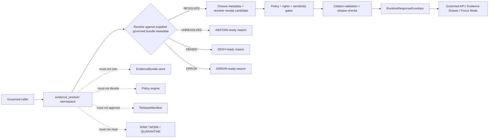

<!-- [KFM_META_BLOCK_V2]
doc_id: kfm://doc/NEEDS-VERIFICATION/packages-evidence-resolver-src-evidence-resolver-readme
title: Evidence Resolver Import Namespace README
type: readme
version: v1
status: draft
owners: OWNER_TBD
created: NEEDS VERIFICATION — target file existed before this repair but contained only placeholder text
updated: 2026-06-14
policy_label: public
related: [packages/evidence-resolver/README.md, packages/evidence-resolver/src/README.md, packages/evidence/README.md, packages/README.md, docs/architecture/evidence-identity.md, docs/architecture/cross-domain/shared-kernel.md, docs/architecture/governed-api/ENVELOPES.md, contracts/evidence/, schemas/contracts/v1/evidence/, policy/evidence/, policy/runtime/, data/proofs/evidence_bundle/, data/receipts/, release/]
tags: [kfm, packages, evidence-resolver, import-namespace, evidenceref, evidencebundle, closure-validation, cite-or-abstain, finite-outcomes, trust-membrane]
notes: ["README-like namespace guide for importable EvidenceRef -> EvidenceBundle resolver helpers.", "This namespace may expose deterministic resolver helpers and finite resolver outcomes only; it must not own schemas, contracts, policy, source registries, lifecycle data, proofs, receipts, release decisions, API routes, UI surfaces, model runtimes, or AI truth claims.", "Actual module files, exports, package metadata, tests, CI workflows, and runtime bindings remain NEEDS VERIFICATION until the live repo is recursively inspected."]
[/KFM_META_BLOCK_V2] -->

<a id="top"></a>

# `evidence_resolver` Import Namespace

Importable helper namespace for KFM EvidenceRef → EvidenceBundle closure validation. Code in this namespace should help governed callers check resolver candidates and return finite resolver outcomes without becoming the evidence store, proof authority, policy engine, release gate, public API, UI surface, or truth source.

<p>
  
  
  
  
  
  
  
</p>

> [!IMPORTANT]
> **Status:** PROPOSED import-namespace README  
> **Path:** `packages/evidence-resolver/src/evidence_resolver/README.md`  
> **Owning responsibility root:** `packages/`  
> **Package lane:** `packages/evidence-resolver/`  
> **Source envelope:** `packages/evidence-resolver/src/`  
> **Import namespace:** `evidence_resolver` — NEEDS VERIFICATION against package metadata  
> **Repo implementation depth:** UNKNOWN for module files, exports, tests, package manager, CI workflows, API bindings, receipts, proof packs, release manifests, branch protections, and runtime behavior.

## Quick links

- [Scope](#scope)
- [Namespace contract](#namespace-contract)
- [Expected modules](#expected-modules)
- [Allowed exports](#allowed-exports)
- [Disallowed exports](#disallowed-exports)
- [Import posture](#import-posture)
- [Resolver outcomes](#resolver-outcomes)
- [Trust-boundary flow](#trust-boundary-flow)
- [Development rules](#development-rules)
- [Validation checklist](#validation-checklist)
- [Rollback](#rollback)
- [Evidence boundary](#evidence-boundary)

---

## Scope

`packages/evidence-resolver/src/evidence_resolver/` is the proposed importable namespace for reusable resolver helper code.

It may contain pure, deterministic helpers for:

- parsing and validating `EvidenceRef` candidates supplied by governed callers;
- checking bundle lookup results supplied by proof/evidence systems;
- comparing bundle ids, source descriptor refs, spec hashes, content hashes, schema hashes, validation-report refs, and supersession metadata;
- checking claim scope against evidence scope, including claim id, field path, temporal scope, spatial scope, domain, and object id;
- preserving source-role distribution, rights posture, sensitivity posture, policy refs, release refs, rollback refs, and receipt refs;
- returning finite resolver outcomes such as `RESOLVED`, `UNRESOLVED`, `DENIED`, and `ERROR`;
- building synthetic no-network fixtures for positive and negative resolver paths.

This namespace must not decide truth, source authority, policy outcome, sensitivity posture, release state, review state, correction state, or publication state. It checks explicit resolver inputs and returns bounded outcomes for downstream gates.

[⬆ Back to top](#top)

---

## Namespace contract

The namespace is a helper boundary, not an authority boundary.

| Namespace concern | Expected behavior | Authority home |
| --- | --- | --- |
| EvidenceRef parsing | Validate syntax and preserve original refs. | `contracts/evidence/` and `schemas/contracts/v1/evidence/` |
| Bundle lookup checks | Check supplied bundle metadata for identity/scope/closure consistency. | Proof/evidence systems and evidence schemas |
| Resolver outcome | Return finite resolver state for downstream gates. | Governed runtime envelope and API assemblers |
| Source-role distribution | Preserve role mix and flags supplied by bundle metadata. | Source descriptors, evidence bundles, and policy systems |
| Rights/sensitivity posture | Carry posture and reason context supplied by callers. | `policy/evidence/`, `policy/runtime/`, and source registry homes |
| Release/rollback refs | Preserve refs supplied by release systems. | `release/` |
| Receipt-ready metadata | Carry input/output digest and validation refs for callers to persist. | `data/receipts/` and proof homes |
| Fixtures | Produce synthetic examples for tests only. | `tests/` and `fixtures/`, not production proof stores |

[⬆ Back to top](#top)

---

## Expected modules

> [!NOTE]
> The tree below is PROPOSED. Confirm actual language, module names, package manager, and tests before treating these as implementation facts.

```text
packages/evidence-resolver/src/evidence_resolver/
├── README.md                 # This file: namespace guide
├── __init__.py               # PROPOSED: export boundary if Python convention is confirmed
├── outcomes.py               # PROPOSED: resolver outcome constants and reason-code helpers
├── resolver.py               # PROPOSED: resolve_evidence_ref orchestration helper
├── refs.py                   # PROPOSED: EvidenceRef parsing adapters or imports from packages/evidence
├── closure.py                # PROPOSED: closure-state checks
├── scope.py                  # PROPOSED: claim/evidence scope checks
├── integrity.py              # PROPOSED: digest/spec-hash consistency checks
├── receipts.py               # PROPOSED: receipt-ready metadata carriers, not receipt store
├── fixtures.py               # PROPOSED: synthetic resolver fixtures
└── py.typed                  # PROPOSED: include only if typed Python package convention is confirmed
```

Keep implementation smaller than this until schemas, tests, and callers prove the need.

[⬆ Back to top](#top)

---

## Allowed exports

Exports from this namespace should be deterministic, testable, and safe to call from governed runtime code.

| Export family | Examples | Rule |
| --- | --- | --- |
| Resolver outcomes | `ResolverOutcome.RESOLVED`, `UNRESOLVED`, `DENIED`, `ERROR` | Closed resolver set unless ADR/schema update expands it. |
| Resolution orchestration | `resolve_evidence_ref` | Operates on explicit refs and supplied lookup metadata; no raw-store reads. |
| Closure checks | `check_bundle_closure`, `check_supersession_state` | Validate supplied metadata only. |
| Scope checks | `check_claim_scope`, `check_temporal_scope`, `check_spatial_scope` | Return reasoned mismatch states, not public prose. |
| Integrity checks | `check_spec_hash`, `check_content_hash`, `check_source_descriptor_ref` | Preserve algorithm prefixes and explicit values. |
| Receipt carriers | `make_resolver_trace`, `make_resolver_receipt_candidate` | Return receipt-ready metadata for callers to persist. |
| Fixture helpers | `resolved_fixture`, `unresolved_missing_bundle_fixture`, `denied_sensitive_fixture` | Synthetic/sanitized only. |

[⬆ Back to top](#top)

---

## Disallowed exports

Do not export functions, classes, or constants that make this namespace an authority surface.

| Disallowed export | Why |
| --- | --- |
| `create_evidence_bundle`, `write_proof`, `store_bundle` | Proof and evidence storage belong outside package source. |
| `approve_release`, `publish`, `promote`, `rollback_release` | Release authority belongs under `release/` and governed release workflows. |
| `evaluate_policy`, `decide_sensitivity`, `allow_public`, `deny_public` | Policy evaluation belongs to policy systems. |
| `fetch_source`, `read_raw`, `poll_connector`, `scan_work_queue` | Source activation and lifecycle access belong to connectors/pipelines/data roots. |
| `generate_claim`, `summarize_truth`, `make_answer` | Resolver helpers are not claim generators or truth sources. |
| `call_model`, `chat`, `complete`, `embed` | Model provider calls belong behind governed AI adapter placement. |
| `render_ui`, `evidence_drawer_component`, `public_route_handler` | UI/API surfaces live in app/UI roots. |
| `force_resolved`, `ignore_policy`, `bypass_release` | These names directly violate the trust membrane. |

[⬆ Back to top](#top)

---

## Import posture

Preferred imports, subject to package metadata verification:

```python
from evidence_resolver.outcomes import ResolverOutcome
from evidence_resolver.resolver import resolve_evidence_ref
from evidence_resolver.closure import check_bundle_closure
from evidence_resolver.integrity import check_spec_hash
```

Avoid wildcard imports and private/internal bypasses:

```python
# Avoid
from evidence_resolver import *
from evidence_resolver._unsafe import force_resolved
```

Callers should treat resolver output as a gate input. `RESOLVED` is only eligible for downstream policy, citation, schema, and release checks; it is not public truth by itself.

[⬆ Back to top](#top)

---

## Resolver outcomes

| Resolver outcome | Use when | Runtime mapping |
| --- | --- | --- |
| `RESOLVED` | EvidenceRef resolves to a bundle with sufficient local closure metadata for the next governed gate. | Candidate for `ANSWER` only after policy, citation, release, and schema checks pass. |
| `UNRESOLVED` | Ref is missing, stale, superseded, inconsistent, incomplete, out-of-scope, or not found. | `ABSTAIN` with `evidence/*` reason code. |
| `DENIED` | Resolver was supplied a policy/sensitivity/rights posture that blocks disclosure or use. | `DENY` with `policy/*` or `auth/*` reason code. |
| `ERROR` | Input is malformed, schema-invalid, unsupported, or resolver helper failed. | `ERROR` with `schema/*`, `error/*`, or `resolver/*` reason code. |

`RESOLVED` is not the same as published truth. It only means the resolver found locally sufficient closure support for the next gate.

[⬆ Back to top](#top)

---

## Trust-boundary flow



[⬆ Back to top](#top)

---

## Development rules

1. Keep the namespace no-network by default.
2. Prefer pure functions with explicit input objects.
3. Resolve only against governed lookup objects supplied by callers or configured test fixtures.
4. Preserve EvidenceRef, EvidenceBundle, SourceDescriptor, PolicyDecision, ReleaseManifest, RollbackCard, ValidationReport, and Receipt refs distinctly.
5. Preserve source role, rights, sensitivity, time scope, spatial scope, claim field path, and digest algorithm fields supplied by callers.
6. Do not read from RAW, WORK, QUARANTINE, unpublished candidates, source credentials, source systems, or model runtimes.
7. Do not write proofs, receipts, release manifests, catalog records, lifecycle data, or public API responses.
8. Do not evaluate policy; consume policy posture and return finite resolver outcomes.
9. Do not create schemas, contracts, policy rules, source registries, API routes, UI components, or public answers from this namespace.
10. Do not store chain-of-thought, raw provider payloads, secrets, private source records, or unrestricted sensitive context.
11. Return finite resolver outcomes instead of silent fallback refs.
12. Add deterministic tests for every export and every negative path.
13. Keep fixtures synthetic or public-safe and mark fixture-only data clearly.
14. Preserve rollback and correction metadata supplied by callers when resolver output can affect downstream publication candidates.

[⬆ Back to top](#top)

---

## Validation checklist

- [ ] Confirm this namespace exists in package metadata.
- [ ] Confirm the package import name is actually `evidence_resolver`.
- [ ] Confirm `__init__` exports are intentional and minimal.
- [ ] Confirm tests cover `RESOLVED`, `UNRESOLVED`, `DENIED`, and `ERROR`.
- [ ] Confirm tests cover malformed refs, missing bundles, stale hashes, superseded bundles, source-role mismatch, claim-scope mismatch, rights denial, and successful resolution.
- [ ] Confirm helpers do not import connectors, data stores, policy engines, release writers, model providers, API routers, UI components, or receipt/proof stores.
- [ ] Confirm helpers do not access RAW/WORK/QUARANTINE or unpublished candidate stores.
- [ ] Confirm public-facing API routes serialize resolver results through schema-valid `RuntimeResponseEnvelope` objects.
- [ ] Confirm package docs and tests identify this namespace as helper code only.

Suggested inspection commands:

```bash
find packages/evidence-resolver/src/evidence_resolver -maxdepth 3 -type f | sort
git grep -n "from evidence_resolver\|import evidence_resolver" -- . 2>/dev/null || true
git grep -n "EvidenceRef\|EvidenceBundle\|RESOLVED\|UNRESOLVED\|DENIED\|resolve_evidence" -- packages/evidence-resolver tests fixtures docs schemas contracts policy 2>/dev/null || true
```

[⬆ Back to top](#top)

---

## Rollback

Rollback is required if this namespace:

- becomes a parallel schema, contract, policy, evidence-store, proof-store, receipt-store, release, API, UI, source-registry, or lifecycle authority;
- permits public claims without EvidenceRef → EvidenceBundle resolution and downstream policy/citation/release gates;
- fabricates citations, evidence refs, bundle ids, source roles, policy decisions, release refs, proof state, or closure status;
- stores chain-of-thought, raw provider payloads, secrets, sensitive source data, or unrestricted private context;
- lets public clients call resolver internals directly instead of governed APIs;
- exports authority verbs such as `publish`, `approve`, `decide`, `force_resolved`, `ignore_policy`, or `bypass_release`.

Rollback target: revert the namespace-source PR, keep any generated audit notes as review evidence, and file the affected behavior in `docs/registers/DRIFT_REGISTER.md` or `docs/registers/VERIFICATION_BACKLOG.md` if the mounted repo uses those registers.

[⬆ Back to top](#top)

---

## Evidence boundary

| Source | Status | Supports | Limits |
| --- | --- | --- | --- |
| Current target file | CONFIRMED | `packages/evidence-resolver/src/evidence_resolver/README.md` existed and required replacement from placeholder content. | Did not prove namespace implementation maturity. |
| Parent source README | CONFIRMED repo doc | `packages/evidence-resolver/src/` is bounded to resolver helper source code. | Does not prove package metadata, imports, tests, or CI. |
| Parent package README | CONFIRMED repo doc | `packages/evidence-resolver/` is the EvidenceRef → EvidenceBundle closure-validation package lane. | Does not prove source files or runtime bindings. |
| `packages/evidence/README.md` | CONFIRMED sibling package doc | Broader evidence helper lane exists for refs, digests, carriers, and fixtures. | Does not prove resolver implementation. |
| `docs/architecture/evidence-identity.md` | CONFIRMED repo doc | EvidenceRef/EvidenceBundle identity posture, deterministic hashing, resolver trust membrane, cite-or-abstain, and proposed homes. | Some paths and implementation claims remain PROPOSED/NEEDS VERIFICATION in that doc. |
| `docs/architecture/governed-api/ENVELOPES.md` | CONFIRMED repo doc | Finite runtime outcomes and envelope composition expected after resolver output. | Field-level schemas and policy live elsewhere. |
| Current file-generation pass | CONFIRMED request | User-requested target path and README repair/replacement. | Does not inspect package metadata, tests, CI logs, dashboards, deployment posture, runtime behavior, or branch protection. |

[⬆ Back to top](#top)
