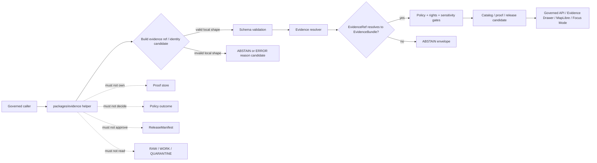

<!-- [KFM_META_BLOCK_V2]
doc_id: kfm://doc/NEEDS-VERIFICATION/packages-evidence-readme
title: Evidence Package README
type: readme
version: v1
status: draft
owners: OWNER_TBD
created: NEEDS VERIFICATION — target file existed before this repair but contained only placeholder text
updated: 2026-06-14
policy_label: public
related: [packages/README.md, packages/evidence-resolver/README.md, docs/architecture/evidence-identity.md, docs/architecture/cross-domain/shared-kernel.md, docs/architecture/trust-membrane.md, docs/architecture/evidence-drawer.md, contracts/evidence/, schemas/contracts/v1/evidence/, policy/evidence/, data/proofs/evidence_bundle/, data/receipts/, release/]
tags: [kfm, packages, evidence, evidenceref, evidencebundle, identity, spec-hash, cite-or-abstain, trust-membrane, shared-library]
notes: ["README-like package entrypoint for shared EvidenceRef/EvidenceBundle helper code.", "This package may contain reusable evidence value-object, reference, identity, digest, and fixture helper code; it must not become the evidence store, proof store, resolver authority, schema home, contract home, policy home, lifecycle-data home, release authority, API route, UI surface, or AI truth source.", "The sibling package packages/evidence-resolver/ is the more specific resolver lane for EvidenceRef -> EvidenceBundle closure validation; do not duplicate resolver authority here without ADR-backed consolidation."]
[/KFM_META_BLOCK_V2] -->

<a id="top"></a>

# Evidence Package

Shared helper-code package for KFM evidence identity and reference primitives: `EvidenceRef`, `EvidenceBundle` references, deterministic digest helpers, public-safe citation carriers, and fixture builders that support cite-or-abstain behavior without becoming the evidence store or truth authority.

<p>
  
  
  
  
  
  
</p>

> [!IMPORTANT]
> **Status:** PROPOSED package README  
> **Path:** `packages/evidence/README.md`  
> **Owning responsibility root:** `packages/` — shared reusable implementation libraries  
> **Resolver boundary:** `packages/evidence-resolver/` owns the specific EvidenceRef → EvidenceBundle closure-validation lane unless an ADR consolidates it  
> **Schema authority:** `schemas/contracts/v1/evidence/`, not this package  
> **Contract authority:** `contracts/evidence/`, not this package  
> **Proof authority:** `data/proofs/evidence_bundle/` or repo-confirmed proof home, not this package  
> **Repo implementation depth:** UNKNOWN for package metadata, import style, source files, tests, CI workflows, API bindings, emitted receipts, proof packs, release manifests, and runtime behavior.

## Quick links

- [Scope](#scope)
- [Repo fit](#repo-fit)
- [Relationship to evidence-resolver](#relationship-to-evidence-resolver)
- [Accepted inputs](#accepted-inputs)
- [Exclusions](#exclusions)
- [Evidence helper responsibilities](#evidence-helper-responsibilities)
- [Cite-or-abstain rules](#cite-or-abstain-rules)
- [Trust-boundary flow](#trust-boundary-flow)
- [Expected package layout](#expected-package-layout)
- [Development rules](#development-rules)
- [Validation checklist](#validation-checklist)
- [Rollback](#rollback)
- [Evidence boundary](#evidence-boundary)

---

## Scope

`packages/evidence/` is a shared implementation package lane for reusable evidence helper code.

This package may contain deterministic utilities for:

- `EvidenceRef` value-object helpers and URI validation;
- `EvidenceBundle` reference carriers and bundle-id syntax helpers;
- canonicalization and digest helpers when aligned with KFM schema/contract decisions;
- source-role-aware identity helper functions used by domain packages;
- public-safe citation carrier helpers that preserve evidence refs without inlining sensitive evidence;
- integrity helpers for `spec_hash`, `content_hash`, `schema_hash`, `policy_bundle_hash`, and related digest-bearing fields;
- fixture builders for synthetic, sanitized evidence examples;
- adapter glue for packages that need to carry evidence refs into envelope, catalog, proof, or API candidates.

This package must not decide whether evidence is admissible, sufficient, complete, public-safe, policy-safe, release-ready, or true. It must not fetch source data, resolve bundles as runtime authority, write proof packs, approve publication, or expose public API routes.

```text
RAW -> WORK / QUARANTINE -> PROCESSED -> CATALOG / TRIPLET -> PUBLISHED
```

Evidence helper code may make candidates easier to assemble and validate. It does not own lifecycle state, proof state, review state, or release state.

[⬆ Back to top](#top)

---

## Repo fit

```text
packages/evidence/
```

This path is appropriate only for shared helper code because `packages/` owns reusable implementation libraries.

| Relationship | Expected home | Boundary rule |
| --- | --- | --- |
| Shared evidence helper code | `packages/evidence/` | Reusable reference, identity, digest, and fixture helpers only. |
| Evidence resolver package | `packages/evidence-resolver/` | Specific EvidenceRef → EvidenceBundle closure-validation lane. |
| Evidence architecture docs | `docs/architecture/evidence-identity.md` | Explains evidence identity, deterministic hashing, resolver posture, and cite-or-abstain. |
| Cross-domain shared kernel docs | `docs/architecture/cross-domain/shared-kernel.md` | Defines EvidenceRef, EvidenceBundle, PolicyDecision, DecisionEnvelope, AIReceipt, ReleaseManifest, RollbackCard, and related shared objects. |
| Evidence contracts | `contracts/evidence/` | Defines meaning; package code references, not redefines. |
| Evidence schemas | `schemas/contracts/v1/evidence/` | Defines machine-checkable shape. |
| Evidence policy | `policy/evidence/`, `policy/runtime/`, or repo-confirmed policy homes | Owns admissibility, sensitivity, rights, and fail-closed behavior. |
| Evidence/proof instances | `data/proofs/evidence_bundle/`, `data/proofs/`, or repo-confirmed proof homes | Stores resolved proof/evidence artifacts. |
| Receipts | `data/receipts/` | Stores process memory, validation reports, AI receipts, run receipts, and promotion receipts. |
| Release decisions | `release/` | Owns promotion, publication, correction, supersession, and rollback. |
| API and UI runtime | `apps/`, `ui/`, `web/`, or repo-confirmed equivalents | May call evidence helpers; must not be replaced by package internals. |
| Tests and fixtures | `tests/packages/evidence/`, `fixtures/packages/evidence/`, or repo-confirmed equivalents | Proves helper behavior with deterministic no-network fixtures. |

> [!WARNING]
> Do not use `packages/evidence/` as a convenient place for evidence material. Trust-bearing evidence and proofs must remain in lifecycle/proof homes, with policy and release state auditable outside package source.

[⬆ Back to top](#top)

---

## Relationship to evidence-resolver

`packages/evidence/` and `packages/evidence-resolver/` should not collapse into the same responsibility by accident.

| Package | Responsibility | Must not become |
| --- | --- | --- |
| `packages/evidence/` | Small shared helper layer for evidence refs, IDs, digest helpers, carriers, and fixtures. | Resolver authority, proof store, policy engine, lifecycle data home, or release gate. |
| `packages/evidence-resolver/` | Specific resolver lane for EvidenceRef → EvidenceBundle closure validation. | General dumping ground for every evidence helper, schema authority, or proof storage. |

A future consolidation may be valid, but it is ADR-class because it affects package responsibilities, import paths, tests, docs, schemas, and runtime trust boundaries.

[⬆ Back to top](#top)

---

## Accepted inputs

Package helpers should accept explicit values from governed callers. They should not fetch missing facts from source systems, raw stores, UI state, hidden globals, operator memory, or generated language.

| Input family | Accepted examples | Required handling |
| --- | --- | --- |
| Evidence references | `kfm://evidence/...`, `kfm://evidence-bundle/...`, local candidate IDs, source offsets, field paths | Validate syntax and preserve values; do not silently retarget refs. |
| Source context | `source_id`, source descriptor ref, source role, rights posture, sensitivity tier, attribution obligation | Preserve source-role and rights context; do not infer stronger authority. |
| Identity context | `spec_hash`, `content_hash`, `schema_hash`, `policy_bundle_hash`, canonicalization method | Preserve algorithm prefix and digest; do not hash non-canonical developer formatting as authority. |
| Claim context | claim id, claim field path, domain, temporal scope, spatial scope, source role distribution | Keep claim support bounded; do not expand scope silently. |
| Bundle reference context | bundle id, bundle ref, closure status supplied by caller, validation report ref | Carry refs; do not declare closure unless resolver/proof system supplied it. |
| Policy context | policy decision ref, sensitivity posture, audience class, obligations, denial/abstain reason codes | Preserve supplied policy posture; do not evaluate policy. |
| Release context | release ref, release state, rollback ref, correction/supersession ref | Carry release refs; do not approve release. |
| Fixture context | synthetic records, sanitized refs, stable example hashes | Mark fixture-only data clearly and keep it out of proof/release homes. |

[⬆ Back to top](#top)

---

## Exclusions

| Do not put here | Correct home or owner | Reason |
| --- | --- | --- |
| RAW, WORK, QUARANTINE, PROCESSED, CATALOG, TRIPLET, or PUBLISHED evidence data | `data/<phase>/` | Lifecycle state must remain phase-visible. |
| Resolved EvidenceBundle instances or proof packs | `data/proofs/evidence_bundle/`, `data/proofs/`, or repo-confirmed proof homes | Evidence closure must remain separately auditable. |
| Source descriptors and rights registries | `data/registry/` or repo-confirmed source registry homes | Source authority, rights, and cadence are governance data. |
| Evidence semantic contracts | `contracts/evidence/` | Contracts own meaning. |
| Evidence JSON Schemas | `schemas/contracts/v1/evidence/` | Schemas own machine shape. |
| Evidence, rights, sensitivity, or release policy rules | `policy/evidence/`, `policy/rights/`, `policy/sensitivity/`, `policy/runtime/` | Policy owns allow/deny/restrict/hold/abstain decisions. |
| Runtime resolver authority | `packages/evidence-resolver/` or repo-confirmed resolver package | Keep reference helpers distinct from closure validation. |
| Receipts, validation reports, AI receipts, run receipts, promotion receipts | `data/receipts/` and proof homes | Process memory must remain separately auditable. |
| Release manifests, rollback cards, correction notices | `release/` | Publication is a governed state transition. |
| API route handlers or public serializers | `apps/` or repo-confirmed API app | Public clients must use governed APIs, not package internals. |
| UI components, MapLibre styles, Evidence Drawer views | `ui/`, `web/`, `apps/`, or repo-confirmed UI roots | Rendering is downstream from governed evidence and envelopes. |
| AI-generated citations, generated claims, or source summaries as proof | governed AI runtime + receipts + evidence validation | AI output is interpretive and evidence-subordinate. |
| Hidden chain-of-thought, secrets, credentials, private raw source content | Nowhere in package source or fixtures | Auditability must not leak private reasoning or sensitive data. |

[⬆ Back to top](#top)

---

## Evidence helper responsibilities

| Responsibility | Expected behavior |
| --- | --- |
| Preserve evidence identity | Keep ids, refs, hashes, source roles, temporal scope, and field paths stable and explicit. |
| Preserve source-role context | Never collapse official, administrative, observational, interpretive, generated, regulatory, or restricted support into generic evidence. |
| Preserve rights/sensitivity posture | Carry rights and sensitivity fields supplied by source/policy systems; fail closed if required context is absent. |
| Support deterministic digests | Use canonicalization rules supplied by schemas/standards; never rely on pretty-printed JSON formatting. |
| Prepare envelope/catalog/proof candidates | Return candidate fragments for owning systems to validate and persist. |
| Build safe fixtures | Use synthetic or sanitized examples; no sensitive records, secrets, private raw data, or living-person data. |
| Fail visibly | Return typed invalid states or helper errors for malformed refs, missing hash algorithms, ambiguous source roles, or unsafe fixture content. |

[⬆ Back to top](#top)

---

## Cite-or-abstain rules

Evidence helper code should reinforce KFM's cite-or-abstain posture.

| Case | Helper posture |
| --- | --- |
| Claim has no evidence refs | Return invalid candidate or abstain-ready reason context. |
| Evidence ref is malformed | Return invalid candidate or `schema/*` / `evidence/*` reason context. |
| Evidence ref cannot be resolved | Do not guess; defer to resolver and finite envelope path. |
| Evidence bundle has mixed source roles | Preserve role distribution and require disclosure by downstream systems. |
| Evidence support is stale, rights-unknown, sensitive, or restricted | Preserve reason context and fail closed through policy/envelope paths. |
| Public surface wants proof text | Return refs and citation carriers only; proof/evidence details are resolved through governed APIs. |

[⬆ Back to top](#top)

---

## Trust-boundary flow



[⬆ Back to top](#top)

---

## Expected package layout

> [!NOTE]
> The tree below is PROPOSED. Confirm package metadata, language conventions, import namespace, test layout, and CI before committing code beyond README files.

```text
packages/evidence/
├── README.md                       # This file: package boundary and trust rules
├── pyproject.toml / package.json    # NEEDS VERIFICATION
├── src/                             # NEEDS VERIFICATION
│   └── evidence/                    # PROPOSED namespace; confirm against repo convention
│       ├── README.md                # PROPOSED namespace guide
│       ├── __init__.py              # PROPOSED export boundary if Python convention is confirmed
│       ├── refs.py                  # PROPOSED EvidenceRef helpers
│       ├── bundles.py               # PROPOSED EvidenceBundle ref carriers, not bundle store
│       ├── identity.py              # PROPOSED deterministic identity/digest helpers
│       ├── source_roles.py          # PROPOSED source-role preservation helpers
│       ├── citations.py             # PROPOSED citation carrier helpers
│       ├── fixtures.py              # PROPOSED synthetic/sanitized fixture builders
│       └── py.typed                 # PROPOSED if typed Python convention is confirmed
└── CHANGELOG.md                     # OPTIONAL / NEEDS VERIFICATION
```

Potential imports, subject to package verification:

```python
from evidence.refs import EvidenceRefValue
from evidence.identity import canonical_spec_hash
from evidence.citations import make_citation_carrier
```

[⬆ Back to top](#top)

---

## Development rules

1. Treat this package as a helper layer, not an authority layer.
2. Prefer pure functions with explicit input objects.
3. Keep EvidenceRef, EvidenceBundle, SourceDescriptor, PolicyDecision, ReleaseManifest, and Receipt references distinct.
4. Preserve source role, rights, sensitivity, time scope, field path, and digest algorithm fields supplied by callers.
5. Do not read directly from RAW, WORK, QUARANTINE, unpublished candidates, source credentials, source systems, or model runtimes.
6. Do not resolve evidence closure unless the function is explicitly placed in the resolver package or an ADR-backed consolidation changes the boundary.
7. Do not create schemas, semantic contracts, policy rules, source registries, receipts, proofs, release manifests, API routes, UI components, or public answers from this package.
8. Do not store chain-of-thought, raw provider payloads, secrets, private source records, or unrestricted sensitive context.
9. Return finite, typed invalid states instead of silent fallback refs.
10. Add deterministic tests for every behavior-changing helper.
11. Keep fixtures synthetic or public-safe and mark fixture-only data clearly.
12. Preserve rollback and correction metadata supplied by callers when evidence helper output can affect downstream publication candidates.

[⬆ Back to top](#top)

---

## Validation checklist

- [ ] Confirm `packages/evidence/` package metadata and language/runtime convention.
- [ ] Confirm whether this package is intended to coexist with `packages/evidence-resolver/` or be consolidated by ADR.
- [ ] Confirm import namespace and whether it conflicts with Python/JS ecosystem package names.
- [ ] Confirm owners and CODEOWNERS path coverage.
- [ ] Confirm schema home for EvidenceRef and EvidenceBundle.
- [ ] Confirm contract home for EvidenceRef and EvidenceBundle.
- [ ] Confirm policy home for evidence admissibility and sensitivity behavior.
- [ ] Confirm tests for valid and invalid EvidenceRef syntax, bundle refs, digest formats, source-role preservation, and fixture safety.
- [ ] Confirm package helpers do not access RAW/WORK/QUARANTINE or unpublished candidate stores.
- [ ] Confirm package helpers do not write proofs, receipts, release manifests, or catalog records.
- [ ] Confirm public API routes use governed resolver/envelope paths after helper construction.

Suggested inspection commands:

```bash
find packages/evidence -maxdepth 5 -type f | sort
find packages/evidence-resolver -maxdepth 5 -type f | sort
git grep -n "EvidenceRef\|EvidenceBundle\|packages/evidence\|evidence-resolver" -- packages docs contracts schemas policy tests fixtures apps 2>/dev/null || true
```

[⬆ Back to top](#top)

---

## Rollback

Rollback is required if this package:

- becomes a parallel schema, contract, policy, evidence-store, proof-store, receipt-store, release, API, UI, source-registry, resolver, or lifecycle authority;
- duplicates or bypasses `packages/evidence-resolver/` responsibility without ADR approval;
- permits public claims without EvidenceRef → EvidenceBundle resolution;
- fabricates citations, evidence refs, bundle ids, source roles, policy decisions, release refs, or proof state;
- stores chain-of-thought, raw provider payloads, secrets, sensitive source data, or unrestricted private context;
- lets public clients call package internals directly instead of governed APIs.

Rollback target: revert the package README or package-source PR, preserve audit notes, and file any authority drift in `docs/registers/DRIFT_REGISTER.md` or the repo-confirmed drift register.

[⬆ Back to top](#top)

---

## Evidence boundary

| Source | Status | Supports | Limits |
| --- | --- | --- | --- |
| Current target file | CONFIRMED | `packages/evidence/README.md` existed and required replacement from placeholder content. | Did not prove package implementation maturity. |
| `packages/evidence-resolver/README.md` | CONFIRMED sibling package stub | Resolver lane is described as EvidenceRef → EvidenceBundle closure validation. | Stub is minimal and does not prove runtime implementation. |
| `docs/architecture/evidence-identity.md` | CONFIRMED repo doc | EvidenceRef/EvidenceBundle identity posture, deterministic hashing, resolver trust membrane, cite-or-abstain, and proposed homes. | Some paths and implementation claims remain PROPOSED/NEEDS VERIFICATION in that doc. |
| `docs/architecture/cross-domain/shared-kernel.md` | CONFIRMED repo doc | Shared object family posture for SourceDescriptor, EvidenceRef, EvidenceBundle, PolicyDecision, DecisionEnvelope, AIReceipt, ReleaseManifest, RollbackCard, and MapContextEnvelope. | Does not prove this package is implemented. |
| Current file-generation pass | CONFIRMED request | User-requested target path and README repair/replacement. | Does not inspect package metadata, tests, CI logs, dashboards, deployment posture, runtime behavior, or branch protection. |

[⬆ Back to top](#top)
