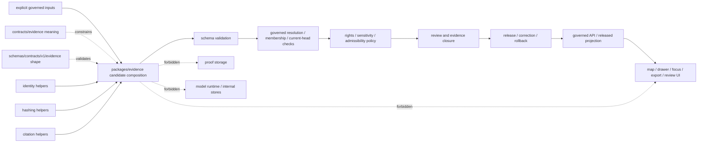

<!-- [KFM_META_BLOCK_V2]
doc_id: kfm://doc/packages-evidence-readme
title: packages/evidence/ — Evidence Composition Package Decision Boundary
type: readme; package-readme; shared-library-boundary; evidence-composition; package-disposition-gate
version: v0.3
status: draft; repository-grounded; canonical-package-lane; README-only; purpose-held; overlap-visible; evidence-shape-validation-wired; resolver-held; no-package-manifest; no-source-tree; no-dedicated-package-tests; non-authoritative
owners: "NEEDS VERIFICATION — CODEOWNERS routes /packages/ to @bartytime4life; no accepted evidence-package owner, package-boundary decision owner, compatibility owner, or independent reviewer assignment was verified"
created: NEEDS VERIFICATION — target existed before v0.2
updated: 2026-07-23
supersedes: v0.2 documentation at the same path; no package code, manifest, export, contract, schema, validator, policy, fixture, test, workflow, evidence record, proof, receipt, release object, deployment, runtime behavior, or public behavior is superseded
prepared_under_prompt: KFM Markdown Engineering, Modernization & GitHub Documentation Implementation Agent v5.0.0
policy_label: "public-doc; packages; evidence; shared-library; purpose-held; evidence-composition; non-deployable; no-truth-authority; no-contract-authority; no-schema-authority; no-policy-authority; no-proof-authority; no-lifecycle-authority; no-release-authority; cite-or-abstain; fail-closed; no-network-by-default; correction-aware; rollback-aware"
current_path: packages/evidence/README.md
owning_root: packages/
responsibility: preserve a reviewable decision boundary for any future reusable evidence-specific composition or profile-adapter code without duplicating identity, hashing, citation, resolver, validator, contract, schema, policy, proof-storage, lifecycle, release, or public-interface authority
truth_posture: >
  CONFIRMED target README and prior blob; Directory Rules v1.4 package placement and README
  contract; packages root v0.3 shared-library boundary and explicit evidence-package overlap;
  CODEOWNERS /packages route; bounded search returning packages/evidence/README.md as the only
  package-local result; exact absence at checked paths of package.json, pyproject.toml,
  src/README.md, tests/packages/evidence/README.md, fixtures/packages/evidence/README.md, and
  .github/workflows/evidence.yml; current EvidenceRef and EvidenceBundle contracts; fielded,
  closed, PROPOSED schemas; dedicated EvidenceRef and EvidenceBundle validator wrappers;
  aggregate-runner wiring for both validators; focused EvidenceRef CLI polarity tests; generic
  evidence-family schema fixture harness; documentation-only evidence policy boundary; and the
  evidence-resolver 0.0.0 scaffold, placeholder core, and read-only readiness/hold workflow /
  PROPOSED narrow evidence-specific composition package, explicit profile adapters, generated
  schema carriers, deterministic candidate builders, package tests, verified consumers, and
  compatibility interfaces only after an accepted package-disposition decision / CONFLICTED
  broad evidence-helper topic versus identity, hashing, citation, and evidence-resolver sibling
  boundaries; schema-valid shape versus EvidenceBundle closure, policy admissibility, review,
  release, and publication; free-form claim_scope versus stronger architecture expectations;
  SpecHash value shape versus canonicalization-profile identity; and package-specific versus
  contract-schema fixture/test ownership / UNKNOWN accepted purpose, implementation language,
  package name, source layout, exports, dependencies, consumers, distribution, package-specific
  CI, registry publication, runtime integration, production use, and public effect / NEEDS
  VERIFICATION accepted owners, keep/consolidate/remove decision, cross-package dependency
  direction, evidence profile acceptance, issue vocabulary, generated-code policy, consumer
  inventory, correction invalidation, migration receipts, and rollback drill
evidence_snapshot:
  repository: bartytime4life/Kansas-Frontier-Matrix
  repository_id: "1059091169"
  visibility: public
  base_ref: main
  base_commit: 7d5b7e80a493fe817f2c5378bb77ab5f247e8d87
  prior_blob: 74273775436287f35089c41e1e0c9f7c33f00645
  packages_root_blob: 154e1c9a8b841397bceb52e6b4933b241906ab9a
  directory_rules_blob: 2affb080e6f0043867c64c7f06c1ca52030fbd55
  codeowners_blob: dd2a84aa514d8ecd9208bc347f90f9a2ed37dd61
  evidence_ref_contract_blob: afd3a964435445edbb694b5edf16e2b6ddd49a92
  evidence_bundle_contract_blob: 731c348832add23cddd14e796aa56ce2b9268259
  evidence_ref_schema_blob: 42f499df613a9d68e5ca6fc5ec75ff8058c155b9
  evidence_bundle_schema_blob: cf5256831b63dca46a5f68b168441adcf68b8751
  evidence_ref_validator_blob: 42bd56d5cb9f7a8a4e305b2072ee4cfa28c4f4b2
  evidence_bundle_validator_blob: c1760c5e92eae6390f5adcde4593e8e9bab26535
  aggregate_runner_blob: f734a3e0944346bf2635fb9188702f13b45c8a64
  evidence_ref_validator_test_blob: 78ac2bb3d0279c80838ba6c12bb21ea7fbc852a0
  generic_schema_harness_blob: b04342cc034d7f1cc554e155fdd02d6e972976e6
  policy_evidence_blob: a940ded7c4ae299dd5e6a70764c1e7dd7292b9e7
  evidence_resolver_blob: 9c616c83091977709a50c5cf02d8fbe37bfd4329
  evidence_resolver_core_blob: eb7d965362bfddc8a6c77d527307f6ae1d499f46
  evidence_resolver_workflow_blob: cfa1555433d74a135462aba84ee1e052ae7f3ac9
  bounded_package_search: "packages/evidence returned packages/evidence/README.md and no additional package-local result"
  checked_absent_paths:
    - packages/evidence/package.json
    - packages/evidence/pyproject.toml
    - packages/evidence/src/README.md
    - tests/packages/evidence/README.md
    - fixtures/packages/evidence/README.md
    - tests/schemas/test_evidence_bundle_validator.py
    - .github/workflows/evidence.yml
related:
  - ../README.md
  - ../identity/README.md
  - ../hashing/README.md
  - ../citation/README.md
  - ../evidence-resolver/README.md
  - ../../contracts/evidence/README.md
  - ../../contracts/evidence/evidence_ref.md
  - ../../contracts/evidence/evidence_bundle.md
  - ../../schemas/contracts/v1/evidence/evidence_ref.schema.json
  - ../../schemas/contracts/v1/evidence/evidence_bundle.schema.json
  - ../../tools/validators/validate_evidence_ref.py
  - ../../tools/validators/validate_evidence_bundle.py
  - ../../tools/validators/_common/run_all.py
  - ../../tests/schemas/test_evidence_ref_validator.py
  - ../../tests/schemas/test_common_contracts.py
  - ../../policy/evidence/README.md
  - ../../data/proofs/README.md
  - ../../data/receipts/README.md
  - ../../release/README.md
  - ../../docs/doctrine/directory-rules.md
  - ../../.github/CODEOWNERS
  - ../../.github/workflows/evidence-resolver.yml
tags: [kfm, packages, evidence, package-boundary, evidence-composition, purpose-decision, EvidenceRef, EvidenceBundle, identity, hashing, citation, evidence-resolver, schema-validation, cite-or-abstain, fail-closed, no-network, correction, rollback]
notes:
  - "v0.3 is a same-path, documentation-only modernization grounded in current repository evidence."
  - "The first twelve H2 sections follow the Directory Rules README contract used by the current packages root."
  - "The package remains README-only at checked and indexed paths; this document does not create or imply implementation."
  - "Both evidence object validators now exist and are aggregate-wired; focused CLI polarity coverage exists for EvidenceRef only at the checked dedicated path."
  - "The evidence-resolver workflow performs bounded static readiness checks and emits explicit holds; it does not resolve evidence."
  - "No generated provenance receipt is added because the authorized change is limited to this README."
[/KFM_META_BLOCK_V2] -->

<a id="top"></a>
<a id="packages-evidence"></a>

# `packages/evidence/` — Evidence Composition Package Decision Boundary

> **One-line purpose.** Keep a governed decision boundary around any future reusable evidence-specific composition code—without allowing a broad “evidence helpers” topic to duplicate identity, hashing, citation, resolution, validation, policy, proof storage, lifecycle, release, or public trust authority.

<p>
  <a href="#status"></a>
  <a href="#authority-level"></a>
  <a href="#status"></a>
  <a href="#package-purpose-and-disposition"></a>
  <a href="#validation-layers"></a>
  <a href="#resolution-policy-and-release-boundary"></a>
  <a href="#trust-flow"></a>
</p>

> [!IMPORTANT]
> **`packages/evidence/` is currently a documented decision boundary, not an implemented package.** Current indexed and exact-path evidence confirms this README and does not confirm a package manifest, source tree, exports, package-local tests, package fixtures, dedicated package workflow, consumers, or distribution artifact.

> [!CAUTION]
> **Shape validation has improved, but evidence closure has not been established.** The repository now has dedicated EvidenceRef and EvidenceBundle schema validators, aggregate wiring, and focused EvidenceRef CLI tests. Those checks prove bounded JSON Schema behavior only; they do not resolve references, establish EvidenceBundle membership or claim support, decide admissibility, approve release, or authorize a public answer.

> [!WARNING]
> **Do not implement by topic name.** Identity, hashing, citation, and EvidenceRef-to-EvidenceBundle resolution already have sibling package boundaries. This lane may receive code only after a stewarded decision identifies one non-overlapping reusable responsibility and records dependency, compatibility, test, correction, and rollback obligations.

**Quick navigation**

| Required package contract | Current evidence | Design and change control |
|---|---|---|
| [Purpose](#purpose) · [Authority](#authority-level) · [Status](#status) · [Belongs](#what-belongs-here) · [Does not belong](#what-does-not-belong-here) | [Inputs](#inputs) · [Outputs](#outputs) · [Validation](#validation) · [Review](#review-burden) · [Related](#related-folders) · [ADRs](#adrs) · [Last reviewed](#last-reviewed) | [Decision](#package-purpose-and-disposition) · [Context](#bounded-context-and-ubiquitous-language) · [Overlap](#sibling-package-overlap) · [Profiles](#evidence-profiles) · [Flow](#trust-flow) · [Admission](#package-admission-and-maturity) · [Security](#security-and-data-minimization) · [Rollback](#compatibility-correction-and-rollback) · [Open work](#open-verification-register) |

---

<a id="purpose-and-audience"></a>

## Purpose

`packages/evidence/` exists today to keep a possible shared package from becoming an unbounded evidence dumping ground.

Its immediate responsibilities are documentation and change control:

1. record what the repository currently proves;
2. preserve the distinction between evidence pointers, evidence closure, admissibility, review, release, and publication;
3. expose overlap with identity, hashing, citation, and evidence-resolver packages;
4. require an explicit keep, narrow, consolidate, or retire decision before implementation;
5. define the smallest acceptable responsibility if the package is retained;
6. prevent hidden network, persistence, policy, proof-storage, or release behavior;
7. make compatibility, correction propagation, and rollback visible before consumer adoption.

A future narrow implementation may support evidence-specific composition of values already governed elsewhere, such as preparing schema-profile-bound EvidenceRef or EvidenceBundle **candidates** from explicit inputs. It must not calculate general identity, own hashing algorithms, validate citations authoritatively, resolve bundle membership, store proof, decide policy, approve release, or publish claims.

```text
packages/evidence/           = possible evidence-specific composition helpers
packages/identity/           = identity grammar and stable-id helpers
packages/hashing/            = canonicalization and digest helpers
packages/citation/           = citation/reference helpers
packages/evidence-resolver/  = EvidenceRef-to-EvidenceBundle resolution candidates
contracts/evidence/          = evidence object meaning
schemas/contracts/v1/evidence/ = evidence object machine shape
policy/evidence/             = evidence admissibility posture

data/proofs/                 = materialized proof support
release/                     = release, correction, withdrawal, rollback authority
```

This README does not select a language, admit dependencies, create a package, resolve evidence, validate claim support, activate policy, approve a release, or establish publication.

[Back to top](#top)

---

<a id="placement-and-authority"></a>

## Authority level

**Canonical shared-implementation sublane if retained; currently a non-authoritative package-disposition boundary.**

| Question | Answer | Evidence posture |
|---|---|---:|
| Why `packages/`? | The root owns reusable, non-deployable implementation libraries shared across verified consumers. | **CONFIRMED** placement and parent-root contract |
| Why an `evidence/` package? | Only if evidence-specific composition is reusable and not already owned by sibling packages. | **NEEDS DECISION** |
| Does this package define EvidenceRef or EvidenceBundle meaning? | No. Meaning remains under `contracts/evidence/`. | **CONFIRMED** authority split |
| Does it define canonical machine shape? | No. Shape remains under `schemas/contracts/v1/evidence/`. | **CONFIRMED** authority split |
| Does it resolve references or close bundles? | No. Resolution belongs to the resolver boundary and governed registry/proof systems. | **CONFIRMED** separation |
| Does schema-valid shape prove evidence closure? | No. Shape, referential integrity, claim support, admissibility, review, and release are separate gates. | **CONFIRMED** trust posture |
| May it decide rights, sensitivity, allow, deny, restrict, or abstain? | No. Policy and steward review own admissibility. | **CONFIRMED** policy separation |
| May it store EvidenceBundles or proof packs? | No. Materialized proof support belongs under governed data/proof roots. | **CONFIRMED** placement rule |
| May it approve correction, withdrawal, rollback, or publication? | No. Those remain release and governance decisions. | **CONFIRMED** release separation |
| Does importing the package create evidence authority? | No. Packages implement bounded helpers; imports do not move authority. | **CONFIRMED** parent package law |
| Does package distribution publish KFM knowledge? | No. Software distribution is not lifecycle promotion or KFM publication. | **CONFIRMED** parent package law |

### Anti-collapse rule

```text
EvidenceRef                  != EvidenceBundle closure
schema-valid object          != resolved evidence
resolved evidence candidate  != admissible evidence
admissible evidence          != reviewed evidence
reviewed evidence            != released evidence
released evidence            != unrestricted public exposure
package constructor          != proof creation
package import               != trust membrane
passing test                 != claim truth
```

[Back to top](#top)

---

<a id="current-repository-state"></a>
<a id="current-package-surface"></a>

## Status

### Repository snapshot

| Field | Current value |
|---|---|
| Repository | `bartytime4life/Kansas-Frontier-Matrix` |
| Visibility | Public |
| Base ref | `main` |
| Base commit | `7d5b7e80a493fe817f2c5378bb77ab5f247e8d87` |
| Prior README blob | `74273775436287f35089c41e1e0c9f7c33f00645` |
| README maturity | Repository-grounded draft |
| Package implementation | **README only at checked and indexed package paths** |
| Accepted package purpose | **NOT ESTABLISHED** |
| Package language or manifest | **NOT ESTABLISHED** |
| Package-local tests and fixtures | **NOT ESTABLISHED** |
| Dedicated package workflow | **NOT ESTABLISHED** |
| Verified consumers | **NOT ESTABLISHED** |
| Distribution or publication | **UNKNOWN / NOT ESTABLISHED** |

### Confirmed package-local surface

```text
packages/evidence/
└── README.md
```

Exact checks did not find:

```text
packages/evidence/package.json
packages/evidence/pyproject.toml
packages/evidence/src/README.md
tests/packages/evidence/README.md
fixtures/packages/evidence/README.md
.github/workflows/evidence.yml
```

These are bounded findings, not a universal proof that no related implementation exists anywhere in any ref, generated output, local checkout, or unindexed path.

### Current adjacent evidence surfaces

| Surface | Current evidence | Safe conclusion |
|---|---|---|
| EvidenceRef contract | Expanded draft contract with pointer/closure separation. | Meaning is documented; status remains `PROPOSED`. |
| EvidenceRef schema | Closed object requiring `ref` and `kind`; optional `bundle_ref`. | Current machine shape is fielded. |
| EvidenceRef validator | Wrapper delegates to the shared JSON Schema runner. | Executable shape validation exists. |
| EvidenceRef focused tests | Accepts a valid fixture and rejects missing `ref`. | Bounded CLI polarity is tested. |
| EvidenceBundle contract | Draft claim-scope closure contract. | Closure meaning is documented; status remains `PROPOSED`. |
| EvidenceBundle schema | Closed object with ten required fields and nested refs. | Current machine shape is fielded. |
| EvidenceBundle validator | Wrapper delegates to the shared JSON Schema runner. | Executable shape validation exists. |
| Focused EvidenceBundle validator test | Not found at the checked conventional path. | Do not claim dedicated CLI polarity coverage. |
| Aggregate runner | Includes both evidence validators. | Aggregate shape-fixture command wiring is confirmed. |
| Generic schema harness | Discovers evidence schemas with matching fixture roots. | Valid/invalid schema fixtures are exercised by the harness. |
| Evidence policy lane | Documentation-only evidence admissibility boundary. | Active evidence-policy rules are not established. |
| Evidence resolver package | `0.0.0` Python scaffold with placeholder `core.py`. | No accepted resolver API or behavior is established. |
| Evidence resolver workflow | Read-only static readiness checks and explicit holds. | It resolves no evidence and authorizes no release. |

### Material correction from v0.2

The v0.2 README reported the schema-declared EvidenceRef validator as missing. Current repository evidence confirms that it now exists, is included in the aggregate runner, and has focused valid/invalid CLI tests. The open question is therefore no longer “will the validator be added?” It is now “how will shape validation remain separate from referential resolution, evidence closure, policy admissibility, and package behavior?”

[Back to top](#top)

---

<a id="proposed-owned-responsibilities"></a>

## What belongs here

Nothing beyond documentation belongs here until the package-purpose decision closes.

If the package is retained narrowly, appropriate future implementation may include:

- EvidenceRef candidate constructors bound to an explicit contract/schema profile;
- EvidenceBundle candidate constructors requiring every current-profile field;
- evidence-specific adapters that combine already-computed IDs, hashes, citations, source-record references, rights summaries, sensitivity labels, transform references, and spec hashes;
- generated evidence carriers with pinned source schema, generator, command, digest, and regeneration checks;
- evidence-specific typed issue carriers for missing fields or unsupported profile combinations;
- safe projection candidates that remove no trust-bearing field unless an accepted projection contract authorizes it;
- synthetic public-safe fixture builders for package behavior tests;
- compatibility adapters between explicitly named evidence profiles;
- boundary assertions that reject hidden network, persistence, resolver, policy, proof-storage, release, UI, or runtime responsibilities.

A placement test:

> The behavior may belong here only when it is reusable evidence-specific composition, all semantic and machine profiles are already owned elsewhere, identity/hash/citation operations are delegated, no lookup or persistence occurs, and the output remains a candidate requiring downstream validation, resolution, policy, review, and release.

### Admission checklist for one helper

All answers must be yes:

- Is the behavior specific to EvidenceRef or EvidenceBundle composition?
- Is object meaning already defined in `contracts/`?
- Is machine shape already defined in `schemas/`?
- Are identity, hashing, and citation operations delegated to accepted owners?
- Does the helper avoid source lookup and bundle resolution?
- Does it avoid policy and release decisions?
- Does it avoid lifecycle and proof persistence?
- Is the output a candidate, adapter result, or local issue record?
- Is behavior deterministic and no-network by default?
- Can tests use synthetic public-safe inputs?
- Can the change be rolled back without rewriting authority roots?

[Back to top](#top)

---

<a id="explicit-non-ownership"></a>

## What does not belong here

| Excluded responsibility | Correct authority or implementation home |
|---|---|
| EvidenceRef / EvidenceBundle meaning | `contracts/evidence/` |
| Canonical evidence schemas | `schemas/contracts/v1/evidence/` |
| General identity grammar or stable-ID algorithms | `packages/identity/` and accepted contracts |
| General canonicalization or digest computation | `packages/hashing/` and accepted standards |
| General citation validation or rendering | `packages/citation/` and citation contracts/validators |
| EvidenceRef-to-EvidenceBundle lookup or resolution | `packages/evidence-resolver/` plus governed registries/proof systems |
| Schema and fixture validators | `tools/validators/` |
| Source acquisition or source admission | `connectors/`, source contracts, and governed source registry |
| Evidence policy and admissibility decisions | `policy/evidence/` and reviewed policy runtime |
| RAW, WORK, QUARANTINE, PROCESSED, CATALOG, TRIPLET, or PUBLISHED records | `data/` lifecycle roots |
| Materialized EvidenceBundles or proof packs | `data/proofs/` |
| Validation, transformation, or review receipts | `data/receipts/` |
| ReleaseManifest, PromotionDecision, CorrectionNotice, WithdrawalNotice, or RollbackCard | `release/` |
| Public API routes or public serializers | `apps/governed-api/` and accepted API contracts |
| Evidence Drawer, Focus Mode, map, story, review-console, or export rendering | downstream app/UI packages |
| Runtime or model adapters | `runtime/`, behind the governed API |
| Generated claims, summaries, or citations presented as evidence | governed AI/runtime path with evidence and citation validation |
| Secrets, credentials, private prompts, chain-of-thought, restricted records, or precise protected locations | nowhere in package source, examples, fixtures, logs, or PR bodies |

Do not create schema, contract, policy, proof, receipt, release, or source-registry subtrees inside this package.

[Back to top](#top)

---

<a id="accepted-inputs"></a>

## Inputs

Future package functions must take explicit, inspectable inputs. They must not discover authority from ambient state.

| Input family | Examples | Required posture |
|---|---|---|
| Profile identity | contract version, schema ID, schema digest, adapter version | Required for profile-sensitive behavior. |
| EvidenceRef values | `ref`, `kind`, optional `bundle_ref` | Preserve exactly; apply only accepted local constraints. |
| EvidenceBundle values | all fields required by the selected bundle schema | Require completeness; do not fetch missing values. |
| Identity values | stable IDs, refs, namespace tokens | Consume from accepted identity owner; do not invent authority. |
| Hash values | checksums, SpecHash, canonicalization profile, comparison result | Consume from accepted hashing owner/profile. |
| Citation values | citation strings or accepted citation carriers | Preserve; delegate support validation. |
| Source-record references | explicit record handles | Preserve; do not fetch, admit, or expose sources. |
| Rights | explicit license summary and rights references | Preserve; do not decide sufficiency. |
| Sensitivity | accepted sensitivity label/profile | Preserve the strongest supplied posture; do not downgrade. |
| Transform references | explicit ordered transform identifiers | Preserve; do not execute transforms. |
| Correction context | prior ID, superseding ID, invalidation and release refs | Preserve; do not mutate lineage. |
| Fixture context | synthetic public-safe values | Mark test-only and reject secrets or real sensitive material. |

### Prohibited ambient inputs

Package behavior must not depend on:

- implicit network access;
- current working-directory contents;
- environment credentials;
- hidden registry clients;
- lifecycle-store handles;
- browser or UI state;
- generated prose;
- operator memory;
- current time unless passed explicitly and contractually required;
- random values unless seeded and recorded;
- mutable remote schema downloads;
- direct model-provider output.

[Back to top](#top)

---

<a id="permitted-outputs"></a>

## Outputs

Permitted outputs are bounded implementation results, not evidence authority.

### Candidate output families

- current-profile EvidenceRef candidate;
- current-profile EvidenceBundle candidate;
- evidence-specific projection candidate;
- typed local issue collection;
- compatibility adapter result;
- generated evidence-model carrier;
- synthetic fixture object;
- deterministic serialization input;
- package/profile/version metadata.

### Required result context

Material results should expose, where applicable:

- source and target profile/version;
- source schema ID and digest;
- adapter or generator version;
- original input references;
- lossiness status;
- local shape-validation status;
- issue codes and field paths;
- synthetic/test-only status;
- network and persistence status;
- outstanding resolver, policy, review, release, correction, and rollback obligations.

### Forbidden outputs

This package must not emit or imply:

- EvidenceBundle closure;
- verified bundle membership;
- source admission;
- policy allow/deny/restrict/abstain authority;
- release approval or publication state;
- public `ANSWER`;
- registry, proof, receipt, catalog, or release mutation;
- fabricated refs, bundle membership, citations, rights, sensitivity, or hashes;
- generated factual claims;
- hidden uncertainty or lossy conversion;
- unrestricted sensitive payloads.

[Back to top](#top)

---

<a id="tests-fixtures-validators-and-ci"></a>
<a id="validation-commands"></a>

## Validation

### Validation layers

<a id="validation-layers"></a>

Keep these layers separate:

| Layer | Current evidence | What it proves | What it does not prove |
|---|---|---|---|
| EvidenceRef JSON Schema | Fielded closed `PROPOSED` schema | Required fields, enum, and undeclared-field behavior | Ref authority, membership, rights, sensitivity, or closure |
| EvidenceBundle JSON Schema | Fielded closed `PROPOSED` schema | Required bundle candidate shape | Materialized evidence, claim support, policy, review, or release |
| EvidenceRef validator wrapper | Executable and aggregate-wired | Schema validation against selected fixtures | Resolver or package behavior |
| EvidenceBundle validator wrapper | Executable and aggregate-wired | Schema validation against selected fixtures | Closure or package behavior |
| Focused EvidenceRef tests | Valid and missing-`ref` CLI polarity | Bounded validator command behavior | Full EvidenceRef semantics or resolver behavior |
| Generic schema harness | Discovers evidence fixture families | Valid fixtures pass; invalid fixtures fail | Package constructors, adapters, or consumers |
| Evidence resolver workflow | Static readiness checks with explicit holds | Repository boundaries have not silently changed | Any actual evidence resolution |
| Evidence policy README | Documentation-only boundary | Intended admissibility separation | Active rules or enforcement |
| Package behavior tests | Not established | Nothing yet | No package behavior claim is admissible |

### Repository commands grounded in current files

```bash
python tools/validators/validate_evidence_ref.py --fixtures
python tools/validators/validate_evidence_bundle.py --fixtures
python tools/validators/_common/run_all.py
python -m pytest -q tests/schemas/test_evidence_ref_validator.py
python -m pytest -q tests/schemas/test_common_contracts.py
```

These commands validate bounded evidence shapes and fixtures. They do not test `packages/evidence/`, because no package implementation or package-specific suite is established.

### Minimum future package behavior coverage

A retained package should add deterministic tests for:

1. exact selected-profile EvidenceRef candidate construction;
2. invalid evidence kind;
3. missing `ref`;
4. optional `bundle_ref` preservation without resolution claims;
5. exact selected-profile EvidenceBundle candidate construction;
6. every required bundle field;
7. empty required arrays;
8. invalid `bundle_id`;
9. invalid checksum shape;
10. SpecHash profile mismatch;
11. free-form versus structured claim-scope handling;
12. unknown-field behavior;
13. generated-model drift;
14. adapter source and target validation;
15. lossy adapter detection;
16. deterministic serialization;
17. no network access;
18. no persistence;
19. import-time safety;
20. sensitive fixture rejection;
21. synthetic-fixture labeling;
22. delegation to identity, hashing, and citation owners;
23. no resolver outcome fabrication;
24. no policy or release outcome fabrication;
25. correction/supersession context preservation;
26. rollback compatibility.

### CI truth rule

A green workflow proves only the commands it actually executes. Readiness checks and holds are useful governance signals, but they are not substitute package tests, resolver proof, evidence closure, policy decisions, release approval, or publication authority.

[Back to top](#top)

---

## Review burden

Changes require review proportional to what they touch.

| Change | Minimum review posture |
|---|---|
| README wording or link correction | Package/docs owner; confirm no authority statement changed. |
| Package-purpose or disposition decision | Package, architecture, evidence, and affected sibling-package owners. |
| New manifest, source tree, package name, or public export | Package, consumer, packaging/supply-chain, test, and compatibility reviewers. |
| EvidenceRef or EvidenceBundle profile binding | Contract, schema, evidence, validator, and affected consumer reviewers. |
| Generated models or adapters | Schema, generator, compatibility, test, and provenance reviewers. |
| Dependency on identity, hashing, citation, or resolver | Both package owners plus cycle/dependency review. |
| Sensitive-data or public-projection helper | Evidence, policy, rights/sensitivity, security/privacy, API/UI, and release review. |
| Persisted trust-record migration | Evidence, data/proof, receipt, release, correction, and rollback review. |
| Consolidation, move, rename, or deletion | Directory Rules and ADR/migration review where authority or compatibility changes. |

Current CODEOWNERS routes `/packages/` to `@bartytime4life`. That is a GitHub review route, not proof of accepted stewardship, review completion, separation of duties, or release authority.

A reviewer should reject a change that:

- broadens the package by topic rather than responsibility;
- duplicates sibling package behavior;
- treats schema validity as closure;
- adds hidden network or persistence;
- weakens sensitivity or rights posture;
- silently invents profiles or defaults;
- bypasses resolver, policy, review, release, correction, or rollback;
- creates a direct public trust path;
- introduces an import cycle or unreviewed package distribution.

[Back to top](#top)

---

## Related folders

| Path | Relationship |
|---|---|
| [`packages/`](../README.md) | Canonical shared-library root and package maturity contract. |
| [`packages/identity/`](../identity/README.md) | Stable identity and namespace responsibility claimant. |
| [`packages/hashing/`](../hashing/README.md) | Canonicalization and digest responsibility claimant. |
| [`packages/citation/`](../citation/README.md) | Citation/reference helper responsibility claimant. |
| [`packages/evidence-resolver/`](../evidence-resolver/README.md) | EvidenceRef-to-EvidenceBundle resolution-candidate package scaffold. |
| [`contracts/evidence/`](../../contracts/evidence/README.md) | EvidenceRef, EvidenceBundle, citation-report, and evidence-payload meaning. |
| [`schemas/contracts/v1/evidence/`](../../schemas/contracts/v1/evidence/) | Canonical evidence machine shapes. |
| [`fixtures/contracts/v1/evidence/`](../../fixtures/contracts/v1/evidence/) | Schema-level valid and invalid examples. |
| [`tools/validators/`](../../tools/validators/) | Executable schema and repository validators. |
| [`policy/evidence/`](../../policy/evidence/README.md) | Evidence admissibility and obligation boundary. |
| [`data/proofs/`](../../data/proofs/README.md) | Materialized proof-support records. |
| [`data/receipts/`](../../data/receipts/README.md) | Process and review memory. |
| [`data/catalog/`](../../data/catalog/) | Catalog and provenance indexes. |
| [`release/`](../../release/README.md) | Release, correction, withdrawal, and rollback decisions. |
| [`apps/governed-api/`](../../apps/governed-api/README.md) | Dynamic public trust membrane; package helpers remain behind it. |
| [Evidence resolver workflow](../../.github/workflows/evidence-resolver.yml) | Read-only readiness and hold checks; no resolver execution. |

[Back to top](#top)

---

## ADRs

No inspected accepted ADR establishes the durable purpose of `packages/evidence/`.

An ADR or equivalent accepted package-boundary record is required when the change would:

- establish a broader shared evidence kernel;
- move responsibility among evidence, identity, hashing, citation, or resolver packages;
- consolidate or retire this package while consumers or compatibility paths exist;
- create a parallel contract, schema, policy, proof, receipt, registry, or release home;
- change canonical evidence profiles or canonicalization semantics;
- change test/fixture homes in a way that creates competing authority;
- create a new root or compatibility root.

A narrow first implementation that stays within an already accepted package boundary may not require a new repository-root ADR, but it still needs an accepted package-disposition record, consumer evidence, package metadata, tests, compatibility posture, and rollback plan.

Relevant decision surfaces include:

- schema-home and contract/schema separation ADRs;
- trust-membrane and public-client boundary ADRs;
- cite-or-abstain and finite-outcome ADRs;
- promotion-gate and public-client internal-store denial ADRs;
- any future package-consolidation or evidence-profile ADR.

Drafting a decision in the same change does not make that decision accepted authority.

[Back to top](#top)

---

## Last reviewed

| Field | Value |
|---|---|
| Document version | `v0.3` |
| Last repository evidence review | `2026-07-23` |
| Repository snapshot | `main@7d5b7e80a493fe817f2c5378bb77ab5f247e8d87` |
| Prior README blob | `74273775436287f35089c41e1e0c9f7c33f00645` |
| Current implementation conclusion | README-only package boundary; purpose held pending decision |
| Shape-validation conclusion | EvidenceRef and EvidenceBundle validators are executable and aggregate-wired |
| Resolution conclusion | Resolver implementation and command remain held |
| Policy conclusion | Evidence policy remains documentation-only at the inspected boundary |
| Release/publication effect | None |

Re-review this file whenever any of the following changes:

- a package manifest or source path appears;
- an import consumer appears;
- evidence profiles or fields change;
- package sibling responsibilities change;
- resolver implementation becomes executable;
- active evidence-policy rules or evaluator binding appear;
- package tests or fixtures are created;
- distribution or public integration is proposed;
- correction or rollback behavior changes.

[Back to top](#top)

---

<a id="package-bounded-context"></a>

## Bounded context and ubiquitous language

If retained, `packages/evidence/` is an **evidence-specific composition boundary**. It may compose explicit values already governed elsewhere; it must not decide whether those values are authoritative, complete, admissible, reviewed, released, public-safe, or true.

| Term | Meaning here | Not equivalent to |
|---|---|---|
| Evidence candidate | In-memory or serialized candidate prepared for validation. | Evidence closure, stored proof, or publication. |
| EvidenceRef candidate | Profile-bound carrier for `ref`, `kind`, and optional `bundle_ref`. | Verified membership or claim support. |
| EvidenceBundle candidate | Object shaped for the selected bundle schema. | Governed bundle closure. |
| Profile | Named contract, schema, canonicalization, and adapter version set. | Convention inferred from prose. |
| Constructor | Deterministic assembly from explicit values. | Lookup, policy, proof storage, or release action. |
| Adapter | Explicit conversion between accepted profiles. | Silent normalization or guessing. |
| Projection candidate | Reduced representation prepared for a downstream owner. | Permission to expose it. |
| Local issue | Typed package-level validation or compatibility signal. | Public runtime outcome or policy decision. |
| Synthetic fixture | Public-safe test-only value. | Production evidence. |

The package must not define a new sovereign evidence aggregate. EvidenceRef and EvidenceBundle meaning stays in contracts; shape stays in schemas; stored instances stay in governed data/proof roots; resolution, policy, review, release, correction, and rollback stay separate.

[Back to top](#top)

---

<a id="package-purpose-decision"></a>

## Package purpose and disposition

### Current decision

**HOLD implementation until purpose is accepted.**

The broad phrase “evidence helpers” is not a valid package contract because existing sibling packages already claim:

- identity grammar and stable IDs;
- canonicalization and digest behavior;
- citation and reference helpers;
- EvidenceRef-to-EvidenceBundle resolution candidates.

### Admissible dispositions

| Decision | Meaning | Required follow-through |
|---|---|---|
| Keep documentation-only | Retain the README as a drift and decision boundary. | Periodically recheck overlap, links, and evidence. |
| Retain narrowly | Own evidence-specific profile-bound composition only. | Manifest, source contract, dependency matrix, package tests, consumers, compatibility, rollback. |
| Consolidate | Move intended behavior to an existing sibling package. | ADR/migration note when authority changes; import and compatibility plan. |
| Retire placeholder | Remove after references are migrated and no unique role remains. | Link repair, lineage note, reviewable deletion, rollback target. |
| Establish a shared evidence kernel | Deliberately centralize multiple sibling responsibilities. | ADR-class decision, dependency migration, compatibility plan, extensive tests. |

### Narrow responsibility candidate

A defensible package purpose would be:

> Deterministic, schema-profile-pinned evidence composition adapters that assemble EvidenceRef or EvidenceBundle candidates from explicit values produced by accepted identity, hashing, citation, and resolver boundaries—without computing those primitives, resolving evidence, deciding policy, storing proof, or approving release.

This is **PROPOSED**, not accepted.

[Back to top](#top)

---

<a id="sibling-package-overlap-and-anti-collapse"></a>

## Sibling package overlap

| Capability | Default owner posture | Role here if retained |
|---|---|---|
| Stable IDs, namespace parsing, identity carriers | `packages/identity/` | Consume validated values only. |
| Canonicalization, SHA-256, spec/content/geometry hashes | `packages/hashing/` | Consume digest and profile results only. |
| Citation validation, anchors, limitations, display refs | `packages/citation/` | Preserve accepted citation carriers only. |
| EvidenceRef-to-EvidenceBundle resolution candidates | `packages/evidence-resolver/` | Prepare explicit candidates or adapters only. |
| Evidence object meaning | `contracts/evidence/` | No ownership. |
| Evidence machine shape | `schemas/contracts/v1/evidence/` | No ownership. |
| Evidence admissibility | `policy/evidence/` | No ownership. |
| Proof and bundle materialization | governed data/proof roots | No ownership. |
| Release and correction decisions | `release/` | No ownership. |

### Dependency direction

A candidate dependency direction is:

```text
identity + hashing + citation + generated schema carriers
                         |
                         v
                packages/evidence
          evidence-specific composition
                         |
                         v
             validators / evidence-resolver
                         |
                         v
        policy / review / release / governed API
```

This direction is **PROPOSED**. It must be checked against real consumers and cycle analysis.

Potential cycles such as:

```text
evidence -> citation -> evidence
evidence -> resolver -> evidence
```

must be prevented through lower-level neutral carriers, protocols, dependency inversion, generated schema types, or deliberate package consolidation—not runtime import hacks or duplicated models.

[Back to top](#top)

---

<a id="contract-and-schema-profile-basis"></a>
<a id="evidenceref-boundary"></a>
<a id="evidencebundle-boundary"></a>
<a id="identity-and-hashing-boundary"></a>
<a id="citation-boundary"></a>
<a id="resolver-boundary"></a>

## Evidence profiles

### EvidenceRef profile

The current schema confirms:

| Field | Required | Constraint |
|---|---:|---|
| `ref` | Yes | String; no URI or canonical-ID pattern is currently enforced. |
| `kind` | Yes | `measurement`, `record`, `dataset`, or `artifact`. |
| `bundle_ref` | No | String; membership and closure are not established by shape. |

A package helper may preserve and locally validate this shape. It must not infer canonical authority, invent `bundle_ref`, resolve membership, infer rights or sensitivity, or upgrade the pointer into bundle closure.

### EvidenceBundle profile

The current schema requires:

```text
bundle_id
claim_scope
evidence_refs[]
source_records[]
citations[]
rights.license
sensitivity
transforms[]
checksums{...}
spec_hash.value
```

A constructor may require explicit values and return a schema-shaped candidate. It must not fetch source records, validate citation support, determine source authority, decide rights or sensitivity sufficiency, execute transforms, store proof, sign a bundle, close a claim, or approve release.

### Shape versus closure versus admissibility

<a id="shape-closure-admissibility"></a>

```text
schema-valid candidate
  -> referential and membership resolution
  -> claim-scope and integrity closure
  -> rights / sensitivity / source-role / citation admissibility
  -> steward review
  -> release / correction / rollback closure
  -> governed public projection
```

No step may be skipped merely because a prior step passed.

### Current profile tensions

- `ref` is a plain string; stronger URI or namespace rules are not machine-enforced by this schema.
- `bundle_ref` is optional and does not prove membership.
- `claim_scope` is a free-form string, while architecture prose sometimes expects structured scope semantics.
- the SpecHash schema carries `{ "value": "sha256:<hex>" }` but does not identify the canonicalization profile;
- architecture and hashing prose may use `jcs:sha256:` notation that must not be silently treated as equivalent;
- citation strings are required in the bundle profile, but structured citation semantics and support validation remain separate.

Unknown or incompatible profile combinations must fail visibly.

[Back to top](#top)

---

<a id="trust-flow"></a>
<a id="lifecycle-policy-release-and-public-safety"></a>
<a id="resolution-policy-and-release-boundary"></a>

## Trust flow



Rules:

1. Candidate assembly is not lifecycle promotion.
2. Schema validation is not referential resolution.
3. Resolution is not evidence admissibility.
4. Evidence admissibility is not release approval.
5. Release is not unrestricted public exposure.
6. Corrections or supersession may invalidate candidates, bundles, caches, exports, and generated language.
7. Public clients use governed APIs and released artifacts, never this package as an authority surface.
8. AI remains downstream; EvidenceBundle outranks generated language.

The evidence-resolver workflow currently verifies boundary readiness and emits explicit holds. It does not execute the `RESOLVE` step in this diagram.

[Back to top](#top)

---

<a id="language-packaging-and-export-boundary"></a>
<a id="generated-types-and-adapters"></a>
<a id="implementation-admission-sequence"></a>

## Package admission and maturity

### Stage 0 — decide disposition

1. Assign accountable owners.
2. Inventory real intended consumers.
3. Compare behavior with identity, hashing, citation, and resolver packages.
4. Select keep-documentation, retain-narrowly, consolidate, retire, or shared-kernel.
5. Record an accepted boundary decision where cross-package ownership changes.

### Stage 1 — define one contract

6. Write one responsibility statement without joining unrelated authority families.
7. Select language only after consumer evidence.
8. Select package/distribution/import name.
9. Define dependency direction and cycle prevention.
10. Pin EvidenceRef, EvidenceBundle, SpecHash, citation, identity, and resolver profiles.
11. Define candidate and issue-result contracts.
12. Define compatibility, correction, and rollback posture.

### Stage 2 — minimal implementation

13. Add one manifest and one source layout.
14. Document source-root and import-module boundaries.
15. Add one EvidenceRef candidate constructor.
16. Add one EvidenceBundle candidate constructor.
17. Delegate identity, hashing, and citation operations.
18. Add explicit profile metadata.
19. Prove no network, persistence, lifecycle, policy, release, or import-time side effects.

### Stage 3 — prove behavior

20. Add package tests and public-safe synthetic fixtures.
21. Validate source and target schemas.
22. Add determinism and golden tests.
23. Add negative security and sensitivity tests.
24. Add build, import, and export-map tests.
25. Add non-vacuous CI commands.
26. Record test scope without treating it as truth or release proof.

### Stage 4 — admit consumers

27. Integrate one governed internal consumer.
28. Verify no public bypass or dependency cycle.
29. Add compatibility adapters only when required.
30. Version the package.
31. Add correction-invalidation and rollback behavior.
32. Expand only after observed reusable demand.

No broad helper framework should be created before Stage 0 closes.

### Generated-code rules

Generated evidence models must record:

- source schema path/ID and digest;
- generator identity and version;
- generation command;
- generated-file marker;
- deterministic output check;
- regeneration and drift test;
- compatibility note;
- review and rollback path.

Generation must not redefine contract meaning, add undeclared fields, silently remove fields, infer policy or release defaults, download mutable schemas during normal builds, overwrite hand-written adapters, or treat generated type success as evidence closure.

[Back to top](#top)

---

<a id="security-privacy-and-data-minimization"></a>

## Security and data minimization

Any future implementation must:

- perform no network access by default;
- perform no persistence by default;
- avoid import-time I/O;
- avoid environment credential reads;
- accept explicit inputs;
- minimize retained values and logs;
- prefer identifiers and digests over full records;
- reject secrets, credentials, private prompts, and hidden reasoning;
- reject unrestricted production evidence in fixture builders;
- avoid exact living-person, genomic, archaeological, rare-species, infrastructure, cultural, sovereignty-sensitive, or private-location data in examples and tests;
- preserve the strongest supplied rights and sensitivity posture;
- avoid logging full evidence records or precise protected locations;
- bound recursion, collection size, and untrusted-input processing;
- validate structured input before expensive work;
- expose synthetic/test-only status explicitly.

Safe diagnostics prefer:

- profile ID;
- candidate type;
- issue code;
- field path;
- counts;
- digests;
- request/run correlation references.

A helper must never infer safe public exposure. Redaction, generalization, quarantine, delayed access, or denial remain policy/review outcomes with reason and transform records.

[Back to top](#top)

---

<a id="failure-and-error-semantics"></a>

## Failure semantics

Expected invalid candidates should produce inspectable local issues rather than guessed values.

### Disallowed fallback behavior

- selecting a schema profile automatically;
- inventing missing refs or bundle membership;
- filling required arrays with placeholders;
- inventing citations;
- substituting default rights;
- downgrading sensitivity;
- recomputing hashes under an inferred profile;
- resolving references implicitly;
- dropping unknown fields silently;
- converting package issues into public `ANSWER`;
- retrying through hidden network access.

### Proposed issue families

The following are illustrative until an accepted vocabulary exists:

```text
evidence/profile-required
evidence/profile-unsupported
evidence/ref-required
evidence/ref-kind-invalid
evidence/bundle-ref-unverified
evidence/bundle-field-required
evidence/bundle-array-empty
evidence/claim-scope-profile-required
evidence/citation-required
evidence/rights-required
evidence/sensitivity-required
evidence/checksum-invalid
evidence/spec-hash-profile-unknown
evidence/adapter-lossy
evidence/dependency-owner-conflict
evidence/network-forbidden
evidence/persistence-forbidden
evidence/synthetic-only
```

Programming defects may raise exceptions. Expected candidate invalidity should normally return deterministic, testable issue records suitable for governed downstream handling.

[Back to top](#top)

---

<a id="compatibility-correction-and-rollback"></a>

## Compatibility, correction, and rollback

Compatibility applies to:

- package and import names;
- exported symbols;
- EvidenceRef and EvidenceBundle profiles;
- SpecHash and canonicalization profiles;
- citation representation;
- candidate and issue result contracts;
- generated carrier shapes;
- dependency interfaces;
- serialization and ordering behavior.

### Change discipline

A behavior-changing package revision must:

1. identify affected profiles and consumers;
2. classify compatible versus breaking change;
3. provide an adapter or migration path where appropriate;
4. test old and new profiles;
5. expose information loss;
6. preserve canonical source inputs for reprocessing;
7. update generated models and fixtures;
8. invalidate affected candidates or caches;
9. record receipts when persisted trust records change;
10. retain a rollback target.

### Correction propagation

When a source record, evidence profile, citation, checksum, rights statement, sensitivity label, transform, claim scope, or bundle membership is corrected:

- candidate builders must not preserve invalidated defaults;
- generated projections may require regeneration;
- resolver caches may require invalidation;
- dependent bundles may require supersession;
- public surfaces may require correction or withdrawal;
- receipts should identify the change;
- rollback targets must remain addressable.

This package does not authorize those actions. It must preserve enough identities and profile information for owning systems to perform them.

### Rollback triggers

Rollback or hold package changes that:

- duplicate sibling package authority;
- add silent fallback behavior;
- infer profiles or bundle membership;
- fabricate refs, citations, rights, sensitivity, or hashes;
- hide adapter lossiness;
- add unexpected network or persistence;
- weaken sensitivity or rights posture;
- bypass resolver, policy, review, release, correction, or rollback;
- create a public trust path;
- break determinism;
- introduce an import cycle;
- publish a package without accepted ownership and consumers.

### Documentation rollback

Revert the commit that introduced this v0.3 README to restore the previous file. The prior content remains addressable by blob:

```text
74273775436287f35089c41e1e0c9f7c33f00645
```

[Back to top](#top)

---

<a id="definition-of-done"></a>

## Definition of done

### This README revision

This revision is complete when it:

- follows the current package README contract;
- refreshes the repository evidence snapshot;
- confirms the package remains README-only at checked paths;
- corrects the stale claim that the EvidenceRef validator is missing;
- distinguishes schema shape validation from resolution, closure, admissibility, review, and release;
- surfaces overlap with identity, hashing, citation, and resolver packages;
- requires a package-disposition decision before implementation;
- preserves cite-or-abstain and the governed public path;
- retains security, compatibility, correction, and rollback requirements;
- changes only this README.

### Future retained package

A production-capable package is not complete until:

- [ ] owners and reviewers are assigned;
- [ ] package purpose and disposition are accepted;
- [ ] sibling overlap and dependency direction are resolved;
- [ ] language, package name, manifest, source layout, and exports are established;
- [ ] EvidenceRef, EvidenceBundle, SpecHash, citation, identity, and resolver profiles are pinned;
- [ ] package tests and public-safe fixtures exist;
- [ ] no-network, no-persistence, import safety, and sensitive-data tests pass;
- [ ] generated code and adapter drift are tested;
- [ ] one governed internal consumer is verified;
- [ ] public clients remain behind governed interfaces;
- [ ] compatibility, correction propagation, and rollback are tested;
- [ ] CI results are observed and scoped accurately;
- [ ] software distribution is not misrepresented as KFM publication.

[Back to top](#top)

---

## Open verification register

| ID | Question | Current status | Closure evidence |
|---|---|---:|---|
| `EVID-PKG-001` | Should `packages/evidence/` remain in the repository? | **NEEDS DECISION** | Accepted package-disposition record |
| `EVID-PKG-002` | What one responsibility is unique to this package? | **NEEDS DECISION** | Approved bounded-context statement |
| `EVID-PKG-003` | Who owns and independently reviews the package? | **UNKNOWN** | Stewardship and review assignment |
| `EVID-PKG-004` | Which consumers require the package? | **UNKNOWN** | Verified import/usage inventory |
| `EVID-PKG-005` | What language, package name, and import path apply? | **UNKNOWN** | Accepted manifest and source tree |
| `EVID-PKG-006` | Which duties remain with identity, hashing, citation, and resolver packages? | **NEEDS VERIFICATION** | Accepted cross-package ownership matrix |
| `EVID-PKG-007` | Is an ADR required for consolidation or retirement? | **NEEDS VERIFICATION** | Directory Rules and migration review |
| `EVID-PKG-008` | Which EvidenceRef and EvidenceBundle versions are accepted profiles? | **NEEDS VERIFICATION** | Accepted contract/schema decision |
| `EVID-PKG-009` | What canonicalization profile accompanies SpecHash? | **NEEDS VERIFICATION** | Accepted hashing/spec standard |
| `EVID-PKG-010` | Are `jcs:sha256:` and current SpecHash carriers compatible? | **CONFLICTED** | Versioned migration decision |
| `EVID-PKG-011` | Should `claim_scope` remain free-form or gain a structured profile? | **NEEDS VERIFICATION** | Contract/schema/ADR decision |
| `EVID-PKG-012` | What citation representation and support-validation boundary are accepted? | **NEEDS VERIFICATION** | Citation contract and ownership decision |
| `EVID-PKG-013` | Who owns EvidenceRef URI or namespace grammar? | **NEEDS VERIFICATION** | Identity/contract decision |
| `EVID-PKG-014` | What package behavior tests and fixture homes are canonical? | **NEEDS VERIFICATION** | Accepted paths and implemented suites |
| `EVID-PKG-015` | Should EvidenceBundle receive focused validator CLI polarity tests? | **PROPOSED** | Dedicated test or documented sufficiency decision |
| `EVID-PKG-016` | What issue-code vocabulary applies? | **UNKNOWN** | Accepted contract/schema/registry |
| `EVID-PKG-017` | How are generated carriers versioned and drift-checked? | **UNKNOWN** | Generator contract and CI |
| `EVID-PKG-018` | How are persisted evidence-profile migrations receipted? | **UNKNOWN** | Receipt contract and tests |
| `EVID-PKG-019` | What correction invalidates dependent candidates and caches? | **UNKNOWN** | Correction/supersession contract |
| `EVID-PKG-020` | How are sensitive fixture inputs rejected? | **UNKNOWN** | Security and sensitivity tests |
| `EVID-PKG-021` | Is package distribution intended? | **UNKNOWN** | Distribution policy and reviewed artifact |
| `EVID-PKG-022` | What is the tested consumer rollback procedure? | **UNKNOWN** | Rehearsed rollback record |
| `EVID-PKG-023` | When will the evidence-resolver hold be replaced by an accepted command? | **NEEDS VERIFICATION** | Resolver contract, implementation, tests, consumers, CI command |
| `EVID-PKG-024` | When will active evidence-policy rules and evaluator binding exist? | **UNKNOWN** | Accepted policy bundle, fixtures, tests, runtime evidence |

[Back to top](#top)

---

## Evidence ledger

| Evidence | Status | Supports | Does not prove |
|---|---:|---|---|
| Prior `packages/evidence/README.md` | **CONFIRMED** | Existing purpose-hold, overlap, profile, security, compatibility, and rollback material | Package implementation |
| Exact package path checks | **CONFIRMED bounded** | README-only conclusion at checked paths | Universal absence elsewhere |
| `packages/README.md` v0.3 | **CONFIRMED** | Shared-library root contract and evidence-package overlap | Child implementation |
| Directory Rules v1.4 | **CONFIRMED doctrine** | Placement and authority separation | Whether this package should exist |
| EvidenceRef contract/schema | **CONFIRMED surfaces / PROPOSED status** | Pointer meaning and current closed shape | Resolution, closure, policy, or release |
| EvidenceBundle contract/schema | **CONFIRMED surfaces / PROPOSED status** | Claim-scope closure meaning and current closed candidate shape | Materialized closure, admissibility, review, or release |
| EvidenceRef validator | **CONFIRMED executable wrapper** | Selected schema/fixture validation | Referential integrity or package behavior |
| EvidenceBundle validator | **CONFIRMED executable wrapper** | Selected schema/fixture validation | Closure or package behavior |
| Aggregate validator runner | **CONFIRMED** | Both evidence validators are command-wired | Resolver or policy integration |
| Focused EvidenceRef validator tests | **CONFIRMED** | Valid and missing-ref CLI polarity | Exhaustive semantics or package coverage |
| Generic schema harness | **CONFIRMED** | Evidence fixture families are discoverable and testable | Package constructor/adapter behavior |
| Evidence resolver package | **CONFIRMED scaffold** | Distribution identity, source lane, placeholder implementation | Supported resolver API or production use |
| Evidence resolver workflow | **CONFIRMED readiness/hold workflow** | Boundary and readiness checks | Actual resolution or EvidenceBundle closure |
| Evidence policy README | **CONFIRMED documentation** | Admissibility boundary and current gaps | Active rules or enforcement |
| CODEOWNERS | **CONFIRMED review route** | `/packages/` routes to `@bartytime4life` | Stewardship, independent review, or approval |
| This revision | **CONFIRMED documentation-only change** | Updated package boundary | New implementation or publication state |

[Back to top](#top)

---

## Maintainer checklist

Before changing this boundary:

- [ ] Reconfirm the current default-branch head and target blob.
- [ ] Recheck package-local files and exact manifest/source/test/fixture paths.
- [ ] Recheck identity, hashing, citation, and resolver package responsibilities.
- [ ] Recheck accepted ADRs and migration records.
- [ ] Recheck EvidenceRef, EvidenceBundle, and SpecHash contracts/schemas.
- [ ] Recheck validators, aggregate wiring, focused tests, and workflow commands.
- [ ] Recheck evidence-policy implementation and evaluator binding.
- [ ] Inventory real consumers and dependency cycles.
- [ ] Mark implementation claims with explicit evidence status.
- [ ] Keep public clients behind governed APIs.
- [ ] Preserve cite-or-abstain, lifecycle, policy, release, correction, and rollback boundaries.
- [ ] Avoid new parallel schema, contract, policy, proof, receipt, registry, source, or release homes.
- [ ] Prefer the smallest reversible change.

[Back to top](#top)
