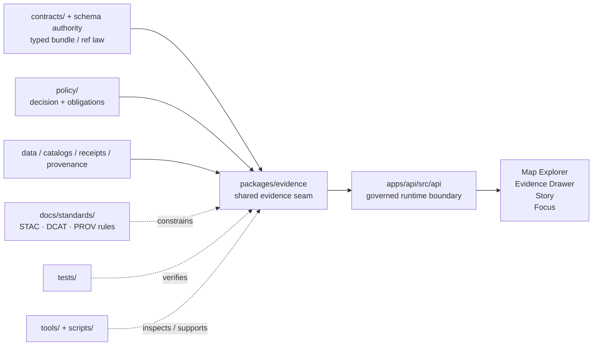

<!-- [KFM_META_BLOCK_V2]
doc_id: kfm://doc/NEEDS_VERIFICATION_UUID
title: evidence
type: standard
version: v1
status: draft
owners: @bartytime4life
created: YYYY-MM-DD
updated: YYYY-MM-DD
policy_label: NEEDS_VERIFICATION
related: [../../README.md, ../README.md, ../../contracts/README.md, ../../schemas/README.md, ../../policy/README.md, ../../apps/api/src/api/README.md, ../../tests/README.md]
tags: [kfm, evidence, evidence-ref, evidence-bundle, packages]
notes: [Current public main shows packages/evidence as README-only, doc_id/created/updated/policy_label need direct repo verification before merge]
[/KFM_META_BLOCK_V2] -->

# evidence

_Governed `EvidenceRef` → `EvidenceBundle` resolution and policy-safe evidence presentation surface for Kansas Frontier Matrix._

> **Status:** experimental  
> **Owners:** `@bartytime4life` *(broad `/packages/` owner confirmed on public `main`; narrower child ownership still needs verification)*  
>         
> **Repo fit:** `packages/evidence/README.md` · child of [`../README.md`](../README.md) · repo root [`../../README.md`](../../README.md) · contract neighbor [`../../contracts/README.md`](../../contracts/README.md) · schema boundary [`../../schemas/README.md`](../../schemas/README.md) · policy neighbor [`../../policy/README.md`](../../policy/README.md) · downstream API seam [`../../apps/api/src/api/README.md`](../../apps/api/src/api/README.md) · verification neighbor [`../../tests/README.md`](../../tests/README.md)  
> **Quick jump:** [Scope](#scope) · [Repo fit](#repo-fit) · [Accepted inputs](#accepted-inputs) · [Exclusions](#exclusions) · [Directory tree](#directory-tree) · [Quickstart](#quickstart) · [Usage](#usage) · [Diagram](#diagram) · [Tables](#tables) · [Task list / definition of done](#task-list--definition-of-done) · [FAQ](#faq) · [Appendix](#appendix)

> [!IMPORTANT]
> Current public `main` proves `packages/evidence/` exists and currently exposes a scaffold README only.
>
> This file therefore does two jobs at once:
> 1. records the **current repo-visible state** honestly
> 2. defines the **boundary contract** this package should satisfy as it hardens

---

## Scope

`packages/evidence/` is the shared internal seam that makes KFM’s **evidence-as-interface** rule operational.

When another lane holds an `EvidenceRef`, this package is the natural shared place to turn that handle into a bounded, inspectable, policy-safe `EvidenceBundle` or a governed negative outcome. In practice, that means this package should help downstream surfaces such as the governed API, Evidence Drawer, Story publication, and Focus Mode **reuse one evidence path** instead of inventing their own parallel provenance behavior.

This package is **not** the sovereign home of policy, contracts, canonical artifacts, or public route handlers. It is a reusable internal boundary that should remain subordinate to stronger top-level surfaces.

### Truth labels used here

| Label | Meaning in this README |
|---|---|
| **CONFIRMED** | Directly supported by current public repo files or stable March 2026 KFM doctrine |
| **INFERRED** | Strongly suggested by adjacent repo docs, but not re-proven from deeper package-local implementation |
| **PROPOSED** | Commit-ready boundary guidance consistent with repo doctrine and neighboring docs |
| **UNKNOWN** | Not established strongly enough from the visible branch to present as current implementation reality |
| **NEEDS VERIFICATION** | Placeholder or repo/platform detail that should be checked before merge |

> [!NOTE]
> The public repo currently names this child package `packages/evidence/`.
>
> Some March 2026 design material sketches a more specific seam such as `packages/evidence-resolver/`. This README follows the **current repo path** and treats any future split or rename as **PROPOSED** until the live repo changes.

[Back to top](#evidence)

---

## Repo fit

### Why this package exists

KFM’s shell, API, story flow, and Focus flow all depend on evidence being reachable, inspectable, redaction-aware, and consistent. `packages/evidence/` is where that shared behavior should live when it is:

1. reused by more than one runtime or workflow surface
2. non-deployable on its own
3. easier to review as a stable internal boundary than as app-local glue
4. still subordinate to stronger top-level contract, policy, and data authority

### Current repo-visible snapshot

| Concern | Current public `main` signal | Status |
|---|---|---|
| `packages/evidence/` directory exists | visible on branch | **CONFIRMED** |
| `packages/evidence/README.md` exists | current child file is scaffold text only | **CONFIRMED** |
| Parent package contract already describes this child’s role | `packages/README.md` assigns `EvidenceRef` → `EvidenceBundle` resolution and policy-safe presentation helpers to this package | **CONFIRMED** |
| Downstream API seam expects evidence resolution | `apps/api/src/api/README.md` describes evidence resolution orchestration and `/api/v1/evidence/resolve` semantics | **CONFIRMED** |
| Package-local code, manifests, tests, fixtures, and import graph | not proven by the visible package subtree | **UNKNOWN** |
| Narrower child owner than broad `/packages/` owner | not separately evidenced | **UNKNOWN / NEEDS VERIFICATION** |

### Upstream and downstream anchors

| Direction | Path | Why it matters |
|---|---|---|
| Upstream | [`../../README.md`](../../README.md) | repo-wide operating posture and truth-path framing |
| Upstream | [`../README.md`](../README.md) | parent package map and current child-package reading |
| Lateral | [`../../contracts/README.md`](../../contracts/README.md) | machine-readable contract backbone that this package should consume, not duplicate |
| Lateral | [`../../schemas/README.md`](../../schemas/README.md) | schema-home ambiguity boundary; avoid creating a second contract universe here |
| Lateral | [`../../policy/README.md`](../../policy/README.md) | deny-by-default, reasons/obligations, and finite outcome posture |
| Downstream | [`../../apps/api/src/api/README.md`](../../apps/api/src/api/README.md) | current substantive runtime seam that expects evidence-resolution behavior |
| Downstream | [`../../tests/README.md`](../../tests/README.md) | verification families that should pressure-test resolvability, denial, redaction, and drift |
| Adjacent | [`../../docs/standards/README.md`](../../docs/standards/README.md) | STAC/DCAT/PROV and related standards surfaces this package should respect |

> [!WARNING]
> `packages/evidence/` must not become a side door around the trust membrane.
>
> If a client, worker, or UI surface can get evidence-like outputs here without crossing governed API, policy, and release-bearing rules, the boundary has already drifted.

[Back to top](#evidence)

---

## Accepted inputs

Content belongs in `packages/evidence/` when it remains **shared internal evidence logic** rather than a public-facing or authoritative surface.

| Input class | What belongs here | Why |
|---|---|---|
| `EvidenceRef` normalization | parsers, validators, canonical handle helpers, resolver dispatch logic | keeps evidence references consistent across surfaces |
| Bundle assembly | helpers that gather metadata, lineage, artifact pointers, and safe previews into package-owned runtime objects | avoids every app inventing its own bundle shape |
| Redaction / restriction helpers | policy-safe filtering, preview trimming, obligation-aware field suppression | evidence outputs must stay safe before UI rendering |
| Provenance summarization | helpers that turn receipt/catalog/provenance material into inspectable summaries | keeps “evidence as interface” reusable |
| Presentation-safe adapters | shared formatting helpers for evidence cards, link maps, or bundle summaries | supports multiple consumers without hardcoding UI components |
| Package-local fixtures and tests | valid / invalid refs, denied / redacted examples, bundle-shape checks, lineage-link tests | proves behavior without hiding law elsewhere |

### Typical evidence families this package should expect

- dataset-version metadata
- rights and policy summaries
- lineage / provenance pointers
- safe artifact links when allowed
- redaction or restriction notices
- resolvability failures that must stay explicit

---

## Exclusions

`packages/evidence/` is important precisely because it is **not** the place for every evidence-adjacent concern.

| Does **not** belong here as canonical truth | Keep it here instead | Why |
|---|---|---|
| Canonical JSON Schemas, OpenAPI files, vocabularies, envelope law | [`../../contracts/`](../../contracts/) and the repo’s eventual single schema home | contract authority must remain singular and reviewable |
| Policy bundles, reason codes, obligation registries, decision rules | [`../../policy/`](../../policy/) | policy must stay independently governable |
| Canonical datasets, receipts, catalogs, release artifacts, published evidence stores | governed data and release-bearing lanes | this package resolves or presents evidence; it does not become evidence storage |
| Public route handlers and HTTP-specific behavior | [`../../apps/api/src/api/README.md`](../../apps/api/src/api/README.md) or equivalent app/service seams | runtime edge behavior belongs in governed API surfaces |
| UI components and browser state | app/UI surfaces | package helpers may support UI, but should not become UI |
| Story authoring logic, Focus orchestration, review workflows | app/service layers | these consume evidence; they do not define the package’s core boundary |
| Ad hoc local scripts and one-off debug helpers | [`../../scripts/README.md`](../../scripts/README.md) or [`../../tools/README.md`](../../tools/README.md) | keep shell glue and reusable helpers separate |

> [!TIP]
> A useful test: if deleting this package would erase the project’s shared answer to “how does an `EvidenceRef` become an inspectable, policy-safe bundle?”, the logic belongs here.
>
> If deleting this package would erase policy law, route law, or canonical data truth, that logic belongs somewhere stronger.

[Back to top](#evidence)

---

## Directory tree

### Current confirmed snapshot

```text
packages/
└── evidence/
    └── README.md
```

### Target hardening shape (`PROPOSED`)

```text
packages/evidence/
├── README.md
├── src/
│   ├── refs/
│   ├── resolver/
│   ├── redaction/
│   ├── bundle/
│   └── presentation/
└── tests/
    ├── unit/
    └── fixtures/
```

> [!NOTE]
> The second tree is a **boundary sketch**, not a claim about current repo contents.
>
> Keep only the parts the live branch actually adopts. Delete the rest rather than letting “future shape” silently turn into fake inventory.

[Back to top](#evidence)

---

## Quickstart

Use these commands to confirm what is real before upgrading any package-local claim.

```bash
# 1) Inspect the visible package surface
find packages/evidence -maxdepth 4 -type f | sort
find packages/evidence -maxdepth 4 -type d | sort

# 2) Re-read the current boundary docs
sed -n '1,220p' packages/README.md
sed -n '1,220p' packages/evidence/README.md
sed -n '1,260p' contracts/README.md
sed -n '1,240p' schemas/README.md
sed -n '1,260p' policy/README.md
sed -n '1,260p' tests/README.md

# 3) Inspect the current downstream API seam
sed -n '1,260p' apps/api/src/api/README.md 2>/dev/null || true

# 4) Look for real implementation before claiming it exists
find packages/evidence -maxdepth 4 \
  \( -name package.json -o -name pyproject.toml -o -name Cargo.toml -o -name go.mod -o -name tsconfig.json \) \
  | sort

# 5) Search for shared evidence vocabulary across the repo
grep -RIn \
  "EvidenceRef\|EvidenceBundle\|evidence/resolve\|Evidence Drawer\|audit_ref\|dataset_version_id" \
  apps packages contracts policy docs tests 2>/dev/null || true
```

### First review pass

1. Confirm whether `packages/evidence/` is still README-only or now contains real code.
2. Confirm whether the package remains a single seam or has split into narrower evidence subpackages.
3. Confirm whether the package consumes a single authoritative bundle schema instead of shadowing one.
4. Confirm whether denied, redacted, and broken-reference behavior is tested somewhere real.
5. Confirm whether downstream consumers resolve evidence through governed runtime surfaces rather than direct storage access.

---

## Usage

### Treat this README as a boundary contract first

Use this file to answer:

- what evidence logic belongs in a shared internal package
- what evidence logic belongs in contracts, policy, apps, or data instead
- what claims about this package are **current repo fact** versus **target-shape guidance**

### Keep the package reusable and thin

This package should centralize shared evidence behavior without absorbing unrelated responsibilities. Good signs include:

- deterministic `EvidenceRef` handling
- reusable bundle assembly
- redaction-aware helpers
- inspectable lineage summaries
- package-local fixtures proving bundle behavior

Bad signs include:

- direct browser or client access paths
- route handlers
- policy law copied into package code
- authoritative schemas copied here “for convenience”
- evidence outputs that skip policy-safe restriction handling
- package code becoming the only place where story or Focus citations are validated

### Keep imports directional

The intended dependency direction is:

1. stronger surfaces define law (`contracts/`, schema authority, `policy/`, governed data)
2. `packages/evidence/` consumes or applies that law
3. governed runtimes consume this package
4. UI surfaces consume governed runtimes, not this package directly

### Keep negative outcomes explicit

If evidence cannot be resolved, cannot be shown safely, or cannot be traced back to permitted released artifacts, the package should support a **bounded negative outcome** rather than a polished best-effort success.

> [!IMPORTANT]
> “Some evidence appeared” is not enough for KFM.
>
> Shared evidence helpers should preserve inspectability: version basis, rights posture, restriction notice, provenance summary, and safe artifact visibility where allowed.

[Back to top](#evidence)

---

## Diagram



> [!NOTE]
> The arrows above show **intended boundary direction**, not a scraped import graph from the live checkout.

---

## Tables

### Boundary map

| Concern | Package stance |
|---|---|
| Normalize and interpret `EvidenceRef` handles | **Yes** — core shared responsibility |
| Assemble policy-safe `EvidenceBundle` objects | **Yes** — central shared responsibility |
| Apply redaction / restriction presentation helpers | **Yes** — as package-level support after policy is known |
| Own policy evaluation rules | **No** — consume policy outputs or adapters instead |
| Define authoritative bundle schema | **No** — consume authoritative contract surfaces |
| Persist canonical evidence artifacts | **No** — authoritative data and release-bearing lanes own persistence |
| Expose public HTTP endpoints | **No** — governed API lanes own runtime edges |
| Render full UI components | **No** — downstream UI/app surfaces own visible components |
| Support Story / Focus / Evidence Drawer reuse | **Yes** — by providing stable internal evidence behavior |

### Minimum bundle expectations (`PROPOSED` contract-led placement guidance)

> [!NOTE]
> The table below is placement guidance, not proof that a final checked-in bundle schema already exists on the current branch.

| Field family | Why the package should preserve it |
|---|---|
| original `EvidenceRef` or equivalent normalized reference | keeps route-back-to-evidence explicit |
| `bundle_id` or digest-bearing identifier | supports inspectability, diffing, and stable audit discussion |
| `dataset_version_id` | ties evidence to governed release scope |
| rights / license / policy summary | keeps trust cues visible downstream |
| lineage / provenance summary | preserves how the evidence was produced or linked |
| safe artifact pointers | allows drill-through when policy permits |
| restriction / redaction notices | prevents “partial visibility” from looking like full disclosure |
| audit / run linkage when applicable | preserves operational traceability |

### Downstream consumer map

| Consumer | What it should expect from this package | What it should **not** expect |
|---|---|---|
| governed API | bounded resolver behavior, policy-safe bundle assembly, stable internal helpers | a shortcut around policy or contract validation |
| Evidence Drawer | inspectable evidence payloads with version / rights / lineage cues | direct access to canonical stores |
| Story publish flow | resolvable citation helpers and safe previews | final review / release authority |
| Focus Mode | bundle-ready evidence inputs for citation verification | model policy, release-scope law, or public answer generation on its own |
| tests / tools | fixtures, examples, and deterministic internal behavior | hidden business rules that only tools can discover |

[Back to top](#evidence)

---

## Task list / definition of done

### Current-state verification

- [ ] Confirm the live `packages/evidence/` subtree and replace any stale tree sketch with the real one.
- [ ] Confirm whether a narrower child owner exists beyond the broad `/packages/` owner.
- [ ] Confirm whether the repo keeps this seam as `packages/evidence/` or plans a split / rename.
- [ ] Confirm whether real package manifests, `src/`, tests, and fixtures now exist.

### Minimum package hardening

- [ ] Point this package at one authoritative bundle / resolver contract surface instead of duplicating schema law locally.
- [ ] Add package-local fixtures for resolvable, denied, redacted, and unresolvable evidence cases.
- [ ] Add tests proving restriction notices and safe previews survive bundle assembly.
- [ ] Add tests proving the package does not silently widen hidden evidence access.
- [ ] Document any external dependencies or standards assumptions explicitly.

### Integration proof

- [ ] Confirm governed API consumes this package rather than re-implementing its evidence logic ad hoc.
- [ ] Confirm Story and Focus citation paths can reuse the same resolution semantics.
- [ ] Confirm Evidence Drawer payloads remain reachable within bounded calls.
- [ ] Confirm failure states are explicit and policy-safe.
- [ ] Update [`../README.md`](../README.md) if this package boundary changes materially.

### Done when

This README is in a good merge state when:

1. the **current snapshot** is truthful
2. the **boundary** is clear
3. the **exclusions** prevent drift into contracts, policy, data, or apps
4. the **task list** tells reviewers what still needs proof
5. no sentence implies package-local implementation depth that the live repo does not actually show

---

## FAQ

### Is this package the policy engine?

No. It may consume policy decisions or shared policy-support helpers, but repo-authoritative policy bundles and decision law belong under [`../../policy/`](../../policy/).

### Is this package the Evidence Drawer UI?

No. It supports evidence presentation semantics, but visible UI components belong in app/UI surfaces. This package is the shared internal evidence seam, not the shell.

### Should schemas or OpenAPI files live here?

No. This package should consume authoritative contract surfaces instead of creating a second contract universe.

### What if the repo later adopts `packages/evidence-resolver/`?

Use the live repo path. If the seam splits or renames, update this README, [`../README.md`](../README.md), and all downstream links in the same PR so the package map stays truthful.

[Back to top](#evidence)

---

## Appendix

<details>
<summary>Appendix — review prompts, migration notes, and search vocabulary</summary>

### Boundary review prompts

Use these questions before adding code to `packages/evidence/`:

1. Is this shared by more than one runtime or workflow surface?
2. Is it non-deployable on its own?
3. Does it preserve — not weaken — the trust membrane?
4. Does it depend on authoritative contracts instead of redefining them?
5. Does it avoid copying policy law or release authority?
6. Would a reviewer understand the package boundary after reading only this README and neighboring docs?

### Migration note for future hardening

If the package grows beyond a README-only subtree:

- keep the **current confirmed tree** and **proposed tree** separate until the live branch is inspected
- convert proposed nodes into confirmed nodes only when files actually exist
- refresh the quickstart commands if the repo adopts a specific package manager or language toolchain
- add local examples only when they do not become canonical truth artifacts

### Useful repo vocabulary to grep

```text
EvidenceRef
EvidenceBundle
evidence/resolve
dataset_version_id
audit_ref
lineage
redaction
restriction
safe preview
Evidence Drawer
cite or abstain
```

</details>

[Back to top](#evidence)
