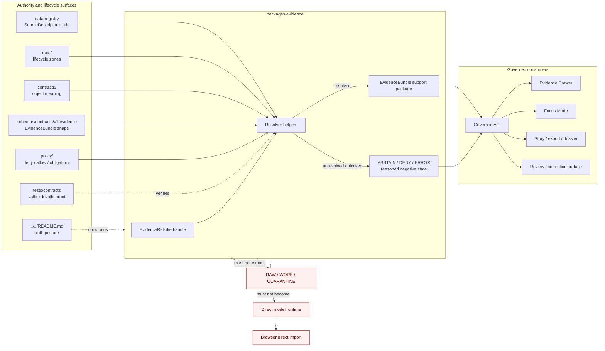

<!-- [KFM_META_BLOCK_V2]
doc_id: kfm://doc/TODO-assign-uuid
title: packages/evidence README
type: standard
version: v1
status: draft
owners: @bartytime4life (broad /packages/ fallback; evidence-specific owner NEEDS VERIFICATION)
created: TODO-VERIFY-original-created-date
updated: 2026-04-23
policy_label: TODO-VERIFY-policy-label
related: [../../README.md, ../README.md, ../../.github/CODEOWNERS, ../../contracts/README.md, ../../schemas/README.md, ../../schemas/contracts/v1/evidence/README.md, ../../policy/README.md, ../../data/README.md, ../../data/registry/README.md, ../../tests/README.md, ../../tests/contracts/README.md, ../../apps/README.md, ../../web/README.md]
tags: [kfm, evidence, packages, evidence-bundle, trust-membrane]
notes: [Replaces skeletal placeholder, Evidence-specific owner and policy label need verification, Current public main shows package README-only surface while adjacent schema/test surfaces are more mature]
[/KFM_META_BLOCK_V2] -->

# `packages/evidence`

Governed `EvidenceRef` → `EvidenceBundle` package boundary for evidence-safe support resolution, trust-visible handoff, and cite-or-abstain behavior.

> [!IMPORTANT]
> **Status:** `experimental` package boundary · `draft` README revision  
> **Owners:** `@bartytime4life` via broad `/packages/` fallback; evidence-specific ownership **NEEDS VERIFICATION**  
> **Path:** `packages/evidence/README.md`  
> **Authority class:** shared internal evidence helper boundary; not canonical data, not policy law, not schema authority, not public API, and not release proof  
> **Current public snapshot:** `CONFIRMED` README-only child package surface · adjacent `EvidenceBundle` schema and contract-test lanes exist · package-local code/tests/manifests are `UNKNOWN`  
> **Truth posture:** `CONFIRMED` path and adjacent repo surfaces · `INFERRED` evidence resolver role from package parent + KFM doctrine · `PROPOSED` implementation shape · `NEEDS VERIFICATION` runtime wiring, CI gates, and branch protections
>
> 
> 
> 
> 
> 
> 
> 
>
> **Quick jumps:** [Scope](#scope) · [Repo fit](#repo-fit) · [Accepted inputs](#accepted-inputs) · [Exclusions](#exclusions) · [Current package surface](#current-package-surface) · [Directory tree](#directory-tree) · [Quickstart](#quickstart) · [Usage](#usage) · [Diagram](#diagram) · [Resolver contract pressure](#resolver-contract-pressure) · [Boundary rules](#boundary-rules) · [Definition of done](#definition-of-done) · [FAQ](#faq) · [Appendix](#appendix)

> [!WARNING]
> `packages/evidence/` must not become a hidden evidence store, a browser-accessible bypass, a direct model-context bucket, or a quiet public path to `RAW`, `WORK`, `QUARANTINE`, canonical stores, unpublished candidates, restricted support, or policy-unchecked summaries.

---

## Scope

`packages/evidence/` is the shared internal package boundary for evidence-safe support resolution.

Its intended job is narrow and trust-bearing: help KFM resolve evidence handles into policy-safe support packages that downstream governed surfaces can inspect, cite, render, or abstain from. In KFM terms, this package should make it harder for a map popup, Focus answer, story node, export, or review surface to cite a bare pointer without resolving what actually supports the claim.

A healthy evidence package should preserve:

- the governed truth path: `RAW -> WORK / QUARANTINE -> PROCESSED -> CATALOG / TRIPLET -> PUBLISHED`
- the trust membrane between internal lifecycle stores and public-facing surfaces
- `EvidenceBundle` as support, not generated prose and not release proof
- bounded negative outcomes when evidence is missing, stale, restricted, policy-blocked, unresolved, or malformed
- source-role, rights, sensitivity, review, release, and correction context at the point of use

### Evidence posture used here

| Label | Meaning in this README |
| --- | --- |
| `CONFIRMED` | Directly supported by public repo-visible files, adjacent README surfaces, CODEOWNERS, current schema files, or KFM doctrine. |
| `INFERRED` | Strongly suggested by adjacent docs and repeated doctrine, but not proven as executable package implementation. |
| `PROPOSED` | Recommended package-boundary guidance consistent with KFM doctrine and current repo shape. |
| `UNKNOWN` | Not verified strongly enough from the active branch, package-local code, tests, imports, CI, or runtime evidence. |
| `NEEDS VERIFICATION` | A concrete checkout, owner, schema, fixture, validator, workflow, runtime, or platform check is required before stronger claims are safe. |

[Back to top](#packagesevidence)

---

## Repo fit

`packages/evidence/` sits between contract/schema meaning and trust-visible runtime consumers. It should implement reusable internal mechanics only after stronger authority surfaces define what the package is allowed to resolve, expose, deny, or withhold.

| Relationship | Path | Role for `packages/evidence/` | Current posture |
| --- | --- | --- | --- |
| Root orientation | [`../../README.md`](../../README.md) | Project identity, trust posture, lifecycle law, and repo-wide guardrails. | `CONFIRMED` public path |
| Parent package boundary | [`../README.md`](../README.md) | Defines `packages/` as shared internal modules subordinate to evidence, contracts, policy, release state, and governed APIs. | `CONFIRMED` adjacent surface |
| Ownership routing | [`../../.github/CODEOWNERS`](../../.github/CODEOWNERS) | Broad package-owner fallback until narrower evidence stewardship is verified. | `CONFIRMED` broad fallback |
| Contract meaning | [`../../contracts/README.md`](../../contracts/README.md) | Human-readable object meaning and compatibility expectations. | `CONFIRMED` adjacent surface |
| Schema shape | [`../../schemas/README.md`](../../schemas/README.md) | Parent schema lane and schema-home ambiguity warnings. | `CONFIRMED` adjacent surface |
| Evidence schema family | [`../../schemas/contracts/v1/evidence/README.md`](../../schemas/contracts/v1/evidence/README.md) | Boundary doc for the `EvidenceBundle` contract family. | `CONFIRMED` adjacent surface |
| Evidence bundle schema | [`../../schemas/contracts/v1/evidence/evidence_bundle.schema.json`](../../schemas/contracts/v1/evidence/evidence_bundle.schema.json) | Machine shape for first-wave `EvidenceBundle` fields. | `CONFIRMED` current file; recheck before coding |
| Runtime envelope schema | [`../../schemas/contracts/v1/runtime/runtime_response_envelope.schema.json`](../../schemas/contracts/v1/runtime/runtime_response_envelope.schema.json) | Outward finite response contract that may consume evidence bundle refs. | `CONFIRMED` current file |
| Source registry | [`../../data/registry/README.md`](../../data/registry/README.md) | Source identity, role, rights, cadence, sensitivity, and activation posture. | `CONFIRMED` adjacent surface |
| Data lifecycle | [`../../data/README.md`](../../data/README.md) | Lifecycle zones, catalog/proof/receipt separation, and public-safe materialization. | `CONFIRMED` adjacent surface |
| Policy | [`../../policy/README.md`](../../policy/README.md) | Deny-by-default decisions, rights, sensitivity, obligations, review, and release admissibility. | `CONFIRMED` adjacent surface |
| Contract proof | [`../../tests/contracts/README.md`](../../tests/contracts/README.md) | Valid/invalid contract examples and fail-closed object checks. | `CONFIRMED` adjacent surface |
| Verification parent | [`../../tests/README.md`](../../tests/README.md) | Repo-wide governed verification posture and no-network fixture preference. | `CONFIRMED` adjacent surface |
| App boundary | [`../../apps/README.md`](../../apps/README.md) | Governed API and runtime surfaces that should consume evidence through controlled seams. | `CONFIRMED` adjacent surface |
| Browser UI | [`../../web/README.md`](../../web/README.md) | Evidence Drawer, Focus, map shell, and browser-boundary guidance. | `CONFIRMED` adjacent surface |
| Sibling ingest package | [`../ingest/README.md`](../ingest/README.md) | Shared source intake and receipt helpers that may produce evidence-supporting inputs. | `CONFIRMED` sibling surface |
| Sibling policy package | [`../policy/README.md`](../policy/README.md) | Internal policy-support adapter package, not top-level policy authority. | `CONFIRMED` sibling surface |

### Placement rule

Put logic in `packages/evidence/` only when it is:

1. reusable across more than one app, package, pipeline, validator, or trust-visible UI surface;
2. non-deployable on its own;
3. downstream of source registry, data lifecycle, contract, schema, policy, and release state;
4. able to return bounded negative outcomes instead of unsupported evidence;
5. tested with public-safe valid and invalid examples.

[Back to top](#packagesevidence)

---

## Accepted inputs

Content belongs here when it supports evidence-safe resolution or presentation without becoming a new authority surface.

| Accepted input | Belongs here when… | Must stay linked to… |
| --- | --- | --- |
| `EvidenceRef`-like handles | They point to support material that must be resolved before claim-bearing use. | `contracts/`, `schemas/contracts/v1/evidence/`, governed API |
| `EvidenceBundle` assembly helpers | They collect release-backed support references, decision refs, run/AI receipt refs, attestations, and audit refs into a reviewable object. | `EvidenceBundle` schema, tests/contracts, policy |
| Bundle validation adapters | They help callers check shape or required links before runtime use. | `schemas/`, `tests/contracts/`, `tools/validators/` when verified |
| Evidence-safe presentation helpers | They shape support summaries for Evidence Drawer, export preview, or story/dossier support. | governed API, `web/`, `apps/`, policy |
| Redaction / generalization context helpers | They preserve display constraints, preview limits, or sensitivity state already decided elsewhere. | `policy/`, `data/registry/`, review records |
| Citation support helpers | They preserve citation labels, evidence refs, and audit references without fabricating support. | runtime envelope, Evidence Drawer, Focus Mode |
| Negative-state helpers | They normalize missing, stale, restricted, unresolved, checksum-mismatch, or policy-blocked support into bounded outcomes. | policy reason codes, runtime envelopes |
| Package-local fixtures | They prove package behavior with tiny public-safe examples. | root `tests/`, `tests/contracts/`, package-local test path if present |
| Boundary documentation | It keeps package authority, inputs, exclusions, and downstream consumers explicit. | parent `packages/README.md`, child package README |

> [!TIP]
> Descriptor-first and bundle-first reviews pair well: a source can be admitted only when its descriptor is explicit, and a claim can be exposed only when its support resolves into an evidence bundle or a governed negative outcome.

[Back to top](#packagesevidence)

---

## Exclusions

`packages/evidence/` is not a catch-all for anything evidence-shaped.

| Do not put this in `packages/evidence/` | Put it here instead | Why |
| --- | --- | --- |
| RAW source files, harvested payloads, private records, or source-native captures | `../../data/raw/` or repo-approved lifecycle lanes | Package code must not become source custody. |
| WORK, QUARANTINE, processed, catalog, proof, or published artifacts as primary records | `../../data/` lifecycle lanes and `../../release/` when verified | Packages may resolve references; they do not own lifecycle storage. |
| Canonical schemas, OpenAPI definitions, or object law | `../../schemas/` and `../../contracts/` after schema-home authority is settled | Prevents shadow contract universes. |
| Policy bundles, reason-code law, allow/deny logic, or review obligations | `../../policy/` | Policy decides; evidence helpers consume policy state. |
| Runtime route handlers, public API services, or browser code | `../../apps/` and `../../web/` | This is an internal package boundary, not a deployable surface. |
| Direct model prompts, direct model clients, or free-form generated output | governed API/runtime adapter surfaces | AI is interpretive and must remain downstream of evidence, policy, and citation validation. |
| Release manifests, proof packs, signatures, or attestations as custody records | `data/proofs/`, `release/`, or attestation tooling when verified | Evidence helpers may reference proof; they do not become proof custody. |
| Secrets, credentials, private endpoints, access tokens, or local host settings | secret manager / deployment-only configuration | Evidence resolution must not leak operational access. |
| Broad narrative doctrine or ADRs | `../../docs/` | Keep architecture and decisions in the documentation control plane. |
| UI-only trust cues without evidence context | governed payload contracts and Evidence Drawer consumers | Trust cues must not become decorative or detached from support. |

> [!CAUTION]
> A bundle reference is not permission to display everything behind it. Rights, sensitivity, release scope, preview policy, review state, and correction state still apply.

[Back to top](#packagesevidence)

---

## Current package surface

`CONFIRMED`: `packages/evidence/README.md` exists on public `main`.

`CONFIRMED`: the parent package README frames `evidence/` as the package for governed `EvidenceRef` → `EvidenceBundle` resolution and evidence-safe presentation helpers.

`UNKNOWN`: package-local code, package manifests, package-local tests, import graph, runtime consumers, CI enforcement, and release integration.

| Surface | Status | Safe reading |
| --- | ---:| --- |
| `packages/evidence/README.md` | `CONFIRMED` | Current child package README exists. |
| Package-local code under `packages/evidence/` | `UNKNOWN` | Do not claim resolver implementation until active checkout shows files and tests. |
| Package-local manifest | `UNKNOWN` | Do not document install/build commands until package manager is verified. |
| Package-local tests or fixtures | `UNKNOWN` | Prefer root `tests/contracts/` for contract-facing proof until local tests exist. |
| `schemas/contracts/v1/evidence/evidence_bundle.schema.json` | `CONFIRMED` | Adjacent first-wave schema exists and must be re-opened before coding bundle logic. |
| Runtime response envelope | `CONFIRMED` | Adjacent runtime schema carries finite outcomes and `evidence_bundle_ref`. |
| Owner | `CONFIRMED fallback / NEEDS VERIFICATION leaf` | Broad `@bartytime4life` ownership applies; narrower evidence owner is unresolved. |
| Direct public path | `EXCLUDED` | Public clients should use governed API / Evidence Drawer / Focus payloads, not this package directly. |

> [!NOTE]
> If the active branch shows new package-local files, update this section in the same PR. README presence is not implementation maturity.

[Back to top](#packagesevidence)

---

## Directory tree

### Current public package snapshot

```text
packages/evidence/
└── README.md
```

### Doctrine-aligned growth shape

`PROPOSED`, not current implementation evidence:

```text
packages/evidence/
├── README.md
├── package manifest              # package.json / pyproject.toml / go.mod / Cargo.toml as repo convention requires
├── src/                          # reusable internal implementation only
│   ├── resolver/                 # EvidenceRef -> EvidenceBundle helpers
│   ├── bundles/                  # bundle assembly / normalization helpers
│   ├── redaction/                # display-policy carry-forward helpers
│   ├── citations/                # citation support helpers
│   └── presentation/             # Evidence Drawer / export-safe shaping helpers
├── tests/                        # package-local tests, if repo convention supports them
├── fixtures/                     # tiny package-local examples, not source mirrors
└── examples/                     # clearly labeled illustrative examples only
```

### Adjacent contract and proof surfaces to inspect together

```text
schemas/contracts/v1/evidence/
├── README.md
└── evidence_bundle.schema.json

schemas/contracts/v1/runtime/
└── runtime_response_envelope.schema.json

tests/contracts/
└── README.md
```

> [!IMPORTANT]
> Do not fork `EvidenceBundle` meaning into package-local types without reconciling the schema-side contract, root contract docs, valid/invalid fixtures, and runtime envelope consumers.

[Back to top](#packagesevidence)

---

## Quickstart

Start with read-only inventory. Prove what exists before documenting build, test, or runtime behavior.

```bash
# Confirm repository state.
git status --short
git branch --show-current
git rev-parse --show-toplevel

# Inventory this package.
find packages/evidence -maxdepth 4 -print | sort

# Read parent and adjacent boundaries.
sed -n '1,260p' packages/README.md
sed -n '1,220p' packages/evidence/README.md
sed -n '1,260p' contracts/README.md
sed -n '1,260p' schemas/README.md
sed -n '1,220p' schemas/contracts/v1/evidence/README.md
sed -n '1,220p' policy/README.md
sed -n '1,240p' tests/contracts/README.md
sed -n '1,220p' apps/README.md
sed -n '1,220p' web/README.md

# Inspect current machine contracts that evidence helpers must not outrun.
cat schemas/contracts/v1/evidence/evidence_bundle.schema.json
cat schemas/contracts/v1/runtime/runtime_response_envelope.schema.json

# Find existing references before adding new package code.
grep -RInE \
  'EvidenceRef|EvidenceBundle|evidence_bundle|RuntimeResponseEnvelope|DecisionEnvelope|ReleaseManifest|attestation_refs|evidence_bundle_ref|ABSTAIN|DENY|ERROR|ANSWER' \
  packages contracts schemas policy data tests tools apps web docs 2>/dev/null || true
```

When package-local implementation exists, add the repo-native test command here only after the package manager and runner are verified.

```bash
# PLACEHOLDER — replace only after active-branch verification.
echo "NEEDS VERIFICATION: package-local test command for packages/evidence"
```

[Back to top](#packagesevidence)

---

## Usage

### Treat evidence resolution as a trust seam

A caller should not ask this package to make a public claim. A caller should ask it to resolve support, explain why support cannot be resolved, and preserve the reason clearly enough for governed API, Evidence Drawer, Focus Mode, review, export, or story surfaces to act safely.

Preferred flow:

1. Receive an `EvidenceRef`-like handle from a released or reviewable context.
2. Confirm the requested scope, release context, and allowed surface.
3. Resolve source, dataset, decision, release, receipt, attestation, and audit references through approved stores and manifests.
4. Apply or carry policy outcomes from the policy surface.
5. Return either a resolved support package or a bounded negative state.
6. Let the governed API/runtime envelope decide what the user-facing outcome becomes.

### Keep support, runtime, proof, and receipts distinct

| Object or lane | What it is | What it is not |
| --- | --- | --- |
| `EvidenceBundle` | Support package for a claim, feature, story, export preview, or governed answer. | Not the answer itself and not the release manifest. |
| `RuntimeResponseEnvelope` | Accountable outward `ANSWER` / `ABSTAIN` / `DENY` / `ERROR` response. | Not evidence custody and not policy law. |
| `DecisionEnvelope` / `PolicyDecision` | Decision or policy result carrier. | Not source data and not UI presentation. |
| `RunReceipt` / `AIReceipt` | Process memory and trace of what ran or participated. | Not release proof by itself. |
| `ReleaseManifest` / proof pack | Release-bearing integrity and publication support. | Not a package-local cache. |
| Evidence Drawer payload | Trust-visible explanation surface. | Not optional decoration and not a substitute for policy enforcement. |

### Handle negative states deliberately

Evidence helpers should make weak support explicit.

| Condition | Expected package behavior | Likely outward posture |
| --- | --- | --- |
| Evidence handle missing | Return reasoned unresolved state. | `ABSTAIN` or `ERROR` |
| Bundle shape invalid | Fail closed with validation context. | `ERROR` or gate failure |
| Source role unknown | Preserve denial reason; do not infer authority. | `DENY` or `ABSTAIN` |
| Rights or sensitivity unresolved | Preserve policy block and preview limits. | `DENY` |
| Support stale for requested use | Preserve freshness state and scope. | `ABSTAIN` or qualified `ANSWER` only if policy allows |
| Release manifest missing | Do not expose as published support. | `DENY` or `ABSTAIN` |
| Attestation/proof reference missing where required | Do not smooth over the gap. | `DENY`, `HOLD`, or `ERROR` |
| Exact sensitive geometry requested | Return generalized/restricted support only if policy allows. | `DENY` or generalized result |

[Back to top](#packagesevidence)

---

## Diagram



The package is a helper seam. KFM truth remains anchored in source identity, evidence, policy, lifecycle state, catalog closure, release manifests, review records, and correction lineage.

[Back to top](#packagesevidence)

---

## Resolver contract pressure

This section is intentionally contract-shaped but not implementation-specific. It should guide future code without pretending code already exists.

### Minimal caller burden

A caller should provide enough context for the resolver to avoid guessing.

| Input | Why it matters | Status |
| --- | --- | --- |
| Evidence handle | Identifies the support request. | `PROPOSED package input` |
| Requested surface | Evidence Drawer, Focus, export, story, review, or internal check may have different display limits. | `PROPOSED package input` |
| Release or review context | Prevents unpublished or stale support from appearing public. | `PROPOSED package input` |
| Policy context or policy decision ref | Keeps rights, sensitivity, and obligation handling visible. | `PROPOSED package input` |
| Audit/request id | Makes unresolved and denied outcomes traceable. | `PROPOSED package input` |

### Illustrative TypeScript shape

`PSEUDOCODE`: adapt to the repo-native language and verified contracts before implementation.

```typescript
type EvidenceResolutionOutcome =
  | {
      outcome: "RESOLVED";
      evidence_bundle_ref: string;
      audit_ref: string;
      warnings?: string[];
    }
  | {
      outcome: "ABSTAIN" | "DENY" | "ERROR";
      reason: {
        code: string;
        message: string;
      };
      audit_ref: string;
      evidence_ref?: string;
    };
```

> [!CAUTION]
> Do not introduce this exact type as implementation law without checking the active schema, runtime envelope, policy reason-code vocabulary, valid/invalid fixtures, and downstream consumers.

### Bundle fields to preserve

The current first-wave `EvidenceBundle` schema is intentionally compact. Package helpers should not erase its separation from decision, release, receipt, and attestation references.

| Bundle pressure | Why package helpers should preserve it |
| --- | --- |
| `evidence_bundle_id` | Stable support handle for downstream inspection. |
| `decision_envelope_ref` | Keeps policy/decision context linked instead of restated freehand. |
| `release_manifest_ref` | Keeps publication/release scope visible. |
| `run_receipt_ref` | Preserves process-memory link where present. |
| `ai_receipt_ref` | Preserves model/runtime trace where material and allowed. |
| `attestation_refs` | Preserves proof/integrity references without storing proof here. |

[Back to top](#packagesevidence)

---

## Boundary rules

### Evidence package rule

`packages/evidence/` may resolve, normalize, shape, and validate evidence support for internal callers. It must not become a storage lane, public route, source registry, proof archive, policy engine, or direct model context layer.

### Source-role rule

A source is not authoritative merely because evidence can be resolved from it. Source role and authority limits come from source descriptors, registries, contracts, policy, and review state.

### Policy rule

Evidence helpers may carry policy outcomes and reason codes. They must not define allow/deny law or hard-code policy bypasses.

### Release rule

Evidence helpers should respect release state. They must not treat processed, cataloged, or cached support as public merely because it is easy to read.

### UI rule

Evidence Drawer, map popups, Focus Mode, exports, and stories should receive evidence-safe payloads through governed API boundaries. Browser code should not import this package as a shortcut to internal stores.

### AI rule

Model output is not evidence. If model participation is material, carry `AIReceipt` or equivalent trace references where contracts allow, and require citation validation before user-facing answers.

### Correction rule

A resolved bundle should not erase supersession, withdrawal, correction, review-pending, restricted, generalized, or stale-visible state.

[Back to top](#packagesevidence)

---

## Definition of done

A change under `packages/evidence/` is ready for stronger claims only when the relevant boxes are true in the active repository.

- [ ] KFM Meta Block v2 values are real or explicitly marked as reviewable placeholders.
- [ ] Broad and/or leaf CODEOWNERS coverage is verified.
- [ ] Parent `packages/README.md` and this child README remain synchronized.
- [ ] Adjacent `EvidenceBundle` schema was inspected before package types were added or changed.
- [ ] Valid and invalid contract fixtures exist or the change is clearly docs-only.
- [ ] Package-local code does not duplicate canonical schema, contract, or policy law.
- [ ] Package-local code does not store RAW, WORK, QUARANTINE, processed, proof, or published artifacts as primary records.
- [ ] Resolver behavior returns bounded negative outcomes for missing, stale, restricted, unresolved, invalid, or policy-blocked support.
- [ ] Runtime-facing consumers preserve `ANSWER`, `ABSTAIN`, `DENY`, and `ERROR` rather than converting every failure into a generic exception.
- [ ] Evidence Drawer / Focus / export / story consumers receive evidence-safe payloads through governed APIs or verified internal seams.
- [ ] Receipts, proofs, release manifests, decisions, and bundles remain distinct.
- [ ] Tests prove at least one successful resolution and one fail-closed negative path when implementation code exists.
- [ ] Documentation names rollback or disable path for any runtime-facing integration.
- [ ] No section upgrades README presence into package implementation maturity.

[Back to top](#packagesevidence)

---

## FAQ

### Is `packages/evidence/` where KFM evidence lives?

No. Evidence-bearing artifacts, lifecycle data, receipts, proofs, catalogs, and published outputs belong in their governed lifecycle and release lanes. This package may help resolve and shape support, but it should not become custody for evidence objects.

### Is `EvidenceBundle` the same thing as an answer?

No. `EvidenceBundle` is support. `RuntimeResponseEnvelope` is the outward accountable runtime outcome. Focus Mode or another runtime surface may use an evidence bundle when answering, but the bundle is not itself the answer.

### Can this package call RAW, WORK, or QUARANTINE stores?

Not as a normal public or browser-facing path. Any internal access must be constrained, reviewed, and downstream of lifecycle, policy, and release rules. Public clients and ordinary UI surfaces should consume governed APIs and released evidence/artifacts.

### Can a missing evidence bundle still produce a nice summary?

No. Missing or unresolved support should produce a bounded negative state: `ABSTAIN`, `DENY`, or `ERROR`, depending on why the support cannot be used.

### Can this package decide policy?

No. It can carry policy context, reason codes, display obligations, and denial state, but policy law belongs in `../../policy/` and policy-reviewed contract surfaces.

### Why does this README talk about tests if the package is README-only?

Because evidence resolution is trust-critical. When code lands, reviewers need valid/invalid fixtures, contract checks, and fail-closed cases nearby before runtime, UI, AI, or publication surfaces rely on it.

[Back to top](#packagesevidence)

---

## Appendix

### Open verification backlog

| Item | Why it matters | Suggested evidence |
| --- | --- | --- |
| Evidence-specific owner | Broad package fallback may be too coarse for trust-bearing evidence helpers. | Active `.github/CODEOWNERS`, team/write-access confirmation. |
| Package-local code inventory | Prevents README-only package surface from being described as implemented. | `find packages/evidence -maxdepth 4 -print`. |
| Package manager and test runner | Needed before documenting install/build/test commands. | `package.json`, `pyproject.toml`, `go.mod`, `Cargo.toml`, Make targets, CI workflow. |
| Resolver API shape | Needed before examples become contract-like. | Implementation files + tests + contract references. |
| EvidenceBundle schema drift | Adjacent schema and README can diverge. | Re-open schema, README, fixtures, and contract tests together. |
| Fixture home | Prevents `schemas/tests/**`, `tests/contracts/**`, and package-local fixtures from drifting. | ADR or updated README lattice with validation command. |
| Runtime consumers | Needed before claiming Evidence Drawer, Focus, or API adoption. | Static imports, route tests, runtime proof, UI contract tests. |
| Policy reason-code vocabulary | Needed before package negative states hard-code strings. | Policy docs, vocab files, policy tests. |
| Release/proof storage | Needed before resolving release-backed references. | Release manifests, proof packs, catalog matrices, artifact integrity checks. |
| Sensitive support handling | Needed before public evidence display. | Policy tests, redaction/generalization receipts, steward review notes. |

### Glossary

| Term | Meaning in this README |
| --- | --- |
| `EvidenceRef` | A stable handle or pointer to support material that must resolve before consequential use. |
| `EvidenceBundle` | An inspectable support package that links evidence support to decision, release, receipt, and attestation context. |
| Evidence-safe presentation | Display shaping that preserves rights, sensitivity, review, freshness, release, and correction context. |
| Bounded negative state | `ABSTAIN`, `DENY`, or `ERROR` returned intentionally instead of unsupported prose. |
| Trust membrane | Boundary preventing public clients, UI surfaces, and model runtimes from bypassing governed evidence and policy flow. |
| Shadow authority | A hidden duplicate of policy, schema, contract, release, or evidence meaning inside package code. |
| Process memory | Receipts that record what ran, when, with which inputs and outputs; not release proof by themselves. |
| Proof object | Release- or validation-bearing evidence supporting promotion, review, audit, rollback, or correction. |
| Promotion | Governed state transition into public-safe release, not a file move or package test success. |

[Back to top](#packagesevidence)
