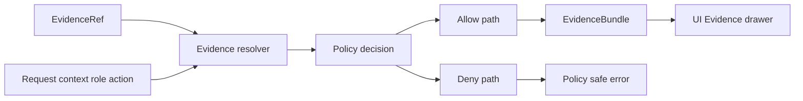

<!-- [KFM_META_BLOCK_V2]
doc_id: kfm://doc/10d16abd-fbce-413a-ab10-08a767110600
title: Evidence Fixtures
type: standard
version: v1
status: draft
owners: TODO
created: 2026-02-25
updated: 2026-02-25
policy_label: public
related:
  - ../README.md
  - ../../policy/README.md
tags: [kfm, evidence, fixtures]
notes:
  - Deterministic, policy-aware fixtures for EvidenceRef parsing, evidence resolution, and CI citation gates.
  - Fixtures MUST be synthetic and non-sensitive unless explicitly marked and access-controlled.
[/KFM_META_BLOCK_V2] -->

# Evidence Fixtures

Deterministic, policy-aware **fixture data** for `packages/evidence` tests (EvidenceRef parsing + evidence resolution + “golden” EvidenceBundle outputs).

[](#status)
[](#purpose)
[](#fixture-conventions)
[](#todo)

---

## Quick navigation

- [Purpose](#purpose)
- [Where this fits](#where-this-fits)
- [Directory layout](#directory-layout)
- [Fixture conventions](#fixture-conventions)
- [Adding a fixture](#adding-a-fixture)
- [Safety and governance](#safety-and-governance)
- [Troubleshooting](#troubleshooting)
- [TODO](#todo)

---

## Purpose

This directory exists to make the **trust membrane** testable.

Fixtures here should let CI and developers verify that:

- EvidenceRefs are **syntactically valid/invalid** as expected.
- The resolver returns a stable **EvidenceBundle** (or a policy-safe error) for known inputs.
- Policy decisions and obligations are applied consistently (e.g., public vs restricted behavior).
- Rights/license metadata is present wherever media is involved.

> **Rule of thumb:** if it can’t be tested deterministically in CI, it doesn’t belong in fixtures.

[Back to top](#quick-navigation)

---

## Where this fits

Evidence resolution should be usable from the UI in *a small number of calls* and always returns:

- human-readable “cards” (what the user sees),
- machine metadata (dataset version, digests, provenance/audit refs),
- policy decision + obligations.

Fixtures in this folder are the primary way to keep that contract from drifting.



[Back to top](#quick-navigation)

---

## Directory layout

> NOTE: This README documents a **recommended** layout. If the actual subfolders differ, update this section to match reality while keeping the same invariants.

```text
packages/evidence/fixtures/
  README.md

  refs/
    valid/
    invalid/

  resolve/
    cases/
      <case_name>/
        request.json          # EvidenceResolveRequest (refs + context)
        expected.bundle.json  # EvidenceBundle “golden” output (normalized)
        expected.error.json   # Optional: expected policy-safe error

  catalog/
    dcat/
    stac/
    prov/

  artifacts/
    tiny/                    # Small (<10KB) synthetic artifacts with known digests
```

### Acceptable inputs (what belongs here)

- Small, synthetic JSON fixtures:
  - EvidenceRef strings (valid + invalid)
  - EvidenceResolveRequest objects (refs + context)
  - Expected EvidenceBundle outputs
  - Expected “deny” error responses that are policy-safe
- Minimal DCAT / STAC / PROV fragments needed to support resolution tests.
- Tiny synthetic artifacts needed to compute or validate digests.

### Exclusions (what must NOT go here)

- Real partner data, private records, or anything with unclear licensing.
- Precise sensitive-location coordinates (unless it is an *explicitly restricted* fixture and is access-controlled in CI).
- Large binaries or “sample datasets” (fixtures should be **tiny**).
- Secrets, tokens, API keys, internal URLs, or operational logs.

[Back to top](#quick-navigation)

---

## Fixture conventions

### 1) Determinism

Fixtures MUST be deterministic:

- Sort arrays where ordering is not semantically meaningful.
- Avoid `generated_at`, `now()`, random IDs, or other time-dependent fields.
- If a timestamp is required by schema, use a constant value (e.g., `1970-01-01T00:00:00Z`) and document why.

### 2) Canonical IDs and digests

- Evidence bundles and artifacts should be referenced by digest-style IDs where possible (e.g., `sha256:...`).
- If you store tiny artifacts under `artifacts/`, include their expected digest in the corresponding case.

### 3) Policy labels and obligations

Fixtures MUST explicitly state the policy label and expected decision for the resource under test.

Common `policy_label` values (starter set):

- `public`
- `public_generalized`
- `restricted`
- `restricted_sensitive_location`
- `internal`
- `embargoed`
- `quarantine`

If the expected behavior is “allow but with an obligation” (e.g., show a UI notice), include the obligation object(s) in the expected output.

### 4) Rights and licensing are first-class

If an evidence card references any media (images, PDFs, audio, etc.) the expected bundle MUST include rights metadata (license, attribution, rights holder, or “metadata-only reference” mode).

### 5) EvidenceRef schemes (starter set)

Fixtures should cover at least these scheme families:

- `dcat://...`
- `stac://...`
- `prov://...`
- `doc://...#page=<n>&span=<start>:<end>`
- `graph://...`

Also include “bad” refs:
- unknown scheme
- missing required fragments
- invalid digest format
- impossible spans (end < start)

[Back to top](#quick-navigation)

---

## Adding a fixture

### Step-by-step

1) Pick a scenario name:
   - `public_allows_public_dcat`
   - `public_denies_restricted_stac_asset`
   - `steward_allows_restricted_sensitive_location_with_notice`
   - `doc_span_highlight_ok`
   - `doc_span_invalid_rejected`

2) Create a case folder under `resolve/cases/<case_name>/`.

3) Add:
   - `request.json`
   - `expected.bundle.json` **or** `expected.error.json`

4) Run the evidence test suite and ensure:
   - the resolver resolves refs in a test environment,
   - outputs match the golden file,
   - policy-safe errors don’t leak restricted details.

### Fixture Definition of Done

- [ ] Fixture is synthetic and license-safe.
- [ ] No sensitive coordinates or PII (or is explicitly restricted + access-controlled).
- [ ] Policy label + decision are explicit.
- [ ] Rights metadata is present where applicable.
- [ ] Output is deterministic (stable ordering, stable IDs, stable timestamps).
- [ ] CI passes (unit + integration + contract tests).

[Back to top](#quick-navigation)

---

## Safety and governance

- **Default-deny posture:** if policy/rights/sensitivity is unclear, fixtures and tests should model *deny* and require explicit override.
- **No leakage:** “deny” responses must be policy-safe and not reveal restricted metadata.
- **Redaction/generalization:** include fixtures that prove generalized outputs do not leak precise coordinates.

> If a fixture needs to include restricted or sensitive-location examples, treat it as a governed artifact:
> - document why it is required,
> - keep it minimal,
> - ensure CI does not expose it in public logs/artifacts.

[Back to top](#quick-navigation)

---

## Troubleshooting

### “Golden output drift” failures

- Check for non-deterministic fields (timestamps, unordered arrays).
- Ensure digests match the exact bytes (line endings and JSON formatting can matter if you hash serialized output).
- Confirm policy inputs (role, action, policy_label) match the expected scenario.

### “Resolver can’t resolve ref in CI”

- Confirm the fixture includes the minimal catalog fragments (DCAT/STAC/PROV) needed for resolution.
- Confirm the test harness points to the fixture catalog/artifact roots (not production storage).
- If resolution requires a network call, refactor: EvidenceRefs must be parseable without network calls.

[Back to top](#quick-navigation)

---

## TODO

- [ ] Replace placeholder badges with real CI status URLs.
- [ ] Link to the concrete EvidenceBundle JSON Schema in this repo (e.g., `contracts/schemas/evidence_bundle_v1.schema.json` if/when present).
- [ ] Document the exact test runner commands used by this repo (npm/pnpm/yarn).
- [ ] Add CODEOWNERS / review requirements for fixture changes if not already in place.

---

## Status

This document is **draft** until the actual fixture subfolders and test harness wiring are confirmed.
