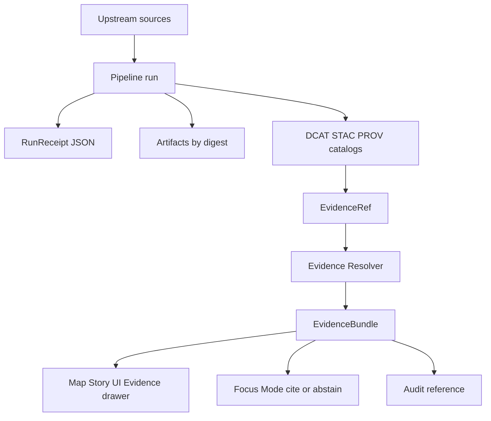

<!-- [KFM_META_BLOCK_V2]
doc_id: kfm://doc/65ba7e3a-ed3f-4d3d-89ba-ef3127e64317
title: Evidence Schemas
type: standard
version: v1
status: draft
owners: TBD (Evidence / Governance maintainers)
created: 2026-02-25
updated: 2026-02-25
policy_label: public
related:
  - packages/evidence/README.md
  - docs/governance/*
tags: [kfm, evidence, schemas, contracts]
notes:
  - Keep this file contract-first: describe schema intent + invariants + validation workflow.
  - Update the schema registry table to match actual filenames in this directory.
[/KFM_META_BLOCK_V2] -->

# Evidence Schemas
**Purpose:** Contract-first JSON Schemas for KFM “evidence surfaces” (EvidenceRef → EvidenceBundle, policy decisions, run receipts, promotion manifests). These schemas are designed to be validated **both in CI and at runtime** and to support “fail-closed” governance.


<!-- TODO: replace CI badge with a real GitHub Actions badge once workflow name/path is known -->

**Where this fits:** `packages/evidence/schemas/` is the canonical home for evidence-related contract definitions consumed by:
- the **evidence resolver** (API contract),
- pipeline + catalog tooling (producing run receipts / manifests),
- UI/Focus Mode (rendering evidence cards + enforcing cite-or-abstain).

---

## Quick navigation
- [What belongs here](#what-belongs-here)
- [How evidence flows](#how-evidence-flows)
- [Core objects](#core-objects)
- [EvidenceRef schemes](#evidenceref-schemes)
- [Schema registry](#schema-registry)
- [Validation](#validation)
- [Adding or changing schemas](#adding-or-changing-schemas)
- [Definition of Done](#definition-of-done)
- [References](#references)

---

## What belongs here

### ✅ Acceptable inputs
Place **contract artifacts** here:
- JSON Schema files for evidence objects (`*.schema.json` recommended)
- Example/fixture payloads used for validation (`fixtures/valid/*`, `fixtures/invalid/*`)
- Schema metadata such as a lightweight registry index (optional but recommended)

### ❌ Exclusions
Do **not** put operational data or real datasets here:
- no real run receipts from production
- no raw/processed artifacts (parquet/csv/cog)
- no secrets, tokens, credentials, or policy rule bundles (policy-as-code belongs elsewhere)

> WARNING: If you add examples, keep them synthetic and policy-safe. Anything that could expose sensitive locations or attributes must be generalized/redacted by default.

[Back to top](#evidence-schemas)

---

## How evidence flows



Key contract idea:
- Runtime surfaces should not “guess.” EvidenceRefs must resolve deterministically through catalogs/provenance into a policy-checked EvidenceBundle.

[Back to top](#evidence-schemas)

---

## Core objects

These are the **minimum** contract shapes this directory should cover.

| Object | Role in the system | Produced by | Consumed by |
|---|---|---|---|
| `EvidenceRef` | A stable, structured pointer to evidence (may be scheme-based like `stac://...`) | UI, Story nodes, Focus queries, pipeline outputs | Evidence resolver |
| `EvidenceBundle` | Resolver output: human card + machine metadata + digests + audit refs | Evidence resolver | UI + Focus Mode + export surfaces |
| `PolicyDecision` | Allow/deny + obligations + reason codes (audit + UX) | Policy engine | Resolver, promotion gate, runtime |
| `RunReceipt` | Append-only receipt for pipeline runs (inputs/outputs/env/validation/policy) | Pipelines + Focus Mode | Lineage view, audit ledger |
| `PromotionManifest` | “This dataset version may ship” manifest including digests, catalogs, QA, approvals | Promotion tooling | Release/publish gates |

> NOTE: The contract is the “trust membrane.” If a consumer needs a field, it must be in schema + fixtures, not tribal knowledge.

[Back to top](#evidence-schemas)

---

## EvidenceRef schemes

EvidenceRef may be encoded as a scheme URI (or as a structured object that contains equivalent parts). Minimum schemes to support deterministic resolution:

- `dcat://...` → dataset/distribution metadata
- `stac://...` → collection/item/asset metadata
- `prov://...` → run lineage (activities/entities/agents)
- `doc://...` → governed documents + story citations
- `graph://...` → entity relations (if enabled)

Recommended rule: **don’t introduce a new scheme** without:
1) a resolver implementation,
2) schema + fixtures,
3) a catalog/provenance linkage story (how it resolves without guessing).

[Back to top](#evidence-schemas)

---

## Schema registry

> TODO (required): Update this table to match the actual filenames in this directory.

| Schema file (expected) | Status | What it validates | Compatibility notes |
|---|---:|---|---|
| `evidence_ref.schema.json` | TBD | EvidenceRef (scheme URI + optional structured form) | Prefer additive evolution; breaking changes require major bump |
| `evidence_bundle.schema.json` | TBD | EvidenceBundle returned by resolver | Must be policy-safe by construction |
| `policy_decision.schema.json` | TBD | PolicyDecision allow/deny + obligations | Obligations must be machine-actionable |
| `run_receipt.schema.json` | TBD | RunReceipt for pipelines + Focus Mode | Treat as append-only, audit-grade |
| `promotion_manifest.schema.json` | TBD | PromotionManifest for shipping dataset versions | Must include digests + approvals |

Example directory layout (update to match repo):

```text
packages/evidence/schemas/
  README.md
  *.schema.json
  fixtures/
    valid/
      *.json
    invalid/
      *.json
```

[Back to top](#evidence-schemas)

---

## Canonical example shapes

These examples are intended to match the governing templates used across KFM.

### EvidenceBundle (example)
```json
{
  "bundle_id": "sha256:bundle...",
  "dataset_version_id": "2026-02.abcd1234",
  "title": "Storm event record: 2026-02-19",
  "policy": {
    "decision": "allow",
    "policy_label": "public",
    "obligations_applied": []
  },
  "license": { "spdx": "CC-BY-4.0", "attribution": "Source org" },
  "provenance": { "run_id": "kfm://run/2026-02-20T12:00:00Z.abcd" },
  "artifacts": [
    {
      "href": "processed/events.parquet",
      "digest": "sha256:2222",
      "media_type": "application/x-parquet"
    }
  ],
  "checks": { "catalog_valid": true, "links_ok": true },
  "audit_ref": "kfm://audit/entry/123"
}
```

### PolicyDecision (example)
```json
{
  "decision_id": "kfm://policy_decision/xyz",
  "policy_label": "restricted",
  "decision": "deny",
  "reason_codes": ["SENSITIVE_SITE", "RIGHTS_UNCLEAR"],
  "obligations": [
    { "type": "generalize_geometry", "min_cell_size_m": 5000 },
    { "type": "remove_attributes", "fields": ["exact_location", "owner_name"] }
  ],
  "evaluated_at": "2026-02-20T12:00:00Z",
  "rule_id": "deny.restricted_dataset.default"
}
```

### RunReceipt (example)
```json
{
  "run_id": "kfm://run/2026-02-20T12:00:00Z.abcd",
  "actor": { "principal": "svc:pipeline", "role": "pipeline" },
  "operation": "ingest+publish",
  "dataset_version_id": "2026-02.abcd1234",
  "inputs": [{ "uri": "raw/source.csv", "digest": "sha256:1111" }],
  "outputs": [{ "uri": "processed/events.parquet", "digest": "sha256:2222" }],
  "environment": {
    "container_digest": "sha256:img...",
    "git_commit": "deadbeef",
    "params_digest": "sha256:3333"
  },
  "validation": { "status": "pass", "report_digest": "sha256:7777" },
  "policy": { "decision_id": "kfm://policy_decision/xyz" },
  "created_at": "2026-02-20T12:05:00Z"
}
```

### PromotionManifest (example)
```json
{
  "kfm_promotion_manifest_version": "v1",
  "dataset_slug": "example_dataset",
  "dataset_version_id": "2026-02.abcd1234",
  "spec_hash": "sha256:abcd1234",
  "released_at": "2026-02-20T13:00:00Z",
  "artifacts": [
    { "path": "events.parquet", "digest": "sha256:2222", "media_type": "application/x-parquet" }
  ],
  "catalogs": [
    { "path": "dcat.jsonld", "digest": "sha256:4444" },
    { "path": "stac/collection.json", "digest": "sha256:5555" }
  ],
  "qa": { "status": "pass", "report_digest": "sha256:7777" },
  "policy": { "policy_label": "public", "decision_id": "kfm://policy_decision/xyz" },
  "approvals": [
    { "role": "steward", "principal": "<id>", "approved_at": "2026-02-20T12:59:00Z" }
  ]
}
```

[Back to top](#evidence-schemas)

---

## Validation

### Goals
- **One contract, two enforcement points:** validate in CI *and* validate at runtime.
- **Fail closed:** invalid payloads or unresolvable EvidenceRefs must not ship and must not render.

### Suggested wiring (adjust to your tooling)
> TODO: Replace these commands with the repo’s actual package manager + scripts.

```bash
# Example: validate all fixtures against schemas
pnpm -C packages/evidence run validate:schemas

# Example: run only schema tests (if a dedicated script exists)
pnpm -C packages/evidence test --filter schemas
```

### Suggested `package.json` scripts (illustrative)
```json
{
  "scripts": {
    "validate:schemas": "node ./tools/validate-schemas.js"
  }
}
```

Implementation note (recommended): a validator should:
- load all `*.schema.json` from this directory,
- validate all `fixtures/valid/*.json` as pass,
- validate all `fixtures/invalid/*.json` as fail,
- run in CI and block merges on any mismatch.

[Back to top](#evidence-schemas)

---

## Adding or changing schemas

### Workflow
1. **Add / modify schema** (`*.schema.json`)
2. **Add fixtures**
   - at least 1 passing example in `fixtures/valid/`
   - at least 1 failing example in `fixtures/invalid/` that demonstrates the rule
3. **Update the schema registry** table in this README
4. **Ensure downstream compatibility**
   - if breaking: bump major and document migration
   - if additive: ensure older producers remain valid
5. **Run CI** and confirm “fail-closed” behavior

### Design rules
- Prefer **digest-addressed artifacts** and stable IDs.
- Keep policy evaluation explicit (`decision_id`, `policy_label`, `obligations_applied`).
- Never require clients to infer rights/sensitivity—contracts must carry the necessary info.

[Back to top](#evidence-schemas)

---

## Definition of Done

- [ ] Schema updated/added with clear description + examples
- [ ] Fixtures added for valid + invalid cases
- [ ] Validation wired into CI (blocking)
- [ ] Consumer impact reviewed (resolver, UI evidence drawer, Focus Mode)
- [ ] No sensitive data leaks in examples; defaults are policy-safe
- [ ] README registry table updated

[Back to top](#evidence-schemas)

---

## References

- KFM blueprint templates: EvidenceBundle, PolicyDecision, RunReceipt, PromotionManifest
- KFM governance guide: catalogs/provenance as contract surfaces + evidence resolver contract
